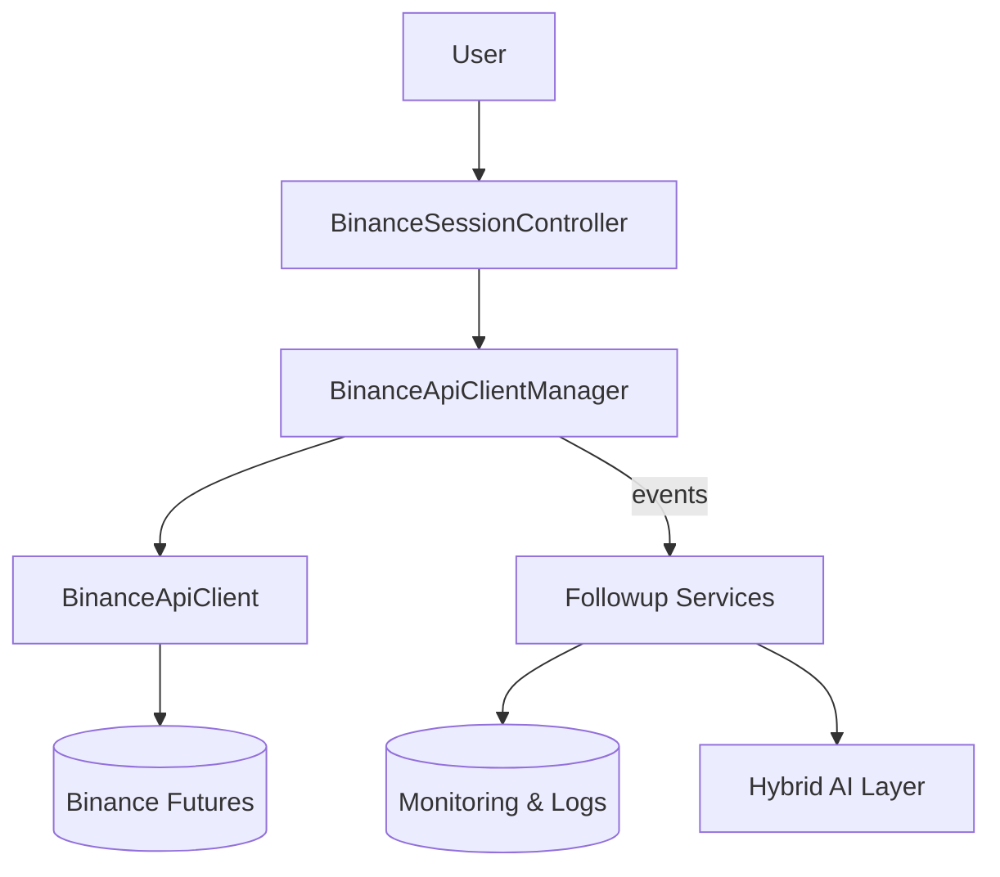
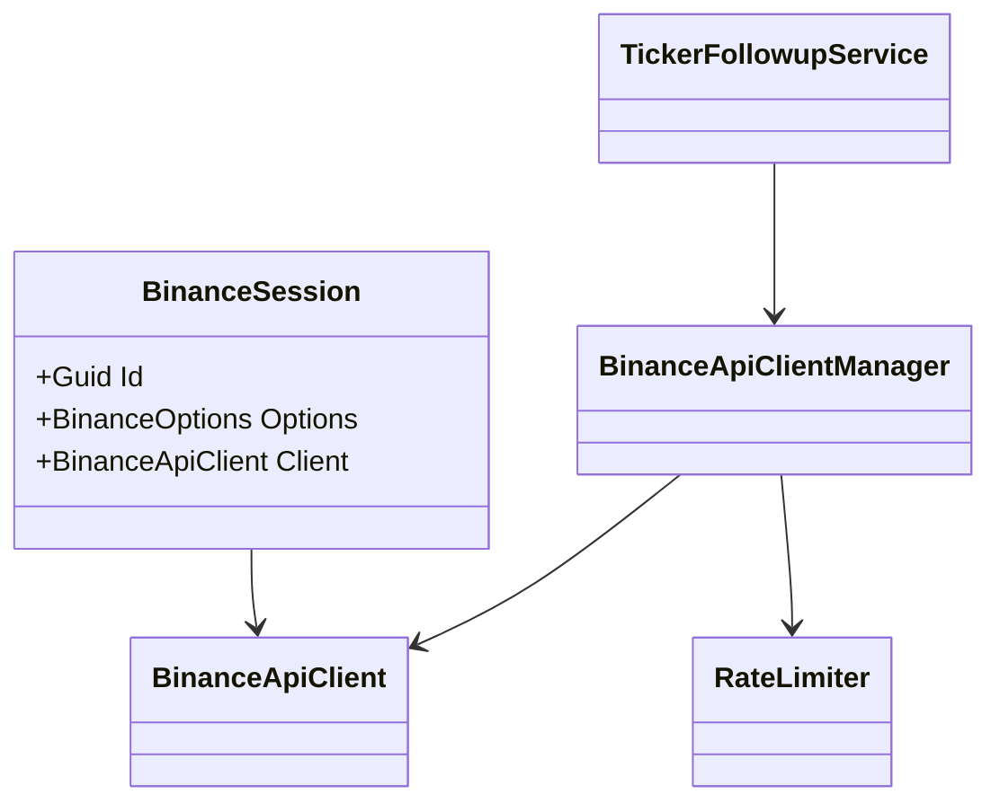
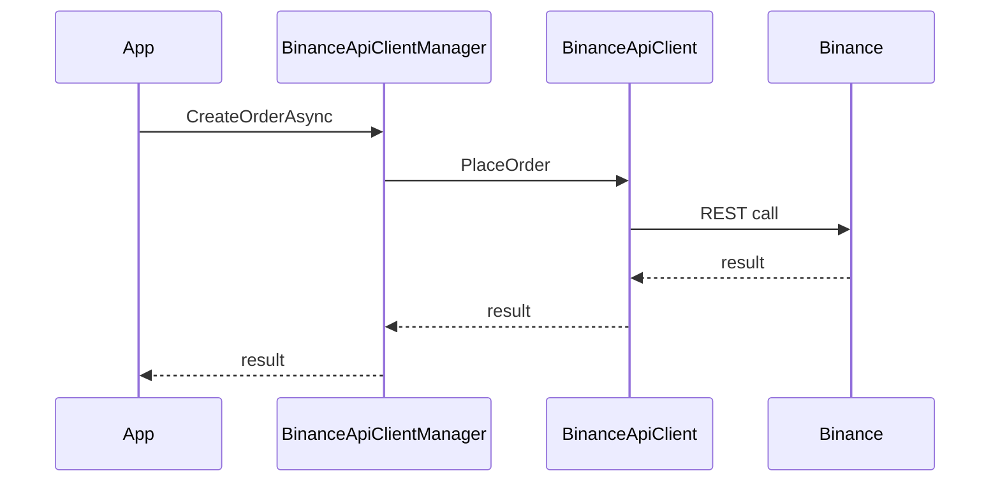

# Ark.Api.Binance

## Introduction
Ark.Api.Binance is a .NET 9 library exposing a high level wrapper over the Binance Futures REST and WebSocket APIs. The project follows Domain‑Driven Design, Event‑Driven and Clean Architecture principles to provide reliable and extensible access to the exchange. Each session maintains its own API credentials and rate limiters. A hybrid human/AI layer allows behaviour evolution through YAML/JSON definitions and dialogue. *(Reference date: July 21, 2025)*


## Index
1. [General Description](#general-description)
2. [Project Structure](#project-structure)
3. [Functional Diagram](#functional-diagram)
4. [Class Diagram](#class-diagram)
5. [UML Sequence Diagram](#uml-sequence-diagram)
6. [Code Examples](#code-examples)
7. [Module Table](#module-table)
8. [Dependencies](#dependencies)
9. [Licenses and Acknowledgments](#licenses-and-acknowledgments)
10. [Release](#release)

## General Description
### Main Features
- **Session Management** – independent sessions with automatic retries.
- **Order Operations** – place, modify and cancel futures orders via `OrderBusiness`.
- **Data Follow Up** – background services track tickers, orders and positions.
- **Rate Limiting** – `EnhancedRateLimiter` uses backoff and jitter to handle limits proactively.
- **Environment & Logging** – switch between Testnet or Production and configure log level.
- **Aggregated Views** – `SessionOverviewHelper` provides high level snapshots.

### Use Cases
1. Building automated trading bots with resilient connectivity.
2. Pausing or resuming bots based on rate limit usage retrieved from this library.
3. Monitoring orders and positions for risk management dashboards.
4. Educational tools that replay trading data in real time.
5. Integrating the library with Ark.ProcessEngine for scripted actions.

## Project Structure
```
Business/              # Domain entry points
Clients/               # REST and WebSocket wrappers
Database/              # EF Core models and repositories
Dto/                   # Data transfer objects
Helpers/               # Utility classes (rate limiter, etc.)
Mapper/                # AutoMapper profiles
Services/              # Hosted background services
Settings/              # Configuration objects
```
### Compliance
- **DDD** – business logic encapsulated in the `Business` layer and DTOs.
- **Event‑Driven** – follow‑up services emit logs and events for other modules.
- **Clean Architecture** – clear separation between application, infrastructure and domain concerns.

## Functional Diagram


## Class Diagram


## UML Sequence Diagram


## Code Examples
```csharp
// Create a new session from options
var options = new BinanceOptions {
    ApiKey = "key",
    ApiSecret = "secret",
    RetryCount = 3
};
var id = SessionBusiness.CreateSession(options).Data;
```
```json
// JSON evolution example (CreateSession.example.json)
{
  "ApiKey": "YOUR_API_KEY",
  "ApiSecret": "YOUR_API_SECRET",
  "Services": { "TickerFollowup": { "IsEnabled": true } }
}
```
```csharp
// Retrieve aggregated session overview
var overview = await SessionBusiness.GetSessionOverviewAsync(id, TimeWindow.Hour);
```
```csharp
// Cancel an existing order
await OrderBusiness.CancelOrderAsync(id, orderId, CancellationToken.None);
```

## Module Table
| Module | Description |
|--------|-------------|
| **Business** | High level operations such as creating sessions and placing orders |
| **Clients** | Wrappers around Binance REST and WebSocket APIs |
| **Services** | Hosted services to monitor tickers, orders and positions |
| **Database** | Entity Framework models and caches |

## Dependencies
- .NET 9
- [Binance.Net 11.4.0](https://github.com/JKorf/Binance.Net)
- [Microsoft.Extensions.Resilience 9.7.0](https://learn.microsoft.com/dotnet/)
- Ark.App.Diagnostics

## Licenses and Acknowledgments
Ark.Api.Binance is released under the MIT license. Third‑party libraries include:
- Binance.Net under MIT
- Microsoft.Extensions.Resilience under MIT

For integrity, please cite all sources and licenses in your projects. This README was partially generated with the assistance of Grok (xAI) and manually reviewed for accuracy.

## Release
- Initial documentation aligned with Update_Doc_ReadmePrompt.md – July 21, 2025
- Restructured documentation with rate limit usage notes – July 21, 2025

Armand Richelet-Kleinberg

## Codex Prompts
```
Review this README and the solution README before modifying the Binance API wrapper.
Run `dotnet format`, `dotnet build` and `dotnet test` after changes and report any failures.
```

### Codex Negative Prompt
```
Do not invent Binance endpoints or alter trading logic.
Never commit credentials or generated artifacts and keep TODO comments until resolved.
```

## Task List
| # | Task | Status | Notes |
|---|------|-------|------|
|1|Replace `double` with `decimal` for financial calculations|Open|All tasks ready for development when achieved|
|2|Optimize HTTP client configuration and memory usage|Open|All tasks ready for development when achieved|
|3|Improve XML documentation for public members|Open|All tasks ready for development when achieved|
|4|Implement missing methods in `CircuitBreakerPolicy`|Closed|Ensures state transitions are handled correctly|
