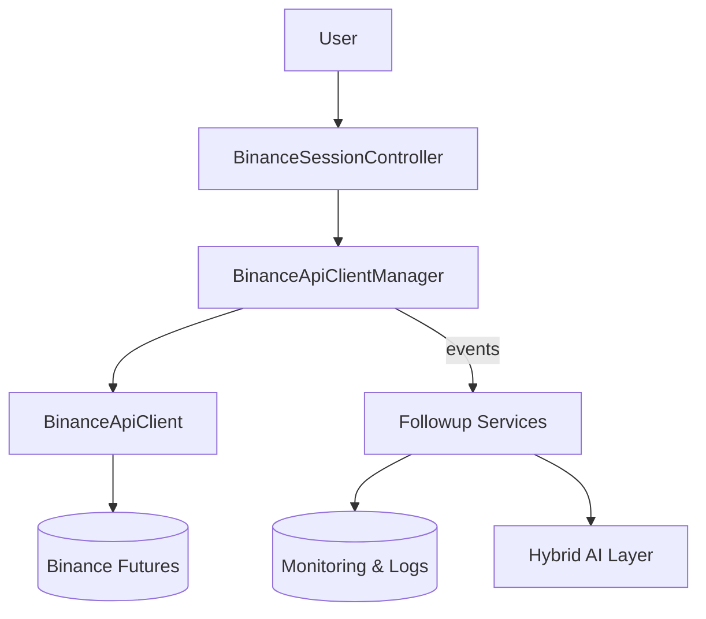
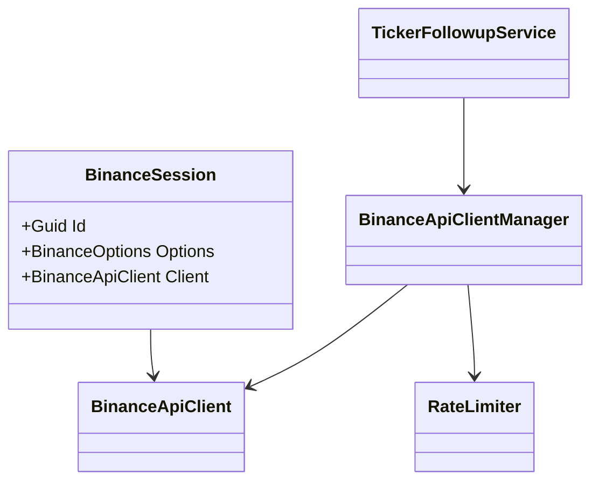
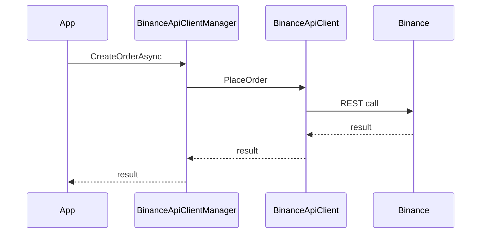

# Code Structure Analysis

**Generated on:** 2025-08-09 23:24:15
**Root Directory:** `C:\Users\ARKle\source\repos\Ark.Alliance.Trading\Ark.Api.Binance`
**Comment Processing:** Comments Preserved
**Markdown Included:** README.md only
**JavaScript/JSX:** Excluded
**Analysis Tool:** Code Structure and Content Analyzer (v3)

---

## 📊 Project Statistics

- **Total Directories (with files):** 18
- **Total Included Files:** 109
- **Total Size:** 294.0 KB

### File Type Breakdown

- **.cs**: 106 files
- **.csproj**: 1 files
- **.json**: 1 files
- **.md**: 1 files

---

## 📁 Directory Structure (Included Files)

```
Ark.Api.Binance/
├── Business/
│   ├── AccountBusiness.cs (1.8 KB)
│   ├── OrderBusiness.cs (4.0 KB)
│   ├── SessionBusiness.cs (4.1 KB)
│   └── WalletBusiness.cs (2.9 KB)
├── Clients/
│   ├── BinanceApiClient.cs (24.6 KB)
│   └── BinanceApiClientManager.cs (10.1 KB)
├── Controllers/
│   ├── FeeRulesController.cs (3.1 KB)
│   ├── MarginController.cs (1.6 KB)
│   ├── RateLimitRulesController.cs (1.3 KB)
│   └── RateLimitSimulationController.cs (983 B)
├── Database/
│   ├── Caches/
│   │   └── BinanceSessionManagerCache.cs (2.5 KB)
│   ├── Context/
│   │   └── BinanceDbContext.cs (768 B)
│   ├── Entities/
│   │   ├── BinanceSessionDbEntity.cs (2.2 KB)
│   │   ├── FeeRulesDbEntity.cs (4.6 KB)
│   │   ├── IncomeDbEntity.cs (2.6 KB)
│   │   ├── LatencyMeasurementDbEntity.cs (4.5 KB)
│   │   ├── OrderDbEntity.cs (3.4 KB)
│   │   ├── PositionDbEntity.cs (2.8 KB)
│   │   ├── RateLimitRulesDbEntity.cs (3.7 KB)
│   │   ├── TickerDbEntity.cs (1.8 KB)
│   │   └── TradeDbEntity.cs (3.1 KB)
│   └── Services/
│       ├── BinanceEntityDbServices.cs (1.3 KB)
│       ├── BinanceSessionDbServices.cs (2.5 KB)
│       ├── FeeRulesDbServices.cs (2.1 KB)
│       ├── IncomeDbServices.cs (2.0 KB)
│       ├── LatencyMeasurementDbServices.cs (2.7 KB)
│       ├── OrderDbServices.cs (2.0 KB)
│       ├── PositionDbServices.cs (2.0 KB)
│       ├── RateLimitRulesDbServices.cs (2.2 KB)
│       ├── TickerDbServices.cs (2.0 KB)
│       └── TradeDbServices.cs (2.0 KB)
├── Documentation/
│   └── CreateSession.example.json (1.0 KB)
├── Dto/
│   ├── ClickOptimizationResultDto.cs (858 B)
│   ├── FeeBreakdownDto.cs (562 B)
│   ├── FeeRulesDto.cs (412 B)
│   ├── FuturesBalanceDto.cs (859 B)
│   ├── IncomeSummaryDto.cs (1.3 KB)
│   ├── MarginRequirementDto.cs (935 B)
│   ├── MarginRequirementRequest.cs (934 B)
│   ├── OptimizeClickRequest.cs (924 B)
│   ├── OrderResultDto.cs (776 B)
│   ├── PositionDto.cs (1015 B)
│   ├── RateLimitRulesDto.cs (602 B)
│   ├── RateLimitSimulationRequestDto.cs (644 B)
│   ├── RateLimitSimulationResponseDto.cs (838 B)
│   ├── RateLimitUsageDto.cs (730 B)
│   ├── SessionOverviewDto.cs (1.4 KB)
│   ├── TickerDto.cs (570 B)
│   └── TradeHistoryDto.cs (1.7 KB)
├── Helpers/
│   ├── Diagnostics/
│   │   ├── Diag.cs (1.1 KB)
│   │   ├── Indicators.cs (451 B)
│   │   ├── LatencyTrackerExtensions.cs (1.3 KB)
│   │   ├── LevelFilteredLogger.cs (922 B)
│   │   ├── Loggers.cs (1.3 KB)
│   │   └── Reports.cs (437 B)
│   ├── AccountHelper.cs (1.7 KB)
│   ├── CircuitBreaker.cs (15.7 KB)
│   ├── EnhancedRateLimiter.cs (7.6 KB)
│   ├── OrderHelper.cs (4.9 KB)
│   ├── PositionHelper.cs (1.6 KB)
│   ├── SessionOverviewHelper.cs (7.4 KB)
│   ├── WalletHelper.cs (1.1 KB)
│   └── WebSocketHelper.cs (730 B)
├── Mapper/
│   ├── IncomeMapper.cs (1.7 KB)
│   ├── OrderMapper.cs (2.3 KB)
│   ├── PositionMapper.cs (1.8 KB)
│   ├── TickerMapper.cs (1.4 KB)
│   └── TradeMapper.cs (2.0 KB)
├── Models/
│   ├── BinanceEnvironment.cs (355 B)
│   ├── BinanceSession.cs (2.1 KB)
│   ├── CompleteTradeFees.cs (601 B)
│   ├── FuturesOrder.cs (1.7 KB)
│   ├── LimitInfo.cs (777 B)
│   ├── UpdateFeeRulesRequest.cs (429 B)
│   ├── UpdateRateLimitsRequest.cs (611 B)
│   └── ValidateProfitabilityRequest.cs (778 B)
├── Resilience/
│   ├── Stubs/
│   │   ├── ResiliencePipeline.cs (2.2 KB)
│   │   ├── ResiliencePipelineBuilder.cs (1.9 KB)
│   │   ├── ResiliencePipelineGeneric.cs (2.2 KB)
│   │   ├── ResiliencePipelineProvider.cs (2.3 KB)
│   │   └── RetryOptions.cs (697 B)
│   ├── BulkheadPolicy.cs (1.9 KB)
│   ├── CircuitBreakerOpenException.cs (335 B)
│   ├── CircuitBreakerPolicy.cs (4.4 KB)
│   ├── CircuitState.cs (544 B)
│   ├── CircuitStateChangedEventArgs.cs (991 B)
│   ├── RealResiliencePipeline.cs (4.8 KB)
│   └── RetryPolicy.cs (4.8 KB)
├── Services/
│   ├── FeeCalculationService.cs (9.3 KB)
│   ├── FeeRulesService.cs (2.4 KB)
│   ├── LatencyManagementService.cs (6.1 KB)
│   ├── LatencyMeasurement.cs (2.6 KB)
│   ├── LatencyOptions.cs (1.8 KB)
│   ├── LatencyTracker.cs (3.3 KB)
│   ├── OrderFollowupService.cs (7.2 KB)
│   ├── PositionFollowupService.cs (7.6 KB)
│   ├── RateLimitAnalyzer.cs (4.1 KB)
│   ├── RateLimitRulesService.cs (2.7 KB)
│   ├── RateLimitSimulationService.cs (1.7 KB)
│   ├── TickerFollowupService.cs (6.8 KB)
│   └── WebSocketManager.cs (13.1 KB)
├── Settings/
│   ├── BinanceOptions.cs (2.7 KB)
│   ├── BinanceServiceSettings.cs (956 B)
│   ├── ILoggingOptions.cs (353 B)
│   ├── OrderFollowupSettings.cs (216 B)
│   ├── PositionFollowupSettings.cs (222 B)
│   └── TickerFollowupSettings.cs (977 B)
├── Ark.Api.Binance.csproj (1.4 KB)
└── README.md (5.9 KB)
```

---

## 💻 File Contents

Complete content of all included files (with comments):

### Root Directory

**Full Path:** `C:\Users\ARKle\source\repos\Ark.Alliance.Trading\Ark.Api.Binance`
**Files:** 2

#### 💾 Ark.Api.Binance.csproj

**File Path:** `Ark.Api.Binance.csproj`
**File Type:** .CSPROJ (xml)

```xml
<Project Sdk="Microsoft.NET.Sdk">
  <PropertyGroup>
    <AssemblyName>Ark.Api.Binance</AssemblyName>
    <RootNamespace>Ark.Api.Binance</RootNamespace>
    <TargetFramework>net9.0</TargetFramework>
    <ImplicitUsings>enable</ImplicitUsings>
    <Nullable>enable</Nullable>
    <GenerateDocumentationFile>true</GenerateDocumentationFile>
    <LangVersion>latest</LangVersion>
    <Version>1.0.0</Version>
    <Authors>Armand Richelet-Kleinberg</Authors>
    <Company>M2H.IO</Company>
    <PackageLicenseExpression>MIT</PackageLicenseExpression>
    <Description>Binance API client wrapper.</Description>
    <GenerateErrorForMissingTargetingPacks>false</GenerateErrorForMissingTargetingPacks>
    <DocumentationFile>Ark.Api.Binance.xml</DocumentationFile>
  </PropertyGroup>
  <ItemGroup>
    <PackageReference Include="Binance.Net" Version="11.4.0" />
    <PackageReference Include="Microsoft.Extensions.Resilience" Version="9.7.0" />
  </ItemGroup>
  <ItemGroup>
    <FrameworkReference Include="Microsoft.AspNetCore.App" PrivateAssets="all" />
  </ItemGroup>
  <ItemGroup>
    <ProjectReference Include="..\Ark.App\Ark.App.Diagnostics\Ark.App.Diagnostics.csproj" />
  </ItemGroup>
  
  <PropertyGroup Condition="'$(Configuration)'=='Debug'">
    <Optimize>false</Optimize>
  </PropertyGroup>
  <PropertyGroup Condition="'$(Configuration)'=='Release'">
    <Optimize>true</Optimize>
  </PropertyGroup>
</Project>

```

---

#### 💾 README.md

**File Path:** `README.md`
**File Type:** .MD (markdown)

```markdown
# Ark.Api.Binance

## Introduction
Ark.Api.Binance is a .NET 9 library exposing a high level wrapper over the Binance Futures REST and WebSocket APIs. The project follows Domain‑Driven Design, Event‑Driven and Clean Architecture principles to provide reliable and extensible access to the exchange. Each session maintains its own API credentials and rate limiters. A hybrid human/AI layer allows behaviour evolution through YAML/JSON definitions and dialogue. *(Reference date: July 21, 2025)*


## Index
1. [General Description](#general-description)
2. [Project Structure](#project-structure)
3. [Functional Diagram](#functional-diagram)
4. [Class Diagram](#class-diagram)
5. [UML Sequence Diagram](#uml-sequence-diagram)
6. [Code Examples](#code-examples)
7. [Module Table](#module-table)
8. [Dependencies](#dependencies)
9. [Licenses and Acknowledgments](#licenses-and-acknowledgments)
10. [Release](#release)

## General Description
### Main Features
- **Session Management** – independent sessions with automatic retries.
- **Order Operations** – place, modify and cancel futures orders via `OrderBusiness`.
- **Data Follow Up** – background services track tickers, orders and positions.
- **Rate Limiting** – `EnhancedRateLimiter` uses backoff and jitter to handle limits proactively.
- **Environment & Logging** – switch between Testnet or Production and configure log level.
- **Aggregated Views** – `SessionOverviewHelper` provides high level snapshots.

### Use Cases
1. Building automated trading bots with resilient connectivity.
2. Pausing or resuming bots based on rate limit usage retrieved from this library.
3. Monitoring orders and positions for risk management dashboards.
4. Educational tools that replay trading data in real time.
5. Integrating the library with Ark.ProcessEngine for scripted actions.

## Project Structure
```
Business/              # Domain entry points
Clients/               # REST and WebSocket wrappers
Database/              # EF Core models and repositories
Dto/                   # Data transfer objects
Helpers/               # Utility classes (rate limiter, etc.)
Mapper/                # AutoMapper profiles
Services/              # Hosted background services
Settings/              # Configuration objects
```
### Compliance
- **DDD** – business logic encapsulated in the `Business` layer and DTOs.
- **Event‑Driven** – follow‑up services emit logs and events for other modules.
- **Clean Architecture** – clear separation between application, infrastructure and domain concerns.

## Functional Diagram


## Class Diagram


## UML Sequence Diagram


## Code Examples
```csharp
// Create a new session from options
var options = new BinanceOptions {
    ApiKey = "key",
    ApiSecret = "secret",
    RetryCount = 3
};
var id = SessionBusiness.CreateSession(options).Data;
```
```json
// JSON evolution example (CreateSession.example.json)
{
  "ApiKey": "YOUR_API_KEY",
  "ApiSecret": "YOUR_API_SECRET",
  "Services": { "TickerFollowup": { "IsEnabled": true } }
}
```
```csharp
// Retrieve aggregated session overview
var overview = await SessionBusiness.GetSessionOverviewAsync(id, TimeWindow.Hour);
```
```csharp
// Cancel an existing order
await OrderBusiness.CancelOrderAsync(id, orderId, CancellationToken.None);
```

## Module Table
| Module | Description |
|--------|-------------|
| **Business** | High level operations such as creating sessions and placing orders |
| **Clients** | Wrappers around Binance REST and WebSocket APIs |
| **Services** | Hosted services to monitor tickers, orders and positions |
| **Database** | Entity Framework models and caches |

## Dependencies
- .NET 9
- [Binance.Net 11.4.0](https://github.com/JKorf/Binance.Net)
- [Microsoft.Extensions.Resilience 9.7.0](https://learn.microsoft.com/dotnet/)
- Ark.App.Diagnostics

## Licenses and Acknowledgments
Ark.Api.Binance is released under the MIT license. Third‑party libraries include:
- Binance.Net under MIT
- Microsoft.Extensions.Resilience under MIT

For integrity, please cite all sources and licenses in your projects. This README was partially generated with the assistance of Grok (xAI) and manually reviewed for accuracy.

## Release
- Initial documentation aligned with Update_Doc_ReadmePrompt.md – July 21, 2025
- Restructured documentation with rate limit usage notes – July 21, 2025

Armand Richelet-Kleinberg

## Codex Prompts
```
Review this README and the solution README before modifying the Binance API wrapper.
Run `dotnet format`, `dotnet build` and `dotnet test` after changes and report any failures.
```

### Codex Negative Prompt
```
Do not invent Binance endpoints or alter trading logic.
Never commit credentials or generated artifacts and keep TODO comments until resolved.
```

```

---

### Directory: Business

**Full Path:** `C:\Users\ARKle\source\repos\Ark.Alliance.Trading\Ark.Api.Binance\Business`
**Files:** 4

#### 💾 AccountBusiness.cs

**File Path:** `Business\AccountBusiness.cs`
**File Type:** .CS (csharp)

```csharp
using System;
using System.Threading.Tasks;


namespace Ark.Api.Binance
{
    /// <summary>
    /// Provides account level operations.
    /// + Adjusts trading parameters for a <see cref="BinanceSession"/>.
    /// - Does not create sessions automatically when missing.
    /// Ref: <see href="https://binance-docs.github.io/apidocs/futures/en/#change-initial-leverage-trade"/>
    /// </summary>
    public static class AccountBusiness
    {
        #region Methods

        /// <summary>
        /// Changes the leverage for a symbol on an existing session via
        /// <see cref="BinanceSession.ChangeLeverageAsync"/>.
        /// + Allows dynamic risk adjustment per symbol.
        /// - Returns <see cref="Result.NotFound"/> if the session is absent in
        ///   <see cref="BinanceSessionManagerCache"/>.
        /// Ref: <see href="https://binance-docs.github.io/apidocs/futures/en/#change-initial-leverage-trade"/>
        /// </summary>
        /// <param name="sessionId">Identifier of the session using standard GUID format.</param>
        /// <param name="symbol">Trading pair symbol, e.g. "BTCUSDT".</param>
        /// <param name="leverage">Desired leverage level in integer form.</param>
        /// <returns>
        /// A <see cref="Result"/> indicating success or failure.
        /// Example JSON:
        /// {
        ///   "Status": "Success"
        /// }
        /// </returns>
        public static Task<Result> ChangeLeverageAsync(System.Guid sessionId, string symbol, int leverage)
        {
            if (!BinanceSessionManagerCache.TryGetSession(sessionId, out var session))
                return Task.FromResult(Result.NotFound);

            return session.ChangeLeverageAsync(symbol, leverage);
        }

        #endregion Methods
    }
}

```

---

#### 💾 OrderBusiness.cs

**File Path:** `Business\OrderBusiness.cs`
**File Type:** .CS (csharp)

```csharp
using System;
using System.Threading.Tasks;

using Ark;

namespace Ark.Api.Binance
{
    /// <summary>
    /// Provides order management operations for Binance futures.
    /// + Wraps order endpoints with session cache lookups.
    /// - Requires an existing session; none are created on demand.
    /// Ref: <see href="https://binance-docs.github.io/apidocs/futures/en/#new-order-trade"/>
    /// </summary>
    public static class OrderBusiness
    {
        #region Methods (Public)

        /// <summary>
        /// Places a futures order on an existing session.
        /// + Applies session-level rate limit checks before forwarding to Binance.
        /// - Returns <see cref="ResultStatus.NotFound"/> if the session is missing.
        /// Ref: <see href="https://binance-docs.github.io/apidocs/futures/en/#new-order-trade"/>
        /// </summary>
        /// <param name="sessionId">Identifier of the session using standard GUID format.</param>
        /// <param name="order">Order parameters.</param>
        /// <returns>
        /// The created order result or <see cref="ResultStatus.NotFound"/>.
        /// Example JSON:
        /// {
        ///   "OrderId": 123456,
        ///   "Status": "New"
        /// }
        /// </returns>
        public static Task<Result<OrderResultDto>> PlaceOrderAsync(System.Guid sessionId, FuturesOrder order)
        {
            if (!BinanceSessionManagerCache.TryGetSession(sessionId, out var session))
                return Task.FromResult(Result<OrderResultDto>.NotFound);

            return session.PlaceOrderAsync(order);
        }

        /// <summary>
        /// Replaces an order by cancelling it and creating a new one.
        /// + Maintains atomicity by using a cancel/replace pattern.
        /// - Fails with <see cref="ResultStatus.NotFound"/> if the session is missing.
        /// Ref: <see href="https://binance-docs.github.io/apidocs/futures/en/#cancel-replace-order-trade"/>
        /// </summary>
        /// <param name="sessionId">Identifier of the session using standard GUID format.</param>
        /// <param name="orderId">Identifier of the order to replace.</param>
        /// <param name="order">New order parameters.</param>
        /// <returns>
        /// The newly placed order result or <see cref="ResultStatus.NotFound"/>.
        /// Example JSON:
        /// {
        ///   "OrderId": 123457,
        ///   "Status": "Replaced"
        /// }
        /// </returns>
        public static Task<Result<OrderResultDto>> ModifyOrderAsync(System.Guid sessionId, long orderId, FuturesOrder order)
        {
            if (!BinanceSessionManagerCache.TryGetSession(sessionId, out var session))
                return Task.FromResult(Result<OrderResultDto>.NotFound);

            return session.ModifyOrderAsync(orderId, order);
        }

        /// <summary>
        /// Cancels an existing order.
        /// + Releases margin by removing pending orders.
        /// - Returns <see cref="ResultStatus.NotFound"/> when the session is absent.
        /// Ref: <see href="https://binance-docs.github.io/apidocs/futures/en/#cancel-order-trade"/>
        /// </summary>
        /// <param name="sessionId">Identifier of the session using standard GUID format.</param>
        /// <param name="symbol">Trading symbol such as "BTCUSDT".</param>
        /// <param name="orderId">Order identifier from Binance.</param>
        /// <returns>
        /// A result describing the cancellation.
        /// Example JSON:
        /// {
        ///   "Status": "Canceled"
        /// }
        /// </returns>
        public static Task<Result> CancelOrderAsync(System.Guid sessionId, string symbol, long orderId)
        {
            if (!BinanceSessionManagerCache.TryGetSession(sessionId, out var session))
                return Task.FromResult(Result.NotFound);

            return session.CancelOrderAsync(symbol, orderId);
        }

        #endregion Methods (Public)
    }
}

```

---

#### 💾 SessionBusiness.cs

**File Path:** `Business\SessionBusiness.cs`
**File Type:** .CS (csharp)

```csharp
using System;
using System.Threading.Tasks;

using Microsoft.Extensions.Logging;
using Microsoft.Extensions.Logging.Abstractions;

namespace Ark.Api.Binance
{
    /// <summary>
    /// Provides session lifecycle operations.
    /// + Centralizes session creation and overview retrieval.
    /// - Sessions are stored in-memory and lost on application restart.
    /// Ref: <see href="https://binance-docs.github.io/apidocs/futures/en/"/>
    /// </summary>
    public static class SessionBusiness
    {
        #region Methods (Public)

        /// <summary>
        /// Creates a new Binance session.
        /// + Configures API credentials and rate limiter for isolated trading.
        /// - Returns <see cref="ResultStatus.Error"/> when options are invalid.
        /// Ref: <see href="https://binance-docs.github.io/apidocs/futures/en/"/>
        /// </summary>
        /// <param name="options">Binance configuration options.</param>
        /// <returns>
        /// The created session identifier.
        /// Example JSON:
        /// {
        ///   "SessionId": "e0a1f5d9-1c2b-4d2b-9b4f-8f7a9e3c6b2d"
        /// }
        /// </returns>
        public static Result<System.Guid> CreateSession(BinanceOptions options)
        {
            var logger = Diag.Logs?.BinanceClient ?? NullLogger.Instance;
            var id = BinanceSessionManagerCache.CreateSession(options, logger);
            return Result<System.Guid>.Success.WithData(id);
        }

        /// <summary>
        /// Gets the options used when a session was created.
        /// + Allows diagnostics of runtime configuration.
        /// - Returns <see cref="ResultStatus.NotFound"/> if the session does not exist.
        /// Ref: <see href="https://binance-docs.github.io/apidocs/futures/en/"/>
        /// </summary>
        /// <param name="id">Session identifier.</param>
        /// <returns>
        /// The stored options or <see cref="ResultStatus.NotFound"/>.
        /// Example JSON:
        /// {
        ///   "ApiKey": "YOUR_KEY"
        /// }
        /// </returns>
        public static Result<BinanceOptions> GetSessionOptions(System.Guid id)
        {
            if (!BinanceSessionManagerCache.TryGetSession(id, out var session))
                return Result<BinanceOptions>.NotFound;

            return Result<BinanceOptions>.Success.WithData(session.Options);
        }

        /// <summary>
        /// Retrieves aggregated session data including orders and positions.
        /// + Combines current positions and order metrics in a single call.
        /// - Returns <see cref="ResultStatus.NotFound"/> if the session is absent.
        /// Ref: <see href="https://binance-docs.github.io/apidocs/futures/en/"/>
        /// </summary>
        /// <param name="id">Session identifier.</param>
        /// <param name="window">Time window to filter data.</param>
        /// <returns>
        /// The session overview or <see cref="ResultStatus.NotFound"/>.
        /// Example JSON:
        /// {
        ///   "Orders": [],
        ///   "Positions": []
        /// }
        /// </returns>
        public static async Task<Result<SessionOverviewDto>> GetSessionOverviewAsync(System.Guid id, TimeWindow window)
        {
            if (!BinanceSessionManagerCache.TryGetSession(id, out var session))
                return Result<SessionOverviewDto>.NotFound;

            var dto = await session.ToOverviewAsync(window);
            return Result<SessionOverviewDto>.Success.WithData(dto);
        }

        /// <summary>
        /// Simple ping result used for health checks.
        /// + Confirms API layer responsiveness.
        /// - Provides no trading functionality.
        /// Ref: <see href="https://en.wikipedia.org/wiki/Ping_(networking)"/>
        /// </summary>
        /// <returns>
        /// "pong" if the service is reachable.
        /// Example JSON:
        /// {
        ///   "Data": "pong"
        /// }
        /// </returns>
        public static Result<string> Ping()
            => Result<string>.Success.WithData("pong");

        #endregion Methods (Public)
    }
}

```

---

#### 💾 WalletBusiness.cs

**File Path:** `Business\WalletBusiness.cs`
**File Type:** .CS (csharp)

```csharp
using System;
using System.Threading.Tasks;


namespace Ark.Api.Binance
{
    /// <summary>
    /// Handles asset transfers between Binance futures and funding wallets.
    /// + Simplifies rebalancing profit and collateral.
    /// - Requires an existing session; none are created automatically.
    /// Ref: <see href="https://binance-docs.github.io/apidocs/futures/en/#asset-transfer-futures-funding-wallet-trade"/>
    /// </summary>
    public static class WalletBusiness
    {
        #region Methods (Public)

        /// <summary>
        /// Transfers funds from futures to funding wallet.
        /// + Moves realized profit to funding account.
        /// - Returns <see cref="Result.NotFound"/> if the session is missing.
        /// Ref: <see href="https://binance-docs.github.io/apidocs/futures/en/#asset-transfer-futures-funding-wallet-trade"/>
        /// </summary>
        /// <param name="sessionId">Identifier of the session using standard GUID format.</param>
        /// <param name="asset">Asset symbol, e.g. "USDT".</param>
        /// <param name="quantity">Quantity to transfer.</param>
        /// <returns>
        /// A <see cref="Result"/> indicating success or failure.
        /// Example JSON:
        /// {
        ///   "Status": "Success"
        /// }
        /// </returns>
        public static Task<Result> TransferFuturesToFundingAsync(System.Guid sessionId, string asset, decimal quantity)
        {
            if (!BinanceSessionManagerCache.TryGetSession(sessionId, out var session))
                return Task.FromResult(Result.NotFound);

            return session.TransferFuturesToFundingAsync(asset, quantity);
        }

        /// <summary>
        /// Transfers funds from funding wallet to futures.
        /// + Provides collateral for new positions.
        /// - Returns <see cref="Result.NotFound"/> if the session is missing.
        /// Ref: <see href="https://binance-docs.github.io/apidocs/futures/en/#asset-transfer-futures-funding-wallet-trade"/>
        /// </summary>
        /// <param name="sessionId">Identifier of the session using standard GUID format.</param>
        /// <param name="asset">Asset symbol, e.g. "USDT".</param>
        /// <param name="quantity">Quantity to transfer.</param>
        /// <returns>
        /// A <see cref="Result"/> indicating success or failure.
        /// Example JSON:
        /// {
        ///   "Status": "Success"
        /// }
        /// </returns>
        public static Task<Result> TransferFundingToFuturesAsync(System.Guid sessionId, string asset, decimal quantity)
        {
            if (!BinanceSessionManagerCache.TryGetSession(sessionId, out var session))
                return Task.FromResult(Result.NotFound);

            return session.TransferFundingToFuturesAsync(asset, quantity);
        }

        #endregion Methods (Public)
    }
}

```

---

### Directory: Clients

**Full Path:** `C:\Users\ARKle\source\repos\Ark.Alliance.Trading\Ark.Api.Binance\Clients`
**Files:** 2

#### 💾 BinanceApiClient.cs

**File Path:** `Clients\BinanceApiClient.cs`
**File Type:** .CS (csharp)

```csharp


using Ark;
using Ark.Api.Binance;
using Ark.Api.Binance.Services;
using Ark.App.Diagnostics;
using Binance.Net.Clients;
using Binance.Net.Enums;
using Binance.Net.Objects.Options;
using CryptoExchange.Net.Authentication;
using Microsoft.Extensions.Logging;
using Microsoft.Extensions.Logging.Abstractions;
using Microsoft.Extensions.Options;
using System;
using System.Linq;
using System.Text.Json;

namespace Ark.Api.Binance
{
    /// <summary>
    /// Wrapper around <see cref="BinanceRestClient"/> and <see cref="BinanceSocketClient"/> to expose common operations.
    /// </summary>
    /// <remarks>
    /// This client exposes higher level methods used by <see cref="BinanceApiClientManager"/> and
    /// <see cref="BinanceSession"/> to communicate with the Binance REST and WebSocket APIs.
    /// </remarks>
    /// <example>
    /// <code>
    /// var client = new BinanceApiClient(options);
    /// var result = await client.GetTickerAsync("BTCUSDT", CancellationToken.None);
    /// </code>
    /// </example>
    
      
public class BinanceApiClient
    {

        private readonly LatencyManagementService _latencyService = default!;

        // Dans le constructeur, ajouter:
        // _latencyService = latencyService;

        // Wrapper pour mesurer la latence des appels API
        private async Task<Result<T>> ExecuteWithLatencyMeasurement<T>(
            string endpoint,
            Func<Task<Result<T>>> operation)
        {
            using var tracker = _latencyService.StartLatencyMeasurement(endpoint, "REST");

            try
            {
                var result = await operation();
                await tracker.CompleteAsync(DateTime.UtcNow, JsonSerializer.Serialize(new { Success = result.IsSuccess }));
                return result;
            }
            catch (Exception ex)
            {
                await tracker.CompleteWithErrorAsync(ex.GetType().Name);
                throw;
            }
        }

        #region Fields

        private readonly BinanceRestClient restClient;
        private readonly BinanceSocketClient socketClient;
        private readonly ILogger _logger = Diag.Logs?.BinanceClient ?? NullLogger.Instance;

        #endregion Fields

        /// <summary>
        /// Initializes a new instance of the <see cref="BinanceApiClient"/> class.
        /// </summary>
        /// <param name="options">Configuration options for Binance connectivity.</param>
        /// <remarks>
        /// The API and socket clients are created with the provided credentials.
        /// </remarks>
        #region Constructors

        public BinanceApiClient(IOptions<BinanceOptions> options)
        {
            var opts = options.Value;
            var credentials = string.IsNullOrEmpty(opts.ApiKey) ? null : new ApiCredentials(opts.ApiKey, opts.ApiSecret);
            this.restClient = new BinanceRestClient(o =>
            {
                o.ApiCredentials = credentials;
            });

            this.socketClient = new BinanceSocketClient(o =>
            {
                o.ApiCredentials = credentials;
            });
        }

        #endregion Constructors

        #region Methods (Public)

        /// <summary>
        /// Subscribe to kline updates for a symbol.
        /// </summary>
        /// <param name="symbol">Trading symbol.</param>
        /// <param name="onTick">Callback invoked for each ticker update.</param>
        /// <param name="token">Token used to cancel the subscription.</param>
        /// <param name="interval">The kline update interval. Defaults to <see cref="KlineInterval.OneSecond"/>.</param>
        /// <returns>A <see cref="Result"/> indicating success or failure.</returns>
        /// <remarks>
        /// The method connects to the Binance websocket API and listens for updates.
        /// </remarks>
        /// <example>
        /// <code>
        /// await client.SubscribeTickerAsync("BTCUSDT", CancellationToken.None);
        /// </code>
        /// </example>
        public async Task<Result> SubscribeTickerAsync(string symbol, Action<TickerDto> onTick, CancellationToken token, KlineInterval interval = KlineInterval.OneSecond)
        {
            var result = await Result.SafeExecute(async () =>
            {
                await this.socketClient.UsdFuturesApi.ExchangeData.SubscribeToKlineUpdatesAsync(symbol, interval, e =>
                {
                    var dto = new TickerDto
                    {
                        Symbol = symbol,
                        Price = e.Data.Data.ClosePrice,
                        Volume = e.Data.Data.Volume,
                        Timestamp = e.Data.Data.CloseTime
                    };
                    onTick(dto);
                }, false, token);
                return Result.Success;
            }, ex => _logger.LogError(ex, "WebSocket subscribe failed"));

            if (result.IsNotSuccess)
                _logger.LogResult(result);

            return result;
        }

        /// <summary>
        /// Gets the current ticker price for a symbol.
        /// </summary>
        /// <param name="symbol">Trading symbol.</param>
        /// <param name="token">Cancellation token.</param>
        /// <returns>The ticker price wrapped in a <see cref="Result{T}"/>.</returns>
        /// <remarks>
        /// The returned object is the raw response from Binance.
        /// </remarks>
        /// <example>
        /// <code>
        /// var ticker = await client.GetTickerAsync("BTCUSDT", CancellationToken.None);
        /// </code>
        /// </example>
        public async Task<Result<object>> GetTickerAsync(string symbol, CancellationToken token)
        {
            var result = await Result<object>.SafeExecute(async () =>
            {
                var res = await this.restClient.UsdFuturesApi.ExchangeData.GetTickerAsync(symbol, token);
                if (!res.Success)
                    return Result<object>.Failure.WithReason(res.Error?.Message ?? "Ticker failed");

                return Result<object>.Success.WithData(res.Data);
            });

            if (result.IsNotSuccess)
                _logger.LogResult(result);

            return result;
        }

        /// <summary>
        /// Gets open orders for the current account.
        /// </summary>
        /// <param name="symbol">Optional trading symbol to filter orders.</param>
        /// <param name="token">Cancellation token.</param>
        /// <returns>A <see cref="Result{T}"/> containing the orders.</returns>
        /// <remarks>
        /// When no symbol is provided Binance returns all open orders for the account.
        /// </remarks>
        /// <example>
        /// <code>
        /// var orders = await client.GetOpenOrdersAsync("BTCUSDT", CancellationToken.None);
        /// </code>
        /// </example>
        public async Task<Result<object>> GetOpenOrdersAsync(string? symbol = null, CancellationToken token = default)
        {
            var result = await Result<object>.SafeExecute(async () =>
            {
                var res = await this.restClient.UsdFuturesApi.Trading.GetOpenOrdersAsync(symbol, null, token);
                if (!res.Success)
                    return Result<object>.Failure.WithReason(res.Error?.Message ?? "OpenOrders failed");

                return Result<object>.Success.WithData(res.Data);
            });

            if (result.IsNotSuccess)
                _logger.LogResult(result);

            return result;
        }

        /// <summary>
        /// Returns available account balances.
        /// </summary>
        /// <param name="token">Cancellation token.</param>
        /// <returns>The account balances.</returns>
        /// <remarks>
        /// The result contains the raw Binance balance objects.
        /// </remarks>
        /// <example>
        /// <code>
        /// var balances = await client.GetBalancesAsync();
        /// </code>
        /// </example>
        public async Task<Result<object>> GetBalancesAsync(CancellationToken token = default)
        {
            var result = await Result<object>.SafeExecute(async () =>
            {
                var res = await this.restClient.UsdFuturesApi.Account.GetBalancesAsync(null, token);
                if (!res.Success)
                    return Result<object>.Failure.WithReason(res.Error?.Message ?? "Balances failed");

                return Result<object>.Success.WithData(res.Data);
            });

            if (result.IsNotSuccess)
                _logger.LogResult(result);

            return result;
        }

        /// <summary>
        /// Returns current open positions.
        /// </summary>
        /// <param name="token">Cancellation token.</param>
        /// <returns>The list of positions.</returns>
        /// <remarks>
        /// This call queries the futures trading API.
        /// </remarks>
        /// <example>
        /// <code>
        /// var positions = await client.GetPositionsAsync();
        /// </code>
        /// </example>
        public async Task<Result<object>> GetPositionsAsync(CancellationToken token = default)
        {
            var result = await Result<object>.SafeExecute(async () =>
            {
                var res = await this.restClient.UsdFuturesApi.Trading.GetPositionsAsync(null, null, token);
                if (!res.Success)
                    return Result<object>.Failure.WithReason(res.Error?.Message ?? "Positions failed");

                return Result<object>.Success.WithData(res.Data);
            });

            if (result.IsNotSuccess)
                _logger.LogResult(result);

            return result;
        }

        /// <summary>
        /// Returns trade history for a symbol.
        /// </summary>
        /// <param name="symbol">Trading symbol.</param>
        /// <param name="token">Cancellation token.</param>
        /// <returns>List of trades for the given symbol.</returns>
        /// <example>
        /// <code>
        /// var trades = await client.GetTradeHistoryAsync("BTCUSDT");
        /// </code>
        /// </example>
        public async Task<Result<object>> GetTradeHistoryAsync(string symbol, CancellationToken token = default)
        {
            var result = await Result<object>.SafeExecute(async () =>
            {
                var res = await this.restClient.UsdFuturesApi.Trading.GetUserTradesAsync(symbol, null, null, null, null, null, null, token);
                if (!res.Success)
                    return Result<object>.Failure.WithReason(res.Error?.Message ?? "Trades failed");

                return Result<object>.Success.WithData(res.Data);
            });

            if (result.IsNotSuccess)
                _logger.LogResult(result);

            return result;
        }

        /// <summary>
        /// Returns futures income history.
        /// </summary>
        /// <param name="symbol">Optional trading symbol.</param>
        /// <param name="token">Cancellation token.</param>
        /// <returns>The income events recorded by Binance.</returns>
        /// <example>
        /// <code>
        /// var income = await client.GetIncomeHistoryAsync();
        /// </code>
        /// </example>
        public async Task<Result<object>> GetIncomeHistoryAsync(string? symbol = null, CancellationToken token = default)
        {
            var result = await Result<object>.SafeExecute(async () =>
            {
                var res = await this.restClient.UsdFuturesApi.Account.GetIncomeHistoryAsync(symbol, null, null, null, null, null, null, token);
                if (!res.Success)
                    return Result<object>.Failure.WithReason(res.Error?.Message ?? "Income failed");

                return Result<object>.Success.WithData(res.Data);
            });

            if (result.IsNotSuccess)
                _logger.LogResult(result);

            return result;
        }

        /// <summary>
        /// Returns the exchange info containing rate limits.
        /// </summary>
        /// <param name="token">Cancellation token.</param>
        /// <returns>Exchange information provided by Binance.</returns>
        /// <example>
        /// <code>
        /// var info = await client.GetExchangeInfoAsync();
        /// </code>
        /// </example>
        public async Task<Result<object>> GetExchangeInfoAsync(CancellationToken token = default)
        {
            var result = await Result<object>.SafeExecute(async () =>
            {
                var res = await this.restClient.UsdFuturesApi.ExchangeData.GetExchangeInfoAsync(token);
                if (!res.Success)
                    return Result<object>.Failure.WithReason(res.Error?.Message ?? "Exchange info failed");

                return Result<object>.Success.WithData(res.Data);
            });

            if (result.IsNotSuccess)
                _logger.LogResult(result);

            return result;
        }

        /// <summary>
        /// Gets the maximum initial leverage for a symbol.
        /// </summary>
        /// <param name="symbol">Trading symbol.</param>
        /// <param name="token">Cancellation token.</param>
        /// <returns>The maximum leverage or <c>null</c> if unavailable.</returns>
        /// <example>
        /// <code>
        /// var leverage = await client.GetMaxLeverageAsync("BTCUSDT");
        /// </code>
        /// </example>
        public async Task<Result<int?>> GetMaxLeverageAsync(string symbol, CancellationToken token = default)
        {
            var result = await Result<int?>.SafeExecute(async () =>
            {
                var brackets = await this.restClient.UsdFuturesApi.Account.GetBracketsAsync(symbol, null, token);
                var leverage = brackets.Data?.FirstOrDefault()?.Brackets.MaxBy(b => b.InitialLeverage)?.InitialLeverage;
                return Result<int?>.Success.WithData(leverage);
            });

            if (result.IsNotSuccess)
                _logger.LogResult(result);

            return result;
        }

        /// <summary>
        /// Changes the initial leverage for a symbol.
        /// </summary>
        /// <param name="symbol">Trading symbol.</param>
        /// <param name="leverage">Leverage to apply.</param>
        /// <param name="token">Cancellation token.</param>
        /// <returns>A result describing the outcome.</returns>
        public async Task<Result> ChangeInitialLeverageAsync(string symbol, int leverage, CancellationToken token = default)
        {
            var result = await Result.SafeExecute(async () =>
            {
                var res = await this.restClient.UsdFuturesApi.Account.ChangeInitialLeverageAsync(symbol, leverage, ct: token);
                if (!res.Success)
                    return Result.Failure.WithReason(res.Error?.Message ?? "Change leverage failed");

                return Result.Success;
            }, ex => _logger.LogError(ex, "ChangeInitialLeverage failed"));

            if (result.IsNotSuccess)
                _logger.LogResult(result);

            return result;
        }

        /// <summary>
        /// Places a new futures order.
        /// </summary>
        /// <param name="order">Order parameters.</param>
        /// <param name="token">Cancellation token.</param>
        /// <returns>Information about the created order.</returns>
        /// <example>
        /// <code>
        /// var result = await client.PlaceOrderAsync(order);
        /// </code>
        /// </example>
        public async Task<Result<OrderResultDto>> PlaceOrderAsync(FuturesOrder order, CancellationToken token = default)
        {
            var result = await Result<OrderResultDto>.SafeExecute(async () =>
            {
                var res = await this.restClient.UsdFuturesApi.Trading.PlaceOrderAsync(
                    order.Symbol,
                    order.Side,
                    order.Type,
                    quantity: order.Quantity,
                    price: order.Price,
                    timeInForce: order.TimeInForce,
                    stopPrice: order.StopPrice,
                    reduceOnly: order.ReduceOnly,
                    positionSide: order.PositionSide,
                    newClientOrderId: string.IsNullOrWhiteSpace(order.ClientOrderId) ? null : order.ClientOrderId,
                    ct: token);

                if (!res.Success)
                    return Result<OrderResultDto>.Failure.WithReason(res.Error?.Message ?? "Order failed");

                var data = new OrderResultDto
                {
                    Symbol = order.Symbol,
                    Side = order.Side,
                    Type = order.Type,
                    Quantity = order.Quantity,
                    Price = order.Price,
                    StopPrice = order.StopPrice,
                    TimeInForce = order.TimeInForce,
                    ReduceOnly = order.ReduceOnly,
                    PositionSide = order.PositionSide,
                    ClientOrderId = order.ClientOrderId,
                    OrderId = res.Data.Id,
                    Timestamp = res.Data.UpdateTime,
                    Status = res.Data.Status
                };
                return Result<OrderResultDto>.Success.WithData(data);
            });

            if (result.IsNotSuccess)
                _logger.LogResult(result);

            return result;
        }

        /// <summary>
        /// Cancels an existing order.
        /// </summary>
        /// <param name="symbol">Trading symbol.</param>
        /// <param name="orderId">Identifier assigned by Binance.</param>
        /// <param name="token">Cancellation token.</param>
        /// <returns>A <see cref="Result"/> describing the outcome.</returns>
        /// <example>
        /// <code>
        /// await client.CancelOrderAsync("BTCUSDT", 1);
        /// </code>
        /// </example>
        public async Task<Result> CancelOrderAsync(string symbol, long orderId, CancellationToken token = default)
        {
            var result = await Result.SafeExecute(async () =>
            {
                await this.restClient.UsdFuturesApi.Trading.CancelOrderAsync(symbol, orderId, null, null, token);
                return Result.Success;
            }, ex => _logger.LogError(ex, "CancelOrder failed"));

            if (result.IsNotSuccess)
                _logger.LogResult(result);

            return result;
        }

        /// <summary>
        /// Modifies an order by cancelling and creating a new one.
        /// </summary>
        /// <param name="orderId">Identifier of the order to replace.</param>
        /// <param name="newOrder">New order parameters.</param>
        /// <param name="token">Cancellation token.</param>
        /// <returns>The result of the newly placed order.</returns>
        /// <example>
        /// <code>
        /// var updated = await client.ModifyOrderAsync(id, order);
        /// </code>
        /// </example>
        public async Task<Result<OrderResultDto>> ModifyOrderAsync(long orderId, FuturesOrder newOrder, CancellationToken token = default)
        {
            var cancel = await CancelOrderAsync(newOrder.Symbol, orderId, token);
            if (cancel.IsNotSuccess)
            {
                _logger.LogResult(cancel);
                return Result<OrderResultDto>.Failure.WithReason(cancel.Reason);
            }

            var result = await PlaceOrderAsync(newOrder, token);
            if (result.IsNotSuccess)
                _logger.LogResult(result);

            return result;
        }

        #region Wallet Operations

        /// <summary>
        /// Gets the available balance for a futures quote asset.
        /// </summary>
        /// <param name="asset">Quote asset ticker (USDT or USDC).</param>
        /// <param name="token">Cancellation token.</param>
        /// <returns>The available amount for trading.</returns>
        /// <example>
        /// <code>
        /// var amount = await client.GetFuturesQuoteAvailableAsync("USDT");
        /// </code>
        /// </example>
        public async Task<Result<decimal>> GetFuturesQuoteAvailableAsync(string asset = "USDT", CancellationToken token = default)
        {
            var result = await Result<decimal>.SafeExecute(async () =>
            {
                var res = await this.restClient.UsdFuturesApi.Account.GetBalancesAsync(null, token);
                if (!res.Success)
                    return Result<decimal>.Failure.WithReason(res.Error?.Message ?? "Futures balance failed");

                var balance = res.Data?.FirstOrDefault(b => string.Equals(b.Asset, asset, StringComparison.OrdinalIgnoreCase))?.AvailableBalance ?? 0m;
                return Result<decimal>.Success.WithData(balance);
            });

            if (result.IsNotSuccess)
                _logger.LogResult(result);

            return result;
        }

        /// <summary>
        /// Gets the assets available in the funding wallet.
        /// </summary>
        /// <param name="token">Cancellation token.</param>
        /// <returns>The raw funding wallet assets.</returns>
        /// <example>
        /// <code>
        /// var assets = await client.GetFundingAssetsAsync();
        /// </code>
        /// </example>
        public async Task<Result<object>> GetFundingAssetsAsync(CancellationToken token = default)
        {
            var result = await Result<object>.SafeExecute(async () =>
            {
                var res = await this.restClient.SpotApi.Account.GetFundingWalletAsync(null, null, ct: token);
                if (!res.Success)
                    return Result<object>.Failure.WithReason(res.Error?.Message ?? "Funding wallet failed");

                return Result<object>.Success.WithData(res.Data);
            });

            if (result.IsNotSuccess)
                _logger.LogResult(result);

            return result;
        }

        /// <summary>
        /// Transfers funds from the futures wallet to the funding wallet.
        /// </summary>
        /// <param name="asset">Asset ticker.</param>
        /// <param name="quantity">Quantity to transfer.</param>
        /// <param name="token">Cancellation token.</param>
        /// <returns>A <see cref="Result"/> describing the transfer.</returns>
        /// <example>
        /// <code>
        /// await client.TransferFuturesToFundingAsync("USDT", 10m);
        /// </code>
        /// </example>
        public async Task<Result> TransferFuturesToFundingAsync(string asset, decimal quantity, CancellationToken token = default)
        {
            var result = await Result.SafeExecute(async () =>
            {
                var res = await this.restClient.SpotApi.Account.TransferAsync(UniversalTransferType.UsdFuturesToFunding, asset, quantity, null, null, null, token);
                if (!res.Success)
                    return Result.Failure.WithReason(res.Error?.Message ?? "Transfer failed");

                return Result.Success;
            }, ex => _logger.LogError(ex, "TransferFuturesToFunding failed"));

            if (result.IsNotSuccess)
                _logger.LogResult(result);

            return result;
        }

        /// <summary>
        /// Transfers funds from the funding wallet to the futures wallet.
        /// </summary>
        /// <param name="asset">Asset ticker.</param>
        /// <param name="quantity">Quantity to transfer.</param>
        /// <param name="token">Cancellation token.</param>
        /// <returns>A <see cref="Result"/> describing the transfer.</returns>
        /// <example>
        /// <code>
        /// await client.TransferFundingToFuturesAsync("USDT", 10m);
        /// </code>
        /// </example>
        public async Task<Result> TransferFundingToFuturesAsync(string asset, decimal quantity, CancellationToken token = default)
        {
            var result = await Result.SafeExecute(async () =>
            {
                var res = await this.restClient.SpotApi.Account.TransferAsync(UniversalTransferType.FundingToUsdFutures, asset, quantity, null, null, null, token);
                if (!res.Success)
                    return Result.Failure.WithReason(res.Error?.Message ?? "Transfer failed");

                return Result.Success;
            }, ex => _logger.LogError(ex, "TransferFundingToFutures failed"));

            if (result.IsNotSuccess)
                _logger.LogResult(result);

            return result;
        }

        #endregion Wallet Operations

        #endregion Methods (Public)
    }
}

```

---

#### 💾 BinanceApiClientManager.cs

**File Path:** `Clients\BinanceApiClientManager.cs`
**File Type:** .CS (csharp)

```csharp

using System;
using Ark;
using Ark.App.Diagnostics;
using Binance.Net.Clients;
using Microsoft.Extensions.Logging;
using Microsoft.Extensions.Logging.Abstractions;
using Microsoft.Extensions.Options;
using Microsoft.Extensions.Resilience;
using Ark.Api.Binance.Helpers;
using Ark.Api.Binance.Services;

namespace Ark.Api.Binance
{
    /// <summary>
    /// Provides a singleton instance of <see cref="BinanceApiClient"/> with
    /// automatic recovery and rate limiting.
    /// </summary>
    /// <remarks>
    /// The manager should be configured once at application startup using
    /// <see cref="Configure"/>.
    /// </remarks>
    /// <example>
    /// <code>
    /// BinanceApiClientManager.Configure(options);
    /// var result = await BinanceApiClientManager.ExecuteAsync((c,t) => c.GetTickerAsync("BTCUSDT", t), "default", CancellationToken.None);
    /// </code>
    /// </example>
    public static class BinanceApiClientManager
    {
        #region Fields

        private static BinanceApiClient? _client;
        private static IOptions<BinanceOptions>? _options;
        private static ILogger? _logger;
        private static readonly object _lock = new();
        private static SemaphoreSlim? _concurrency;
        private static Dictionary<string, EnhancedRateLimiter>? _rateLimits;
        private static ResiliencePipeline<Result>? _retryPipeline;
        private static RateLimitAnalyzer? _rateLimitAnalyzer;

        static BinanceApiClientManager()
        {
            _logger = Diag.Logs?.BinanceApiClientManager ?? NullLogger.Instance;
        }

        #endregion Fields

        /// <summary>
        /// Configures the manager with options and logger.
        /// </summary>
        /// <param name="options">The Binance options.</param>
        /// <remarks>
        /// Must be called before any execution methods.
        /// </remarks>
        /// <example>
        /// <code>
        /// BinanceApiClientManager.Configure(myOptions);
        /// </code>
        /// </example>
        #region Methods (Public)

        public static void Configure(IOptions<BinanceOptions> options)
        {
            lock (_lock)
            {
                _options ??= options;
                _logger ??= Diag.Logs?.BinanceApiClientManager ?? NullLogger.Instance;
                _concurrency ??= new SemaphoreSlim(options.Value.MaxConcurrentRequests);
                _rateLimits ??= options.Value.Limits.ToDictionary(k => k.Key, v => new EnhancedRateLimiter(v.Value));
                _client ??= new BinanceApiClient(options);
                Diag.ApplyLogLevel(options.Value.LogLevel);
                _rateLimitAnalyzer ??= new RateLimitAnalyzer();
                if (_retryPipeline == null)
                {
                    _retryPipeline = new ResiliencePipelineBuilder<Result>()
                        .AddRetry(o => o.MaxRetryAttempts = options.Value.RetryCount)
                        .Build();
                }
            }
        }

        /// <summary>
        /// Executes an operation on the <see cref="BinanceApiClient"/> ensuring
        /// the client is alive and rate limits are respected.
        /// </summary>
        /// <param name="action">Delegate using the managed client.</param>
        /// <param name="limitKey">Identifier of the rate limiter to use.</param>
        /// <param name="token">Cancellation token.</param>
        /// <returns>The result returned by the delegate.</returns>
        public static async Task<Result> ExecuteAsync(Func<BinanceApiClient, CancellationToken, Task<Result>> action, string limitKey, CancellationToken token)
        {
            if (_options == null || _logger == null || _concurrency == null || _rateLimits == null)
                return Result.Unexpected.WithReason("BinanceApiClientManager not configured");

            await _concurrency.WaitAsync(token);
            try
            {
                await EnsureAliveAsync(token);
                EnhancedRateLimiter? limiter = null;
                if (_rateLimits.TryGetValue(limitKey, out limiter))
                    await limiter.WaitAsync(token);

                var result = await _retryPipeline!.ExecuteAsync(ct => action(_client!, ct), token);
                limiter?.RecordSuccess();
                return result;
            }
            catch (Exception ex)
            {
                if (_rateLimits.TryGetValue(limitKey, out var limiter))
                    limiter.RecordFailure();
                _logger!.LogError(ex, "Error during Binance call");
                RestartClient();
                return Result.Failure.WithException(ex);
            }
            finally
            {
                _concurrency.Release();
            }
        }

        /// <summary>
        /// Executes an operation returning <see cref="Result{T}"/> on the <see cref="BinanceApiClient"/>.
        /// </summary>
        /// <param name="action">Delegate using the managed client.</param>
        /// <param name="limitKey">Identifier of the rate limiter.</param>
        /// <param name="token">Cancellation token.</param>
        /// <typeparam name="T">Type returned in the result.</typeparam>
        /// <returns>A <see cref="Result{T}"/> from the delegate.</returns>
        public static async Task<Result<T>> ExecuteAsync<T>(Func<BinanceApiClient, CancellationToken, Task<Result<T>>> action, string limitKey, CancellationToken token)
        {
            if (_options == null || _logger == null || _concurrency == null || _rateLimits == null)
                return Result<T>.Unexpected.WithReason("BinanceApiClientManager not configured");

            await _concurrency.WaitAsync(token);
            try
            {
                await EnsureAliveAsync(token);
                EnhancedRateLimiter? limiter = null;
                if (_rateLimits.TryGetValue(limitKey, out limiter))
                    await limiter.WaitAsync(token);

                var pipeline = new ResiliencePipelineBuilder<Result<T>>()
                    .AddRetry(o => o.MaxRetryAttempts = _options.Value.RetryCount)
                    .Build();
                var result = await pipeline.ExecuteAsync(ct => action(_client!, ct), token);
                limiter?.RecordSuccess();
                return result;
            }
            catch (Exception ex)
            {
                if (_rateLimits.TryGetValue(limitKey, out var limiter))
                    limiter.RecordFailure();
                _logger!.LogError(ex, "Error during Binance call");
                RestartClient();
                return Result<T>.Failure.WithException(ex);
            }
            finally
            {
                _concurrency.Release();
            }
        }

        /// <summary>
        /// Gets the current usage ratio of the specified rate limiter.
        /// </summary>
        /// <param name="limitKey">Identifier of the rate limiter.</param>
        /// <returns>A value between 0 and 1 representing the usage.</returns>
        public static double GetRateLimitUsage(string limitKey)
        {
            if (_rateLimits != null && _rateLimits.TryGetValue(limitKey, out var limiter))
                return limiter.Usage;
            return 0d;
        }

        /// <summary>
        /// Determines if the specified limiter has crossed its alert threshold.
        /// </summary>
        /// <param name="limitKey">Identifier of the rate limiter.</param>
        /// <returns><c>true</c> when usage exceeds the alert threshold.</returns>
        public static bool IsApproachingLimit(string limitKey)
        {
            if (_rateLimits != null && _rateLimits.TryGetValue(limitKey, out var limiter))
                return limiter.IsApproachingLimit();
            return false;
        }

        /// <summary>
        /// Determines if the specified limiter has recovered below its threshold.
        /// </summary>
        /// <param name="limitKey">Identifier of the rate limiter.</param>
        /// <returns><c>true</c> when usage is below the recovery threshold.</returns>
        public static bool IsBelowRecoveryLimit(string limitKey)
        {
            if (_rateLimits != null && _rateLimits.TryGetValue(limitKey, out var limiter))
                return limiter.IsBelowRecoveryThreshold();
            return true;
        }

        /// <summary>
        /// Evaluates a batch of API calls against the configured limits.
        /// + Assists planning to avoid weight violations.
        /// - Uses static rules; server-side changes are not reflected automatically.
        /// </summary>
        /// <param name="calls">Planned API calls.</param>
        /// <returns>Total weight and whether the limit would be exceeded.</returns>
        public static (int totalWeight, bool exceedsLimit) AnalyzeBatch(IEnumerable<RateLimitAnalyzer.ApiCall> calls)
        {
            _rateLimitAnalyzer ??= new RateLimitAnalyzer();
            return _rateLimitAnalyzer.CalculateWeightUsage(calls);
        }

        /// <summary>
        /// Pings the Binance API and recreates the client if unreachable.
        /// </summary>
        /// <param name="token">Cancellation token.</param>
        #endregion Methods (Public)

        #region Methods (Private)

        private static async Task EnsureAliveAsync(CancellationToken token)
        {
            try
            {
                var ping = await _client!.GetExchangeInfoAsync(token);
                if (ping.IsNotSuccess)
                    throw new Exception(ping.Reason ?? "Ping failed");
            }
            catch (Exception ex)
            {
                _logger!.LogWarning(ex, "Binance client unreachable - recreating instance");
                RestartClient();
            }
        }

        /// <summary>
        /// Recreates the internal <see cref="BinanceApiClient"/> instance.
        /// </summary>
        private static void RestartClient()
        {
            lock (_lock)
            {
                _client = new BinanceApiClient(_options!);
            }
        }

        #endregion Methods (Private)
    }
}

```

---

### Directory: Controllers

**Full Path:** `C:\Users\ARKle\source\repos\Ark.Alliance.Trading\Ark.Api.Binance\Controllers`
**Files:** 4

#### 💾 FeeRulesController.cs

**File Path:** `Controllers\FeeRulesController.cs`
**File Type:** .CS (csharp)

```csharp
using Microsoft.AspNetCore.Mvc;
using System.Threading.Tasks;
using Ark.Api.Binance.Services;
using Ark.Api.Binance;

namespace Ark.Api.Binance.Controllers;

/// <summary>
/// Provides fee rule endpoints for Binance symbols.
/// </summary>
[ApiController]
[Route("api/[controller]")]
public class FeeRulesController : ControllerBase
{
    private readonly FeeRulesService _feeRulesService;
    private readonly FeeCalculationService _feeCalculationService;

    /// <summary>
    /// Initializes a new instance of the controller.
    /// </summary>
    /// <param name="feeRulesService">Service accessing fee rules.</param>
    /// <param name="feeCalculationService">Service calculating fees.</param>
    public FeeRulesController(
        FeeRulesService feeRulesService,
        FeeCalculationService feeCalculationService)
    {
        _feeRulesService = feeRulesService;
        _feeCalculationService = feeCalculationService;
    }

    /// <summary>Gets fee rules for a symbol.</summary>
    /// <param name="symbol">Trading symbol.</param>
    /// <returns>Fee rule details.</returns>
    [HttpGet("{symbol}")]
    public async Task<IActionResult> GetFeeRules(string symbol)
    {
        var entity = await _feeRulesService.GetFeeRulesAsync(symbol);
        var dto = new FeeRulesDto
        {
            MakerFee = entity.MakerFeeVip0,
            TakerFee = entity.TakerFeeVip0,
            FundingRate = entity.CurrentFundingRate
        };

        return Ok(dto);
    }

    /// <summary>Calculates optimal click amount for a symbol.</summary>
    /// <param name="symbol">Trading symbol.</param>
    /// <param name="request">Optimization parameters.</param>
    /// <returns>Optimal click result.</returns>
    [HttpPost("{symbol}/optimize-click")]
    public async Task<IActionResult> OptimizeClick(
        string symbol,
        [FromBody] OptimizeClickRequest request)
    {
        var result = await _feeCalculationService.CalculateOptimalClickAmount(
            symbol,
            request.CurrentPrice,
            request.TargetProfitPct,
            request.Leverage,
            request.IsLong,
            request.VipLevel,
            request.UseBnbDiscount);

        return Ok(result);
    }

    /// <summary>Validates profitability for trade parameters.</summary>
    /// <param name="symbol">Trading symbol.</param>
    /// <param name="request">Profitability validation request.</param>
    /// <returns>Whether the trade is profitable.</returns>
    [HttpPost("{symbol}/validate-profitability")]
    public async Task<IActionResult> ValidateProfitability(
        string symbol,
        [FromBody] ValidateProfitabilityRequest request)
    {
        var isProfitable = await _feeCalculationService.ValidateProfitabilityAsync(
            symbol,
            request.Quantity,
            request.EntryPrice,
            request.ExitPrice,
            request.EntryIsMaker,
            request.ExitIsMaker,
            request.VipLevel);

        return Ok(new { IsProfitable = isProfitable });
    }
}

```

---

#### 💾 MarginController.cs

**File Path:** `Controllers\MarginController.cs`
**File Type:** .CS (csharp)

```csharp
using Microsoft.AspNetCore.Mvc;
using System.Threading.Tasks;
using Ark.Api.Binance.Services;
using Ark.Api.Binance.Dto;

namespace Ark.Api.Binance.Controllers;

/// <summary>
/// Provides endpoints for Binance margin requirement projections.
/// + Allows estimating required margin before placing an order.
/// - Does not validate against account state or execute trades.
/// </summary>
/// <remarks>
/// Reference: https://binance-docs.github.io/apidocs/futures/en/#position-margin
/// </remarks>
[ApiController]
[Route("api/binance/[controller]")]
public class MarginController : ControllerBase
{
    private readonly FeeCalculationService _feeService;

    /// <summary>
    /// Creates a new instance of the controller.
    /// </summary>
    /// <param name="feeService">Service used for fee calculations.</param>
    public MarginController(FeeCalculationService feeService)
    {
        _feeService = feeService;
    }

    /// <summary>
    /// Projects the margin requirements for a potential position.
    /// + Helps preview initial and maintenance margin usage.
    /// - Assumes isolated margin; cross‑position exposure is ignored.
    /// </summary>
    /// <param name="request">Projection inputs including symbol, quantity, price and leverage.</param>
    /// <returns>Estimated margin requirements.</returns>
    [HttpPost("project")]
    public async Task<ActionResult<MarginRequirementDto>> Project([FromBody] MarginRequirementRequest request)
    {
        var result = await _feeService.ProjectMarginAsync(request.Symbol, request.Quantity, request.Price, request.Leverage);
        return Ok(result);
    }
}

```

---

#### 💾 RateLimitRulesController.cs

**File Path:** `Controllers\RateLimitRulesController.cs`
**File Type:** .CS (csharp)

```csharp
using Microsoft.AspNetCore.Mvc;
using System.Threading.Tasks;
using Ark.Api.Binance.Services;


namespace Ark.Api.Binance.Controllers;

/// <summary>Exposes endpoints to manage rate limit rules.</summary>
[ApiController]
[Route("api/[controller]")]
public class RateLimitRulesController : ControllerBase
{
    private readonly RateLimitRulesService _service;

    /// <summary>Creates the controller.</summary>
    /// <param name="service">Rate limit rule service.</param>
    public RateLimitRulesController(RateLimitRulesService service)
    {
        _service = service;
    }

    /// <summary>Gets current rate limit rules.</summary>
    /// <returns>Current configuration.</returns>
    [HttpGet]
    public async Task<IActionResult> GetRateLimitRules()
    {
        var rules = await _service.GetRulesAsync();
        return Ok(rules);
    }

    /// <summary>Updates rate limit rules.</summary>
    /// <param name="request">New rule values.</param>
    /// <returns>Confirmation of update.</returns>
    [HttpPost]
    public async Task<IActionResult> UpdateRateLimitRules([FromBody] UpdateRateLimitsRequest request)
    {
        await _service.UpdateRulesAsync(request);
        return Ok(new { Message = "Limites de taux mises à jour" });
    }
}

```

---

#### 💾 RateLimitSimulationController.cs

**File Path:** `Controllers\RateLimitSimulationController.cs`
**File Type:** .CS (csharp)

```csharp
using Microsoft.AspNetCore.Mvc;
using Ark.Api.Binance.Services;


namespace Ark.Api.Binance.Controllers;

/// <summary>
/// Exposes rate limit simulation utilities.
/// </summary>
[ApiController]
[Route("api/ratelimit/simulate")]
public class RateLimitSimulationController : ControllerBase
{
    private readonly RateLimitSimulationService _service;

    /// <summary>
    /// Initializes the controller.
    /// </summary>
    /// <param name="service">Simulation service instance.</param>
    public RateLimitSimulationController(RateLimitSimulationService service)
    {
        _service = service;
    }

    /// <summary>
    /// Simulates weight and order rate usage for planned calls.
    /// - Does not execute any remote requests.
    /// </summary>
    [HttpPost]
    public IActionResult Simulate([FromBody] RateLimitSimulationRequestDto request)
    {
        var result = _service.Simulate(request);
        return Ok(result);
    }
}

```

---

### Directory: Database\Caches

**Full Path:** `C:\Users\ARKle\source\repos\Ark.Alliance.Trading\Ark.Api.Binance\Database\Caches`
**Files:** 1

#### 💾 BinanceSessionManagerCache.cs

**File Path:** `Database\Caches\BinanceSessionManagerCache.cs`
**File Type:** .CS (csharp)

```csharp
using System.Collections.Concurrent;
using Microsoft.Extensions.Logging;


namespace Ark.Api.Binance
{
    /// <summary>
    /// Manages multiple <see cref="BinanceSession"/> instances.
    /// </summary>
    /// <remarks>
    /// Sessions are stored in-memory and identified by a <see cref="System.Guid"/>.
    /// </remarks>
    /// <example>
    /// <code>
    /// var id = BinanceSessionManager.CreateSession(options, logger);
    /// </code>
    /// </example>
    public static class BinanceSessionManagerCache
    {
        #region Fields

        private static readonly ConcurrentDictionary<System.Guid, BinanceSession> Sessions = new();

        #endregion Fields

        /// <summary>
        /// Creates a new Binance client session with the given options.
        /// </summary>
        /// <param name="options">Binance connection options.</param>
        /// <param name="logger">Logger used by the session.</param>
        /// <returns>The identifier of the created session.</returns>
        /// <example>
        /// <code>
        /// var id = BinanceSessionManager.CreateSession(options, logger);
        /// </code>
        /// </example>
        #region Methods (Public)

        public static System.Guid CreateSession(BinanceOptions options, ILogger logger)
        {
            var session = new BinanceSession(options, logger);
            Sessions[session.Id] = session;
            return session.Id;
        }

        /// <summary>
        /// Tries to get an existing session.
        /// </summary>
        /// <param name="id">Session identifier.</param>
        /// <param name="session">The retrieved session when found.</param>
        /// <returns><c>true</c> if the session exists.</returns>
        public static bool TryGetSession(System.Guid id, out BinanceSession session) => Sessions.TryGetValue(id, out session);

        /// <summary>
        /// Removes a session from the manager.
        /// </summary>
        /// <param name="id">Identifier of the session to remove.</param>
        /// <returns><c>true</c> if the session was removed.</returns>
        public static bool RemoveSession(System.Guid id) => Sessions.TryRemove(id, out _);

        /// <summary>
        /// Returns the active session identifiers.
        /// </summary>
        /// <returns>A collection of session ids.</returns>
        public static IEnumerable<System.Guid> GetSessionIds() => Sessions.Keys;

        #endregion Methods (Public)
    }


}

```

---

### Directory: Database\Context

**Full Path:** `C:\Users\ARKle\source\repos\Ark.Alliance.Trading\Ark.Api.Binance\Database\Context`
**Files:** 1

#### 💾 BinanceDbContext.cs

**File Path:** `Database\Context\BinanceDbContext.cs`
**File Type:** .CS (csharp)

```csharp
using Ark.Data.EFCore.SqlServer;
using Microsoft.EntityFrameworkCore;

namespace Ark.Api.Binance
{
    /// <summary>
    /// Entity Framework context for Binance related entities.
    /// </summary>
    public class BinanceDbContext : SqlServerDbContext
    {
        /// <summary>Database table for fee rules.</summary>
        public DbSet<FeeRulesDbEntity> FeeRules => Set<FeeRulesDbEntity>();

        /// <summary>Database table for rate limit rules.</summary>
        public DbSet<RateLimitRulesDbEntity> RateLimitRules => Set<RateLimitRulesDbEntity>();

        /// <summary>Database table for latency measurements.</summary>
        public DbSet<LatencyMeasurementDbEntity> LatencyMeasurements => Set<LatencyMeasurementDbEntity>();
    }
}

```

---

### Directory: Database\Entities

**Full Path:** `C:\Users\ARKle\source\repos\Ark.Alliance.Trading\Ark.Api.Binance\Database\Entities`
**Files:** 9

#### 💾 BinanceSessionDbEntity.cs

**File Path:** `Database\Entities\BinanceSessionDbEntity.cs`
**File Type:** .CS (csharp)

```csharp
using System;
using System.Collections.Generic;
using System.ComponentModel.DataAnnotations;
using System.ComponentModel.DataAnnotations.Schema;
using Ark.Data.EFCore;
using Microsoft.EntityFrameworkCore;

namespace Ark.Api.Binance
{
    /// <summary>
    /// Database entity storing Binance session information.
    /// </summary>
    [Table("BinanceSession")]
    public class BinanceSessionDbEntity : DbEntity<BinanceDbContext>
    {
        /// <summary>
        /// Identifier of the session.
        /// </summary>
        [Key, Column("Id")]
        public System.Guid Id { get; set; }

        /// <summary>
        /// UTC creation time of the session.
        /// </summary>
        [Column("Created")]
        public DateTime Created { get; set; }

        /// <summary>
        /// JSON serialized options used to create the session.
        /// </summary>
        [Column("OptionsJson"), Required]
        public string OptionsJson { get; set; } = string.Empty;

        /// <summary>
        /// Identifier of the Binance account owner.
        /// </summary>
        [Column("OwnerId", TypeName = "varchar"), Required, MaxLength(128)]
        public string OwnerId { get; set; } = string.Empty;

        #region Navigation Properties
        /// <summary>Orders associated with this session.</summary>
        public virtual ICollection<OrderDbEntity> Orders { get; set; } = new HashSet<OrderDbEntity>();

        /// <summary>Open positions tracked for this session.</summary>
        public virtual ICollection<PositionDbEntity> Positions { get; set; } = new HashSet<PositionDbEntity>();

        /// <summary>Ticker snapshots recorded during the session.</summary>
        public virtual ICollection<TickerDbEntity> Tickers { get; set; } = new HashSet<TickerDbEntity>();

        /// <summary>Trade history captured for the session.</summary>
        public virtual ICollection<TradeDbEntity> Trades { get; set; } = new HashSet<TradeDbEntity>();

        /// <summary>Income records linked to the session.</summary>
        public virtual ICollection<IncomeDbEntity> Incomes { get; set; } = new HashSet<IncomeDbEntity>();

        #endregion Navigation Properties
    }
}

```

---

#### 💾 FeeRulesDbEntity.cs

**File Path:** `Database\Entities\FeeRulesDbEntity.cs`
**File Type:** .CS (csharp)

```csharp
using System;
using System.ComponentModel.DataAnnotations;
using System.ComponentModel.DataAnnotations.Schema;
using Ark.Data.EFCore;
using EfIndex = Microsoft.EntityFrameworkCore.IndexAttribute;

namespace Ark.Api.Binance
{
    /// <summary>
    /// Stores fee configuration for a Binance futures symbol.
    /// + Enables quick lookup of maker/taker rates by VIP level.
    /// - Values may become outdated without periodic refresh.
    /// Ref: <see href="https://www.binance.com/en/fee/futures"/>
    /// </summary>
    [Table("FeeRules")]
    [EfIndex(nameof(Symbol), IsUnique = true)]
    public class FeeRulesDbEntity : DbEntity<BinanceDbContext>
    {
        #region Properties

        /// <summary>
        /// Surrogate identifier.
        /// + Stable primary key for ORM usage.
        /// - Not exposed by Binance APIs.
        /// </summary>
        [Key]
        [DatabaseGenerated(DatabaseGeneratedOption.Identity)]
        public int Id { get; set; }

        /// <summary>
        /// Futures symbol the rules apply to.
        /// + Acts as natural key.
        /// - Case-sensitive according to Binance conventions.
        /// </summary>
        [Required]
        [MaxLength(20)]
        public string Symbol { get; set; } = string.Empty;

        /// <summary>
        /// Maker fee for VIP0 level expressed as a decimal rate.
        /// + Allows precise storage up to 8 decimals.
        /// - Must be synchronized with Binance fee schedule.
        /// </summary>
        [Column(TypeName = "decimal(10,8)")]
        public decimal MakerFeeVip0 { get; set; }

        /// <summary>
        /// Taker fee for VIP0 level expressed as a decimal rate.
        /// + Supports high precision values.
        /// - May not reflect temporary promotions.
        /// </summary>
        [Column(TypeName = "decimal(10,8)")]
        public decimal TakerFeeVip0 { get; set; }

        /// <summary>
        /// Serialized VIP fee rates in JSON format.
        /// + Flexibly stores per-level maker/taker fees.
        /// - Requires JSON parsing on usage.
        /// Example:
        /// <code>{"vip1":{"maker":0.00016,"taker":0.0004}}</code>
        /// </summary>
        [Column(TypeName = "nvarchar(max)")]
        public string VipRatesJson { get; set; } = "{}";

        /// <summary>
        /// Liquidation fee rate applied by the exchange.
        /// + Useful for risk calculations.
        /// - Subject to exchange policy changes.
        /// </summary>
        [Column(TypeName = "decimal(10,8)")]
        public decimal LiquidationFeeRate { get; set; }

        /// <summary>
        /// Current funding rate estimate.
        /// + Helps project holding costs.
        /// - Only an estimate; actual rate may vary.
        /// </summary>
        [Column(TypeName = "decimal(10,8)")]
        public decimal CurrentFundingRate { get; set; }

        /// <summary>
        /// Next scheduled funding time in UTC.
        /// + Indicates when funding rate will apply.
        /// - Value becomes stale after funding occurs.
        /// </summary>
        public DateTime NextFundingTime { get; set; }

        /// <summary>
        /// Indicates if BNB discount is applied.
        /// + Allows fee reduction using BNB holdings.
        /// - Requires sufficient BNB balance to take effect.
        /// </summary>
        public bool BnbDiscountEnabled { get; set; } = true;

        /// <summary>
        /// Timestamp of the last update in UTC.
        /// + Aids auditing of fee changes.
        /// - Must be kept in sync with actual update operations.
        /// </summary>
        public DateTime LastUpdated { get; set; } = DateTime.UtcNow;

        /// <summary>
        /// User or system that updated the record.
        /// + Helps trace configuration changes.
        /// - Free-form string; consider standardizing values.
        /// </summary>
        [MaxLength(128)]
        public string UpdatedBy { get; set; } = "System";

        /// <summary>
        /// Additional advanced rules in JSON format.
        /// + Extensible without schema changes.
        /// - Consumers must validate structure.
        /// </summary>
        [Column(TypeName = "nvarchar(max)")]
        public string AdvancedRulesJson { get; set; } = "{}";

        /// <summary>
        /// Flag indicating whether the rule set is active.
        /// + Inactive rows can remain for auditing.
        /// - Consumers must filter inactive entries.
        /// </summary>
        public bool IsActive { get; set; } = true;

        #endregion Properties
    }
}

```

---

#### 💾 IncomeDbEntity.cs

**File Path:** `Database\Entities\IncomeDbEntity.cs`
**File Type:** .CS (csharp)

```csharp
using System;
using System.ComponentModel.DataAnnotations;
using System.ComponentModel.DataAnnotations.Schema;
using Ark.Data.EFCore;
using Binance.Net.Enums;
using Microsoft.EntityFrameworkCore;
using EfIndex = Microsoft.EntityFrameworkCore.IndexAttribute;

namespace Ark.Api.Binance
{
    /// <summary>
    /// Records income history from Binance.
    /// </summary>
    [Table("Income")]
    [EfIndex(nameof(SessionId))]
    public class IncomeDbEntity : DbEntity<BinanceDbContext>
    {
        /// <summary>
        /// Primary key of the income entry.
        /// </summary>
        [Key]
        [DatabaseGenerated(DatabaseGeneratedOption.Identity)]
        [Column("Id")]
        public int Id { get; set; }

        /// <summary>
        /// Identifier of the related session.
        /// </summary>
        [Column("SessionId")]
        public System.Guid SessionId { get; set; }

        /// <summary>
        /// Identifier of the Binance account owner.
        /// </summary>
        [Column("OwnerId", TypeName = "varchar"), Required, MaxLength(128)]
        public string OwnerId { get; set; } = string.Empty;

        /// <summary>
        /// Symbol this income relates to.
        /// </summary>
        [Column("Symbol", TypeName = "varchar"), Required, MaxLength(20)]
        public string Symbol { get; set; } = string.Empty;

        /// <summary>
        /// Time of the income event.
        /// </summary>
        [Column("Time")]
        public DateTime Time { get; set; }

        /// <summary>
        /// Type of income.
        /// </summary>
        [Column("IncomeType")]
        public IncomeType IncomeType { get; set; }

        /// <summary>
        /// Raw amount received.
        /// </summary>
        [Column("Amount", TypeName = "decimal(20,10)")]
        public decimal Amount { get; set; }

        /// <summary>
        /// Fee deducted from the income.
        /// </summary>
        [Column("Fee", TypeName = "decimal(20,10)")]
        public decimal Fee { get; set; }

        /// <summary>
        /// Net income after fees.
        /// </summary>
        [Column("NetIncome", TypeName = "decimal(20,10)")]
        public decimal NetIncome { get; set; }

        /// <summary>
        /// Status returned by Binance.
        /// </summary>
        [Column("Status", TypeName = "varchar"), MaxLength(20)]
        public string Status { get; set; } = string.Empty;

        /// <summary>Navigation to the related session.</summary>
        [ForeignKey(nameof(SessionId))]
        public virtual BinanceSessionDbEntity Session { get; set; }
    }
}

```

---

#### 💾 LatencyMeasurementDbEntity.cs

**File Path:** `Database\Entities\LatencyMeasurementDbEntity.cs`
**File Type:** .CS (csharp)

```csharp
using System;
using System.ComponentModel.DataAnnotations;
using System.ComponentModel.DataAnnotations.Schema;
using Ark.Data.EFCore;
using EfIndex = Microsoft.EntityFrameworkCore.IndexAttribute;

#nullable enable

namespace Ark.Api.Binance
{
    /// <summary>
    /// Records latency measurements for Binance API calls.
    /// + Helps analyse network and processing delays.
    /// - Can grow quickly; purge old data regularly.
    /// Ref: <see href="https://learn.microsoft.com/ef/core/modeling/indexes"/>
    /// </summary>
    [Table("LatencyMeasurements")]
    [EfIndex(nameof(Endpoint), nameof(MeasuredAt))]
    public class LatencyMeasurementDbEntity : DbEntity<BinanceDbContext>
    {
        #region Properties

        /// <summary>
        /// Surrogate identifier for the measurement.
        /// + Supports efficient lookups.
        /// - Not meaningful outside the database.
        /// </summary>
        [Key]
        [DatabaseGenerated(DatabaseGeneratedOption.Identity)]
        public long Id { get; set; }

        /// <summary>
        /// Endpoint being measured (e.g., REST path).
        /// + Enables grouping metrics by operation.
        /// - Free-form; inconsistent naming hampers aggregation.
        /// </summary>
        [Required]
        [MaxLength(100)]
        public string Endpoint { get; set; } = string.Empty;

        /// <summary>
        /// HTTP method or request type.
        /// + Useful to differentiate same endpoint by verb.
        /// - Optional; empty value reduces context.
        /// </summary>
        [MaxLength(20)]
        public string RequestType { get; set; } = string.Empty;

        /// <summary>
        /// Timestamp when request was sent.
        /// + Allows calculation of total latency.
        /// - Caller must supply a UTC value.
        /// </summary>
        public DateTime RequestStartTime { get; set; }

        /// <summary>
        /// Timestamp when response was received.
        /// + Used with <see cref="RequestStartTime"/> to compute total latency.
        /// - Caller must ensure consistent clock.
        /// </summary>
        public DateTime ResponseReceivedTime { get; set; }

        /// <summary>
        /// Server timestamp provided by Binance, if available.
        /// + Helps detect clock drift.
        /// - May be null when not returned.
        /// </summary>
        public DateTime? BinanceTimestamp { get; set; }

        /// <summary>
        /// Total latency in milliseconds.
        /// + Sum of network and processing latencies.
        /// - Negative values are invalid.
        /// </summary>
        [Column(TypeName = "decimal(10,3)")]
        public decimal TotalLatencyMs { get; set; }

        /// <summary>
        /// Network portion of latency in milliseconds.
        /// + Useful for connectivity diagnostics.
        /// - Requires client-side measurement logic.
        /// </summary>
        [Column(TypeName = "decimal(10,3)")]
        public decimal NetworkLatencyMs { get; set; }

        /// <summary>
        /// Processing time on the server in milliseconds.
        /// + Helps pinpoint backend bottlenecks.
        /// - Estimated value, not exact.
        /// </summary>
        [Column(TypeName = "decimal(10,3)")]
        public decimal ProcessingLatencyMs { get; set; }

        /// <summary>
        /// Indicates whether the call succeeded.
        /// + Allows filtering successful versus failed calls.
        /// - False does not imply retry behaviour.
        /// </summary>
        public bool IsSuccessful { get; set; }

        /// <summary>
        /// Optional error code returned by Binance.
        /// + Enables quick failure categorization.
        /// - Empty when call succeeds.
        /// </summary>
        [MaxLength(50)]
        public string? ErrorCode { get; set; }

        /// <summary>
        /// Timestamp when the measurement was recorded in UTC.
        /// + Useful for time-based queries.
        /// - Automatically set to current time by default.
        /// </summary>
        public DateTime MeasuredAt { get; set; } = DateTime.UtcNow;

        /// <summary>
        /// Additional context serialized as JSON.
        /// + Allows storing request metadata.
        /// - Consumers must validate JSON content.
        /// </summary>
        [Column(TypeName = "nvarchar(max)")]
        public string AdditionalDataJson { get; set; } = "{}";

        #endregion Properties
    }
}

```

---

#### 💾 OrderDbEntity.cs

**File Path:** `Database\Entities\OrderDbEntity.cs`
**File Type:** .CS (csharp)

```csharp
using System;
using System.ComponentModel.DataAnnotations;
using System.ComponentModel.DataAnnotations.Schema;
using Ark.Data.EFCore;
using Binance.Net.Enums;
using Microsoft.EntityFrameworkCore;
using EfIndex = Microsoft.EntityFrameworkCore.IndexAttribute;

namespace Ark.Api.Binance
{
    /// <summary>
    /// Represents an order recorded from Binance.
    /// </summary>
    [Table("Order")]
    [EfIndex(nameof(SessionId))]
    public class OrderDbEntity : DbEntity<BinanceDbContext>
    {
        /// <summary>
        /// Identifier assigned by Binance.
        /// </summary>
        [Key]
        [Column("OrderId")]
        public long OrderId { get; set; }

        /// <summary>
        /// Identifier of the related session.
        /// </summary>
        [Column("SessionId")]
        public System.Guid SessionId { get; set; }

        /// <summary>
        /// Identifier of the Binance account owner.
        /// </summary>
        [Column("OwnerId", TypeName = "varchar"), Required, MaxLength(128)]
        public string OwnerId { get; set; } = string.Empty;

        /// <summary>
        /// Trading symbol.
        /// </summary>
        [Column("Symbol", TypeName = "varchar"), Required, MaxLength(20)]
        public string Symbol { get; set; } = string.Empty;

        /// <summary>
        /// Order side (Buy/Sell).
        /// </summary>
        [Column("Side")]
        public OrderSide Side { get; set; }

        /// <summary>
        /// Order type (Market, Limit...).
        /// </summary>
        [Column("Type")]
        public FuturesOrderType Type { get; set; }

        /// <summary>
        /// Quantity traded.
        /// </summary>
        [Column("Quantity", TypeName = "decimal(20,10)")]
        public decimal Quantity { get; set; }

        /// <summary>
        /// Price when applicable.
        /// </summary>
        [Column("Price", TypeName = "decimal(20,10)")]
        public decimal? Price { get; set; }

        /// <summary>
        /// Stop price when applicable.
        /// </summary>
        [Column("StopPrice", TypeName = "decimal(20,10)")]
        public decimal? StopPrice { get; set; }

        /// <summary>
        /// Time in force policy.
        /// </summary>
        [Column("TimeInForce")]
        public TimeInForce TimeInForce { get; set; }

        /// <summary>
        /// Indicates if the order reduces a position.
        /// </summary>
        [Column("ReduceOnly")]
        public bool ReduceOnly { get; set; }

        /// <summary>
        /// Position side of the order.
        /// </summary>
        [Column("PositionSide")]
        public PositionSide PositionSide { get; set; }

        /// <summary>
        /// Optional client order identifier.
        /// </summary>
        [Column("ClientOrderId", TypeName = "varchar"), MaxLength(64)]
        public string ClientOrderId { get; set; } = string.Empty;

        /// <summary>
        /// Order status returned by Binance.
        /// </summary>
        [Column("Status")]
        public OrderStatus Status { get; set; }

        /// <summary>
        /// Timestamp provided by Binance.
        /// </summary>
        [Column("Timestamp")]
        public DateTime Timestamp { get; set; }

        /// <summary>Associated session.</summary>
        [ForeignKey(nameof(SessionId))]
        public virtual BinanceSessionDbEntity Session { get; set; }
    }
}

```

---

#### 💾 PositionDbEntity.cs

**File Path:** `Database\Entities\PositionDbEntity.cs`
**File Type:** .CS (csharp)

```csharp
using System;
using System.ComponentModel.DataAnnotations;
using System.ComponentModel.DataAnnotations.Schema;
using Ark.Data.EFCore;
using Binance.Net.Enums;
using Microsoft.EntityFrameworkCore;
using EfIndex = Microsoft.EntityFrameworkCore.IndexAttribute;

namespace Ark.Api.Binance
{
    /// <summary>
    /// Represents an open position.
    /// </summary>
    [Table("Position")]
    [EfIndex(nameof(SessionId))]
    public class PositionDbEntity : DbEntity<BinanceDbContext>
    {
        /// <summary>
        /// Primary key of the position.
        /// </summary>
        [Key]
        [DatabaseGenerated(DatabaseGeneratedOption.Identity)]
        [Column("Id")]
        public int Id { get; set; }

        /// <summary>
        /// Identifier of the related session.
        /// </summary>
        [Column("SessionId")]
        public System.Guid SessionId { get; set; }

        /// <summary>
        /// Identifier of the Binance account owner.
        /// </summary>
        [Column("OwnerId", TypeName = "varchar"), Required, MaxLength(128)]
        public string OwnerId { get; set; } = string.Empty;

        /// <summary>
        /// Trading symbol.
        /// </summary>
        [Column("Symbol", TypeName = "varchar"), Required, MaxLength(20)]
        public string Symbol { get; set; } = string.Empty;

        /// <summary>
        /// Position side.
        /// </summary>
        [Column("Side")]
        public PositionSide Side { get; set; }

        /// <summary>
        /// Quantity of the position.
        /// </summary>
        [Column("Quantity", TypeName = "decimal(20,10)")]
        public decimal Quantity { get; set; }

        /// <summary>
        /// Entry price for the position.
        /// </summary>
        [Column("EntryPrice", TypeName = "decimal(20,10)")]
        public decimal EntryPrice { get; set; }

        /// <summary>
        /// Current mark price.
        /// </summary>
        [Column("MarkPrice", TypeName = "decimal(20,10)")]
        public decimal MarkPrice { get; set; }

        /// <summary>
        /// Unrealized profit or loss.
        /// </summary>
        [Column("UnrealizedPnl", TypeName = "decimal(20,10)")]
        public decimal UnrealizedPnl { get; set; }

        /// <summary>
        /// Leverage used.
        /// </summary>
        [Column("Leverage", TypeName = "decimal(20,10)")]
        public decimal Leverage { get; set; }

        /// <summary>
        /// Timestamp of the data.
        /// </summary>
        [Column("Timestamp")]
        public DateTime Timestamp { get; set; }

        /// <summary>Owning session.</summary>
        [ForeignKey(nameof(SessionId))]
        public virtual BinanceSessionDbEntity Session { get; set; }
    }
}

```

---

#### 💾 RateLimitRulesDbEntity.cs

**File Path:** `Database\Entities\RateLimitRulesDbEntity.cs`
**File Type:** .CS (csharp)

```csharp
using System;
using System.ComponentModel.DataAnnotations;
using System.ComponentModel.DataAnnotations.Schema;
using Ark.Data.EFCore;

namespace Ark.Api.Binance
{
    /// <summary>
    /// Represents Binance request rate limit thresholds for an endpoint category.
    /// + Enables proactive throttling based on exchange quotas.
    /// - Requires manual updates when Binance revises limits.
    /// Ref: <see href="https://binance-docs.github.io/apidocs/futures/en/#limits"/>
    /// </summary>
    [Table("RateLimitRules")]
    public class RateLimitRulesDbEntity : DbEntity<BinanceDbContext>
    {
        #region Properties

        /// <summary>
        /// Surrogate identifier.
        /// + Simplifies database joins.
        /// - Not part of Binance specifications.
        /// </summary>
        [Key]
        [DatabaseGenerated(DatabaseGeneratedOption.Identity)]
        public int Id { get; set; }

        /// <summary>
        /// Endpoint category these limits apply to.
        /// + Acts as natural key.
        /// - Free-form value; ensure consistency with client categories.
        /// </summary>
        [Required]
        [MaxLength(50)]
        public string EndpointCategory { get; set; } = string.Empty;

        /// <summary>
        /// Weight limit allowed per minute.
        /// + Used to control general request weight.
        /// - May vary across Binance deployments.
        /// </summary>
        public int WeightLimitPerMinute { get; set; } = 2400;

        /// <summary>
        /// Order count limit per minute.
        /// + Prevents order bursts.
        /// - Assumes standard account tier.
        /// </summary>
        public int OrderLimitPerMinute { get; set; } = 1200;

        /// <summary>
        /// Order count limit for any 10 second window.
        /// + Shields from short spikes.
        /// - May be more restrictive during volatility.
        /// </summary>
        public int OrderLimitPer10Seconds { get; set; } = 300;

        /// <summary>
        /// Request weight of the endpoint.
        /// + Multiplies against global weight limits.
        /// - Zero or negative values produce invalid calculations.
        /// </summary>
        public int RequestWeight { get; set; } = 1;

        /// <summary>
        /// Usage ratio at which alerts should be raised.
        /// + Allows early warning before limits are hit.
        /// - Too low values may generate noisy alerts.
        /// </summary>
        [Column(TypeName = "decimal(5,2)")]
        public decimal AlertThreshold { get; set; }

        /// <summary>
        /// Ratio under which the system considers usage recovered.
        /// + Enables automatic resumption of requests.
        /// - Misconfiguration may resume too early.
        /// </summary>
        [Column(TypeName = "decimal(5,2)")]
        public decimal RecoveryThreshold { get; set; }

        /// <summary>
        /// Creation timestamp in UTC.
        /// + Useful for auditing rule changes.
        /// - Not automatically updated on modifications.
        /// </summary>
        public DateTime CreatedAt { get; set; } = DateTime.UtcNow;

        /// <summary>
        /// Last update timestamp in UTC.
        /// + Reflects the most recent configuration change.
        /// - Must be set by the caller when updating.
        /// </summary>
        public DateTime UpdatedAt { get; set; } = DateTime.UtcNow;

        /// <summary>
        /// Indicates if the rule set is currently enforced.
        /// + Allows temporary deactivation without deleting.
        /// - Consumers must check this flag before use.
        /// </summary>
        public bool IsActive { get; set; } = true;

        #endregion Properties
    }
}

```

---

#### 💾 TickerDbEntity.cs

**File Path:** `Database\Entities\TickerDbEntity.cs`
**File Type:** .CS (csharp)

```csharp
using System;
using System.ComponentModel.DataAnnotations;
using System.ComponentModel.DataAnnotations.Schema;
using Ark.Data.EFCore;
using Microsoft.EntityFrameworkCore;
using EfIndex = Microsoft.EntityFrameworkCore.IndexAttribute;

namespace Ark.Api.Binance
{
    /// <summary>
    /// Captures ticker information.
    /// </summary>
    [Table("Ticker")]
    [EfIndex(nameof(SessionId))]
    public class TickerDbEntity : DbEntity<BinanceDbContext>
    {
        /// <summary>
        /// Primary key of the ticker entry.
        /// </summary>
        [Key]
        [DatabaseGenerated(DatabaseGeneratedOption.Identity)]
        [Column("Id")]
        public int Id { get; set; }

        /// <summary>
        /// Identifier of the related session.
        /// </summary>
        [Column("SessionId")]
        public System.Guid SessionId { get; set; }

        /// <summary>
        /// Identifier of the Binance account owner.
        /// </summary>
        [Column("OwnerId", TypeName = "varchar"), Required, MaxLength(128)]
        public string OwnerId { get; set; } = string.Empty;

        /// <summary>
        /// Trading symbol.
        /// </summary>
        [Column("Symbol", TypeName = "varchar"), Required, MaxLength(20)]
        public string Symbol { get; set; } = string.Empty;

        /// <summary>
        /// Last traded price.
        /// </summary>
        [Column("Price", TypeName = "decimal(20,10)")]
        public decimal Price { get; set; }

        /// <summary>
        /// Timestamp of the ticker.
        /// </summary>
        [Column("Timestamp")]
        public DateTime Timestamp { get; set; }

        /// <summary>Session owning this ticker snapshot.</summary>
        [ForeignKey(nameof(SessionId))]
        public virtual BinanceSessionDbEntity Session { get; set; }
    }
}

```

---

#### 💾 TradeDbEntity.cs

**File Path:** `Database\Entities\TradeDbEntity.cs`
**File Type:** .CS (csharp)

```csharp
using System;
using System.ComponentModel.DataAnnotations;
using System.ComponentModel.DataAnnotations.Schema;
using Ark.Data.EFCore;
using Microsoft.EntityFrameworkCore;
using EfIndex = Microsoft.EntityFrameworkCore.IndexAttribute;

namespace Ark.Api.Binance
{
    /// <summary>
    /// Represents a trade history entry.
    /// </summary>
    [Table("Trade")]
    [EfIndex(nameof(SessionId))]
    public class TradeDbEntity : DbEntity<BinanceDbContext>
    {
        /// <summary>
        /// Unique trade identifier.
        /// </summary>
        [Key]
        [Column("Id")]
        public long Id { get; set; }

        /// <summary>
        /// Identifier of the related session.
        /// </summary>
        [Column("SessionId")]
        public System.Guid SessionId { get; set; }

        /// <summary>
        /// Identifier of the Binance account owner.
        /// </summary>
        [Column("OwnerId", TypeName = "varchar"), Required, MaxLength(128)]
        public string OwnerId { get; set; } = string.Empty;

        /// <summary>
        /// Symbol traded.
        /// </summary>
        [Column("Symbol", TypeName = "varchar"), Required, MaxLength(20)]
        public string Symbol { get; set; } = string.Empty;

        /// <summary>
        /// Direction of the trade.
        /// </summary>
        [Column("Side", TypeName = "varchar"), Required, MaxLength(10)]
        public string Side { get; set; } = string.Empty;

        /// <summary>
        /// Executed quantity.
        /// </summary>
        [Column("Quantity", TypeName = "decimal(20,10)")]
        public decimal Quantity { get; set; }

        /// <summary>
        /// Executed price.
        /// </summary>
        [Column("Price", TypeName = "decimal(20,10)")]
        public decimal Price { get; set; }

        /// <summary>
        /// Commission paid.
        /// </summary>
        [Column("Fee", TypeName = "decimal(20,10)")]
        public decimal Fee { get; set; }

        /// <summary>
        /// Profit or loss realized.
        /// </summary>
        [Column("RealizedPnl", TypeName = "decimal(20,10)")]
        public decimal RealizedPnl { get; set; }

        /// <summary>
        /// Leverage used for the trade.
        /// </summary>
        [Column("Leverage", TypeName = "decimal(20,10)")]
        public decimal Leverage { get; set; }

        /// <summary>
        /// Indicates how the trade was closed.
        /// </summary>
        [Column("CloseType", TypeName = "varchar"), MaxLength(20)]
        public string CloseType { get; set; } = string.Empty;

        /// <summary>
        /// Trade timestamp.
        /// </summary>
        [Column("Timestamp")]
        public DateTime Timestamp { get; set; }

        /// <summary>
        /// Status returned by Binance.
        /// </summary>
        [Column("Status", TypeName = "varchar"), MaxLength(20)]
        public string Status { get; set; } = string.Empty;

        /// <summary>Session associated with this trade.</summary>
        [ForeignKey(nameof(SessionId))]
        public virtual BinanceSessionDbEntity Session { get; set; }
    }
}

```

---

### Directory: Database\Services

**Full Path:** `C:\Users\ARKle\source\repos\Ark.Alliance.Trading\Ark.Api.Binance\Database\Services`
**Files:** 10

#### 💾 BinanceEntityDbServices.cs

**File Path:** `Database\Services\BinanceEntityDbServices.cs`
**File Type:** .CS (csharp)

```csharp
using System;
using Ark;
using Ark.App.Diagnostics;
using Ark.Data.EFCore;
using Ark.Data.EFCore.SqlServer;
using Microsoft.Extensions.Logging;
using Microsoft.Extensions.Logging.Abstractions;

namespace Ark.Api.Binance
{
    /// <summary>
    /// Base services used to persist Binance related entities.
    /// </summary>
    /// <typeparam name="TEntity">The entity type managed by these services.</typeparam>
    public abstract class BinanceEntityDbServices<TEntity> : DbServices<BinanceDbContext, TEntity>
        where TEntity : DbEntity<BinanceDbContext>, new()
    {
        /// <summary>Logger used when database operations fail.</summary>
        protected ILogger Logger { get; } = Diag.Logs?.Database ?? NullLogger.Instance;

        /// <summary>
        /// Initializes a new instance of the <see cref="BinanceEntityDbServices{TEntity}"/> class.
        /// </summary>
        /// <param name="connectionString">Connection string to the SQL Server database.</param>
        protected BinanceEntityDbServices(string connectionString)
        {
            DbContextEx.OptionsByType.AddOrUpdate(
                typeof(BinanceDbContext),
                new DatabaseOptions { ConnectionString = connectionString, GlobalDateTimeGlobalKind = DateTimeKind.Utc });
        }
    }
}

```

---

#### 💾 BinanceSessionDbServices.cs

**File Path:** `Database\Services\BinanceSessionDbServices.cs`
**File Type:** .CS (csharp)

```csharp
using System.Collections.Generic;
using System.Linq;
using System.Threading.Tasks;

using Microsoft.EntityFrameworkCore;

namespace Ark.Api.Binance
{
    /// <summary>
    /// Repository used to persist Binance sessions.
    /// </summary>
    public class BinanceSessionDbServices : BinanceEntityDbServices<BinanceSessionDbEntity>
    {
        #region Constructors

        /// <summary>
        /// Creates a <see cref="BinanceSessionDbServices"/> instance.
        /// </summary>
        /// <param name="connectionString">The SQL Server connection string to connect the database.</param>
        public BinanceSessionDbServices(string connectionString) : base(connectionString) { }

        #endregion Constructors

        /// <summary>
        /// Inserts a Binance session.
        /// </summary>
        /// <param name="session">The session to persist.</param>
        /// <returns>
        /// Success : The session has been persisted.
        /// Unexpected : An unexpected error occurs.
        /// </returns>
        #region Methods (Public)

        public Task<Result> InsertAsync(BinanceSessionDbEntity session)
            => Create(session);

        /// <summary>
        /// Retrieves sessions for an owner within a time window.
        /// </summary>
        public Task<Result<BinanceSessionDbEntity[]>> GetAsync(string ownerId, TimeWindow window)
            => Get(query => query
                .Where(s => s.OwnerId == ownerId &&
                            s.Created >= window.StartUtc &&
                            s.Created <= window.EndUtc));

        /// <summary>
        /// Deletes sessions for an owner within a time window.
        /// </summary>
        public Task<Result> DeleteAsync(string ownerId, TimeWindow window)
            => RemoveWhere(s => s.OwnerId == ownerId &&
                                 s.Created >= window.StartUtc &&
                                 s.Created <= window.EndUtc);

        /// <summary>
        /// Retrieves a session with its related data.
        /// </summary>
        public Task<Result<BinanceSessionDbEntity>> GetByIdWithDetailsAsync(System.Guid sessionId)
            => Find(query => query
                .Where(s => s.Id == sessionId)
                .Include(s => s.Orders)
                .Include(s => s.Positions)
                .Include(s => s.Tickers)
                .Include(s => s.Trades)
                .Include(s => s.Incomes));

        #endregion Methods (Public)
    }
}

```

---

#### 💾 FeeRulesDbServices.cs

**File Path:** `Database\Services\FeeRulesDbServices.cs`
**File Type:** .CS (csharp)

```csharp
using System.Threading.Tasks;

namespace Ark.Api.Binance
{
    /// <summary>
    /// Repository used to manage persisted fee rules.
    /// + Provides simple upsert and lookup helpers.
    /// - Assumes symbols are unique per record.
    /// </summary>
    public class FeeRulesDbServices : BinanceEntityDbServices<FeeRulesDbEntity>
    {
        #region Constructors

        /// <summary>
        /// Creates a <see cref="FeeRulesDbServices"/> instance.
        /// + Connection string is passed directly.
        /// - Caller must ensure the string targets a valid SQL Server.
        /// </summary>
        /// <param name="connectionString">SQL Server connection string.</param>
        public FeeRulesDbServices(string connectionString) : base(connectionString) { }

        #endregion Constructors

        #region Methods (Public)

        /// <summary>
        /// Inserts or updates a fee rule using an UPSERT operation.
        /// + Avoids duplicates when the symbol already exists.
        /// - Last write wins without concurrency checks.
        /// </summary>
        /// <param name="entity">The fee rule to persist.</param>
        public Task<Result> UpsertAsync(FeeRulesDbEntity entity)
            => CreateOrUpdate(entity);

        /// <summary>
        /// Finds a fee rule by symbol.
        /// + Returns <see cref="ResultStatus.NotFound"/> when no entry exists.
        /// - Symbol comparison is case-sensitive.
        /// </summary>
        /// <param name="symbol">The futures symbol to search for.</param>
        public Task<Result<FeeRulesDbEntity>> FindAsync(string symbol)
            => FindWhere(f => f.Symbol == symbol);

        /// <summary>
        /// Deletes the fee rule for a given symbol.
        /// + Removes stale configuration from the database.
        /// - Operation is irreversible.
        /// </summary>
        /// <param name="symbol">The symbol whose fee rule should be removed.</param>
        public Task<Result> DeleteAsync(string symbol)
            => RemoveWhere(f => f.Symbol == symbol);

        #endregion Methods (Public)
    }
}

```

---

#### 💾 IncomeDbServices.cs

**File Path:** `Database\Services\IncomeDbServices.cs`
**File Type:** .CS (csharp)

```csharp
using System.Collections.Generic;
using System.Linq;
using System.Threading.Tasks;

using Microsoft.EntityFrameworkCore;

namespace Ark.Api.Binance
{
    /// <summary>
    /// Repository used to persist Binance income history entries.
    /// </summary>
    public class IncomeDbServices : BinanceEntityDbServices<IncomeDbEntity>
    {
        #region Constructors

        /// <summary>
        /// Creates a <see cref="IncomeDbServices"/> instance.
        /// </summary>
        /// <param name="connectionString">The SQL Server connection string to connect the database.</param>
        public IncomeDbServices(string connectionString) : base(connectionString) { }

        #endregion Constructors

        /// <summary>
        /// Inserts income history entries.
        /// </summary>
        /// <param name="incomes">The income history entries to persist.</param>
        /// <returns>
        /// Success : The incomes have been persisted.
        /// Unexpected : An unexpected error occurs.
        /// </returns>
        #region Methods (Public)

        public Task<Result> InsertAsync(IEnumerable<IncomeDbEntity> incomes)
            => Create(incomes.ToArray());

        /// <summary>
        /// Retrieves incomes matching the criteria.
        /// </summary>
        public Task<Result<IncomeDbEntity[]>> GetAsync(System.Guid sessionId, TimeWindow window)
            => Get(query => query
                .Where(i => i.SessionId == sessionId &&
                            i.Time >= window.StartUtc &&
                            i.Time <= window.EndUtc));

        /// <summary>
        /// Deletes incomes matching the criteria.
        /// </summary>
        public Task<Result> DeleteAsync(System.Guid sessionId, TimeWindow window)
            => RemoveWhere(i => i.SessionId == sessionId &&
                                 i.Time >= window.StartUtc &&
                                 i.Time <= window.EndUtc);

        #endregion Methods (Public)
    }
}

```

---

#### 💾 LatencyMeasurementDbServices.cs

**File Path:** `Database\Services\LatencyMeasurementDbServices.cs`
**File Type:** .CS (csharp)

```csharp
using System.Collections.Generic;
using System.Linq;
using System.Threading.Tasks;

namespace Ark.Api.Binance
{
    /// <summary>
    /// Repository used to persist latency measurements.
    /// + Supports batch inserts and time-window queries.
    /// - Large datasets may require external pruning.
    /// </summary>
    public class LatencyMeasurementDbServices : BinanceEntityDbServices<LatencyMeasurementDbEntity>
    {
        #region Constructors

        /// <summary>
        /// Creates a <see cref="LatencyMeasurementDbServices"/> instance.
        /// + Connection string passed directly for flexibility.
        /// - Caller must ensure database availability.
        /// </summary>
        /// <param name="connectionString">SQL Server connection string.</param>
        public LatencyMeasurementDbServices(string connectionString) : base(connectionString) { }

        #endregion Constructors

        #region Methods (Public)

        /// <summary>
        /// Inserts latency measurements in batch.
        /// + Minimizes round-trips using a single transaction.
        /// - Does not deduplicate entries.
        /// </summary>
        /// <param name="measurements">The measurements to persist.</param>
        public Task<Result> InsertAsync(IEnumerable<LatencyMeasurementDbEntity> measurements)
            => Create(measurements.ToArray());

        /// <summary>
        /// Retrieves measurements for an endpoint within a time window.
        /// + Useful for analytics dashboards.
        /// - Endpoint comparison is case-sensitive.
        /// </summary>
        /// <param name="endpoint">The endpoint to filter on.</param>
        /// <param name="window">The time window bounding the search.</param>
        public Task<Result<LatencyMeasurementDbEntity[]>> GetAsync(string endpoint, TimeWindow window)
            => Get(query => query.Where(m => m.Endpoint == endpoint &&
                                            m.MeasuredAt >= window.StartUtc &&
                                            m.MeasuredAt <= window.EndUtc));

        /// <summary>
        /// Deletes measurements matching the criteria.
        /// + Keeps the dataset size manageable.
        /// - Operation is irreversible.
        /// </summary>
        /// <param name="endpoint">The endpoint to filter on.</param>
        /// <param name="window">The time window of measurements to delete.</param>
        public Task<Result> DeleteAsync(string endpoint, TimeWindow window)
            => RemoveWhere(m => m.Endpoint == endpoint &&
                                 m.MeasuredAt >= window.StartUtc &&
                                 m.MeasuredAt <= window.EndUtc);

        #endregion Methods (Public)
    }
}

```

---

#### 💾 OrderDbServices.cs

**File Path:** `Database\Services\OrderDbServices.cs`
**File Type:** .CS (csharp)

```csharp
using System.Collections.Generic;
using System.Linq;
using System.Threading.Tasks;

using Microsoft.EntityFrameworkCore;

namespace Ark.Api.Binance
{
    /// <summary>
    /// Repository used to persist Binance orders.
    /// </summary>
    public class OrderDbServices : BinanceEntityDbServices<OrderDbEntity>
    {
        #region Constructors

        /// <summary>
        /// Creates a <see cref="OrderDbServices"/> instance.
        /// </summary>
        /// <param name="connectionString">The SQL Server connection string to connect the database.</param>
        public OrderDbServices(string connectionString) : base(connectionString) { }

        #endregion Constructors

        /// <summary>
        /// Inserts orders.
        /// </summary>
        /// <param name="orders">The orders to persist.</param>
        /// <returns>
        /// Success : The orders have been persisted.
        /// Unexpected : An unexpected error occurs.
        /// </returns>
        #region Methods (Public)

        public Task<Result> InsertAsync(IEnumerable<OrderDbEntity> orders)
            => Create(orders.ToArray());

        /// <summary>
        /// Retrieves orders matching the criteria.
        /// </summary>
        public Task<Result<OrderDbEntity[]>> GetAsync(System.Guid sessionId, TimeWindow window)
            => Get(query => query
                .Where(o => o.SessionId == sessionId &&
                            o.Timestamp >= window.StartUtc &&
                            o.Timestamp <= window.EndUtc));

        /// <summary>
        /// Deletes orders matching the criteria.
        /// </summary>
        public Task<Result> DeleteAsync(System.Guid sessionId, TimeWindow window)
            => RemoveWhere(o => o.SessionId == sessionId &&
                                 o.Timestamp >= window.StartUtc &&
                                 o.Timestamp <= window.EndUtc);

        #endregion Methods (Public)
    }
}

```

---

#### 💾 PositionDbServices.cs

**File Path:** `Database\Services\PositionDbServices.cs`
**File Type:** .CS (csharp)

```csharp
using System.Collections.Generic;
using System.Linq;
using System.Threading.Tasks;

using Microsoft.EntityFrameworkCore;

namespace Ark.Api.Binance
{
    /// <summary>
    /// Repository used to persist Binance position entries.
    /// </summary>
    public class PositionDbServices : BinanceEntityDbServices<PositionDbEntity>
    {
        #region Constructors

        /// <summary>
        /// Creates a <see cref="PositionDbServices"/> instance.
        /// </summary>
        /// <param name="connectionString">The SQL Server connection string to connect the database.</param>
        public PositionDbServices(string connectionString) : base(connectionString) { }

        #endregion Constructors

        /// <summary>
        /// Inserts position entries.
        /// </summary>
        /// <param name="positions">The positions to persist.</param>
        /// <returns>
        /// Success : The positions have been persisted.
        /// Unexpected : An unexpected error occurs.
        /// </returns>
        #region Methods (Public)

        public Task<Result> InsertAsync(IEnumerable<PositionDbEntity> positions)
            => Create(positions.ToArray());

        /// <summary>
        /// Retrieves positions matching the criteria.
        /// </summary>
        public Task<Result<PositionDbEntity[]>> GetAsync(System.Guid sessionId, TimeWindow window)
            => Get(query => query
                .Where(p => p.SessionId == sessionId &&
                            p.Timestamp >= window.StartUtc &&
                            p.Timestamp <= window.EndUtc));

        /// <summary>
        /// Deletes positions matching the criteria.
        /// </summary>
        public Task<Result> DeleteAsync(System.Guid sessionId, TimeWindow window)
            => RemoveWhere(p => p.SessionId == sessionId &&
                                 p.Timestamp >= window.StartUtc &&
                                 p.Timestamp <= window.EndUtc);

        #endregion Methods (Public)
    }
}

```

---

#### 💾 RateLimitRulesDbServices.cs

**File Path:** `Database\Services\RateLimitRulesDbServices.cs`
**File Type:** .CS (csharp)

```csharp
using System.Threading.Tasks;

namespace Ark.Api.Binance
{
    /// <summary>
    /// Repository used to manage rate limit rules.
    /// + Centralizes endpoint quota information.
    /// - Does not enforce limits by itself.
    /// </summary>
    public class RateLimitRulesDbServices : BinanceEntityDbServices<RateLimitRulesDbEntity>
    {
        #region Constructors

        /// <summary>
        /// Creates a <see cref="RateLimitRulesDbServices"/> instance.
        /// + Connection string is provided directly.
        /// - Caller must validate the connection string.
        /// </summary>
        /// <param name="connectionString">SQL Server connection string.</param>
        public RateLimitRulesDbServices(string connectionString) : base(connectionString) { }

        #endregion Constructors

        #region Methods (Public)

        /// <summary>
        /// Inserts or updates a rate limit rule.
        /// + Uses UPSERT semantics to avoid duplicates.
        /// - Last write wins without conflict detection.
        /// </summary>
        /// <param name="entity">The rate limit rule to persist.</param>
        public Task<Result> UpsertAsync(RateLimitRulesDbEntity entity)
            => CreateOrUpdate(entity);

        /// <summary>
        /// Finds a rate limit rule by endpoint category.
        /// + Returns <see cref="ResultStatus.NotFound"/> when the rule is missing.
        /// - Endpoint category comparison is case-sensitive.
        /// </summary>
        /// <param name="endpointCategory">The endpoint category to search for.</param>
        public Task<Result<RateLimitRulesDbEntity>> FindAsync(string endpointCategory)
            => FindWhere(r => r.EndpointCategory == endpointCategory);

        /// <summary>
        /// Deletes a rate limit rule by endpoint category.
        /// + Cleans obsolete quota information.
        /// - Deletion cannot be undone.
        /// </summary>
        /// <param name="endpointCategory">The endpoint category whose rule should be removed.</param>
        public Task<Result> DeleteAsync(string endpointCategory)
            => RemoveWhere(r => r.EndpointCategory == endpointCategory);

        #endregion Methods (Public)
    }
}

```

---

#### 💾 TickerDbServices.cs

**File Path:** `Database\Services\TickerDbServices.cs`
**File Type:** .CS (csharp)

```csharp
using System.Collections.Generic;
using System.Linq;
using System.Threading.Tasks;

using Microsoft.EntityFrameworkCore;

namespace Ark.Api.Binance
{
    /// <summary>
    /// Repository used to persist Binance ticker information.
    /// </summary>
    public class TickerDbServices : BinanceEntityDbServices<TickerDbEntity>
    {
        #region Constructors

        /// <summary>
        /// Creates a <see cref="TickerDbServices"/> instance.
        /// </summary>
        /// <param name="connectionString">The SQL Server connection string to connect the database.</param>
        public TickerDbServices(string connectionString) : base(connectionString) { }

        #endregion Constructors

        /// <summary>
        /// Inserts ticker entries.
        /// </summary>
        /// <param name="tickers">The ticker entries to persist.</param>
        /// <returns>
        /// Success : The tickers have been persisted.
        /// Unexpected : An unexpected error occurs.
        /// </returns>
        #region Methods (Public)

        public Task<Result> InsertAsync(IEnumerable<TickerDbEntity> tickers)
            => Create(tickers.ToArray());

        /// <summary>
        /// Retrieves tickers matching the criteria.
        /// </summary>
        public Task<Result<TickerDbEntity[]>> GetAsync(System.Guid sessionId, TimeWindow window)
            => Get(query => query
                .Where(t => t.SessionId == sessionId &&
                            t.Timestamp >= window.StartUtc &&
                            t.Timestamp <= window.EndUtc));

        /// <summary>
        /// Deletes tickers matching the criteria.
        /// </summary>
        public Task<Result> DeleteAsync(System.Guid sessionId, TimeWindow window)
            => RemoveWhere(t => t.SessionId == sessionId &&
                                 t.Timestamp >= window.StartUtc &&
                                 t.Timestamp <= window.EndUtc);

        #endregion Methods (Public)
    }
}

```

---

#### 💾 TradeDbServices.cs

**File Path:** `Database\Services\TradeDbServices.cs`
**File Type:** .CS (csharp)

```csharp
using System.Collections.Generic;
using System.Linq;
using System.Threading.Tasks;

using Microsoft.EntityFrameworkCore;

namespace Ark.Api.Binance
{
    /// <summary>
    /// Repository used to persist Binance trade history entries.
    /// </summary>
    public class TradeDbServices : BinanceEntityDbServices<TradeDbEntity>
    {
        #region Constructors

        /// <summary>
        /// Creates a <see cref="TradeDbServices"/> instance.
        /// </summary>
        /// <param name="connectionString">The SQL Server connection string to connect the database.</param>
        public TradeDbServices(string connectionString) : base(connectionString) { }

        #endregion Constructors

        /// <summary>
        /// Inserts trade history entries.
        /// </summary>
        /// <param name="trades">The trades to persist.</param>
        /// <returns>
        /// Success : The trades have been persisted.
        /// Unexpected : An unexpected error occurs.
        /// </returns>
        #region Methods (Public)

        public Task<Result> InsertAsync(IEnumerable<TradeDbEntity> trades)
            => Create(trades.ToArray());

        /// <summary>
        /// Retrieves trades matching the criteria.
        /// </summary>
        public Task<Result<TradeDbEntity[]>> GetAsync(System.Guid sessionId, TimeWindow window)
            => Get(query => query
                .Where(t => t.SessionId == sessionId &&
                            t.Timestamp >= window.StartUtc &&
                            t.Timestamp <= window.EndUtc));

        /// <summary>
        /// Deletes trades matching the criteria.
        /// </summary>
        public Task<Result> DeleteAsync(System.Guid sessionId, TimeWindow window)
            => RemoveWhere(t => t.SessionId == sessionId &&
                                 t.Timestamp >= window.StartUtc &&
                                 t.Timestamp <= window.EndUtc);

        #endregion Methods (Public)
    }
}

```

---

### Directory: Documentation

**Full Path:** `C:\Users\ARKle\source\repos\Ark.Alliance.Trading\Ark.Api.Binance\Documentation`
**Files:** 1

#### 💾 CreateSession.example.json

**File Path:** `Documentation\CreateSession.example.json`
**File Type:** .JSON (json)

```json
{
  // Binance API configuration used by the CreateSession endpoint.
  "ApiKey": "YOUR_API_KEY",
  "ApiSecret": "YOUR_API_SECRET",
  "BaseUrl": "https://fapi.binance.com",
  "TestnetBaseUrl": "https://testnet.binancefuture.com",
  "Services": {
    // Periodic ticker tracking
    "TickerFollowup": {
      "IsEnabled": true,
      "ScheduledLaps": "0.00:00:01",
      "ExecuteWhenStart": true,
      "Data": {
        // Futures symbols to monitor
        "Tickers": ["SOLUSDT", "BTCUSDT", "ETHUSDT", "XRPUSDT"],
        "TickerType": "Futures",
        "OnlyTradingTickerAvailable": true,
        "UseWebSocket": false
      }
    },
    // Order tracking service executed every second
    "OrderFollowup": {
      "IsEnabled": true,
      "ScheduledLaps": "0.00:00:01",
      "ExecuteWhenStart": true
    },
    // Position tracking service executed every second
    "PositionFollowup": {
      "IsEnabled": true,
      "ScheduledLaps": "0.00:00:01",
      "ExecuteWhenStart": true
    }
  },
  "OwnerId": ""
}

```

---

### Directory: Dto

**Full Path:** `C:\Users\ARKle\source\repos\Ark.Alliance.Trading\Ark.Api.Binance\Dto`
**Files:** 17

#### 💾 ClickOptimizationResultDto.cs

**File Path:** `Dto\ClickOptimizationResultDto.cs`
**File Type:** .CS (csharp)

```csharp
namespace Ark.Api.Binance;

/// <summary>
/// Result returned after computing the optimal click amount.
/// </summary>
public class ClickOptimizationResultDto
{
    /// <summary>Optimal quantity to place.</summary>
    public decimal OptimalAmount { get; set; }

    /// <summary>Estimated total fees for the operation.</summary>
    public decimal EstimatedTotalFees { get; set; }

    /// <summary>Estimated profit based on target.</summary>
    public decimal EstimatedProfit { get; set; }

    /// <summary>Required price movement.</summary>
    public decimal RequiredPriceMove { get; set; }

    /// <summary>Additional safety margin applied.</summary>
    public decimal SafetyMarginUsed { get; set; }

    /// <summary>Breakdown of fees by category.</summary>
    public FeeBreakdownDto FeeBreakdown { get; set; } = new();
}

```

---

#### 💾 FeeBreakdownDto.cs

**File Path:** `Dto\FeeBreakdownDto.cs`
**File Type:** .CS (csharp)

```csharp
namespace Ark.Api.Binance;

/// <summary>
/// Detailed fee composition for a trade.
/// </summary>
public class FeeBreakdownDto
{
    /// <summary>Fee paid when entering the position.</summary>
    public decimal EntryFee { get; set; }

    /// <summary>Fee paid when exiting the position.</summary>
    public decimal ExitFee { get; set; }

    /// <summary>Estimated funding fee.</summary>
    public decimal FundingFee { get; set; }

    /// <summary>Approximate slippage cost.</summary>
    public decimal SlippageEstimate { get; set; }
}

```

---

#### 💾 FeeRulesDto.cs

**File Path:** `Dto\FeeRulesDto.cs`
**File Type:** .CS (csharp)

```csharp
namespace Ark.Api.Binance;

/// <summary>
/// Represents persisted fee rule settings.
/// </summary>
public class FeeRulesDto
{
    /// <summary>Maker fee rate.</summary>
    public decimal MakerFee { get; set; }

    /// <summary>Taker fee rate.</summary>
    public decimal TakerFee { get; set; }

    /// <summary>Current funding rate.</summary>
    public decimal FundingRate { get; set; }
}

```

---

#### 💾 FuturesBalanceDto.cs

**File Path:** `Dto\FuturesBalanceDto.cs`
**File Type:** .CS (csharp)

```csharp
namespace Ark.Api.Binance
{
    /// <summary>
    /// Represents the available balance for a futures quote asset and transfer limits.
    /// </summary>
    public class FuturesBalanceDto
    {
        /// <summary>Asset ticker (USDT or USDC).</summary>
        public string Asset { get; set; } = string.Empty;

        /// <summary>Amount currently available for trading.</summary>
        public decimal Available { get; set; }

        /// <summary>Maximum amount that can be transferred at once when known.</summary>
        public decimal MaxTransfer { get; set; }

        /// <summary>Remaining transfers allowed in the next hour if limited.</summary>
        public int TransfersRemaining { get; set; }

        /// <summary>Timestamp of the balance retrieval.</summary>
        public DateTime Timestamp { get; set; }
    }
}

```

---

#### 💾 IncomeSummaryDto.cs

**File Path:** `Dto\IncomeSummaryDto.cs`
**File Type:** .CS (csharp)

```csharp
using Binance.Net.Enums;

namespace Ark.Api.Binance
{
    /// <summary>
    /// Summarizes futures income including fees and profit.
    /// </summary>
    public class IncomeSummaryDto
    {
        /// <summary>
        /// Symbol this income entry relates to.
        /// </summary>
        public string Symbol { get; set; } = string.Empty;

        /// <summary>
        /// Time of the income event.
        /// </summary>
        public DateTime Time { get; set; }

        /// <summary>
        /// Type of income (commission, realized PnL, funding fee, etc.).
        /// </summary>
        public IncomeType IncomeType { get; set; }

        /// <summary>
        /// Raw amount received from Binance.
        /// </summary>
        public decimal Amount { get; set; }

        /// <summary>
        /// Fee associated with this income entry. Negative values indicate a loss.
        /// </summary>
        public decimal Fee { get; set; }

        /// <summary>
        /// Net income after fees (can be negative for a loss).
        /// </summary>
        public decimal NetIncome { get; set; }

        /// <summary>
        /// Status returned by Binance for this income entry.
        /// </summary>
        public string Status { get; set; } = string.Empty;
    }
}

```

---

#### 💾 MarginRequirementDto.cs

**File Path:** `Dto\MarginRequirementDto.cs`
**File Type:** .CS (csharp)

```csharp
using System;

namespace Ark.Api.Binance;

/// <summary>
/// Represents projected margin requirements for a potential futures position.
/// + Provides initial and maintenance margin estimates.
/// - Values are approximations until aligned with symbol-specific rules.
/// Ref: <see href="https://www.binance.com/en/support/faq/360033162192"/>
/// </summary>
public class MarginRequirementDto
{
    /// <summary>
    /// Estimated initial margin in quote asset (e.g. USDT).
    /// + Calculated from notional value divided by leverage.
    /// - Does not include fee or slippage adjustments.
    /// </summary>
    public decimal InitialMargin { get; set; }

    /// <summary>
    /// Estimated maintenance margin in quote asset.
    /// + Baseline threshold before liquidation.
    /// - Placeholder rate pending full rule integration.
    /// </summary>
    public decimal MaintenanceMargin { get; set; }
}


```

---

#### 💾 MarginRequirementRequest.cs

**File Path:** `Dto\MarginRequirementRequest.cs`
**File Type:** .CS (csharp)

```csharp
using System.ComponentModel.DataAnnotations;

namespace Ark.Api.Binance.Dto;

/// <summary>
/// Request to project margin requirements for a prospective trade.
/// + Supplies trade parameters for projection.
/// - Does not validate symbol-specific leverage caps.
/// </summary>
public class MarginRequirementRequest
{
    /// <summary>
    /// Futures contract symbol.
    /// </summary>
    [Required]
    public string Symbol { get; set; } = string.Empty;

    /// <summary>
    /// Number of contracts to open.
    /// </summary>
    [Range(0.0001, double.MaxValue)]
    public decimal Quantity { get; set; }

    /// <summary>
    /// Entry price in quote asset.
    /// </summary>
    [Range(0.0001, double.MaxValue)]
    public decimal Price { get; set; }

    /// <summary>
    /// Applied leverage multiplier.
    /// </summary>
    [Range(1, 125)]
    public int Leverage { get; set; }
}


```

---

#### 💾 OptimizeClickRequest.cs

**File Path:** `Dto\OptimizeClickRequest.cs`
**File Type:** .CS (csharp)

```csharp
using System;

namespace Ark.Api.Binance;

/// <summary>
/// Request payload to compute the optimal click amount for a given symbol.
/// + Includes current price, desired profit and leverage configuration.
/// </summary>
public class OptimizeClickRequest
{
    /// <summary>Current market price.</summary>
    public decimal CurrentPrice { get; set; }

    /// <summary>Target profit percentage (e.g. 0.1 for 0.1%).</summary>
    public decimal TargetProfitPct { get; set; }

    /// <summary>Leverage applied to the position.</summary>
    public int Leverage { get; set; }

    /// <summary>True when the position is long, false for short.</summary>
    public bool IsLong { get; set; }

    /// <summary>Binance VIP level (0-9).</summary>
    public int VipLevel { get; set; } = 0;

    /// <summary>Use BNB for fee discounts.</summary>
    public bool UseBnbDiscount { get; set; } = false;
}

```

---

#### 💾 OrderResultDto.cs

**File Path:** `Dto\OrderResultDto.cs`
**File Type:** .CS (csharp)

```csharp
using Binance.Net.Enums;


namespace Ark.Api.Binance
{
    /// <summary>
    /// Result returned by Binance when placing or modifying a futures order.
    /// Contains the original order details with additional information from Binance.
    /// </summary>
    public class OrderResultDto : FuturesOrder
    {
        /// <summary>
        /// Identifier assigned by Binance.
        /// </summary>
        public long OrderId { get; set; }

        /// <summary>
        /// Time the order was recorded by Binance (UTC).
        /// </summary>
        public DateTime Timestamp { get; set; }

        /// <summary>
        /// Status returned by Binance for this order.
        /// </summary>
        public OrderStatus Status { get; set; }
    }
}

```

---

#### 💾 PositionDto.cs

**File Path:** `Dto\PositionDto.cs`
**File Type:** .CS (csharp)

```csharp
using Binance.Net.Enums;

namespace Ark.Api.Binance
{
    /// <summary>
    /// Represents an open futures position.
    /// </summary>
    public class PositionDto
    {
        /// <summary>Trading symbol.</summary>
        public string Symbol { get; set; } = string.Empty;

        /// <summary>Position side.</summary>
        public PositionSide Side { get; set; }

        /// <summary>Quantity of the position.</summary>
        public decimal Quantity { get; set; }

        /// <summary>Entry price.</summary>
        public decimal EntryPrice { get; set; }

        /// <summary>Current mark price.</summary>
        public decimal MarkPrice { get; set; }

        /// <summary>Unrealized profit or loss.</summary>
        public decimal UnrealizedPnl { get; set; }

        /// <summary>Leverage used.</summary>
        public decimal Leverage { get; set; }

        /// <summary>Timestamp of the data.</summary>
        public DateTime Timestamp { get; set; }
    }
}

```

---

#### 💾 RateLimitRulesDto.cs

**File Path:** `Dto\RateLimitRulesDto.cs`
**File Type:** .CS (csharp)

```csharp
namespace Ark.Api.Binance;

/// <summary>
/// Represents rate limit configuration settings.
/// </summary>
public class RateLimitRulesDto
{
    /// <summary>Maximum request weight per minute.</summary>
    public int WeightLimit { get; set; }

    /// <summary>Maximum orders per minute.</summary>
    public int OrderLimit { get; set; }

    /// <summary>Usage percentage triggering alerts.</summary>
    public decimal AlertThreshold { get; set; }

    /// <summary>Usage percentage at which normal operation resumes.</summary>
    public decimal RecoveryThreshold { get; set; }
}

```

---

#### 💾 RateLimitSimulationRequestDto.cs

**File Path:** `Dto\RateLimitSimulationRequestDto.cs`
**File Type:** .CS (csharp)

```csharp
using System.Collections.Generic;


namespace Ark.Api.Binance;

/// <summary>
/// Request payload for simulating Binance rate limit consumption.
/// + Provides timed API calls and order batch parameters.
/// </summary>
public class RateLimitSimulationRequestDto
{
    /// <summary>Timed API calls to evaluate.</summary>
    public List<TimedApiCallDto> TimedCalls { get; set; } = new();

    /// <summary>Number of orders to place in the batch.</summary>
    public int OrderCount { get; set; }

    /// <summary>Total duration in seconds for sending the orders.</summary>
    public double BatchDurationSec { get; set; }
}

```

---

#### 💾 RateLimitSimulationResponseDto.cs

**File Path:** `Dto\RateLimitSimulationResponseDto.cs`
**File Type:** .CS (csharp)

```csharp
namespace Ark.Api.Binance;

/// <summary>
/// Result of a rate limit simulation.
/// + Summarises weight usage and order rate checks.
/// </summary>
public class RateLimitSimulationResponseDto
{
    /// <summary>Total weight consumed by the batch.</summary>
    public int TotalWeight { get; set; }

    /// <summary>True if the minute weight limit is exceeded.</summary>
    public bool WeightLimitExceeded { get; set; }

    /// <summary>True if any 60s window exceeds the weight limit.</summary>
    public bool BurstViolation { get; set; }

    /// <summary>Message describing order rate safety or violation.</summary>
    public string OrderRateMessage { get; set; } = string.Empty;

    /// <summary>Suggested delay in milliseconds between orders.</summary>
    public double SuggestedDelayMs { get; set; }
}

```

---

#### 💾 RateLimitUsageDto.cs

**File Path:** `Dto\RateLimitUsageDto.cs`
**File Type:** .CS (csharp)

```csharp
namespace Ark.Api.Binance;

/// <summary>
/// Represents rate limiter usage information.
/// </summary>
public class RateLimitUsageDto
{
    /// <summary>
    /// Ratio of consumed requests (0 to 1).
    /// </summary>
    public double Usage { get; set; }

    /// <summary>
    /// Indicates whether the alert threshold has been exceeded.
    /// </summary>
    public bool Approaching { get; set; }

    /// <summary>
    /// Usage percentage that triggers alert signalling.
    /// </summary>
    public decimal AlertThreshold { get; set; }

    /// <summary>
    /// Usage percentage required before normal operation resumes.
    /// </summary>
    public decimal RecoveryThreshold { get; set; }
}

```

---

#### 💾 SessionOverviewDto.cs

**File Path:** `Dto\SessionOverviewDto.cs`
**File Type:** .CS (csharp)

```csharp
using System.Collections.Generic;

namespace Ark.Api.Binance
{
    /// <summary>
    /// Aggregated session data including orders, positions and ticker history.
    /// </summary>
    public class SessionOverviewDto
    {
        /// <summary>Open orders related to the session.</summary>
        public List<OrderResultDto> Orders { get; set; } = new();

        /// <summary>Open positions for the session.</summary>
        public List<PositionDto> Positions { get; set; } = new();

        /// <summary>
        /// Historical tickers keyed by trading symbol.
        /// </summary>
        public Dictionary<string, List<TickerDto>> Tickers { get; set; } = new();

        /// <summary>
        /// Available futures balances for the session.
        /// </summary>
        public List<FuturesBalanceDto> Balances { get; set; } = new();

        /// <summary>
        /// Income summaries recorded for the session.
        /// </summary>
        public List<IncomeSummaryDto> IncomeSummaries { get; set; } = new();

        /// <summary>
        /// Total stablecoins currently available for futures trading.
        /// </summary>
        public decimal FuturesTradingAvailable { get; set; }

        /// <summary>
        /// Environment used when the session was created.
        /// </summary>
        public BinanceEnvironment Environment { get; set; }
    }
}

```

---

#### 💾 TickerDto.cs

**File Path:** `Dto\TickerDto.cs`
**File Type:** .CS (csharp)

```csharp
namespace Ark.Api.Binance
{
    /// <summary>
    /// Simple ticker information.
    /// </summary>
    public class TickerDto
    {
        /// <summary>Trading symbol.</summary>
        public string Symbol { get; set; } = string.Empty;

        /// <summary>Last traded price.</summary>
        public decimal Price { get; set; }

        /// <summary>Trade volume in base asset.</summary>
        public decimal Volume { get; set; }

        /// <summary>Timestamp of the ticker.</summary>
        public DateTime Timestamp { get; set; }
    }
}

```

---

#### 💾 TradeHistoryDto.cs

**File Path:** `Dto\TradeHistoryDto.cs`
**File Type:** .CS (csharp)

```csharp
namespace Ark.Api.Binance
{
    /// <summary>
    /// Represents a trade history entry.
    /// </summary>
    public class TradeHistoryDto
    {
        /// <summary>
        /// Unique identifier of the trade.
        /// </summary>
        public long Id { get; set; }

        /// <summary>
        /// Symbol traded.
        /// </summary>
        public string Symbol { get; set; } = string.Empty;

        /// <summary>
        /// Direction of the trade: "Buy" or "Sell".
        /// </summary>
        public string Side { get; set; } = string.Empty;

        /// <summary>
        /// Executed quantity.
        /// </summary>
        public decimal Quantity { get; set; }

        /// <summary>
        /// Executed price.
        /// </summary>
        public decimal Price { get; set; }

        /// <summary>
        /// Commission paid for the trade.
        /// </summary>
        public decimal Fee { get; set; }

        /// <summary>
        /// Profit and loss realized on this trade.
        /// </summary>
        public decimal RealizedPnl { get; set; }

        /// <summary>
        /// Leverage used for the position.
        /// </summary>
        public decimal Leverage { get; set; }

        /// <summary>
        /// Indicates how the trade was closed (liquidation, market, limit...).
        /// </summary>
        public string CloseType { get; set; } = string.Empty;

        /// <summary>
        /// Trade timestamp.
        /// </summary>
        public DateTime Timestamp { get; set; }

        /// <summary>
        /// Status returned by Binance for this trade.
        /// </summary>
        public string Status { get; set; } = string.Empty;
    }
}

```

---

### Directory: Helpers

**Full Path:** `C:\Users\ARKle\source\repos\Ark.Alliance.Trading\Ark.Api.Binance\Helpers`
**Files:** 8

#### 💾 AccountHelper.cs

**File Path:** `Helpers\AccountHelper.cs`
**File Type:** .CS (csharp)

```csharp
using System.Threading;
using System.Threading.Tasks;
using Ark;

namespace Ark.Api.Binance
{
    /// <summary>
    /// Utility operations targeting account settings.
    /// + Exposes helpers for leverage and margin adjustments.
    /// - Relies on a configured <see cref="BinanceSession"/> instance.
    /// Ref: <see href="https://binance-docs.github.io/apidocs/futures/en/#change-initial-leverage-trade"/>
    /// </summary>
    public static class AccountHelper
    {
        #region Methods

        /// <summary>
        /// Changes the initial leverage for a symbol.
        /// + Calls Binance Futures API via <see cref="BinanceApiClient.ChangeInitialLeverageAsync"/>.
        /// - Does not validate symbol format before sending.
        /// Ref: <see href="https://binance-docs.github.io/apidocs/futures/en/#change-initial-leverage-trade"/>
        /// </summary>
        /// <param name="session">Active trading session.</param>
        /// <param name="symbol">Trading pair symbol, e.g. "ETHUSDT".</param>
        /// <param name="leverage">Desired leverage level in integer form.</param>
        /// <param name="token">Cancellation token for the operation.</param>
        /// <returns>
        /// A <see cref="Result"/> describing the API outcome.
        /// Example JSON:
        /// {
        ///   "Status": "Success"
        /// }
        /// </returns>
        public static async Task<Result> ChangeLeverageAsync(this BinanceSession session, string symbol, int leverage, CancellationToken token = default)
        {
            var result = await session.Client.ChangeInitialLeverageAsync(symbol, leverage, token);
            return result;
        }

        #endregion Methods
    }
}

```

---

#### 💾 CircuitBreaker.cs

**File Path:** `Helpers\CircuitBreaker.cs`
**File Type:** .CS (csharp)

```csharp
using System;
using System.Threading;
using System.Threading.Tasks;
using Microsoft.Extensions.Logging;
using Microsoft.Extensions.Logging.Abstractions;

#nullable enable

namespace Ark.Api.Binance.Helpers
{
    /// <summary>
    /// Standalone circuit breaker for protecting critical operations
    /// + Prevents cascading failures
    /// + Configurable failure thresholds and recovery timeouts
    /// + Thread-safe operation
    /// TODO: Add metrics export for monitoring
    /// TODO: Implement adaptive thresholds based on error patterns
    /// </summary>
    public class CircuitBreaker : IDisposable
    {
        #region Fields
        private readonly int _failureThreshold;
        private readonly TimeSpan _recoveryTimeout;
        private readonly ILogger _logger;
        private readonly ReaderWriterLockSlim _lock = new();

        private volatile CircuitState _state = CircuitState.Closed;
        private volatile int _failureCount = 0;
        private long _lastFailureTicks = DateTime.MinValue.Ticks;
        private long _nextAttemptTicks = DateTime.MinValue.Ticks;
        #endregion Fields

        #region Events
        /// <summary>
        /// Fired when the circuit changes state.
        /// + Allows observers to react to open or close transitions.
        /// - Handlers execute on the calling thread.
        /// Ref: <see href="https://learn.microsoft.com/dotnet/api/system.eventhandler"/>
        /// </summary>
        public event EventHandler<CircuitStateEventArgs>? StateChanged;
        #endregion Events

        #region Constructors
        /// <summary>
        /// Creates a new circuit breaker instance.
        /// </summary>
        /// <param name="failureThreshold">Number of consecutive failures before opening the circuit.</param>
        /// <param name="recoveryTimeout">Time to wait before allowing a half-open test.</param>
        /// <param name="logger">Optional logger for diagnostics.</param>
        public CircuitBreaker(
            int failureThreshold = 5,
            TimeSpan? recoveryTimeout = null,
            ILogger? logger = null)
        {
            _failureThreshold = failureThreshold;
            _recoveryTimeout = recoveryTimeout ?? TimeSpan.FromMinutes(1);
            _logger = logger ?? NullLogger.Instance;
        }
        #endregion Constructors

        #region Properties
        /// <summary>
        /// Current state of the circuit.
        /// + Determines whether operations are permitted.
        /// - May change between calls without notification.
        /// Ref: <see cref="CircuitState"/>
        /// </summary>
        public CircuitState State => _state;

        /// <summary>
        /// Number of consecutive failures recorded.
        /// + Resets after a successful call.
        /// - High counts will open the circuit.
        /// Ref: <see href="https://learn.microsoft.com/dotnet/api/system.threading.interlocked"/>
        /// </summary>
        public int FailureCount => _failureCount;

        /// <summary>
        /// Timestamp of the last recorded failure.
        /// + Useful for monitoring repeated issues.
        /// - Accuracy depends on the system clock.
        /// Ref: <see href="https://learn.microsoft.com/dotnet/api/system.datetime"/>
        /// </summary>
        public DateTime LastFailureTime => new DateTime(Volatile.Read(ref _lastFailureTicks), DateTimeKind.Utc);

        /// <summary>
        /// Next permitted UTC time to retry after an open circuit.
        /// + Governs transition from <see cref="CircuitState.Open"/> to <see cref="CircuitState.HalfOpen"/>.
        /// - Requires synchronized clocks across nodes.
        /// Ref: <see href="https://learn.microsoft.com/dotnet/api/system.datetime"/>
        /// </summary>
        public DateTime NextAttemptTime => new DateTime(Volatile.Read(ref _nextAttemptTicks), DateTimeKind.Utc);

        /// <summary>
        /// Duration to wait before attempting recovery after the circuit opens.
        /// + Configurable per instance.
        /// - Excessive values delay availability.
        /// Ref: <see href="https://learn.microsoft.com/dotnet/api/system.timespan"/>
        /// </summary>
        public TimeSpan RecoveryTimeout => _recoveryTimeout;
        #endregion Properties

        #region Methods
        /// <summary>
        /// Check if the circuit breaker allows execution
        /// </summary>
        public bool CanExecute()
        {
            switch (_state)
            {
                case CircuitState.Closed:
                    return true;

                case CircuitState.Open:
                    if (DateTime.UtcNow >= NextAttemptTime)
                    {
                        TransitionTo(CircuitState.HalfOpen);
                        return true;
                    }
                    return false;

                case CircuitState.HalfOpen:
                    return true;

                default:
                    return false;
            }
        }
        
        /// <summary>
        /// Execute an operation through the circuit breaker
        /// </summary>
        public async Task<T> ExecuteAsync<T>(Func<Task<T>> operation)
        {
            if (!CanExecute())
            {
                var timeUntilRetry = NextAttemptTime - DateTime.UtcNow;
                throw new CircuitBreakerException(
                    $"Circuit breaker is open. Retry in {timeUntilRetry.TotalSeconds:F1} seconds.");
            }
            
            try
            {
                var result = await operation();
                RecordSuccess();
                return result;
            }
            catch (Exception ex)
            {
                RecordFailure(ex);
                throw;
            }
        }
        
        /// <summary>
        /// Execute a synchronous operation through the circuit breaker
        /// </summary>
        public T Execute<T>(Func<T> operation)
        {
            if (!CanExecute())
            {
                var timeUntilRetry = NextAttemptTime - DateTime.UtcNow;
                throw new CircuitBreakerException(
                    $"Circuit breaker is open. Retry in {timeUntilRetry.TotalSeconds:F1} seconds.");
            }
            
            try
            {
                var result = operation();
                RecordSuccess();
                return result;
            }
            catch (Exception ex)
            {
                RecordFailure(ex);
                throw;
            }
        }
        
        /// <summary>
        /// Record a successful operation
        /// </summary>
        public void RecordSuccess()
        {
            _lock.EnterWriteLock();
            try
            {
                var wasHalfOpen = _state == CircuitState.HalfOpen;
                
                Interlocked.Exchange(ref _failureCount, 0);
                
                if (wasHalfOpen)
                {
                    TransitionTo(CircuitState.Closed);
                }
            }
            finally
            {
                _lock.ExitWriteLock();
            }
        }
        
        /// <summary>
        /// Record a failed operation
        /// </summary>
        public void RecordFailure(Exception? exception = null)
        {
            _lock.EnterWriteLock();
            try
            {
                var newFailureCount = Interlocked.Increment(ref _failureCount);
                Interlocked.Exchange(ref _lastFailureTicks, DateTime.UtcNow.Ticks);

                _logger.LogWarning("Circuit breaker failure #{Count}: {Error}",
                    newFailureCount, exception?.Message ?? "Unknown error");

                if (newFailureCount >= _failureThreshold || _state == CircuitState.HalfOpen)
                {
                    Interlocked.Exchange(ref _nextAttemptTicks, DateTime.UtcNow.Add(_recoveryTimeout).Ticks);
                    TransitionTo(CircuitState.Open);
                }
            }
            finally
            {
                _lock.ExitWriteLock();
            }
        }
        
        /// <summary>
        /// Manually reset the circuit breaker to closed state
        /// </summary>
        public void Reset()
        {
            _lock.EnterWriteLock();
            try
            {
                Interlocked.Exchange(ref _failureCount, 0);
                Interlocked.Exchange(ref _lastFailureTicks, DateTime.MinValue.Ticks);
                Interlocked.Exchange(ref _nextAttemptTicks, DateTime.MinValue.Ticks);
                TransitionTo(CircuitState.Closed);
                
                _logger.LogInformation("Circuit breaker manually reset");
            }
            finally
            {
                _lock.ExitWriteLock();
            }
        }
        
        /// <summary>
        /// Get current circuit breaker statistics
        /// </summary>
        public CircuitBreakerStats GetStats()
        {
            _lock.EnterReadLock();
            try
            {
                return new CircuitBreakerStats
                {
                    State = _state,
                    FailureCount = _failureCount,
                    FailureThreshold = _failureThreshold,
                    LastFailureTime = new DateTime(Volatile.Read(ref _lastFailureTicks), DateTimeKind.Utc),
                    NextAttemptTime = new DateTime(Volatile.Read(ref _nextAttemptTicks), DateTimeKind.Utc),
                    RecoveryTimeout = _recoveryTimeout
                };
            }
            finally
            {
                _lock.ExitReadLock();
            }
        }
        
        private void TransitionTo(CircuitState newState)
        {
            var oldState = _state;
            _state = newState;
            
            if (oldState != newState)
            {
                _logger.LogInformation("🔄 Circuit breaker state: {OldState} → {NewState}",
                    oldState, newState);
                
                StateChanged?.Invoke(this, new CircuitStateEventArgs(oldState, newState));
            }
        }
        
        /// <summary>
        /// Releases managed resources.
        /// </summary>
        public void Dispose()
        {
            _lock?.Dispose();
        }
        #endregion Methods
    }
    
    #region Supporting Types
    /// <summary>
    /// Possible states for the <see cref="CircuitBreaker"/>.
    /// + Indicates whether execution is currently allowed.
    /// - Does not track failure counts or timings.
    /// Ref: <see href="https://learn.microsoft.com/dotnet/architecture/"/>
    /// </summary>
    public enum CircuitState
    {
        /// <summary>Normal operation – requests allowed</summary>
        Closed,

        /// <summary>Failure threshold exceeded – requests blocked</summary>
        Open,

        /// <summary>Testing recovery – limited requests allowed</summary>
        HalfOpen
    }

    /// <summary>
    /// Exception thrown when the circuit breaker denies execution.
    /// + Contains a descriptive failure message.
    /// - Does not suggest recovery actions.
    /// Ref: <see href="https://learn.microsoft.com/dotnet/api/system.exception"/>
    /// </summary>
    public class CircuitBreakerException : Exception
    {
        /// <summary>
        /// Create a new instance with a message.
        /// </summary>
        public CircuitBreakerException(string message) : base(message) { }

        /// <summary>
        /// Create a new instance with a message and inner exception.
        /// </summary>
        public CircuitBreakerException(string message, Exception innerException) : base(message, innerException) { }
    }

    /// <summary>
    /// Event arguments describing a circuit breaker state change.
    /// + Exposes previous and new states for observers.
    /// - Timestamp uses UTC and depends on system clock.
    /// Ref: <see href="https://learn.microsoft.com/dotnet/api/system.eventargs"/>
    /// </summary>
    public class CircuitStateEventArgs : EventArgs
    {
        /// <summary>
        /// State before the transition.
        /// + Useful for auditing changes.
        /// - Irrelevant if state did not change.
        /// </summary>
        public CircuitState OldState { get; }

        /// <summary>
        /// State after the transition.
        /// + Indicates current circuit permission.
        /// - Might change again immediately after.
        /// </summary>
        public CircuitState NewState { get; }

        /// <summary>
        /// UTC timestamp of the transition.
        /// + Helps correlate with logs.
        /// - Accuracy depends on system clock.
        /// Ref: <see href="https://learn.microsoft.com/dotnet/api/system.datetime"/>
        /// </summary>
        public DateTime Timestamp { get; }

        /// <summary>
        /// Initializes event arguments with previous and new circuit states.
        /// </summary>
        /// <param name="oldState">State before transition.</param>
        /// <param name="newState">State after transition.</param>
        public CircuitStateEventArgs(CircuitState oldState, CircuitState newState)
        {
            OldState = oldState;
            NewState = newState;
            Timestamp = DateTime.UtcNow;
        }
    }

    /// <summary>
    /// Snapshot of circuit breaker metrics for monitoring.
    /// + Provides insight into failure counts and timings.
    /// - Values may be stale if queried infrequently.
    /// </summary>
    public class CircuitBreakerStats
    {
        /// <summary>
        /// Current circuit state.
        /// + Indicates whether execution is permitted.
        /// - Does not show history of previous states.
        /// </summary>
        public CircuitState State { get; set; }

        /// <summary>
        /// Number of recent consecutive failures.
        /// + Helps evaluate stability.
        /// - Reset after success or manual reset.
        /// </summary>
        public int FailureCount { get; set; }

        /// <summary>
        /// Configured failure threshold before opening.
        /// + Guides tuning of the breaker.
        /// - Static during runtime.
        /// </summary>
        public int FailureThreshold { get; set; }

        /// <summary>
        /// UTC time of the most recent failure.
        /// + Enables monitoring of repeated issues.
        /// - May be DateTime.MinValue if none occurred.
        /// Ref: <see href="https://learn.microsoft.com/dotnet/api/system.datetime"/>
        /// </summary>
        public DateTime LastFailureTime { get; set; }

        /// <summary>
        /// Next UTC time when execution may be attempted again.
        /// + Controls transition from open to half-open.
        /// - Requires synchronised clocks across nodes.
        /// </summary>
        public DateTime NextAttemptTime { get; set; }

        /// <summary>
        /// Configured recovery timeout duration.
        /// + Determines delay before retry.
        /// - Excessive values can reduce availability.
        /// Ref: <see href="https://learn.microsoft.com/dotnet/api/system.timespan"/>
        /// </summary>
        public TimeSpan RecoveryTimeout { get; set; }

        /// <summary>
        /// Time remaining before a retry is permitted.
        /// + Zero when the circuit can execute immediately.
        /// - Calculated at access time; may drift.
        /// </summary>
        public TimeSpan TimeUntilRetry => NextAttemptTime > DateTime.UtcNow
            ? NextAttemptTime - DateTime.UtcNow
            : TimeSpan.Zero;
    }
    #endregion Supporting Types
}
```

---

#### 💾 EnhancedRateLimiter.cs

**File Path:** `Helpers\EnhancedRateLimiter.cs`
**File Type:** .CS (csharp)

```csharp
using System;
using System.Collections.Concurrent;
using System.Threading;
using System.Threading.Tasks;
using Microsoft.Extensions.Logging;
using Microsoft.Extensions.Logging.Abstractions;

#nullable enable

namespace Ark.Api.Binance.Helpers
{
    /// <summary>
    /// Enhanced rate limiter with exponential backoff and jitter.
    /// + Implements sophisticated throttling strategies
    /// + Reduces thundering herd problems with jitter
    /// - More complex than simple rate limiting
    /// TODO: Add adaptive rate limiting based on server responses
    /// </summary>
    public class EnhancedRateLimiter
    {
        private readonly int _limit;
        private readonly TimeSpan _interval;
        private readonly double _alertThreshold;
        private readonly double _recoveryThreshold;
        private readonly ConcurrentQueue<DateTime> _timestamps = new();
        private readonly ILogger _logger;
        private readonly Random _random = new();
        private readonly SemaphoreSlim _semaphore;

        /// <summary>
        /// Gets the fraction of the limit at which warnings are emitted.
        /// </summary>
        public double AlertThreshold => _alertThreshold;

        /// <summary>
        /// Gets the fraction of the limit below which normal operation resumes.
        /// </summary>
        public double RecoveryThreshold => _recoveryThreshold;
        
        // Exponential backoff parameters
        private readonly TimeSpan _baseDelay = TimeSpan.FromMilliseconds(100);
        private readonly TimeSpan _maxDelay = TimeSpan.FromSeconds(30);
        private int _consecutiveFailures = 0;
        private DateTime _lastFailure = DateTime.MinValue;
        
        /// <summary>
        /// Initializes a new rate limiter with the provided configuration.
        /// </summary>
        /// <param name="info">Limit settings including count and thresholds.</param>
        /// <param name="logger">Optional logger for diagnostics.</param>
        public EnhancedRateLimiter(LimitInfo info, ILogger? logger = null)
        {
            _limit = info.Limit;
            _alertThreshold = info.AlertThreshold;
            _recoveryThreshold = info.RecoveryThreshold;
            _interval = TimeSpan.TryParse(info.Interval, out var ts) ? ts : TimeSpan.FromMinutes(1);
            _logger = logger ?? NullLogger.Instance;
            _semaphore = new SemaphoreSlim(_limit, _limit);
        }
        
        /// <summary>
        /// Wait with exponential backoff and jitter
        /// </summary>
        public async Task WaitAsync(CancellationToken token = default)
        {
            await _semaphore.WaitAsync(token);
            
            try
            {
                while (true)
                {
                    lock (_timestamps)
                    {
                        CleanOldTimestamps();
                        
                        if (_timestamps.Count < _limit)
                        {
                            _timestamps.Enqueue(DateTime.UtcNow);
                            
                            // Alert when approaching limit
                            if (_timestamps.Count > _limit * _alertThreshold)
                            {
                                _logger.LogWarning("Rate limit approaching: {Count}/{Limit} ({Percentage:P0})", 
                                    _timestamps.Count, _limit, (double)_timestamps.Count / _limit);
                            }
                            
                            return;
                        }
                    }
                    
                    // Calculate backoff delay
                    var baseWait = CalculateBaseWait();
                    var backoffMultiplier = CalculateBackoffMultiplier();
                    var jitter = CalculateJitter();
                    
                    var totalDelay = TimeSpan.FromMilliseconds(
                        Math.Min(_maxDelay.TotalMilliseconds, 
                                baseWait.TotalMilliseconds * backoffMultiplier + jitter));
                    
                    _logger.LogDebug("Rate limited, waiting {Delay}ms", totalDelay.TotalMilliseconds);
                    
                    await Task.Delay(totalDelay, token);
                }
            }
            finally
            {
                _semaphore.Release();
            }
        }
        
        /// <summary>
        /// Record a successful request
        /// </summary>
        public void RecordSuccess()
        {
            Interlocked.Exchange(ref _consecutiveFailures, 0);
        }
        
        /// <summary>
        /// Record a failed request for backoff calculation
        /// </summary>
        public void RecordFailure()
        {
            Interlocked.Increment(ref _consecutiveFailures);
            _lastFailure = DateTime.UtcNow;
            _logger.LogWarning("Rate limit failure recorded. Consecutive failures: {Count}", _consecutiveFailures);
        }
        
        /// <summary>
        /// Gets the current usage ratio relative to the limit.
        /// </summary>
        public double Usage
        {
            get
            {
                lock (_timestamps)
                {
                    CleanOldTimestamps();
                    return (double)_timestamps.Count / _limit;
                }
            }
        }
        
        private void CleanOldTimestamps()
        {
            var cutoff = DateTime.UtcNow - _interval;
            while (_timestamps.TryPeek(out var timestamp) && timestamp < cutoff)
            {
                _timestamps.TryDequeue(out _);
            }
        }
        
        private TimeSpan CalculateBaseWait()
        {
            lock (_timestamps)
            {
                if (_timestamps.TryPeek(out var oldest))
                {
                    var waitTime = _interval - (DateTime.UtcNow - oldest);
                    return waitTime > TimeSpan.Zero ? waitTime : TimeSpan.Zero;
                }
            }
            return TimeSpan.Zero;
        }
        
        private double CalculateBackoffMultiplier()
        {
            var failures = _consecutiveFailures;
            if (failures == 0) return 1.0;
            
            // Exponential backoff: 2^failures, capped at reasonable maximum
            return Math.Min(Math.Pow(2, Math.Min(failures, 10)), 64.0);
        }
        
        private double CalculateJitter()
        {
            // Add up to 50% jitter to prevent thundering herd
            return _random.NextDouble() * _baseDelay.TotalMilliseconds * 0.5;
        }

        /// <summary>
        /// Indicates whether the current usage exceeds the alert threshold.
        /// </summary>
        public bool IsApproachingLimit()
        {
            lock (_timestamps)
            {
                CleanOldTimestamps();
                return _timestamps.Count > _limit * _alertThreshold;
            }
        }

        /// <summary>
        /// Determines if usage has fallen below the recovery threshold.
        /// </summary>
        public bool IsBelowRecoveryThreshold()
        {
            lock (_timestamps)
            {
                CleanOldTimestamps();
                return _timestamps.Count < _limit * _recoveryThreshold;
            }
        }

        /// <summary>
        /// Releases underlying resources.
        /// </summary>
        public void Dispose()
        {
            _semaphore?.Dispose();
        }
    }
}
```

---

#### 💾 OrderHelper.cs

**File Path:** `Helpers\OrderHelper.cs`
**File Type:** .CS (csharp)

```csharp


using System.Collections.Generic;
using System.Linq;
using System.Threading.Tasks;
using Ark;
using Ark.Api.Binance;
using Binance.Net.Enums;

#nullable enable

namespace Ark.Api.Binance
{
    /// <summary>
    /// Helper methods to place, modify and cancel orders.
    /// </summary>
    /// <remarks>
    /// These extension methods store order results inside the related <see cref="BinanceSession"/>.
    /// </remarks>
    /// <example>
    /// <code>
    /// await session.PlaceOrderAsync(order);
    /// </code>
    /// </example>
    public static class OrderHelper
    {
        #region Methods (Public)
        /// <summary>
        /// Places an order using the provided session.
        /// </summary>
        /// <param name="session">Active Binance session.</param>
        /// <param name="order">Order parameters.</param>
        /// <param name="token">Cancellation token.</param>
        /// <param name="connectionString">Optional connection string for persisting the order.</param>

        /// <returns>The created order result.</returns>
        public static async Task<Result<OrderResultDto>> PlaceOrderAsync(this BinanceSession session, FuturesOrder order, CancellationToken token = default, string? connectionString = null)
        {
            var result = await session.Client.PlaceOrderAsync(order, token);
            if (result.IsSuccess && result.Data != null)
            {
                session.Orders[result.Data.OrderId] = result;
                if (connectionString != null)
                {
                    var entity = OrderMapper.ToEntity(result.Data, session.Id);
                    _ = Task.Run(async () =>
                    {
                        var repo = new OrderDbServices(connectionString);
                        await repo.InsertAsync(new[] { entity });
                    });
                }
            }
            return result;
        }

        /// <summary>
        /// Modifies an existing order.
        /// </summary>
        /// <param name="session">Active Binance session.</param>
        /// <param name="orderId">Identifier of the order to replace.</param>
        /// <param name="newOrder">New order details.</param>
        /// <param name="token">Cancellation token.</param>
        /// <param name="connectionString">Optional connection string for persisting the order.</param>
        /// <returns>The result of the new order.</returns>
        public static async Task<Result<OrderResultDto>> ModifyOrderAsync(this BinanceSession session, long orderId, FuturesOrder newOrder, CancellationToken token = default, string? connectionString = null)
        {
            var result = await session.Client.ModifyOrderAsync(orderId, newOrder, token);
            if (result.IsSuccess && result.Data != null)
            {
                session.Orders[result.Data.OrderId] = result;
                if (connectionString != null)
                {
                    var entity = OrderMapper.ToEntity(result.Data, session.Id);
                    _ = Task.Run(async () =>
                    {
                        var repo = new OrderDbServices(connectionString);
                        await repo.InsertAsync(new[] { entity });
                    });
                }
            }
            return result;
        }

        /// <summary>
        /// Cancels an order.
        /// </summary>
        /// <param name="session">Active Binance session.</param>
        /// <param name="symbol">Trading symbol.</param>
        /// <param name="orderId">Identifier of the order to cancel.</param>
        /// <param name="token">Cancellation token.</param>
        /// <param name="connectionString">Optional connection string for persisting the cancellation.</param>
        /// <returns>A <see cref="Result"/> describing the cancellation.</returns>
        public static async Task<Result> CancelOrderAsync(this BinanceSession session, string symbol, long orderId, CancellationToken token = default, string? connectionString = null)
        {
            var result = await session.Client.CancelOrderAsync(symbol, orderId, token);
            var dto = new OrderResultDto
            {
                OrderId = orderId,
                Timestamp = DateTime.UtcNow,
                Status = result.IsSuccess ? OrderStatus.Canceled : OrderStatus.Rejected
            };
            session.Orders[orderId] = Result<OrderResultDto>.Success.WithData(dto);

            if (connectionString != null)
            {
                var entity = OrderMapper.ToEntity(dto, session.Id);
                _ = Task.Run(async () =>
                {
                    var repo = new OrderDbServices(connectionString);
                    await repo.InsertAsync(new[] { entity });
                });
            }
            return result;
        }

        #endregion Methods (Public)
    }
}

```

---

#### 💾 PositionHelper.cs

**File Path:** `Helpers\PositionHelper.cs`
**File Type:** .CS (csharp)

```csharp
using System.Collections.Generic;
using System.Linq;
using System.Threading.Tasks;
using Ark.Api.Binance;

#nullable enable

namespace Ark.Api.Binance
{
    /// <summary>
    /// Helper methods to manage session positions.
    /// </summary>
    public static class PositionHelper
    {
        #region Methods (Public)
        /// <summary>
        /// Updates the session position dictionary and optionally records
        /// the entries to the database asynchronously.
        /// </summary>
        /// <param name="session">Active Binance session.</param>
        /// <param name="positions">The positions retrieved from Binance.</param>
        /// <param name="connectionString">Optional database connection string.</param>
        public static void UpdatePositions(this BinanceSession session, IEnumerable<PositionDto> positions, string? connectionString = null)
        {
            var list = positions.ToList();
            foreach (var pos in list)
            {
                if (pos.Quantity == 0)
                    session.Positions.TryRemove(pos.Symbol, out _);
                else
                    session.Positions[pos.Symbol] = pos;
            }

            if (connectionString != null && list.Count > 0)
            {
                var entities = list.Select(p => PositionMapper.ToEntity(p, session.Id)).ToList();
                _ = Task.Run(async () =>
                {
                    var repo = new PositionDbServices(connectionString);
                    await repo.InsertAsync(entities);
                });
            }
        }

        #endregion Methods (Public)
    }
}

```

---

#### 💾 SessionOverviewHelper.cs

**File Path:** `Helpers\SessionOverviewHelper.cs`
**File Type:** .CS (csharp)

```csharp
using System.Collections.Generic;
using System.Linq;
using System.Text.Json;
using System.Threading;
using System.Threading.Tasks;

using Binance.Net.Enums;

#nullable enable

namespace Ark.Api.Binance
{
    /// <summary>
    /// Produces consolidated information for a <see cref="BinanceSession"/>.
    /// <para>+ Aggregates orders, balances and incomes in one DTO.</para>
    /// <para>- Serializes API responses; large sessions may allocate heavily.</para>
    /// <para>Ref: <see href="https://binance-docs.github.io/apidocs/futures/en/"/></para>
    /// </summary>
    public static class SessionOverviewHelper
    {
        #region Methods (Public)
        /// <summary>
        /// Creates a <see cref="SessionOverviewDto"/> from the in-memory session data.
        /// <para>+ Filters entities by a <see cref="TimeWindow"/> and computes available balance.</para>
        /// <para>- Invokes multiple network calls; call sparingly to avoid rate limits.</para>
        /// <para>Ref: <see href="https://learn.microsoft.com/dotnet/api/system.text.json"/></para>
        /// </summary>
        /// <param name="session">The Binance session.</param>
        /// <param name="window">Time window used to filter data.</param>
        /// <param name="token">Optional cancellation token.</param>
        /// <returns>
        /// Aggregated overview of the session.
        /// <code language="json">
        /// {
        ///   "orders": [],
        ///   "positions": []
        /// }
        /// </code>
        /// </returns>
        public static async Task<SessionOverviewDto> ToOverviewAsync(this BinanceSession session, TimeWindow window, CancellationToken token = default)
        {
            var orders = session.Orders.Values
                .Where(r => r.IsSuccess && r.Data != null)
                .Select(r => r.Data!)
                .Where(o => o.Timestamp >= window.StartUtc && o.Timestamp <= window.EndUtc)
                .ToList();

            var positions = session.Positions.Values
                .Where(p => p.Timestamp >= window.StartUtc && p.Timestamp <= window.EndUtc)
                .ToList();

            var balances = await GetFuturesBalancesAsync(session, token);
            var incomes = await GetIncomesAsync(session, window, token);

            // Compute total available stablecoin balance (USDT + USDC)
            decimal tradingAvailable = 0m;
            if (session.FuturesBalances.TryGetValue("USDT", out var usdt))
                tradingAvailable += usdt.Available;
            if (session.FuturesBalances.TryGetValue("USDC", out var usdc))
                tradingAvailable += usdc.Available;

            return new SessionOverviewDto
            {
                Orders = orders,
                Positions = positions,
                Tickers = new Dictionary<string, List<TickerDto>>(),
                Balances = balances,
                IncomeSummaries = incomes,
                FuturesTradingAvailable = tradingAvailable,
                Environment = session.Options.Environment
            };
        }

        #endregion Methods (Public)

        #region Methods (Private)

        private static async Task<List<FuturesBalanceDto>> GetFuturesBalancesAsync(BinanceSession session, CancellationToken token)
        {
            var result = await session.Client.GetBalancesAsync(token);
            if (result.IsNotSuccess || result.Data == null)
                return session.FuturesBalances.Values.ToList();

            var json = JsonSerializer.Serialize(result.Data);
            using var doc = JsonDocument.Parse(json);
            var list = new List<FuturesBalanceDto>();
            foreach (var element in doc.RootElement.EnumerateArray())
            {
                var dto = ToBalanceDto(element);
                if (dto != null)
                    list.Add(dto);
            }

            return list.Count > 0 ? list : session.FuturesBalances.Values.ToList();
        }

        private static async Task<List<IncomeSummaryDto>> GetIncomesAsync(BinanceSession session, TimeWindow window, CancellationToken token)
        {
            var result = await session.Client.GetIncomeHistoryAsync(null, token);
            if (result.IsNotSuccess || result.Data == null)
                return new List<IncomeSummaryDto>();

            var json = JsonSerializer.Serialize(result.Data);
            using var doc = JsonDocument.Parse(json);
            var list = new List<IncomeSummaryDto>();
            foreach (var element in doc.RootElement.EnumerateArray())
            {
                var dto = ToIncomeDto(element);
                if (dto != null && dto.Time >= window.StartUtc && dto.Time <= window.EndUtc)
                    list.Add(dto);
            }

            return list;
        }

        private static FuturesBalanceDto? ToBalanceDto(JsonElement element)
        {
            try
            {
                var dto = new FuturesBalanceDto
                {
                    Asset = element.TryGetProperty("asset", out var a) ? a.GetString() ?? string.Empty : string.Empty,
                    Available = element.TryGetProperty("availableBalance", out var av) ? GetDecimal(av) :
                               element.TryGetProperty("balance", out var b) ? GetDecimal(b) : 0m,
                    MaxTransfer = element.TryGetProperty("maxWithdrawAmount", out var mw) ? GetDecimal(mw) : 0m,
                    TransfersRemaining = element.TryGetProperty("withdrawAvailable", out var wa) && wa.ValueKind == JsonValueKind.Number ? wa.GetInt32() : 0,
                    Timestamp = DateTime.UtcNow
                };
                return dto;
            }
            catch
            {
                return null;
            }
        }

        private static IncomeSummaryDto? ToIncomeDto(JsonElement element)
        {
            try
            {
                var dto = new IncomeSummaryDto
                {
                    Symbol = element.TryGetProperty("symbol", out var s) ? s.GetString() ?? string.Empty : string.Empty,
                    Time = element.TryGetProperty("time", out var t) && t.ValueKind == JsonValueKind.Number
                        ? DateTimeOffset.FromUnixTimeMilliseconds(t.GetInt64()).UtcDateTime
                        : DateTime.UtcNow,
                    IncomeType = element.TryGetProperty("incomeType", out var it) && Enum.TryParse<IncomeType>(it.GetString(), true, out var tmpIt)
                        ? tmpIt
                        : IncomeType.InternalTransfer,
                    Amount = element.TryGetProperty("income", out var inc) ? GetDecimal(inc) : 0m,
                    Fee = element.TryGetProperty("fee", out var fee) ? GetDecimal(fee) : 0m,
                    NetIncome = element.TryGetProperty("netIncome", out var net) ? GetDecimal(net) : (element.TryGetProperty("income", out var inc2) ? GetDecimal(inc2) : 0m),
                    Status = element.TryGetProperty("status", out var st) ? st.GetString() ?? string.Empty : string.Empty
                };

                return dto;
            }
            catch
            {
                return null;
            }
        }

        private static decimal GetDecimal(JsonElement element)
            => element.ValueKind == JsonValueKind.Number ? element.GetDecimal() : decimal.TryParse(element.GetString(), out var v) ? v : 0m;

        #endregion Methods (Private)
    }

}

```

---

#### 💾 WalletHelper.cs

**File Path:** `Helpers\WalletHelper.cs`
**File Type:** .CS (csharp)

```csharp
using System.Threading;
using System.Threading.Tasks;
using Ark;

namespace Ark.Api.Binance
{
    /// <summary>
    /// Extension methods for wallet operations on a <see cref="BinanceSession"/>.
    /// </summary>
    public static class WalletHelper
    {
        /// <summary>
        /// Transfers funds from the futures wallet to the funding wallet.
        /// </summary>
        public static async Task<Result> TransferFuturesToFundingAsync(this BinanceSession session, string asset, decimal quantity, CancellationToken token = default)
        {
            var result = await session.Client.TransferFuturesToFundingAsync(asset, quantity, token);
            return result;
        }

        /// <summary>
        /// Transfers funds from the funding wallet to the futures wallet.
        /// </summary>
        public static async Task<Result> TransferFundingToFuturesAsync(this BinanceSession session, string asset, decimal quantity, CancellationToken token = default)
        {
            var result = await session.Client.TransferFundingToFuturesAsync(asset, quantity, token);
            return result;
        }
    }
}

```

---

#### 💾 WebSocketHelper.cs

**File Path:** `Helpers\WebSocketHelper.cs`
**File Type:** .CS (csharp)

```csharp
namespace Ark.Api.Binance
{
    /// <summary>
    /// Helper methods for websocket usage.
    /// </summary>
    /// <example>
    /// <code>
    /// var url = WebSocketHelper.GetTickerEndpoint("BTCUSDT");
    /// </code>
    /// </example>
    public static class WebSocketHelper
    {
        #region Methods (Public)
        /// <summary>
        /// Formats a websocket endpoint for a ticker symbol.
        /// </summary>
        /// <param name="symbol">Trading symbol.</param>
        /// <returns>Endpoint string to use with the socket client.</returns>
        public static string GetTickerEndpoint(string symbol) => $"ws/{symbol.ToLower()}@kline_1m";

        #endregion Methods (Public)
    }
}

```

---

### Directory: Helpers\Diagnostics

**Full Path:** `C:\Users\ARKle\source\repos\Ark.Alliance.Trading\Ark.Api.Binance\Helpers\Diagnostics`
**Files:** 6

#### 💾 Diag.cs

**File Path:** `Helpers\Diagnostics\Diag.cs`
**File Type:** .CS (csharp)

```csharp
using Ark.App.Diagnostics;
using Microsoft.Extensions.Logging;

namespace Ark.Api.Binance
{
    /// <summary>
    /// Diagnostics entry point for the Binance API project.
    /// </summary>
    /// <remarks>
    /// Provides access to loggers and indicators used throughout the project.
    /// </remarks>
    /// <example>
    /// <code>
    /// Diag.Logs.BinanceClient.LogInformation("started");
    /// </code>
    /// </example>
    public class Diag : DiagBase<Loggers, Indicators, Reports>
    {
        /// <summary>Current minimal log level.</summary>
        public static LogLevel MinimumLevel { get; private set; } = LogLevel.Information;

        /// <summary>Applies the desired log level to all loggers.</summary>
        public static void ApplyLogLevel(LogLevel level)
        {
            MinimumLevel = level;
            if (Logs == null)
                return;

            foreach (var prop in typeof(Loggers).GetProperties())
            {
                if (prop.GetValue(Logs) is ILogger logger)
                    prop.SetValue(Logs, new LevelFilteredLogger(logger));
            }
        }
    }
}

```

---

#### 💾 Indicators.cs

**File Path:** `Helpers\Diagnostics\Indicators.cs`
**File Type:** .CS (csharp)

```csharp
using Ark.App.Diagnostics;

namespace Ark.Api.Binance
{
    /// <summary>
    /// Diagnostics indicators for the Binance API project.
    /// </summary>
    /// <remarks>
    /// Exposes counters and metrics through the base implementation.
    /// </remarks>
    /// <example>
    /// <code>
    /// var uptime = Diag.Indicators.Uptime;
    /// </code>
    /// </example>
    public class Indicators : IndicatorsBase
    {
    }
}

```

---

#### 💾 LatencyTrackerExtensions.cs

**File Path:** `Helpers\Diagnostics\LatencyTrackerExtensions.cs`
**File Type:** .CS (csharp)

```csharp
using System.Threading.Tasks;
using Ark.App.Diagnostics;
using Ark.Api.Binance.Services; 

namespace Ark.Api.Binance
{
    /// <summary>
    /// Extends <see cref="LatencyTracker"/> with an asynchronous error completion wrapper.
    /// + Provides an awaitable wrapper around <see cref="LatencyTracker.CompleteWithError(string)"/>
    /// - Does not include additional latency data beyond the synchronous call
    /// Ref: <see href="https://learn.microsoft.com/dotnet/api/system.threading.tasks.task"/>
    /// </summary>
    public static class LatencyTrackerExtensions
    {
        /// <summary>
        /// Completes the latency tracker with the specified error message asynchronously.
        /// + Enables awaiting of error completions without relying on internal APIs
        /// - Returns a completed task without capturing exception context
        /// </summary>
        /// <param name="tracker">The tracker to complete.</param>
        /// <param name="reason">Human‑readable error description.</param>
        /// <returns>A completed <see cref="Task"/> representing the operation.</returns>
        public static Task CompleteWithErrorAsync(this LatencyTracker tracker, string reason)
        {
            tracker.CompleteWithError(reason);
            return Task.CompletedTask;
        }
    }
}

```

---

#### 💾 LevelFilteredLogger.cs

**File Path:** `Helpers\Diagnostics\LevelFilteredLogger.cs`
**File Type:** .CS (csharp)

```csharp
using System;
using Microsoft.Extensions.Logging;

#nullable enable

namespace Ark.Api.Binance
{ 
    /// <summary>
    /// Wraps an <see cref="ILogger"/> and filters messages below <see cref="Diag.MinimumLevel"/>.
    /// </summary>
    internal class LevelFilteredLogger : ILogger
    {
        private readonly ILogger _inner;

        public LevelFilteredLogger(ILogger inner) => _inner = inner;

        public IDisposable? BeginScope<TState>(TState state) => _inner.BeginScope(state);

        public bool IsEnabled(LogLevel logLevel) => _inner.IsEnabled(logLevel) && logLevel >= Diag.MinimumLevel;

        public void Log<TState>(LogLevel logLevel, EventId eventId, TState state, Exception? exception, Func<TState, Exception?, string> formatter)
        {
            if (IsEnabled(logLevel))
                _inner.Log(logLevel, eventId, state, exception, formatter);
        }
    }
}

```

---

#### 💾 Loggers.cs

**File Path:** `Helpers\Diagnostics\Loggers.cs`
**File Type:** .CS (csharp)

```csharp
using Ark.App.Diagnostics;
using Microsoft.Extensions.Logging;

namespace Ark.Api.Binance
{
    /// <summary>
    /// Defines the loggers used by the Binance API project.
    /// </summary>
    /// <remarks>
    /// Instances are created automatically by <see cref="Diag"/>.
    /// </remarks>
    /// <example>
    /// <code>
    /// Diag.Logs.TickerFollowupService.LogDebug("check");
    /// </code>
    /// </example>
    public class Loggers : LoggersBase
    {
        #region Properties (Public)

        /// <summary>Logger for ticker followup service.</summary>
        public ILogger TickerFollowupService { get; set; }

        /// <summary>Logger for order followup service.</summary>
        public ILogger OrderFollowupService { get; set; }

        /// <summary>Logger for position followup service.</summary>
        public ILogger PositionFollowupService { get; set; }

        /// <summary>Logger for client operations.</summary>
        public ILogger BinanceClient { get; set; }

        /// <summary>Logger for BinanceApiClientManager operations.</summary>
        public ILogger BinanceApiClientManager { get; set; }

        /// <summary>Logger for database operations.</summary>
        public ILogger Database { get; set; }


        #endregion Properties (Public)
    }
}

```

---

#### 💾 Reports.cs

**File Path:** `Helpers\Diagnostics\Reports.cs`
**File Type:** .CS (csharp)

```csharp
using Ark.App.Diagnostics;

namespace Ark.Api.Binance
{
    /// <summary>
    /// Diagnostics reports for the Binance API project.
    /// </summary>
    /// <remarks>
    /// Reports aggregate data from <see cref="Indicators"/> and loggers.
    /// </remarks>
    /// <example>
    /// <code>
    /// var report = new Reports();
    /// </code>
    /// </example>
    public class Reports : ReportsBase
    {
    }
}

```

---

### Directory: Mapper

**Full Path:** `C:\Users\ARKle\source\repos\Ark.Alliance.Trading\Ark.Api.Binance\Mapper`
**Files:** 5

#### 💾 IncomeMapper.cs

**File Path:** `Mapper\IncomeMapper.cs`
**File Type:** .CS (csharp)

```csharp
using System;


namespace Ark.Api.Binance
{
    /// <summary>
    /// Mapping helpers for income history.
    /// </summary>
    /// <example>
    /// <code>
    /// var dto = IncomeMapper.ToDto(entity);
    /// </code>
    /// </example>
    public static class IncomeMapper
    {
        #region Methods (Public)
        /// <summary>
        /// Converts a database entity to a DTO.
        /// </summary>
        /// <param name="entity">Database entity.</param>
        /// <returns>Equivalent DTO.</returns>
        public static IncomeSummaryDto ToDto(IncomeDbEntity entity)
            => new()
            {
                Symbol = entity.Symbol,
                Time = entity.Time,
                IncomeType = entity.IncomeType,
                Amount = entity.Amount,
                Fee = entity.Fee,
                NetIncome = entity.NetIncome,
                Status = entity.Status
            };

        /// <summary>
        /// Converts a DTO to a database entity.
        /// </summary>
        /// <param name="dto">Income summary DTO.</param>
        /// <param name="sessionId">Identifier of the owning session.</param>
        /// <returns>The database entity.</returns>
        public static IncomeDbEntity ToEntity(IncomeSummaryDto dto, System.Guid sessionId)
            => new()
            {
                SessionId = sessionId,
                Symbol = dto.Symbol,
                Time = dto.Time,
                IncomeType = dto.IncomeType,
                Amount = dto.Amount,
                Fee = dto.Fee,
                NetIncome = dto.NetIncome,
                Status = dto.Status
            };

        #endregion Methods (Public)
    }
}

```

---

#### 💾 OrderMapper.cs

**File Path:** `Mapper\OrderMapper.cs`
**File Type:** .CS (csharp)

```csharp
using System;
using Ark.Api.Binance;

namespace Ark.Api.Binance
{
    /// <summary>
    /// Helpers to map order entities and DTOs.
    /// </summary>
    /// <example>
    /// <code>
    /// var entity = OrderMapper.ToEntity(dto, sessionId);
    /// </code>
    /// </example>
    public static class OrderMapper
    {
        #region Methods (Public)
        /// <summary>
        /// Maps a database entity to a DTO.
        /// </summary>
        /// <param name="entity">Database order entity.</param>
        /// <returns>Order result DTO.</returns>
        public static OrderResultDto ToDto(OrderDbEntity entity)
            => new()
            {
                OrderId = entity.OrderId,
                Symbol = entity.Symbol,
                Side = entity.Side,
                Type = entity.Type,
                Quantity = entity.Quantity,
                Price = entity.Price,
                StopPrice = entity.StopPrice,
                TimeInForce = entity.TimeInForce,
                ReduceOnly = entity.ReduceOnly,
                PositionSide = entity.PositionSide,
                ClientOrderId = entity.ClientOrderId,
                Status = entity.Status,
                Timestamp = entity.Timestamp
            };

        /// <summary>
        /// Maps a DTO to a database entity.
        /// </summary>
        /// <param name="dto">Order DTO.</param>
        /// <param name="sessionId">Owning session id.</param>
        /// <returns>Database entity.</returns>
        public static OrderDbEntity ToEntity(OrderResultDto dto, System.Guid sessionId)
            => new()
            {
                SessionId = sessionId,
                OrderId = dto.OrderId,
                Symbol = dto.Symbol,
                Side = dto.Side,
                Type = dto.Type,
                Quantity = dto.Quantity,
                Price = dto.Price,
                StopPrice = dto.StopPrice,
                TimeInForce = dto.TimeInForce,
                ReduceOnly = dto.ReduceOnly,
                PositionSide = dto.PositionSide,
                ClientOrderId = dto.ClientOrderId,
                Status = dto.Status,
                Timestamp = dto.Timestamp
            };

        #endregion Methods (Public)
    }
}

```

---

#### 💾 PositionMapper.cs

**File Path:** `Mapper\PositionMapper.cs`
**File Type:** .CS (csharp)

```csharp

namespace Ark.Api.Binance
{
    /// <summary>
    /// Helper methods to map position information.
    /// </summary>
    /// <example>
    /// <code>
    /// var dto = PositionMapper.ToDto(entity);
    /// </code>
    /// </example>
    public static class PositionMapper
    {
        #region Methods (Public)
        /// <summary>
        /// Converts a database entity to a DTO.
        /// </summary>
        /// <param name="entity">Database entity.</param>
        /// <returns>Position DTO.</returns>
        public static PositionDto ToDto(PositionDbEntity entity)
            => new()
            {
                Symbol = entity.Symbol,
                Side = entity.Side,
                Quantity = entity.Quantity,
                EntryPrice = entity.EntryPrice,
                MarkPrice = entity.MarkPrice,
                UnrealizedPnl = entity.UnrealizedPnl,
                Leverage = entity.Leverage,
                Timestamp = entity.Timestamp
            };

        /// <summary>
        /// Converts a DTO to a database entity.
        /// </summary>
        /// <param name="dto">Position DTO.</param>
        /// <param name="sessionId">Owning session id.</param>
        /// <returns>Database entity.</returns>
        public static PositionDbEntity ToEntity(PositionDto dto, System.Guid sessionId)
            => new()
            {
                SessionId = sessionId,
                Symbol = dto.Symbol,
                Side = dto.Side,
                Quantity = dto.Quantity,
                EntryPrice = dto.EntryPrice,
                MarkPrice = dto.MarkPrice,
                UnrealizedPnl = dto.UnrealizedPnl,
                Leverage = dto.Leverage,
                Timestamp = dto.Timestamp
            };

        #endregion Methods (Public)
    }
}

```

---

#### 💾 TickerMapper.cs

**File Path:** `Mapper\TickerMapper.cs`
**File Type:** .CS (csharp)

```csharp
using System;


namespace Ark.Api.Binance
{
    /// <summary>
    /// Helper methods to map ticker information.
    /// </summary>
    /// <example>
    /// <code>
    /// var dto = TickerMapper.ToDto(entity);
    /// </code>
    /// </example>
    public static class TickerMapper
    {
        #region Methods (Public)
        /// <summary>
        /// Converts a database entity to a DTO.
        /// </summary>
        /// <param name="entity">Ticker entity.</param>
        /// <returns>Ticker DTO.</returns>
        public static TickerDto ToDto(TickerDbEntity entity)
            => new()
            {
                Symbol = entity.Symbol,
                Price = entity.Price,
                Timestamp = entity.Timestamp
            };

        /// <summary>
        /// Converts a DTO to a database entity.
        /// </summary>
        /// <param name="dto">Ticker DTO.</param>
        /// <param name="sessionId">Owning session id.</param>
        /// <returns>Ticker database entity.</returns>
        public static TickerDbEntity ToEntity(TickerDto dto, System.Guid sessionId)
            => new()
            {
                SessionId = sessionId,
                Symbol = dto.Symbol,
                Price = dto.Price,
                Timestamp = dto.Timestamp
            };

        #endregion Methods (Public)
    }
}

```

---

#### 💾 TradeMapper.cs

**File Path:** `Mapper\TradeMapper.cs`
**File Type:** .CS (csharp)

```csharp
using System;


namespace Ark.Api.Binance
{
    /// <summary>
    /// Mapping helpers for trade history.
    /// </summary>
    /// <example>
    /// <code>
    /// var dto = TradeMapper.ToDto(entity);
    /// </code>
    /// </example>
    public static class TradeMapper
    {
        #region Methods (Public)
        /// <summary>
        /// Converts a database entity to a DTO.
        /// </summary>
        /// <param name="entity">Trade entity.</param>
        /// <returns>Trade DTO.</returns>
        public static TradeHistoryDto ToDto(TradeDbEntity entity)
            => new()
            {
                Id = entity.Id,
                Symbol = entity.Symbol,
                Side = entity.Side,
                Quantity = entity.Quantity,
                Price = entity.Price,
                Fee = entity.Fee,
                RealizedPnl = entity.RealizedPnl,
                Leverage = entity.Leverage,
                CloseType = entity.CloseType,
                Timestamp = entity.Timestamp,
                Status = entity.Status
            };

        /// <summary>
        /// Converts a DTO to a database entity.
        /// </summary>
        /// <param name="dto">Trade DTO.</param>
        /// <param name="sessionId">Owning session id.</param>
        /// <returns>Trade entity.</returns>
        public static TradeDbEntity ToEntity(TradeHistoryDto dto, System.Guid sessionId)
            => new()
            {
                SessionId = sessionId,
                Id = dto.Id,
                Symbol = dto.Symbol,
                Side = dto.Side,
                Quantity = dto.Quantity,
                Price = dto.Price,
                Fee = dto.Fee,
                RealizedPnl = dto.RealizedPnl,
                Leverage = dto.Leverage,
                CloseType = dto.CloseType,
                Timestamp = dto.Timestamp,
                Status = dto.Status
            };

        #endregion Methods (Public)
    }
}

```

---

### Directory: Models

**Full Path:** `C:\Users\ARKle\source\repos\Ark.Alliance.Trading\Ark.Api.Binance\Models`
**Files:** 8

#### 💾 BinanceEnvironment.cs

**File Path:** `Models\BinanceEnvironment.cs`
**File Type:** .CS (csharp)

```csharp
namespace Ark.Api.Binance
{
    /// <summary>
    /// Specifies the Binance environment to use.
    /// </summary>
    public enum BinanceEnvironment
    {
        /// <summary>Connects to the Binance test network.</summary>
        Testnet,
        /// <summary>Connects to the live Binance environment.</summary>
        Production
    }
}

```

---

#### 💾 BinanceSession.cs

**File Path:** `Models\BinanceSession.cs`
**File Type:** .CS (csharp)

```csharp
using System.Collections.Concurrent;
using Ark;
using Ark.Api.Binance;
using Microsoft.Extensions.Logging;
using Microsoft.Extensions.Options;

namespace Ark.Api.Binance
{
    /// <summary>
    /// Represents a running Binance client session.
    /// </summary>
    public class BinanceSession
    {
        /// <summary>
        /// Identifier of the session.
        /// </summary>
        public System.Guid Id { get; }

        /// <summary>
        /// Options used to instantiate the client.
        /// </summary>
        public BinanceOptions Options { get; }

        /// <summary>
        /// Identifier of the Binance account owner.
        /// </summary>
        public string OwnerId { get; }

        /// <summary>
        /// The API client instance.
        /// </summary>
        public BinanceApiClient Client { get; }

        /// <summary>
        /// Stores the result of placed orders.
        /// </summary>
        public ConcurrentDictionary<long, Result<OrderResultDto>> Orders { get; } = new();

        /// <summary>
        /// Stores the latest known positions keyed by symbol.
        /// </summary>
        public ConcurrentDictionary<string, PositionDto> Positions { get; } = new();

        /// <summary>
        /// Available futures balances keyed by asset ticker.
        /// </summary>
        public ConcurrentDictionary<string, FuturesBalanceDto> FuturesBalances { get; } = new();
        /// <summary>
        /// UTC creation timestamp.
        /// </summary>
        public DateTime Created { get; } = DateTime.UtcNow;

        /// <summary>
        /// Initializes a new <see cref="BinanceSession"/> instance.
        /// </summary>
        public BinanceSession(BinanceOptions options, ILogger logger)
        {
            Id = System.Guid.NewGuid();
            Options = options;

            OwnerId = options.OwnerId;

            Client = new BinanceApiClient(Microsoft.Extensions.Options.Options.Create(options));

            logger.LogInformation("Binance session {Id} created", Id);
        }
    }

}

```

---

#### 💾 CompleteTradeFees.cs

**File Path:** `Models\CompleteTradeFees.cs`
**File Type:** .CS (csharp)

```csharp
namespace Ark.Api.Binance.Models;

/// <summary>
/// Internal representation of total fees for a trade.
/// </summary>
public class CompleteTradeFees
{
    /// <summary>Fee paid when entering the trade.</summary>
    public decimal EntryFee { get; set; }

    /// <summary>Fee paid when exiting the trade.</summary>
    public decimal ExitFee { get; set; }

    /// <summary>Funding fee incurred during the position.</summary>
    public decimal FundingFee { get; set; }

    /// <summary>Sum of all fees related to the trade.</summary>
    public decimal TotalFees { get; set; }
}

```

---

#### 💾 FuturesOrder.cs

**File Path:** `Models\FuturesOrder.cs`
**File Type:** .CS (csharp)

```csharp
using Binance.Net.Enums;

namespace Ark.Api.Binance
{
    /// <summary>
    /// Represents a futures order request.
    /// </summary>
    public class FuturesOrder
    {
        /// <summary>
        /// Trading symbol (e.g. BTCUSDT).
        /// </summary>
        public string Symbol { get; set; } = string.Empty;

        /// <summary>
        /// Order side (Buy or Sell).
        /// </summary>
        public OrderSide Side { get; set; } = OrderSide.Buy;

        /// <summary>
        /// Order type (Market, Limit, Stop, ...).
        /// </summary>
        public FuturesOrderType Type { get; set; } = FuturesOrderType.Limit;

        /// <summary>
        /// Quantity to trade.
        /// </summary>
        public decimal Quantity { get; set; }

        /// <summary>
        /// Price for limit orders.
        /// </summary>
        public decimal? Price { get; set; }

        /// <summary>
        /// Stop price when applicable.
        /// </summary>
        public decimal? StopPrice { get; set; }

        /// <summary>
        /// Time in force policy.
        /// </summary>
        public TimeInForce TimeInForce { get; set; } = TimeInForce.FillOrKill;

        /// <summary>
        /// Indicates if the order reduces an existing position.
        /// </summary>
        public bool ReduceOnly { get; set; }

        /// <summary>
        /// Position side (Long, Short or Both).
        /// </summary>
        public PositionSide PositionSide { get; set; } = PositionSide.Both;

        /// <summary>
        /// Optional client order identifier.
        /// </summary>
        public string ClientOrderId { get; set; } = string.Empty;
    }
}

```

---

#### 💾 LimitInfo.cs

**File Path:** `Models\LimitInfo.cs`
**File Type:** .CS (csharp)

```csharp
namespace Ark.Api.Binance
{
    /// <summary>
    /// Information about an API rate limit.
    /// </summary>
    public class LimitInfo
    {
        /// <summary>
        /// Maximum number of requests allowed.
        /// </summary>
        public int Limit { get; set; }

        /// <summary>
        /// Interval for the limit.
        /// </summary>
        public string Interval { get; set; } = string.Empty;

        /// <summary>
        /// Usage ratio at which alerts are emitted.
        /// </summary>
        public double AlertThreshold { get; set; }

        /// <summary>
        /// Usage ratio under which the limiter is considered recovered.
        /// </summary>
        public double RecoveryThreshold { get; set; }
    }
}

```

---

#### 💾 UpdateFeeRulesRequest.cs

**File Path:** `Models\UpdateFeeRulesRequest.cs`
**File Type:** .CS (csharp)

```csharp
namespace Ark.Api.Binance;

/// <summary>
/// Request payload to update trading fee rules.
/// </summary>
public class UpdateFeeRulesRequest
{
    /// <summary>Maker fee rate.</summary>
    public decimal MakerFee { get; set; }

    /// <summary>Taker fee rate.</summary>
    public decimal TakerFee { get; set; }

    /// <summary>Estimated funding rate.</summary>
    public decimal FundingRate { get; set; }
}

```

---

#### 💾 UpdateRateLimitsRequest.cs

**File Path:** `Models\UpdateRateLimitsRequest.cs`
**File Type:** .CS (csharp)

```csharp
namespace Ark.Api.Binance;

/// <summary>
/// Request payload to adjust rate limit settings.
/// </summary>
public class UpdateRateLimitsRequest
{
    /// <summary>Maximum allowed weight per minute.</summary>
    public int WeightLimit { get; set; }

    /// <summary>Maximum allowed orders per minute.</summary>
    public int OrderLimit { get; set; }

    /// <summary>Threshold to trigger alerts.</summary>
    public decimal AlertThreshold { get; set; }

    /// <summary>Threshold under which usage is considered recovered.</summary>
    public decimal RecoveryThreshold { get; set; }
}

```

---

#### 💾 ValidateProfitabilityRequest.cs

**File Path:** `Models\ValidateProfitabilityRequest.cs`
**File Type:** .CS (csharp)

```csharp
namespace Ark.Api.Binance;
/// <summary>
/// Request payload used to validate trade profitability after fees.
/// </summary>
public class ValidateProfitabilityRequest
{
    /// <summary>Quantity of contracts traded.</summary>
    public decimal Quantity { get; set; }

    /// <summary>Price at entry.</summary>
    public decimal EntryPrice { get; set; }

    /// <summary>Expected exit price.</summary>
    public decimal ExitPrice { get; set; }

    /// <summary>True if the entry order is maker.</summary>
    public bool EntryIsMaker { get; set; }

    /// <summary>True if the exit order is maker.</summary>
    public bool ExitIsMaker { get; set; }

    /// <summary>Binance VIP level (0-9).</summary>
    public int VipLevel { get; set; } = 0;
}

```

---

### Directory: Resilience

**Full Path:** `C:\Users\ARKle\source\repos\Ark.Alliance.Trading\Ark.Api.Binance\Resilience`
**Files:** 7

#### 💾 BulkheadPolicy.cs

**File Path:** `Resilience\BulkheadPolicy.cs`
**File Type:** .CS (csharp)

```csharp
using System;
using System.Diagnostics;
using System.Threading;
using System.Threading.Tasks;
using Microsoft.Extensions.Logging;
using Microsoft.Extensions.Logging.Abstractions;

namespace Ark.Api.Binance.Resilience
{
    /// <summary>
    /// Bulkhead pattern to isolate resources
    /// + Limits concurrent operations to avoid resource exhaustion
    /// - Requests beyond the limit wait for an available slot
    /// </summary>
    public class BulkheadPolicy : IDisposable
    {
        private readonly SemaphoreSlim _semaphore;
        private readonly int _maxConcurrency;
        private readonly ILogger _logger;
        private volatile bool _disposed = false;

        public BulkheadPolicy(int maxConcurrency = 10, ILogger? logger = null)
        {
            _maxConcurrency = maxConcurrency;
            _semaphore = new SemaphoreSlim(maxConcurrency, maxConcurrency);
            _logger = logger ?? NullLogger.Instance;
        }

        public async Task<TResult> ExecuteAsync<TResult>(Func<Task<TResult>> operation)
        {
            if (_disposed) throw new ObjectDisposedException(nameof(BulkheadPolicy));

            var stopwatch = Stopwatch.StartNew();

            await _semaphore.WaitAsync();

            var waitTime = stopwatch.Elapsed;
            if (waitTime > TimeSpan.FromSeconds(1))
            {
                _logger.LogWarning("⏳ Bulkhead wait time: {WaitTime}ms", waitTime.TotalMilliseconds);
            }

            try
            {
                return await operation();
            }
            finally
            {
                _semaphore.Release();
            }
        }

        public int AvailableCount => _semaphore.CurrentCount;
        public int MaxConcurrency => _maxConcurrency;

        public void Dispose()
        {
            if (_disposed) return;
            _disposed = true;

            _semaphore.Dispose();
        }
    }
}

```

---

#### 💾 CircuitBreakerOpenException.cs

**File Path:** `Resilience\CircuitBreakerOpenException.cs`
**File Type:** .CS (csharp)

```csharp
using System;

namespace Ark.Api.Binance.Resilience
{
    /// <summary>
    /// Exception thrown when attempting to execute while circuit breaker is open
    /// </summary>
    public class CircuitBreakerOpenException : Exception
    {
        public CircuitBreakerOpenException(string message) : base(message) { }
    }
}

```

---

#### 💾 CircuitBreakerPolicy.cs

**File Path:** `Resilience\CircuitBreakerPolicy.cs`
**File Type:** .CS (csharp)

```csharp
using System;
using System.Threading.Tasks;
using Microsoft.Extensions.Logging;
using Microsoft.Extensions.Logging.Abstractions;

namespace Ark.Api.Binance.Resilience
{
    /// <summary>
    /// Circuit breaker to prevent cascading failures
    /// + Opens after consecutive failures and recovers after a timeout
    /// + Emits state change events for diagnostics
    /// - May block requests even after external recovery until timeout elapses
    /// </summary>
    public class CircuitBreakerPolicy : IDisposable
    {
        private readonly int _failureThreshold;
        private readonly TimeSpan _recoveryTimeout;
        private readonly ILogger _logger;
        private readonly object _lock = new();

        private CircuitState _state = CircuitState.Closed;
        private int _failureCount = 0;
        private DateTime _lastFailureTime = DateTime.MinValue;
        private DateTime _nextAttemptTime = DateTime.MinValue;

        public event EventHandler<CircuitStateChangedEventArgs>? StateChanged;

        public CircuitBreakerPolicy(
            int failureThreshold = 5,
            TimeSpan? recoveryTimeout = null,
            ILogger? logger = null)
        {
            _failureThreshold = failureThreshold;
            _recoveryTimeout = recoveryTimeout ?? TimeSpan.FromSeconds(30);
            _logger = logger ?? NullLogger.Instance;
        }

        public CircuitState State
        {
            get
            {
                lock (_lock)
                {
                    return _state;
                }
            }
        }

        public async Task<TResult> ExecuteAsync<TResult>(Func<Task<TResult>> operation)
        {
            lock (_lock)
            {
                switch (_state)
                {
                    case CircuitState.Open:
                        if (DateTime.UtcNow < _nextAttemptTime)
                        {
                            throw new CircuitBreakerOpenException($"Circuit breaker is open. Next attempt allowed at {_nextAttemptTime}");
                        }

                        // Move to half-open state
                        ChangeState(CircuitState.HalfOpen);
                        break;

                    case CircuitState.HalfOpen:
                        // Allow one test request
                        break;

                    case CircuitState.Closed:
                        // Normal operation
                        break;
                }
            }

            try
            {
                var result = await operation();
                OnSuccess();
                return result;
            }
            catch (Exception ex)
            {
                OnFailure(ex);
                throw;
            }
        }

        private void OnSuccess()
        {
            lock (_lock)
            {
                _failureCount = 0;

                if (_state == CircuitState.HalfOpen)
                {
                    ChangeState(CircuitState.Closed);
                }
            }
        }

        private void OnFailure(Exception exception)
        {
            lock (_lock)
            {
                _failureCount++;
                _lastFailureTime = DateTime.UtcNow;

                _logger.LogWarning("Circuit breaker recorded failure #{Count}: {Error}", _failureCount, exception.Message);

                if (_failureCount >= _failureThreshold || _state == CircuitState.HalfOpen)
                {
                    _nextAttemptTime = DateTime.UtcNow.Add(_recoveryTimeout);
                    ChangeState(CircuitState.Open);
                }
            }
        }

        private void ChangeState(CircuitState newState)
        {
            var oldState = _state;
            _state = newState;

            _logger.LogInformation("🔄 Circuit breaker state changed: {OldState} -> {NewState}", oldState, newState);

            StateChanged?.Invoke(this, new CircuitStateChangedEventArgs(oldState, newState));
        }

        /// <summary>
        /// Releases resources used by the policy.
        /// + No unmanaged handles are held.
        /// - Future implementations may introduce disposable members.
        /// </summary>
        public void Dispose()
        {
            // Nothing to dispose currently
        }
    }
}

```

---

#### 💾 CircuitState.cs

**File Path:** `Resilience\CircuitState.cs`
**File Type:** .CS (csharp)

```csharp
namespace Ark.Api.Binance.Resilience
{
    /// <summary>
    /// Circuit breaker states
    /// + Closed – normal operation
    /// + Open – failing and blocking requests
    /// + HalfOpen – testing for recovery
    /// </summary>
    public enum CircuitState
    {
        /// <summary>Closed – normal operation</summary>
        Closed,

        /// <summary>Open – failing and blocking requests</summary>
        Open,

        /// <summary>HalfOpen – testing for recovery</summary>
        HalfOpen
    }
}

```

---

#### 💾 CircuitStateChangedEventArgs.cs

**File Path:** `Resilience\CircuitStateChangedEventArgs.cs`
**File Type:** .CS (csharp)

```csharp
using System;

namespace Ark.Api.Binance.Resilience
{
    /// <summary>
    /// State transition event arguments for <see cref="CircuitBreakerPolicy"/>
    /// </summary>
    public class CircuitStateChangedEventArgs : EventArgs
    {
        /// <summary>
        /// State before the transition.
        /// </summary>
        public CircuitState OldState { get; }

        /// <summary>
        /// State after the transition.
        /// </summary>
        public CircuitState NewState { get; }

        /// <summary>
        /// Initializes a new instance of the event args with the old and new circuit states.
        /// </summary>
        /// <param name="oldState">State prior to the change.</param>
        /// <param name="newState">State after the change.</param>
        public CircuitStateChangedEventArgs(CircuitState oldState, CircuitState newState)
        {
            OldState = oldState;
            NewState = newState;
        }
    }
}

```

---

#### 💾 RealResiliencePipeline.cs

**File Path:** `Resilience\RealResiliencePipeline.cs`
**File Type:** .CS (csharp)

```csharp
using System;
using System.Collections.Concurrent;
using System.Threading;
using System.Threading.Tasks;
using Microsoft.Extensions.Logging;
using Microsoft.Extensions.Logging.Abstractions;
using Ark.Api.Binance.Helpers;

#nullable enable

namespace Ark.Api.Binance.Resilience
{
    /// <summary>
    /// Production-ready resilience pipeline with circuit breaker, retry, and bulkhead patterns
    /// + Implements sophisticated failure handling
    /// + Provides metrics and observability
    /// + Configurable policies per operation type
    /// + Cache-aside for idempotent GET operations
    /// </summary>
    public class RealResiliencePipeline<TResult> : IDisposable
    {
        private readonly RetryPolicy _retryPolicy;
        private readonly CircuitBreakerPolicy _circuitBreakerPolicy;
        private readonly BulkheadPolicy _bulkheadPolicy;
        private readonly ILogger _logger;
        private readonly EnhancedRateLimiter? _rateLimiter;
        private readonly ConcurrentDictionary<string, CacheEntry> _cache = new();
        private volatile bool _disposed;

        private readonly record struct CacheEntry(TResult Value, DateTime Expiry);

        /// <summary>
        /// Initializes a new instance of the pipeline with the specified resilience policies.
        /// </summary>
        /// <param name="retryPolicy">Policy handling transient failures.</param>
        /// <param name="circuitBreakerPolicy">Policy controlling circuit state transitions.</param>
        /// <param name="bulkheadPolicy">Policy limiting concurrent executions.</param>
        /// <param name="logger">Optional logger for diagnostics.</param>
        /// <param name="rateLimiter">Optional rate limiter for throttling.</param>
        public RealResiliencePipeline(
            RetryPolicy retryPolicy,
            CircuitBreakerPolicy circuitBreakerPolicy,
            BulkheadPolicy bulkheadPolicy,
            ILogger? logger = null,
            EnhancedRateLimiter? rateLimiter = null)
        {
            _retryPolicy = retryPolicy ?? throw new ArgumentNullException(nameof(retryPolicy));
            _circuitBreakerPolicy = circuitBreakerPolicy ?? throw new ArgumentNullException(nameof(circuitBreakerPolicy));
            _bulkheadPolicy = bulkheadPolicy ?? throw new ArgumentNullException(nameof(bulkheadPolicy));
            _logger = logger ?? NullLogger.Instance;
            _rateLimiter = rateLimiter;
        }

        /// <summary>
        /// Executes the provided operation with the configured resilience policies.
        /// </summary>
        /// <param name="operation">Delegate representing the work to execute.</param>
        /// <param name="cacheKey">Optional cache key for result caching.</param>
        /// <param name="cacheDuration">Optional time-to-live for cached results.</param>
        /// <param name="cancellationToken">Token to cancel the operation.</param>
        /// <returns>The result of the operation.</returns>
        public async Task<TResult> ExecuteAsync(
            Func<CancellationToken, Task<TResult>> operation,
            string? cacheKey = null,
            TimeSpan? cacheDuration = null,
            CancellationToken cancellationToken = default)
        {
            if (_disposed) throw new ObjectDisposedException(nameof(RealResiliencePipeline<TResult>));

            if (cacheKey is not null &&
                _cache.TryGetValue(cacheKey, out var entry) &&
                entry.Expiry > DateTime.UtcNow)
            {
                return entry.Value;
            }

            if (_rateLimiter is not null)
                await _rateLimiter.WaitAsync(cancellationToken);

            try
            {
                var result = await _bulkheadPolicy.ExecuteAsync(async () =>
                {
                    return await _circuitBreakerPolicy.ExecuteAsync(async () =>
                    {
                        return await _retryPolicy.ExecuteAsync(operation, cancellationToken);
                    });
                });

                _rateLimiter?.RecordSuccess();

                if (cacheKey is not null)
                {
                    var ttl = cacheDuration ?? TimeSpan.FromSeconds(5);
                    _cache[cacheKey] = new CacheEntry(result, DateTime.UtcNow.Add(ttl));
                }

                return result;
            }
            catch
            {
                _rateLimiter?.RecordFailure();
                throw;
            }
        }

        /// <summary>
        /// Disposes underlying policies and releases resources.
        /// </summary>
        public void Dispose()
        {
            if (_disposed) return;
            _disposed = true;

            _bulkheadPolicy.Dispose();
            _circuitBreakerPolicy.Dispose();
        }
    }
}

```

---

#### 💾 RetryPolicy.cs

**File Path:** `Resilience\RetryPolicy.cs`
**File Type:** .CS (csharp)

```csharp
using System;
using System.Threading;
using System.Threading.Tasks;
using Microsoft.Extensions.Logging;
using Microsoft.Extensions.Logging.Abstractions;

#nullable enable

namespace Ark.Api.Binance.Resilience
{
    /// <summary>
    /// Advanced retry policy with exponential backoff and jitter
    /// + Handles transient errors transparently
    /// + Use for operations requiring resilience
    /// - Avoid for non-idempotent operations that must not repeat
    /// </summary>
    public class RetryPolicy
    {
        private readonly int _maxRetries;
        private readonly TimeSpan _baseDelay;
        private readonly TimeSpan _maxDelay;
        private readonly double _backoffMultiplier;
        private readonly Random _random = new();
        private readonly ILogger _logger;

        /// <summary>
        /// Initializes a new instance of the retry policy.
        /// </summary>
        /// <param name="maxRetries">Maximum number of retry attempts.</param>
        /// <param name="baseDelay">Initial delay before retrying.</param>
        /// <param name="maxDelay">Maximum delay between retries.</param>
        /// <param name="backoffMultiplier">Multiplier applied for exponential backoff.</param>
        /// <param name="logger">Optional logger for diagnostics.</param>
        public RetryPolicy(
            int maxRetries = 3,
            TimeSpan? baseDelay = null,
            TimeSpan? maxDelay = null,
            double backoffMultiplier = 2.0,
            ILogger? logger = null)
        {
            _maxRetries = maxRetries;
            _baseDelay = baseDelay ?? TimeSpan.FromMilliseconds(100);
            _maxDelay = maxDelay ?? TimeSpan.FromSeconds(30);
            _backoffMultiplier = backoffMultiplier;
            _logger = logger ?? NullLogger.Instance;
        }

        /// <summary>
        /// Executes the specified operation applying the retry policy.
        /// </summary>
        /// <typeparam name="TResult">Type of the operation result.</typeparam>
        /// <param name="operation">Delegate representing the operation.</param>
        /// <param name="cancellationToken">Token to cancel the execution.</param>
        /// <returns>The result of the operation.</returns>
        public async Task<TResult> ExecuteAsync<TResult>(
            Func<CancellationToken, Task<TResult>> operation,
            CancellationToken cancellationToken = default)
        {
            Exception? lastException = null;

            for (int attempt = 0; attempt <= _maxRetries; attempt++)
            {
                try
                {
                    var result = await operation(cancellationToken);

                    if (attempt > 0)
                    {
                        _logger.LogInformation("✅ Operation succeeded after {Attempts} attempts", attempt + 1);
                    }

                    return result;
                }
                catch (Exception ex) when (ShouldRetry(ex, attempt))
                {
                    lastException = ex;

                    if (attempt < _maxRetries)
                    {
                        var delay = CalculateDelay(attempt);
                        _logger.LogWarning("⚠️ Operation failed (attempt {Attempt}/{MaxAttempts}), retrying in {Delay}ms: {Error}",
                            attempt + 1, _maxRetries + 1, delay.TotalMilliseconds, ex.Message);

                        await Task.Delay(delay, cancellationToken);
                    }
                }
            }

            _logger.LogError("❌ Operation failed after {MaxAttempts} attempts", _maxRetries + 1);
            throw lastException ?? new InvalidOperationException("Retry policy failed without capturing exception");
        }

        private bool ShouldRetry(Exception exception, int attempt)
        {
            if (attempt >= _maxRetries) return false;

            // Don't retry certain types of exceptions
            return exception is not (
                ArgumentException or
                ArgumentNullException or
                InvalidOperationException or
                UnauthorizedAccessException
            );
        }

        private TimeSpan CalculateDelay(int attempt)
        {
            // Exponential backoff with jitter
            var exponentialDelay = TimeSpan.FromMilliseconds(
                _baseDelay.TotalMilliseconds * Math.Pow(_backoffMultiplier, attempt));

            // Add jitter (±25%)
            var jitterMultiplier = 0.75 + (_random.NextDouble() * 0.5);
            var delayWithJitter = TimeSpan.FromMilliseconds(exponentialDelay.TotalMilliseconds * jitterMultiplier);

            // Ensure we don't exceed max delay
            return delayWithJitter > _maxDelay ? _maxDelay : delayWithJitter;
        }
    }
}

```

---

### Directory: Resilience\Stubs

**Full Path:** `C:\Users\ARKle\source\repos\Ark.Alliance.Trading\Ark.Api.Binance\Resilience\Stubs`
**Files:** 5

#### 💾 ResiliencePipeline.cs

**File Path:** `Resilience\Stubs\ResiliencePipeline.cs`
**File Type:** .CS (csharp)

```csharp
using System;
using System.Threading;
using System.Threading.Tasks;

namespace Microsoft.Extensions.Resilience
{
    /// <summary>
    /// Executes asynchronous actions with basic retry logic.
    /// + Handles transient failures without extra dependencies.
    /// - Lacks delay or backoff between retries.
    /// Ref: <see href="https://learn.microsoft.com/dotnet/core/extensions/resilience"/>
    /// </summary>
    public class ResiliencePipeline
    {
        #region Fields

        private readonly int _retryAttempts;

        #endregion Fields

        #region Constructors

        /// <summary>
        /// Initializes a new instance with the specified retry limit.
        /// + Allows customizing retry attempts.
        /// - No validation on negative values.
        /// </summary>
        /// <param name="retryAttempts">Maximum retry attempts.</param>
        public ResiliencePipeline(int retryAttempts = 3) => _retryAttempts = retryAttempts;

        #endregion Constructors

        #region Methods

        /// <summary>
        /// Executes the provided asynchronous <paramref name="action"/> until it succeeds or the retry limit is reached.
        /// + Simplifies transient fault handling for <see cref="Task"/>-based work.
        /// - No delay is applied between retries.
        /// Ref: <see href="https://learn.microsoft.com/dotnet/core/extensions/resilience"/>
        /// </summary>
        /// <param name="action">Operation to execute.</param>
        /// <param name="cancellationToken">Token used to cancel the operation.</param>
        /// <returns>
        /// <see cref="Task"/> representing the asynchronous execution.
        /// </returns>
        public async Task ExecuteAsync(Func<CancellationToken, Task> action, CancellationToken cancellationToken = default)
        {
            for (var attempt = 0; ; attempt++)
            {
                try
                {
                    await action(cancellationToken);
                    return;
                }
                catch when (attempt < _retryAttempts)
                {
                }
            }
        }

        #endregion Methods
    }
}

```

---

#### 💾 ResiliencePipelineBuilder.cs

**File Path:** `Resilience\Stubs\ResiliencePipelineBuilder.cs`
**File Type:** .CS (csharp)

```csharp
using System;

namespace Microsoft.Extensions.Resilience
{
    /// <summary>
    /// Builds <see cref="ResiliencePipeline{TResult}"/> instances.
    /// + Provides fluent configuration for pipeline behavior.
    /// - Limited to retry options.
    /// Ref: <see href="https://learn.microsoft.com/dotnet/core/extensions/resilience"/>
    /// </summary>
    /// <typeparam name="TResult">Type of result produced by the pipeline.</typeparam>
    public class ResiliencePipelineBuilder<TResult>
    {
        #region Fields

        private int _retryAttempts = 0;

        #endregion Fields

        #region Methods

        /// <summary>
        /// Adds retry support to the pipeline using the provided <paramref name="configure"/> delegate.
        /// + Enables custom retry configuration.
        /// - Cannot configure backoff or other strategies.
        /// </summary>
        /// <param name="configure">Delegate to configure <see cref="RetryOptions"/>.</param>
        /// <returns>
        /// The current <see cref="ResiliencePipelineBuilder{TResult}"/> instance for chaining.
        /// </returns>
        public ResiliencePipelineBuilder<TResult> AddRetry(Action<RetryOptions> configure)
        {
            var opts = new RetryOptions();
            configure(opts);
            _retryAttempts = opts.MaxRetryAttempts;
            return this;
        }

        /// <summary>
        /// Builds a <see cref="ResiliencePipeline{TResult}"/> using the configured options.
        /// + Produces a pipeline ready for execution.
        /// - Only retry attempts are considered.
        /// </summary>
        /// <returns>
        /// A configured <see cref="ResiliencePipeline{TResult}"/>.
        /// </returns>
        public ResiliencePipeline<TResult> Build() => new ResiliencePipeline<TResult>(_retryAttempts);

        #endregion Methods
    }
}

```

---

#### 💾 ResiliencePipelineGeneric.cs

**File Path:** `Resilience\Stubs\ResiliencePipelineGeneric.cs`
**File Type:** .CS (csharp)

```csharp
using System;
using System.Threading;
using System.Threading.Tasks;

namespace Microsoft.Extensions.Resilience
{
    /// <summary>
    /// Executes asynchronous functions with retry behavior and a result.
    /// + Handles transient failures for operations returning a value.
    /// - Does not support jitter or exponential backoff.
    /// Ref: <see href="https://learn.microsoft.com/dotnet/core/extensions/resilience"/>
    /// </summary>
    /// <typeparam name="TResult">Type of the result returned by the operation.</typeparam>
    public class ResiliencePipeline<TResult>
    {
        #region Fields

        private readonly int _retryAttempts;

        #endregion Fields

        #region Constructors

        /// <summary>
        /// Initializes a new instance with the specified retry limit.
        /// + Allows customizing retry attempts.
        /// - No validation on negative values.
        /// </summary>
        /// <param name="retryAttempts">Maximum retry attempts.</param>
        public ResiliencePipeline(int retryAttempts = 3) => _retryAttempts = retryAttempts;

        #endregion Constructors

        #region Methods

        /// <summary>
        /// Executes the provided asynchronous <paramref name="action"/> with retry behavior.
        /// + Simplifies transient fault handling.
        /// - No delay between retries.
        /// Ref: <see href="https://learn.microsoft.com/dotnet/core/extensions/resilience"/>
        /// </summary>
        /// <param name="action">Operation to execute.</param>
        /// <param name="cancellationToken">Token used to cancel the operation.</param>
        /// <returns>
        /// A <see cref="Task{TResult}"/> representing the asynchronous operation result.
        /// </returns>
        public async Task<TResult> ExecuteAsync(Func<CancellationToken, Task<TResult>> action, CancellationToken cancellationToken = default)
        {
            for (var attempt = 0; ; attempt++)
            {
                try
                {
                    return await action(cancellationToken);
                }
                catch when (attempt < _retryAttempts)
                {
                }
            }
        }

        #endregion Methods
    }
}

```

---

#### 💾 ResiliencePipelineProvider.cs

**File Path:** `Resilience\Stubs\ResiliencePipelineProvider.cs`
**File Type:** .CS (csharp)

```csharp
using System;

namespace Microsoft.Extensions.Resilience
{
    /// <summary>
    /// Provides <see cref="ResiliencePipeline"/> instances with unified retry settings.
    /// + Centralizes pipeline creation logic.
    /// - Offers only simple retry configuration.
    /// Ref: <see href="https://learn.microsoft.com/dotnet/core/extensions/resilience"/>
    /// </summary>
    public class ResiliencePipelineProvider
    {
        #region Fields

        private readonly int _retryAttempts;

        #endregion Fields

        #region Constructors

        /// <summary>
        /// Initializes a new instance of the <see cref="ResiliencePipelineProvider"/> class.
        /// + Exposes default retry attempt configuration.
        /// - Does not allow per-pipeline customization.
        /// </summary>
        /// <param name="retryAttempts">Maximum number of retry attempts for pipelines.</param>
        public ResiliencePipelineProvider(int retryAttempts = 3)
        {
            _retryAttempts = retryAttempts;
        }

        #endregion Constructors

        #region Methods

        /// <summary>
        /// Retrieves a pipeline by name.
        /// + Creates simple retry pipelines on demand.
        /// - Ignores the provided <paramref name="name"/> parameter.
        /// </summary>
        /// <param name="name">Identifier of the pipeline.</param>
        /// <returns>
        /// <see cref="ResiliencePipeline"/> configured with the provider's retry attempts.
        /// </returns>
        public ResiliencePipeline GetPipeline(string name) => new ResiliencePipeline(_retryAttempts);

        /// <summary>
        /// Retrieves a pipeline for the specified result type.
        /// + Creates generic pipelines on demand.
        /// - Name parameter is not used.
        /// </summary>
        /// <typeparam name="TResult">Type of the operation result.</typeparam>
        /// <param name="name">Identifier of the pipeline.</param>
        /// <returns>
        /// <see cref="ResiliencePipeline{TResult}"/> configured with the provider's retry attempts.
        /// </returns>
        public ResiliencePipeline<TResult> GetPipeline<TResult>(string name) => new ResiliencePipeline<TResult>(_retryAttempts);

        #endregion Methods
    }
}

```

---

#### 💾 RetryOptions.cs

**File Path:** `Resilience\Stubs\RetryOptions.cs`
**File Type:** .CS (csharp)

```csharp
using System;

namespace Microsoft.Extensions.Resilience
{
    /// <summary>
    /// Configures retry behavior for the <see cref="ResiliencePipeline"/> and <see cref="ResiliencePipeline{TResult}"/>.
    /// + Simplifies specifying maximum retry attempts.
    /// - Lacks support for backoff strategies.
    /// Ref: <see href="https://learn.microsoft.com/dotnet/core/extensions/resilience"/>
    /// </summary>
    public class RetryOptions
    {
        #region Properties

        /// <summary>
        /// Maximum number of retry attempts before failing.
        /// </summary>
        public int MaxRetryAttempts { get; set; } = 3;

        #endregion Properties
    }
}

```

---

### Directory: Services

**Full Path:** `C:\Users\ARKle\source\repos\Ark.Alliance.Trading\Ark.Api.Binance\Services`
**Files:** 13

#### 💾 FeeCalculationService.cs

**File Path:** `Services\FeeCalculationService.cs`
**File Type:** .CS (csharp)

```csharp
using System;
using System.Threading.Tasks;
using Microsoft.Extensions.Logging;
using Microsoft.Extensions.Options;

using Ark.Api.Binance.Models;
using Ark.Api.Binance.Dto;


namespace Ark.Api.Binance.Services;

/// <summary>
/// Service de calcul précis des frais pour optimiser les profits
/// + Calcul en temps réel des frais de trading, funding et liquidation
/// + Prise en compte des tiers VIP et des réductions BNB
/// + Optimisation des montants de click pour garantir PnL positif
/// TODO: Ajouter support pour les contrats COIN-M
/// TODO: Intégrer l'historique des taux de funding
/// </summary>
    public class FeeCalculationService
    {
    private readonly ILogger<FeeCalculationService> _logger;
    private readonly IOptionsMonitor<BinanceOptions> _options;
        private readonly FeeRulesService _feeRules;

    // Taux de base pour chaque niveau VIP (maker/taker)
    private static readonly (decimal maker, decimal taker)[] VipRates = {
        (0.0002m, 0.0005m), // VIP 0
        (0.00018m, 0.00045m), // VIP 1
        (0.00016m, 0.0004m), // VIP 2
        (0.00014m, 0.00036m), // VIP 3
        (0.00012m, 0.00032m), // VIP 4
        (0.0001m, 0.0003m), // VIP 5
        (0.00008m, 0.00028m), // VIP 6
        (0.00006m, 0.00026m), // VIP 7
        (0.00004m, 0.00024m), // VIP 8
        (0.0m, 0.00017m) // VIP 9
    };

    public FeeCalculationService(
        ILogger<FeeCalculationService> logger,
        IOptionsMonitor<BinanceOptions> options,
        FeeRulesService feeRules)
    {
        _logger = logger;
        _options = options;
        _feeRules = feeRules;
    }

    /// <summary>
    /// Calcule le montant optimal de click pour garantir un PnL positif
    /// Prend en compte tous les frais: trading, funding, slippage
    /// </summary>
    public async Task<ClickOptimizationResultDto> CalculateOptimalClickAmount(
        string symbol,
        decimal currentPrice,
        decimal targetProfitPct,
        int leverage,
        bool isLong,
        int vipLevel = 0,
        bool useBnbDiscount = false)
    {
        try
        {
            // Récupération des règles actuelles
            var rules = await _feeRules.GetFeeRulesAsync(symbol);
            var fundingRate = await _feeRules.GetCurrentFundingRateAsync(symbol);

            // Calcul des frais de trading
            var (makerFee, takerFee) = GetTradingFees(vipLevel, useBnbDiscount);

            // Frais d'entrée (généralement taker pour ordre initial)
            decimal entryFeeRate = takerFee;

            // Frais de sortie (optimisé pour maker si possible)
            decimal exitFeeRate = makerFee;

            // Frais de funding estimé (pour 8h de position)
            decimal fundingFeeRate = Math.Abs(fundingRate) * 1; // 1 période de 8h

            // Frais de liquidation potentiel (pour calcul de sécurité)
            decimal liquidationFeeRate = rules.LiquidationFeeRate;

            // Calcul du montant minimal nécessaire pour couvrir tous les frais
            decimal totalFeeRate = entryFeeRate + exitFeeRate + fundingFeeRate;

            // Marge de sécurité supplémentaire
            decimal safetyMargin = 0.0005m; // 0.05% supplémentaire

            // Profit minimum requis
            decimal minProfitRate = targetProfitPct / 100m;

            // Montant total nécessaire pour le profit + frais
            decimal requiredMoveRate = minProfitRate + totalFeeRate + safetyMargin;

            // Calcul du montant optimal avec effet de levier
            decimal baseAmount = CalculateBaseAmount(currentPrice, requiredMoveRate, leverage);

            // Optimisation finale basée sur la volatilité récente
            var optimizedAmount = await OptimizeForVolatility(symbol, baseAmount, currentPrice);

            var result = new ClickOptimizationResultDto
            {
                OptimalAmount = optimizedAmount,
                EstimatedTotalFees = totalFeeRate * optimizedAmount * currentPrice,
                EstimatedProfit = minProfitRate * optimizedAmount * currentPrice,
                RequiredPriceMove = requiredMoveRate * currentPrice,
                SafetyMarginUsed = safetyMargin,
                FeeBreakdown = new FeeBreakdownDto
                {
                    EntryFee = entryFeeRate * optimizedAmount * currentPrice,
                    ExitFee = exitFeeRate * optimizedAmount * currentPrice,
                    FundingFee = fundingFeeRate * optimizedAmount * currentPrice,
                    SlippageEstimate = CalculateSlippageEstimate(symbol, optimizedAmount, currentPrice)
                }
            };

            _logger.LogInformation(
                "Calcul optimal pour {Symbol}: Montant={Amount}, Frais totaux={Fees}%, Profit cible={Profit}%",
                symbol, optimizedAmount, totalFeeRate * 100, minProfitRate * 100);

            return result;
        }
        catch (Exception ex)
        {
            _logger.LogError(ex, "Erreur lors du calcul du montant optimal pour {Symbol}", symbol);
            throw;
        }
    }

    /// <summary>
    /// Valide qu'un ordre générera un profit positif après tous les frais
    /// </summary>
    public async Task<bool> ValidateProfitabilityAsync(
        string symbol,
        decimal quantity,
        decimal entryPrice,
        decimal exitPrice,
        bool entryIsMaker,
        bool exitIsMaker,
        int vipLevel = 0)
    {
        var fees = await CalculateCompleteTradeFees(
            symbol, quantity, entryPrice, exitPrice, entryIsMaker, exitIsMaker, vipLevel);

        decimal grossProfit = Math.Abs(exitPrice - entryPrice) * quantity;
        decimal netProfit = grossProfit - fees.TotalFees;

        return netProfit > 0;
    }

    private (decimal maker, decimal taker) GetTradingFees(int vipLevel, bool useBnbDiscount)
    {
        vipLevel = Math.Max(0, Math.Min(vipLevel, 9));
        var (maker, taker) = VipRates[vipLevel];

        if (useBnbDiscount)
        {
            maker *= 0.9m; // 10% de réduction
            taker *= 0.9m;
        }

        return (maker, taker);
    }

    private decimal CalculateBaseAmount(decimal price, decimal requiredMoveRate, int leverage)
    {
        // Formule simplifiée - peut être complexifiée selon les besoins
        decimal leverageAdjustment = 1.0m / leverage;
        return requiredMoveRate * leverageAdjustment * 1000; // Base de 1000 USDT
    }

    private async Task<decimal> OptimizeForVolatility(string symbol, decimal baseAmount, decimal currentPrice)
    {
        // TODO: Intégrer l'analyse de volatilité historique
        // Pour l'instant, retourne le montant de base
        return baseAmount;
    }

    private decimal CalculateSlippageEstimate(string symbol, decimal quantity, decimal price)
    {
        // Estimation simple du slippage basée sur la quantité
        decimal notional = quantity * price;

        if (notional < 1000) return 0;
        if (notional < 10000) return notional * 0.0001m; // 0.01%
        if (notional < 100000) return notional * 0.0002m; // 0.02%

        return notional * 0.0005m; // 0.05% pour les grosses positions
    }

    private async Task<CompleteTradeFees> CalculateCompleteTradeFees(
        string symbol, decimal quantity, decimal entryPrice, decimal exitPrice,
        bool entryIsMaker, bool exitIsMaker, int vipLevel)
    {
        var (makerFee, takerFee) = GetTradingFees(vipLevel, false);

        decimal entryNotional = quantity * entryPrice;
        decimal exitNotional = quantity * exitPrice;

        decimal entryFee = entryNotional * (entryIsMaker ? makerFee : takerFee);
        decimal exitFee = exitNotional * (exitIsMaker ? makerFee : takerFee);

        // Funding fee estimate (si position tenue pendant 8h)
        var fundingRate = await _feeRules.GetCurrentFundingRateAsync(symbol);
        decimal fundingFee = Math.Abs(fundingRate) * (entryNotional + exitNotional) / 2;

        return new CompleteTradeFees
        {
            EntryFee = entryFee,
            ExitFee = exitFee,
            FundingFee = fundingFee,
            TotalFees = entryFee + exitFee + fundingFee
        };
    }

    /// <summary>
    /// Projects initial and maintenance margin requirements for a position.
    /// + Uses notional value and leverage to estimate margin consumption.
    /// - Uses constant maintenance rate pending symbol-specific integration.
    /// </summary>
    /// <param name="symbol">Futures contract symbol.</param>
    /// <param name="quantity">Number of contracts.</param>
    /// <param name="price">Entry price in quote asset.</param>
    /// <param name="leverage">Applied leverage multiplier.</param>
    /// <returns>Estimated margin requirements.</returns>
    public Task<MarginRequirementDto> ProjectMarginAsync(string symbol, decimal quantity, decimal price, int leverage)
    {
        var notional = quantity * price;
        var initial = notional / leverage;
        // Placeholder maintenance margin at 50% of initial until full rule set is implemented
        var maintenance = initial * 0.5m;

        var dto = new MarginRequirementDto
        {
            InitialMargin = initial,
            MaintenanceMargin = maintenance
        };

        return Task.FromResult(dto);
    }
}

```

---

#### 💾 FeeRulesService.cs

**File Path:** `Services\FeeRulesService.cs`
**File Type:** .CS (csharp)

```csharp
using System;
using System.Collections.Generic;
using System.Linq;
using System.Text.Json;
using System.Threading.Tasks;
using Microsoft.EntityFrameworkCore;
using Microsoft.Extensions.Logging;
using Microsoft.Extensions.Caching.Memory;

namespace Ark.Api.Binance.Services
{
    public class FeeRulesService
    {
        private readonly BinanceDbContext _context;
        private readonly ILogger<FeeRulesService> _logger;
        private readonly IMemoryCache _cache;
        private readonly TimeSpan _cacheExpiry = TimeSpan.FromMinutes(5);

        public FeeRulesService(
            BinanceDbContext context,
            ILogger<FeeRulesService> logger,
            IMemoryCache cache)
        {
            _context = context;
            _logger = logger;
            _cache = cache;
        }

        public async Task<FeeRulesDbEntity> GetFeeRulesAsync(string symbol)
        {
            string cacheKey = $"fee_rules_{symbol}";
            
            if (_cache.TryGetValue(cacheKey, out FeeRulesDbEntity cachedRules))
            {
                return cachedRules;
            }

            var rules = await _context.FeeRules
                .FirstOrDefaultAsync(f => f.Symbol == symbol && f.IsActive);

            if (rules == null)
            {
                rules = await CreateDefaultFeeRules(symbol);
            }

            _cache.Set(cacheKey, rules, _cacheExpiry);
            return rules;
        }

        public async Task<decimal> GetCurrentFundingRateAsync(string symbol)
        {
            var rules = await GetFeeRulesAsync(symbol);
            return rules.CurrentFundingRate;
        }

        private async Task<FeeRulesDbEntity> CreateDefaultFeeRules(string symbol)
        {
            var defaultRules = new FeeRulesDbEntity
            {
                Symbol = symbol,
                MakerFeeVip0 = 0.0002m,
                TakerFeeVip0 = 0.0005m,
                LiquidationFeeRate = 0.0125m,
                CurrentFundingRate = 0.0001m,
                NextFundingTime = DateTime.UtcNow.AddHours(8),
                BnbDiscountEnabled = true,
                VipRatesJson = "{}",
                UpdatedBy = "System",
                IsActive = true
            };

            _context.FeeRules.Add(defaultRules);
            await _context.SaveChangesAsync();
            return defaultRules;
        }
    }
}
```

---

#### 💾 LatencyManagementService.cs

**File Path:** `Services\LatencyManagementService.cs`
**File Type:** .CS (csharp)

```csharp
using System;
using System.Collections.Generic;
using System.Linq;
using System.Threading.Tasks;
using Ark;
using Microsoft.Extensions.Logging;
using Microsoft.Extensions.Options;

namespace Ark.Api.Binance.Services
{
    /// <summary>
    /// Coordinates collection and evaluation of latency metrics.
    /// + Persists <see cref="LatencyMeasurement"/> records for diagnostics.
    /// + Triggers threshold alerts from <see cref="LatencyOptions"/>.
    /// - Maintains in-memory history which grows with high traffic.
    /// Ref: <see href="https://learn.microsoft.com/dotnet/core/diagnostics/"/>
    /// </summary>
    public class LatencyManagementService
    {
        #region Fields

        private readonly BinanceDbContext _context;
        private readonly ILogger<LatencyManagementService> _logger;
        private readonly IOptionsMonitor<LatencyOptions> _options;

        private readonly Dictionary<string, List<LatencyMeasurement>> _recentMeasurements = new();
        private readonly object _measurementsLock = new();

        #endregion Fields

        #region Constructors

        /// <summary>
        /// Creates a new management service for latency tracking.
        /// </summary>
        /// <param name="context">Database context storing measurements.</param>
        /// <param name="logger">Logger for diagnostics output.</param>
        /// <param name="options">Monitored latency thresholds.</param>
        public LatencyManagementService(
            BinanceDbContext context,
            ILogger<LatencyManagementService> logger,
            IOptionsMonitor<LatencyOptions> options)
        {
            _context = context;
            _logger = logger;
            _options = options;
        }

        #endregion Constructors

        #region Methods (Public)

        /// <summary>
        /// Begins measuring latency for a specific endpoint.
        /// + Returns a tracker that records start/stop timestamps.
        /// - Caller must dispose the tracker to persist data.
        /// </summary>
        /// <param name="endpoint">Binance endpoint name.</param>
        /// <param name="requestType">Communication type such as <c>REST</c> or <c>WS</c>.</param>
        /// <returns>Disposable tracker that reports latency on completion.</returns>
        public LatencyTracker StartLatencyMeasurement(string endpoint, string requestType = "REST")
        {
            return new LatencyTracker(this, endpoint, requestType);
        }

        /// <summary>
        /// Persists and evaluates a completed latency measurement.
        /// + Stores metrics to <see cref="BinanceDbContext"/>.
        /// + Returns operation outcome for caller diagnostics.
        /// - Database write may impact throughput under load.
        /// Ref: <see href="https://learn.microsoft.com/dotnet/core/diagnostics/"/>
        /// </summary>
        /// <param name="measurement">Measured latency information.</param>
        /// <returns>A <see cref="Result"/> indicating success or unexpected failure.</returns>
        public async ValueTask<Result> RecordLatencyMeasurement(LatencyMeasurement measurement)
        {
            try
            {
                var entity = new LatencyMeasurementDbEntity
                {
                    Endpoint = measurement.Endpoint,
                    RequestType = measurement.RequestType,
                    RequestStartTime = measurement.RequestStartTime,
                    ResponseReceivedTime = measurement.ResponseReceivedTime,
                    BinanceTimestamp = measurement.BinanceTimestamp,
                    TotalLatencyMs = measurement.TotalLatencyMs,
                    NetworkLatencyMs = measurement.NetworkLatencyMs,
                    ProcessingLatencyMs = measurement.ProcessingLatencyMs,
                    IsSuccessful = measurement.IsSuccessful,
                    ErrorCode = measurement.ErrorCode,
                    AdditionalDataJson = measurement.AdditionalDataJson ?? "{}",
                };

                _context.LatencyMeasurements.Add(entity);
                await _context.SaveChangesAsync();

                UpdateRecentMeasurements(measurement);
                await CheckLatencyThresholds(measurement);
                return Result.Success;
            }
            catch (Exception ex)
            {
                _logger.LogError(ex, "Erreur lors de l'enregistrement de latence pour {Endpoint}",
                    measurement.Endpoint);
                return Result.Unexpected;
            }
        }

        #endregion Methods (Public)

        #region Methods (Private)

        private async Task CheckLatencyThresholds(LatencyMeasurement measurement)
        {
            var options = _options.CurrentValue;

            if (measurement.TotalLatencyMs > options.CriticalLatencyThresholdMs)
            {
                _logger.LogWarning(
                    "🚨 LATENCE CRITIQUE détectée sur {Endpoint}: {Latency}ms",
                    measurement.Endpoint, measurement.TotalLatencyMs);

                await TriggerEmergencyActions(measurement);
            }
        }

        private async Task TriggerEmergencyActions(LatencyMeasurement measurement)
        {
            var options = _options.CurrentValue;

            if (options.EnableEmergencyLiquidation)
            {
                _logger.LogCritical(
                    "🆘 LIQUIDATION D'URGENCE déclenchée due à la latence critique sur {Endpoint}",
                    measurement.Endpoint);
            }
        }

        private void UpdateRecentMeasurements(LatencyMeasurement measurement)
        {
            lock (_measurementsLock)
            {
                var measurements = _recentMeasurements.GetValue(measurement.Endpoint, new List<LatencyMeasurement>());
                measurements.Add(measurement);

                if (measurements.Count > 100)
                    measurements.RemoveAt(0);

                _recentMeasurements.AddOrUpdate(measurement.Endpoint, measurements);
            }
        }

        #endregion Methods (Private)
    }
}


```

---

#### 💾 LatencyMeasurement.cs

**File Path:** `Services\LatencyMeasurement.cs`
**File Type:** .CS (csharp)

```csharp
using System;

namespace Ark.Api.Binance.Services
{
    /// <summary>
    /// Represents a single latency data point.
    /// + Captures timing and success flags.
    /// - Lacks network/processing separation by default.
    /// Ref: <see href="https://learn.microsoft.com/dotnet/api/system.datetime"/>
    /// </summary>
    public class LatencyMeasurement
    {
        #region Properties

        /// <summary>
        /// Name of the endpoint being measured.
        /// </summary>
        public string Endpoint { get; set; } = string.Empty;

        /// <summary>
        /// HTTP method or request type.
        /// </summary>
        public string RequestType { get; set; } = string.Empty;

        /// <summary>
        /// UTC timestamp when the request was sent.
        /// </summary>
        public DateTime RequestStartTime { get; set; }

        /// <summary>
        /// UTC timestamp when the response was received.
        /// </summary>
        public DateTime ResponseReceivedTime { get; set; }

        /// <summary>
        /// Binance-provided timestamp, if available.
        /// </summary>
        public DateTime? BinanceTimestamp { get; set; }

        /// <summary>
        /// Total round-trip latency in milliseconds.
        /// </summary>
        public decimal TotalLatencyMs { get; set; }

        /// <summary>
        /// Estimated network latency in milliseconds.
        /// </summary>
        public decimal NetworkLatencyMs { get; set; }

        /// <summary>
        /// Estimated processing latency in milliseconds.
        /// </summary>
        public decimal ProcessingLatencyMs { get; set; }

        /// <summary>
        /// Indicates whether the request succeeded.
        /// + Useful for reliability tracking.
        /// - Does not capture partial successes.
        /// </summary>
        public bool IsSuccessful { get; set; }

        /// <summary>
        /// Binance error code if the request failed.
        /// </summary>
        public string? ErrorCode { get; set; }

        /// <summary>
        /// Time when the measurement was recorded.
        /// </summary>
        public DateTime MeasuredAt { get; set; }

        /// <summary>
        /// Additional metadata in JSON format.
        /// + Allows attaching custom diagnostic data.
        /// </summary>
        /// <example>
        /// {
        ///   "symbol": "BTCUSDT",
        ///   "recvWindow": 5000
        /// }
        /// </example>
        public string? AdditionalDataJson { get; set; }

        #endregion Properties
    }
}

```

---

#### 💾 LatencyOptions.cs

**File Path:** `Services\LatencyOptions.cs`
**File Type:** .CS (csharp)

```csharp
namespace Ark.Api.Binance.Services
{
    /// <summary>
    /// Configuration for latency management thresholds.
    /// + Provides control over warning and critical levels.
    /// - Values are applied globally across endpoints.
    /// Ref: <see href="https://learn.microsoft.com/dotnet/core/extensions/resilience"/>
    /// <example>
    /// {
    ///   "WarningLatencyThresholdMs": 1000,
    ///   "CriticalLatencyThresholdMs": 3000,
    ///   "AverageLatencyThresholdMs": 500,
    ///   "EnableEmergencyLiquidation": true,
    ///   "EnableOrderCancellation": true
    /// }
    /// </example>
    /// </summary>
    public class LatencyOptions
    {
        #region Properties

        /// <summary>
        /// Warning threshold in milliseconds beyond which latency is considered degraded.
        /// </summary>
        public decimal WarningLatencyThresholdMs { get; set; } = 1000;

        /// <summary>
        /// Critical threshold in milliseconds that triggers emergency handling.
        /// </summary>
        public decimal CriticalLatencyThresholdMs { get; set; } = 3000;

        /// <summary>
        /// Average latency limit in milliseconds used for trend monitoring.
        /// </summary>
        public decimal AverageLatencyThresholdMs { get; set; } = 500;

        /// <summary>
        /// Enables forced position liquidation when critical latency persists.
        /// + Adds safety during major outages.
        /// - May exit profitable trades prematurely.
        /// </summary>
        public bool EnableEmergencyLiquidation { get; set; } = true;

        /// <summary>
        /// Cancels outstanding orders when critical latency is observed.
        /// </summary>
        public bool EnableOrderCancellation { get; set; } = true;

        #endregion Properties
    }
}

```

---

#### 💾 LatencyTracker.cs

**File Path:** `Services\LatencyTracker.cs`
**File Type:** .CS (csharp)

```csharp
using System;
using System.Diagnostics;
using System.Threading.Tasks;
using Ark;

namespace Ark.Api.Binance.Services
{
    /// <summary>
    /// Tracks latency for a single request.
    /// + Records success or failure measurements
    /// - Does not guard against concurrent reuse
    /// </summary>
    public class LatencyTracker : IDisposable
    {
        private readonly LatencyManagementService _service;
        private readonly Stopwatch _stopwatch;
        private readonly LatencyMeasurement _measurement;

        public LatencyTracker(LatencyManagementService service, string endpoint, string requestType)
        {
            _service = service;
            _stopwatch = Stopwatch.StartNew();
            _measurement = new LatencyMeasurement
            {
                Endpoint = endpoint,
                RequestType = requestType,
                RequestStartTime = DateTime.UtcNow,
                MeasuredAt = DateTime.UtcNow
            };
        }

        /// <summary>
        /// Completes the measurement successfully.
        /// + Persists latency details
        /// + Returns storage result for optional inspection
        /// - Assumes single completion per tracker
        /// Ref: <see href="https://learn.microsoft.com/dotnet/core/diagnostics/"/>
        /// </summary>
        /// <param name="binanceTimestamp">Timestamp reported by Binance.</param>
        /// <param name="additionalData">Optional JSON payload for diagnostics.</param>
        /// <returns>A <see cref="Result"/> describing the persistence outcome.</returns>
        public async ValueTask<Result> CompleteAsync(DateTime? binanceTimestamp = null, string? additionalData = null)
        {
            _stopwatch.Stop();
            _measurement.ResponseReceivedTime = DateTime.UtcNow;
            _measurement.BinanceTimestamp = binanceTimestamp;
            _measurement.TotalLatencyMs = (decimal)_stopwatch.ElapsedMilliseconds;
            _measurement.IsSuccessful = true;
            _measurement.AdditionalDataJson = additionalData ?? "{}";

            return await _service.RecordLatencyMeasurement(_measurement);
        }

        /// <summary>
        /// Completes the tracker with an error code.
        /// + Triggers async persistence of failed measurement
        /// - Does not await completion of the underlying storage
        /// </summary>
        /// <param name="errorCode">Machine-readable error identifier.</param>
        public void CompleteWithError(string errorCode)
        {
            _ = CompleteWithErrorAsync(errorCode);
        }

        public void Dispose()
        {
            if (_measurement.ResponseReceivedTime == default)
            {
                _ = CompleteWithErrorAsync("INCOMPLETE_MEASUREMENT");
            }
        }

        private async ValueTask<Result> CompleteWithErrorAsync(string errorCode)
        {
            _stopwatch.Stop();
            _measurement.ResponseReceivedTime = DateTime.UtcNow;
            _measurement.TotalLatencyMs = (decimal)_stopwatch.ElapsedMilliseconds;
            _measurement.IsSuccessful = false;
            _measurement.ErrorCode = errorCode;

            return await _service.RecordLatencyMeasurement(_measurement);
        }
    }
}

```

---

#### 💾 OrderFollowupService.cs

**File Path:** `Services\OrderFollowupService.cs`
**File Type:** .CS (csharp)

```csharp

using System.Collections.Generic;
using System.Linq;
using System.Text.Json;
using Ark.App;
using Binance.Net.Enums;
using Microsoft.Extensions.Configuration;
using Microsoft.Extensions.Logging;
using Microsoft.Extensions.Logging.Abstractions;
using Microsoft.Extensions.Options;

namespace Ark.Api.Binance
{
    /// <summary>
    /// Periodically queries Binance for open order information.
    /// </summary>
    /// <remarks>
    /// This hosted service relies on <see cref="BinanceApiClientManager"/> to access the Binance REST API
    /// and runs according to the configuration specified in <see cref="OrderFollowupSettings"/>.
    /// </remarks>
    /// <example>
    /// <code>
    /// var service = new OrderFollowupService(options);
    /// await service.ExecuteBlAsync(CancellationToken.None);
    /// </code>
    /// <output>Logs the list of open orders on success.</output>
    /// </example>
    public class OrderFollowupService : ScheduledHostedService<OrderFollowupSettings>
    {
        #region Fields

        private readonly IOptions<BinanceOptions> options;

        #endregion Fields

        /// <summary>
        /// Initializes a new instance of the <see cref="OrderFollowupService"/> class.
        /// </summary>
        /// <param name="options">Application options for the Binance client.</param>
        #region Constructors

        public OrderFollowupService(IConfiguration configuration, IOptions<BinanceOptions> options)
            : base(configuration)
        {
            this.options = options;
            BinanceApiClientManager.Configure(options);
        }

        #endregion Constructors

        /// <summary>
        /// Gets the logger instance used by this service.
        /// </summary>
        #region Properties (Public)

        protected override ILogger Logger => Diag.Logs?.OrderFollowupService ?? NullLogger.Instance;

        #endregion Properties (Public)

        /// <inheritdoc />
        /// <summary>
        /// Fetches the open orders from Binance.
        /// </summary>
        /// <param name="cancellationToken">Token used to cancel the operation.</param>
        /// <returns>The result of the Binance call.</returns>
        /// <example>
        /// <code>
        /// var result = await service.ExecuteBlAsync(CancellationToken.None);
        /// if (result.IsSuccess)
        /// {
        ///     // handle orders
        /// }
        /// </code>
        /// <output>Returns <c>Result.Success</c> when orders are successfully retrieved.</output>
        /// </example>
        #region Methods (Public)

        public async Task<Result> ExecuteBlAsync(CancellationToken cancellationToken)
        {
            foreach (var sessionId in BinanceSessionManagerCache.GetSessionIds())
            {
                if (!BinanceSessionManagerCache.TryGetSession(sessionId, out var session))
                    continue;

                var result = await session.Client.GetOpenOrdersAsync(null, cancellationToken);
                if (result.IsNotSuccess || result.Data == null)
                {
                    Ark.App.Diagnostics.ILoggerExtensions.LogResult(Logger, result);
                    continue;
                }

                var json = JsonSerializer.Serialize(result.Data);
                using var doc = JsonDocument.Parse(json);
                var current = new HashSet<long>();

                foreach (var element in doc.RootElement.EnumerateArray())
                {
                    var dto = ToOrderDto(element);
                    if (dto == null)
                        continue;

                    current.Add(dto.OrderId);

                    if (!session.Orders.TryGetValue(dto.OrderId, out var existing) ||
                        existing.Data == null || !OrderEquals(existing.Data, dto))
                    {
                        session.Orders[dto.OrderId] = Result<OrderResultDto>.Success.WithData(dto);
                        Logger.LogInformation("Order {OrderId} updated for session {SessionId}", dto.OrderId, sessionId);
                    }
                }

                foreach (var id in session.Orders.Keys.Where(k => !current.Contains(k)).ToList())
                {
                    session.Orders.TryRemove(id, out _);
                    Logger.LogInformation("Order {OrderId} removed for session {SessionId}", id, sessionId);
                }
            }

            return Result.Success;
        }

        protected override Task Execute(CancellationToken cancellationToken)
            => ExecuteBlAsync(cancellationToken);

        private static bool OrderEquals(OrderResultDto a, OrderResultDto b)
            => a.Status == b.Status && a.Quantity == b.Quantity && a.Price == b.Price &&
               a.StopPrice == b.StopPrice && a.TimeInForce == b.TimeInForce && a.Type == b.Type;

        private static decimal GetDecimal(JsonElement element)
            => element.ValueKind == JsonValueKind.Number ? element.GetDecimal() : decimal.TryParse(element.GetString(), out var v) ? v : 0m;

        private static OrderResultDto? ToOrderDto(JsonElement element)
        {
            try
            {
                var side = Enum.Parse<OrderSide>(element.GetProperty("side").GetString()!, true);
                var type = Enum.Parse<FuturesOrderType>(element.GetProperty("type").GetString()!, true);
                var tif = Enum.TryParse<TimeInForce>(element.GetProperty("timeInForce").GetString(), true, out var tmpTif) ? tmpTif : TimeInForce.GoodTillCanceled;
                var posSide = Enum.TryParse<PositionSide>(element.GetProperty("positionSide").GetString(), true, out var ps) ? ps : PositionSide.Both;
                var status = Enum.Parse<OrderStatus>(element.GetProperty("status").GetString()!, true);

                var dto = new OrderResultDto
                {
                    OrderId = element.TryGetProperty("orderId", out var idEl) ? idEl.GetInt64() : element.GetProperty("id").GetInt64(),
                    Symbol = element.GetProperty("symbol").GetString() ?? string.Empty,
                    Side = side,
                    Type = type,
                    Quantity = GetDecimal(element.TryGetProperty("origQty", out var q) ? q : element.GetProperty("quantity")),
                    Price = GetDecimal(element.GetProperty("price")),
                    StopPrice = element.TryGetProperty("stopPrice", out var sp) ? GetDecimal(sp) : null,
                    TimeInForce = tif,
                    ReduceOnly = element.TryGetProperty("reduceOnly", out var ro) && ro.GetBoolean(),
                    PositionSide = posSide,
                    ClientOrderId = element.TryGetProperty("clientOrderId", out var coid) ? coid.GetString() ?? string.Empty : string.Empty,
                    Status = status,
                    Timestamp = element.TryGetProperty("updateTime", out var ut) ? DateTimeOffset.FromUnixTimeMilliseconds(ut.GetInt64()).UtcDateTime : DateTime.UtcNow
                };

                return dto;
            }
            catch
            {
                return null;
            }
        }

        #endregion Methods (Public)
    }
}

```

---

#### 💾 PositionFollowupService.cs

**File Path:** `Services\PositionFollowupService.cs`
**File Type:** .CS (csharp)

```csharp
using System.Collections.Generic;
using System.Linq;
using System.Text.Json;
using Ark.App;
using Ark.Data;
using Binance.Net.Enums;
using Microsoft.Extensions.Configuration;
using Microsoft.Extensions.Logging;
using Microsoft.Extensions.Logging.Abstractions;
using Microsoft.Extensions.Options;

namespace Ark.Api.Binance
{
    /// <summary>
    /// Periodically requests open position information from Binance.
    /// </summary>
    /// <remarks>
    /// The service communicates with Binance via <see cref="BinanceApiClientManager"/> and
    /// is scheduled using settings defined in <see cref="PositionFollowupSettings"/>.
    /// </remarks>
    /// <example>
    /// <code>
    /// var service = new PositionFollowupService(options);
    /// await service.ExecuteBlAsync(CancellationToken.None);
    /// </code>
    /// <output>Logs the open positions when successful.</output>
    /// </example>
    public class PositionFollowupService : ScheduledHostedService<PositionFollowupSettings>
    {
        #region Fields

        private readonly IOptions<BinanceOptions> options;

        #endregion Fields

        /// <summary>
        /// Initializes a new instance of the <see cref="PositionFollowupService"/> class.
        /// </summary>
        /// <param name="options">Options used to configure the Binance client.</param>
        #region Constructors

        public PositionFollowupService(IConfiguration configuration, IOptions<BinanceOptions> options)
            : base(configuration)
        {
            this.options = options;
            BinanceApiClientManager.Configure(options);
        }

        #endregion Constructors

        /// <summary>
        /// Gets the logger instance used by this service.
        /// </summary>
        #region Properties (Public)

        protected override ILogger Logger => Diag.Logs?.PositionFollowupService ?? NullLogger.Instance;

        #endregion Properties (Public)

        /// <inheritdoc />
        /// <summary>
        /// Retrieves the open positions from Binance.
        /// </summary>
        /// <param name="cancellationToken">Token used to cancel the operation.</param>
        /// <returns>The result of the Binance API call.</returns>
        /// <example>
        /// <code>
        /// var result = await service.ExecuteBlAsync(CancellationToken.None);
        /// </code>
        /// <output>Returns <c>Result.Success</c> when the call succeeds.</output>
        /// </example>
        #region Methods (Public)

        public async Task<Result> ExecuteBlAsync(CancellationToken cancellationToken)
        {
            foreach (var sessionId in BinanceSessionManagerCache.GetSessionIds())
            {
                if (!BinanceSessionManagerCache.TryGetSession(sessionId, out var session))
                    continue;

                var result = await session.Client.GetPositionsAsync(cancellationToken);
                if (result.IsNotSuccess || result.Data == null)
                {
                    Ark.App.Diagnostics.ILoggerExtensions.LogResult(Logger, result);
                    continue;
                }

                var json = JsonSerializer.Serialize(result.Data);
                using var doc = JsonDocument.Parse(json);
                var symbols = new HashSet<string>();

                foreach (var element in doc.RootElement.EnumerateArray())
                {
                    var dto = ToPositionDto(element);
                    if (dto == null)
                        continue;

                    symbols.Add(dto.Symbol);

                    if (dto.Quantity == 0)
                    {
                        if (session.Positions.TryRemove(dto.Symbol, out _))
                            Logger.LogInformation("Position {Symbol} removed for session {SessionId}", dto.Symbol, sessionId);
                        continue;
                    }

                    if (!session.Positions.TryGetValue(dto.Symbol, out var existing) || !PositionEquals(existing, dto))
                    {
                        session.Positions[dto.Symbol] = dto;
                        Logger.LogInformation("Position {Symbol} updated for session {SessionId}", dto.Symbol, sessionId);
                    }
                }

                foreach (var key in session.Positions.Keys.Where(k => !symbols.Contains(k)).ToList())
                {
                    session.Positions.TryRemove(key, out _);
                    Logger.LogInformation("Position {Symbol} removed for session {SessionId}", key, sessionId);
                }

                var balance = await session.Client.GetFuturesQuoteAvailableAsync("USDT", cancellationToken);
                if (balance.IsSuccess)
                {
                    session.FuturesBalances["USDT"] = new FuturesBalanceDto
                    {
                        Asset = "USDT",
                        Available = balance.Data,
                        Timestamp = DateTime.UtcNow
                    };
                }
                else
                {
                    Ark.App.Diagnostics.ILoggerExtensions.LogResult(Logger, balance);
                }

                // Retrieve USDC futures balance as well
                var usdcBalance = await session.Client.GetFuturesQuoteAvailableAsync("USDC", cancellationToken);
                if (usdcBalance.IsSuccess)
                {
                    session.FuturesBalances["USDC"] = new FuturesBalanceDto
                    {
                        Asset = "USDC",
                        Available = usdcBalance.Data,
                        Timestamp = DateTime.UtcNow
                    };
                }
                else
                {
                    Ark.App.Diagnostics.ILoggerExtensions.LogResult(Logger, usdcBalance);
                }
            }

            return Result.Success;
        }

        protected override Task Execute(CancellationToken cancellationToken)
            => ExecuteBlAsync(cancellationToken);

        private static bool PositionEquals(PositionDto a, PositionDto b)
            => a.Quantity == b.Quantity && a.EntryPrice == b.EntryPrice && a.MarkPrice == b.MarkPrice && a.UnrealizedPnl == b.UnrealizedPnl;

        private static decimal GetDecimal(JsonElement element)
            => element.ValueKind == JsonValueKind.Number ? element.GetDecimal() : decimal.TryParse(element.GetString(), out var v) ? v : 0m;

        private static PositionDto? ToPositionDto(JsonElement element)
        {
            try
            {
                var side = Enum.TryParse<PositionSide>(element.GetProperty("positionSide").GetString(), true, out var ps) ? ps : PositionSide.Both;

                var dto = new PositionDto
                {
                    Symbol = element.GetProperty("symbol").GetString() ?? string.Empty,
                    Side = side,
                    Quantity = GetDecimal(element.GetProperty("positionAmt")),
                    EntryPrice = GetDecimal(element.GetProperty("entryPrice")),
                    MarkPrice = GetDecimal(element.GetProperty("markPrice")),
                    UnrealizedPnl = GetDecimal(element.GetProperty("unRealizedProfit")),
                    Leverage = GetDecimal(element.GetProperty("leverage")),
                    Timestamp = element.TryGetProperty("updateTime", out var ut) ? DateTimeOffset.FromUnixTimeMilliseconds(ut.GetInt64()).UtcDateTime : DateTime.UtcNow
                };

                return dto;
            }
            catch
            {
                return null;
            }
        }

        #endregion Methods (Public)
    }
}

```

---

#### 💾 RateLimitAnalyzer.cs

**File Path:** `Services\RateLimitAnalyzer.cs`
**File Type:** .CS (csharp)

```csharp
using System;
using System.Collections.Generic;

namespace Ark.Api.Binance.Services;

/// <summary>
/// Provides utility methods to estimate API weight and order rate usage.
/// + Helps plan request batches without violating Binance limits.
/// - Does not query remote limits automatically.
/// </summary>
public class RateLimitAnalyzer
{
    /// <summary>
    /// Default weight limit per minute.
    /// + Based on Binance REST API rules.
    /// </summary>
    public int WeightLimitPerMin { get; set; } = 2400;

    /// <summary>
    /// Default order limit per minute.
    /// + All order endpoints share the same cap.
    /// </summary>
    public int OrderLimitPerMin { get; set; } = 1200;

    /// <summary>
    /// Default order burst limit for 10 seconds.
    /// + Prevents short spikes that would trigger bans.
    /// </summary>
    public int OrderLimitPer10s { get; set; } = 300;

    /// <summary>
    /// Describes an API call with its weight and whether it counts as an order.
    /// </summary>
    public class ApiCall
    {
        /// <summary>Endpoint name.</summary>
        public string Endpoint { get; init; } = string.Empty;

        /// <summary>Weight used for the call.</summary>
        public int Weight { get; init; } = 1;

        /// <summary>True if call places or cancels orders.</summary>
        public bool IsOrder { get; init; }
    }

    /// <summary>
    /// Calculates total request weight for a batch and checks against the minute limit.
    /// </summary>
    /// <param name="calls">Batch of API calls.</param>
    /// <returns>Tuple of total weight and whether the limit is exceeded.</returns>
    public (int totalWeight, bool exceedsLimit) CalculateWeightUsage(IEnumerable<ApiCall> calls)
    {
        int total = 0;
        foreach (var call in calls)
        {
            total += call.Weight;
        }
        return (total, total > WeightLimitPerMin);
    }

    /// <summary>
    /// Detects if any rolling one minute window exceeds the weight limit.
    /// + Assumes calls are ordered by time in seconds.
    /// </summary>
    public bool DetectWeightBurstViolation(IEnumerable<(double timeSec, ApiCall call)> timedCalls)
    {
        var list = new List<(double t, ApiCall c)>(timedCalls);
        for (int i = 0; i < list.Count; i++)
        {
            double start = list[i].t;
            double end = start + 60.0;
            int sum = 0;
            for (int j = i; j < list.Count && list[j].t < end; j++)
            {
                sum += list[j].c.Weight;
                if (sum > WeightLimitPerMin)
                    return true;
            }
        }
        return false;
    }

    /// <summary>
    /// Checks if a batch of order placements violates order rate limits.
    /// </summary>
    /// <param name="orderCount">Number of orders to place.</param>
    /// <param name="batchDurationSec">Duration for sending the orders.</param>
    /// <returns>Message indicating whether limits are safe or violated.</returns>
    public string CheckOrderRate(int orderCount, double batchDurationSec)
    {
        double perMin = orderCount / (batchDurationSec / 60.0);
        if (perMin > OrderLimitPerMin)
            return $"Order rate exceeds {OrderLimitPerMin}/min limit (rate ~{perMin:F1} orders/min)";

        double per10s = orderCount / (batchDurationSec / 10.0);
        if (per10s > OrderLimitPer10s)
            return $"Order burst exceeds {OrderLimitPer10s}/10s limit (rate ~{per10s:F1} orders/10s)";

        return "Order rate within limits.";
    }

    /// <summary>
    /// Suggests a minimal delay between orders to respect the 300/10s burst cap.
    /// </summary>
    /// <param name="ordersToPlace">Total number of orders.</param>
    /// <returns>Recommended delay in milliseconds.</returns>
    public double SuggestOrderStaggerDelay(int ordersToPlace)
    {
        if (ordersToPlace <= OrderLimitPer10s)
            return 0;

        double batches = Math.Ceiling(ordersToPlace / (double)OrderLimitPer10s);
        double requiredTime = batches * 10.0;
        return (requiredTime / ordersToPlace) * 1000.0;
    }
}

```

---

#### 💾 RateLimitRulesService.cs

**File Path:** `Services\RateLimitRulesService.cs`
**File Type:** .CS (csharp)

```csharp
using System;
using System.Threading.Tasks;
using Microsoft.EntityFrameworkCore;
using Microsoft.Extensions.Caching.Memory;
using Microsoft.Extensions.Logging;


namespace Ark.Api.Binance.Services;

/// <summary>
/// Service managing persistence of rate limit rules.
/// </summary>
public class RateLimitRulesService
{
    private readonly BinanceDbContext _context;
    private readonly ILogger<RateLimitRulesService> _logger;
    private readonly IMemoryCache _cache;
    private readonly TimeSpan _cacheExpiry = TimeSpan.FromMinutes(5);

    public RateLimitRulesService(
        BinanceDbContext context,
        ILogger<RateLimitRulesService> logger,
        IMemoryCache cache)
    {
        _context = context;
        _logger = logger;
        _cache = cache;
    }

    public async Task<RateLimitRulesDto> GetRulesAsync(string category = "default")
    {
        var cacheKey = $"rate_limit_rules_{category}";
        if (_cache.TryGetValue(cacheKey, out RateLimitRulesDto dto))
            return dto;

        var entity = await _context.RateLimitRules
            .AsNoTracking()
            .FirstOrDefaultAsync(r => r.EndpointCategory == category && r.IsActive);

        if (entity == null)
        {
            entity = new RateLimitRulesDbEntity { EndpointCategory = category };
            _context.RateLimitRules.Add(entity);
            await _context.SaveChangesAsync();
        }

        dto = new RateLimitRulesDto
        {
            WeightLimit = entity.WeightLimitPerMinute,
            OrderLimit = entity.OrderLimitPerMinute,
            AlertThreshold = entity.AlertThreshold,
            RecoveryThreshold = entity.RecoveryThreshold
        };

        _cache.Set(cacheKey, dto, _cacheExpiry);
        return dto;
    }

    public async Task UpdateRulesAsync(UpdateRateLimitsRequest request, string category = "default")
    {
        var entity = await _context.RateLimitRules
            .FirstOrDefaultAsync(r => r.EndpointCategory == category && r.IsActive)
            ?? new RateLimitRulesDbEntity { EndpointCategory = category, IsActive = true };

        entity.WeightLimitPerMinute = request.WeightLimit;
        entity.OrderLimitPerMinute = request.OrderLimit;
        entity.AlertThreshold = request.AlertThreshold;
        entity.RecoveryThreshold = request.RecoveryThreshold;
        entity.UpdatedAt = DateTime.UtcNow;

        if (entity.Id == 0)
            _context.RateLimitRules.Add(entity);

        await _context.SaveChangesAsync();
        _cache.Remove($"rate_limit_rules_{category}");
        _logger.LogInformation("Rate limit rules updated for {Category}", category);
    }
}

```

---

#### 💾 RateLimitSimulationService.cs

**File Path:** `Services\RateLimitSimulationService.cs`
**File Type:** .CS (csharp)

```csharp
using System.Linq;

namespace Ark.Api.Binance.Services;

/// <summary>
/// Provides rate limit simulation using <see cref="RateLimitAnalyzer"/>.
/// </summary>
public class RateLimitSimulationService
{
    private readonly RateLimitAnalyzer _analyzer;

    public RateLimitSimulationService(RateLimitAnalyzer analyzer)
    {
        _analyzer = analyzer;
    }

    /// <summary>
    /// Simulates weight usage and order rates for a batch of API calls.
    /// </summary>
    public RateLimitSimulationResponseDto Simulate(RateLimitSimulationRequestDto request)
    {
        var calls = request.TimedCalls
            .Select(tc => new RateLimitAnalyzer.ApiCall
            {
                Endpoint = tc.Endpoint,
                Weight = tc.Weight,
                IsOrder = tc.IsOrder
            }).ToList();

        var (totalWeight, exceeds) = _analyzer.CalculateWeightUsage(calls);

        var timed = request.TimedCalls
            .Select(tc => (tc.TimeSec, new RateLimitAnalyzer.ApiCall
            {
                Endpoint = tc.Endpoint,
                Weight = tc.Weight,
                IsOrder = tc.IsOrder
            }));

        bool burst = _analyzer.DetectWeightBurstViolation(timed);
        string orderRate = _analyzer.CheckOrderRate(request.OrderCount, request.BatchDurationSec);
        double delay = _analyzer.SuggestOrderStaggerDelay(request.OrderCount);

        return new RateLimitSimulationResponseDto
        {
            TotalWeight = totalWeight,
            WeightLimitExceeded = exceeds,
            BurstViolation = burst,
            OrderRateMessage = orderRate,
            SuggestedDelayMs = delay
        };
    }
}

```

---

#### 💾 TickerFollowupService.cs

**File Path:** `Services\TickerFollowupService.cs`
**File Type:** .CS (csharp)

```csharp

using System;
using System.Collections.Concurrent;
using System.Collections.Generic;
using System.IO;
using System.Linq;
using System.Text.Json;
using Ark;
using Ark.App;
using Ark.App.Diagnostics;
using Ark.Data;
using Microsoft.Extensions.Configuration;
using Microsoft.Extensions.Logging;
using Microsoft.Extensions.Logging.Abstractions;
using Microsoft.Extensions.Options;

namespace Ark.Api.Binance
{
    /// <summary>
    /// Service that periodically fetches ticker information from Binance.
    /// </summary>
    /// <remarks>
    /// The service contacts Binance through <see cref="BinanceApiClientManager"/> and
    /// uses the configuration provided via <see cref="TickerFollowupSettings"/> to determine
    /// which symbols should be monitored.
    /// </remarks>
    /// <example>
    /// <code>
    /// var service = new TickerFollowupService(options);
    /// await service.ExecuteBlAsync(CancellationToken.None);
    /// </code>
    /// <output>Retrieves the latest ticker data for the configured symbols.</output>
    /// </example>
    public class TickerFollowupService : ScheduledHostedService<TickerFollowupSettings>
    {
        #region Fields

        private readonly IOptions<BinanceOptions> options;
        private static readonly ConcurrentDictionary<string, byte> ActiveSymbols = new();
        private static readonly ConcurrentDictionary<string, ConcurrentQueue<TickerDto>> History
            = new();

        #endregion Fields

        /// <summary>
        /// Initializes a new instance of the <see cref="TickerFollowupService"/> class.
        /// </summary>
        /// <param name="options">Options used to configure the Binance client.</param>
        #region Constructors

        public TickerFollowupService(IConfiguration configuration, IOptions<BinanceOptions> options)
            : base(configuration)
        {
            var opts = options.Value;
            var path = Path.Combine(AppContext.BaseDirectory, "appconfig.json");
            if (File.Exists(path))
            {
                try
                {
                    var json = File.ReadAllText(path);
                    var cfg = JsonSerializer.Deserialize<BinanceOptions>(json);
                    if (cfg != null)
                    {
                        opts.ApiKey = cfg.ApiKey;
                        opts.ApiSecret = cfg.ApiSecret;
                    }
                }
                catch { }
            }

            this.options = Microsoft.Extensions.Options.Options.Create(opts);
            BinanceApiClientManager.Configure(this.options);
        }

        #endregion Constructors

        /// <summary>
        /// Gets the logger instance used by this service.
        /// </summary>
        #region Properties (Public)

        protected override ILogger Logger => Diag.Logs?.TickerFollowupService ?? NullLogger.Instance;

        #endregion Properties (Public)

        public IReadOnlyList<string> GetTickers() => Data.Tickers;

        public void SetTickers(IEnumerable<string> symbols)
        {
            Data.Tickers = symbols.Distinct().ToList();
            ActiveSymbols.Clear();
        }

        /// <summary>
        /// Returns a copy of the accumulated ticker history for each tracked symbol.
        /// + Useful for diagnostics or backtesting.
        /// - Only in-memory data is available; no persistence is performed.
        /// </summary>
        /// <returns>A dictionary mapping each symbol to its recorded ticker values.</returns>
        public IReadOnlyDictionary<string, TickerDto[]> GetHistorySnapshot()
            => History.ToDictionary(kv => kv.Key, kv => kv.Value.ToArray());

        /// <inheritdoc />
        /// <summary>
        /// Retrieves ticker information from Binance for each configured symbol.
        /// </summary>
        /// <param name="cancellationToken">Token used to cancel the operation.</param>
        /// <returns>The result of the ticker retrieval.</returns>
        /// <example>
        /// <code>
        /// var result = await service.ExecuteBlAsync(CancellationToken.None);
        /// </code>
        /// <output>Returns <c>Result.Success</c> if all ticker calls succeed.</output>
        /// </example>
        #region Methods (Public)

        public async Task<Result> ExecuteBlAsync(CancellationToken cancellationToken)

        {
            foreach (var symbol in Data.Tickers.Distinct())
            {
                if (!ActiveSymbols.TryAdd(symbol, 0))
                    continue;

                Result res;
                if (Data.UseWebSocket)
                {
                    res = await BinanceApiClientManager.ExecuteAsync(
                        (c, t) => c.SubscribeTickerAsync(symbol, dto =>
                        {
                            var queue = History.GetOrAdd(symbol, _ => new ConcurrentQueue<TickerDto>());
                            queue.Enqueue(dto);
                        }, t),
                        "ticker",
                        cancellationToken);
                }
                else
                {
                    var typed = await BinanceApiClientManager.ExecuteAsync<object>(
                        (c, t) => c.GetTickerAsync(symbol, t),
                        "ticker",
                        cancellationToken);
                    if (typed.IsSuccess && typed.Data != null)
                    {
                        var json = JsonSerializer.Serialize(typed.Data);
                        using var doc = JsonDocument.Parse(json);
                        var price = doc.RootElement.TryGetProperty("lastPrice", out var lp)
                            ? lp.GetDecimal()
                            : doc.RootElement.GetProperty("price").GetDecimal();
                        var volume = doc.RootElement.TryGetProperty("volume", out var vol)
                            ? vol.GetDecimal()
                            : 0m;
                        var dto = new TickerDto { Symbol = symbol, Price = price, Volume = volume, Timestamp = DateTime.UtcNow };
                        var queue = History.GetOrAdd(symbol, _ => new ConcurrentQueue<TickerDto>());
                        queue.Enqueue(dto);
                    }
                    res = new Result(typed);
                }

                if (res.IsNotSuccess)
                {
                    Ark.App.Diagnostics.ILoggerExtensions.LogResult(Logger, res);
                    ActiveSymbols.TryRemove(symbol, out _);
                    return res;
                }
            }
            return Result.Success;
        }

        /// <inheritdoc />
        protected override Task Execute(CancellationToken cancellationToken)
            => ExecuteBlAsync(cancellationToken);

        #endregion Methods (Public)
    }
}

```

---

#### 💾 WebSocketManager.cs

**File Path:** `Services\WebSocketManager.cs`
**File Type:** .CS (csharp)

```csharp
using System;
using System.Collections.Concurrent;
using System.Threading;
using System.Threading.Tasks;
using Microsoft.Extensions.Logging;
using Microsoft.Extensions.Logging.Abstractions;
using Binance.Net.Clients;
using Binance.Net.Enums;
using Binance.Net.Interfaces;

namespace Ark.Api.Binance.Services
{
    /// <summary>
    /// Provides resilient WebSocket subscription management with automatic reconnection.
    /// + Handles heartbeat monitoring and exponential backoff.
    /// + Maintains subscription state across reconnects.
    /// - Connection pooling and subscription recovery are not implemented.
    /// Ref: <see href="https://github.com/JKorf/Binance.Net"/>
    /// </summary>
    public class WebSocketManager : IDisposable
    {
        #region Fields
        private readonly BinanceSocketClient _client;
        private readonly ILogger _logger;
        private readonly ConcurrentDictionary<string, SubscriptionInfo> _subscriptions = new();
        private readonly Timer _heartbeatTimer;
        private readonly CancellationTokenSource _cancellationTokenSource = new();

        private volatile bool _isDisposed = false;
        private DateTime _lastHeartbeat = DateTime.UtcNow;
        private readonly TimeSpan _heartbeatInterval = TimeSpan.FromSeconds(30);
        private readonly TimeSpan _connectionTimeout = TimeSpan.FromSeconds(10);
        #endregion Fields

        #region Events
        /// <summary>
        /// Fired when the connection state changes for any subscription.
        /// + Allows external monitoring of socket connectivity.
        /// - Event ordering is not guaranteed during reconnection storms.
        /// Ref: <see href="https://github.com/JKorf/Binance.Net"/>
        /// </summary>
        public event EventHandler<string>? ConnectionStatusChanged;

        /// <summary>
        /// Fired when an exception occurs during WebSocket processing.
        /// + Enables centralized error handling and logging.
        /// - Exceptions originate from background threads.
        /// Ref: <see href="https://github.com/JKorf/Binance.Net"/>
        /// </summary>
        public event EventHandler<Exception>? ErrorOccurred;
        #endregion Events

        #region Constructors
        /// <summary>
        /// Initializes a new instance of the <see cref="WebSocketManager"/> class.
        /// + Accepts an injected <see cref="BinanceSocketClient"/> for testing.
        /// + Starts heartbeat monitoring immediately.
        /// - Caller remains responsible for disposing the manager.
        /// Ref: <see href="https://github.com/JKorf/Binance.Net"/>
        /// </summary>
        public WebSocketManager(BinanceSocketClient client, ILogger? logger = null)
        {
            _client = client ?? throw new ArgumentNullException(nameof(client));
            _logger = logger ?? NullLogger.Instance;

            _heartbeatTimer = new Timer(CheckHeartbeat, null, _heartbeatInterval, _heartbeatInterval);
        }
        #endregion Constructors

        #region Methods
        /// <summary>
        /// Subscribes to kline updates with automatic reconnection.
        /// + Performs exponential backoff on failures.
        /// - Returns <c>false</c> when cancellation is requested.
        /// Ref: <see href="https://github.com/JKorf/Binance.Net"/>
        /// </summary>
        /// <param name="symbol">Trading pair symbol.</param>
        /// <param name="onTick">Callback invoked with ticker data.</param>
        /// <param name="interval">Aggregation interval for klines.</param>
        /// <returns><c>true</c> when subscription is established.</returns>
        public async Task<bool> SubscribeTickerAsync(string symbol, Action<TickerDto> onTick,
            KlineInterval interval = KlineInterval.OneSecond)
        {
            if (_isDisposed) throw new ObjectDisposedException(nameof(WebSocketManager));

            var subscriptionKey = $"{symbol}_{interval}";
            var subscriptionInfo = new SubscriptionInfo
            {
                Symbol = symbol,
                Interval = interval,
                Callback = onTick,
                IsActive = true,
                LastUpdate = DateTime.UtcNow
            };

            _subscriptions.AddOrUpdate(subscriptionKey, subscriptionInfo, (k, v) => subscriptionInfo);

            return await ConnectWithRetry(subscriptionKey, subscriptionInfo);
        }

        /// <summary>
        /// Unsubscribes from ticker updates.
        /// + Releases underlying WebSocket resources.
        /// - Returns <c>false</c> when no subscription exists.
        /// Ref: <see href="https://github.com/JKorf/Binance.Net"/>
        /// </summary>
        /// <param name="symbol">Trading pair symbol.</param>
        /// <param name="interval">Aggregation interval for klines.</param>
        /// <returns><c>true</c> when subscription was removed.</returns>
        public async Task<bool> UnsubscribeTickerAsync(string symbol, KlineInterval interval = KlineInterval.OneSecond)
        {
            var subscriptionKey = $"{symbol}_{interval}";

            if (_subscriptions.TryRemove(subscriptionKey, out var subscription))
            {
                subscription.IsActive = false;

                if (subscription.SubscriptionId is int id)
                    await _client.UnsubscribeAsync(id);

                _logger.LogInformation("Unsubscribed from {Symbol} {Interval}", symbol, interval);
                ConnectionStatusChanged?.Invoke(this, $"Disconnected: {subscriptionKey}");
                return true;
            }

            return false;
        }

        private async Task<bool> ConnectWithRetry(string subscriptionKey, SubscriptionInfo info)
        {
            var maxRetries = 5;
            var baseDelay = TimeSpan.FromSeconds(1);

            for (int attempt = 0; attempt <= maxRetries; attempt++)
            {
                if (_cancellationTokenSource.Token.IsCancellationRequested || !info.IsActive)
                    return false;

                try
                {
                    var result = await _client.UsdFuturesApi.ExchangeData.SubscribeToKlineUpdatesAsync(
                        info.Symbol,
                        info.Interval,
                        data => HandleTickerUpdate(info, data.Data.Data),
                        false,
                        _cancellationTokenSource.Token);

                    if (result.Success)
                    {
                        info.SubscriptionId = result.Data.Id;
                        info.LastUpdate = DateTime.UtcNow;

                        _logger.LogInformation("Successfully subscribed to {Symbol} {Interval}",
                            info.Symbol, info.Interval);

                        ConnectionStatusChanged?.Invoke(this, $"Connected: {subscriptionKey}");
                        return true;
                    }
                    else
                    {
                        _logger.LogWarning("Failed to subscribe to {Symbol}: {Error}",
                            info.Symbol, result.Error?.Message);
                    }
                }
                catch (Exception ex)
                {
                    _logger.LogError(ex, "Exception during subscription attempt {Attempt} for {Symbol}",
                        attempt + 1, info.Symbol);
                    ErrorOccurred?.Invoke(this, ex);
                }

                if (attempt < maxRetries)
                {
                    var delay = TimeSpan.FromMilliseconds(baseDelay.TotalMilliseconds * Math.Pow(2, attempt));
                    delay = TimeSpan.FromMilliseconds(Math.Min(delay.TotalMilliseconds, 30000)); // Max 30s

                    _logger.LogInformation("Retrying subscription in {Delay}ms (attempt {Attempt}/{MaxRetries})",
                        delay.TotalMilliseconds, attempt + 1, maxRetries);

                    await Task.Delay(delay, _cancellationTokenSource.Token);
                }
            }

            _logger.LogError("Failed to establish subscription for {Symbol} after {MaxRetries} attempts",
                info.Symbol, maxRetries);
            return false;
        }

        /// <summary>
        /// Converts incoming kline data to <see cref="TickerDto"/> and forwards it to subscribers.
        /// + Maps close price and time from Binance.Net models.
        /// - Assumes payload implements <see cref="IBinanceKline"/>.
        /// Ref: <see href="https://github.com/JKorf/Binance.Net"/>
        /// </summary>
        private void HandleTickerUpdate(SubscriptionInfo info, IBinanceKline kline)
        {
            try
            {
                info.LastUpdate = DateTime.UtcNow;
                _lastHeartbeat = DateTime.UtcNow;

                var ticker = new TickerDto
                {
                    Symbol = info.Symbol,
                    Price = kline.ClosePrice,
                    Volume = kline.Volume,
                    Timestamp = kline.CloseTime
                };

                info.Callback?.Invoke(ticker);
            }
            catch (Exception ex)
            {
                _logger.LogError(ex, "Error handling ticker update for {Symbol}", info.Symbol);
                ErrorOccurred?.Invoke(this, ex);
            }
        }

        private void CheckHeartbeat(object? state)
        {
            if (_isDisposed) return;

            var timeSinceLastHeartbeat = DateTime.UtcNow - _lastHeartbeat;

            if (timeSinceLastHeartbeat > _heartbeatInterval.Add(TimeSpan.FromSeconds(10)))
            {
                _logger.LogWarning("Heartbeat timeout detected. Last heartbeat: {LastHeartbeat}", _lastHeartbeat);
                ConnectionStatusChanged?.Invoke(this, "Disconnected");

                // Attempt to reconnect all subscriptions
                _ = Task.Run(async () =>
                {
                    foreach (var kvp in _subscriptions)
                    {
                        if (kvp.Value.IsActive)
                        {
                            await ConnectWithRetry(kvp.Key, kvp.Value);
                        }
                    }
                });
            }
        }

        /// <summary>
        /// Releases managed resources and unsubscribes active streams.
        /// + Cancels heartbeat timer and outstanding operations.
        /// - Pending unsubscribe calls are not awaited.
        /// Ref: <see href="https://github.com/JKorf/Binance.Net"/>
        /// </summary>
        public void Dispose()
        {
            if (_isDisposed) return;
            _isDisposed = true;

            _cancellationTokenSource.Cancel();
            _heartbeatTimer?.Dispose();

            foreach (var subscription in _subscriptions.Values)
            {
                subscription.IsActive = false;

                if (subscription.SubscriptionId is int id)
                    _ = _client.UnsubscribeAsync(id);
            }

            _subscriptions.Clear();
            _cancellationTokenSource.Dispose();
        }
        #endregion Methods

        #region Nested Types
        /// <summary>
        /// Holds state for an individual WebSocket subscription.
        /// + Facilitates reconnection attempts and cleanup.
        /// - Exposed only internally.
        /// </summary>
        private class SubscriptionInfo
        {
            #region Properties
            /// <summary>
            /// Symbol being monitored.
            /// + Used as part of the subscription key.
            /// - Case sensitivity is not enforced.
            /// </summary>
            public string Symbol { get; set; } = string.Empty;

            /// <summary>
            /// Interval of kline updates.
            /// + Defines the aggregation period for ticks.
            /// - Only futures intervals are supported.
            /// </summary>
            public KlineInterval Interval { get; set; }

            /// <summary>
            /// Callback invoked on new ticker data.
            /// + Allows higher layers to process updates.
            /// - Executed on thread pool context.
            /// </summary>
            public Action<TickerDto>? Callback { get; set; }

            /// <summary>
            /// Indicates whether the subscription is active.
            /// + Checked before reconnection attempts.
            /// - Not thread safe for external modification.
            /// </summary>
            public bool IsActive { get; set; }

            /// <summary>
            /// Timestamp of the last received update.
            /// + Helps detect stale connections.
            /// - Drift possible if system clock changes.
            /// </summary>
            public DateTime LastUpdate { get; set; }

            /// <summary>
            /// Identifier returned by the Binance client.
            /// + Required for unsubscription.
            /// - Valid only for the lifetime of the connection.
            /// </summary>
            public int? SubscriptionId { get; set; }
            #endregion Properties
        }
        #endregion Nested Types
    }
}

```

---

### Directory: Settings

**Full Path:** `C:\Users\ARKle\source\repos\Ark.Alliance.Trading\Ark.Api.Binance\Settings`
**Files:** 6

#### 💾 BinanceOptions.cs

**File Path:** `Settings\BinanceOptions.cs`
**File Type:** .CS (csharp)

```csharp
using System.Collections.Generic;
using System.Text.Json.Serialization;
using Microsoft.Extensions.Logging;

namespace Ark.Api.Binance
{
    /// <summary>
    /// Global options for configuring the Binance API access.
    /// </summary>
    public class BinanceOptions : ILoggingOptions
    {
        /// <summary>
        /// API key for authenticated endpoints.
        /// </summary>
        [JsonPropertyName("ApiKey")]
        public string ApiKey { get; set; } = string.Empty;

        /// <summary>
        /// API secret for authenticated endpoints.
        /// </summary>
        [JsonPropertyName("ApiSecret")]
        public string ApiSecret { get; set; } = string.Empty;

        /// <summary>
        /// Base URL of the Binance Futures REST API.
        /// </summary>
        [JsonPropertyName("BaseUrl")]
        public string BaseUrl { get; set; } = "https://fapi.binance.com";

        /// <summary>
        /// Base URL of the Binance Futures Testnet.
        /// </summary>
        [JsonPropertyName("TestnetBaseUrl")]
        public string TestnetBaseUrl { get; set; } = "https://testnet.binancefuture.com";

        /// <summary>
        /// Maximum number of concurrent requests allowed by the host.
        /// </summary>
        [JsonPropertyName("MaxConcurrentRequests")]
        public int MaxConcurrentRequests { get; set; } = 5;

        /// <summary>
        /// Configured rate limits.
        /// </summary>
        [JsonPropertyName("Limits")]
        public Dictionary<string, LimitInfo> Limits { get; set; } = new();

        /// <summary>
        /// Gets or sets the environment used to connect to Binance.
        /// </summary>
        [JsonPropertyName("Environment")]
        public BinanceEnvironment Environment { get; set; } = BinanceEnvironment.Testnet;

        /// <summary>
        /// Specifies the minimal log level for Binance diagnostics.
        /// </summary>
        [JsonPropertyName("LogLevel")]
        public LogLevel LogLevel { get; set; } = LogLevel.Information;

        /// <summary>
        /// Number of retry attempts used by the resilience pipeline.
        /// </summary>
        [JsonPropertyName("RetryCount")]
        public int RetryCount { get; set; } = 3;

        /// <summary>
        /// Service specific settings.
        /// </summary>
        [JsonPropertyName("Services")]
        public Dictionary<string, BinanceServiceSettings> Services { get; set; } = new();

        /// <summary>
        /// Identifier of the Binance account owner.
        /// </summary>
        [JsonPropertyName("OwnerId")]
        public string OwnerId { get; set; } = string.Empty;
    }
}

```

---

#### 💾 BinanceServiceSettings.cs

**File Path:** `Settings\BinanceServiceSettings.cs`
**File Type:** .CS (csharp)

```csharp
using System.Text.Json.Serialization;
using Ark.App;
using Ark.Data;

namespace Ark.Api.Binance
{
    /// <summary>
    /// Settings for a Binance hosted service.
    /// </summary>
    public class BinanceServiceSettings : ScheduledHostedServiceSettings
    {
        /// <summary>
        /// Settings for ticker follow-up.
        /// </summary>
        [JsonPropertyName("TickerFollowupSettings")]
        public TickerFollowupSettings? TickerFollowupSettings { get; set; }

        /// <summary>
        /// Settings for order follow-up.
        /// </summary>
        [JsonPropertyName("OrderFollowupSettings")]
        public OrderFollowupSettings? OrderFollowupSettings { get; set; }

        /// <summary>
        /// Settings for position follow-up.
        /// </summary>
        [JsonPropertyName("PositionFollowupSettings")]
        public PositionFollowupSettings? PositionFollowupSettings { get; set; }
    }
}

```

---

#### 💾 ILoggingOptions.cs

**File Path:** `Settings\ILoggingOptions.cs`
**File Type:** .CS (csharp)

```csharp
using Microsoft.Extensions.Logging;

namespace Ark.Api.Binance
{
    /// <summary>
    /// Exposes a configurable logging level.
    /// </summary>
    public interface ILoggingOptions
    {
        /// <summary>
        /// Minimal log level to use for diagnostics.
        /// </summary>
        LogLevel LogLevel { get; set; }
    }
}

```

---

#### 💾 OrderFollowupSettings.cs

**File Path:** `Settings\OrderFollowupSettings.cs`
**File Type:** .CS (csharp)

```csharp
using System.Text.Json.Serialization;

namespace Ark.Api.Binance
{
    /// <summary>
    /// Settings for order monitoring services.
    /// </summary>
    public class OrderFollowupSettings
    {
    }
}

```

---

#### 💾 PositionFollowupSettings.cs

**File Path:** `Settings\PositionFollowupSettings.cs`
**File Type:** .CS (csharp)

```csharp
using System.Text.Json.Serialization;

namespace Ark.Api.Binance
{
    /// <summary>
    /// Settings for position monitoring services.
    /// </summary>
    public class PositionFollowupSettings
    {
    }
}

```

---

#### 💾 TickerFollowupSettings.cs

**File Path:** `Settings\TickerFollowupSettings.cs`
**File Type:** .CS (csharp)

```csharp
using System.Text.Json.Serialization;

namespace Ark.Api.Binance
{
    /// <summary>
    /// Settings controlling ticker monitoring.
    /// </summary>
    public class TickerFollowupSettings
    {
        /// <summary>
        /// Symbols to monitor.
        /// </summary>
        [JsonPropertyName("Tickers")]
        public List<string> Tickers { get; set; } = new();

        /// <summary>
        /// Type of ticker.
        /// </summary>
        [JsonPropertyName("TickerType")]
        public string TickerType { get; set; } = "All";

        /// <summary>
        /// Only tickers currently trading.
        /// </summary>
        [JsonPropertyName("OnlyTradingTickerAvailable")]
        public bool OnlyTradingTickerAvailable { get; set; }

        /// <summary>
        /// Use web sockets instead of polling.
        /// </summary>
        [JsonPropertyName("UseWebSocket")]
        public bool UseWebSocket { get; set; }
    }
}

```


---

**Analysis completed on 2025-08-09 at 23:24:16**
**Comments:** Preserved as written
**JavaScript/JSX:** Excluded

*Generated by Code Structure and Content Analyzer (v3)*