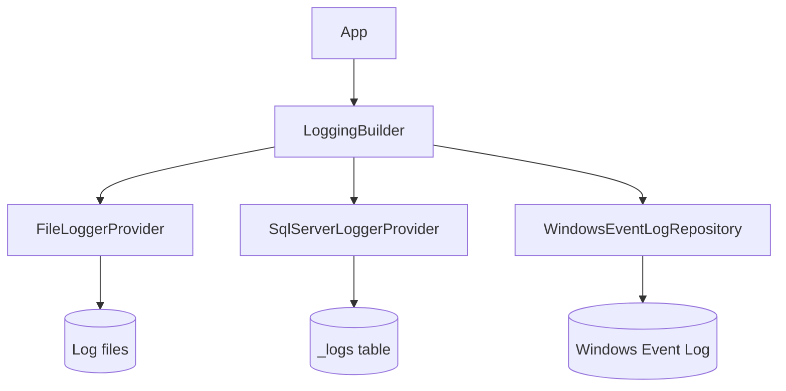
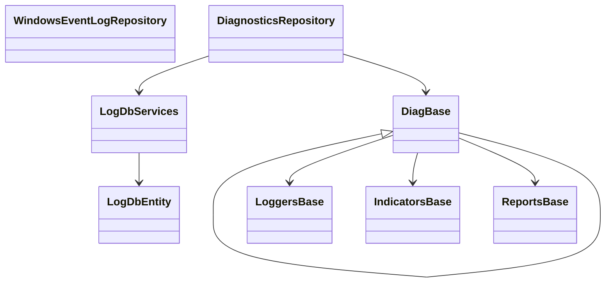
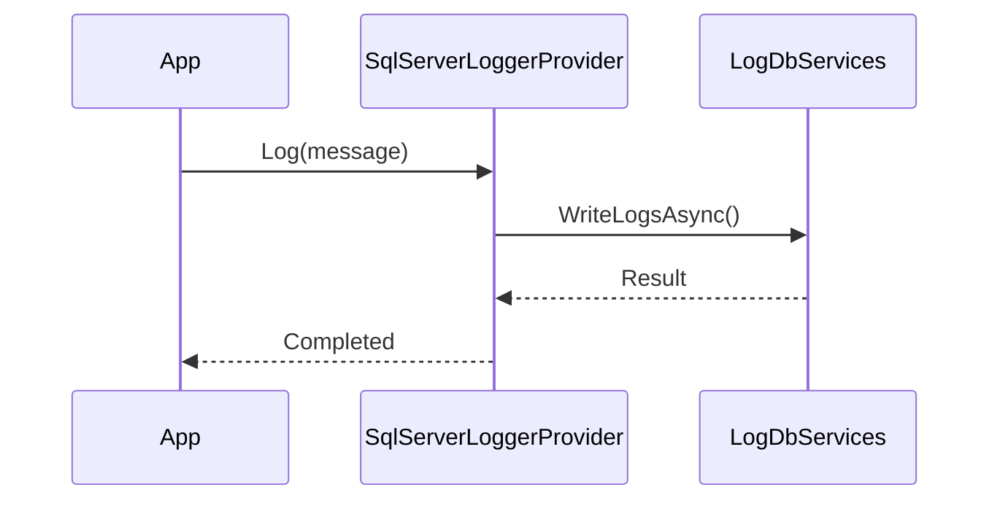

# Ark.App.Diagnostics: ArkAllianceEcosystem

## Introduction
Ark.App.Diagnostics is a diagnostic toolkit built with **.NET&nbsp;9** and **Entity Framework Core**. It follows **Domain‑Driven Design**, **Event‑Driven** principles and **Clean Architecture** to provide structured logging, health indicators and diagnostic reports for Ark Alliance applications. The library aims to improve reliability, scalability and maintainability across services. It integrates a hybrid human/AI layer for evolutions through declarative models (JSON/YAML) and conversational updates.

*Reference date: July&nbsp;21,&nbsp;2025*

## Task List
| # | Task | Prompt (System / User) | Status | Remarks & Remaining Work |
|---|------|-----------------------|--------|-------------------------|
|1|Fix XML docs and Windows logging platform checks|User|Closed|Guarded AddWindowsEventLogging and corrected indicator comments|

## Index
1. [General Description](#general-description)
2. [Project Structure](#project-structure)
3. [Functional Diagram](#functional-diagram)
4. [Class Diagram](#class-diagram)
5. [UML Sequence Diagram](#uml-sequence-diagram)
6. [Code Examples](#code-examples)
7. [Providers](#providers)
8. [Dependencies](#dependencies)
9. [Licenses and Acknowledgments](#licenses-and-acknowledgments)
10. [Release](#release)
11. [Author](#author)

## General Description
### Main Features
- **Core Operations**
  - Centralised logging via `FileLoggerProvider` and `SqlServerLoggerProvider`
  - Windows Event Log access through `WindowsEventLogRepository`
  - Unified repository `DiagnosticsRepository` for logs, indicators and reports
- **Extended Features**
  - Asynchronous APIs for non‑blocking operations
  - Configurable batching logger to improve write performance
  - Indicator and report framework for custom health checks
- **Service Specific**
  - Support for file periodicity rotation and SQL Server table creation
  - Result logging helpers in `ILoggerExtensions`

### Use Cases
1. Collecting application logs into a SQL Server table for audit.
2. Exporting Windows Event Log entries for troubleshooting on production servers.
3. Monitoring custom indicators (e.g., connection count) to expose health status.
4. Generating diagnostics reports to integrate with monitoring dashboards.

## Project Structure
```
Ark.App.Diagnostics/
|-- Data Access/              # Database entities and services
|-- Extension/                # ILogger and ILoggingBuilder helpers
|-- Helpers/                  # Diagnostic base classes, indicators, reports
|-- Providers/                # File and SQL Server logger implementations
|-- WindowsEventLog/          # Windows Event Log utilities
```
### Compliance
- **DDD**: separates domain models (logs, indicators) from infrastructure providers.
- **Event‑Driven**: logging and indicators emit events consumed asynchronously.
- **Clean Architecture**: abstractions (interfaces, base classes) depend only on the core domain; providers implement infrastructure concerns.

## Functional Diagram


## Class Diagram


## UML Sequence Diagram


## Code Examples
```csharp
// Configure logging with SQL Server provider
builder.Logging.AddSqlServer(config);

// Initialize diagnostics
DiagBase<MyLoggers, MyIndicators, MyReports>.Init(loggerFactory);

// Query logs with filtering
var result = await new DiagnosticsRepository(conn).GetLogs(query);

// Retrieve Windows Event Log entries
var logs = await new WindowsEventLogRepository()
    .GetLogs("MySource", logName: "DSS");

// Add Windows Event Logging with automatic source creation
builder.Logging.AddWindowsEventLogging("MySource");

// Configure file logging with daily rotation
builder.Logging.AddFile(opts =>
{
    opts.LogDirectory = "./logs";
    opts.Periodicity = FileLoggerPeriodicityEnum.Daily;
});

// Log a Result object with contextual severity
logger.LogResult(Result.Success);
```
Each snippet demonstrates typical usage: configuration, initialization, querying and Windows log access.

## Providers
| Provider | Description |
|---------|-------------|
| FileLoggerProvider | Writes logs to rotating files. |
| SqlServerLoggerProvider | Persists logs into a SQL Server table. |
| WindowsEventLogRepository | Reads and manages Windows Event Logs. |

## Dependencies
- Microsoft.CSharp 4.7.0
- System.Diagnostics.EventLog 9.0.8
- Ark.Data.EFCore.SqlServer (internal)
- Ark.Data (internal)

## Licenses and Acknowledgments
- Ark.App.Diagnostics is released under the [MIT License](LICENSE.txt).
- Uses Microsoft.Extensions.Logging packages under the [Apache&nbsp;2.0 License](https://github.com/dotnet/runtime/blob/main/LICENSE.TXT).

## Release


## Author
© 2019 - 2025 Armand Richelet‑Kleinberg
