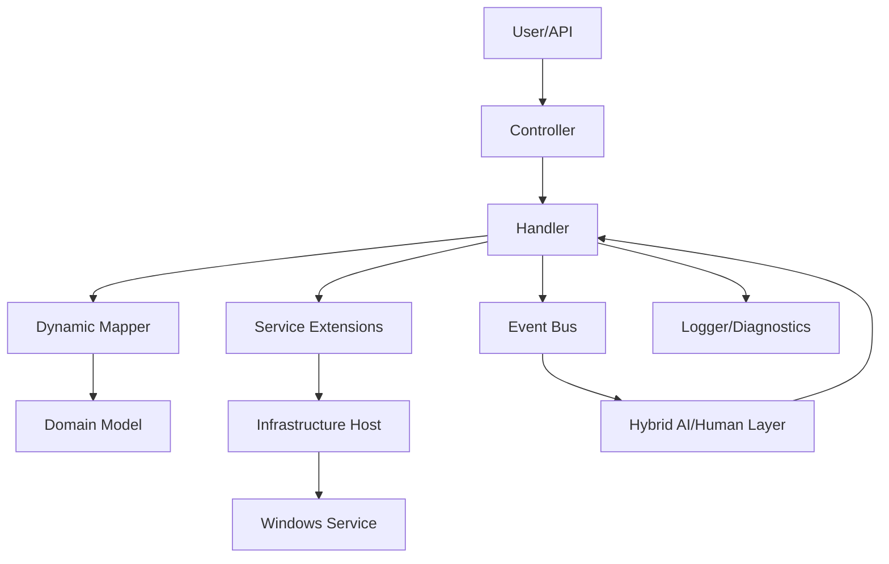
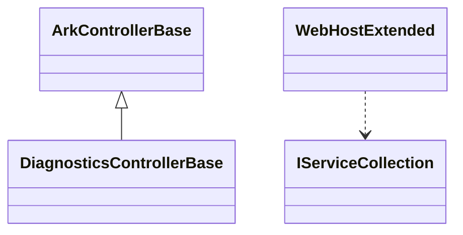
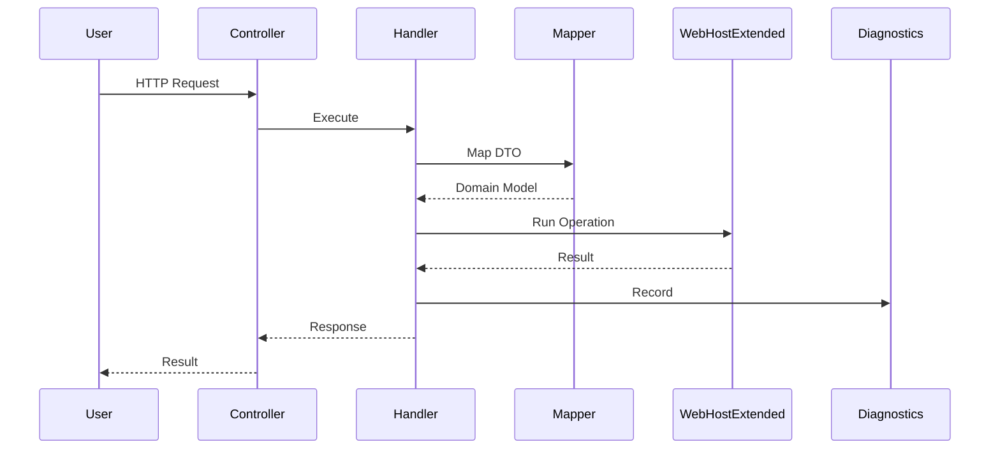

# Ark.AspNetCore: ArkAllianceEcosystem

## Introduction
Ark.AspNetCore is a collection of helpers and utilities that accelerate the development of ASP.NET Core services inside the ArkAlliance ecosystem. Built on **.NET 9**, it embraces **Domain‑Driven Design**, **Event‑Driven Architecture** and **Clean Architecture** principles. The library centralises controller bases, dependency injection extensions, dynamic mapping utilities and Windows service helpers so applications can be bootstrapped reliably and consistently. A hybrid AI/human layer can adjust behaviours through YAML/JSON settings and dialog events.  


## Task List
| # | Task | Prompt (System / User) | Status | Remarks & Remaining Work |
|---|------|-----------------------|--------|-------------------------|
|1|Fix header `Append` compile error|User|Closed|Import `Microsoft.AspNetCore.Http` to expose header extension|

## Index
1. [General Description](#general-description)
2. [Project Structure](#project-structure)
3. [Functional Diagram](#functional-diagram)
4. [Class Diagram](#class-diagram)
5. [UML Sequence Diagram](#uml-sequence-diagram)
6. [Code Examples](#code-examples)
7. [Modules](#modules)
8. [Dependencies](#dependencies)
9. [Licenses and Acknowledgments](#licenses-and-acknowledgments)
10. [Release](#release)

## General Description
### Main Features
- **Controller Bases** – `ArkControllerBase` and derived classes provide unified diagnostics and consistent results.
- **Hosting Extensions** – methods like `AddArkAspNetCore()` register core services and middleware for quick startup.
- **Dynamic Mapping** – runtime mapping between models to remove repetitive boilerplate and enable code generation.
- **Windows Service Support** – utilities for hosting background workers as Windows services.
- **Search Utilities** – optional packages for dynamic filtering and paging of entities.
- **Hybrid Evolution** – configuration models can be adjusted through YAML/JSON and reviewed by a human if needed.

### Use Cases
1. Quickly build a REST API with consistent result formatting and diagnostics.
2. Host a worker service as a Windows service with minimal boilerplate.
3. Map DTOs to domain models dynamically for rapid prototyping.
4. Add search endpoints with filtering and paging for large collections.
5. Override behaviours at runtime via YAML settings delivered through an event bus.

## Project Structure
```
Authorization/   // Policy and role helpers
Diagnostics/     // Diagnostic controllers and middleware
DynamicMapping/  // Runtime mapping utilities
Extensions/      // DI and hosting extensions
Helpers/         // Common helpers and utilities
Infrastructure/  // Windows service hosting
Users/           // User management abstractions
```
### Compliance
The project separates responsibilities between domain-oriented components and infrastructure helpers, aligning with DDD and Clean Architecture. Event-driven patterns (e.g., MediatR) enable loose coupling and facilitate integration testing.

## Functional Diagram


## Class Diagram


## UML Sequence Diagram


## Code Examples
### Bootstrapping
```csharp
var builder = WebApplication.CreateBuilder(args);
builder.Services.AddArkAspNetCore();
var app = builder.Build();
app.MapControllers();
app.Run();
```
Use case: Start a new API with all Ark.AspNetCore services registered.

### YAML Settings for Dynamic Mapping
```yaml
Mappings:
  - Source: "DtoUser"
    Target: "User"
    Ignore:
      - "Id"
```
Use case: Adjust mapping rules without recompiling the application.

### JSON Configuration for Windows Service
```json
{
  "ServiceName": "ArkWorker",
  "DisplayName": "Ark Background Worker",
  "Description": "Processes queued jobs"
}
```
Use case: Deploy the worker as a Windows service with configurable metadata.

### Controller Example
```csharp
[ApiController]
[Route("api/[controller]")]
public class HealthController : DiagnosticsControllerBase
{
    [HttpGet]
    public IActionResult Get() => Ok("Healthy");
}
```
Use case: Provide a standard diagnostics endpoint inheriting from Ark base classes.

### Authorization Filter
```csharp
[Authorize("Admin")]
public class SecureController : ControllerBase
{
    [HttpGet]
    public IActionResult Get() => Ok("Secured area");
}
```
Use case: Require a specific permission before executing the endpoint logic.

## Modules
| Module             | Description                                  |
|--------------------|----------------------------------------------|
| Authorization      | Helpers for policies and role management     |
| Diagnostics        | Controllers and middleware for health checks |
| DynamicMapping     | Runtime object mapping utilities             |
| Extensions         | Service collection and host extensions       |
| Helpers            | Common helpers and utilities                 |
| Infrastructure     | Windows service and worker hosting           |
| Users              | Basic abstractions for user handling         |
| Trading            | Controllers for Binance trading operations   |
| CodeGen            | Helpers for scaffolding and code generation  |

## Dependencies
- Microsoft.AspNetCore.Authentication.Negotiate **8.0.17**
- Microsoft.AspNetCore.Components.WebAssembly.Server **8.0.17**
- Microsoft.Extensions.Hosting.WindowsServices **9.0.8**
- Swashbuckle.AspNetCore **9.0.1**
- Project references: Ark.Api.Binance, Ark.Net.CrossCutting, Ark.Net.MqSeries, Ark.Infrastructure.Info

## Licenses and Acknowledgments
This project is released under the [MIT License](LICENSE.txt). It uses third‑party packages such as [Swashbuckle.AspNetCore](https://github.com/domaindrivendev/Swashbuckle.AspNetCore) (Apache 2.0) and [MediatR](https://github.com/jbogard/MediatR) (MIT). For integrity, cite the sources and licenses in your project. This README was partially generated with the assistance of Grok (xAI) and reviewed manually for accuracy.

## Release

Armand Richelet-Kleinberg
