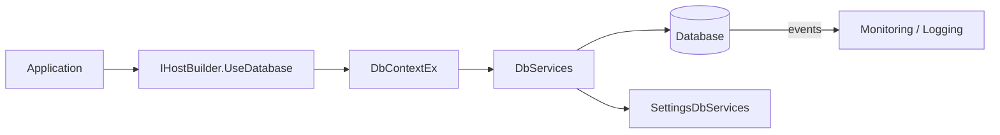
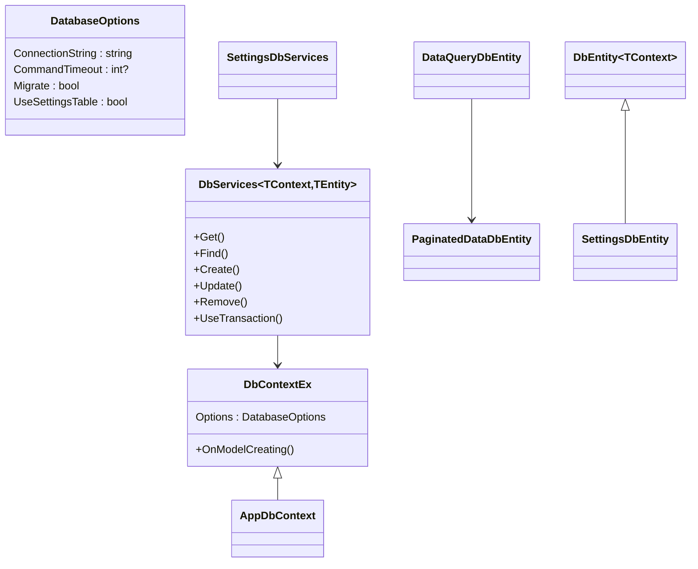
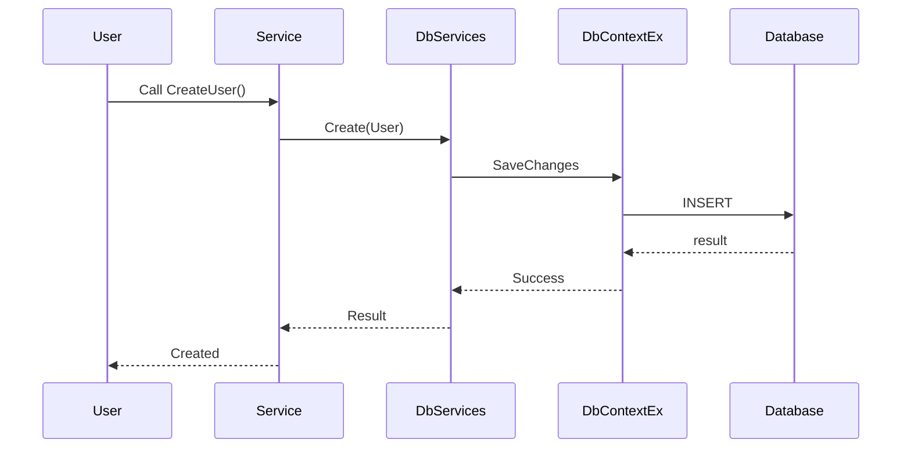

# Ark.Data.EFCore: ArkAllianceEcosystem

## Introduction
Ark.Data.EFCore provides a lightweight data access layer for the **Ark Alliance** ecosystem.
It extends **Entity Framework Core 9** with generic services and helpers following the principles of **DDD**, **Event‑Driven** and **Clean Architecture**. The package targets `.NET 9` and helps applications remain reliable, flexible and easy to maintain. A hybrid human/AI layer can evolve data models via YAML/JSON descriptions and dialogue based refinements.

*Reference date: june 9, 2025*

## Task List
| # | Task | Prompt (System / User) | Status | Remarks & Remaining Work |
|---|------|-----------------------|--------|-------------------------|
|1|Apply documentation guidelines to Ark.Data.EFCore|User: "read Carfully ; DocumentationGuidLines.md Apply theses instruction perfectly to the project ; Ark.Data.EFCore"|Closed|Added XML documentation and Task List|
|2|Document DataQuery entities|System: "General Coding Instructions" / User: "Continue applying documentation guidelines"|Closed|Added pros/cons and references|
|3|Document settings services|User: "Continue this task already started"|Closed|XML docs for settings classes|
|4|Document parameter helpers and pagination entity|User: "Continue this task already started"|Closed|Improved comments for DbParameter helpers and PaginatedDataDbEntity|
|5|Document IQueryable extensions|User: "Continue this task already started"|Closed|Added XML docs for IQueryable extensions|
|6|Resolve generic cref warnings|User|Closed|Replaced TContext cref with `&lt;typeparamref&gt;` in IHostBuilder extensions|

## Index
1. [General Description](#general-description)
2. [Project Structure](#project-structure)
3. [Functional Diagram](#functional-diagram)
4. [Class Diagram](#class-diagram)
5. [UML Sequence Diagram](#uml-sequence-diagram)
6. [Code Examples](#code-examples)
7. [Feature Table](#feature-table)
8. [Dependencies](#dependencies)
9. [Licenses and Acknowledgments](#licenses-and-acknowledgments)
10. [Release](#release)

## General Description
### Main Features
- **DbContextEx** – base context adding attribute‑driven configuration (indexes, composite keys, DateTime kind and settings table).
- **DatabaseOptions** – connection and migration settings loaded from `appsettings.json` or code.
- **UseDatabase extension** – registers a context and its `DbServices` in an `IHostBuilder`, optionally running migrations.
- **DbServices&lt;TContext,TEntity&gt;** – generic CRUD services with query helpers, upsert and transaction support.
- **DataQueryDbEntity** – build paginated, ordered and filtered queries for API endpoints.
- **SettingsDbServices** – simple key/value storage using `SettingsDbEntity` for configuration values.
- **DbTransactionBuilder** – create multi‑step database transactions fluently.
- **EF Core integration** – works with `Ark.Data.EFCore.SqlServer` or other provider packages.

### Use Cases
1. **Microservice persistence** – quickly expose CRUD operations for domain entities while keeping clean separation of concerns.
2. **Settings management** – store application settings in a dedicated table accessible through strongly typed enums.
3. **Filtered APIs** – implement endpoints returning paginated and ordered results using `DataQueryDbEntity`.
4. **Transactional workflows** – perform multiple entity operations atomically with `DbTransactionBuilder`.
5. **Stored procedure execution** – run custom SQL functions or procedures with typed results.

## Project Structure
```
Context/        // extended DbContext and attributes
Entities/       // base entities and query helpers
Extensions/     // extension methods (DbSet, IHostBuilder...)
Options/        // DatabaseOptions configuration
Services/       // DbServices, transactions and parameter helpers
Settings/       // settings table support
```
### Compliance
- **Domain Driven Design** – entities encapsulate domain logic and reside in the `Entities` folder.
- **Event‑Driven/CQRS** – designed to integrate with Ark.Cqrs and Ark.Mq for event flows.
- **Clean Architecture** – separation between domain entities, application services and infrastructure context.

## Functional Diagram


## Class Diagram


## UML Sequence Diagram


## Code Examples
```csharp
// 1. Define a context
public class AppDbContext : SqlServerDbContext { }

// 2. Register it
builder.UseDatabase<AppDbContext>();

// 3. Define an entity
public class User : DbEntity<AppDbContext>
{
    [Key] public string Email { get; set; }
    public string FirstName { get; set; }
}

// 4. Consume DbServices
public class UserService
{
    private readonly DbServices<AppDbContext, User> _db;
    public UserService(DbServices<AppDbContext, User> db) => _db = db;

    public Task<Result> Add(User u) => _db.Create(u);
}

// 5. Build a paginated query
var query = new DataQueryDbEntity<AppDbContext, User>
{
    PagingSkip = 0,
    PagingTake = 20,
    OrderByPropertyName = nameof(User.Email)
};
var result = await _db.Query(query);

// 6. Access settings
var setting = await _settings.GetValueOrDefault(AppSettingEnum.ApiKey, "demo");
```

## Feature Table
| Feature | Description |
|---------|-------------|
| `DbContextEx` | Attribute driven context with migration helpers |
| `DbServices` | Generic CRUD and query services |
| `SettingsDbServices` | Key/value configuration storage |
| `DbTransactionBuilder` | Fluent multi-entity transactions |
| `DataQueryDbEntity` | Build paging/filtering queries |

## Dependencies
- `FlexLabs.EntityFrameworkCore.Upsert` 9.0.0
- `Microsoft.EntityFrameworkCore.Relational` 9.0.8

## Licenses and Acknowledgments
This project is released under the MIT license. It relies on permissively licensed third‑party packages such as [FlexLabs Upsert](https://github.com/FlexLabs/EFCore.Upsert) and [Microsoft.EntityFrameworkCore](https://github.com/dotnet/efcore).  
This README was partially generated with the assistance of Grok (xAI) and manually reviewed for accuracy.


*Author: Armand Richelet‑Kleinberg*
