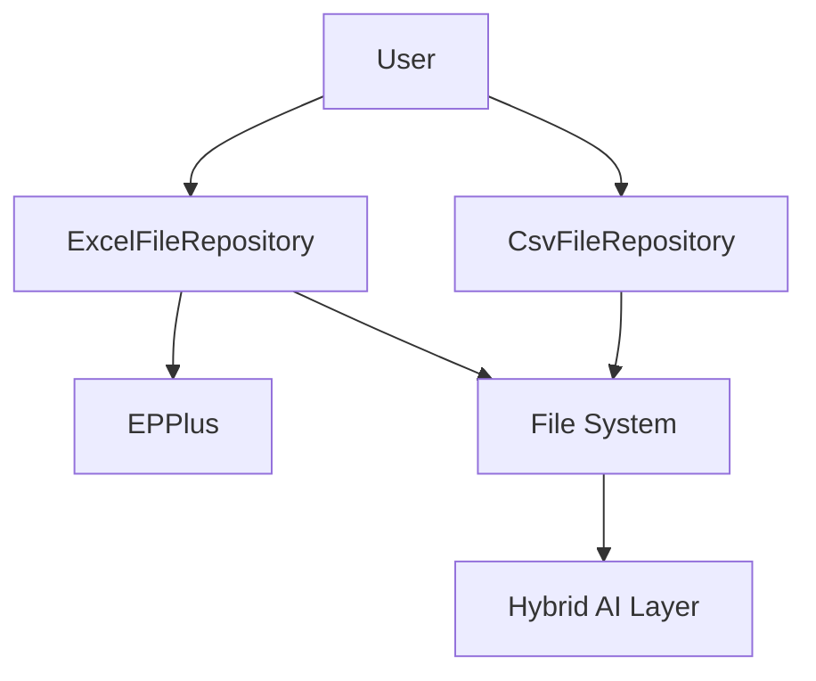
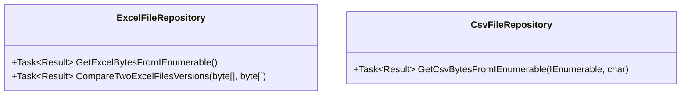
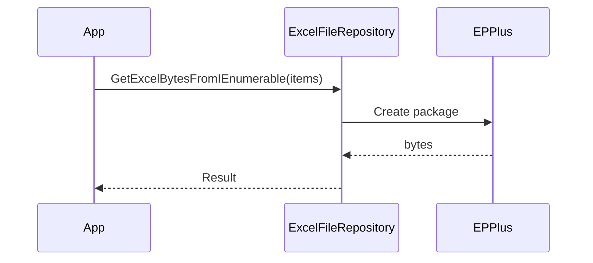

# Ark.Data.Excel: ArkAllianceEcosystem

## Introduction
Ark.Data.Excel provides simple Excel and CSV file repositories built with **.NET&nbsp;9**. The library follows **Domain‑Driven Design**, **event‑driven patterns** and **Clean Architecture** guidelines to ensure maintainable and extensible data export capabilities. It leverages the EPPlus package for spreadsheet manipulation and integrates seamlessly with other ArkAlliance components. A hybrid AI/human layer can drive future evolutions through YAML/JSON models and conversational feedback.

*Reference date: june 1, 2024*

## Index
1. [General Description](#general-description)
2. [Project Structure](#project-structure)
3. [Functional Diagram](#functional-diagram)
4. [Class Diagram](#class-diagram)
5. [UML Sequence Diagram](#uml-sequence-diagram)
6. [Code Examples](#code-examples)
7. [Modules](#modules)
8. [Dependencies](#dependencies)
9. [Licenses and Acknowledgments](#licenses-and-acknowledgments)
10. [Release](#release)
11. [Author](#author)

## General Description
### Main Features
- **Excel export** – `ExcelFileRepository.GetExcelBytesFromIEnumerable` converts a collection or `ExpandoObject` items into an Excel spreadsheet.
- **Version comparison** – highlight differences between two Excel files with `CompareTwoExcelFilesVersions`.
- **CSV export** – `CsvFileRepository.GetCsvBytesFromIEnumerable` creates CSV content from an object list with a custom delimiter.

### Use Cases
1. Generating reports from domain entities in Excel format.
2. Comparing spreadsheet revisions when auditing data changes.
3. Exporting simple data sets as CSV for integration with external systems.

## Project Structure
```
Ark.Data.Excel/
├─ ExcelFileRepository.cs
├─ CsvFileRepository.cs
└─ Ark.Data.Excel.csproj
```
### Compliance
Classes are organised to separate file manipulation concerns from domain logic. The project keeps a minimal footprint and can be integrated within DDD or Clean Architecture solutions. Event‑driven workflows can incorporate these repositories to produce files as part of larger processes.

## Functional Diagram


## Class Diagram


## UML Sequence Diagram


## Code Examples
```csharp
// Export a list of objects to Excel
var bytes = await new ExcelFileRepository()
    .GetExcelBytesFromIEnumerable(data);
```
```csharp
// Compare two versions of a worksheet
var diff = await new ExcelFileRepository()
    .CompareTwoExcelFilesVersions(newBytes, oldBytes);
```
```csharp
// Export to CSV using ';' as delimiter
var csv = await new CsvFileRepository()
    .GetCsvBytesFromIEnumerable(items, ';');
```
```csharp
// Use dynamic data via ExpandoObject
dynamic row = new ExpandoObject();
row.Name = "BTC";
row.Price = 69500m;
var excel = await new ExcelFileRepository()
    .GetExcelBytesFromIEnumerable(new[] { row });
```

## Modules
| Component | Description |
|-----------|-------------|
| **ExcelFileRepository** | Create spreadsheets and compare versions. |
| **CsvFileRepository** | Generate CSV files from object collections. |

## Dependencies
- EPPlus 8.0.7
- Microsoft.Extensions.Configuration 9.0.8
- Microsoft.Extensions.Configuration.FileExtensions 9.0.8
- Microsoft.Extensions.Configuration.Json 9.0.8
- Microsoft.Extensions.FileProviders.Abstractions 9.0.8
- Microsoft.Extensions.FileProviders.Physical 9.0.8
- System.Security.Cryptography.Pkcs 9.0.8
- System.Text.Encoding.CodePages 9.0.8

## Licenses and Acknowledgments
- This project is licensed under the MIT license.
- [EPPlus](https://github.com/EPPlusSoftware/EPPlus) – LGPL.
- [Microsoft.Extensions.*](https://github.com/dotnet/runtime) – MIT.
- [System.Security.Cryptography.Pkcs](https://github.com/dotnet/runtime) – MIT.

For integrity, cite the sources and licenses in your project. This README was partially generated with the assistance of Grok (xAI) and manually reviewed for accuracy.

## Release
- 

## Author
Armand Richelet-Kleinberg
