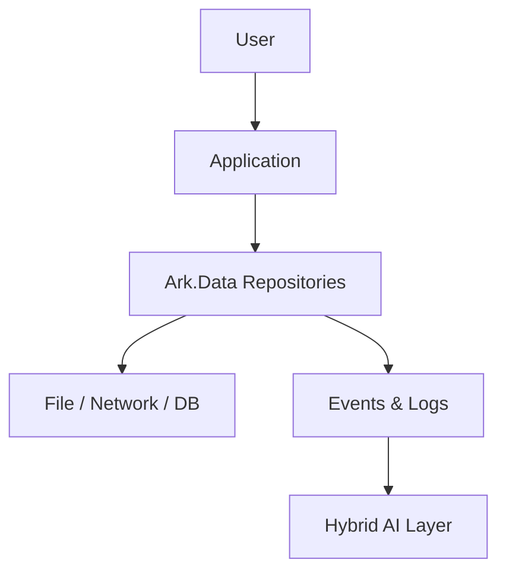
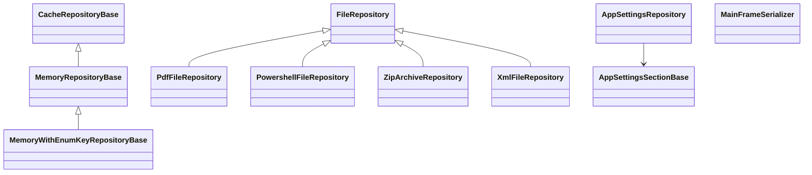
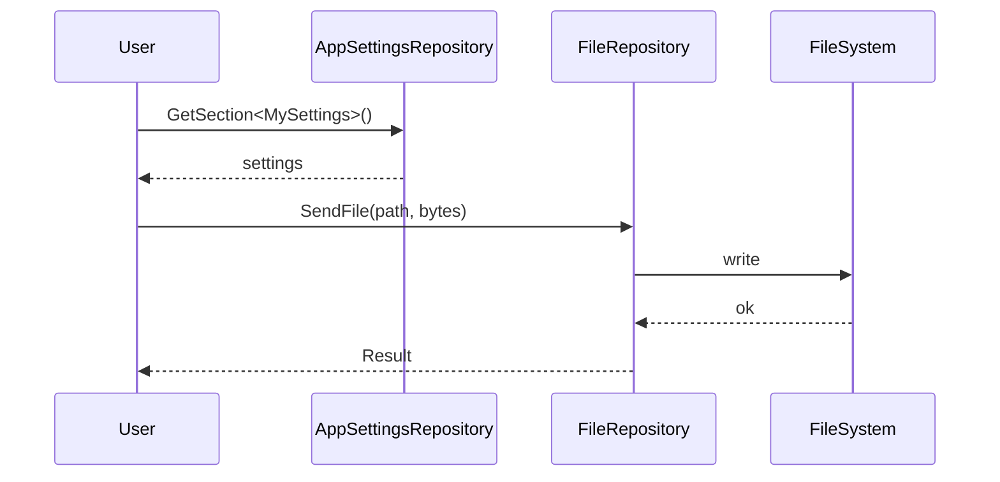

# Ark.Data: ArkAllianceEcosystem

## Introduction
Ark.Data is a collection of data access helpers, caching utilities and file repositories built with **.NET&nbsp;9**. It follows Domain‑Driven Design principles and integrates easily within event‑driven, Clean Architecture solutions. The library simplifies common tasks such as configuration loading, PDF and XML manipulation or zip archive creation. A hybrid AI/human layer can extend these modules through declarative YAML/JSON or conversational adjustments.

*Reference date: July 10, 2025*

## Index
1. [General Description](#general-description)
2. [Project Structure](#project-structure)
3. [Functional Diagram](#functional-diagram)
4. [Class Diagram](#class-diagram)
5. [UML Sequence Diagram](#uml-sequence-diagram)
6. [Code Examples](#code-examples)
7. [Modules](#modules)
8. [Dependencies](#dependencies)
9. [Licenses and Acknowledgments](#licenses-and-acknowledgments)
10. [Release](#release)
11. [Author](#author)

## General Description
### Main Features
- **Cache repositories** — In‑memory storage with expiration management (`MemoryRepositoryBase`, `MemoryWithEnumKeyRepositoryBase`).
- **File operations** — Send, delete and manage files via `FileRepository` and specialisations:
  - PDF merge (`PdfFileRepository`).
  - XML serialisation/deserialisation (`XmlFileRepository`).
  - Zip archive creation/unzip (`ZipArchiveRepository`).
  - PowerShell script execution (`PowershellFileRepository`).
- **Image handling** — Simple `ImageRepository` for image streams.
- **Mainframe serializer** — Convert complex objects to and from fixed‑length strings for legacy systems.
- **Settings management** — `AppSettingsRepository` and `WebServicesSettings` load application configuration sections.

### Use Cases
1. **Local caching** of frequently accessed data within a service to reduce database calls.
2. **Generating merged reports** by combining multiple PDF files into one document.
3. **Scripting automation** by invoking PowerShell files from a .NET application.
4. **Packaging results** into a zip archive for downloads or backups.
5. **Interfacing with mainframe** systems through flat string serialisation.

## Project Structure
```
Ark.Data/
├─ Cache/
├─ File/
├─ Image/
├─ MainFrame/
├─ Settings/
└─ WebServices/
```

### Compliance
The project fits within the ArkAlliance Clean Architecture approach. Domain logic resides in dedicated repositories, while infrastructure details (file system, web services) are abstracted behind interfaces. Event‑driven patterns and DDD concepts are supported through the broader Ark libraries.

## Functional Diagram


## Class Diagram


## UML Sequence Diagram


## Code Examples
```csharp
// Merge PDF files
var result = await new PdfFileRepository().Merge(pdf1, pdf2);
```
```yaml
# App settings section
WebServices:
  Url: "https://api.example.com"
  UserName: "user"
  Password: "pass"
```
```json
// Cache configuration
{
  "ValidityTimeSpan": "00:10:00"
}
```
```csharp
// Execute a PowerShell script
await new PowershellFileRepository().Execute("script.ps1", "-Arg1", "Value");
```
```csharp
// Create an archive from files
var archive = await new ZipArchiveRepository().CreateArchive(files);
```

## Modules
| Module | Description |
|--------|-------------|
| `Cache` | Base classes for memory caches with optional expiration. |
| `File` | File manipulations including PDF, XML, PowerShell and zip support. |
| `Image` | Image stream repository. |
| `MainFrame` | Serialiser for fixed-length legacy messages. |
| `Settings` | Access to strongly typed configuration sections. |
| `WebServices` | Basic WebService connection settings. |

## Dependencies
- iTextSharp-LGPL-Core 1.2.0
- Microsoft.Extensions.Configuration.Binder 9.0.8
- Microsoft.Extensions.Configuration.EnvironmentVariables 9.0.8
- Microsoft.Extensions.Hosting.Abstractions 9.0.8
- Newtonsoft.Json 13.0.3
- System.Drawing.Common 9.0.8

## Licenses and Acknowledgments
- [iTextSharp-LGPL-Core](https://github.com/itext/itextsharp) – LGPL.
- [Microsoft.Extensions.*](https://github.com/dotnet/runtime) – MIT.
- [Newtonsoft.Json](https://github.com/JamesNK/Newtonsoft.Json) – MIT.
- [System.Drawing.Common](https://github.com/dotnet/runtime) – MIT.

This README was partially generated with the assistance of Grok (xAI) and reviewed manually for accuracy.

## Release
- 

## Author
Armand Richelet-Kleinberg
