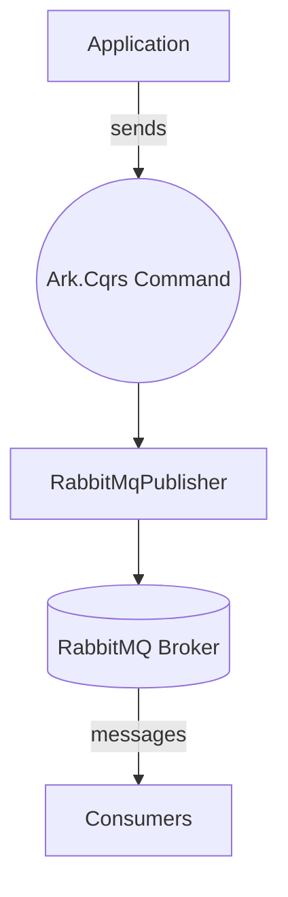
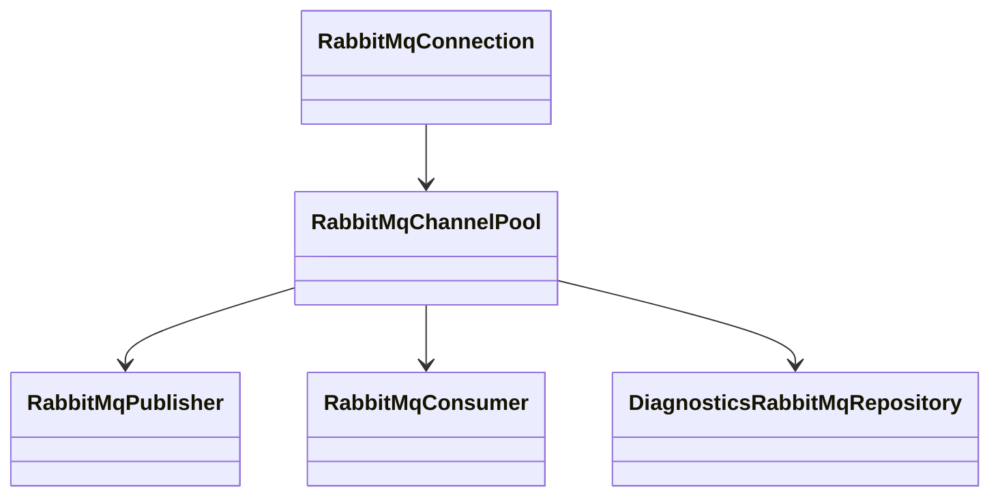
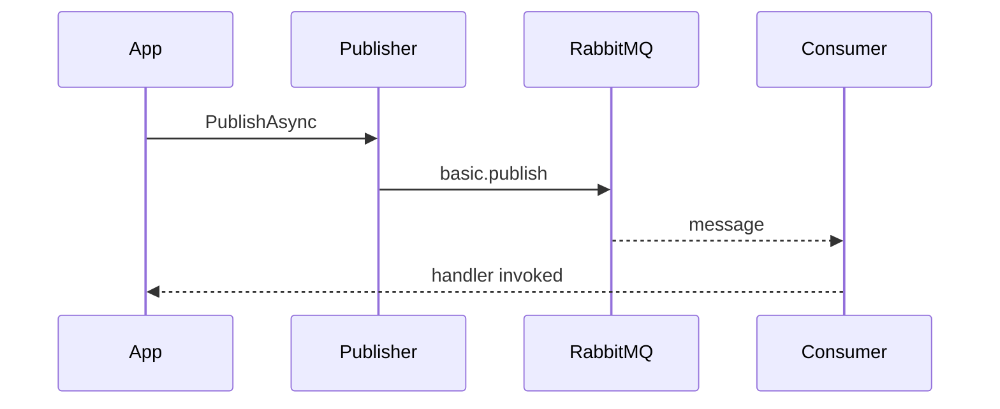

# Ark.Mq.RabbitMq

Reusable RabbitMQ helpers for Ark microservices.

## Index

1. [Overview](#overview)
2. [Features](#features)
3. [Architecture](#architecture)
4. [Usage](#usage)
5. [Diagnostics](#diagnostics)
6. [Testing Scenarios](#testing-scenarios)
7. [Dependencies](#dependencies)
8. [References](#references)
9. [Author](#author)

## Overview

This package exposes a thin infrastructure layer that follows a
**Clean Architecture** approach. Message publishing is exposed through
Ark.Cqrs commands so that application code remains decoupled from the
RabbitMQ client implementation.



This library provides a lightweight wrapper around `RabbitMQ.Client` in order to simplify message publishing and consumption in a clean architecture style. It mirrors the structure of other `Ark.Mq` modules like `Ark.Mq.RocketMq`.
It follows the recommendations described in `rabbit_mq_complete_guide_en.md`.

## Features

- Configuration via `RabbitMqSettings` with connection, pooling and queue settings
- Single connection with channel pooling for efficient reuse


- Connection pooling using `Microsoft.Extensions.Resilience` pipelines
- `RabbitMqPublisher` service to send strongly typed messages with optional rate limiting and publisher confirms. Implements `IBrokerProducer` for decoupled messaging
- `RabbitMqConsumer` service to receive strongly typed messages with prefetch and manual acknowledgements
- `RabbitMqBrokerConsumer` adapter exposing `RabbitMqConsumer` through the `IBrokerConsumer` abstraction

- Background consumer service for long running processes
- `RabbitMqRepositoryBase` helpers to declare exchanges and queues
- Extension method `AddRabbitMq` to register the services with `IServiceCollection`
- Diagnostics helpers via `DiagnosticsRabbitMqRepository` and `RabbitMqReportsBase`
- Queue length and purge diagnostics via `DiagnosticsRabbitMqRepository`
- Resilience pipelines with retries and circuit breakers for publishing and connections

- Optional OpenTelemetry instrumentation via `ActivitySource` for publishes and consumes. Metrics are exported using the Prometheus exporter for integration with Ark.App.Diagnostics. Additional counters `rabbitmq.messages.published` and `rabbitmq.messages.failed` track messaging throughput.
- `MessageContext<T>` model carries headers, correlation identifier and message id.

## Architecture




## Usage
1. Reference **Ark.Mq.RabbitMq** in your microservice.
2. Add configuration section `RabbitMq` with host, username, etc.
3. Register the services:
   ```csharp
   services.AddRabbitMq(Configuration);
   ```
4. Inject `IBrokerProducer` (implemented by `RabbitMqPublisher`) or `IBrokerConsumer` (implemented by `RabbitMqBrokerConsumer`) where needed.



The diagram above shows the typical publish/consume flow using the library.

### Example

```csharp
var context = new MessageContext<MyMessage>(new MyMessage { Id = 1 }, new Dictionary<string, object>
{
    ["source"] = "web"
});

await publisher.PublishAsync("orders", "created", context);


```csharp
await consumer.SubscribeAsync<MyMessage>((msg, meta) =>
{
    Console.WriteLine($"Received {meta.Topic}");

### Consuming messages

```csharp
await brokerConsumer.SubscribeAsync<MyMessage>((msg, meta) =>
{
    Console.WriteLine($"Received {msg.Id} from {meta.Topic}");

    return Task.CompletedTask;
});
```

## Diagnostics
`DiagnosticsRabbitMqRepository` exposes helpers to inspect queues at runtime. Example:

```csharp
var length = await repo.GetQueueLength("orders");
var purge = await repo.PurgeQueue("orders");
```

`RabbitMqReportsBase` can generate reports combining message samples and queue length for monitoring dashboards.

## Testing Scenarios
- Connection drop and automatic reconnection.
- Publishing messages larger than configured limit logs a warning.
- Reading queue diagnostics when backlog grows unexpectedly.

## Dependencies
- `.NET 9`
- `RabbitMQ.Client`
- `Microsoft.Extensions.DependencyInjection`
- `Microsoft.Extensions.Resilience`
- `System.Threading.RateLimiting`
- `Ark.App.Diagnostics`
- `OpenTelemetry`

## Advantages
- Decouples messaging logic from application code via Ark.Cqrs commands.
 - Reuses channels through a pool while the underlying connection is resiliently managed.
- Minimal dependencies and easy to integrate in any service.

## Limitations
- The library focuses on basic publish/consume scenarios. Advanced features like
  transactions or complex topologies must be implemented separately.

## TODO
- Improve unit test coverage for connection failure scenarios.
- Expand diagnostics samples using `RabbitMqReportsBase`.

## References
- [RabbitMQ Documentation](https://www.rabbitmq.com/documentation.html)
- [Polly Resilience](https://github.com/App-vNext/Polly)
- [OpenTelemetry .NET](https://opentelemetry.io/docs/instrumentation/net/)
- Ark.Cqrs documentation (internal)


## Author

Armand Richelet-Kleinberg
