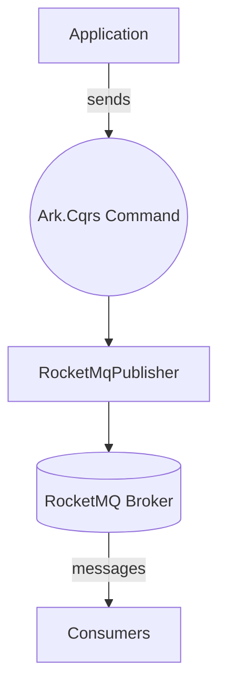
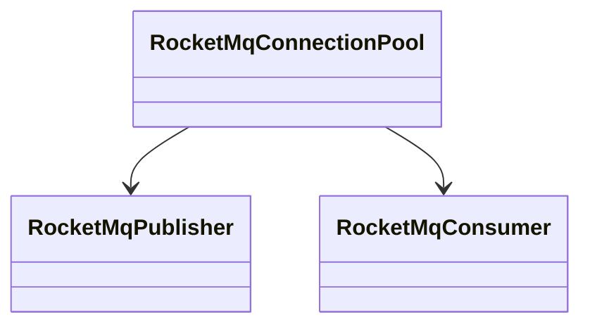
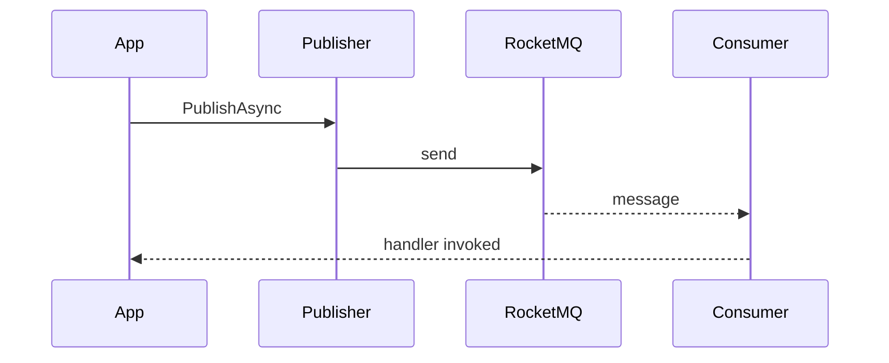

# Ark.Mq.RocketMq

Reusable RocketMQ helpers for Ark microservices.

## Index

1. [Overview](#overview)
2. [Features](#features)
3. [Architecture](#architecture)
4. [Usage](#usage)
5. [Diagnostics](#diagnostics)
6. [Testing Scenarios](#testing-scenarios)
7. [Dependencies](#dependencies)
8. [References](#references)
9. [Author](#author)

## Overview

This package exposes a thin infrastructure layer that follows a
**Clean Architecture** approach. Message publishing is exposed through
Ark.Cqrs commands so that application code remains decoupled from the
RocketMQ client implementation.



This library provides a lightweight wrapper around `Apache.RocketMQ.Client` in order to simplify message publishing and consumption in a clean architecture style. It mirrors the structure of other `Ark.Mq` modules like `Ark.Mq.RabbitMq`.

## Features
 - Configuration via `RocketMqSettings` with connection and pooling settings
- Connection pooling with retry policies
- `RocketMqPublisher` service to send strongly typed messages
- `RocketMqConsumer` service to receive strongly typed messages
- Implements `IBrokerProducer`/`IBrokerConsumer` for decoupled messaging
- `MessageContext<T>` model carries headers and correlation identifiers
- Background consumer service for long running processes
- `RocketMqRepositoryBase` helpers for custom operations
- Extension method `AddRocketMq` to register the services with `IServiceCollection`
- Diagnostics helpers via `DiagnosticsRocketMqRepository` and `RocketMqReportsBase`
- Optional OpenTelemetry metrics via `RocketMqMetrics` for Prometheus integration

## Architecture



## Usage
1. Reference **Ark.Mq.RocketMq** in your microservice.
2. Add configuration section `RocketMq` with host, username, etc.
3. Register the services:
   ```csharp
   services.AddRocketMq(Configuration);
   ```
4. Inject `RocketMqPublisher` or `RocketMqConsumer` where needed.



## Diagnostics
Use `DiagnosticsRocketMqRepository` to inspect queue contents and lengths.

## Testing Scenarios
- Verify producer retries on network failures.
- Observe diagnostics when backlog grows.

## Dependencies
- `.NET 9`
- `Apache.RocketMQ.Client`
- `Microsoft.Extensions.DependencyInjection`
- `Ark.App.Diagnostics`

## Advantages
- Decouples messaging logic from application code via Ark.Cqrs commands.
- Provides connection pooling with retry logic for robust producer/consumer setups.
- Minimal dependencies and easy to integrate in any service.

## Limitations
- The library focuses on basic publish/consume scenarios. Advanced features like
  transactions or complex topologies must be implemented separately.

## TODO
- Improve unit test coverage for connection failure scenarios.
- Expand diagnostics samples using `RocketMqReportsBase`.

## References
- [RocketMQ Documentation](https://rocketmq.apache.org/docs/quick-start/)
- Ark.Cqrs documentation (internal)


## Author

Armand Richelet-Kleinberg
