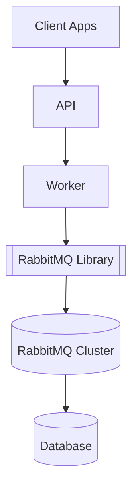
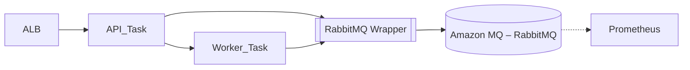
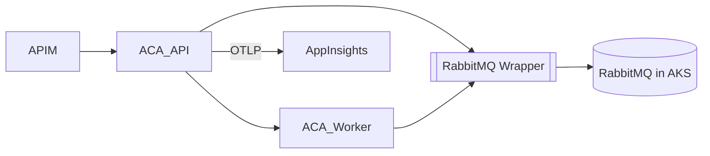

# Complete Guide: RabbitMQ in C# .NET (Event‑Driven Architecture, .NET 8/9)

## Introduction

**RabbitMQ** is a widely‑used open‑source **message broker** that fits naturally in event‑driven architectures. Implementing the AMQP 0.9.1 protocol, it allows distributed applications to exchange messages reliably. This comprehensive guide targets C#/.NET developers who wish to craft a **robust, modern RabbitMQ library** aimed at **.NET 8** and, where relevant, **.NET 9**.

We will cover:

- **Core RabbitMQ capabilities** — exchanges, queues, message types, AMQP commands, consumption modes, and more.
- **Best‑practice usage patterns** — connection/channel handling, push vs pull consumption models, as well as **known limitations** (bugs, design caveats, performance constraints) and proven **work‑arounds**.
- The **design of a stable, flexible, and evolvable C# library**: core classes, methods, configuration parameters, connection/channel pools, integrated monitoring with **Prometheus** and **OpenTelemetry**, and support for both on‑prem and cloud (Azure/AWS) deployments.
- **.NET 8 and .NET 9 specifics** — framework advances, cost/benefit notes, runtime choices, and how to leverage the latest improvements (performance, resilience, native OpenTelemetry, etc.).

> *Code snippets are illustrative; links to official documentation and reliable sources are provided for deeper exploration.*

---

## 1  Key RabbitMQ Features

### 1.1  Exchanges & Routing

- **Direct** — routes by exact routing‑key match.
- **Fanout** — broadcasts to all bound queues.
- **Topic** — pattern based (`*`, `#`).
- **Headers** — routes via message headers.
- **Alternate Exchange** — fallback exchange for unrouted messages.

### 1.2  Queues

- **Durable vs. Non‑durable** — survives broker restarts only if declared *durable* **and** messages are *persistent*.
- **Exclusive** — visible only to its declaring connection; auto‑deleted on disconnect.
- **Auto‑delete** — queue removed when its last consumer disconnects.
- **TTL & Expiry** — per‑message or per‑queue TTL; `x-expires` for queue lifetime.
- **Quorum Queues** — Raft‑backed replication (RabbitMQ ≥ 3.8). Prefer over classic mirrors for HA.
- **Lazy Queues** — messages spooled to disk to spare RAM; default behaviour since 3.12.

### 1.3  Messages & Properties

`ContentType`, `ContentEncoding`, `DeliveryMode` (2 = persistent), `Priority`, `Message TTL`, `CorrelationId`, `ReplyTo`, custom headers, etc.

### 1.4  Core AMQP Commands

`ExchangeDeclare`, `QueueDeclare/Bind`, `BasicPublish`, `BasicConsume`, `BasicGet`, `BasicAck/Nack/Reject`, `BasicQos`, `ConfirmSelect`, `TxSelect/Commit/Rollback`.

### 1.5  Consumption Modes

- **Push (BasicConsume)** — preferred for throughput.
- **Pull (BasicGet)** — synchronous, high overhead; reserve for diagnostics.

### 1.6  Connections & Channels

- One **TCP connection** per process (ideally), reused for lifetime.
- Many lightweight **channels** per connection (not thread‑safe; one channel per thread).
- Separate connections for publishing vs. consuming to avoid TCP back‑pressure.

---

## 2  Best Practices, Limitations & Work‑arounds

| Area             | Common Pitfall               | Recommended Fix                                         |
| ---------------- | ---------------------------- | ------------------------------------------------------- |
| Connections      | Opening/closing per message  | Keep long‑lived connection; reuse channels              |
| Channels         | Shared across threads        | One channel per thread/task                             |
| Consumption      | Polling with `BasicGet`      | Use `BasicConsume` + `BasicQos` (prefetch)              |
| Prefetch         | Not set (∞) → RAM blow‑up    | Tune prefetch (e.g., 10‑50)                             |
| Queue Size       | Millions of pending messages | Keep queues short; use TTL, `x‑max‑length`, Lazy queues |
| HA               | Classic mirrors split‑brain  | Use **Quorum Queues**                                   |
| Cross‑DC Cluster | WAN partitions               | Use **Federation/Shovel** instead                       |
| Priorities       | Too many priority levels     | Limit to ≤ 5 or avoid                                   |
| Large Messages   | Multi‑MB payloads            | Send pointer (URL) not blob                             |
| Security         | `guest/guest` exposed        | Create dedicated users, enforce TLS                     |

---

## 3  Designing a C# RabbitMQ Library

### 3.1  Core Components

- `ConnectionManager` — single TCP, auto‑recovery.
- `ChannelPool` — thread‑safe `IModel` reservoir.
- `RabbitPublisher` — serialization, publish, optional confirms, retry (Polly / Microsoft Resilience).
- `RabbitSubscriber` — async consumers, back‑pressure, manual ack.
- `MessageContext` — envelope with headers, correlation, payload.
- `RabbitOptions` — strongly‑typed settings (host list, TLS, confirms, prefetch, retry).

### 3.2  Resilience with Microsoft Resilience (Polly v8)

- Exponential back‑off retries on `BrokerUnreachableException`, `AlreadyClosedException`.
- Circuit breaker after consecutive publish failures.
- Lambda‑configurable predicates (from JSON rules → evaluated at runtime).

### 3.3  Observability

- **OpenTelemetry** instrumentation (`AddRabbitMQInstrumentation()`), context propagation via W3C TraceContext headers.
- **Prometheus** metrics (`prometheus-net`) — published/consumed counters, processing latency histograms.

### 3.4  Cloud & On‑Prem Support

- Works with self‑hosted RabbitMQ, **Amazon MQ for RabbitMQ**, or marketplace images in **Azure**.
- Credentials via Vault/Key Vault/Secrets Manager; TLS 1.3 default in cloud.
- Optional abstraction `IMessageBroker` for future adapters (Azure Service Bus, AWS SQS).

---

## 4  . NET 8 vs . NET 9 specifics

| Aspect         | .NET 8 (LTS)             | .NET 9 (STS)                                    |
| -------------- | ------------------------ | ----------------------------------------------- |
| Support cycle  | Nov 2023 – Nov 2026      | Nov 2024 – May 2026                             |
| Performance    | Major JIT & GC gains     | Further optimisations (vectorisation, GC adapt) |
| Native AOT     | Mature                   | Matures further                                 |
| OpenTelemetry  | Good                     | Built‑in templates, smaller images              |
| Recommendation | Safe production baseline | Edge features, migrate to .NET 10 LTS later     |

---

## 5  Sample `appsettings.json`

```jsonc
{
  "RabbitMQ": {
    "Hosts": ["rabbit1:5672", "rabbit2:5672"],
    "VirtualHost": "/",
    "UserName": "svc-app",
    "PasswordSecret": "RabbitProdPwd",
    "UseTls": true,
    "PublisherConfirms": true,
    "Prefetch": 20,
    "Retry": {
      "MaxAttempts": 5,
      "ExponentialBackoff": true,
      "BaseSeconds": 2
    }
  },
  "Telemetry": {
    "Exporter": "prometheus",
    "EnableTracing": true,
    "ServiceName": "OrderService",
    "SampleRate": 0.25
  }
}
```

---

## 6  Deployment Topologies (Illustrative Diagrams)

### 6.1  On‑Prem



### 6.2  AWS Cloud



### 6.3  Azure Cloud



---

## 7  Testing Strategy

| Level       | Tooling               | Focus                            |
| ----------- | --------------------- | -------------------------------- |
| Unit        | xUnit + NSubstitute   | Pure domain logic                |
| Integration | TestContainers‑dotnet | Publish/consume, confirms, retry |
| End‑to‑End  | Docker Compose, k6    | Full workflow under load         |

---

## Conclusion

Following these guidelines, you can craft a RabbitMQ library for .NET 8/9 that is **healthy, stable, flexible, and observable** — fit for both on‑prem and cloud‑native workloads.

---

*Sources: CloudAMQP best practices (2025), RabbitMQ official docs, Microsoft .NET blogs, Mobilize.NET performance reports, etc.*

