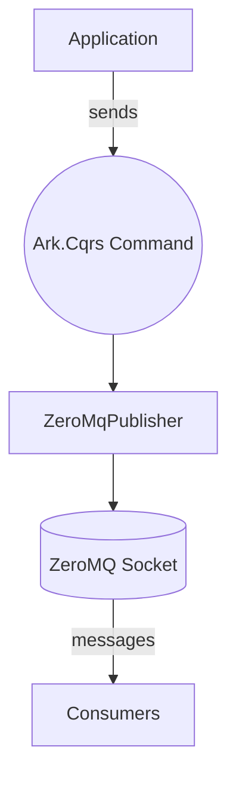
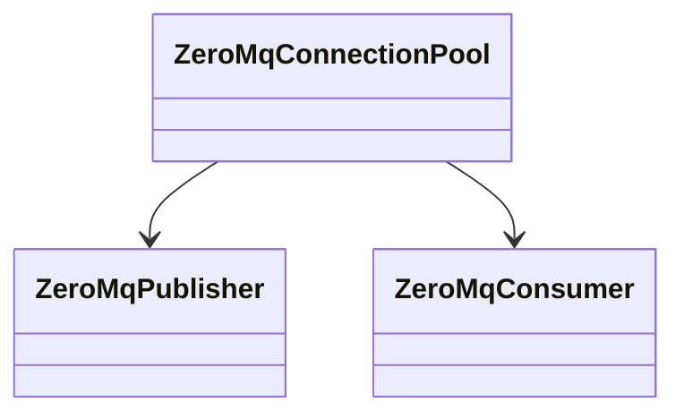
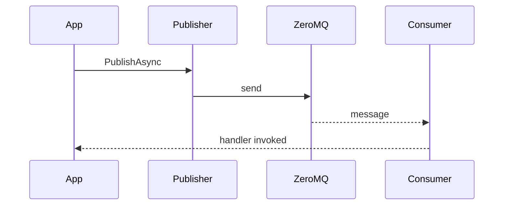

# Ark.Mq.ZeroMq

Reusable ZeroMQ helpers for Ark microservices.

## Index

1. [Overview](#overview)
2. [Features](#features)
3. [Architecture](#architecture)
4. [Usage](#usage)
5. [Diagnostics](#diagnostics)
6. [Testing Scenarios](#testing-scenarios)
7. [Dependencies](#dependencies)
8. [References](#references)
9. [Author](#author)

## Overview

This package exposes a thin infrastructure layer that follows a
**Clean Architecture** approach. Message publishing is exposed through
Ark.Cqrs commands so that application code remains decoupled from the
ZeroMQ implementation.



This library provides a lightweight wrapper around `NetMQ` in order to simplify message publishing and consumption in a clean architecture style. It mirrors the structure of other `Ark.Mq` modules like `Ark.Mq.RabbitMq` and relies on the `Result` pattern for consistent error handling. All operations expose `Result` or `Result<T>` objects similarly to `Ark.Mq.RocketMq` so that failures can be propagated cleanly.

## Features
 - Configuration via `ZeroMqSettings` with endpoint and pooling settings
- Connection pooling with retry policies
- `ZeroMqPublisher` service to send strongly typed messages
- `ZeroMqConsumer` service to receive strongly typed messages
- Implements `IBrokerProducer`/`IBrokerConsumer` for decoupled messaging
- `MessageContext<T>` model carries headers and correlation identifiers
- Background consumer service for long running processes
- `ZeroMqRepositoryBase` placeholder for custom helpers
- Extension method `AddZeroMq` to register the services with `IServiceCollection`
- (optional) diagnostics helpers via `DiagnosticsZeroMqRepository` and `ZeroMqReportsBase`
- Optional OpenTelemetry metrics via `ZeroMqMetrics` for Prometheus integration

## Architecture



## Usage
1. Reference **Ark.Mq.ZeroMq** in your microservice.
2. Add configuration section `ZeroMq` with the target endpoint.
3. Register the services:
   ```csharp
   services.AddZeroMq(Configuration);
   ```
4. Inject `ZeroMqPublisher` or `ZeroMqConsumer` where needed.



## Diagnostics
Use `DiagnosticsZeroMqRepository` for basic message sampling.

## Testing Scenarios
- Ensure subscribers reconnect on socket interruptions.
- Measure throughput with large payloads.

## Dependencies
- `.NET 9`
- `NetMQ`
- `Microsoft.Extensions.DependencyInjection`
- `Ark.App.Diagnostics`

## Advantages
- Decouples messaging logic from application code via Ark.Cqrs commands.
- Provides connection pooling with retry logic for robust producer/consumer setups.
- Minimal dependencies and easy to integrate in any service.

## Limitations
- The library focuses on basic publish/consume scenarios. Advanced features like
  transactions or complex topologies must be implemented separately.

## TODO
- Improve unit test coverage for connection failure scenarios.
- Expand diagnostics samples using `ZeroMqReportsBase`.

## References
- [ZeroMQ Documentation](https://zeromq.org/get-started/)
- Ark.Cqrs documentation (internal)


## Author

Armand Richelet-Kleinberg
