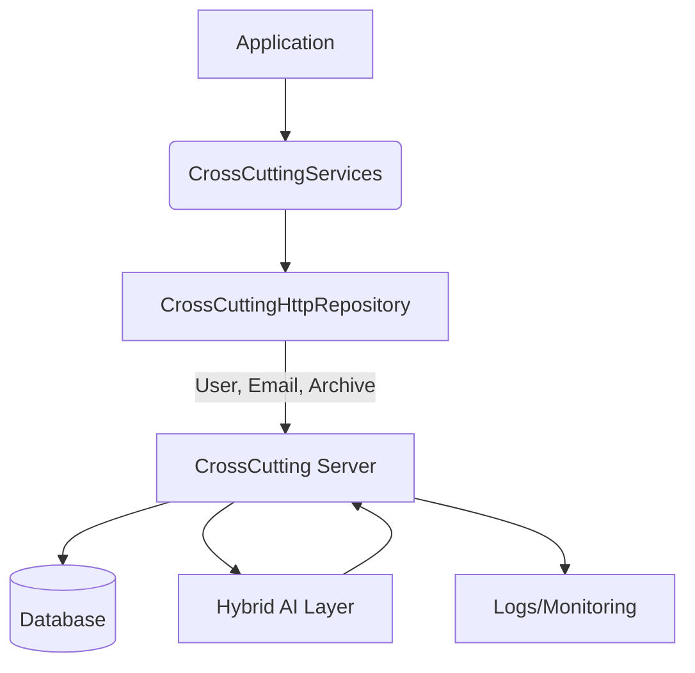
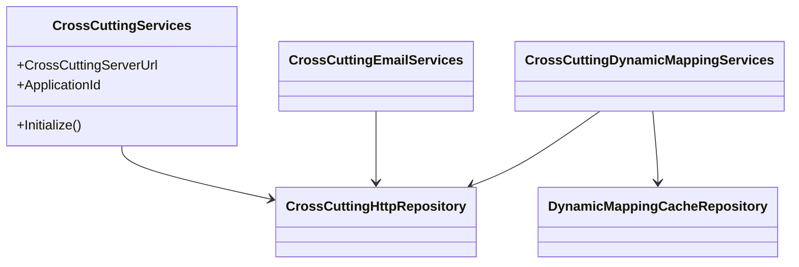
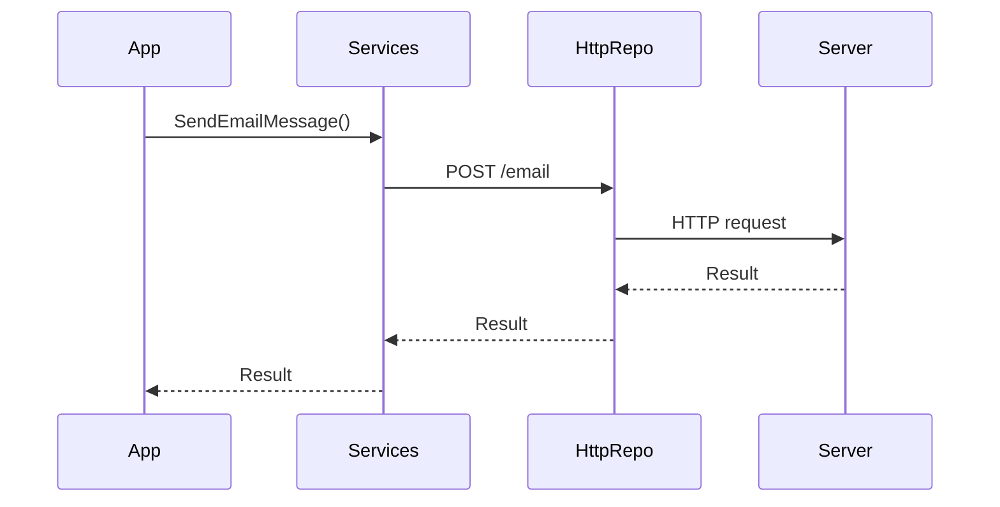

# Ark.Net.CrossCutting: ArkAllianceEcosystem

## Introduction
Ark.Net.CrossCutting is a .NET 9 library providing unified access to cross-cutting services across the **Ark Alliance** ecosystem. It embraces Domain‑Driven Design, event-driven communication and Clean Architecture to keep infrastructure concerns isolated. The library exposes HTTP-based helpers to manage users, dispatch emails, store archives and execute dynamic mappings. By centralising these operations it promotes reliability, flexibility and scalability. Hybrid human/AI workflows can evolve configurations via modelling languages (YAML/JSON) and conversational dialogs.

Reference date: june 12, 2025.

## Index
1. [General Description](#general-description)
2. [Project Structure](#project-structure)
3. [Functional Diagram](#functional-diagram)
4. [Class Diagram](#class-diagram)
5. [UML Sequence Diagram](#uml-sequence-diagram)
6. [Code Examples](#code-examples)
7. [Modules](#modules)
8. [Dependencies](#dependencies)
9. [Licenses and Acknowledgments](#licenses-and-acknowledgments)
10. [Release](#release)

## General Description
### Main Features
- **Service Initialization** – configure the root server URL, application identifier and logging.
- **User Management** – authenticate users, store profile data and manage roles through `CrossCuttingHttpRepository`.
- **Email Dispatch** – send email messages with `CrossCuttingEmailServices`.
- **Dynamic Mapping** – compile and execute mappings at runtime, cached via `DynamicMappingCacheRepository`.
- **Document Archive** – upload and retrieve archives.

### Use Cases
- Centralise application user management for multiple microservices.
- Send transactional emails from a shared gateway.
- Transform objects using dynamic mappings stored on the cross‑cutting server.
- Store and retrieve documents in a single archive service.
- Integrate with background workers for secure deployments.

## Project Structure
```
Ark.Net.CrossCutting/
├─ DataAccess/       # HTTP repositories
├─ DynamicMapping/   # Mapping cache and compiler
├─ Services/         # Email, user and archive services
├─ Models/           # DTO definitions
├─ Validation/       # FluentValidation rules
└─ CrossCuttingServices.cs
```
### Compliance
- **DDD** – Separates infrastructure (DataAccess) from domain services (DynamicMapping, Email, Archive).
- **Event‑Driven** – Mapping and user operations can emit events for integration.
- **Clean Architecture** – API abstractions hide implementation details for easy testing.

## Functional Diagram


## Class Diagram


## UML Sequence Diagram


## Code Examples
```csharp
// 1. Initialization
CrossCuttingServices.Initialize("https://cc.example.com", "myApp", logger);

// 2. Authenticate a user
var userResult = await new CrossCuttingHttpRepository()
    .AuthenticateUserForApp("user1");

// 3. Send an email
await new CrossCuttingEmailServices()
    .SendEmailMessage(new EmailSendRequestDto { /* ... */ });

// 4. Execute a dynamic mapping
await new CrossCuttingDynamicMappingServices()
    .ExecuteDynamicMapping(DynamicMappingEnum.UserSync, myUser);

// 5. Store a document
await new CrossCuttingHttpRepository()
    .PostStoreDocument(new ArchiveToCreateDto { /* ... */ });
```
Each example mirrors real scenarios such as onboarding users, dispatching notifications or persisting files.

## Modules
| Module | Description |
|--------|-------------|
| **User Services** | Manage user authentication, profiles and roles. |
| **Email Services** | Send transactional email through the cross‑cutting gateway. |
| **Dynamic Mapping** | Compile and run server‑defined mappings with caching. |
| **Archive Service** | Store and retrieve documents centrally. |

## Dependencies
- `.NET 9.0`
- `AgileObjects.ReadableExpressions` 4.1.3
- `FluentValidation` 11.9.2
- `Ark.App.Diagnostics` (internal)
- `Ark.Net.Http` (internal)
- `Ark.Net.Models` (internal)

## Licenses and Acknowledgments
This project is released under the MIT license. Third‑party libraries include:
- [AgileObjects.ReadableExpressions](https://github.com/agileobjects/ReadableExpressions) – MIT
- [FluentValidation](https://github.com/FluentValidation/FluentValidation) – Apache&nbsp;2.0

For integrity, cite the sources and licenses in your projects. This README was partially generated with the assistance of Grok (xAI) and reviewed manually for accuracy.

## Release

Author: Armand Richelet‑Kleinberg
