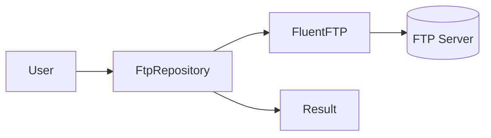
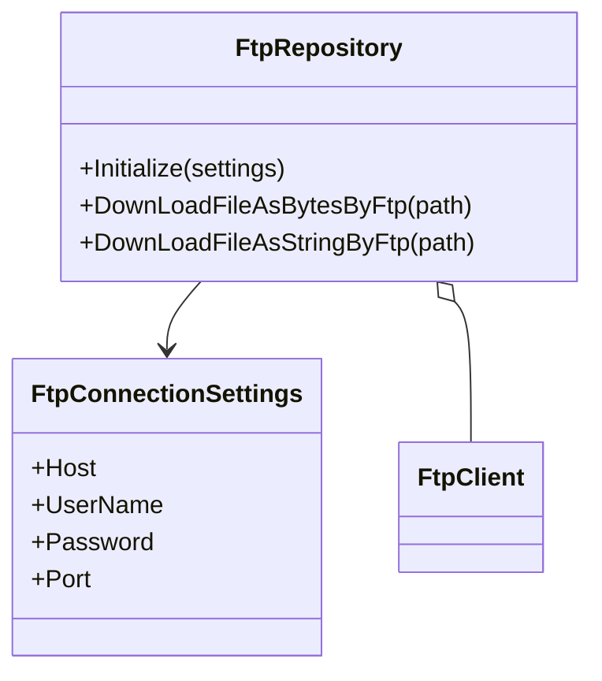
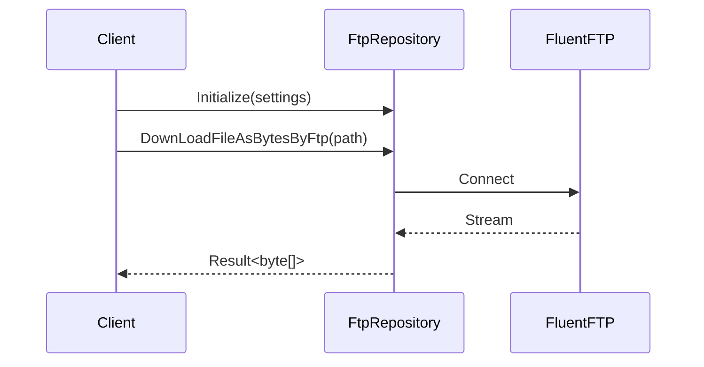

# Ark.Net.Ftp: ArkAllianceEcosystem

## Introduction
Ark.Net.Ftp provides simple FTP repository utilities built on **FluentFTP** and targeting **.NET 9**. It follows Clean Architecture and Domain-Driven principles by isolating FTP interactions behind a repository. The library uses the shared **Result** pattern from the Ark ecosystem for consistent error handling. This project is part of the broader Ark Alliance ecosystem which mixes traditional code with a human/AI hybrid workflow for evolutions described in YAML or JSON models.  


## Index
1. [General Description](#general-description)
2. [Project Structure](#project-structure)
3. [Functional Diagram](#functional-diagram)
4. [Class Diagram](#class-diagram)
5. [UML Sequence Diagram](#uml-sequence-diagram)
6. [Code Examples](#code-examples)
7. [Feature Table](#feature-table)
8. [Dependencies](#dependencies)
9. [Licenses and Acknowledgments](#licenses-and-acknowledgments)
10. [Release](#release)

## General Description
### Main Features
- **Initialization** – configure connection settings via `FtpConnectionSettings`.
- **Download as bytes** – retrieve a remote file using `DownLoadFileAsBytesByFtp`.
- **Download as string** – retrieve a text file with `DownLoadFileAsStringByFtp`.
- **Result pattern** – all operations return a `Result` object describing success or failure.

### Use Cases
1. Fetch configuration files from a secured FTP server during application start.
2. Automate download of daily logs for centralized processing.
3. Integrate with other Ark Alliance services that require fetching data over FTP.

## Project Structure
```
Ark.Net.Ftp/
├─ FtpConnectionSettings.cs   # Connection parameters
├─ FtpRepository.cs           # Repository encapsulating FluentFTP
├─ Ark.Net.Ftp.csproj         # Project file (.NET 9)
└─ README.md
```
### Compliance
- **DDD** – repository abstraction isolates the FTP infrastructure from domain logic.
- **Event-Driven** – results can trigger actions elsewhere in the ecosystem.
- **Clean Architecture** – separation between infrastructure (FTP) and consuming services.

## Functional Diagram


## Class Diagram


## UML Sequence Diagram


## Code Examples
```csharp
// Basic usage
var repo = new FtpRepository();
repo.Initialize(new FtpConnectionSettings {
    Host = "ftp.example.com",
    UserName = "user",
    Password = "pass"
});
var result = await repo.DownLoadFileAsBytesByFtp("/remote/file.bin");
```

```yaml
# Settings from configuration
ftp:
  host: ftp.example.com
  userName: user
  password: pass
  port: 21
```

```json
// Example result
{
  "status": "Success",
  "dataLength": 128
}
```

```csharp
// Download text and handle errors
var textResult = await repo.DownLoadFileAsStringByFtp("/remote/info.txt");
if (textResult.IsSuccess)
{
    Console.WriteLine(textResult.Data);
}
else
{
    Console.Error.WriteLine(textResult.Reason);
}
```

## Feature Table
| Feature | Description |
|---------|-------------|
| Initialization | Set host, credentials and port before any operation |
| Download bytes | Returns a byte array of the remote file |
| Download string | Converts the downloaded data using UTF-8 |
| Result pattern | Consistent success/failure handling |

## Dependencies
- **.NET 9**
- **FluentFTP** 33.0.3
- **Ark** Result utilities

## Licenses and Acknowledgments
- [FluentFTP](https://github.com/robinrodricks/FluentFTP) under MIT License.
- This README was partially generated with the assistance of Grok (xAI) and reviewed manually for accuracy.


© 2025 Armand Richelet-Kleinberg
