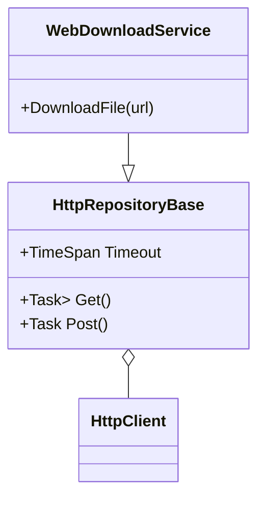

# Ark.Net.Http

Provides reusable HTTP client utilities for Ark services. `HttpRepositoryBase` and related helpers encapsulate `HttpClient` usage and expose results through the shared `Result` type from **Ark.Net.Models**.

## Dependencies
- .NET 9
- System.Net.Http
- **Ark.Net.Models**

## Architecture


## Example
```csharp
var repo = new MyHttpRepository { RootUrl = "https://api.example.com" };
var result = await repo.Get<MyDto>("/items");
if (result.IsSuccess)
{
    // handle data
}
```

© 2024 Armand Richelet-Kleinberg
