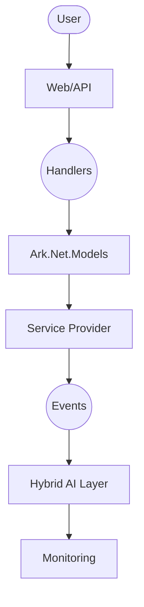
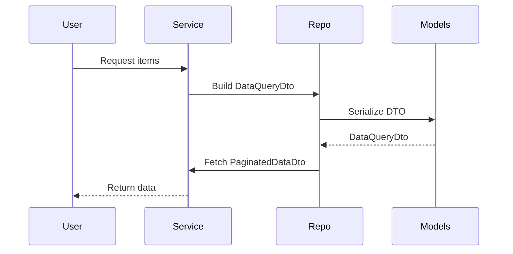

# Ark.Net.Models: ArkAllianceEcosystem

## Introduction
Ark.Net.Models is a set of reusable data transfer objects (DTOs) used across the ArkAllianceEcosystem. Built with **.NET 9**, it aligns with **Domain‑Driven Design (DDD)**, **Event‑Driven Architecture** and **Clean Architecture** principles. The library centralises common application models—such as queries, diagnostics logs, email messages and user sessions—to ensure reliability, flexibility and consistency across services. It supports hybrid AI/human workflows through structured JSON/YAML models and dialogue-based evolution.

**Reference date:** July 21, 2025.

## Index
1. [General Description](#general-description)
2. [Project Structure](#project-structure)
3. [Functional Diagram](#functional-diagram)
4. [Class Diagram](#class-diagram)
5. [UML Sequence Diagram](#uml-sequence-diagram)
6. [Code Examples](#code-examples)
7. [Table of Features](#table-of-features)
8. [Dependencies](#dependencies)
9. [Licenses and Acknowledgments](#licenses-and-acknowledgments)
10. [Release](#release)

## General Description
### Main Features
- **Core DTOs**
  - `DataQueryDto` and filtering enums for paging, sorting and comparison.
  - `PaginatedDataDto<T>` wrapper for paginated responses.
  - `FileDto` and `EmailMessageDto` for file transfers and emails.
  - Diagnostic models (`LogDto`, `ReportDto`, `DiagnosticInfoDto`).
  - User‑related DTOs (`UserDto`, `UserSessionDto`, `UserRoleDto`).
- **Extended Features**
  - Dynamic mapping DTOs for runtime workflow configuration.
  - Search models for quick indexing.
  - Result wrappers (`ResultDto`) for consistent API responses.
- **Service‑Specific**
  - Cross‑cutting enumerations (apps, icons, permissions).

### Use Cases
1. **API pagination and filtering** – send `DataQueryDto` to a Web API to request pages of data with filters.
2. **Diagnostics reporting** – collect `LogDto` entries and attach them to a monitoring service.
3. **Email notifications** – build an `EmailMessageDto` with attachments to notify users of system events.
4. **Dynamic workflows** – configure business actions with `DynamicMappingDto` and store them in YAML.
5. **User session tracking** – manage `UserSessionDto` data for authentication and auditing.

## Project Structure
```
Ark.Net.Models/
 ├─ App/                  # Application release information DTOs
 ├─ CrossCutting/         # Enumerations shared across projects
 ├─ DataQuery/            # Query and filter DTOs
 ├─ Diagnostics/          # Logging and report DTOs
 ├─ DynamicMapping/       # Runtime workflow DTOs
 ├─ Email/                # Email message and recipient DTOs
 ├─ Resources/            # Localization resources
 ├─ Search/               # Search result DTOs
 ├─ User/                 # User and permission DTOs
 └─ Ark.Net.Models.csproj # .NET 9 project file
```
### Compliance
- **DDD** – DTOs focus on domain concepts while remaining decoupled from persistence or UI.
- **Event‑Driven** – Diagnostic and result models integrate easily with message buses.
- **Clean Architecture** – Pure C# models without infrastructure concerns enable testing and extension.

## Functional Diagram


## Class Diagram
```mermaid
classDiagram
    class DataQueryDto {
        int? PagingSkip
        int? PagingTake
        string OrderByPropertyName
        bool OrderByDescending
    }
    class PaginatedDataDto<T>
    class FileDto
    class EmailMessageDto
    class LogDto
    class UserDto
    DataQueryDto --> PaginatedDataDto
    EmailMessageDto o-- FileDto
```

## UML Sequence Diagram


## Code Examples
```csharp
// Basic Usage: build a query
var query = new DataQueryDto
{
    PagingSkip = 0,
    PagingTake = 20,
    OrderByPropertyName = "Name",
    Filters = new[]
    {
        new DataQueryFilterDto
        {
            PropertyName = "Status",
            Comparison = DataQueryFilterComparisonEnum.Equals,
            Value = "Active"
        }
    }
};
```
```yaml
# YAML Settings for dynamic mapping
action:
  type: ExecuteScript
  parameters:
    script: cleanup.ps1
```
```json
// JSON Evolution example
{
  "PagingSkip": 10,
  "PagingTake": 50,
  "OrderByDescending": true
}
```
```csharp
// Sending an email
var message = new EmailMessageDto
{
    Tos = new List<EmailRecipientDto> { new("user@example.com") },
    Subject = "Report ready",
    BodyText = "Your weekly report is attached.",
    Attachments = new List<FileDto> { file }
};
```
```csharp
// Logging a diagnostic event
var log = new LogDto
{
    Severity = LogSeverityEnum.Information,
    CreationTime = DateTime.UtcNow,
    Category = "Service",
    Details = "Initialization complete"
};
```

## Table of Features
| Category | Description |
|----------|-------------|
| DataQuery | Paging and filtering models for API queries |
| Diagnostics | Log and report DTOs for monitoring |
| Dynamic Mapping | Runtime action and condition models |
| Email | Email message, recipient and attachment DTOs |
| User | User account, role and session models |

## Dependencies
- `Microsoft.Extensions.Logging.Abstractions` 9.0.8

## Licenses and Acknowledgments
This project is released under the [MIT License](../../LICENSE.txt). It uses no external libraries beyond .NET and Microsoft packages. For integrity, always cite sources and licenses in your own projects. This README was partially generated with the assistance of Grok (xAI) and manually reviewed for accuracy.

## Release
- Initial README added – July 21, 2025

© 2025 Armand Richelet-Kleinberg
