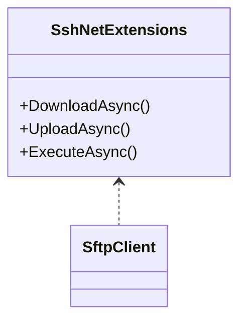

# Ark.Net.Ssh

Extensions for the SSH.NET library used within Ark solutions to simplify SFTP operations and command execution.

## Dependencies
- .NET 9
- SSH.NET
- Microsoft.Extensions.Logging.Abstractions

## Architecture


## Example
```csharp
using Renci.SshNet;
using Ark.Net.Ssh;

using var client = new SftpClient("host", "user", "pwd");
client.Connect();
await client.UploadAsync(stream, "/remote/file.txt");
```

© 2024 Armand Richelet-Kleinberg
