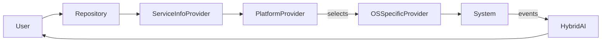
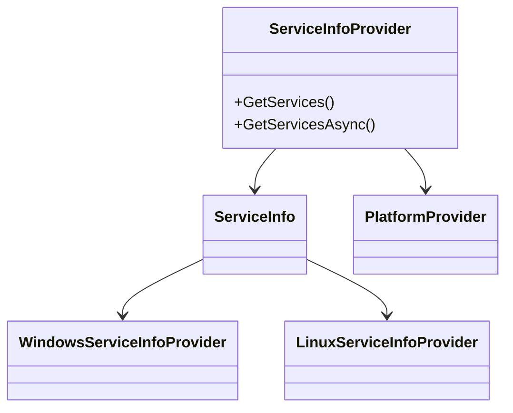
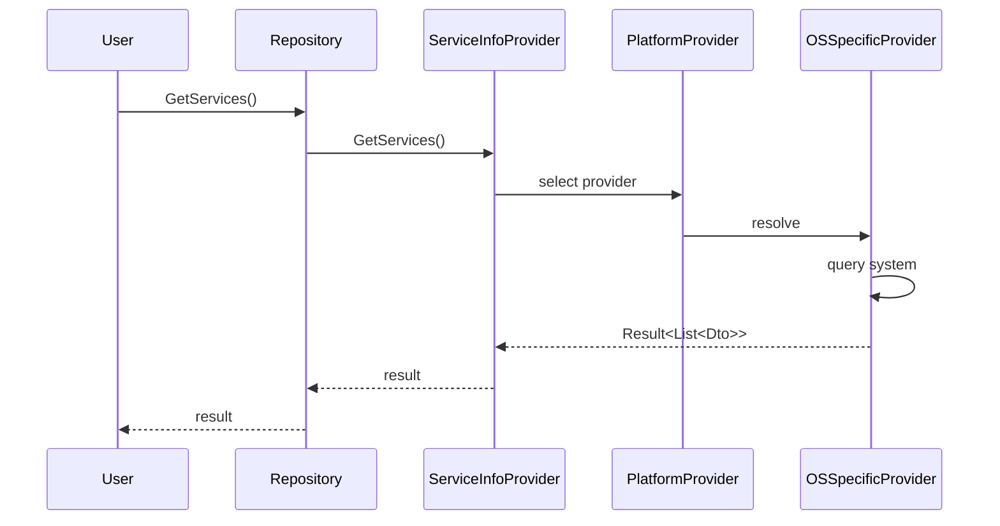

# Ark.System.Info: Ark Alliance Ecosystem

## Introduction
Ark.System.Info offers cross-platform utilities to inspect system services, network adapters and storage devices. It targets **.NET 9** and follows Domain Driven Design, Event-Driven principles and Clean Architecture. 

## Task List
| # | Task | Prompt (System / User) | Status | Remarks & Remaining Work |
|---|------|-----------------------|--------|-------------------------|
|1|Guard platform-specific code and tidy XML docs|User|Closed|Windows-only APIs annotated and XML comments fixed|

## Index
1. [General Description](#general-description)
2. [Project Structure](#project-structure)
3. [Functional Diagram](#functional-diagram)
4. [Class Diagram](#class-diagram)
5. [UML Sequence Diagram](#uml-sequence-diagram)
6. [Code Examples](#code-examples)
7. [Table of Features](#table-of-features)
8. [Dependencies](#dependencies)
9. [Licenses and Acknowledgments](#licenses-and-acknowledgments)
10. [Release](#release)

## General Description
### Main Features
- **Service Inspection**: list and inspect running services with CPU, memory usage and event logs.
- **Network Information**: retrieve adapter details and open ports across platforms.
- **Storage Information**: list drives, capacity and usage.
- **Environment Snapshot**: aggregate system metrics into a single DTO.
- **Hybrid AI Layer**: evolutions can be described in JSON/YAML and discussed with human operators before execution.

### Use Cases
- Diagnosing service health on Windows or Linux servers.
- Gathering environment data for troubleshooting in distributed deployments.
- Auditing network configuration in containerized setups.
- Monitoring storage usage before automatic scaling.

## Project Structure
```
@Core/Ark.System/Ark.Core.Systeminfo/
├─ Environment/         # Environment info providers
├─ EventLogs/           # OS event log access
├─ Network/             # Network info providers
├─ Services/            # Service info abstraction
├─ Storages/            # Storage info providers
├─ Dto/                 # Data transfer objects
├─ Helpers/             # Platform helpers
├─ Repositories/        # Access layer
└─ README.md
```
### Compliance
The project isolates domain contracts from infrastructure implementations. Platform-specific providers implement interfaces resolved via `PlatformProvider`, ensuring clean separation and future event-driven integrations.

## Functional Diagram


## Class Diagram


## UML Sequence Diagram


## Code Examples
```csharp
// List running services (synchronous)
IServiceInfoProvider provider = new ServiceInfoProvider();
var result = provider.GetServices("ssh");
if (result.IsSuccess)
    foreach (var svc in result.Data)
        Console.WriteLine($"{svc.ServiceName} {svc.Status}");
```
```csharp
// Asynchronous retrieval
var asyncResult = await provider.GetServicesAsync();
```
```csharp
// Get network details
var network = NetworkInfoProvider.GetNetworkInfo();
```
```csharp
// Gather storage information
var drives = await StorageInfoProvider.GetStorageInfosAsync();
```

## Table of Features
| Module | Description |
|--------|-------------|
| Services | Inspect Windows/Linux services with event logs |
| Network  | Get adapter and port information |
| Storage  | Retrieve drive capacity and usage |
| Environment | Aggregate system metrics |

## Dependencies
- LibGit2Sharp 0.31.0
- System.ServiceProcess.ServiceController 9.0.8
- System.Diagnostics.PerformanceCounter 9.0.8
- System.Management 9.0.0

## Task List
| # | Task | Prompt (System / User) | Status | Remarks & Remaining Work |
|---|------|-----------------------|--------|-------------------------|

## Licenses and Acknowledgments
This project uses libraries distributed under MIT or other OSS licenses. Sources include [LibGit2Sharp](https://github.com/libgit2/libgit2sharp). For integrity, cite all third-party licenses in your project. This README was partially generated with the assistance of Grok (xAI) and manually reviewed.


## Author
Armand Richelet-Kleinberg
