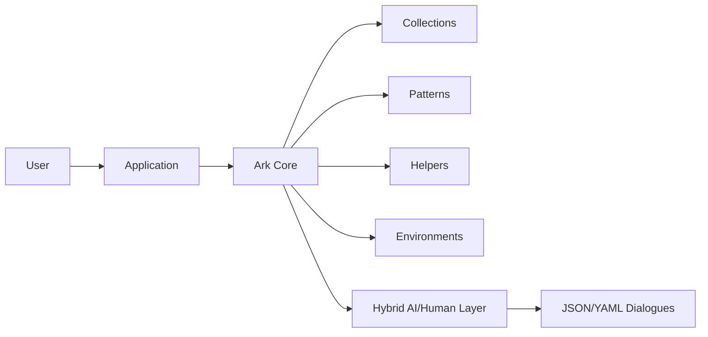
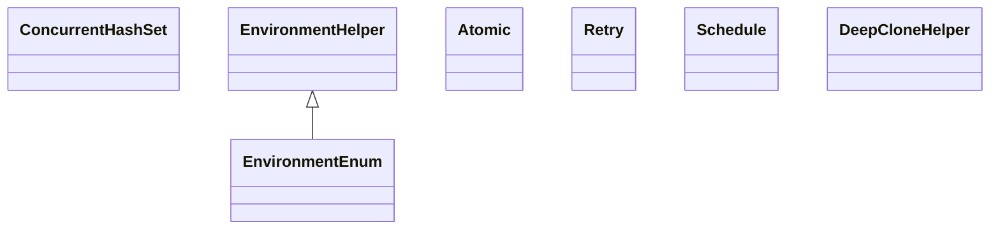
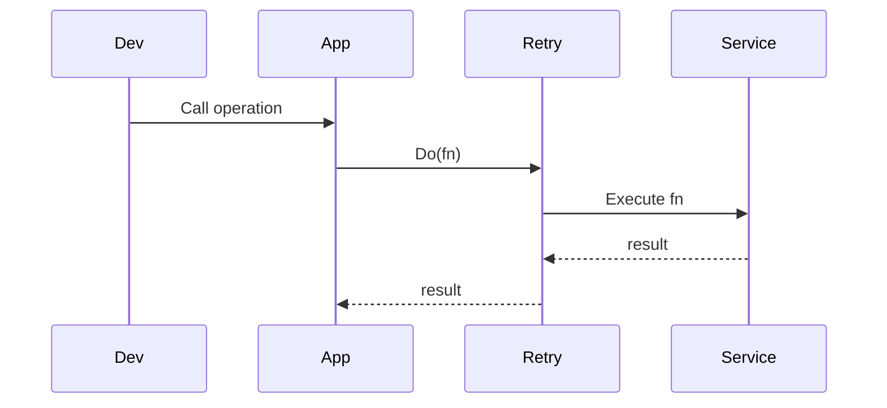

# Ark Core: ArkAllianceEcosystem

## Introduction
Ark Core is the foundational utilities library shared across the **Ark Alliance** ecosystem. Built with **.NET&nbsp;9**, it embraces Domain‑Driven Design (DDD), an event‑driven approach and Clean Architecture principles. The library provides reliable helpers and patterns for building scalable and maintainable applications. A hybrid AI/human layer enables non‑black‑box evolutions through JSON/YAML modelling and conversational feedback.

*Reference date: june 8, 2025*

## Task List
| # | Task | Prompt (System / User) | Status | Remarks & Remaining Work |
|---|------|-----------------------|--------|-------------------------|

|1|Apply documentation guidelines to Ark collections|User: "Apply theses instruction perfectly to the project ; Ark"|In Progress|StackQueue, ListCloneBehavior, ConcurrentHashSet, LazyReadOnlyCollection, TypeList, BuilderCollectionBase, CollectionBuilderBase, IBuilderCollection, ICollectionBuilder, ObservableDictionary and EventClearingObservableCollection documented; other types pending|
|2|Resolve documentation and nullable warnings|User: "Il faut appliquer les règles de documentations pour régler tous ces warning"|Closed|All targeted warnings resolved|


## Index
1. [General Description](#general-description)
2. [Project Structure](#project-structure)
3. [Functional Diagram](#functional-diagram)
4. [Class Diagram](#class-diagram)
5. [UML Sequence Diagram](#uml-sequence-diagram)
6. [Code Examples](#code-examples)
7. [Table of Modules](#table-of-modules)
8. [Dependencies](#dependencies)
9. [Licenses and Acknowledgments](#licenses-and-acknowledgments)
10. [Release](#release)

## General Description
### Main Features
- **Core Collections** – thread‑safe sets and dictionaries (`ConcurrentHashSet`, `ObservableDictionary`), graph structures and builders.
- **Extensions** – numerous extensions for strings, streams, `HttpClient`, dates and more to simplify routine tasks.
- **Helpers** – utilities for cloning, JSON conversion and environment detection (`EnvironmentHelper`).
- **Patterns** – reusable patterns such as `Retry`, `Atomic` transactions and `Schedule` for timed actions.
- **Distributed Locking** – abstractions to coordinate shared resources across processes.
- **Models** – base entities and `IDeepCloneable` infrastructure for building domain objects.
- **Resources** – localization strings for multi-language support.

### Use Cases
- **Microservice foundation** – share common utilities across distributed services.
- **Event‑driven workflows** – implement robust retry and scheduling logic for background jobs.
- **Configuration by dialogue** – evolve behaviours via JSON/YAML specs interpreted by the AI/human layer.
- **Cross-machine resource locking** – coordinate access to shared resources using distributed locks.
- **Testing helpers** – use collections and environment tools in unit or integration tests.

## Project Structure
```
Ark/
├─ Collections/
├─ Extensions/
├─ Helpers/
├─ Models/
├─ Patterns/
├─ Environments/
└─ Resources/
```
### Compliance
The library follows Clean Architecture guidelines. Domain models live under `Models`, infrastructure helpers reside under `Helpers` and `Patterns`, while `Environments` abstracts runtime detection. Event‑driven components such as message retrying are implemented through the `Patterns` folder.

## Functional Diagram


## Class Diagram


## UML Sequence Diagram


## Code Examples
### 1. Basic Usage
```csharp
var set = new ConcurrentHashSet<string>();
set.TryAdd("BTCUSDT");
```
Use in any service requiring a thread‑safe hash set.

### 2. Retry Pattern
```csharp
var data = await Retry.Do(() => GetAsync(), r => r != null);
```
Retries the delegate until the success condition is met.

### 3. Schedule Pattern
```csharp
var scheduler = new ScheduleSet();
scheduler.Add(new ScheduledAction(() => Console.WriteLine("tick")));
```
Executes actions on a timed interval.

### 4. Environment Helper
```csharp
EnvironmentHelper.Initialize(EnvironmentEnum.Prod);
if (EnvironmentHelper.IsEnvironment(EnvironmentEnum.Prod))
{
    // production specific logic
}
```
Adjusts behaviour based on the current environment.

### 5. Fire and Forget
```csharp
DoSomethingAsync().DoNotAwait();
```
Runs a task without awaiting and suppresses compiler warnings.

### 6. Distributed Locking
```csharp
using var writeLock = locker.WriteLock(42, TimeSpan.FromSeconds(10));
// critical section
```
Ensures safe coordination of shared resources across nodes.

## Table of Modules
| Module | Description |
|-------|-------------|
| **Collections** | Additional collection types and builders |
| **Extensions** | Helper methods for primitives, streams and more |
| **Helpers** | JSON converters, observable objects and cloning tools |
| **Patterns** | Transaction, retry and scheduling helpers |
| **Environments** | Current environment detection and utilities |
| **Resources** | Localization data for multi-language apps |

## Dependencies
- JetBrains.Annotations 2024.3.0
- Newtonsoft.Json 13.0.3
- System.Text.Json 9.0.8
- Microsoft.Extensions.Options.ConfigurationExtensions 9.0.8
- Microsoft.Extensions.Options.DataAnnotations 9.0.8

## Licenses and Acknowledgments
- This project is licensed under the MIT license.
- JetBrains.Annotations – [MIT](https://github.com/JetBrains/JetBrains.Annotations)
- Newtonsoft.Json – [MIT](https://github.com/JamesNK/Newtonsoft.Json)
- System.Text.Json – [MIT](https://github.com/dotnet/runtime)
- Microsoft.Extensions.Options.ConfigurationExtensions – [MIT](https://github.com/dotnet/runtime)
- Microsoft.Extensions.Options.DataAnnotations – [MIT](https://github.com/dotnet/runtime)

For integrity, cite the sources and licenses in your own project. This README was partially generated with the assistance of Grok (xAI) and manually reviewed for accuracy.

## Release


**Author**: Armand Richelet-Kleinberg

