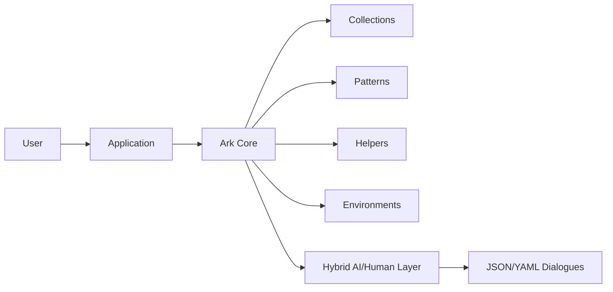
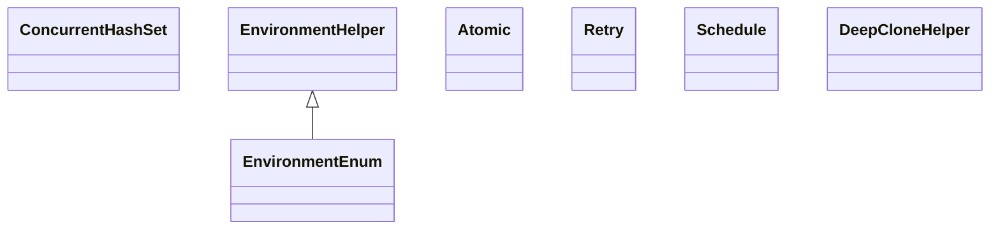
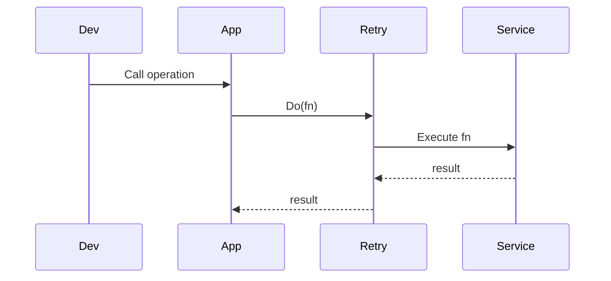

# Code Structure Analysis

**Generated on:** 2025-08-09 11:21:09
**Root Directory:** `C:\Users\ARKle\source\repos\Ark.Alliance.Trading\Ark`
**Comment Processing:** Comments Preserved
**Markdown Included:** README.md only
**JavaScript/JSX:** Excluded
**Analysis Tool:** Code Structure and Content Analyzer (v3)

---

## 📊 Project Statistics

- **Total Directories (with files):** 19
- **Total Included Files:** 134
- **Total Size:** 577.9 KB

### File Type Breakdown

- **.cs**: 131 files
- **.csproj**: 1 files
- **.md**: 1 files
- **.sln**: 1 files

---

## 📁 Directory Structure (Included Files)

```
Ark/
├── Collections/
│   ├── BuilderCollectionBase.cs (2.5 KB)
│   ├── CollectionBuilderBase.cs (10.1 KB)
│   ├── CompositeIntStringKey.cs (3.6 KB)
│   ├── CompositeNStringNStringKey.cs (3.5 KB)
│   ├── CompositeStringStringKey.cs (3.6 KB)
│   ├── CompositeTypeTypeKey.cs (2.8 KB)
│   ├── ConcurrentHashSet.cs (7.7 KB)
│   ├── EventClearingObservableCollection.cs (4.3 KB)
│   ├── IBuilderCollection.cs (813 B)
│   ├── ICollectionBuilder.cs (2.0 KB)
│   ├── LazyReadOnlyCollection.cs (3.7 KB)
│   ├── ListCloneBehavior.cs (1.2 KB)
│   ├── ObservableDictionary.cs (13.3 KB)
│   ├── OrderedHashSet.cs (2.4 KB)
│   ├── SetCollectionBuilderBase.cs (6.6 KB)
│   ├── StackQueue.cs (4.3 KB)
│   ├── TopoGraph.cs (5.3 KB)
│   └── TypeList.cs (1.9 KB)
├── Dto/
│   ├── DiagnosticInfoDto.cs (600 B)
│   ├── ExceptionDto.cs (1.6 KB)
│   ├── IndicatorDto.cs (1010 B)
│   ├── LogDto.cs (1.9 KB)
│   ├── LogTableDto.cs (555 B)
│   ├── ReportDto.cs (1.1 KB)
│   ├── ResultDto.cs (1.1 KB)
│   └── TimedApiCallDto.cs (655 B)
├── Enums/
│   ├── IndicatorStatusEnum.cs (705 B)
│   └── LogSeverityEnum.cs (1.8 KB)
├── Environments/
│   ├── EnvironmentEnum.cs (853 B)
│   └── EnvironmentHelper.cs (2.0 KB)
├── Extensions/
│   ├── Assembly.cs (7.2 KB)
│   ├── ByteArray.cs (7.4 KB)
│   ├── CancellationTokenSource.cs (3.0 KB)
│   ├── Collections.cs (886 B)
│   ├── Color.cs (810 B)
│   ├── DateTime.cs (13.0 KB)
│   ├── Decimal.cs (1010 B)
│   ├── Dictionary.cs (3.6 KB)
│   ├── Double.cs (497 B)
│   ├── Enum.cs (15.9 KB)
│   ├── Event.cs (652 B)
│   ├── Exception.cs (7.5 KB)
│   ├── Expression.cs (1.8 KB)
│   ├── Generic.cs (2.4 KB)
│   ├── Guid.cs (752 B)
│   ├── HttpClient.cs (3.6 KB)
│   ├── HttpResponseMessage.cs (1.3 KB)
│   ├── IEnumerable.cs (14.1 KB)
│   ├── If.cs (5.0 KB)
│   ├── ILookup.cs (1.3 KB)
│   ├── Int.cs (2.2 KB)
│   ├── Int16.cs (837 B)
│   ├── Int32.cs (2.2 KB)
│   ├── Int64.cs (834 B)
│   ├── JsonDocument.cs (992 B)
│   ├── JsonElement.cs (1.1 KB)
│   ├── Object.cs (15.7 KB)
│   ├── ServiceProvider.cs (2.0 KB)
│   ├── Stream.cs (2.0 KB)
│   ├── String.cs (56.2 KB)
│   ├── Task.cs (1.3 KB)
│   ├── Type.cs (8.4 KB)
│   ├── TypeInfo.cs (3.6 KB)
│   ├── UInt16.cs (849 B)
│   ├── UInt32.cs (840 B)
│   ├── UInt64.cs (846 B)
│   └── Uri.cs (797 B)
├── Helpers/
│   ├── ConcurrentSet.cs (4.3 KB)
│   ├── DataPaging.cs (966 B)
│   ├── EventArgs{T}.cs (609 B)
│   ├── ExceptionJsonConverter.cs (4.3 KB)
│   ├── ExpandoObjectJsonConverter.cs (3.1 KB)
│   ├── IgnorePropertyResolver.cs (2.0 KB)
│   ├── JsonConverterSubclass.cs (5.0 KB)
│   ├── Nothing.cs (233 B)
│   ├── ObservableObject.cs (14.9 KB)
│   ├── PrimitiveObjectJsonConverter.cs (2.1 KB)
│   ├── QueryString.cs (1.4 KB)
│   ├── Range.cs (3.6 KB)
│   ├── Semver.cs (21.2 KB)
│   ├── SetTimeout.cs (1.9 KB)
│   ├── TimedObject.cs (1.1 KB)
│   ├── TypeHelper.cs (18.9 KB)
│   └── Ut8StringWriter.cs (902 B)
├── Models/
│   ├── Entities/
│   │   ├── BeingDirty.cs (1.5 KB)
│   │   ├── BeingDirtyBase.cs (7.3 KB)
│   │   ├── EntityBase.cs (5.8 KB)
│   │   ├── EntityExtensions.cs (1.7 KB)
│   │   ├── IArkEntity.cs (484 B)
│   │   ├── ICanBeDirty.cs (1.3 KB)
│   │   ├── IEntity.cs (1.7 KB)
│   │   ├── IRememberBeingDirty.cs (1.5 KB)
│   │   ├── ITreeEntity.cs (2.1 KB)
│   │   ├── IValueObject.cs (244 B)
│   │   ├── TreeEntityBase.cs (3.4 KB)
│   │   └── TreeEntityPath.cs (456 B)
│   ├── _AppSettingsSectionBase.cs (1.5 KB)
│   ├── AppSettingsRepository.cs (5.4 KB)
│   ├── DeepCloneHelper.cs (11.1 KB)
│   ├── DoNotCloneAttribute.cs (363 B)
│   ├── IDeepCloneable.cs (428 B)
│   ├── Settable.cs (3.4 KB)
│   └── TimeWindow.cs (1.2 KB)
├── Patterns/
│   ├── Atomic/
│   │   └── Atomic.cs (19.4 KB)
│   ├── Attempt/
│   │   ├── Attempt.cs (5.9 KB)
│   │   ├── AttemptOfTResult.cs (4.5 KB)
│   │   └── AttemptOfTResultTStatus.cs (5.5 KB)
│   ├── DistributedLocking/
│   │   ├── Exceptions/
│   │   │   ├── DistributedLockingException.cs (822 B)
│   │   │   ├── DistributedLockingTimeoutException.cs (598 B)
│   │   │   ├── DistributedReadLockTimeoutException.cs (531 B)
│   │   │   └── DistributedWriteLockTimeoutException.cs (534 B)
│   │   ├── DistributedLockType.cs (579 B)
│   │   ├── IDistributedLock.cs (435 B)
│   │   ├── IDistributedLockingMechanism.cs (2.3 KB)
│   │   └── IDistributedLockingMechanismFactory.cs (547 B)
│   ├── Mapping/
│   │   ├── IArkMapper.cs (8.0 KB)
│   │   ├── IMapDefinition.cs (291 B)
│   │   ├── MapDefinitionCollection.cs (815 B)
│   │   ├── MapDefinitionCollectionBuilder.cs (1.0 KB)
│   │   └── MapperContext.cs (2.9 KB)
│   ├── Result/
│   │   ├── Result.cs (22.4 KB)
│   │   ├── ResultException.cs (682 B)
│   │   └── ResultStatus.cs (1.6 KB)
│   ├── Retry/
│   │   └── Retry.cs (2.2 KB)
│   ├── Schedule/
│   │   ├── ISchedule.cs (1.7 KB)
│   │   ├── Schedule.cs (26.5 KB)
│   │   ├── ScheduledAction.cs (7.0 KB)
│   │   └── ScheduleSet.cs (4.0 KB)
│   └── Task/
│       ├── MutexAsync.cs (995 B)
│       └── SemaphoreSlimEx.cs (13.5 KB)
├── Resources/
│   └── Localization/
│       └── Resource.Designer.cs (10.2 KB)
├── Ark.csproj (1.4 KB)
├── Ark.sln (1.1 KB)
└── README.md (7.2 KB)
```

---

## 💻 File Contents

Complete content of all included files (with comments):

### Root Directory

**Full Path:** `C:\Users\ARKle\source\repos\Ark.Alliance.Trading\Ark`
**Files:** 3

#### 💾 Ark.csproj

**File Path:** `Ark.csproj`
**File Type:** .CSPROJ (xml)

```xml
<Project Sdk="Microsoft.NET.Sdk">

	<PropertyGroup>
    <TargetFramework>net9.0</TargetFramework>
    <ImplicitUsings>enable</ImplicitUsings>
    <GenerateDocumentationFile>true</GenerateDocumentationFile>
    <Authors>Armand Richelet-Kleinberg</Authors>
    <Company>M2H.IO</Company>
    <PackageLicenseExpression>MIT</PackageLicenseExpression>
    <Description>Ark project</Description>

		<Configurations>Debug;Release</Configurations>
		<GenerateErrorForMissingTargetingPacks>false</GenerateErrorForMissingTargetingPacks>
	</PropertyGroup>

	<PropertyGroup Condition="'$(Configuration)|$(Platform)'=='Default|AnyCPU'">
		<TreatWarningsAsErrors>true</TreatWarningsAsErrors>
		<WarningsAsErrors />
	</PropertyGroup>

	<PropertyGroup Condition="'$(Configuration)|$(Platform)'=='Debug|AnyCPU'">
	  <Optimize>False</Optimize>
	</PropertyGroup>

	<ItemGroup>
		<PackageReference Include="JetBrains.Annotations" Version="2025.2.0" />
		<PackageReference Include="Microsoft.Extensions.Logging" Version="9.0.8" />
		<PackageReference Include="Newtonsoft.Json" Version="13.0.3" />
		<PackageReference Include="System.Text.Json" Version="9.0.8" />
			<PackageReference Include="Microsoft.Extensions.Options.ConfigurationExtensions" Version="9.0.8" />
			<PackageReference Include="Microsoft.Extensions.Options.DataAnnotations" Version="9.0.8" />
	
	</ItemGroup>

</Project>
```

---

#### 💾 Ark.sln

**File Path:** `Ark.sln`
**File Type:** .SLN (text)

```text

Microsoft Visual Studio Solution File, Format Version 12.00
# Visual Studio Version 17
VisualStudioVersion = 17.14.36127.28 d17.14
MinimumVisualStudioVersion = 10.0.40219.1
Project("{FAE04EC0-301F-11D3-BF4B-00C04F79EFBC}") = "Ark", "Ark.csproj", "{EAD60E1A-322B-BFA6-5C27-0DD1B051B25C}"
EndProject
Global
	GlobalSection(SolutionConfigurationPlatforms) = preSolution
		Debug|Any CPU = Debug|Any CPU
		Release|Any CPU = Release|Any CPU
	EndGlobalSection
	GlobalSection(ProjectConfigurationPlatforms) = postSolution
		{EAD60E1A-322B-BFA6-5C27-0DD1B051B25C}.Debug|Any CPU.ActiveCfg = Debug|Any CPU
		{EAD60E1A-322B-BFA6-5C27-0DD1B051B25C}.Debug|Any CPU.Build.0 = Debug|Any CPU
		{EAD60E1A-322B-BFA6-5C27-0DD1B051B25C}.Release|Any CPU.ActiveCfg = Release|Any CPU
		{EAD60E1A-322B-BFA6-5C27-0DD1B051B25C}.Release|Any CPU.Build.0 = Release|Any CPU
	EndGlobalSection
	GlobalSection(SolutionProperties) = preSolution
		HideSolutionNode = FALSE
	EndGlobalSection
	GlobalSection(ExtensibilityGlobals) = postSolution
		SolutionGuid = {5B15B74B-5BCF-4B5F-B49B-C4C49FE862B4}
	EndGlobalSection
EndGlobal

```

---

#### 💾 README.md

**File Path:** `README.md`
**File Type:** .MD (markdown)

```markdown
# Ark Core: ArkAllianceEcosystem

## Introduction
Ark Core is the foundational utilities library shared across the **Ark Alliance** ecosystem. Built with **.NET&nbsp;9**, it embraces Domain‑Driven Design (DDD), an event‑driven approach and Clean Architecture principles. The library provides reliable helpers and patterns for building scalable and maintainable applications. A hybrid AI/human layer enables non‑black‑box evolutions through JSON/YAML modelling and conversational feedback.

*Reference date: june 8, 2025*

## Task List
| # | Task | Prompt (System / User) | Status | Remarks & Remaining Work |
|---|------|-----------------------|--------|-------------------------|

|1|Apply documentation guidelines to Ark collections|User: "Apply theses instruction perfectly to the project ; Ark"|In Progress|StackQueue, ListCloneBehavior, ConcurrentHashSet, LazyReadOnlyCollection, TypeList, BuilderCollectionBase, CollectionBuilderBase, IBuilderCollection, ICollectionBuilder, ObservableDictionary and EventClearingObservableCollection documented; other types pending|
|2|Resolve documentation and nullable warnings|User: "Il faut appliquer les règles de documentations pour régler tous ces warning"|Closed|All targeted warnings resolved|


## Index
1. [General Description](#general-description)
2. [Project Structure](#project-structure)
3. [Functional Diagram](#functional-diagram)
4. [Class Diagram](#class-diagram)
5. [UML Sequence Diagram](#uml-sequence-diagram)
6. [Code Examples](#code-examples)
7. [Table of Modules](#table-of-modules)
8. [Dependencies](#dependencies)
9. [Licenses and Acknowledgments](#licenses-and-acknowledgments)
10. [Release](#release)

## General Description
### Main Features
- **Core Collections** – thread‑safe sets and dictionaries (`ConcurrentHashSet`, `ObservableDictionary`), graph structures and builders.
- **Extensions** – numerous extensions for strings, streams, `HttpClient`, dates and more to simplify routine tasks.
- **Helpers** – utilities for cloning, JSON conversion and environment detection (`EnvironmentHelper`).
- **Patterns** – reusable patterns such as `Retry`, `Atomic` transactions and `Schedule` for timed actions.
- **Distributed Locking** – abstractions to coordinate shared resources across processes.
- **Models** – base entities and `IDeepCloneable` infrastructure for building domain objects.
- **Resources** – localization strings for multi-language support.

### Use Cases
- **Microservice foundation** – share common utilities across distributed services.
- **Event‑driven workflows** – implement robust retry and scheduling logic for background jobs.
- **Configuration by dialogue** – evolve behaviours via JSON/YAML specs interpreted by the AI/human layer.
- **Cross-machine resource locking** – coordinate access to shared resources using distributed locks.
- **Testing helpers** – use collections and environment tools in unit or integration tests.

## Project Structure
```
Ark/
├─ Collections/
├─ Extensions/
├─ Helpers/
├─ Models/
├─ Patterns/
├─ Environments/
└─ Resources/
```
### Compliance
The library follows Clean Architecture guidelines. Domain models live under `Models`, infrastructure helpers reside under `Helpers` and `Patterns`, while `Environments` abstracts runtime detection. Event‑driven components such as message retrying are implemented through the `Patterns` folder.

## Functional Diagram


## Class Diagram


## UML Sequence Diagram


## Code Examples
### 1. Basic Usage
```csharp
var set = new ConcurrentHashSet<string>();
set.TryAdd("BTCUSDT");
```
Use in any service requiring a thread‑safe hash set.

### 2. Retry Pattern
```csharp
var data = await Retry.Do(() => GetAsync(), r => r != null);
```
Retries the delegate until the success condition is met.

### 3. Schedule Pattern
```csharp
var scheduler = new ScheduleSet();
scheduler.Add(new ScheduledAction(() => Console.WriteLine("tick")));
```
Executes actions on a timed interval.

### 4. Environment Helper
```csharp
EnvironmentHelper.Initialize(EnvironmentEnum.Prod);
if (EnvironmentHelper.IsEnvironment(EnvironmentEnum.Prod))
{
    // production specific logic
}
```
Adjusts behaviour based on the current environment.

### 5. Fire and Forget
```csharp
DoSomethingAsync().DoNotAwait();
```
Runs a task without awaiting and suppresses compiler warnings.

### 6. Distributed Locking
```csharp
using var writeLock = locker.WriteLock(42, TimeSpan.FromSeconds(10));
// critical section
```
Ensures safe coordination of shared resources across nodes.

## Table of Modules
| Module | Description |
|-------|-------------|
| **Collections** | Additional collection types and builders |
| **Extensions** | Helper methods for primitives, streams and more |
| **Helpers** | JSON converters, observable objects and cloning tools |
| **Patterns** | Transaction, retry and scheduling helpers |
| **Environments** | Current environment detection and utilities |
| **Resources** | Localization data for multi-language apps |

## Dependencies
- JetBrains.Annotations 2024.3.0
- Newtonsoft.Json 13.0.3
- System.Text.Json 9.0.8
- Microsoft.Extensions.Options.ConfigurationExtensions 9.0.8
- Microsoft.Extensions.Options.DataAnnotations 9.0.8

## Licenses and Acknowledgments
- This project is licensed under the MIT license.
- JetBrains.Annotations – [MIT](https://github.com/JetBrains/JetBrains.Annotations)
- Newtonsoft.Json – [MIT](https://github.com/JamesNK/Newtonsoft.Json)
- System.Text.Json – [MIT](https://github.com/dotnet/runtime)
- Microsoft.Extensions.Options.ConfigurationExtensions – [MIT](https://github.com/dotnet/runtime)
- Microsoft.Extensions.Options.DataAnnotations – [MIT](https://github.com/dotnet/runtime)

For integrity, cite the sources and licenses in your own project. This README was partially generated with the assistance of Grok (xAI) and manually reviewed for accuracy.

## Release
- Initial documentation generated July 21, 2025

**Author**: Armand Richelet-Kleinberg

##  Prompts
```
Review this README and the solution README before modifying the Ark core library.
Run `dotnet format`, `dotnet build` and `dotnet test` after changes and report any failures.
```

###  Negative Prompt
```
Do not introduce breaking changes or new dependencies without explicit instruction.
Never commit secrets or generated artifacts and keep TODO comments until resolved.
```

```

---

### Directory: Collections

**Full Path:** `C:\Users\ARKle\source\repos\Ark.Alliance.Trading\Ark\Collections`
**Files:** 18

#### 💾 BuilderCollectionBase.cs

**File Path:** `Collections\BuilderCollectionBase.cs`
**File Type:** .CS (csharp)

```csharp
using System.Collections;

#nullable enable

namespace Ark
{
    /// <summary>
    /// Provides a lazy, read-only wrapper for builder collections using <see cref="LazyReadOnlyCollection{TItem}"/>.
    /// <para>+ Materializes items on first access and caches results.</para>
    /// <para>- Not thread-safe; synchronize externally if modified.</para>
    /// <para>Ref: <see href="https://learn.microsoft.com/dotnet/api/system.collections.generic.ienumerable-1"/></para>
    /// </summary>
    /// <typeparam name="TItem">Type of the items.</typeparam>
    public abstract class BuilderCollectionBase<TItem> : IBuilderCollection<TItem>
    {
        #region Fields
        private readonly LazyReadOnlyCollection<TItem> _items;
        #endregion Fields

        #region Constructors
        /// <summary>
        /// Initializes a new instance of the <see cref="BuilderCollectionBase{TItem}"/> class.
        /// <para>+ Defers enumeration until items are requested.</para>
        /// <para>- Throws if <paramref name="items"/> returns <see langword="null"/>.</para>
        /// </summary>
        /// <param name="items">Factory delegate providing collection items.</param>
        public BuilderCollectionBase(Func<IEnumerable<TItem>> items) =>
            _items = new LazyReadOnlyCollection<TItem>(items);
        #endregion Constructors

        #region Properties
        /// <summary>
        /// Gets the number of items in the collection.
        /// <para>+ Caches the count after first enumeration.</para>
        /// <para>- Initial access enumerates the items factory.</para>
        /// </summary>
        public int Count => _items.Count;
        #endregion Properties

        #region Methods
        /// <summary>
        /// Returns an enumerator that iterates through the collection.
        /// <para>+ Subsequent iterations reuse the cached items.</para>
        /// <para>- First iteration may allocate the underlying array.</para>
        /// </summary>
        /// <returns>An enumerator over the collection.</returns>
        public IEnumerator<TItem> GetEnumerator() => _items.GetEnumerator();

        /// <summary>
        /// Returns a non-generic enumerator.
        /// <para>Ref: <see href="https://learn.microsoft.com/dotnet/api/system.collections.ienumerable.getenumerator"/></para>
        /// </summary>
        /// <returns>An <see cref="IEnumerator"/> over the collection.</returns>
        IEnumerator IEnumerable.GetEnumerator() => GetEnumerator();
        #endregion Methods
    }
}

```

---

#### 💾 CollectionBuilderBase.cs

**File Path:** `Collections\CollectionBuilderBase.cs`
**File Type:** .CS (csharp)

```csharp
using Microsoft.Extensions.DependencyInjection;

#nullable enable

namespace Ark
{
    /// <summary>
    /// Builds and registers <see cref="IBuilderCollection{TItem}"/> implementations with dependency injection.
    /// <para>+ Ensures collection and items share the same <see cref="ServiceLifetime"/>.</para>
    /// <para>- Single-use; repeated registrations throw <see cref="InvalidOperationException"/>.</para>
    /// <para>Ref: <see href="https://learn.microsoft.com/dotnet/core/extensions/dependency-injection"/></para>
    /// </summary>
    /// <typeparam name="TBuilder">Type of the builder.</typeparam>
    /// <typeparam name="TCollection">Type of the collection.</typeparam>
    /// <typeparam name="TItem">Type of the items.</typeparam>
    public abstract class CollectionBuilderBase<TBuilder, TCollection, TItem> : ICollectionBuilder<TCollection, TItem>
        where TBuilder : CollectionBuilderBase<TBuilder, TCollection, TItem>
        where TCollection : class, IBuilderCollection<TItem>
    {
        #region Fields
        private readonly Lock _locker = new();
        private readonly List<Type> _types = new();
        private Type[]? _registeredTypes;
        #endregion Fields

        #region Properties
        /// <summary>
        /// Gets the lifetime applied to the collection and its items.
        /// <para>+ Defaults to <see cref="ServiceLifetime.Singleton"/>.</para>
        /// <para>- Override to use scoped or transient lifetimes.</para>
        /// </summary>
        protected virtual ServiceLifetime CollectionLifetime => ServiceLifetime.Singleton;
        #endregion Properties

        #region Methods
        /// <summary>
        /// Registers the builder with the specified <see cref="IServiceCollection"/>.
        /// <para>+ Adds both the collection and its item types to the container.</para>
        /// <para>- Throws if invoked more than once.</para>
        /// </summary>
        /// <param name="services">DI service collection.</param>
        public virtual void RegisterWith(IServiceCollection services)
        {
            if (_registeredTypes != null)
            {
                throw new InvalidOperationException("This builder has already been registered.");
            }

            // register the collection
            services.Add(new ServiceDescriptor(typeof(TCollection), CreateCollection, CollectionLifetime));

            // register the types
            RegisterTypes(services);
        }

        /// <summary>
        /// Creates a collection instance.
        /// <para>+ Respects registration order of items.</para>
        /// <para>- Each call resolves all items, which may be costly.</para>
        /// </summary>
        /// <param name="factory">Service provider used to resolve dependencies.</param>
        /// <returns>The constructed collection. JSON: serialized object.</returns>
        /// <remarks>Creates a new collection each time it is invoked.</remarks>
        public virtual TCollection CreateCollection(IServiceProvider factory) =>
            factory.CreateInstance<TCollection>(CreateItemsFactory(factory));

        /// <summary>
        /// Exposes the registered item types as an immutable sequence.
        /// <para>+ Useful for diagnostics or custom ordering.</para>
        /// <para>- Modifying the returned list has no effect.</para>
        /// </summary>
        /// <returns>Sequence of registered types.</returns>
        public IEnumerable<Type> GetTypes() => _types;

        /// <summary>
        /// Determines whether the collection contains the specified type.
        /// <para>+ Generic overload avoids runtime <see cref="Type"/> instances.</para>
        /// <para>- Requires the type to be known at compile time.</para>
        /// </summary>
        /// <typeparam name="T">Type to search for.</typeparam>
        /// <returns><see langword="true"/> if present; otherwise <see langword="false"/>. JSON: <c>true</c>/<c>false</c>.</returns>
        /// <remarks>
        /// Some builders may surface this as a public <c>Has&lt;T&gt;()</c> method when it is meaningful.
        /// </remarks>
        public virtual bool Has<T>()
            where T : TItem =>
            _types.Contains(typeof(T));

        /// <summary>
        /// Determines whether the collection contains the specified <see cref="Type"/>.
        /// <para>+ Validates compatibility with <typeparamref name="TItem"/>.</para>
        /// <para>- Throws if <paramref name="type"/> is not assignable.</para>
        /// </summary>
        /// <param name="type">Type to search for.</param>
        /// <returns><see langword="true"/> if present; otherwise <see langword="false"/>. JSON: <c>true</c>/<c>false</c>.</returns>
        /// <remarks>
        /// Some builders may expose this as a public <c>Has(Type)</c> helper when appropriate.
        /// </remarks>
        public virtual bool Has(Type type)
        {
            EnsureType(type, "find");
            return _types.Contains(type);
        }

        /// <summary>
        /// Configures the internal list of types.
        /// <para>+ Allows fluent registration before DI integration.</para>
        /// <para>- Throws if called after <see cref="RegisterWith"/>.</para>
        /// </summary>
        /// <param name="action">Action manipulating the underlying list.</param>
        /// <remarks>Throws if the types have already been registered.</remarks>
        protected void Configure(Action<List<Type>> action)
        {
            lock (_locker)
            {
                if (_registeredTypes != null)
                {
                    throw new InvalidOperationException(
                        "Cannot configure a collection builder after it has been registered.");
                }

                action(_types);
            }
        }

        /// <summary>
        /// Provides the list of types to register with the container.
        /// <para>+ Enables filtering or ordering before registration.</para>
        /// <para>- Default implementation returns the input unchanged.</para>
        /// </summary>
        /// <param name="types">Internal list of types.</param>
        /// <returns>Enumeration of types to register.</returns>
        /// <remarks>Used by implementations to add or reorder types.</remarks>
        protected virtual IEnumerable<Type> GetRegisteringTypes(IEnumerable<Type> types) => types;

        /// <summary>
        /// Creates the collection items using the registered types.
        /// <para>+ Respects the registration order.</para>
        /// <para>- Throws if <see cref="_registeredTypes"/> is <see langword="null"/>.</para>
        /// </summary>
        /// <param name="factory">Service provider used to resolve items.</param>
        /// <returns>Collection items.</returns>
        protected virtual IEnumerable<TItem> CreateItems(IServiceProvider factory)
        {
            if (_registeredTypes == null)
            {
                throw new InvalidOperationException(
                    "Cannot create items before the collection builder has been registered.");
            }

            return _registeredTypes // respect order
                .Select(x => CreateItem(factory, x))
                .ToArray(); // safe
        }

        /// <summary>
        /// Creates a single collection item.
        /// <para>+ Uses <see cref="ServiceProviderServiceExtensions.GetRequiredService(IServiceProvider, Type)"/> for resolution.</para>
        /// <para>- Resolving transient dependencies on each call may allocate.</para>
        /// </summary>
        /// <param name="factory">Service provider.</param>
        /// <param name="itemType">Type to resolve.</param>
        /// <returns>The resolved item.</returns>
        protected virtual TItem CreateItem(IServiceProvider factory, Type itemType) =>
            (TItem)factory.GetRequiredService(itemType);

        /// <summary>
        /// Ensures the specified <see cref="Type"/> derives from <typeparamref name="TItem"/>.
        /// <para>+ Prevents invalid registrations at runtime.</para>
        /// <para>- Reflection checks may incur minor overhead.</para>
        /// </summary>
        /// <param name="type">Type to validate.</param>
        /// <param name="action">Contextual verb for exception messages.</param>
        /// <returns>The validated type.</returns>
        protected Type EnsureType(Type type, string action)
        {
            if (typeof(TItem).IsAssignableFrom(type) == false)
            {
                throw new InvalidOperationException(
                    $"Cannot {action} type {type.FullName} as it does not inherit from/implement {typeof(TItem).FullName}.");
            }

            return type;
        }

        private void RegisterTypes(IServiceCollection services)
        {
            lock (_locker)
            {
                if (_registeredTypes != null)
                {
                    return;
                }

                Type[] types = GetRegisteringTypes(_types).ToArray();

                // ensure they are safe
                foreach (Type type in types)
                {
                    EnsureType(type, "register");
                }

                // register them - ensuring that each item is registered with the same lifetime as the collection.
                // NOTE: Previously each one was not registered with the same lifetime which would mean that if there
                // was a dependency on an individual item, it would resolve a brand new transient instance which isn't what
                // we would expect to happen. The same item should be resolved from the container as the collection.
                foreach (Type type in types)
                {
                    services.Add(new ServiceDescriptor(type, type, CollectionLifetime));
                }

                _registeredTypes = types;
            }
        }

        // used to resolve a Func<IEnumerable<TItem>> parameter
        private Func<IEnumerable<TItem>> CreateItemsFactory(IServiceProvider factory) => () => CreateItems(factory);
        #endregion Methods
    }
}

```

---

#### 💾 CompositeIntStringKey.cs

**File Path:** `Collections\CompositeIntStringKey.cs`
**File Type:** .CS (csharp)

```csharp
namespace Ark;

#nullable enable

/// <summary>
/// Represents a case-insensitive composite dictionary key composed of an integer and a string.
/// <para>+ Enables fast lookups with minimal allocations.</para>
/// <para>- Integer part must be non-negative.</para>
/// <para>Ref: <see href="https://learn.microsoft.com/dotnet/api/system.collections.generic.dictionary-2"/></para>
/// </summary>
/// <example>
/// <code language="csharp">
/// var key = new CompositeIntStringKey(1, "btc");
/// var dict = new Dictionary<CompositeIntStringKey, int>();
/// dict[key] = 42;
/// </code>
/// </example>
public struct CompositeIntStringKey : IEquatable<CompositeIntStringKey>
{
    #region Fields
    private readonly int _key1;
    private readonly string _key2;
    #endregion Fields

    #region Constructors
    /// <summary>
    /// Initializes a new instance of the <see cref="CompositeIntStringKey"/> struct.
    /// <para>+ Normalizes null components to sentinel values.</para>
    /// <para>- Throws when <paramref name="key1"/> is negative.</para>
    /// </summary>
    /// <param name="key1">Non-negative integer component. Use <c>null</c> for a sentinel value of -1.</param>
    /// <param name="key2">String component compared case-insensitively. <c>null</c> becomes "NULL".</param>
    public CompositeIntStringKey(int? key1, string? key2)
    {
        if (key1 < 0)
        {
            throw new ArgumentOutOfRangeException(nameof(key1));
        }

        _key1 = key1 ?? -1;
        _key2 = key2?.ToLowerInvariant() ?? "NULL";
    }
    #endregion Constructors

    #region Operators
    /// <summary>
    /// Determines whether two keys are equal.
    /// </summary>
    /// <param name="left">First key to compare.</param>
    /// <param name="right">Second key to compare.</param>
    /// <returns><c>true</c> if both keys are equal; otherwise <c>false</c>.</returns>
    public static bool operator ==(CompositeIntStringKey left, CompositeIntStringKey right)
        => left._key2 == right._key2 && left._key1 == right._key1;

    /// <summary>
    /// Determines whether two keys are not equal.
    /// </summary>
    /// <param name="left">First key to compare.</param>
    /// <param name="right">Second key to compare.</param>
    /// <returns><c>true</c> if the keys differ; otherwise <c>false</c>.</returns>
    public static bool operator !=(CompositeIntStringKey left, CompositeIntStringKey right)
        => left._key2 != right._key2 || left._key1 != right._key1;
    #endregion Operators

    #region Equality
    /// <summary>
    /// Indicates whether the current key is equal to another key.
    /// </summary>
    /// <param name="other">The key to compare with.</param>
    /// <returns><c>true</c> if the keys are equal; otherwise <c>false</c>.</returns>
    public bool Equals(CompositeIntStringKey other)
        => _key2 == other._key2 && _key1 == other._key1;

    /// <summary>
    /// Determines whether the specified object is equal to the current key.
    /// </summary>
    /// <param name="obj">Object to compare with.</param>
    /// <returns><c>true</c> if <paramref name="obj"/> is <see cref="CompositeIntStringKey"/> and equals this instance; otherwise <c>false</c>.</returns>
    public override bool Equals(object? obj)
        => obj is CompositeIntStringKey other && _key2 == other._key2 && _key1 == other._key1;

    /// <summary>
    /// Returns a hash code for the current key.
    /// </summary>
    /// <returns>Combined hash code of its components.</returns>
    public override int GetHashCode()
        => (_key2.GetHashCode() * 31) + _key1;
    #endregion Equality
}

```

---

#### 💾 CompositeNStringNStringKey.cs

**File Path:** `Collections\CompositeNStringNStringKey.cs`
**File Type:** .CS (csharp)

```csharp
namespace Ark;

#nullable enable

/// <summary>
/// Represents a case-insensitive composite dictionary key composed of two optional strings.
/// <para>+ Supports <c>null</c> components without allocations.</para>
/// <para>- Uses the sentinel value "NULL" which may collide with legitimate values.</para>
/// <para>Ref: <see href="https://learn.microsoft.com/dotnet/api/system.string"/></para>
/// </summary>
/// <example>
/// <code language="csharp">
/// var key = new CompositeNStringNStringKey(null, "btc");
/// </code>
/// </example>
public struct CompositeNStringNStringKey : IEquatable<CompositeNStringNStringKey>
{
    #region Fields
    private readonly string _key1;
    private readonly string _key2;
    #endregion Fields

    #region Constructors
    /// <summary>
    /// Initializes a new instance of the <see cref="CompositeNStringNStringKey"/> struct.
    /// <para>+ Normalizes missing components to the sentinel value "NULL".</para>
    /// </summary>
    /// <param name="key1">First string component. <c>null</c> becomes "NULL".</param>
    /// <param name="key2">Second string component. <c>null</c> becomes "NULL".</param>
    public CompositeNStringNStringKey(string? key1, string? key2)
    {
        _key1 = key1?.ToLowerInvariant() ?? "NULL";
        _key2 = key2?.ToLowerInvariant() ?? "NULL";
    }
    #endregion Constructors

    #region Operators
    /// <summary>
    /// Determines whether two keys are equal.
    /// </summary>
    /// <param name="left">First key to compare.</param>
    /// <param name="right">Second key to compare.</param>
    /// <returns><c>true</c> if both keys are equal; otherwise <c>false</c>.</returns>
    public static bool operator ==(CompositeNStringNStringKey left, CompositeNStringNStringKey right)
        => left._key2 == right._key2 && left._key1 == right._key1;

    /// <summary>
    /// Determines whether two keys are not equal.
    /// </summary>
    /// <param name="left">First key to compare.</param>
    /// <param name="right">Second key to compare.</param>
    /// <returns><c>true</c> if the keys differ; otherwise <c>false</c>.</returns>
    public static bool operator !=(CompositeNStringNStringKey left, CompositeNStringNStringKey right)
        => left._key2 != right._key2 || left._key1 != right._key1;
    #endregion Operators

    #region Equality
    /// <summary>
    /// Indicates whether the current key is equal to another key.
    /// </summary>
    /// <param name="other">The key to compare with.</param>
    /// <returns><c>true</c> if the keys are equal; otherwise <c>false</c>.</returns>
    public bool Equals(CompositeNStringNStringKey other)
        => _key2 == other._key2 && _key1 == other._key1;

    /// <summary>
    /// Determines whether the specified object is equal to the current key.
    /// </summary>
    /// <param name="obj">Object to compare with.</param>
    /// <returns><c>true</c> if <paramref name="obj"/> is <see cref="CompositeNStringNStringKey"/> and equals this instance; otherwise <c>false</c>.</returns>
    public override bool Equals(object? obj)
        => obj is CompositeNStringNStringKey other && _key2 == other._key2 && _key1 == other._key1;

    /// <summary>
    /// Returns a hash code for the current key.
    /// </summary>
    /// <returns>Combined hash code of its components.</returns>
    public override int GetHashCode()
        => (_key2.GetHashCode() * 31) + _key1.GetHashCode();
    #endregion Equality
}

```

---

#### 💾 CompositeStringStringKey.cs

**File Path:** `Collections\CompositeStringStringKey.cs`
**File Type:** .CS (csharp)

```csharp
namespace Ark;

#nullable enable

/// <summary>
/// Represents a case-insensitive composite dictionary key composed of two strings.
/// <para>+ Simplifies lookups using combined identifiers.</para>
/// <para>- Neither component may be <c>null</c>.</para>
/// <para>Ref: <see href="https://learn.microsoft.com/dotnet/api/system.string"/></para>
/// </summary>
/// <example>
/// <code language="csharp">
/// var key = new CompositeStringStringKey("eth", "usdt");
/// var dict = new Dictionary<CompositeStringStringKey, int>();
/// dict[key] = 1;
/// </code>
/// </example>
public struct CompositeStringStringKey : IEquatable<CompositeStringStringKey>
{
    #region Fields
    private readonly string _key1;
    private readonly string _key2;
    #endregion Fields

    #region Constructors
    /// <summary>
    /// Initializes a new instance of the <see cref="CompositeStringStringKey"/> struct.
    /// <para>+ Normalizes components for case-insensitive comparisons.</para>
    /// <para>- Throws when any component is <c>null</c>.</para>
    /// </summary>
    /// <param name="key1">First string component. Cannot be <c>null</c>.</param>
    /// <param name="key2">Second string component. Cannot be <c>null</c>.</param>
    public CompositeStringStringKey(string? key1, string? key2)
    {
        _key1 = key1?.ToLowerInvariant() ?? throw new ArgumentNullException(nameof(key1));
        _key2 = key2?.ToLowerInvariant() ?? throw new ArgumentNullException(nameof(key2));
    }
    #endregion Constructors

    #region Operators
    /// <summary>
    /// Determines whether two keys are equal.
    /// </summary>
    /// <param name="left">First key to compare.</param>
    /// <param name="right">Second key to compare.</param>
    /// <returns><c>true</c> if both keys are equal; otherwise <c>false</c>.</returns>
    public static bool operator ==(CompositeStringStringKey left, CompositeStringStringKey right)
        => left._key2 == right._key2 && left._key1 == right._key1;

    /// <summary>
    /// Determines whether two keys are not equal.
    /// </summary>
    /// <param name="left">First key to compare.</param>
    /// <param name="right">Second key to compare.</param>
    /// <returns><c>true</c> if the keys differ; otherwise <c>false</c>.</returns>
    public static bool operator !=(CompositeStringStringKey left, CompositeStringStringKey right)
        => left._key2 != right._key2 || left._key1 != right._key1;
    #endregion Operators

    #region Equality
    /// <summary>
    /// Indicates whether the current key is equal to another key.
    /// </summary>
    /// <param name="other">The key to compare with.</param>
    /// <returns><c>true</c> if the keys are equal; otherwise <c>false</c>.</returns>
    public bool Equals(CompositeStringStringKey other)
        => _key2 == other._key2 && _key1 == other._key1;

    /// <summary>
    /// Determines whether the specified object is equal to the current key.
    /// </summary>
    /// <param name="obj">Object to compare with.</param>
    /// <returns><c>true</c> if <paramref name="obj"/> is <see cref="CompositeStringStringKey"/> and equals this instance; otherwise <c>false</c>.</returns>
    public override bool Equals(object? obj)
        => obj is CompositeStringStringKey other && _key2 == other._key2 && _key1 == other._key1;

    /// <summary>
    /// Returns a hash code for the current key.
    /// </summary>
    /// <returns>Combined hash code of its components.</returns>
    public override int GetHashCode()
        => (_key2.GetHashCode() * 31) + _key1.GetHashCode();
    #endregion Equality
}

```

---

#### 💾 CompositeTypeTypeKey.cs

**File Path:** `Collections\CompositeTypeTypeKey.cs`
**File Type:** .CS (csharp)

```csharp
namespace Ark;

#nullable enable

/// <summary>
/// Represents a composite dictionary key composed of two <see cref="Type"/> instances.
/// <para>+ Avoids tuple allocations for type-based lookups.</para>
/// <para>- Components must not be <c>null</c>.</para>
/// <para>Ref: <see href="https://learn.microsoft.com/dotnet/api/system.type"/></para>
/// </summary>
/// <example>
/// <code language="csharp">
/// var key = new CompositeTypeTypeKey(typeof(string), typeof(int));
/// </code>
/// </example>
public struct CompositeTypeTypeKey : IEquatable<CompositeTypeTypeKey>
{
    #region Constructors
    /// <summary>
    /// Initializes a new instance of the <see cref="CompositeTypeTypeKey"/> struct.
    /// </summary>
    /// <param name="type1">First type component.</param>
    /// <param name="type2">Second type component.</param>
    public CompositeTypeTypeKey(Type type1, Type type2)
        : this()
    {
        Type1 = type1;
        Type2 = type2;
    }
    #endregion Constructors

    #region Properties
    /// <summary>
    /// Gets the first type component.
    /// </summary>
    public Type Type1 { get; }

    /// <summary>
    /// Gets the second type component.
    /// </summary>
    public Type Type2 { get; }
    #endregion Properties

    #region Operators
    /// <summary>
    /// Determines whether two keys are equal.
    /// </summary>
    /// <param name="left">First key to compare.</param>
    /// <param name="right">Second key to compare.</param>
    /// <returns><c>true</c> if both keys are equal; otherwise <c>false</c>.</returns>
    public static bool operator ==(CompositeTypeTypeKey left, CompositeTypeTypeKey right)
        => left.Type1 == right.Type1 && left.Type2 == right.Type2;

    /// <summary>
    /// Determines whether two keys are not equal.
    /// </summary>
    /// <param name="left">First key to compare.</param>
    /// <param name="right">Second key to compare.</param>
    /// <returns><c>true</c> if the keys differ; otherwise <c>false</c>.</returns>
    public static bool operator !=(CompositeTypeTypeKey left, CompositeTypeTypeKey right)
        => left.Type1 != right.Type1 || left.Type2 != right.Type2;
    #endregion Operators

    #region Equality
    /// <inheritdoc />
    public bool Equals(CompositeTypeTypeKey other) => Type1 == other.Type1 && Type2 == other.Type2;

    /// <inheritdoc />
    public override bool Equals(object? obj)
    {
        var other = obj is CompositeTypeTypeKey key ? key : default;
        return Type1 == other.Type1 && Type2 == other.Type2;
    }

    /// <inheritdoc />
    public override int GetHashCode()
    {
        unchecked
        {
            return (Type1.GetHashCode() * 397) ^ Type2.GetHashCode();
        }
    }
    #endregion Equality
}

```

---

#### 💾 ConcurrentHashSet.cs

**File Path:** `Collections\ConcurrentHashSet.cs`
**File Type:** .CS (csharp)

```csharp
using System.Collections;

#nullable enable

namespace Ark;

/// <summary>
/// Provides a thread-safe wrapper around <see cref="HashSet{T}"/> using <see cref="ReaderWriterLockSlim"/> locks.
/// <para>+ Safe concurrent reads and writes without external synchronization.</para>
/// <para>- Enumeration clones the set and may allocate; avoid on hot paths.</para>
/// <para>Ref: <see href="https://learn.microsoft.com/dotnet/api/system.collections.generic.hashset-1"/></para>
/// </summary>
/// <typeparam name="T">Type of elements stored in the set.</typeparam>
[Serializable]
public class ConcurrentHashSet<T> : ICollection<T>
{
    #region Fields
    private readonly HashSet<T> _innerSet = new();
    private readonly ReaderWriterLockSlim _instanceLocker = new(LockRecursionPolicy.NoRecursion);
    #endregion Fields

    #region Properties
    /// <summary>
    /// Gets the number of elements contained in the collection.
    /// <para>+ O(1) lookup guarded by a read lock.</para>
    /// <para>- Count may change immediately after the lock is released.</para>
    /// </summary>
    public int Count
    {
        get
        {
            try
            {
                _instanceLocker.EnterReadLock();
                return _innerSet.Count;
            }
            finally
            {
                if (_instanceLocker.IsReadLockHeld)
                {
                    _instanceLocker.ExitReadLock();
                }
            }
        }
    }

    /// <summary>
    /// Indicates whether the set is read-only.
    /// <para>+ Always <see langword="false"/> enabling modifications.</para>
    /// <para>- Cannot be toggled to immutable at runtime.</para>
    /// </summary>
    public bool IsReadOnly => false;
    #endregion Properties

    #region Methods
    /// <summary>
    /// Adds an item to the set.
    /// <para>+ Write lock ensures exclusive access.</para>
    /// <para>- No feedback when an item already exists; use <see cref="TryAdd"/> to know.</para>
    /// </summary>
    /// <param name="item">Item to insert.</param>
    public void Add(T item)
    {
        try
        {
            _instanceLocker.EnterWriteLock();
            _innerSet.Add(item);
        }
        finally
        {
            if (_instanceLocker.IsWriteLockHeld)
            {
                _instanceLocker.ExitWriteLock();
            }
        }
    }

    /// <summary>
    /// Attempts to add an item only if it does not already exist.
    /// <para>+ Prevents duplicates in concurrent scenarios.</para>
    /// <para>- Performs two lookups which may impact large sets.</para>
    /// </summary>
    /// <param name="item">Item to add.</param>
    /// <returns><see langword="true"/> if the item was added; otherwise <see langword="false"/>. JSON: <c>true</c>/<c>false</c>.</returns>
    public bool TryAdd(T item)
    {
        if (Contains(item))
        {
            return false;
        }

        try
        {
            _instanceLocker.EnterWriteLock();

            if (_innerSet.Contains(item))
            {
                return false;
            }

            _innerSet.Add(item);
            return true;
        }
        finally
        {
            if (_instanceLocker.IsWriteLockHeld)
            {
                _instanceLocker.ExitWriteLock();
            }
        }
    }

    /// <summary>
    /// Removes all items from the set.
    /// <para>+ Leaves the instance reusable without allocating a new set.</para>
    /// <para>- Releases references held by contained elements.</para>
    /// </summary>
    public void Clear()
    {
        try
        {
            _instanceLocker.EnterWriteLock();
            _innerSet.Clear();
        }
        finally
        {
            if (_instanceLocker.IsWriteLockHeld)
            {
                _instanceLocker.ExitWriteLock();
            }
        }
    }

    /// <summary>
    /// Determines whether the set contains a specific value.
    /// <para>+ Read lock ensures a consistent view.</para>
    /// <para>- May block writers while the read lock is held.</para>
    /// </summary>
    /// <param name="item">Item to locate.</param>
    /// <returns><see langword="true"/> if found; otherwise <see langword="false"/>. JSON: <c>true</c>/<c>false</c>.</returns>
    public bool Contains(T item)
    {
        try
        {
            _instanceLocker.EnterReadLock();
            return _innerSet.Contains(item);
        }
        finally
        {
            if (_instanceLocker.IsReadLockHeld)
            {
                _instanceLocker.ExitReadLock();
            }
        }
    }

    /// <summary>
    /// Removes the first occurrence of an item from the set.
    /// <para>+ Write lock guarantees exclusive access.</para>
    /// <para>- Returns <see langword="false"/> when the item is absent.</para>
    /// </summary>
    /// <param name="item">Item to remove.</param>
    /// <returns><see langword="true"/> if the item was removed; otherwise <see langword="false"/>. JSON: <c>true</c>/<c>false</c>.</returns>
    public bool Remove(T item)
    {
        try
        {
            _instanceLocker.EnterWriteLock();
            return _innerSet.Remove(item);
        }
        finally
        {
            if (_instanceLocker.IsWriteLockHeld)
            {
                _instanceLocker.ExitWriteLock();
            }
        }
    }

    /// <summary>
    /// Returns an enumerator that iterates over a thread-safe snapshot of the set.
    /// <para>+ Enumeration is unaffected by concurrent modifications.</para>
    /// <para>- Snapshot allocation occurs on each call.</para>
    /// </summary>
    /// <returns>An enumerator over a cloned set.</returns>
    public IEnumerator<T> GetEnumerator() => GetThreadSafeClone().GetEnumerator();

    /// <summary>
    /// Returns a non-generic enumerator for the snapshot.
    /// <para>Ref: <see href="https://learn.microsoft.com/dotnet/api/system.collections.ienumerable.getenumerator"/></para>
    /// </summary>
    /// <returns>An <see cref="IEnumerator"/> over a cloned set.</returns>
    IEnumerator IEnumerable.GetEnumerator() => GetEnumerator();

    /// <summary>
    /// Copies the elements of the set to an array starting at the specified index.
    /// <para>+ Uses a snapshot for thread safety.</para>
    /// <para>- Snapshot creation may allocate.</para>
    /// </summary>
    /// <param name="array">Destination array.</param>
    /// <param name="arrayIndex">Zero-based index in <paramref name="array"/> where copying begins.</param>
    public void CopyTo(T[] array, int arrayIndex)
    {
        var clone = GetThreadSafeClone();
        clone.CopyTo(array, arrayIndex);
    }

    /// <summary>
    /// Copies the elements of the set to a non-generic <see cref="Array"/>.
    /// <para>+ Compatible with legacy APIs.</para>
    /// <para>- Requires boxing for value types.</para>
    /// </summary>
    /// <param name="array">Destination array.</param>
    /// <param name="index">Zero-based starting index.</param>
    public void CopyTo(Array array, int index)
    {
        var clone = GetThreadSafeClone();
        Array.Copy(clone.ToArray(), 0, array, index, clone.Count);
    }
    #endregion Methods

    #region Helpers
    private HashSet<T> GetThreadSafeClone()
    {
        HashSet<T>? clone = null;
        try
        {
            _instanceLocker.EnterReadLock();
            clone = new HashSet<T>(_innerSet, _innerSet.Comparer);
        }
        finally
        {
            if (_instanceLocker.IsReadLockHeld)
            {
                _instanceLocker.ExitReadLock();
            }
        }

        return clone!;
    }
    #endregion Helpers
}


```

---

#### 💾 EventClearingObservableCollection.cs

**File Path:** `Collections\EventClearingObservableCollection.cs`
**File Type:** .CS (csharp)

```csharp
using System.Collections.ObjectModel;
using System.Collections.Specialized;

#nullable enable

namespace Ark;

/// <summary>
/// Provides an <see cref="ObservableCollection{T}"/> that exposes a method to clear all
/// <see cref="INotifyCollectionChanged.CollectionChanged"/> subscriptions.
/// <para>+ Prevents memory leaks by explicitly removing event handlers.</para>
/// <para>- Not thread-safe; synchronize access in concurrent scenarios.</para>
/// <para>Ref: <see href="https://learn.microsoft.com/dotnet/api/system.collections.objectmodel.observablecollection-1"/></para>
/// </summary>
/// <typeparam name="TValue">Type of elements contained in the collection.</typeparam>
/// <example>
/// <code language="csharp">
/// var coll = new EventClearingObservableCollection<int>();
/// coll.CollectionChanged += (s, e) => Console.WriteLine("changed");
/// coll.Add(1);
/// coll.ClearCollectionChangedEvents();
/// </code>
/// </example>
public class EventClearingObservableCollection<TValue> : ObservableCollection<TValue>, INotifyCollectionChanged, IDeepCloneable
{
        // need to explicitly implement with event accessor syntax in order to override in order to to clear
        // c# events are weird, they do not behave the same way as other c# things that are 'virtual',
        // a good article is here: https://medium.com/@unicorn_dev/virtual-events-in-c-something-went-wrong-c6f6f5fbe252
        // and https://stackoverflow.com/questions/2268065/c-sharp-language-design-explicit-interface-implementation-of-an-event
        private NotifyCollectionChangedEventHandler? _changed;

        /// <summary>
        /// Initializes a new empty instance of the collection.
        /// <para>+ Ready for item insertion.</para>
        /// <para>- Requires manual synchronization if shared across threads.</para>
        /// </summary>
        public EventClearingObservableCollection()
        {
        }

        /// <summary>
        /// Initializes the collection with the contents of the provided list.
        /// <para>+ Avoids enumerating when a <see cref="List{T}"/> is already available.</para>
        /// <para>- The list is copied; further changes to <paramref name="list"/> are not reflected.</para>
        /// </summary>
        /// <param name="list">Source list whose items populate the collection.</param>
        public EventClearingObservableCollection(List<TValue> list)
            : base(list)
        {
        }

        /// <summary>
        /// Initializes the collection with items from the supplied sequence.
        /// <para>+ Accepts any <see cref="IEnumerable{T}"/>.</para>
        /// <para>- Enumerates the sequence immediately.</para>
        /// </summary>
        /// <param name="collection">Sequence of items used to populate the collection.</param>
        public EventClearingObservableCollection(IEnumerable<TValue> collection)
            : base(collection)
        {
        }

        event NotifyCollectionChangedEventHandler? INotifyCollectionChanged.CollectionChanged
        {
            add => _changed += value;
            remove => _changed -= value;
        }

        /// <summary>
        /// Removes all <see cref="INotifyCollectionChanged.CollectionChanged"/> event handlers.
        /// <para>+ Frees subscribers that no longer need notifications.</para>
        /// <para>- Subsequent changes will not notify previously attached listeners.</para>
        /// </summary>
        public void ClearCollectionChangedEvents() => _changed = null;

        /// <summary>
        /// Creates a deep clone of the collection and its items.
        /// <para>+ Utilises <see cref="DeepCloneHelper"/> to replicate items.</para>
        /// <para>- Requires items to implement <see cref="IDeepCloneable"/> for full fidelity.</para>
        /// <para>Ref: <see href="https://learn.microsoft.com/dotnet/api/system.object.memberwiseclone"/></para>
        /// </summary>
        /// <returns>A new <see cref="EventClearingObservableCollection{TValue}"/> containing cloned items.</returns>
        public object DeepClone()
        {
            var clone = new EventClearingObservableCollection<TValue>();
            DeepCloneHelper.CloneListItems<EventClearingObservableCollection<TValue>, TValue>(this, clone);

            return clone;
        }
    }


```

---

#### 💾 IBuilderCollection.cs

**File Path:** `Collections\IBuilderCollection.cs`
**File Type:** .CS (csharp)

```csharp
namespace Ark
{
    /// <summary>
    /// Represents an immutable enumeration of items produced by a builder.
    /// <para>+ Guarantees consistent count and iteration order.</para>
    /// <para>- Items cannot be modified once materialized.</para>
    /// <para>Ref: <see href="https://learn.microsoft.com/dotnet/api/system.collections.generic.ienumerable-1"/></para>
    /// </summary>
    /// <typeparam name="TItem">Type of the items.</typeparam>
    public interface IBuilderCollection<out TItem> : IEnumerable<TItem>
    {
        /// <summary>
        /// Gets the number of items in the collection.
        /// <para>+ O(1) once items are materialized.</para>
        /// <para>- May trigger enumeration on first access.</para>
        /// </summary>
        int Count { get; }
    }
}

```

---

#### 💾 ICollectionBuilder.cs

**File Path:** `Collections\ICollectionBuilder.cs`
**File Type:** .CS (csharp)

```csharp
using Microsoft.Extensions.DependencyInjection;

namespace Ark
{
    /// <summary>
    /// Represents a DI-aware builder that registers collections and their item types.
    /// <para>+ Centralizes registration logic.</para>
    /// <para>- Must be called before resolving the collection.</para>
    /// <para>Ref: <see href="https://learn.microsoft.com/dotnet/core/extensions/dependency-injection"/></para>
    /// </summary>
    public interface ICollectionBuilder
    {
        /// <summary>
        /// Registers the builder so it can create collections by registering the collection and its item types.
        /// <para>+ Ensures consistent <see cref="ServiceLifetime"/>.</para>
        /// <para>- Throws <see cref="InvalidOperationException"/> on duplicate registration.</para>
        /// </summary>
        /// <param name="services"><see cref="IServiceCollection"/> to register with.</param>
        void RegisterWith(IServiceCollection services);
    }

    /// <summary>
    /// Represents a typed collection builder.
    /// <para>+ Produces <typeparamref name="TCollection"/> instances on demand.</para>
    /// <para>- Each call may resolve multiple services.</para>
    /// </summary>
    /// <typeparam name="TCollection">Type of the collection.</typeparam>
    /// <typeparam name="TItem">Type of the items.</typeparam>
    public interface ICollectionBuilder<out TCollection, TItem> : ICollectionBuilder
        where TCollection : IBuilderCollection<TItem>
    {
        /// <summary>
        /// Creates a collection instance.
        /// <para>+ Respects item registration order.</para>
        /// <para>- Returns a new collection on each call.</para>
        /// </summary>
        /// <param name="factory"><see cref="IServiceProvider"/> used to resolve items.</param>
        /// <returns>The constructed collection.</returns>
        /// <remarks>Creates a new collection each time it is invoked.</remarks>
        TCollection CreateCollection(IServiceProvider factory);
    }
}

```

---

#### 💾 LazyReadOnlyCollection.cs

**File Path:** `Collections\LazyReadOnlyCollection.cs`
**File Type:** .CS (csharp)

```csharp
using System.Collections;

namespace Ark;

/// <summary>
/// Provides an <see cref="IReadOnlyCollection{T}"/> whose items are lazily materialized.
/// <para>+ Defers expensive enumeration until needed.</para>
/// <para>- Requires thread-safe lazy sources for concurrent access.</para>
/// <para>Ref: <see href="https://learn.microsoft.com/dotnet/api/system.lazy-1"/></para>
/// </summary>
/// <typeparam name="T">Type of items produced on demand.</typeparam>
/// <example>
/// <code language="csharp">
/// var lazy = new LazyReadOnlyCollection&lt;int&gt;(() =&gt; Enumerable.Range(0, 3));
/// var count = lazy.Count; // triggers enumeration once
/// </code>
/// </example>
public sealed class LazyReadOnlyCollection<T> : IReadOnlyCollection<T>
{
    #region Fields
    private readonly Lazy<IEnumerable<T>> _lazyCollection;
    private int? _count;
    #endregion Fields

    #region Constructors
    /// <summary>
    /// Initializes with an existing <see cref="Lazy{T}"/> sequence.
    /// <para>+ Reuses preconfigured lazy sources.</para>
    /// <para>- Null delegates lead to runtime errors.</para>
    /// </summary>
    /// <param name="lazyCollection">Lazy source providing the elements.</param>
    public LazyReadOnlyCollection(Lazy<IEnumerable<T>> lazyCollection) => _lazyCollection = lazyCollection;

    /// <summary>
    /// Initializes with a function executed lazily on first access.
    /// <para>+ Simplifies inline definitions.</para>
    /// <para>- Exceptions thrown by <paramref name="lazyCollection"/> are cached.</para>
    /// </summary>
    /// <param name="lazyCollection">Function generating the collection.</param>
    public LazyReadOnlyCollection(Func<IEnumerable<T>> lazyCollection) =>
        _lazyCollection = new Lazy<IEnumerable<T>>(lazyCollection);
    #endregion Constructors

    #region Properties
    /// <summary>
    /// Gets the underlying collection, materializing it if necessary.
    /// <para>+ Enumeration occurs at most once.</para>
    /// <para>- Subsequent mutations on source are ignored.</para>
    /// </summary>
    public IEnumerable<T> Value => EnsureCollection();

    /// <summary>
    /// Gets the number of items after materialization.
    /// <para>+ Caches the count to avoid multiple enumerations.</para>
    /// <para>- First access may incur enumeration cost.</para>
    /// </summary>
    public int Count
    {
        get
        {
            EnsureCollection();
            return _count.GetValueOrDefault();
        }
    }
    #endregion Properties

    #region Methods
    /// <summary>
    /// Returns an enumerator over the lazily materialized items.
    /// <para>+ Deferred execution until enumeration.</para>
    /// <para>- Enumeration uses cached collection and doesn't refresh.</para>
    /// </summary>
    /// <returns>An <see cref="IEnumerator{T}"/> over the collection.</returns>
    public IEnumerator<T> GetEnumerator() => Value.GetEnumerator();

    /// <summary>
    /// Returns a non-generic enumerator.
    /// <para>Ref: <see href="https://learn.microsoft.com/dotnet/api/system.collections.ienumerable.getenumerator"/></para>
    /// </summary>
    /// <returns>An <see cref="IEnumerator"/> for the collection.</returns>
    IEnumerator IEnumerable.GetEnumerator() => GetEnumerator();
    #endregion Methods

    #region Helpers
    private IEnumerable<T> EnsureCollection()
    {
        if (_lazyCollection == null)
        {
            _count = 0;
            return Enumerable.Empty<T>();
        }

        IEnumerable<T> val = _lazyCollection.Value;
        if (_count == null)
        {
            _count = val.Count();
        }

        return val;
    }
    #endregion Helpers
}

```

---

#### 💾 ListCloneBehavior.cs

**File Path:** `Collections\ListCloneBehavior.cs`
**File Type:** .CS (csharp)

```csharp
namespace Ark;

/// <summary>
/// Defines how list items are duplicated during deep cloning operations.
/// <para>+ Provides control over performance versus isolation.</para>
/// <para>- Incorrect selection may lead to unintended shared references.</para>
/// <para>Ref: <see href="https://learn.microsoft.com/dotnet/api/system.object.memberwiseclone"/></para>
/// </summary>
public enum ListCloneBehavior
{
    /// <summary>
    /// Clones each element only the first time, then reuses references for subsequent clones.
    /// <para>+ Reduces allocations after the initial clone.</para>
    /// <para>- Items added later are not cloned automatically.</para>
    /// </summary>
    CloneOnce,

    /// <summary>
    /// No items are cloned; the resulting list shares all references with the original.
    /// <para>+ Fastest option with minimal memory overhead.</para>
    /// <para>- Mutating items affects both source and copy.</para>
    /// </summary>
    None,

    /// <summary>
    /// Always clones every element, ensuring full separation from the source list.
    /// <para>+ Guarantees isolation between cloned lists.</para>
    /// <para>- Highest allocation and CPU cost.</para>
    /// </summary>
    Always,
}

```

---

#### 💾 ObservableDictionary.cs

**File Path:** `Collections\ObservableDictionary.cs`
**File Type:** .CS (csharp)

```csharp
using System.Collections.ObjectModel;
using System.Collections.Specialized;

namespace Ark;

/// <summary>
/// Provides a dictionary-like <see cref="ObservableCollection{T}"/> where items are indexed by a key
/// generated from their value.
/// <para>+ Raises change notifications while enabling O(1) lookups by key.</para>
/// <para>- Keys are derived from values and must remain stable for the lifetime of the item.</para>
/// <para>Ref: <see href="https://learn.microsoft.com/dotnet/api/system.collections.specialized.inotifycollectionchanged"/></para>
/// </summary>
/// <typeparam name="TKey">Type used as the key for lookup operations.</typeparam>
/// <typeparam name="TValue">Type of elements stored in the collection.</typeparam>
/// <example>
/// <code language="csharp">
/// var dict = new ObservableDictionary<int, string>(s => s.Length);
/// dict.Add("ark");
/// bool exists = dict.ContainsKey(3); // true
/// </code>
/// </example>
public class ObservableDictionary<TKey, TValue> : ObservableCollection<TValue>, IReadOnlyDictionary<TKey, TValue>,
    IDictionary<TKey, TValue>, INotifyCollectionChanged
    where TKey : notnull
{
        // need to explicitly implement with event accessor syntax in order to override in order to to clear
        // c# events are weird, they do not behave the same way as other c# things that are 'virtual',
        // a good article is here: https://medium.com/@unicorn_dev/virtual-events-in-c-something-went-wrong-c6f6f5fbe252
        // and https://stackoverflow.com/questions/2268065/c-sharp-language-design-explicit-interface-implementation-of-an-event
        private NotifyCollectionChangedEventHandler? _changed;

        /// <summary>
        /// Creates a new instance of the <see cref="ObservableDictionary{TKey, TValue}"/> class.
        /// <para>+ Allows custom key derivation via <paramref name="keySelector"/>.</para>
        /// <para>- Assumes keys remain stable after insertion.</para>
        /// </summary>
        /// <param name="keySelector">Function generating a key from each value.</param>
        /// <param name="equalityComparer">Comparer used for key equality; <c>null</c> uses the default.</param>
        public ObservableDictionary(Func<TValue, TKey> keySelector, IEqualityComparer<TKey>? equalityComparer = null)
        {
            KeySelector = keySelector ?? throw new ArgumentException(nameof(keySelector));
            Indecies = new Dictionary<TKey, int>(equalityComparer);
        }

        /// <summary>
        /// Index mapping between keys and their positions in the underlying list.
        /// <para>+ Enables constant-time lookups.</para>
        /// <para>- Exposed as <see langword="protected"/> for extension only.</para>
        /// </summary>
        protected Dictionary<TKey, int> Indecies { get; }

        /// <summary>
        /// Delegate used to extract a key from a value.
        /// <para>+ Centralized key generation logic.</para>
        /// <para>- Must be side-effect free to avoid inconsistent keys.</para>
        /// </summary>
        protected Func<TValue, TKey> KeySelector { get; }

        /// <summary>
        /// Removes the item associated with the specified key.
        /// <para>+ Updates the internal index to maintain consistency.</para>
        /// <para>- Returns <c>false</c> if the key is absent.</para>
        /// </summary>
        /// <param name="key">Key of the item to remove.</param>
        /// <returns><c>true</c> if the item was found and removed; otherwise <c>false</c>.</returns>
        public bool Remove(TKey key)
        {
            if (!Indecies.TryGetValue(key, out int index))
            {
                return false;
            }

            RemoveAt(index);
            return true;
        }

        event NotifyCollectionChangedEventHandler? INotifyCollectionChanged.CollectionChanged
        {
            add => _changed += value;
            remove => _changed -= value;
        }

        /// <summary>
        /// Determines whether the collection contains the specified key.
        /// <para>+ O(1) lookup using the internal index map.</para>
        /// </summary>
        /// <param name="key">Key to locate.</param>
        /// <returns><c>true</c> if the key exists; otherwise <c>false</c>.</returns>
        public bool ContainsKey(TKey key) => Indecies.ContainsKey(key);

        /// <summary>
        /// Gets or sets the element with the specified key.
        /// <para>+ Setting a value updates existing entries or adds new ones.</para>
        /// <para>- Setting a value with a mismatched key throws <see cref="InvalidOperationException"/>.</para>
        /// </summary>
        /// <param name="key">Key of element to access.</param>
        /// <returns>The value associated with the key.</returns>
        public TValue this[TKey key]
        {
            get => this[Indecies[key]];
            set
            {
                // confirm key matches
                if (!KeySelector(value)!.Equals(key))
                {
                    throw new InvalidOperationException("Key of new value does not match.");
                }

                if (!Indecies.TryGetValue(key, out int index))
                {
                    Add(value);
                }
                else
                {
                    this[index] = value;
                }
            }
        }

        /// <summary>
        /// Clears all <see cref="INotifyCollectionChanged.CollectionChanged"/> event handlers.
        /// <para>+ Releases references to subscribers.</para>
        /// <para>- Subsequent changes will not notify previous listeners.</para>
        /// </summary>
        public void ClearCollectionChangedEvents() => _changed = null;

        /// <summary>
        /// Replaces the element associated with the specified key.
        /// <para>+ Keeps ordering intact by updating in place.</para>
        /// <para>- Throws if the new value produces a different key.</para>
        /// </summary>
        /// <param name="key">Key of element to replace.</param>
        /// <param name="value">New value.</param>
        /// <returns><c>true</c> if replaced; <c>false</c> if key not found.</returns>
        /// <exception cref="InvalidOperationException">Thrown when the new value's key differs.</exception>
        public bool Replace(TKey key, TValue value)
        {
            if (!Indecies.TryGetValue(key, out int index))
            {
                return false;
            }

            // confirm key matches
            if (!KeySelector(value)!.Equals(key))
            {
                throw new InvalidOperationException("Key of new value does not match.");
            }

            this[index] = value;
            return true;
        }

        /// <summary>
        /// Replaces the entire contents of the dictionary with the provided values.
        /// <para>+ Ensures keys stay consistent by using <see cref="Add(TValue)"/>.</para>
        /// <para>- Throws <see cref="ArgumentNullException"/> when <paramref name="values"/> is <c>null</c>.</para>
        /// </summary>
        /// <param name="values">Sequence of values to load into the collection.</param>
        public void ReplaceAll(IEnumerable<TValue> values)
        {
            if (values == null)
            {
                throw new ArgumentNullException(nameof(values));
            }

            Clear();

            foreach (TValue value in values)
            {
                Add(value);
            }
        }

        /// <summary>
        /// Changes the key associated with an existing item.
        /// <para>+ Useful when the key needs to be updated without recreating the item.</para>
        /// <para>- Throws if the new key already exists.</para>
        /// </summary>
        /// <param name="currentKey">Existing key of the item.</param>
        /// <param name="newKey">New key to associate with the item.</param>
        public void ChangeKey(TKey currentKey, TKey newKey)
        {
            if (!Indecies.TryGetValue(currentKey, out int currentIndex))
            {
                throw new InvalidOperationException($"No item with the key '{currentKey}' was found in the dictionary.");
            }

            if (ContainsKey(newKey))
            {
                throw new ArgumentException($"An element with the same key '{newKey}' already exists in the dictionary.", nameof(newKey));
            }

            Indecies.Remove(currentKey);
            Indecies.Add(newKey, currentIndex);
        }

        #region Protected Methods

        /// <summary>
        /// Inserts an item into the collection at the specified index.
        /// <para>+ Updates internal index positions for subsequent items.</para>
        /// <para>- Throws if an item with the same key already exists.</para>
        /// </summary>
        /// <param name="index">Zero-based index at which the item should be inserted.</param>
        /// <param name="item">Item to insert.</param>
        protected override void InsertItem(int index, TValue item)
        {
            TKey key = KeySelector(item);
            if (Indecies.ContainsKey(key))
            {
                throw new ArgumentException($"An element with the same key '{key}' already exists in the dictionary.", nameof(item));
            }

            if (index != Count)
            {
                foreach (KeyValuePair<TKey, int> largerOrEqualToIndex in Indecies.Where(kvp => kvp.Value >= index))
                {
                    Indecies[largerOrEqualToIndex.Key] = largerOrEqualToIndex.Value + 1;
                }
            }

            base.InsertItem(index, item);
            Indecies[key] = index;
        }

        /// <summary>
        /// Clears the collection and the associated key index map.
        /// <para>+ Ensures no stale key mappings remain.</para>
        /// </summary>
        protected override void ClearItems()
        {
            base.ClearItems();
            Indecies.Clear();
        }

        /// <summary>
        /// Removes the item at the specified index and updates key mappings.
        /// <para>+ Maintains correct indices for remaining items.</para>
        /// </summary>
        /// <param name="index">Index of the item to remove.</param>
        protected override void RemoveItem(int index)
        {
            TValue item = this[index];
            TKey key = KeySelector(item);

            base.RemoveItem(index);

            Indecies.Remove(key);

            foreach (KeyValuePair<TKey, int> largerThanIndex in Indecies.Where(kvp => kvp.Value > index))
            {
                Indecies[largerThanIndex.Key] = largerThanIndex.Value - 1;
            }
        }

        #endregion

        #region IDictionary and IReadOnlyDictionary implementation

        /// <summary>
        /// Attempts to get the value associated with the specified key.
        /// <para>+ Avoids exceptions when keys are missing.</para>
        /// </summary>
        /// <param name="key">Key to locate.</param>
        /// <param name="val">When this method returns, contains the value associated with the specified key, if the key is found; otherwise, the default value for the type of the value parameter.</param>
        /// <returns><c>true</c> if the key was found; otherwise <c>false</c>.</returns>
        public bool TryGetValue(TKey key, out TValue val)
        {
            if (Indecies.TryGetValue(key, out var index))
            {
                val = this[index];
                return true;
            }

            val = default!;
            return false;
        }

        /// <summary>
        /// Returns an enumerable view of all keys in the dictionary.
        /// <para>+ Reflects current ordering of items.</para>
        /// </summary>
        public IEnumerable<TKey> Keys => Indecies.Keys;

        /// <summary>
        /// Returns an enumerable view of all values in the dictionary.
        /// <para>+ Delegates to the underlying <see cref="ObservableCollection{T}"/>.</para>
        /// </summary>
        public IEnumerable<TValue> Values => Items;

        ICollection<TKey> IDictionary<TKey, TValue>.Keys => Indecies.Keys;

        // this will never be used
        ICollection<TValue> IDictionary<TKey, TValue>.Values => Values.ToList();

        bool ICollection<KeyValuePair<TKey, TValue>>.IsReadOnly => false;

        IEnumerator<KeyValuePair<TKey, TValue>> IEnumerable<KeyValuePair<TKey, TValue>>.GetEnumerator()
        {
            foreach (TValue i in Values)
            {
                TKey key = KeySelector(i);
                yield return new KeyValuePair<TKey, TValue>(key, i);
            }
        }

        void IDictionary<TKey, TValue>.Add(TKey key, TValue value) => Add(value);

        void ICollection<KeyValuePair<TKey, TValue>>.Add(KeyValuePair<TKey, TValue> item) => Add(item.Value);

        bool ICollection<KeyValuePair<TKey, TValue>>.Contains(KeyValuePair<TKey, TValue> item) => ContainsKey(item.Key);

        void ICollection<KeyValuePair<TKey, TValue>>.CopyTo(KeyValuePair<TKey, TValue>[] array, int arrayIndex) =>
            throw new NotImplementedException();

        bool ICollection<KeyValuePair<TKey, TValue>>.Remove(KeyValuePair<TKey, TValue> item) => Remove(item.Key);

        #endregion
    }


```

---

#### 💾 OrderedHashSet.cs

**File Path:** `Collections\OrderedHashSet.cs`
**File Type:** .CS (csharp)

```csharp
using System.Collections.ObjectModel;

namespace Ark;

/// <summary>
/// Provides an insertion-ordered set that removes duplicates using
/// <see cref="System.Collections.ObjectModel.KeyedCollection{TKey,TItem}"/> as its backing store.
/// <para>+ Maintains item order while preventing duplicates.</para>
/// <para>- Replacement of existing items requires additional lookups.</para>
/// <para>Ref: <see href="https://learn.microsoft.com/dotnet/api/system.collections.objectmodel.keyedcollection-2"/></para>
/// </summary>
/// <typeparam name="T">Type of elements stored in the set.</typeparam>
/// <example>
/// <code language="csharp">
/// var set = new OrderedHashSet<int>(keepOldest: false);
/// set.Add(1);
/// set.Add(1); // replaces previous item
/// </code>
/// </example>
public class OrderedHashSet<T> : KeyedCollection<T, T>
    where T : notnull
{
    #region Fields
    private readonly bool _keepOldest;
    #endregion Fields

    #region Constructors
    /// <summary>
    /// Initializes a new instance of the <see cref="OrderedHashSet{T}"/> class.
    /// <para>+ Allows choosing whether the oldest or newest duplicate is kept.</para>
    /// <para>- Not thread-safe; external synchronization required.</para>
    /// </summary>
    /// <param name="keepOldest">
    /// When <c>true</c>, the first encountered item is preserved; otherwise newer items replace existing ones.
    /// </param>
    public OrderedHashSet(bool keepOldest = true) => _keepOldest = keepOldest;
    #endregion Constructors

    #region Overrides
    /// <inheritdoc />
    protected override void InsertItem(int index, T item)
    {
        if (Dictionary == null)
        {
            base.InsertItem(index, item);
        }
        else
        {
            var exists = Dictionary.ContainsKey(item);

            // if we want to keep the newest, then we need to remove the old item and add the new one
            if (exists == false)
            {
                base.InsertItem(index, item);
            }
            else if (_keepOldest == false)
            {
                if (Remove(item))
                {
                    index--;
                }

                base.InsertItem(index, item);
            }
        }
    }

    /// <inheritdoc />
    protected override T GetKeyForItem(T item) => item;
    #endregion Overrides
}


```

---

#### 💾 SetCollectionBuilderBase.cs

**File Path:** `Collections\SetCollectionBuilderBase.cs`
**File Type:** .CS (csharp)

```csharp
namespace Ark
{
    /// <summary>
    ///     Implements an un-ordered collection builder.
    /// </summary>
    /// <typeparam name="TBuilder">The type of the builder.</typeparam>
    /// <typeparam name="TCollection">The type of the collection.</typeparam>
    /// <typeparam name="TItem">The type of the items.</typeparam>
    /// <remarks>
    ///     <para>
    ///         A set collection builder is the most basic collection builder,
    ///         where items are not ordered.
    ///     </para>
    /// </remarks>
    public abstract class SetCollectionBuilderBase<TBuilder, TCollection, TItem> : CollectionBuilderBase<TBuilder, TCollection, TItem>
        where TBuilder : SetCollectionBuilderBase<TBuilder, TCollection, TItem>
        where TCollection : class, IBuilderCollection<TItem>
    {
        protected abstract TBuilder This { get; }

        /// <summary>
        ///     Clears all types in the collection.
        /// </summary>
        /// <returns>The builder.</returns>
        public TBuilder Clear()
        {
            Configure(types => types.Clear());
            return This;
        }

        /// <summary>
        ///     Adds a type to the collection.
        /// </summary>
        /// <typeparam name="T">The type to append.</typeparam>
        /// <returns>The builder.</returns>
        public TBuilder Add<T>()
            where T : TItem
        {
            Configure(types =>
            {
                Type type = typeof(T);
                if (types.Contains(type))
                {
                    types.Remove(type);
                }

                types.Add(type);
            });
            return This;
        }

        /// <summary>
        ///     Adds a type to the collection.
        /// </summary>
        /// <param name="type">The type to append.</param>
        /// <returns>The builder.</returns>
        public TBuilder Add(Type type)
        {
            Configure(types =>
            {
                EnsureType(type, "register");
                if (types.Contains(type))
                {
                    types.Remove(type);
                }

                types.Add(type);
            });
            return This;
        }

        /// <summary>
        ///     Adds types to the collections.
        /// </summary>
        /// <param name="types">The types to append.</param>
        /// <returns>The builder.</returns>
        public TBuilder Add(IEnumerable<Type> types)
        {
            Configure(list =>
            {
                foreach (Type type in types)
                {
                    // would be detected by CollectionBuilderBase when registering, anyways, but let's fail fast
                    EnsureType(type, "register");
                    if (list.Contains(type))
                    {
                        list.Remove(type);
                    }

                    list.Add(type);
                }
            });
            return This;
        }

        /// <summary>
        ///     Removes a type from the collection.
        /// </summary>
        /// <typeparam name="T">The type to remove.</typeparam>
        /// <returns>The builder.</returns>
        public TBuilder Remove<T>()
            where T : TItem
        {
            Configure(types =>
            {
                Type type = typeof(T);
                if (types.Contains(type))
                {
                    types.Remove(type);
                }
            });
            return This;
        }

        /// <summary>
        ///     Removes a type from the collection.
        /// </summary>
        /// <param name="type">The type to remove.</param>
        /// <returns>The builder.</returns>
        public TBuilder Remove(Type type)
        {
            Configure(types =>
            {
                EnsureType(type, "remove");
                if (types.Contains(type))
                {
                    types.Remove(type);
                }
            });
            return This;
        }

        /// <summary>
        ///     Replaces a type in the collection.
        /// </summary>
        /// <typeparam name="TReplaced">The type to replace.</typeparam>
        /// <typeparam name="T">The type to insert.</typeparam>
        /// <returns>The builder.</returns>
        /// <remarks>Throws if the type to replace does not already belong to the collection.</remarks>
        public TBuilder Replace<TReplaced, T>()
            where TReplaced : TItem
            where T : TItem
        {
            Configure(types =>
            {
                Type typeReplaced = typeof(TReplaced);
                Type type = typeof(T);
                if (typeReplaced == type)
                {
                    return;
                }

                var index = types.IndexOf(typeReplaced);
                if (index < 0)
                {
                    throw new InvalidOperationException();
                }

                if (types.Contains(type))
                {
                    types.Remove(type);
                }

                index = types.IndexOf(typeReplaced); // in case removing type changed index
                types.Insert(index, type);
                types.Remove(typeReplaced);
            });
            return This;
        }

        /// <summary>
        ///     Replaces a type in the collection.
        /// </summary>
        /// <param name="typeReplaced">The type to replace.</param>
        /// <param name="type">The type to insert.</param>
        /// <returns>The builder.</returns>
        /// <remarks>Throws if the type to replace does not already belong to the collection.</remarks>
        public TBuilder Replace(Type typeReplaced, Type type)
        {
            Configure(types =>
            {
                EnsureType(typeReplaced, "find");
                EnsureType(type, "register");

                if (typeReplaced == type)
                {
                    return;
                }

                var index = types.IndexOf(typeReplaced);
                if (index < 0)
                {
                    throw new InvalidOperationException();
                }

                if (types.Contains(type))
                {
                    types.Remove(type);
                }

                index = types.IndexOf(typeReplaced); // in case removing type changed index
                types.Insert(index, type);
                types.Remove(typeReplaced);
            });
            return This;
        }
    }
}

```

---

#### 💾 StackQueue.cs

**File Path:** `Collections\StackQueue.cs`
**File Type:** .CS (csharp)

```csharp
namespace Ark;

/// <summary>
/// Provides both stack and queue operations using a single <see cref="System.Collections.Generic.LinkedList{T}"/> storage.
/// <para>+ Supports LIFO and FIFO retrieval in O(1) time.</para>
/// <para>- Not thread-safe; synchronize access in multi-threaded scenarios.</para>
/// <para>Ref: <see href="https://learn.microsoft.com/dotnet/api/system.collections.generic.linkedlist-1"/></para>
/// </summary>
/// <typeparam name="T">Type of elements stored in the collection.</typeparam>
/// <example>
/// <code language="csharp">
/// var sq = new StackQueue<int>();
/// sq.Push(1);
/// sq.Enqueue(2);
/// var fromStack = sq.Pop();     // 1
/// var fromQueue = sq.Dequeue(); // 2
/// </code>
/// </example>
public class StackQueue<T>
{
    #region Fields
    private readonly LinkedList<T?> _linkedList = new();
    #endregion Fields

    #region Properties
    /// <summary>
    /// Gets the number of elements contained in the collection.
    /// <para>+ Provides O(1) access to the current count.</para>
    /// <para>- Value may change during enumeration in multithreaded scenarios.</para>
    /// </summary>
    public int Count => _linkedList.Count;
    #endregion Properties

    #region Methods
    /// <summary>
    /// Removes all elements from the collection.
    /// <para>+ Leaves the instance ready for reuse without allocating a new list.</para>
    /// <para>- All references held by items are released.</para>
    /// </summary>
    public void Clear() => _linkedList.Clear();

    /// <summary>
    /// Inserts an item at the top of the stack.
    /// <para>+ O(1) operation suitable for frequent pushes.</para>
    /// <para>- Item also becomes the next dequeued element.</para>
    /// </summary>
    /// <param name="item">The item to push onto the stack.</param>
    public void Push(T? item) => _linkedList.AddFirst(item);

    /// <summary>
    /// Adds an item to the queue.
    /// <para>+ O(1) operation sharing storage with the stack.</para>
    /// <para>- Ordering semantics depend on prior pushes.</para>
    /// </summary>
    /// <param name="item">The item to enqueue.</param>
    public void Enqueue(T? item) => _linkedList.AddFirst(item);

    /// <summary>
    /// Removes and returns the item at the top of the stack.
    /// <para>+ Retrieves the most recently pushed item.</para>
    /// <para>- Throws <see cref="System.InvalidOperationException"/> if the collection is empty.</para>
    /// </summary>
    /// <returns>The last pushed item, serialized using the default formatting of <typeparamref name="T"/>.</returns>
    public T Pop()
    {
        var obj = default(T);
        if (_linkedList.First is not null)
        {
            obj = _linkedList.First.Value;
        }

        _linkedList.RemoveFirst();
        return obj!;
    }

    /// <summary>
    /// Removes and returns the item at the head of the queue.
    /// <para>+ Retrieves the oldest enqueued element.</para>
    /// <para>- Throws <see cref="System.InvalidOperationException"/> if the collection is empty.</para>
    /// </summary>
    /// <returns>The item dequeued, serialized using the default formatting of <typeparamref name="T"/>.</returns>
    public T Dequeue()
    {
        var obj = default(T);
        if (_linkedList.Last is not null)
        {
            obj = _linkedList.Last.Value;
        }

        _linkedList.RemoveLast();
        return obj!;
    }

    /// <summary>
    /// Returns the item at the top of the stack without removing it.
    /// <para>+ Allows inspection without mutation.</para>
    /// <para>- Returns <see langword="null"/> if the collection is empty.</para>
    /// </summary>
    /// <returns>The last pushed item or <see langword="null"/> if the collection is empty.</returns>
    public T? PeekStack() => _linkedList.First is not null ? _linkedList.First.Value : default;

    /// <summary>
    /// Returns the item at the head of the queue without removing it.
    /// <para>+ Useful for lookahead checks.</para>
    /// <para>- Returns <see langword="null"/> if the collection is empty.</para>
    /// </summary>
    /// <returns>The item at the tail or <see langword="null"/> if the collection is empty.</returns>
    public T? PeekQueue() => _linkedList.Last is not null ? _linkedList.Last.Value : default;
    #endregion Methods
}

```

---

#### 💾 TopoGraph.cs

**File Path:** `Collections\TopoGraph.cs`
**File Type:** .CS (csharp)

```csharp
namespace Ark
{
    public class TopoGraph
    {
        internal const string CycleDependencyError = "Cyclic dependency.";
        internal const string MissingDependencyError = "Missing dependency.";

        public static Node<TKey, TItem> CreateNode<TKey, TItem>(TKey key, TItem item, IEnumerable<TKey> dependencies) =>
            new(key, item, dependencies);

        public class Node<TKey, TItem>
        {
            public Node(TKey key, TItem item, IEnumerable<TKey> dependencies)
            {
                Key = key;
                Item = item;
                Dependencies = dependencies;
            }

            public TKey Key { get; }

            public TItem Item { get; }

            public IEnumerable<TKey> Dependencies { get; }
        }
    }

    /// <summary>
    ///     Represents a generic DAG that can be topologically sorted.
    /// </summary>
    /// <typeparam name="TKey">The type of the keys.</typeparam>
    /// <typeparam name="TItem">The type of the items.</typeparam>
    public class TopoGraph<TKey, TItem> : TopoGraph
        where TKey : notnull
    {
        private readonly Func<TItem, IEnumerable<TKey>?> _getDependencies;
        private readonly Func<TItem, TKey> _getKey;
        private readonly Dictionary<TKey, TItem> _items = new();

        /// <summary>
        ///     Initializes a new instance of the <see cref="TopoGraph{TKey, TItem}" /> class.
        /// </summary>
        /// <param name="getKey">A method that returns the key of an item.</param>
        /// <param name="getDependencies">A method that returns the dependency keys of an item.</param>
        public TopoGraph(Func<TItem, TKey> getKey, Func<TItem, IEnumerable<TKey>?> getDependencies)
        {
            _getKey = getKey;
            _getDependencies = getDependencies;
        }

        /// <summary>
        ///     Adds an item to the graph.
        /// </summary>
        /// <param name="item">The item.</param>
        public void AddItem(TItem item)
        {
            TKey key = _getKey(item);
            _items[key] = item;
        }

        /// <summary>
        ///     Adds items to the graph.
        /// </summary>
        /// <param name="items">The items.</param>
        public void AddItems(IEnumerable<TItem> items)
        {
            foreach (TItem item in items)
            {
                AddItem(item);
            }
        }

        /// <summary>
        ///     Gets the sorted items.
        /// </summary>
        /// <param name="throwOnCycle">A value indicating whether to throw on cycles, or just ignore the branch.</param>
        /// <param name="throwOnMissing">A value indicating whether to throw on missing dependency, or just ignore the dependency.</param>
        /// <param name="reverse">A value indicating whether to reverse the order.</param>
        /// <returns>The (topologically) sorted items.</returns>
        public IEnumerable<TItem> GetSortedItems(bool throwOnCycle = true, bool throwOnMissing = true, bool reverse = false)
        {
            var sorted = new TItem[_items.Count];
            var visited = new HashSet<TItem>();
            var index = reverse ? _items.Count - 1 : 0;
            var incr = reverse ? -1 : +1;

            foreach (TItem item in _items.Values)
            {
                Visit(item, visited, sorted, ref index, incr, throwOnCycle, throwOnMissing);
            }

            return sorted;
        }

        private static bool Contains(TItem[] items, TItem item, int start, int count) =>
            Array.IndexOf(items, item, start, count) >= 0;

        private void Visit(TItem item, ISet<TItem> visited, TItem[] sorted, ref int index, int incr, bool throwOnCycle, bool throwOnMissing)
        {
            if (visited.Contains(item))
            {
                // visited but not sorted yet = cycle
                var start = incr > 0 ? 0 : index;
                var count = incr > 0 ? index : sorted.Length - index;
                if (throwOnCycle && Contains(sorted, item, start, count) == false)
                {
                    throw new Exception(CycleDependencyError + ": " + item);
                }

                return;
            }

            visited.Add(item);

            IEnumerable<TKey>? keys = _getDependencies(item);
            IEnumerable<TItem>? dependencies = keys == null ? null : FindDependencies(keys, throwOnMissing);

            if (dependencies != null)
            {
                foreach (TItem dep in dependencies)
                {
                    Visit(dep, visited, sorted, ref index, incr, throwOnCycle, throwOnMissing);
                }
            }

            sorted[index] = item;
            index += incr;
        }

        private IEnumerable<TItem> FindDependencies(IEnumerable<TKey> keys, bool throwOnMissing)
        {
            foreach (TKey key in keys)
            {
                if (_items.TryGetValue(key, out TItem? value))
                {
                    yield return value;
                }
                else if (throwOnMissing)
                {
                    throw new Exception($"{MissingDependencyError} Error in type {typeof(TItem).Name}, with key {key}");
                }
            }
        }
    }
}

```

---

#### 💾 TypeList.cs

**File Path:** `Collections\TypeList.cs`
**File Type:** .CS (csharp)

```csharp
namespace Ark
{
    /// <summary>
    /// Represents a list of <see cref="Type"/> constrained to <typeparamref name="TBase"/>.
    /// <para>+ Enables type registration for reflection-driven scenarios.</para>
    /// <para>- Does not prevent duplicate entries; consumers must manage uniqueness.</para>
    /// <para>Ref: <see href="https://learn.microsoft.com/dotnet/api/system.type"/></para>
    /// </summary>
    /// <typeparam name="TBase">The base type.</typeparam>
    public class TypeList<TBase>
    {
        #region Fields
        private readonly List<Type> _list = new();
        #endregion Fields

        #region Methods (Public)
        /// <summary>
        /// Registers a <typeparamref name="T"/> in the list.
        /// <para>+ Generic constraint ensures <typeparamref name="T"/> derives from <typeparamref name="TBase"/>.</para>
        /// <para>- Duplicate registrations are allowed and may impact lookup cost.</para>
        /// <para>Ref: <see href="https://learn.microsoft.com/dotnet/csharp/programming-guide/generics/generic-type-parameters"/></para>
        /// </summary>
        /// <typeparam name="T">The type to add.</typeparam>
        public void Add<T>()
            where T : TBase =>
            _list.Add(typeof(T));

        /// <summary>
        /// Determines whether a type is in the list.
        /// <para>+ Simple API for small collections.</para>
        /// <para>- Performs a linear search; O(n) for large sets.</para>
        /// <para>Ref: <see href="https://learn.microsoft.com/dotnet/api/system.collections.generic.list-1.contains"/></para>
        /// </summary>
        /// <param name="type">Type to locate.</param>
        /// <returns><c>true</c> if the type exists; otherwise <c>false</c>.</returns>
        public bool Contains(Type type) => _list.Contains(type);
        #endregion Methods (Public)
    }
}

```

---

### Directory: Dto

**Full Path:** `C:\Users\ARKle\source\repos\Ark.Alliance.Trading\Ark\Dto`
**Files:** 8

#### 💾 DiagnosticInfoDto.cs

**File Path:** `Dto\DiagnosticInfoDto.cs`
**File Type:** .CS (csharp)

```csharp
namespace Ark
{
    /// <summary>
    /// The information about the application diagnostic.
    /// </summary>
    public class DiagnosticInfoDto
    {
        #region Properties (Public)

        /// <summary>
        /// The different logs database tables (prefixed by _logs) with categories.
        /// </summary>
        public LogTableDto[] Tables { get; set; }

        /// <summary>
        /// The reports available in the application diagnostics.
        /// </summary>
        public ReportDto[] Reports { get; set; }

        #endregion Properties (Public)
    }
}
```

---

#### 💾 ExceptionDto.cs

**File Path:** `Dto\ExceptionDto.cs`
**File Type:** .CS (csharp)

```csharp
using System.Collections;

namespace Ark
{
    /// <summary>
    /// This DTO is used to transfer Exceptions from server to client.
    /// </summary>
    public class ExceptionDto
    {
        #region Properties (Public)

        /// <summary>
        /// Gets or sets a collection of key/value pairs that provide additional user-defined information about the exception.
        /// </summary>
        public string ExceptionType { get; set; }

        /// <summary>
        /// Gets or sets a collection of key/value pairs that provide additional user-defined information about the exception.
        /// </summary>
        public IDictionary Data { get; set; }

        /// <summary>
        /// Gets or sets a link to the help file associated with this exception.
        /// </summary>
        public string HelpLink { get; set; }

        /// <summary>
        /// Gets the <see cref="T:System.Exception" /> instance that caused the current exception.
        /// </summary>
        public ExceptionDto InnerException { get; set; }

        /// <summary>
        /// Gets or sets a message that describes the current exception.
        /// </summary>
        public string Message { get; set; }

        /// <summary>
        /// Gets or sets the name of the application or the object that causes the error.
        /// </summary>
        public string Source { get; set; }

        /// <summary>
        /// Gets a string representation of the immediate frames on the call stack.
        /// </summary>
        public string StackTrace { get; set; }

        #endregion Properties (Public)
    }
}
```

---

#### 💾 IndicatorDto.cs

**File Path:** `Dto\IndicatorDto.cs`
**File Type:** .CS (csharp)

```csharp
namespace Ark
{
    /// <summary>
    /// The information about the indicator.
    /// </summary>
    public class IndicatorDto
    {
        #region Properties (Public)

        /// <summary>
        /// The unique key of the indicator.
        /// By default the property name.
        /// </summary>
        public string Key { get; set; }

        /// <summary>
        /// The descriptive label to display for this indicator.
        /// </summary>
        public string Label { get; set; }


        /// <summary>
        /// The name of the group of the indicator.
        /// </summary>
        public string GroupName { get; set; }

        /// <summary>
        /// The current value of the indicator.
        /// </summary>
        public object Value { get; set; }


        /// <summary>
        /// Checks the indicator status.
        /// </summary>
        public IndicatorStatusEnum Status { get; set; }

        #endregion Properties (Public)
    }
}
```

---

#### 💾 LogDto.cs

**File Path:** `Dto\LogDto.cs`
**File Type:** .CS (csharp)

```csharp
using Microsoft.Extensions.Logging;

#nullable enable

namespace Ark;

/// <summary>
/// Represents a single log entry that can be processed by an <see cref="ILogger"/> pipeline.
/// <para>+ Provides structured data for diagnostics and storage.</para>
/// <para>- Excessive logging may impact application performance.</para>
/// <para>Ref: <see href="https://learn.microsoft.com/dotnet/core/extensions/logging"/></para>
/// </summary>
public class LogDto
{
    #region Properties (Public)

    /// <summary>
    /// The severity level of the log.
    /// <para>+ Enables filtering by <see cref="LogSeverityEnum"/>.</para>
    /// <para>- Misclassified levels can hide important issues.</para>
    /// </summary>
    public LogSeverityEnum Severity { get; set; }

    /// <summary>
    /// The time when the log was created.
    /// <para>Format: <c>yyyy-MM-ddTHH:mm:ssZ</c>.</para>
    /// <para>- Incorrect time zones can complicate analysis.</para>
    /// </summary>
    public DateTime CreationTime { get; set; }

    /// <summary>
    /// The category of the log.
    /// <para>+ Groups entries by subsystem or feature.</para>
    /// <para>- Inconsistent categories hinder searchability.</para>
    /// </summary>
    public string Category { get; set; } = string.Empty;

    /// <summary>
    /// The inner details of the logs.
    /// <para>+ Supplies context such as messages or stack traces.</para>
    /// <para>- May expose sensitive information if not sanitized.</para>
    /// </summary>
    public string Details { get; set; } = string.Empty;

    /// <summary>
    /// Exception details associated with the log entry.
    /// <para>+ Facilitates troubleshooting with full stack traces.</para>
    /// <para>- May expose sensitive data; sanitize before persisting.</para>
    /// </summary>
    public string? Exception { get; set; }

    #endregion Properties (Public)
}


```

---

#### 💾 LogTableDto.cs

**File Path:** `Dto\LogTableDto.cs`
**File Type:** .CS (csharp)

```csharp
namespace Ark
{
    /// <summary>
    /// The information on a _logs table in the database.
    /// </summary>
    public class LogTableDto
    {
        #region Properties (Public)

        /// <summary>
        /// The name of the log table (always prefixed by _logs).
        /// </summary>
        public string Name { get; set; }

        /// <summary>
        /// The categories of the logs in this table.
        /// </summary>
        public string[] Categories { get; set; }

        #endregion Properties (Public)
    }
}
```

---

#### 💾 ReportDto.cs

**File Path:** `Dto\ReportDto.cs`
**File Type:** .CS (csharp)

```csharp
namespace Ark
{
    /// <summary>
    /// Represents minimal metadata about a diagnostic report produced by the Ark system.
    /// <para>+ Provides a lightweight wrapper for logging or UI binding.</para>
    /// <para>- Does not include the full report payload.</para>
    /// <para>Ref: <see href="https://learn.microsoft.com/dotnet/core/extensions/logging"/></para>
    /// </summary>
    public class ReportDto
    {
        #region Properties (Public)

        /// <summary>
        /// The unique key of the report, typically the originating method name.
        /// <para>+ Enables correlation with the source generating the report.</para>
        /// <para>- Collisions may occur if method names are not unique.</para>
        /// </summary>
        public string Key { get; set; }

        /// <summary>
        /// Human-readable description of the method.
        /// <para>+ Helps consumers quickly understand report intent.</para>
        /// <para>- Long descriptions increase payload size.</para>
        /// </summary>
        public string Description { get; set; }

        #endregion Properties (Public)
    }
}


```

---

#### 💾 ResultDto.cs

**File Path:** `Dto\ResultDto.cs`
**File Type:** .CS (csharp)

```csharp
namespace Ark
{
    /// <summary>
    /// This DTO is a wrapper around a normal Result to send it back as a service model.
    /// </summary>
    public class ResultDto
    {
        /// <summary>
        /// The result status of the method call.
        /// </summary>
        public ResultStatus Status { get; set; }

        /// <summary>
        /// The reason in text why a not succeeded result has occured.
        /// </summary>
        public string Reason { get; set; }

        /// <summary>
        /// The exception text if unexpected error.
        /// </summary>
        public ExceptionDto Exception { get; set; }
    }

    /// <inheritdoc />
    /// <summary>
    /// This DTO is a wrapper around a normal Result to send it back as a service model.
    /// </summary>
    /// <typeparam name="TReturn">The type of data to return.</typeparam>
    public class ResultDto<TReturn> : ResultDto
    {
        /// <summary>
        /// The array of data returned from the method call if any.
        /// </summary>
        public TReturn Data { get; set; }
    }
}
```

---

#### 💾 TimedApiCallDto.cs

**File Path:** `Dto\TimedApiCallDto.cs`
**File Type:** .CS (csharp)

```csharp
namespace Ark;

/// <summary>
/// Describes a planned API call with its weight and time offset.
/// + Enables rate limit simulations across timed batches.
/// </summary>
public class TimedApiCallDto
{
    /// <summary>Endpoint name or identifier.</summary>
    public string Endpoint { get; set; } = string.Empty;

    /// <summary>Weight consumed by the call.</summary>
    public int Weight { get; set; }

    /// <summary>True if this call places or cancels orders.</summary>
    public bool IsOrder { get; set; }

    /// <summary>Time offset in seconds relative to batch start.</summary>
    public double TimeSec { get; set; }
}

```

---

### Directory: Enums

**Full Path:** `C:\Users\ARKle\source\repos\Ark.Alliance.Trading\Ark\Enums`
**Files:** 2

#### 💾 IndicatorStatusEnum.cs

**File Path:** `Enums\IndicatorStatusEnum.cs`
**File Type:** .CS (csharp)

```csharp
namespace Ark

{
    /// <summary>
    /// The status for an indicator value.
    /// </summary>
    public enum IndicatorStatusEnum
    {
        /// <summary>
        /// No status defined.
        /// </summary>
        None = 0,

        /// <summary>
        /// The indicator value has passed validity check.
        /// </summary>
        Success = 1,

        /// <summary>
        /// The indicator value is not valid but this should not impact so much the app.
        /// </summary>
        Warning = 2,

        /// <summary>
        /// The indicator value is not valid and this impact the application execution.
        /// </summary>
        Error = 3
    }
}
```

---

#### 💾 LogSeverityEnum.cs

**File Path:** `Enums\LogSeverityEnum.cs`
**File Type:** .CS (csharp)

```csharp
namespace Ark
{
    /// <summary>
    /// Defines logging severity levels.
    /// The value has been set in order to match the LogLevel enumeration.
    /// </summary>
    public enum LogSeverityEnum
    {
        /// <summary>
        /// Not used for writing log messages. Specifies that a logging category should not write any messages.
        /// </summary>
        None = 6,

        /// <summary>
        /// Logs that contain the most detailed messages. These messages may contain sensitive application data.
        /// These messages are disabled by default and should never be enabled in a production environment.
        /// </summary>
        Trace = 0,

        /// <summary>
        /// Logs that are used for interactive investigation during development.  These logs should primarily contain
        /// information useful for debugging and have no long-term value.
        /// </summary>
        Debug = 1,

        /// <summary>
        /// Logs that track the general flow of the application. These logs should have long-term value.
        /// </summary>
        Information = 2,

        /// <summary>
        /// Logs that highlight an abnormal or unexpected event in the application flow, but do not otherwise cause the
        /// application execution to stop.
        /// </summary>
        Warning = 3,

        /// <summary>
        /// Logs that highlight when the current flow of execution is stopped due to a failure. These should indicate a
        /// failure in the current activity, not an application-wide failure.
        /// </summary>
        Error = 4,

        /// <summary>
        /// Logs that describe an unrecoverable application or system crash, or a catastrophic failure that requires
        /// immediate attention.
        /// </summary>
        Critical = 5
    }
}

```

---

### Directory: Environments

**Full Path:** `C:\Users\ARKle\source\repos\Ark.Alliance.Trading\Ark\Environments`
**Files:** 2

#### 💾 EnvironmentEnum.cs

**File Path:** `Environments\EnvironmentEnum.cs`
**File Type:** .CS (csharp)

```csharp
namespace Ark
{
    /// <summary>
    /// The different environments used in the app.
    /// </summary>
    public enum EnvironmentEnum
    {
        /// <summary>
        /// Debug is the environment on the developer computer.
        /// </summary>
        Debug,

        /// <summary>
        /// Dev is the internal environment for the developers team.
        /// </summary>
        Dev,

        /// <summary>
        /// Integration on a test server is used by analyst to test development iteration.
        /// </summary>
        Int,

        /// <summary>
        /// Quality Assurance is used as pre prod environment to make the last tests before going to production.
        /// </summary>
        Qa,

        /// <summary>
        /// Production environment.
        /// </summary>
        Prod
    }
}
```

---

#### 💾 EnvironmentHelper.cs

**File Path:** `Environments\EnvironmentHelper.cs`
**File Type:** .CS (csharp)

```csharp
namespace Ark
{
    /// <summary>
    /// This helper class allows to get the current environment the app is working on.
    /// </summary>
    public static class EnvironmentHelper
    {
        #region Methods (Static)

        /// <summary>
        /// Initializes the application environment by settings it manually.
        /// </summary>
        public static void Initialize(EnvironmentEnum environment, string moduleName = null)
        {
            Current = environment;
            ModuleName = moduleName;
            switch (environment)
            {
                case EnvironmentEnum.Int:
                case EnvironmentEnum.Qa:
                    Environment.SetEnvironmentVariable("ASPNETCORE_ENVIRONMENT", "Staging");
                    break;
                case EnvironmentEnum.Prod:
                    Environment.SetEnvironmentVariable("ASPNETCORE_ENVIRONMENT", "Production");
                    break;
                default:
                    Environment.SetEnvironmentVariable("ASPNETCORE_ENVIRONMENT", "Development");
                    break;
            }
        }

        /// <summary>
        /// Checks whether the current environment corresponds to the list of EnvironmentEnum parameters.
        /// </summary>
        /// <param name="envEnums">The list of EnvironmentEnum parameters</param>
        /// <returns></returns>
        public static bool IsEnvironment(params EnvironmentEnum[] envEnums)
            => envEnums.Any(e => e == Current);

        #endregion Methods (Static)

        #region Properties (Static)

        /// <summary>
        /// The environment type.
        /// </summary>
        public static EnvironmentEnum Current { get; private set; } = EnvironmentEnum.Debug;

        /// <summary>
        /// The module name if any.
        /// A module is used by some project to specify a specific instance of the same code.
        /// </summary>
        public static string ModuleName { get; private set; }

        #endregion Properties (Static)
    }
}
```

---

### Directory: Extensions

**Full Path:** `C:\Users\ARKle\source\repos\Ark.Alliance.Trading\Ark\Extensions`
**Files:** 37

#### 💾 Assembly.cs

**File Path:** `Extensions\Assembly.cs`
**File Type:** .CS (csharp)

```csharp

using Ark.Semver;
using System.Diagnostics.CodeAnalysis;
using System.Reflection;
#nullable enable

namespace Ark
{
    /// <summary>
    /// + Extension methods for <see cref="System.Reflection.Assembly"/> metadata.
    /// - Relies on assembly attributes being present.
    /// Ref: <see href="https://learn.microsoft.com/dotnet/api/system.reflection.assembly"/>
    /// </summary>
    public static class AssemblyExtensions
    {
        #region Methods (Public)

        /// <summary>
        /// Gets the assembly package product name if set.
        /// This is a safe method that will return null in case of error.
        /// </summary>
        /// <param name="assembly">The assembly to look for package product name.</param>
        /// <returns>The product name if found or <c>null</c> otherwise.</returns>
        public static string? GetProductNameSafe(this Assembly assembly)
        {
            try
            {
                return assembly.CustomAttributes
                    .FirstOrDefault(a => a.AttributeType == typeof(AssemblyProductAttribute))?
                    .ConstructorArguments.FirstOrDefault().Value?
                    .ToString();
            }
            catch (Exception)
            {
                return null;
            }
        }

        /// <summary>
        /// Gets the version number of the assembly.
        /// </summary>
        /// <param name="assembly">The assembly to get the number version.</param>
        /// <returns>The version number of the assembly.</returns>
        public static string GetVersion(this Assembly assembly)
            => assembly.GetCustomAttribute<AssemblyFileVersionAttribute>()?.Version
               ?? assembly.GetName().Version?.ToString() ?? string.Empty;

        /// <summary>
        /// Gets the assembly build time.
        /// </summary>
        /// <param name="assembly">The assembly to get the build time.</param>
        /// <returns>The build time of the assembly.</returns>
        public static DateTime GetBuildTime(this Assembly assembly)
            => File.GetLastWriteTime(assembly.Location);

        #endregion Methods (Public)


        private static string _rootDir = string.Empty;

        /// <summary>
        ///     Utility method that returns the path to the root of the application, by getting the path to where the assembly
        ///     where this
        ///     method is included is present, then traversing until it's past the /bin directory. Ie. this makes it work
        ///     even if the assembly is in a /bin/debug or /bin/release folder
        /// </summary>
        /// <returns></returns>
        public static string GetRootDirectorySafe(this Assembly executingAssembly)
        {
            if (string.IsNullOrEmpty(_rootDir) == false)
            {
                return _rootDir;
            }

            var codeBase = executingAssembly.Location;
            var uri = new Uri(codeBase);
            var path = uri.LocalPath;
            var baseDirectory = Path.GetDirectoryName(path);
            if (string.IsNullOrEmpty(baseDirectory))
            {
                throw new Exception(
                    "No root directory could be resolved. Please ensure that your Ark solution is correctly configured.");
            }

            _rootDir = baseDirectory.Contains("bin")
                ? baseDirectory[..(baseDirectory.LastIndexOf("bin", StringComparison.OrdinalIgnoreCase) - 1)]
                : baseDirectory;

            return _rootDir;
        }

        /// <summary>
        ///     Returns the file used to load the assembly
        /// </summary>
        /// <param name="assembly"></param>
        /// <returns></returns>
        [Obsolete("This extension method is no longer used and will be removed in Ark 17.")]
        public static FileInfo GetAssemblyFile(this Assembly assembly)
        {
            var codeBase = assembly.Location;
            var uri = new Uri(codeBase);
            var path = uri.LocalPath;
            return new FileInfo(path);
        }

        /// <summary>
        ///     Returns true if the assembly is the App_Code assembly
        /// </summary>
        /// <param name="assembly"></param>
        /// <returns></returns>
        public static bool IsAppCodeAssembly(this Assembly assembly)
        {
            if (assembly.FullName!.StartsWith("App_Code"))
            {
                try
                {
                    Assembly.Load("App_Code");
                    return true;
                }
                catch (FileNotFoundException)
                {
                    // this will occur if it cannot load the assembly
                    return false;
                }
            }

            return false;
        }

        /// <summary>
        ///     Returns true if the assembly is the compiled global asax.
        /// </summary>
        /// <param name="assembly"></param>
        /// <returns></returns>
        public static bool IsGlobalAsaxAssembly(this Assembly assembly) =>

            // only way I can figure out how to test is by the name
            assembly.FullName!.StartsWith("App_global.asax");

        /// <summary>
        ///     Returns the file used to load the assembly
        /// </summary>
        /// <param name="assemblyName"></param>
        /// <returns></returns>
        [Obsolete("This extension method is no longer used and will be removed in Ark 17.")]
        public static FileInfo? GetAssemblyFile(this AssemblyName assemblyName)
        {
            var codeBase = assemblyName.CodeBase;
            if (!string.IsNullOrEmpty(codeBase))
            {
                var uri = new Uri(codeBase);
                var path = uri.LocalPath;
                return new FileInfo(path);
            }

            return null;
        }

        /// <summary>
        /// Gets the assembly informational version for the specified <paramref name="assembly" />.
        /// </summary>
        /// <param name="assembly">The assembly.</param>
        /// <param name="version">The assembly version.</param>
        /// <returns>
        ///   <c>true</c> if the assembly information version is retrieved; otherwise, <c>false</c>.
        /// </returns>
        public static bool TryGetInformationalVersion(this Assembly assembly, [NotNullWhen(true)] out string? version)
        {
            AssemblyInformationalVersionAttribute? assemblyInformationalVersionAttribute = assembly.GetCustomAttribute<AssemblyInformationalVersionAttribute>();
            if (assemblyInformationalVersionAttribute is not null &&
                SemVersion.TryParse(assemblyInformationalVersionAttribute.InformationalVersion, out SemVersion? semVersion))
            {
                version = semVersion.ToString();
                return true;
            }
            else
            {
                AssemblyName assemblyName = assembly.GetName();
                if (assemblyName.Version is not null)
                {
                    version = assemblyName.Version.ToString(3);
                    return true;
                }
            }

            version = null;
            return false;
        }
    }
}

```

---

#### 💾 ByteArray.cs

**File Path:** `Extensions\ByteArray.cs`
**File Type:** .CS (csharp)

```csharp
using System.Text;

namespace Ark
{
    /// <summary>
    /// + Provides endian-aware conversions for primitive types and strings.
    /// - Does not guard against incomplete data segments.
    /// Ref: <see href="https://learn.microsoft.com/dotnet/api/system.bitconverter"/>
    /// </summary>
    public static class ByteArrayExtensibility
    {
        #region Methods (Convert)

        /// <summary>
        /// Converts a byte array to a short given the needed endian type.
        /// </summary>
        /// <param name="bytes">The bytes array.</param>
        /// <param name="startOffset">The start offset to get only the needed bytes in the array.</param>
        /// <param name="isLittleEndian">Whether integer should be converted into big or little endian.</param>
        /// <returns>The value converted or default value if not valid.</returns>
        public static short ToInt16(this byte[] bytes, int startOffset = 0, bool isLittleEndian = true)
        {
            return BitConverter.ToInt16(GetBytes(bytes, startOffset, 2, isLittleEndian), 0);
        }

        /// <summary>
        /// Converts a byte array to an ushort given the needed endian type.
        /// </summary>
        /// <param name="bytes">The bytes array.</param>
        /// <param name="startOffset">The start offset to get only the needed bytes in the array.</param>
        /// <param name="isLittleEndian">Whether integer should be converted into big or little endian.</param>
        /// <returns>The value converted or default value if not valid.</returns>
        public static ushort ToUInt16(this byte[] bytes, int startOffset = 0, bool isLittleEndian = true)
        {
            return BitConverter.ToUInt16(GetBytes(bytes, startOffset, 2, isLittleEndian), 0);
        }

        /// <summary>
        /// Converts a byte array to an int given the needed endian type.
        /// </summary>
        /// <param name="bytes">The bytes array.</param>
        /// <param name="startOffset">The start offset to get only the needed bytes in the array.</param>
        /// <param name="isLittleEndian">Whether integer should be converted into big or little endian.</param>
        /// <returns>The value converted or default value if not valid.</returns>
        public static int ToInt32(this byte[] bytes, int startOffset = 0, bool isLittleEndian = true)
        {
            return BitConverter.ToInt32(GetBytes(bytes, startOffset, 4, isLittleEndian), 0);
        }

        /// <summary>
        /// Converts a byte array to an uint given the needed endian type.
        /// </summary>
        /// <param name="bytes">The bytes array.</param>
        /// <param name="startOffset">The start offset to get only the needed bytes in the array.</param>
        /// <param name="isLittleEndian">Whether integer should be converted into big or little endian.</param>
        /// <returns>The value converted or default value if not valid.</returns>
        public static uint ToUInt32(this byte[] bytes, int startOffset = 0, bool isLittleEndian = true)
        {
            return BitConverter.ToUInt32(GetBytes(bytes, startOffset, 4, isLittleEndian), 0);
        }

        /// <summary>
        /// Converts a byte array to a long given the needed endian type.
        /// </summary>
        /// <param name="bytes">The bytes array.</param>
        /// <param name="startOffset">The start offset to get only the needed bytes in the array.</param>
        /// <param name="isLittleEndian">Whether integer should be converted into big or little endian.</param>
        /// <returns>The value converted or default value if not valid.</returns>
        public static long ToInt64(this byte[] bytes, int startOffset = 0, bool isLittleEndian = true)
        {
            return BitConverter.ToInt64(GetBytes(bytes, startOffset, 8, isLittleEndian), 0);
        }

        /// <summary>
        /// Converts a byte array to an ulong given the needed endian type.
        /// </summary>
        /// <param name="bytes">The bytes array.</param>
        /// <param name="startOffset">The start offset to get only the needed bytes in the array.</param>
        /// <param name="isLittleEndian">Whether integer should be converted into big or little endian.</param>
        /// <returns>The value converted or default value if not valid.</returns>
        public static ulong ToUInt64(this byte[] bytes, int startOffset = 0, bool isLittleEndian = true)
        {
            return BitConverter.ToUInt64(GetBytes(bytes, startOffset, 8, isLittleEndian), 0);
        }

        /// <summary>
        /// Converts a byte array to a UTF-8 encoded string.
        /// </summary>
        /// <param name="bytes">Bytes to convert.</param>
        /// <param name="startOffset">Optional offset in <paramref name="bytes"/>.</param>
        /// <param name="length">Optional length of the segment. Defaults to the remaining length.</param>
        /// <returns>Decoded string.</returns>
        public static string ToUtf8(this byte[] bytes, int startOffset = 0, int length = 0)
        {
            length = length == 0 ? bytes.Length - startOffset : length;
            return Encoding.UTF8.GetString(bytes, startOffset, length);
        }

        /// <summary>
        /// Converts a byte array to a UTF8 encoded string.
        /// </summary>
        /// <param name="bytes">The bytes array.</param>
        /// <param name="startOffset">The start offset to get only the needed bytes in the array.</param>
        /// <param name="length">The length of the types to get.</param>
        /// <returns>The value converted or default value if not valid.</returns>
        public static string ToAscii(this byte[] bytes, int startOffset = 0, int length = 0)
        {
            length = length == 0 ? bytes.Length : length;

            return Encoding.ASCII.GetString(bytes, startOffset, length);
        }

        /// <summary>
        /// Converts a byte array to BASE64 string.
        /// </summary>
        /// <param name="bytes">The bytes array.</param>
        /// <returns>The value converted in BASE64.</returns>
        public static string ToBase64(this byte[] bytes)
        {
            return Convert.ToBase64String(bytes);
        }

        /// <summary>
        /// Converts a byte array to an ushort given the needed endian type.
        /// </summary>
        /// <param name="bytes">The bytes array.</param>
        /// <param name="startOffset">The start offset to get only the needed bytes in the array.</param>
        /// <param name="length">The length to take into account.</param>
        /// <param name="isLittleEndian">Whether integer should be converted into big or little endian or not taken into account.</param>
        /// <returns>The value converted or default value if not valid.</returns>
        private static byte[] GetBytes(byte[] bytes, int startOffset, int length, bool? isLittleEndian)
        {
            if (bytes == null)
                throw new ArgumentNullException(nameof(bytes));
            if (bytes.Length < startOffset + length)
                throw new IndexOutOfRangeException("The bytes to convert are outside the byte array.");

            var target = new byte[length];
            Array.Copy(bytes, startOffset, target, 0, length);

            if (BitConverter.IsLittleEndian != isLittleEndian) Array.Reverse(target);

            return target;
        }


        #endregion Methods (Convert)
    }
}

```

---

#### 💾 CancellationTokenSource.cs

**File Path:** `Extensions\CancellationTokenSource.cs`
**File Type:** .CS (csharp)

```csharp
namespace Ark
{
    /// <summary>
    /// This helper class extends the CancellationTokenSource object.
    /// </summary>
    public static class CancellationTokenSourceExtensibility
    {
        /// <summary>
        /// Tries to cancel an asynchronous execution using a CancellationToken.
        /// This method is safe even if the CancellationTokenSource has been already disposed.
        /// </summary>
        /// <param name="cancellationTokenSource">The CancellationTokenSource used to cancel the asynchronous Task.</param>
        public static void TryCancel(this CancellationTokenSource cancellationTokenSource)
        {
            try { cancellationTokenSource.Cancel(); }
            catch (ObjectDisposedException) { /* Do nothing as it can happen */ }
        }

        /// <summary>
        /// Tries to cancel an asynchronous execution using a CancellationToken.
        /// This method is safe even if the CancellationTokenSource has been already disposed.
        /// </summary>
        /// <param name="cancellationTokenSource">The CancellationTokenSource used to cancel the asynchronous Task.</param>
        /// <param name="throwOnFirstException">Whether the exceptions should immediately propagate and prevent the remaining callbacks to be executed.</param>
        public static void TryCancel(this CancellationTokenSource cancellationTokenSource, bool throwOnFirstException)
        {
            try { cancellationTokenSource.Cancel(throwOnFirstException); }
            catch (ObjectDisposedException) { /* Do nothing as it can happen */ }
        }

        /// <summary>
        /// Tries to cancel an asynchronous execution using a CancellationToken after a delay.
        /// This method is safe even if the CancellationTokenSource has been already disposed.
        /// </summary>
        /// <param name="cancellationTokenSource">The CancellationTokenSource used to cancel the asynchronous Task.</param>
        /// <param name="millisecondsDelay">The delay in ms.</param>
        public static void TryCancelAfter(this CancellationTokenSource cancellationTokenSource, int millisecondsDelay)
        {
            try { cancellationTokenSource.CancelAfter(millisecondsDelay); }
            catch (ObjectDisposedException) { /* Do nothing as it can happen */ }
        }

        /// <summary>
        /// Tries to cancel an asynchronous execution using a CancellationToken after a delay.
        /// This method is safe even if the CancellationTokenSource has been already disposed.
        /// </summary>
        /// <param name="cancellationTokenSource">The CancellationTokenSource used to cancel the asynchronous Task.</param>
        /// <param name="timeSpan">The delay as a TimeSpan.</param>
        public static void TryCancelAfter(this CancellationTokenSource cancellationTokenSource, TimeSpan timeSpan)
        {
            try { cancellationTokenSource.CancelAfter(timeSpan); }
            catch (ObjectDisposedException) { /* Do nothing as it can happen */ }
        }
    }
}
```

---

#### 💾 Collections.cs

**File Path:** `Extensions\Collections.cs`
**File Type:** .CS (csharp)

```csharp
namespace Ark
{
    /// <summary>
    /// + Extension utilities for working with collections.
    /// - Limited to legacy helpers slated for removal.
    /// </summary>
    public static class CollectionExtensions
    {
        /// <summary>
        /// + Wraps an item into a new collection for APIs requiring enumerables.
        /// - Allocates a new array; prefer collection expressions in new code.
        /// </summary>
        /// <typeparam name="T">Type of the item.</typeparam>
        /// <param name="item">Element to wrap.</param>
        /// <returns>Collection containing the single item.</returns>
        [Obsolete("Please replace uses of this extension method with collection expression. This method will be removed in Ark 17.")]
        public static ICollection<T> ToSingleItemCollection<T>(this T item) =>
            new T[] { item };
    }
}

```

---

#### 💾 Color.cs

**File Path:** `Extensions\Color.cs`
**File Type:** .CS (csharp)

```csharp
using System.Drawing;

namespace Ark
{
    /// <summary>
    /// The extensions method for a <see cref="System.Drawing.Color"/>.
    /// </summary>
    public static class ColorExtensions
    {
        #region Methods (Convert)

        /// <summary>
        /// Converts a color to the CSS hexadecimal string.
        /// Either #RRGGBB or #AARRGGBB.
        /// </summary>
        /// <param name="color">The color to convert to CSS string.</param>
        /// <returns>The converted CSS string.</returns>
        public static string ToCssString(this Color color)
            => color.A != byte.MaxValue
                ? $"#{color.A:X2}{color.R:X2}{color.G:X2}{color.B:X2}"
                : $"#{color.R:X2}{color.G:X2}{color.B:X2}";

        #endregion Methods (Convert)
    }
}
```

---

#### 💾 DateTime.cs

**File Path:** `Extensions\DateTime.cs`
**File Type:** .CS (csharp)

```csharp
using System.Globalization;
using System.Resources;

namespace Ark
{
    /// <summary>
    /// + Provides convenience methods to manipulate <see cref="DateTime"/> values.
    /// - Does not handle time zone conversions.
    /// Ref: <see href="https://learn.microsoft.com/dotnet/api/system.datetime"/>
    /// </summary>
    public static class DateTimeExtensibility
    {
        #region Enums

        /// <summary>
        /// Defines the levels to truncate a date to.
        /// </summary>
        public enum DateTruncate
        {
            /// <summary>
            /// + Truncate to the first day of the year.
            /// - Ignores month and day components.
            /// </summary>
            Year,

            /// <summary>
            /// + Truncate to the first day of the month.
            /// - Ignores day component.
            /// </summary>
            Month,

            /// <summary>
            /// + Truncate to midnight of the given day.
            /// - Time components reset to zero.
            /// </summary>
            Day,

            /// <summary>
            /// + Truncate to the start of the hour.
            /// - Minutes and seconds reset to zero.
            /// </summary>
            Hour,

            /// <summary>
            /// + Truncate to the start of the minute.
            /// - Seconds reset to zero.
            /// </summary>
            Minute,

            /// <summary>
            /// + Truncate to the start of the second.
            /// - Milliseconds reset to zero.
            /// </summary>
            Second,

            /// <summary>
            /// + Truncate to remove sub-millisecond precision.
            /// - Least precise option available.
            /// </summary>
            Millisecond,
        }

        #endregion Enums

        #region Set Date and Time

        /// <summary>
        /// Sets only the date year.
        /// </summary>
        /// <param name="dateTime">The date to replace the year.</param>
        /// <param name="year">The year to set.</param>
        /// <returns>The date with the new year set.</returns>
        public static DateTime WithYear(this DateTime dateTime, int year)
            => dateTime.AddYears(year - dateTime.Year);

        /// <summary>
        /// Sets only the date month.
        /// </summary>
        /// <param name="dateTime">The date to replace the month.</param>
        /// <param name="month">The month to set.</param>
        /// <returns>The date with the new month set.</returns>
        public static DateTime WithMonth(this DateTime dateTime, int month)
            => dateTime.AddMonths(month - dateTime.Month);

        /// <summary>
        /// Sets only the date day.
        /// </summary>
        /// <param name="dateTime">The date to replace the day.</param>
        /// <param name="day">The day to set.</param>
        /// <returns>The date with the new month set.</returns>
        public static DateTime WithDay(this DateTime dateTime, int day)
            => dateTime.AddDays(day - dateTime.Day);

        /// <summary>
        /// Sets only the time hours.
        /// </summary>
        /// <param name="dateTime">The time to replace the hours.</param>
        /// <param name="hour">The hours to set.</param>
        /// <returns>The time with the new hours set.</returns>
        public static DateTime WithHour(this DateTime dateTime, int hour)
            => dateTime.AddHours(hour - dateTime.Hour);

        /// <summary>
        /// Sets only the time minutes.
        /// </summary>
        /// <param name="dateTime">The time to replace the minutes.</param>
        /// <param name="minute">The minutes to set.</param>
        /// <returns>The time with the new minutes set.</returns>
        public static DateTime WithMinute(this DateTime dateTime, int minute)
            => dateTime.AddMinutes(minute - dateTime.Minute);

        /// <summary>
        /// Sets only the time seconds.
        /// </summary>
        /// <param name="dateTime">The time to replace the seconds.</param>
        /// <param name="second">The seconds to set.</param>
        /// <returns>The time with the new seconds set.</returns>
        public static DateTime WithSecond(this DateTime dateTime, int second)
            => dateTime.AddSeconds(second - dateTime.Second);

        #endregion Set Date and Time

        #region Time Differences

        /// <summary>
        /// Gets the laps in ms between this time and now (UTC).
        /// </summary>
        public static int GetLapsFromUtcNow(this DateTime dateTime)
        {
            return Convert.ToInt32(Math.Min(DateTime.UtcNow.Subtract(dateTime).TotalMilliseconds, int.MaxValue));
        }

        /// <summary>
        /// Gets the laps in ms between this time and now (local).
        /// </summary>
        public static int GetLapsFromNow(this DateTime dateTime)
        {
            return Convert.ToInt32(Math.Min(DateTime.Now.Subtract(dateTime).TotalMilliseconds, int.MaxValue));
        }

        /// <summary>
        /// Checks whether this date/time is in a given laps from now (in UTC or not, depending on the given time, default to UTC).
        /// </summary>
        /// <param name="dateTime">The date/time to check.</param>
        /// <param name="lapsToCheck">The laps to check.</param>
        /// <returns>True if the date/time is in the interval between the current time and the given laps, false otherwise.</returns>
        public static bool CheckLapsFromNow(this DateTime dateTime, TimeSpan lapsToCheck)
            => (dateTime.Kind == DateTimeKind.Local ? DateTime.Now : DateTime.UtcNow).Subtract(dateTime) <= lapsToCheck;

        /// <summary>
        /// Checks whether this date/time is in a given laps from now (in UTC or not, depending on the given time, default to UTC).
        /// </summary>
        /// <param name="dateTime">The date/time to check.</param>
        /// <param name="lapsToCheck">The laps to check.</param>
        /// <returns>True if the date/time is in the interval between the current time and the given laps, false otherwise.</returns>
        public static bool CheckLapsFromNow(this DateTime? dateTime, TimeSpan lapsToCheck)
            => dateTime.HasValue && CheckLapsFromNow(dateTime.Value, lapsToCheck);

        #endregion Time Differences

        #region Kind Conversion

        /// <summary>
        /// Converts the datetime into another time kind.
        /// </summary>
        /// <param name="dateTime">The datetime to convert.</param>
        /// <param name="kind">The kind to convert the date time.</param>
        /// <returns>The converted date time.</returns>
        public static DateTime ToKind(this DateTime dateTime, DateTimeKind kind)
        {
            switch (kind)
            {
                case DateTimeKind.Local: return dateTime.ToLocalTime();
                case DateTimeKind.Utc: return dateTime.ToUniversalTime();
                default:
                    return DateTime.SpecifyKind(dateTime, kind);
            }
        }

        /// <summary>
        /// Specify the kind of a datetime without converting it.
        /// </summary>
        /// <param name="dateTime">The datetime to specify the king.</param>
        /// <param name="kind">The kind to specify for the date time.</param>
        /// <returns>The kind-specified date time.</returns>
        public static DateTime? SpecifyKind(this DateTime? dateTime, DateTimeKind kind)
            => dateTime.HasValue ? DateTime.SpecifyKind(dateTime.Value, kind) : (DateTime?)null;

        /// <summary>
        /// Specify the kind of a datetime without converting it.
        /// </summary>
        /// <param name="dateTime">The datetime to specify the king.</param>
        /// <param name="kind">The kind to specify for the date time.</param>
        /// <returns>The kind-specified date time.</returns>
        public static DateTime SpecifyKind(this DateTime dateTime, DateTimeKind kind)
            => DateTime.SpecifyKind(dateTime, kind);

        #endregion Kind Conversion

        #region Formatting

        /// <summary>
        /// Convert a date in a more literary form for displaying purposes.
        /// </summary>
        /// <param name="datetime">The date to convert.</param>
        /// <param name="displayMonth">How we should display the date. (Exemple: If displayMonth == true: 31 January 2000, else: 01/31/2000)</param>
        /// <param name="displaySeconds">Whether to display the seconds along with the time.</param>
        /// <returns></returns>
        public static string ConvertToSmartFormat(this DateTime datetime, bool displayMonth = false, bool displaySeconds = false)
        {
            var resourceManager = new ResourceManager("Ark.Resources.Localization.Resource", typeof(DateTimeExtensibility).Assembly);

            datetime = datetime.ToLocalTime();
            var diffWithNow = (int)DateTime.Now.Subtract(datetime).TotalMinutes;

            if (diffWithNow < 60)
                return string.Format(resourceManager.GetString("MinutesAgo"), diffWithNow, diffWithNow == 1 || diffWithNow == 0 ? "" : "s");
            if (DateTime.Today.Date == datetime.Date)
                return string.Format(resourceManager.GetString("TodayAt"), datetime.ToString($"HH:mm{(displaySeconds ? ":ss" : "")}"));
            if (DateTime.Today.AddDays(-1).Date == datetime.Date)
                return string.Format(resourceManager.GetString("YesterdayAt"), datetime.ToString($"HH:mm{(displaySeconds ? ":ss" : "")}"));
            if (SecondsSinceStartOfWeek(DateTime.Now) - SecondsSinceStartOfWeek(datetime) >= 0 && diffWithNow < 7 * 24 * 60)
                return string.Format(resourceManager.GetString("DateDisplay3"), datetime.ToString("dddd").FirstLetterToUpper(), datetime.ToString($"HH:mm{(displaySeconds ? ":ss" : "")}"));
            if (displayMonth)
                return string.Format(resourceManager.GetString("DateDisplay2"), datetime.Day,
                    datetime.ToString("MMMM").FirstLetterToUpper(), datetime.Year, datetime.ToString($"HH:mm{(displaySeconds ? ":ss" : "")}"));

            return string.Format(resourceManager.GetString("DateDisplay"), datetime.ToString("dd/MM/yyyy"), datetime.ToString($"HH:mm{(displaySeconds ? ":ss" : "")}"));
        }

        /// <summary>
        /// Returns the date as an ISO formatted string.
        /// </summary>
        /// <param name="datetime">The date to format.</param>
        /// <returns>The ISO formatted date string.</returns>
        public static string ToIsoString(this DateTime datetime)
            => datetime.ToString("yyyy-MM-dd HH:mm:ss", CultureInfo.InvariantCulture);

        /// <summary>
        /// Truncates the date to the specified level.
        /// </summary>
        /// <param name="datetime">The date to truncate.</param>
        /// <param name="truncateTo">The level to truncate to.</param>
        /// <returns>The truncated date.</returns>
        public static DateTime TruncateTo(this DateTime datetime, DateTruncate truncateTo)
            => truncateTo switch
            {
                DateTruncate.Year => new DateTime(datetime.Year, 1, 1, 0, 0, 0, datetime.Kind),
                DateTruncate.Month => new DateTime(datetime.Year, datetime.Month, 1, 0, 0, 0, datetime.Kind),
                DateTruncate.Day => new DateTime(datetime.Year, datetime.Month, datetime.Day, 0, 0, 0, datetime.Kind),
                DateTruncate.Hour => new DateTime(datetime.Year, datetime.Month, datetime.Day, datetime.Hour, 0, 0, datetime.Kind),
                DateTruncate.Minute => new DateTime(datetime.Year, datetime.Month, datetime.Day, datetime.Hour, datetime.Minute, 0, datetime.Kind),
                DateTruncate.Second => new DateTime(datetime.Year, datetime.Month, datetime.Day, datetime.Hour, datetime.Minute, datetime.Second, datetime.Kind),
                DateTruncate.Millisecond => new DateTime(datetime.Year, datetime.Month, datetime.Day, datetime.Hour, datetime.Minute, datetime.Second, datetime.Millisecond, datetime.Kind),
                _ => throw new ArgumentOutOfRangeException(nameof(truncateTo), truncateTo, "Invalid truncation level"),
            };

        /// <summary>
        /// Converts a <see cref="DateTime"/> to Unix timestamp in seconds.
        /// </summary>
        /// <param name="datetime">The date to convert.</param>
        /// <returns>The Unix timestamp representation.</returns>
        public static long ToUnixTimestamp(this DateTime datetime)
            => new DateTimeOffset(datetime).ToUnixTimeSeconds();

        #endregion Formatting

        private static int SecondsSinceStartOfWeek(DateTime datetime)
        {
            if (datetime.DayOfWeek == DayOfWeek.Sunday)
                return 7 * 86400 + datetime.Hour * 3600 + datetime.Minute * 60 + datetime.Second;

            return ((int)datetime.DayOfWeek - 1) * 86400 + datetime.Hour * 3600 + datetime.Minute * 60 + datetime.Second;
        }


    }
}

```

---

#### 💾 Decimal.cs

**File Path:** `Extensions\Decimal.cs`
**File Type:** .CS (csharp)

```csharp
using System.Globalization;

namespace Ark
{
    /// <summary>
    /// + Formatting helpers for <see cref="decimal"/> values.
    /// - Culture-specific; only implements French formatting.
    /// </summary>
    public static class Decimal
    {
        /// <summary>
        /// Converts a decimal to a french string.
        /// Ex : value = 16325.62m; => 16325,62
        /// </summary>
        /// <param name="value">The double to convert.</param>
        /// <param name="numberOfDecimal">Facultatif Nombre de décimale pour arrondir</param>
        /// <returns>The converted Int32.</returns>
        public static string ToFrenchString(this decimal value, int numberOfDecimal = 2)
        {
            String format = "F";
            value = decimal.Round(value, numberOfDecimal, MidpointRounding.AwayFromZero);
            format += numberOfDecimal.ToString();

            return value.ToString(format, CultureInfo.CreateSpecificCulture("fr-FR"));
        }

    }
}

```

---

#### 💾 Dictionary.cs

**File Path:** `Extensions\Dictionary.cs`
**File Type:** .CS (csharp)

```csharp
namespace Ark
{
    /// <summary>
    /// This helper class extends the Dictionary object.
    /// </summary>
    public static class DictionaryExtensibility
    {
        /// <summary>
        /// Tries to find the key in the dictionary or returns default if not found.
        /// </summary>
        /// <typeparam name="TK">The type of the key.</typeparam>
        /// <typeparam name="TV">The type of the value.</typeparam>
        /// <param name="dictionary">The dictionary into which search the key.</param>
        /// <param name="key">The key to search for in the dictionary.</param>
        /// <param name="defaultValue">The default value if not found.</param>
        /// <returns>The value of the key if exists, default otherwise.</returns>
        public static TV GetValue<TK, TV>(this IDictionary<TK, TV> dictionary, TK key, TV defaultValue = default)
        {
            if (dictionary == null)
                return defaultValue;

            return !dictionary.TryGetValue(key, out var value) ? defaultValue : value;
        }

        /// <summary>
        /// Tries to find the key in the dictionary and sets the value if exists.
        /// </summary>
        /// <typeparam name="TK">The type of the key.</typeparam>
        /// <typeparam name="TV">The type of the value.</typeparam>
        /// <param name="dictionary">The dictionary into which search the key.</param>
        /// <param name="key">The key to search for in the dictionary.</param>
        /// <param name="value">The value to set.</param>
        /// <returns>True if exists and set, false otherwise.</returns>
        public static bool SetValue<TK, TV>(this IDictionary<TK, TV> dictionary, TK key, TV value)
        {
            if (!dictionary.ContainsKey(key)) return false;

            dictionary[key] = value;
            return true;
        }

        /// <summary>
        /// Adds a new item in the dictionary or update it if already exist.
        /// </summary>
        /// <typeparam name="TK">The type of the dictionary key.</typeparam>
        /// <typeparam name="TV">The type of the dictionary value.</typeparam>
        /// <param name="dictionary">The dictionary into which add or update the item.</param>
        /// <param name="key">The key to add/update in the dictionary.</param>
        /// <param name="value">The value to add/update in the dictionary.</param>
        public static void AddOrUpdate<TK, TV>(this IDictionary<TK, TV> dictionary, TK key, TV value)
        {
            // the indexer handles both add and update for IDictionary and avoids race
            // conditions with concurrent dictionaries where checking ContainsKey then
            // adding can throw when another thread inserts the same key.
            dictionary[key] = value;
        }

        /// <summary>
        /// Compares a dictionary to another dictionary and returns whether the dictionary are equal or not.
        /// </summary>
        /// <typeparam name="TK">The type of the dictionary key.</typeparam>
        /// <typeparam name="TV">The type of the dictionary value.</typeparam>
        /// <param name="first">The first dictionary to compare.</param>
        /// <param name="second">The second dictionary to compare.</param>
        /// <returns>True if equals, false otherwise.</returns>
        public static bool CompareTo<TK, TV>(this IDictionary<TK, TV> first, IDictionary<TK, TV> second)
        {
            if (second == null) return false;
            return (first.Count == second.Count) && !first.Except(second).Any();
        }
    }
}
```

---

#### 💾 Double.cs

**File Path:** `Extensions\Double.cs`
**File Type:** .CS (csharp)

```csharp
namespace Ark
{
    /// <summary>
    /// Extesibility method for double and Double.
    /// </summary>
    public static class DoubleExtensibility
    {
        /// <summary>
        /// Converts a double to Int32.
        /// </summary>
        /// <param name="value">The double to convert.</param>
        /// <returns>The converted Int32.</returns>
        public static int ToInt32(this double value)
        {
            return Convert.ToInt32(value);
        }
    }
}
```

---

#### 💾 Enum.cs

**File Path:** `Extensions\Enum.cs`
**File Type:** .CS (csharp)

```csharp
using System.Collections.Concurrent;
using System.ComponentModel;
using System.Globalization;
using System.Reflection;
using System.Text.Json;

namespace Ark
{
    /// <summary>
    /// Provides helper methods for enumeration types such as flag manipulation,
    /// description retrieval and dynamic loading of additional values.
    /// </summary>
    /// <remarks>
    /// The <see cref="LoadFromJson{TEnum}(TEnum,JsonDocument,out Result{List{EnumItem}})"/> method
    /// allows extending an enumeration at runtime using values defined in a JSON
    /// document. Existing codes are replaced and invalid items are reported
    /// through the returned <see cref="Result"/>.
    /// </remarks>
    /// <example>
    /// <code>
    /// var json = JsonDocument.Parse("[ { \"Code\": 1, \"Label\": \"Open\" } ]");
    /// OrderStatus.None.LoadFromJson(json, out var loadResult);
    /// foreach (var item in loadResult.Value)
    ///     Console.WriteLine($"Added {item.Code} => {item.Label}");
    /// if (loadResult.Status != ResultStatus.Success)
    ///     Console.WriteLine(loadResult.Reason);
    /// </code>
    /// </example>
    public static class EnumExtensibility
    {
        #region Nested Classes

        /// <summary>
        /// Representation of an enumeration item as defined in a JSON file.
        /// </summary>
        public class EnumItem
        {
            /// <summary>
            /// Code of the enumeration value. Must be convertible to the
            /// underlying numeric type.
            /// </summary>
            public string Code { get; set; }

            /// <summary>
            /// Display label of the enumeration value.
            /// </summary>
            public string Label { get; set; }

            /// <summary>
            /// Optional description of the enumeration value.
            /// </summary>
            public string Description { get; set; } = string.Empty;

            /// <summary>
            /// Optional attribute name expected on the enumeration value.
            /// </summary>
            public string Atribute { get; set; } = string.Empty;

        }
        #endregion Nested Classes
        #region Static (Fields)

        /// <summary>
        /// The already found enum descriptions to avoid multiple reflections.
        /// </summary>
        private static ConcurrentDictionary<Type, Dictionary<int, string>> _enumDescriptions;

        /// <summary>
        /// The enumeration items loaded from JSON files keyed by type.
        /// </summary>
        private static ConcurrentDictionary<Type, Dictionary<int, EnumItem>> _enumItems;

        #endregion Static (Fields)

        #region Methods

        /// <summary>
        /// Adds a flag to a flagged enumeration and returns the modified enumeration.
        /// </summary>
        /// <typeparam name="T">The type of the enumeration to add the flag.</typeparam>
        /// <param name="enumeration">The current flagged enumeration.</param>
        /// <param name="flag">The flag to add.</param>
        /// <returns>The enumeration with the flag added.</returns>
        public static T AddFlag<T>(this Enum enumeration, T flag)
            where T : struct
        {
            var intEnum = Convert.ToInt64(enumeration);
            intEnum |= Convert.ToInt64(flag);
            return (T)Enum.ToObject(typeof(T), intEnum);
        }

        /// <summary>
        /// Removes a flag from a flagged enumeration and returns the modified enumeration.
        /// </summary>
        /// <typeparam name="T">The type of the enumeration to remove the flag.</typeparam>
        /// <param name="enumeration">The current flagged enumeration.</param>
        /// <param name="flag">The flag to remove.</param>
        /// <returns>The enumeration with the flag removed.</returns>
        public static T RemoveFlag<T>(this Enum enumeration, T flag)
            where T : struct
        {
            var intEnum = Convert.ToInt64(enumeration);
            intEnum &= ~Convert.ToInt64(flag);
            return (T)Enum.ToObject(typeof(T), intEnum);
        }

        /// <summary>
        /// Get the description attribute value for an enumeration if any.
        /// </summary>
        /// <param name="enumeration">The enumeration to find the description from.</param>
        /// <returns>The list item attribute from an enumeration if any.</returns>
        public static string GetDescription(this Enum enumeration)
        {
            _enumDescriptions ??= new ConcurrentDictionary<Type, Dictionary<int, string>>();

            var enumerationType = enumeration.GetType();
            if (!_enumDescriptions.TryGetValue(enumerationType, out var descriptions))
            {
                var names = Enum.GetNames(enumerationType);
                var members = enumerationType.GetTypeInfo().DeclaredMembers.Where(m => names.Contains(m.Name));
                descriptions = members.ToDictionary(m => (int)Enum.Parse(enumerationType, m.Name), m => m.GetCustomAttribute<DescriptionAttribute>()?.Description);
                _enumDescriptions.AddOrUpdate(enumerationType, descriptions);
            }

            return descriptions[(int)(object)enumeration];
        }

        /// <summary>
        /// Whether this enumeration is the same enumeration given in parameter.
        /// Syntactic sugar.
        /// </summary>
        /// <typeparam name="TEnum">The type of the enumeration.</typeparam>
        /// <param name="enumeration">The enumeration to check.</param>
        /// <param name="enumerationToCheck">The other enumeration to check.</param>
        /// <returns>True if this enumeration is the same enumeration given in parameter.</returns>
        public static bool Is<TEnum>(this TEnum enumeration, TEnum enumerationToCheck)
            where TEnum : struct, IComparable
            => enumeration.CompareTo(enumerationToCheck) == 0;

        /// <summary>
        /// Whether this enumeration is not the same enumeration given in parameter.
        /// Syntactic sugar.
        /// </summary>
        /// <typeparam name="TEnum">The type of the enumeration.</typeparam>
        /// <param name="enumeration">The enumeration to check.</param>
        /// <param name="enumerationToCheck">The other enumeration to check.</param>
        /// <returns>True if this enumeration is not the same enumeration given in parameter.</returns>
        public static bool IsNot<TEnum>(this TEnum enumeration, TEnum enumerationToCheck)
            where TEnum : struct, IComparable
            => enumeration.CompareTo(enumerationToCheck) != 0;

        /// <summary>
        /// Whether this enumeration is one of the following enumerations.
        /// </summary>
        /// <typeparam name="TEnum">The type of the enumeration.</typeparam>
        /// <param name="enumeration">The enumeration to check.</param>
        /// <param name="enumerationsToCheck">The array of enumerations to check against the enumeration.</param>
        /// <returns>True if the enumeration is one of the enumerations to check.</returns>
        public static bool IsOneOf<TEnum>(this TEnum enumeration, params TEnum[] enumerationsToCheck)
            where TEnum : struct, IComparable
            => enumerationsToCheck.Contains(enumeration);

        /// <summary>
        /// Convenience overload that calls
        /// <see cref="LoadFromJson{TEnum}(TEnum,JsonDocument,out Result{List{EnumItem}})"/>
        /// and ignores the returned <see cref="Result"/>.
        /// </summary>
        /// <typeparam name="TEnum">The type of the enumeration.</typeparam>
        /// <param name="enumeration">The enumeration to load.</param>
        /// <param name="json">The JSON document containing the enumeration values.</param>
        /// <returns>The enumeration so the call can be chained.</returns>
        public static TEnum LoadFromJson<TEnum>(this TEnum enumeration, JsonDocument json)
            => enumeration.LoadFromJson(json, out _);

        /// <summary>
        /// Loads additional enumeration values from a JSON document.
        /// </summary>
        /// <typeparam name="TEnum">The type of the enumeration.</typeparam>
        /// <param name="enumeration">The enumeration to load.</param>
        /// <param name="json">The JSON document containing the enumeration values.</param>
        /// <param name="result">
        ///     Output result populated with warnings and the list of items that were
        ///     added or replaced during the load. The <c>Status</c> is
        ///     <see cref="ResultStatus.Success"/> when all items are valid or
        ///     <see cref="ResultStatus.BadParameters"/> if one or more entries could
        ///     not be parsed.
        /// </param>
        /// <returns>The enumeration so the call can be chained.</returns>
        /// <example>
        /// <code>
        /// var json = JsonDocument.Parse("[ { \"Code\": 1, \"Label\": \"New\" } ]");
        /// MyEnum.None.LoadFromJson(json, out var loadResult);
        /// foreach (var added in loadResult.Value)
        ///     Console.WriteLine(added.Label);
        /// if (loadResult.Status != ResultStatus.Success)
        ///     Console.WriteLine(loadResult.Reason);
        /// </code>
        /// </example>
        public static TEnum LoadFromJson<TEnum>(this TEnum enumeration, JsonDocument json, out Result<List<EnumItem>> result)
        {
            if (json == null)
                throw new ArgumentNullException(nameof(json));

            var resultItems = new List<EnumItem>();
            result = new Result<List<EnumItem>>(resultItems);

            var enumType = typeof(TEnum);
            if (!enumType.IsEnum)
                throw new ArgumentException($"{enumType.FullName} is not an enumeration.");

            if (json.RootElement.ValueKind != JsonValueKind.Array)
                throw new FormatException("Json document must contain an array of items.");

            EnsureCaches(enumType, out var items, out var descriptions);
            var underlyingType = Enum.GetUnderlyingType(enumType);

            var index = 0;
            foreach (var element in json.RootElement.EnumerateArray())
            {
                index++;
                if (!TryParseEnumItem(element, enumType, underlyingType, index, result, out var key, out var item))
                    continue;

                AddOrReplaceItem(items, descriptions, key, item, result, index, resultItems);
            }

            return enumeration;
        }

        #region Methods (Private Helpers)

        /// <summary>
        /// Initializes the internal caches for the specified enumeration type.
        /// </summary>
        /// <param name="enumType">The enumeration type to initialize caches for.</param>
        /// <param name="items">The dictionary of loaded items.</param>
        /// <param name="descriptions">The dictionary of loaded descriptions.</param>
        private static void EnsureCaches(Type enumType, out Dictionary<int, EnumItem> items, out Dictionary<int, string> descriptions)
        {
            _enumDescriptions ??= new ConcurrentDictionary<Type, Dictionary<int, string>>();
            _enumItems ??= new ConcurrentDictionary<Type, Dictionary<int, EnumItem>>();

            if (!_enumItems.TryGetValue(enumType, out items))
            {
                items = new Dictionary<int, EnumItem>();
                _enumItems.TryAdd(enumType, items);
            }

            if (!_enumDescriptions.TryGetValue(enumType, out descriptions))
            {
                descriptions = new Dictionary<int, string>();
                _enumDescriptions.TryAdd(enumType, descriptions);
            }
        }

        /// <summary>
        /// Parses a JSON element into an <see cref="EnumItem"/> instance and
        /// validates its data.
        /// </summary>
        /// <param name="element">The JSON element representing the item.</param>
        /// <param name="enumType">The enumeration type being loaded.</param>
        /// <param name="underlyingType">The numeric type of the enumeration.</param>
        /// <param name="index">The one-based index of the item in the JSON array.</param>
        /// <param name="result">Result object used to report warnings.</param>
        /// <param name="key">Resulting numeric key of the enumeration value.</param>
        /// <param name="item">Parsed <see cref="EnumItem"/> if successful.</param>
        /// <returns>True when parsing succeeded.</returns>
        private static bool TryParseEnumItem(JsonElement element, Type enumType, Type underlyingType, int index, Result<List<EnumItem>> result, out int key, out EnumItem item)
        {
            key = default;
            item = null;

            try
            {
                item = element.ToObject<EnumItem>();
            }
            catch (Exception ex)
            {
                result.WithStatus(ResultStatus.BadParameters).AddReason($"Invalid item at line {index} : {ex.Message}");
                return false;
            }

            if (string.IsNullOrWhiteSpace(item?.Code) || string.IsNullOrWhiteSpace(item.Label))
            {
                result.WithStatus(ResultStatus.BadParameters).AddReason($"Invalid item at line {index}: code and label are required.");
                return false;
            }

            object value;
            try
            {
                value = Convert.ChangeType(item.Code, underlyingType, CultureInfo.InvariantCulture);
            }
            catch (Exception ex)
            {
                result.WithStatus(ResultStatus.BadParameters).AddReason($"Unable to convert code '{item.Code}' at line {index} : {ex.Message}");
                return false;
            }

            key = Convert.ToInt32(value, CultureInfo.InvariantCulture);

            var attributeName = item.Atribute;
            if (!string.IsNullOrWhiteSpace(attributeName) &&
                !enumType.GetCustomAttributes().Any(a => a.GetType().Name.Equals(attributeName, StringComparison.OrdinalIgnoreCase)))
                result.AddReason($"Line {index}: attribute '{attributeName}' not supported for code {item.Code} ({item.Label}).");

            return true;
        }

        /// <summary>
        /// Adds the parsed item to the caches or replaces an existing entry.
        /// </summary>
        /// <param name="items">Dictionary of enumeration items for the type.</param>
        /// <param name="descriptions">Dictionary of descriptions for the type.</param>
        /// <param name="key">Numeric key of the enumeration value.</param>
        /// <param name="item">The item to insert or replace.</param>
        /// <param name="result">Result object used to append warnings.</param>
        /// <param name="index">Index of the item in the JSON array.</param>
        /// <param name="resultItems">List of items added or replaced.</param>
        private static void AddOrReplaceItem(Dictionary<int, EnumItem> items, Dictionary<int, string> descriptions, int key, EnumItem item, Result<List<EnumItem>> result, int index, List<EnumItem> resultItems)
        {
            switch (items.TryGetValue(key, out var existing))
            {
                case true when existing.Label == item.Label && existing.Description == item.Description && existing.Atribute == item.Atribute:
                    result.AddReason($"Line {index}: item with code {item.Code} already exists.");
                    break;
                case true:
                    result.AddReason($"Line {index}: item with code {item.Code} replaced.");
                    goto default;
                default:
                    resultItems.Add(item);
                    break;
            }

            items[key] = item;
            descriptions[key] = item.Label;
        }

        #endregion Methods (Private Helpers)


        #endregion Methods
    }
}
```

---

#### 💾 Event.cs

**File Path:** `Extensions\Event.cs`
**File Type:** .CS (csharp)

```csharp
namespace Ark
{
    /// <summary>
    /// Event extensions.
    /// </summary>
    public static class EventExtensions
    {
        /// <summary>
        /// Raises the specified event.
        /// </summary>
        /// <param name="handler">Event handler.</param>
        /// <param name="sender">Sender object.</param>
        /// <param name="value">Argument value.</param>
        /// <typeparam name="T">The value type.</typeparam>
        public static void Invoke<T>(this EventHandler<EventArgs<T>> handler, object sender, T value)
        {
            handler?.Invoke(sender, new EventArgs<T>(value));
        }
    }
}
```

---

#### 💾 Exception.cs

**File Path:** `Extensions\Exception.cs`
**File Type:** .CS (csharp)

```csharp
using System.Collections;
using System.Reflection;
using System.Text;

namespace Ark
{
    /// <summary>
    /// This class extends the exception class to convert it to log string.
    /// </summary>
    public static class ExceptionExtensibility
    {
        /// <summary>
        /// This class handles the options to convert properly the exception to a detailed string.
        /// </summary>
        private class ExceptionOptions
        {
            #region Constructors

            /// <summary>
            /// Creates an ExceptionOptions instance.
            /// </summary>
            /// <param name="currentIndentLevel">The starting indent level.</param>
            /// <param name="indentSpaces">The number of spaces used for indent.</param>
            /// <param name="omitNullProperties">Whether to omit null properties.</param>
            public ExceptionOptions(int currentIndentLevel, int indentSpaces, bool omitNullProperties)
            {
                CurrentIndentLevel = currentIndentLevel;
                IndentSpaces = indentSpaces;
                OmitNullProperties = omitNullProperties;
            }

            #endregion Constructors

            #region Properties

            /// <summary>
            /// The starting indent level.
            /// </summary>
            public int CurrentIndentLevel { get; }

            /// <summary>
            /// The number of spaces used for indent.
            /// </summary>
            public int IndentSpaces { get; }

            /// <summary>
            /// Whether to omit null properties.
            /// </summary>
            public bool OmitNullProperties { get; }

            /// <summary>
            /// The indent in string filled with spaces.
            /// </summary>
            public string Indent => new(' ', IndentSpaces * CurrentIndentLevel);

            #endregion Properties
        }

        /// <summary>
        /// Gets the detailed exception string from an exception.
        /// </summary>
        /// <param name="exception">The exception to get the detailed string from.</param>
        /// <param name="currentIndentLevel">The starting indent level.</param>
        /// <param name="indentSpaces">The number of spaces used for indent.</param>
        /// <param name="omitNullProperties">Whether to omit null properties.</param>
        /// <returns>The detailed exception string.</returns>
        public static string ToDetailedString<T>(this T exception, int currentIndentLevel = 0, int indentSpaces = 4, bool omitNullProperties = true)
            where T : Exception
        {
            var stringBuilder = new StringBuilder();
            var options = new ExceptionOptions(currentIndentLevel, indentSpaces, omitNullProperties);

            AppendValue(stringBuilder, "Type", exception.GetType().FullName, options);

            var properties = typeof(T).GetTypeInfo().GetAllProperties()
                .OrderByDescending(x => string.Equals(x.Name, nameof(exception.Message), StringComparison.Ordinal))
                .ThenByDescending(x => string.Equals(x.Name, nameof(exception.Source), StringComparison.Ordinal))
                .ThenBy(x => string.Equals(x.Name, nameof(exception.InnerException), StringComparison.Ordinal))
                .ThenBy(x => string.Equals(x.Name, nameof(AggregateException.InnerExceptions), StringComparison.Ordinal))
                .ToArray();

            properties.ForEach(property =>
            {
                // WORKAROUND for an Mono problem where IsTransient Get method is missing
                try
                {
                    var value = property.GetValue(exception, null);
                    if (value == null && options.OmitNullProperties) return;
                    AppendValue(stringBuilder, property.Name, value ?? "", options);
                }
                catch (Exception) { /* do nothing */ }
            });

            return stringBuilder.ToString().TrimEnd('\r', '\n');
        }

        /// <summary>
        /// Appends a collection of either exception or objects to the string.
        /// </summary>
        /// <param name="stringBuilder">The string builder used to compose the detailed string.</param>
        /// <param name="propertyName">The name of the property that owns the collection.</param>
        /// <param name="collection">The collection of either Exception or objects.</param>
        /// <param name="options">The main options.</param>
        private static void AppendCollection(StringBuilder stringBuilder, string propertyName, IEnumerable collection, ExceptionOptions options)
        {
            stringBuilder.AppendLine($"{options.Indent}{propertyName} =");

            var innerOptions = new ExceptionOptions(options.CurrentIndentLevel + 1, options.IndentSpaces, options.OmitNullProperties);

            var counter = 0;
            collection.ForEach(item =>
            {
                var innerPropertyName = $"[{counter}]";

                var exception = item as Exception;
                if (exception != null) { AppendException(stringBuilder, innerPropertyName, exception, innerOptions); return; }

                AppendValue(stringBuilder, innerPropertyName, item, innerOptions);
                ++counter;
            });
        }

        /// <summary>
        /// Appends a new exception to the detailed string.
        /// </summary>
        /// <param name="stringBuilder">The string builder used to compose the detailed strind.</param>
        /// <param name="propertyName">The name of the property that owns the collection.</param>
        /// <param name="exception">The exception to append.</param>
        /// <param name="options">The main options.</param>
        private static void AppendException(StringBuilder stringBuilder, string propertyName, Exception exception, ExceptionOptions options)
        {
            var innerExceptionString = ToDetailedString(exception, options.CurrentIndentLevel + 1, options.IndentSpaces, options.OmitNullProperties);

            stringBuilder.AppendLine($"{options.Indent}{propertyName} =");
            stringBuilder.AppendLine(innerExceptionString);
        }

        /// <summary>
        /// Appends a single value objects to the detailed string.
        /// </summary>
        /// <param name="stringBuilder">The string builder used to compose the detailed strind.</param>
        /// <param name="propertyName">The name of the property that owns the collection.</param>
        /// <param name="value">The value object to append.</param>
        /// <param name="options">The main options.</param>
        private static void AppendValue(StringBuilder stringBuilder, string propertyName, object value, ExceptionOptions options)
        {
            if (value is DictionaryEntry) stringBuilder.AppendLine($"{options.Indent}{propertyName} = {((DictionaryEntry)value).Key} : {((DictionaryEntry)value).Value}");
            else if (value is Exception) AppendException(stringBuilder, propertyName, (Exception)value, options);
            else if (value is IEnumerable && !(value is string))
            {
                var collection = (IEnumerable)value;
                var enumerable = collection as object[] ?? collection.Cast<object>().ToArray();
                if (enumerable.GetEnumerator().MoveNext()) AppendCollection(stringBuilder, propertyName, enumerable, options);
            }
            else stringBuilder.AppendLine($"{options.Indent}{propertyName} = {value}");
        }
    }
}
```

---

#### 💾 Expression.cs

**File Path:** `Extensions\Expression.cs`
**File Type:** .CS (csharp)

```csharp
using System.Linq.Expressions;

namespace Ark
{
    /// <summary>
    /// This class extends the Expression class.
    /// </summary>
    public static class ExpressionExtensibility
    {
        #region Methods (Public)

        /// <summary>
        /// Gets the first member or method name of an expression.
        /// It could be used in property expression to find a name from code.
        /// </summary>
        /// <remarks>BEWARE ! semi recursive calls until finding a member or method expression.</remarks>
        /// <param name="expression">The expression to search for member or method name.</param>
        /// <returns>The member or method name if any found, null otherwise.</returns>
        public static string GetFirstMemberOrMethodName(this Expression expression)
        {
            while (true)
            {
                switch (expression)
                {
                    case MemberExpression memberExpression: return memberExpression.Member.Name;
                    case MethodCallExpression methodCallExpression: return methodCallExpression.Method.Name;
                    case LambdaExpression lambdaExpression: expression = lambdaExpression.Body; continue;
                    case UnaryExpression unaryExpression: expression = unaryExpression.Operand; continue;
                    case BinaryExpression binaryExpression:
                        var firstMemberOrMethodName = binaryExpression.Left.GetFirstMemberOrMethodName();
                        if (firstMemberOrMethodName != null)
                            return firstMemberOrMethodName;
                        expression = binaryExpression.Right;
                        continue;
                }

                return null;
            }
        }

        #endregion Methods (Public)
    }
}
```

---

#### 💾 Generic.cs

**File Path:** `Extensions\Generic.cs`
**File Type:** .CS (csharp)

```csharp
using Newtonsoft.Json;

namespace Ark
{
    /// <summary>
    /// This class extends any object as it takes only a generic type to work.
    /// </summary>
    public static class GenericExtensibility
    {
        /// <summary>
        /// Iterates a tree hierarchical data and gets the flat list of all the children.
        /// </summary>
        /// <typeparam name="T">The type of the tree.</typeparam>
        /// <param name="root">The root of the tree.</param>
        /// <param name="childrenFunction">The function to get the children back.</param>
        /// <returns>An enumeration with the flat list of children.</returns>
        public static IEnumerable<T> IterateTree<T>(this T root, Func<T, IEnumerable<T>> childrenFunction)
        {
            var list = new List<T> { root };
            while (list.Any())
            {
                var child = list[0];
                list.RemoveAt(0);
                list.AddRange(childrenFunction(child) ?? Enumerable.Empty<T>());
                yield return child;
            }
        }

        /// <summary>
        /// Perform a deep Copy of the object, using Json as a serialisation method.
        /// </summary>
        /// <typeparam name="T">The type of object being copied.</typeparam>
        /// <param name="source">The object instance to copy.</param>
        /// <returns>The copied object.</returns>
        public static T CloneJson<T>(this T source)
        {
            // Don't serialize a null object, simply return the default for that object
            if (ReferenceEquals(source, null)) return default(T);

            var serializerSettings = new JsonSerializerSettings { TypeNameHandling = TypeNameHandling.All };
            var serialized = JsonConvert.SerializeObject(source, serializerSettings);

            // initialize inner objects individually
            // for example in default constructor some list property initialized with some values, but in 'source' these items are cleaned 
            // without ObjectCreationHandling.Replace default constructor values will be added to result
            var deserializeSettings = new JsonSerializerSettings { ObjectCreationHandling = ObjectCreationHandling.Replace, TypeNameHandling = TypeNameHandling.All };
            return JsonConvert.DeserializeObject<T>(serialized, deserializeSettings);
        }
    }
}
```

---

#### 💾 Guid.cs

**File Path:** `Extensions\Guid.cs`
**File Type:** .CS (csharp)

```csharp
using System;

namespace Ark;

/// <summary>
/// + Utility extensions for working with <see cref="System.Guid"/> values.
/// - Conversion routines operate on the raw byte representation only.
/// Ref: <see href="https://learn.microsoft.com/dotnet/api/system.guid"/>
/// </summary>
public static class GuidExtensions
{
    /// <summary>
    /// Converts the first four bytes of the <paramref name="guid"/> to a 32-bit integer.
    /// </summary>
    /// <param name="guid">The source identifier.</param>
    /// <returns>A 32-bit integer composed from the first four bytes.</returns>
    public static int ToInt(this Guid guid)
    {
        var bytes = guid.ToByteArray();
        return BitConverter.ToInt32(bytes, 0);
    }
}


```

---

#### 💾 HttpClient.cs

**File Path:** `Extensions\HttpClient.cs`
**File Type:** .CS (csharp)

```csharp
using System.Net.Http.Headers;

namespace Ark
{
    /// <summary>
    /// This class extends the HttpClient class.
    /// </summary>
    public static class HttpClientExtensibility
    {
        #region Methods

        /// <summary>
        /// Whether this HTTP client accept GZIP compression in response.
        /// </summary>
        /// <param name="client">The HTTP client that needs to accept or not GZIP compression.</param>
        /// <param name="accept">Whether to accept or not GZIP compression in response.</param>
        /// <param name="maxEstimatedDecompressedSizeBytes">
        ///     Optional limit used to set <see cref="HttpClient.MaxResponseContentBufferSize"/>.
        ///     This value represents the maximum expected size of the decompressed content. The
        ///     default value is 100 MB.
        /// </param>
        public static void AcceptGzipCompressionInResponse(this HttpClient client, bool accept = true,
            long maxEstimatedDecompressedSizeBytes = 100 * 1024 * 1024)
        {
            SetCompression(client, "gzip", accept, maxEstimatedDecompressedSizeBytes);
        }

        /// <summary>
        /// Whether this HTTP client accept deflate compression in response.
        /// </summary>
        /// <param name="client">The HTTP client that needs to accept or not deflate compression.</param>
        /// <param name="accept">Whether to accept or not deflate compression in response.</param>
        /// <param name="maxEstimatedDecompressedSizeBytes">Maximum expected decompressed size in bytes.</param>
        public static void AcceptDeflateCompressionInResponse(this HttpClient client, bool accept = true,
            long maxEstimatedDecompressedSizeBytes = 100 * 1024 * 1024)
        {
            SetCompression(client, "deflate", accept, maxEstimatedDecompressedSizeBytes);
        }

        /// <summary>
        /// Whether this HTTP client accept Brotli compression in response.
        /// </summary>
        /// <param name="client">The HTTP client that needs to accept or not Brotli compression.</param>
        /// <param name="accept">Whether to accept or not Brotli compression in response.</param>
        /// <param name="maxEstimatedDecompressedSizeBytes">Maximum expected decompressed size in bytes.</param>
        public static void AcceptBrotliCompressionInResponse(this HttpClient client, bool accept = true,
            long maxEstimatedDecompressedSizeBytes = 100 * 1024 * 1024)
        {
            SetCompression(client, "br", accept, maxEstimatedDecompressedSizeBytes);
        }

        /// <summary>
        /// Applies the specified compression method support on the client.
        /// </summary>
        /// <param name="client">The HTTP client.</param>
        /// <param name="encoding">Encoding name such as <c>gzip</c>, <c>deflate</c> or <c>br</c>.</param>
        /// <param name="accept">Whether to accept or remove the specified encoding.</param>
        /// <param name="maxEstimatedDecompressedSizeBytes">Maximum expected decompressed size in bytes.</param>
        private static void SetCompression(HttpClient client, string encoding, bool accept,
            long maxEstimatedDecompressedSizeBytes)
        {
            var header = new StringWithQualityHeaderValue(encoding);

            if (accept) client.DefaultRequestHeaders.AcceptEncoding.Add(header);
            else client.DefaultRequestHeaders.AcceptEncoding.Remove(header);

            client.MaxResponseContentBufferSize = maxEstimatedDecompressedSizeBytes;
        }

        #endregion Methods
    }
}

```

---

#### 💾 HttpResponseMessage.cs

**File Path:** `Extensions\HttpResponseMessage.cs`
**File Type:** .CS (csharp)

```csharp
using System.IO.Compression;

namespace Ark
{
    /// <summary>
    /// This class extends the HttpResponseMessage class.
    /// </summary>
    public static class HttpResponseMessageExtensibility
    {
        #region Methods

        /// <summary>
        /// Reads the HTTP response content as string even if compressed.
        /// </summary>
        /// <param name="response">The HTTP response to read content as a string.</param>
        /// <returns>The string content read, decompressed if needed.</returns>
        public static async Task<string> ReadContentAsString(this HttpResponseMessage response)
        {
            // Check whether response is not compressed then simply read
            if (response.Content.Headers.ContentEncoding.All(x => x != "gzip"))
                return await response.Content.ReadAsStringAsync();

            // Decompress manually the response stream
            using (var responseStream = await response.Content.ReadAsStreamAsync())
            using (var decompressedStream = new GZipStream(responseStream, CompressionMode.Decompress))
            using (var streamReader = new StreamReader(decompressedStream))
                return await streamReader.ReadToEndAsync();
        }

        #endregion Methods
    }
}

```

---

#### 💾 IEnumerable.cs

**File Path:** `Extensions\IEnumerable.cs`
**File Type:** .CS (csharp)

```csharp
using System.Collections;
using System.Collections.ObjectModel;

namespace Ark
{
    /// <summary>
    /// This helper class extends the IEnumerable object.
    /// </summary>
    // ReSharper disable once InconsistentNaming
    public static class IEnumerableExtensibility
    {
        /// <summary>
        /// Keeps only the not null values.
        /// </summary>
        /// <param name="enumerable">The enumerable.</param>
        public static IEnumerable<T> IfNotNull<T>(this IEnumerable<T> enumerable)
        {
            return enumerable.Where(i => i != null);
        }

        /// <summary>
        /// Executes an action for each item in the enumerable.
        /// </summary>
        /// <param name="enumerable">The enumerable.</param>
        /// <param name="action">The action to execute.</param>
        public static void ForEach(this IEnumerable enumerable, Action<object> action)
        {
            foreach (var item in enumerable)
                action(item);
        }

        /// <summary>
        /// Executes an action for each item in the enumerable asynchronously.
        /// </summary>
        /// <param name="enumerable">The enumerable.</param>
        /// <param name="action">The asynchronous action to execute.</param>
        public static async Task ForEachAsync(this IEnumerable enumerable, Func<object, Task> action)
        {
            foreach (var item in enumerable)
                await action(item);
        }

        /// <summary>
        /// Executes an action for each item in the enumerable.
        /// This differs from for each because that the index is passed in parameter.
        /// </summary>
        /// <param name="enumerable">The enumerable.</param>
        /// <param name="action">The action to execute.</param>
        public static void Each(this IEnumerable enumerable, Action<object, int> action)
        {
            var i = 0;
            foreach (var item in enumerable)
                action(item, i++);
        }

        /// <summary>
        /// Executes an action for each item in the enumerable asynchronously.
        /// This differs from for each because that the index is passed in parameter.
        /// </summary>
        /// <param name="enumerable">The enumerable.</param>
        /// <param name="action">The asynchronous action to execute.</param>
        public static async Task EachAsync(this IEnumerable enumerable, Func<object, int, Task> action)
        {
            var i = 0;
            foreach (var item in enumerable)
                await action(item, i++);
        }

        /// <summary>
        /// Executes an action for each item in the enumerable.
        /// </summary>
        /// <typeparam name="T">The type of the enumerable.</typeparam>
        /// <param name="enumerable">The enumerable.</param>
        /// <param name="action">The action to execute.</param>
        public static void ForEach<T>(this IEnumerable<T> enumerable, Action<T> action)
        {
            foreach (var item in enumerable)
                action(item);
        }

        /// <summary>
        /// Executes an action for each item in the enumerable asynchronously.
        /// </summary>
        /// <typeparam name="T">The type of the enumerable.</typeparam>
        /// <param name="enumerable">The enumerable.</param>
        /// <param name="action">The asynchronous action to execute.</param>
        public static async Task ForEachAsync<T>(this IEnumerable<T> enumerable, Func<T, Task> action)
        {
            foreach (var item in enumerable)
                await action(item);
        }

        /// <summary>
        /// Executes an action for each item in the enumerable.
        /// This differs from for each because that the index is passed in parameter.
        /// </summary>
        /// <typeparam name="T">The type of the enumerable.</typeparam>
        /// <param name="enumerable">The enumerable.</param>
        /// <param name="action">The action to execute.</param>
        public static void Each<T>(this IEnumerable<T> enumerable, Action<T, int> action)
        {
            var i = 0;
            foreach (var item in enumerable)
                action(item, i++);
        }

        /// <summary>
        /// Executes an action for each item in the enumerable asynchronously.
        /// This differs from for each because that the index is passed in parameter.
        /// </summary>
        /// <typeparam name="T">The type of the enumerable.</typeparam>
        /// <param name="enumerable">The enumerable.</param>
        /// <param name="action">The asynchronous action to execute.</param>
        public static async Task EachAsync<T>(this IEnumerable<T> enumerable, Func<T, int, Task> action)
        {
            var i = 0;
            foreach (var item in enumerable)
                await action(item, i++);
        }

        /// <summary>
        /// Gets the minimum value of a sequence or default value if no items.
        /// </summary>
        /// <typeparam name="T">The type of the enumerable.</typeparam>
        /// <param name="sequence">The sequence to return the minimum.</param>
        /// <param name="defaultValue">The default value to return if no element in sequence.</param>
        /// <returns>The minimum value if at least one item, default otherwise.</returns>
        public static T MinOrDefault<T>(this IEnumerable<T> sequence, T defaultValue = default)
        {
            var enumerable = sequence as T[] ?? sequence.ToArray();
            return enumerable.Any() ? enumerable.Min() : defaultValue;
        }

        /// <summary>
        /// Gets the maximum value of a sequence or default value if no items.
        /// </summary>
        /// <typeparam name="T">The type of the enumerable.</typeparam>
        /// <param name="sequence">The sequence to return the maximum.</param>
        /// <returns>The maximum value if at least one item, default otherwise.</returns>
        public static T MaxOrDefault<T>(this IEnumerable<T> sequence)
        {
            var enumerable = sequence as T[] ?? sequence.ToArray();
            return enumerable.Any() ? enumerable.Max() : default;
        }

        /// <summary>
        /// Converts the enumeration to an array with a fixed sized array.
        /// It crops or adds some default elements.
        /// </summary>
        /// <typeparam name="T">The type of the enumerable.</typeparam>
        /// <param name="enumerable">The enumerable to convert to array.</param>
        /// <param name="arrayLength">The length of the array.</param>
        /// <param name="defaultValue">The default value to fill the missing items if any.</param>
        /// <returns>The maximum value if at least one item, default otherwise.</returns>
        public static T[] ToFixedSizeArray<T>(this IEnumerable<T> enumerable, int arrayLength, T defaultValue = default)
        {
            var array = enumerable as T[] ?? enumerable.ToArray();

            var fixedSizeArray = Enumerable.Repeat(defaultValue, arrayLength).ToArray();
            Array.Copy(array, 0, fixedSizeArray, 0, Math.Min(array.Length, arrayLength));

            return fixedSizeArray;
        }

        /// <summary>
        /// Flattens an hierarchy enumerable who owns children of the same type.
        /// </summary>
        /// <typeparam name="T">The type of the elements and children.</typeparam>
        /// <param name="enumerable"></param>
        /// <param name="getChildrenFunc">The function to get the element children.</param>
        /// <returns>The array of elements/children flattened.</returns>
        public static T[] Flatten<T>(this IEnumerable<T> enumerable, Func<T, IEnumerable<T>> getChildrenFunc)
        {
            var array = enumerable as T[] ?? enumerable.ToArray();
            return array.SelectMany(e => getChildrenFunc(e)?.Flatten(getChildrenFunc) ?? new T[0]).Concat(array).ToArray();
        }

        /// <summary>
        /// Whether this enumerable has no elements.
        /// </summary>
        /// <typeparam name="T">The type of the elements.</typeparam>
        /// <param name="enumerable">The enumerable to check for elements.</param>
        /// <returns>true if no elements, false otherwise.</returns>
        public static bool None<T>(this IEnumerable<T> enumerable)
            => !enumerable.Any();

        /// <summary>
        /// Whether this enumerable does not exist or has no elements.
        /// </summary>
        /// <typeparam name="T">The type of the elements.</typeparam>
        /// <param name="enumerable">The enumerable to check for elements.</param>
        /// <returns>true if null or no elements, false otherwise.</returns>
        public static bool HasNoElements<T>(this IEnumerable<T> enumerable)
            => !(enumerable?.Any() ?? false);

        /// <summary>
        /// Whether this enumerable exists (not null) and has at least one element.
        /// </summary>
        /// <typeparam name="T">The type of the elements.</typeparam>
        /// <param name="enumerable">The enumerable to check for elements.</param>
        /// <returns>true if not null and elements number greater than 0, false otherwise.</returns>
        public static bool HasAnElement<T>(this IEnumerable<T> enumerable)
            => enumerable?.Any() ?? false;

        /// <summary>
        /// Whether this enumerable exists (not null) and has a single element.
        /// </summary>
        /// <typeparam name="T">The type of the elements.</typeparam>
        /// <param name="enumerable">The enumerable to check for elements.</param>
        /// <returns>true if not null and elements number is 1, false otherwise.</returns>
        public static bool HasSingleElement<T>(this IEnumerable<T> enumerable)
            => enumerable?.Count() == 1;

        /// <summary>
        /// Returns the first occurence or a specified value if not found.
        /// </summary>
        /// <typeparam name="T">The type of the enumerable element.</typeparam>
        /// <param name="enumerable">The enumerable to check for a first element.</param>
        /// <param name="value">The value to return if not exists.</param>
        /// <returns>The first element if found or specified value if not.</returns>
        public static T FirstOrValue<T>(this IEnumerable<T> enumerable, T value)
        {
            var firstOrDefaultValue = enumerable.FirstOrDefault();
            return Equals(firstOrDefaultValue, default(T)) ? value : firstOrDefaultValue;
        }

        /// <summary>
        /// Distinct element by a property
        /// </summary>
        /// <typeparam name="T">The type of the elements</typeparam>
        /// <typeparam name="TKey">The key of the property.</typeparam>
        /// <param name="enumerable">The enumerable></param>
        /// <param name="keySelector"></param>
        /// <returns>Return list with distinct property</returns>
        public static IEnumerable<T> DistinctBy<T, TKey>(this IEnumerable<T> enumerable, Func<T, TKey> keySelector)
        {
            var seenKeys = new HashSet<TKey>();
            foreach (var element in enumerable)
            {
                if (seenKeys.Add(keySelector(element)))
                {
                    yield return element;
                }
            }
        }

        /// <summary>
        /// Converts an enumeration to an observable collection.
        /// If the enumeration is null then the returned collection will be null as well.
        /// </summary>
        /// <typeparam name="T">The type of the enumeration items.</typeparam>
        /// <param name="enumerable">The source enumeration.</param>
        /// <returns>The observable collection with the wrapped enumeration opr null if enumeration is null.</returns>
        public static ObservableCollection<T> ToObservableCollection<T>(this IEnumerable<T> enumerable)
            => enumerable != null
                ? new ObservableCollection<T>(enumerable)
                : null;

        /// <summary>
        /// Orders ascending an enumerable dynamically given a property name.
        /// </summary>
        /// <typeparam name="T">The type of the enumerable.</typeparam>
        /// <param name="enumerable">The enumerable to order</param>
        /// <param name="propertyName">The name of the property to order.</param>
        /// <returns>The ascending ordered enumerable.</returns>
        public static IOrderedEnumerable<T> OrderBy<T>(this IEnumerable<T> enumerable, string propertyName)
            => enumerable.OrderBy(i => i.GetPropertyValue<object>(propertyName));

        /// <summary>
        /// Orders descending an enumerable dynamically given a property name.
        /// </summary>
        /// <typeparam name="T">The type of the enumerable.</typeparam>
        /// <param name="enumerable">The enumerable to order</param>
        /// <param name="propertyName">The name of the property to order.</param>
        /// <returns>The descending ordered enumerable.</returns>
        public static IOrderedEnumerable<T> OrderByDescending<T>(this IEnumerable<T> enumerable, string propertyName)
            => enumerable.OrderByDescending(i => i.GetPropertyValue<object>(propertyName));

        /// <summary>
        /// Orders ascending or descending an enumerable dynamically given a property name.
        /// </summary>
        /// <typeparam name="T">The type of the enumerable.</typeparam>
        /// <param name="enumerable">The enumerable to order</param>
        /// <param name="propertyName">The name of the property to order.</param>
        /// <param name="descendingOrder">Whether to sort descending or ascending otherwise.</param>
        /// <returns>The ascending or descending ordered enumerable.</returns>
        public static IOrderedEnumerable<T> OrderBy<T>(this IEnumerable<T> enumerable, string propertyName, bool descendingOrder)
            => descendingOrder
                ? enumerable.OrderByDescending(i => i.GetPropertyValue<object>(propertyName))
                : enumerable.OrderBy(i => i.GetPropertyValue<object>(propertyName));
    }
}
```

---

#### 💾 If.cs

**File Path:** `Extensions\If.cs`
**File Type:** .CS (csharp)

```csharp
namespace Ark
{
#nullable enable
    /// <summary>
    ///     Extension methods providing fluent <c>If</c>-style helpers.
    ///     These utilities simplify null and boolean checks.
    ///
    ///     <para>Example using the extensions:</para>
    ///     <code language="csharp">
    ///     string? name = GetName();
    ///     name.IfNotNull(n => Console.WriteLine(n));
    ///     bool canRun = true;
    ///     canRun.IfTrue(() => Start());
    ///     </code>
    ///     <para>Equivalent code without the extensions:</para>
    ///     <code language="csharp">
    ///     string? name = GetName();
    ///     if (name != null) Console.WriteLine(name);
    ///     bool canRun = true;
    ///     if (canRun) Start();
    ///     </code>
    ///     <para>Advantages:</para>
    ///     <list type="bullet">
    ///         <item>Reduces repetitive <c>if</c> statements.</item>
    ///         <item>Allows functional chaining of operations.</item>
    ///     </list>
    ///     <para>Disadvantages:</para>
    ///     <list type="bullet">
    ///         <item>May be less explicit for developers unfamiliar with the helpers.</item>
    ///     </list>
    ///     <para>Performance:</para>
    ///     <para>These helpers simply check a condition and invoke a delegate, so the
    ///     complexity is O(1) and equivalent to manual <c>if</c> statements with no
    ///     additional allocations.</para>
    ///     <para>Use them when readability improves through fluent chaining; otherwise a
    ///     regular <c>if</c> statement is perfectly adequate.</para>
    /// </summary>
    public static class IfExtensions
    {
        /// <summary>
        /// Executes <paramref name="action"/> only when <paramref name="item"/> is not <c>null</c>.
        /// </summary>
        /// <typeparam name="TItem">Type of the item.</typeparam>
        /// <param name="item">Object to test for null.</param>
        /// <param name="action">Action invoked when the item is non-null.</param>
        /// <remarks>
        /// Complexity: O(1). Equivalent to an <c>if</c> statement.
        /// Best used for chaining multiple null checks in a fluent style.
        /// </remarks>
        public static void IfNotNull<TItem>(this TItem item, Action<TItem> action)
            where TItem : class
        {
            if (item != null)
            {
                action(item);
            }
        }

        /// <summary>
        /// Executes <paramref name="action"/> when <paramref name="predicate"/> evaluates to <c>true</c>.
        /// </summary>
        /// <param name="predicate">Condition to evaluate.</param>
        /// <param name="action">Action executed if the condition is <c>true</c>.</param>
        /// <remarks>
        /// Complexity: O(1). Offers no performance gain over a direct <c>if</c> statement,
        /// but can improve readability when chaining multiple checks.
        /// </remarks>
        public static void IfTrue(this bool predicate, Action action)
        {
            if (predicate)
            {
                action();
            }
        }

        /// <summary>
        ///     Evaluates <paramref name="action"/> when <paramref name="item"/> is not null and
        ///     returns the resulting value or <paramref name="defaultValue"/> otherwise.
        /// </summary>
        /// <typeparam name="TResult">Type of the returned value.</typeparam>
        /// <typeparam name="TItem">Type of the item.</typeparam>
        /// <param name="item">Object to test for null.</param>
        /// <param name="action">Function applied when the item is non-null.</param>
        /// <param name="defaultValue">Value returned when the item is null.</param>
        /// <returns>Result of <paramref name="action"/> or <paramref name="defaultValue"/>.</returns>
        /// <remarks>
        /// Complexity: O(1). This is syntactic sugar for an <c>if</c> statement returning a value.
        /// </remarks>
        public static TResult? IfNotNull<TResult, TItem>(this TItem? item, Func<TItem, TResult> action, TResult? defaultValue = default)
            where TItem : class
            => item != null ? action(item) : defaultValue;

        /// <summary>
        ///     Returns <paramref name="item"/> if it is not null; otherwise executes
        ///     <paramref name="action"/> to create a fallback value.
        /// </summary>
        /// <typeparam name="TItem">Type of the value.</typeparam>
        /// <param name="item">Value that may be null.</param>
        /// <param name="action">Factory used when <paramref name="item"/> is null.</param>
        /// <returns>Either the original value or the result of <paramref name="action"/>.</returns>
        /// <remarks>
        /// Complexity: O(1). This helper simply checks for null before invoking the factory.
        /// </remarks>
        public static TItem IfNull<TItem>(this TItem? item, Func<TItem, TItem> action)
            where TItem : class
            => item ?? action(item!);
    }
}
```

---

#### 💾 ILookup.cs

**File Path:** `Extensions\ILookup.cs`
**File Type:** .CS (csharp)

```csharp
using System.Collections.Generic;
using System.Linq;

namespace Ark;

/// <summary>
/// + Helper extensions for the <see cref="ILookup{TKey,TElement}"/> interface.
/// - Adds minimal overhead via method indirection.
/// Ref: <see href="https://learn.microsoft.com/dotnet/api/system.linq.ilookup"/>
/// </summary>
// ReSharper disable once InconsistentNaming
public static class ILookupExtensions
{
    #region Methods (Public)

    /// <summary>
    /// Retrieves the collection associated with <paramref name="key"/> or returns
    /// an empty enumerable when the key is absent.
    /// </summary>
    /// <typeparam name="TK">Type of the key.</typeparam>
    /// <typeparam name="TV">Type of the values.</typeparam>
    /// <param name="lookup">Lookup instance on which the search is performed.</param>
    /// <param name="key">Key to locate.</param>
    /// <returns>A sequence of values if the key exists; otherwise an empty sequence.</returns>
    /// <remarks>
    /// Complexity: O(1) for lookups created from <see cref="ILookup{TKey,TElement}"/>.
    /// </remarks>
    public static IEnumerable<TV> GetValue<TK, TV>(this ILookup<TK, TV> lookup, TK key) =>
        lookup?.Contains(key) ?? false ? lookup[key] : Enumerable.Empty<TV>();

    #endregion Methods (Public)
}


```

---

#### 💾 Int.cs

**File Path:** `Extensions\Int.cs`
**File Type:** .CS (csharp)

```csharp

using System.Diagnostics.CodeAnalysis;

namespace Ark.Extensions
{
    /// <summary>
    /// + Adds convenience operations for <see cref="int"/> values.
    /// - May allocate when converting to <see cref="Guid"/>.
    /// Ref: <see href="https://learn.microsoft.com/dotnet/api/system.int32"/>
    /// </summary>
    public static class IntExtensions
    {
        /// <summary>
        ///     Does something 'x' amount of times.
        /// </summary>
        /// <param name="n">Number of times to execute the action.</param>
        /// <param name="action">The action to execute.</param>
        public static void Times(this int n, Action<int> action)
        {
            for (var i = 0; i < n; i++)
            {
                action(i);
            }
        }

        /// <summary>
        ///     Creates a Guid based on an integer value.
        /// </summary>
        /// <param name="value">The <see cref="int" /> value to convert.</param>
        /// <returns>
        ///     The converted <see cref="System.Guid" />.
        /// </returns>
        public static System.Guid ToGuid(this int value)
        {
            Span<byte> bytes = stackalloc byte[16];
            BitConverter.GetBytes(value).CopyTo(bytes);
            return new System.Guid(bytes);
        }

        /// <summary>
        ///     Restores a GUID previously created from an integer value using <see cref="ToGuid" />.
        /// </summary>
        /// <param name="value">The <see cref="System.Guid" /> value to convert.</param>
        /// <param name="result">The converted <see cref="int" />.</param>
        /// <returns>
        ///     True if the <see cref="int" /> value could be created, otherwise false.
        /// </returns>
        public static bool TryParseFromGuid(System.Guid value, [NotNullWhen(true)] out int? result)
        {
            if (value.ToString().EndsWith("-0000-0000-0000-000000000000") is false)
            {
                // We have a proper GUID, not one converted from an integer.
                result = null;
                return false;
            }

            result = BitConverter.ToInt32(value.ToByteArray());
            return true;
        }
    }
}

```

---

#### 💾 Int16.cs

**File Path:** `Extensions\Int16.cs`
**File Type:** .CS (csharp)

```csharp
namespace Ark
{
    /// <summary>
    /// Extensibility method for int and Int16.
    /// </summary>
    public static class Int16Extensibility
    {
        /// <summary>
        /// Converts an short to a byte array given the needed endian type.
        /// </summary>
        /// <param name="integer">This integer.</param>
        /// <param name="isLittleEndian">Whether integer should be converted into big or little endian.</param>
        /// <returns>The byte array filled if success, null otherwise.</returns>
        public static byte[] ToBytes(this short integer, bool isLittleEndian = true)
        {
            var bytes = BitConverter.GetBytes(integer);
            if (BitConverter.IsLittleEndian != isLittleEndian) bytes = bytes.Reverse().ToArray();

            return bytes;
        }
    }
}
```

---

#### 💾 Int32.cs

**File Path:** `Extensions\Int32.cs`
**File Type:** .CS (csharp)

```csharp
namespace Ark
{
    /// <summary>
    /// Extensibility method for int and Int32.
    /// </summary>
    public static class Int32Extensibility
    {
        #region Methods (Conversion)

        /// <summary>
        /// Converts an integer to a 24 bites byte array given the needed endian type.
        /// </summary>
        /// <param name="integer">This integer.</param>
        /// <param name="isLittleEndian">Whether integer should be converted into big or little endian.</param>
        /// <returns>The byte array filled if success, null otherwise.</returns>
        public static byte[] To24BitBytes(this int integer, bool isLittleEndian = true)
        {
            var bytes = BitConverter.GetBytes(integer);
            if (BitConverter.IsLittleEndian != isLittleEndian) bytes = bytes.Reverse().ToArray();

            return isLittleEndian ? bytes.Take(3).ToArray() : bytes.Skip(1).Take(3).ToArray();
        }

        /// <summary>
        /// Converts an integer to a byte array given the needed endian type.
        /// </summary>
        /// <param name="integer">This integer.</param>
        /// <param name="isLittleEndian">Whether integer should be converted into big or little endian.</param>
        /// <returns>The byte array filled if success, null otherwise.</returns>
        public static byte[] ToBytes(this int integer, bool isLittleEndian = true)
        {
            var bytes = BitConverter.GetBytes(integer);
            if (BitConverter.IsLittleEndian != isLittleEndian) bytes = bytes.Reverse().ToArray();

            return bytes;
        }

        /// <summary>
        /// Converts an integer to an hex representation of the integer.
        /// </summary>
        /// <param name="integer">The integer to convert.</param>
        /// <param name="hexLength">The length of the string representation if needed.</param>
        /// <returns>The hex representation of the integer.</returns>
        public static string ToHex(this int integer, int? hexLength = null)
        {
            return hexLength.HasValue ? integer.ToString($"X{hexLength.Value}") : integer.ToString("X");
        }

        #endregion Methods (Conversion)
    }
}
```

---

#### 💾 Int64.cs

**File Path:** `Extensions\Int64.cs`
**File Type:** .CS (csharp)

```csharp
namespace Ark
{
    /// <summary>
    /// Extensibility method for int and Int64.
    /// </summary>
    public static class Int64Extensibility
    {
        /// <summary>
        /// Converts a long to a byte array given the needed endian type.
        /// </summary>
        /// <param name="integer">This integer.</param>
        /// <param name="isLittleEndian">Whether integer should be converted into big or little endian.</param>
        /// <returns>The byte array filled if success, null otherwise.</returns>
        public static byte[] ToBytes(this long integer, bool isLittleEndian = true)
        {
            var bytes = BitConverter.GetBytes(integer);
            if (BitConverter.IsLittleEndian != isLittleEndian) bytes = bytes.Reverse().ToArray();

            return bytes;
        }
    }
}
```

---

#### 💾 JsonDocument.cs

**File Path:** `Extensions\JsonDocument.cs`
**File Type:** .CS (csharp)

```csharp
using System.Text.Json;

namespace Ark
{
    /// <summary>
    /// This extensions class enhances the <see cref="JsonDocument"/> class.
    /// </summary>
    public static class JsonDocumentExtensions
    {
        /// <summary>
        /// Converts the JsonDocument to a strongly-typed object.
        /// </summary>
        /// <typeparam name="TObj">The type of strongly typed object to deserialize the JsonDocument into.</typeparam>
        /// <param name="document">The JSON document to deserialize.</param>
        /// <param name="options">The options to deserialize properly.</param>
        /// <returns>The deserialized strongly typed object.</returns>
        public static TObj ToObject<TObj>(this JsonDocument document, JsonSerializerOptions options = null)
        {
            if (document == null)
                throw new ArgumentNullException(nameof(document));
            return document.RootElement.ToObject<TObj>(options);
        }
    }
}
```

---

#### 💾 JsonElement.cs

**File Path:** `Extensions\JsonElement.cs`
**File Type:** .CS (csharp)

```csharp
using System.Buffers;
using System.Text.Json;

namespace Ark
{
    /// <summary>
    /// This extensions class enhances the <see cref="JsonElement"/> class.
    /// </summary>
    public static class JsonElementExtensions
    {
        /// <summary>
        /// Converts the JsonElement to a strongly-typed object.
        /// </summary>
        /// <typeparam name="TObj">The type of strongly typed object to deserialize the JsonElement into.</typeparam>
        /// <param name="element">The JSON element to deserialize.</param>
        /// <param name="options">The options to deserialize properly.</param>
        /// <returns>The deserialized strongly typed object.</returns>
        public static TObj ToObject<TObj>(this JsonElement element, JsonSerializerOptions options = null)
        {
            var bufferWriter = new ArrayBufferWriter<byte>();
            using (var writer = new Utf8JsonWriter(bufferWriter))
                element.WriteTo(writer);
            return JsonSerializer.Deserialize<TObj>(bufferWriter.WrittenSpan, options);
        }
    }
}
```

---

#### 💾 Object.cs

**File Path:** `Extensions\Object.cs`
**File Type:** .CS (csharp)

```csharp
using System.Collections.Concurrent;
using System.ComponentModel;
using System.Dynamic;
using System.Linq.Expressions;
using System.Reflection;
using System.Xml;

#nullable enable

namespace Ark
{
    /// <summary>
    /// This class extends the object class.
    /// </summary>
    public static class ObjectExtensibility
    {
        /// <summary>
        /// Wait for an event occurs.
        /// </summary>
        /// <typeparam name="TEventArgs">The type of the event handler arguments.</typeparam>
        /// <param name="source">The source object.</param>
        /// <param name="attachEvent">The action to attach the event.</param>
        /// <param name="detachEvent">The action to detach the event.</param>
        /// <param name="timeout">The timeout laps in ms.</param>
        /// <returns>Success if event occurs, timeout if timeout and unexpected if an error arise.</returns>
        public static async Task<Result<TEventArgs>> WaitFor<TEventArgs>(this object source, Action<EventHandler<TEventArgs>> attachEvent, Action<EventHandler<TEventArgs>> detachEvent, int timeout)
        {
            EventHandler<TEventArgs> eventHandler = null;
            try
            {
                // Creates the TaskCompletionSource used to wait for the condition
                var tcs = new TaskCompletionSource<TEventArgs>();

                // Hooks the event and wait for a successful condition check
                eventHandler = (sender, args) => tcs.SetResult(args);
                attachEvent(eventHandler);

                // In case of timeout creates another timeout task to complete after a laps and return timeout result if before the event occurs
                if (timeout > 0)
                {
                    var task = await Task.WhenAny(tcs.Task, Task.Delay(timeout));
                    if (task != tcs.Task) return Result<TEventArgs>.Timeout;
                    return new Result<TEventArgs>(tcs.Task.Result);
                }

                // Otherwise, just wait for the event
                await tcs.Task;
                return new Result<TEventArgs>(tcs.Task.Result);
            }
            catch (Exception) { return Result<TEventArgs>.Unexpected; }
            finally { if (eventHandler != null) detachEvent(eventHandler); } // Unhook gracefully the event in any case
        }

        /// <summary>
        /// Wait for a condition expression given an event to hook and a timeout if needed.
        /// </summary>
        /// <typeparam name="TEventArgs">The type of the event handler arguments.</typeparam>
        /// <param name="source">The source object.</param>
        /// <param name="conditionToWaitForFunc">The function with the condition to wait check.</param>
        /// <param name="attachEvent">The action to attach the event.</param>
        /// <param name="detachEvent">The action to detach the event.</param>
        /// <param name="timeout">The timeout laps in ms.</param>
        /// <returns>Success if condition fulfilled, timeout if timeout and unexpected if an error arise.</returns>
        public static async Task<Result> WaitFor<TEventArgs>(this object source, Func<bool> conditionToWaitForFunc, Action<EventHandler<TEventArgs>> attachEvent, Action<EventHandler<TEventArgs>> detachEvent, int timeout)
        {
            EventHandler<TEventArgs> eventHandler = null;
            try
            {
                // If the condition is already fulfilled then success.
                if (conditionToWaitForFunc()) return Result.Success;

                // Creates the TaskCompletionSource used to wait for the condition
                var tcs = new TaskCompletionSource<bool>();

                // Hooks the event and wait for a successful condition check
                eventHandler = (sender, args) =>
                {
                    try { if (conditionToWaitForFunc()) tcs.SetResult(true); }
                    catch (Exception) { tcs.SetResult(false); }
                };
                attachEvent(eventHandler);

                // In case of timeout creates another timeout task to complete after a laps and return timeout result if before the condition check success
                if (timeout > 0)
                {
                    var task = await Task.WhenAny(tcs.Task, Task.Delay(timeout));
                    if (task != tcs.Task) return Result.Timeout;
                    return tcs.Task.Result ? Result.Success : Result.Unexpected;
                }

                // Otherwise, just wait for the condition check success
                var result = await tcs.Task;
                return result ? Result.Success : Result.Unexpected;
            }
            catch (Exception) { return Result.Unexpected; }
            finally { if (eventHandler != null) detachEvent(eventHandler); } // Unhook gracefully the event in any case
        }

        /// <summary>
        /// Gets an object private field value given its name.
        /// </summary>
        /// <typeparam name="TValue">The type of the value to get.</typeparam>
        /// <param name="obj">The object to get its private field.</param>
        /// <param name="privateFieldName">The name of the private field to get.</param>
        /// <returns>The private field value if found, null otherwise.</returns>
        public static TValue? GetPrivateFieldValue<TValue>(this object obj, string privateFieldName)
            => (TValue?)obj?.GetType().GetField(privateFieldName, BindingFlags.Instance | BindingFlags.NonPublic)?.GetValue(obj);

        #region Methods (GetPropertyValue)

        /// <summary>
        /// This dictionary is used to cache the expression used by the GetPropertyValue for better performance.
        /// </summary>
        private static ConcurrentDictionary<string, Func<object, object?>>? _getPropertyValueCache;

        /// <summary>
        /// Gets a property value.
        /// This method is ultra optimized and use Expression and cache system for better performance.
        /// </summary>
        /// <returns>The property value found.</returns>
        public static TProp? GetPropertyValue<TProp>(this object obj, string propertyName)
        {
            // First gets or lazy creates the get function from expression cache given an unique key
            _getPropertyValueCache ??= new ConcurrentDictionary<string, Func<object, object?>>();
            var key = $"{obj.GetType()}#{propertyName}";
            var getFunc = _getPropertyValueCache.GetValue(key);
            if (getFunc == null)
            {
                var parameterObjExpression = Expression.Parameter(typeof(object), "obj");
                var convertObjExpression = Expression.Convert(parameterObjExpression, obj.GetType());
                var propertyInfo = obj.GetType().GetLowestProperty(propertyName);
                var propertyExpression = Expression.Property(convertObjExpression, propertyInfo);
                var convertPropertyExpression = Expression.Convert(propertyExpression, typeof(object));
                var lambda = Expression.Lambda<Func<object, object?>>(convertPropertyExpression, parameterObjExpression);
                _getPropertyValueCache.AddOrUpdate(key, getFunc = lambda.Compile());
            }

            // Uses the function and returns the cast value
            var value = getFunc(obj);
            return (TProp?)value;
        }

        /// <summary>
        /// Gets a property value.
        /// This method is ultra optimized and use Expression and cache system for better performance.
        /// Also works with ExpandoObject.
        /// </summary>
        /// <returns>The property value found.</returns>
        public static TProp? GetPropertyValueWithExpandoSupport<TProp>(this object obj, string propertyName)
            => obj is ExpandoObject expandoObject
                ? (TProp?)expandoObject.GetValue(propertyName)
                : GetPropertyValue<TProp>(obj, propertyName);

        #endregion Methods (GetPropertyValue)

        #region Methods (SetPropertyValue)

        /// <summary>
        /// This dictionary is used to cache the expression used by the SetPropertyValue for better performance.
        /// </summary>
        private static readonly Dictionary<string, object?> SetPropertyValueCache = new();

        /// <summary>
        /// Sets a property value.
        /// This method is ultra optimized and use Expression and cache system for better performance.
        /// </summary>
        /// <param name="obj">The object to set the value of a property.</param>
        /// <param name="propertyName">The name of the property to set a value.</param>
        /// <param name="value">The value to set to the property.</param>
        /// <exception cref="NullReferenceException">If the object is null</exception>
        /// <exception cref="ArgumentException">If the property does not exist on the object.</exception>
        public static void SetPropertyValue<TObj, TValue>(this TObj obj, string propertyName, TValue value)
        {
            // If the object is null then returns a NullReferenceException 
            var typeObj = obj?.GetType();
            if (typeObj == null)
                throw new NullReferenceException();

            var key = $"{obj.GetType()}#{propertyName}";
            var setFunc = (Action<TObj, TValue>?)SetPropertyValueCache.GetValue(key);
            if (setFunc == null)
            {
                var propertyInfo = typeObj.GetProperty(propertyName);
                if (propertyInfo == null)
                    throw new ArgumentException($@"The property {propertyName} has not been found on Type {typeObj.FullName}", nameof(propertyName));

                var delegateType = typeof(Action<,>).MakeGenericType(typeObj, propertyInfo.PropertyType);
                var setMethod = propertyInfo.GetSetMethod() ?? throw new ArgumentException($"The property {propertyName} has not been found on Type {typeObj.FullName}", nameof(propertyName));
                var delegateSet = Delegate.CreateDelegate(delegateType, null, setMethod);
                setFunc = (o, v) => delegateSet.DynamicInvoke(o, v);
                SetPropertyValueCache.Add(key, setFunc);
            }

            setFunc(obj, value);
        }

        #endregion Methods (SetPropertyValue)

        /// <summary>
        /// Gets the lowest property in inheritance given a property name in case of "new" Property override.
        /// </summary>
        /// <param name="type">The type to search for property.</param>
        /// <param name="name">The property name to search.</param>
        /// <returns>The info of the lowest inheritance property if found, null otherwise.</returns>
        public static PropertyInfo? GetLowestProperty(this Type type, string name)
        {
            while (type != null)
            {
                var property = type.GetProperty(name, BindingFlags.DeclaredOnly | BindingFlags.Public | BindingFlags.NonPublic | BindingFlags.Instance | BindingFlags.IgnoreCase);
                if (property != null)
                    return property;
                type = type.BaseType;
            }
            return null;
        }

        #region Methods (General)

        /// <summary>
        /// Wraps the instance in an enumerable containing a single element.
        /// </summary>
        public static IEnumerable<T> AsEnumerableOfOne<T>(this T input) => Enumerable.Repeat(input, 1);

        /// <summary>
        /// Dispose the object if it implements <see cref="IDisposable"/>.
        /// </summary>
        public static void DisposeIfDisposable(this object input)
        {
            if (input is IDisposable disposable)
            {
                try
                {
                    disposable.Dispose();
                }
                catch (ObjectDisposedException)
                {
                    // ignore if it is already disposed
                }
            }
        }

        /// <summary>
        /// Safely casts the object to the specified type.
        /// </summary>
        public static T? SafeCast<T>(this object input)
        {
            if (input == null)
                return default;
            return input is T variable ? variable : default;
        }

        /// <summary>
        /// Converts the value to a <see cref="System.Guid"/> or returns <see cref="System.Guid.Empty"/>.
        /// </summary>
        public static System.Guid AsGuid(this object value) => value is System.Guid guid ? guid : System.Guid.Empty;

        /// <summary>
        /// Convert the value to an XML safe string representation for the specified type.
        /// </summary>
        public static string ToXmlString(this object value, Type type)
        {
            if (value == null)
                return string.Empty;

            if (type == typeof(string))
                return value.ToString() ?? string.Empty;

            if (type == typeof(bool))
                return XmlConvert.ToString((bool)value);
            if (type == typeof(byte))
                return XmlConvert.ToString((byte)value);
            if (type == typeof(char))
                return XmlConvert.ToString((char)value);
            if (type == typeof(DateTime))
                return XmlConvert.ToString((DateTime)value, XmlDateTimeSerializationMode.Unspecified);
            if (type == typeof(decimal))
                return XmlConvert.ToString((decimal)value);
            if (type == typeof(double))
                return XmlConvert.ToString((double)value);
            if (type == typeof(float))
                return XmlConvert.ToString((float)value);
            if (type == typeof(System.Guid))
                return XmlConvert.ToString((System.Guid)value);
            if (type == typeof(int))
                return XmlConvert.ToString((int)value);
            if (type == typeof(long))
                return XmlConvert.ToString((long)value);
            if (type == typeof(sbyte))
                return XmlConvert.ToString((sbyte)value);
            if (type == typeof(short))
                return XmlConvert.ToString((short)value);
            if (type == typeof(TimeSpan))
                return XmlConvert.ToString((TimeSpan)value);
            if (type == typeof(uint))
                return XmlConvert.ToString((uint)value);
            if (type == typeof(ulong))
                return XmlConvert.ToString((ulong)value);
            if (type == typeof(ushort))
                return XmlConvert.ToString((ushort)value);

            throw new NotSupportedException($"Cannot convert type {type.FullName} to a string using XmlConvert");
        }

        /// <summary>
        /// Generic overload of <see cref="ToXmlString(object,Type)"/>.
        /// </summary>
        public static string ToXmlString<T>(this object value) => value.ToXmlString(typeof(T));

        /// <summary>
        /// Convert an object into a dictionary of property names and values.
        /// </summary>
        public static IDictionary<string, TVal> ToDictionary<TVal>(this object o, params string[] ignoreProperties)
        {
            if (o == null)
                return new Dictionary<string, TVal>();

            PropertyDescriptorCollection props = TypeDescriptor.GetProperties(o);
            var d = new Dictionary<string, TVal>();
            foreach (PropertyDescriptor prop in props.Cast<PropertyDescriptor>().Where(x => !ignoreProperties.Contains(x.Name)))
            {
                var val = prop.GetValue(o);
                if (val != null)
                {
                    d.Add(prop.Name, (TVal)val);
                }
            }

            return d;
        }

        #endregion Methods (General)
    }
}
```

---

#### 💾 ServiceProvider.cs

**File Path:** `Extensions\ServiceProvider.cs`
**File Type:** .CS (csharp)

```csharp
using Microsoft.Extensions.DependencyInjection;


namespace Ark
{
    /// <summary>
    ///     Provides extension methods to the <see cref="IServiceProvider" /> class.
    /// </summary>
    public static class ServiceProviderExtensions
    {
        /// <summary>
        ///     Creates an instance with arguments.
        /// </summary>
        /// <typeparam name="T">The type of the instance.</typeparam>
        /// <param name="serviceProvider">The factory.</param>
        /// <param name="args">Arguments.</param>
        /// <returns>An instance of the specified type.</returns>
        /// <remarks>
        ///     <para>Throws an exception if the factory failed to get an instance of the specified type.</para>
        ///     <para>The arguments are used as dependencies by the factory.</para>
        /// </remarks>
        public static T CreateInstance<T>(this IServiceProvider serviceProvider, params object[] args)
            where T : class
            => (T)serviceProvider.CreateInstance(typeof(T), args);

        /// <summary>
        ///     Creates an instance of a service, with arguments.
        /// </summary>
        /// <param name="serviceProvider">The <see cref="IServiceProvider" />.</param>
        /// <param name="type">The type of the instance.</param>
        /// <param name="args">Named arguments.</param>
        /// <returns>An instance of the specified type.</returns>
        /// <remarks>
        ///     <para>The instance type does not need to be registered into the factory.</para>
        ///     <para>
        ///         The arguments are used as dependencies by the factory. Other dependencies
        ///         are retrieved from the factory.
        ///     </para>
        /// </remarks>
        public static object CreateInstance(this IServiceProvider serviceProvider, Type type, params object[] args)
            => ActivatorUtilities.CreateInstance(serviceProvider, type, args);

    }
}

```

---

#### 💾 Stream.cs

**File Path:** `Extensions\Stream.cs`
**File Type:** .CS (csharp)

```csharp
namespace Ark
{
    /// <summary>
    /// This helper class extends the Stream object.
    /// </summary>
    public static class StreamExtensibility
    {
        #region Methods (Helpers)

        /// <summary>
        /// Reads all bytes from a stream.
        /// </summary>
        /// <param name="stream">The stream to read all bytes from.</param>
        /// <returns>All the bytes from the string or null if failure.</returns>
        public static byte[] ReadAllBytes(this Stream stream)
        {
            stream.Seek(0, SeekOrigin.Begin);
            var bytes = new byte[stream.Length];
            stream.ReadExactly(bytes, 0, Convert.ToInt32(stream.Length));

            return bytes;
        }

        /// <summary>
        /// Reads all bytes from a stream asynchronously.
        /// </summary>
        /// <param name="stream">The stream to read all bytes from.</param>
        /// <returns>All the bytes from the string or null if failure.</returns>
        public static async Task<byte[]> ReadAllBytesAsync(this Stream stream)
        {
            stream.Seek(0, SeekOrigin.Begin);
            var bytes = new byte[stream.Length];
            await stream.ReadExactlyAsync(bytes.AsMemory(0, Convert.ToInt32(stream.Length)));

            return bytes;
        }


        /// <summary>
        /// Reads all byte from a stream.
        /// Some streams can't use the seek method. 
        /// </summary>
        /// <param name="stream">The stream to read all bytes from.</param>
        /// <returns>All the bytes from the string</returns>
        public static byte[] ReadFully(this Stream stream)
        {
            var buffer = new byte[16 * 1024];
            using var ms = new MemoryStream();
            int read;

            while ((read = stream.Read(buffer, 0, buffer.Length)) > 0)
            {
                ms.Write(buffer, 0, read);
            }
            return ms.ToArray();
        }
        #endregion Methods (Helpers)
    }
}
```

---

#### 💾 String.cs

**File Path:** `Extensions\String.cs`
**File Type:** .CS (csharp)

```csharp
using Newtonsoft.Json;
using System.ComponentModel.DataAnnotations;
using System.Globalization;
using System.Linq.Expressions;
using System.Reflection;
using System.Text;
using System.Text.RegularExpressions;

#nullable enable

// ReSharper disable UnusedType.Global
// ReSharper disable UnusedMember.Global
// ReSharper disable MemberCanBePrivate.Global

namespace Ark
{
    /// <summary>
    /// This class is used to extend <see cref="string"/> class.
    /// </summary>
    public static class StringExtensions
    {
        #region Static

        /// <summary>
        /// The conversion table is used by the <see cref="ToObject{TData}"/> method.
        /// Lazy created.
        /// </summary>
        private static Dictionary<Type, Func<string, object, object?>>? _conversionTable;
        /// <summary>
        /// The conversion table is used by the <see cref="ToObject{TData}"/> method.
        /// Lazy created.
        /// </summary>
        private static Dictionary<Type, Func<string, object, object?>> ConversionTable => _conversionTable ??= new Dictionary<Type, Func<string, object, object?>>
        {
            [typeof(string)] = (str, def) => str,
            [typeof(byte)] = (str, def) => byte.TryParse(str, out var value) ? value : def,
            [typeof(sbyte)] = (str, def) => sbyte.TryParse(str, out var value) ? value : def,
            [typeof(short)] = (str, def) => short.TryParse(str, out var value) ? value : def,
            [typeof(ushort)] = (str, def) => ushort.TryParse(str, out var value) ? value : def,
            [typeof(int)] = (str, def) => int.TryParse(str, out var value) ? value : def,
            [typeof(uint)] = (str, def) => uint.TryParse(str, out var value) ? value : def,
            [typeof(long)] = (str, def) => long.TryParse(str, out var value) ? value : def,
            [typeof(ulong)] = (str, def) => ulong.TryParse(str, out var value) ? value : def,
            [typeof(float)] = (str, def) => float.TryParse(str, out var value) ? value : def,
            [typeof(double)] = (str, def) => double.TryParse(str, out var value) ? value : def,
            [typeof(decimal)] = (str, def) => decimal.TryParse(str, out var value) ? value : def,
            [typeof(bool)] = (str, def) => bool.TryParse(str, out var value) ? value : def,
            [typeof(DateTime)] = (str, def) => DateTime.TryParse(str, out var value) ? value : def,
            [typeof(byte?)] = (str, def) => str != null ? byte.TryParse(str, out var value) ? value : def : null,
            [typeof(sbyte?)] = (str, def) => str != null ? sbyte.TryParse(str, out var value) ? value : def : null,
            [typeof(short?)] = (str, def) => str != null ? short.TryParse(str, out var value) ? value : def : null,
            [typeof(ushort?)] = (str, def) => str != null ? ushort.TryParse(str, out var value) ? value : def : null,
            [typeof(int?)] = (str, def) => str != null ? int.TryParse(str, out var value) ? value : def : null,
            [typeof(uint?)] = (str, def) => str != null ? uint.TryParse(str, out var value) ? value : def : null,
            [typeof(long?)] = (str, def) => str != null ? long.TryParse(str, out var value) ? value : def : null,
            [typeof(ulong?)] = (str, def) => str != null ? ulong.TryParse(str, out var value) ? value : def : null,
            [typeof(float?)] = (str, def) => str != null ? float.TryParse(str, out var value) ? value : def : null,
            [typeof(double?)] = (str, def) => str != null ? double.TryParse(str, out var value) ? value : def : null,
            [typeof(decimal?)] = (str, def) => str != null ? decimal.TryParse(str, out var value) ? value : def : null,
            [typeof(bool?)] = (str, def) => str != null ? bool.TryParse(str, out var value) ? value : def : null,
            [typeof(DateTime?)] = (str, def) => str != null ? DateTime.TryParse(str, out var value) ? value : def : null
        };

        #endregion Static

        #region Methods (Public)

        /// <summary>
        /// Tries to parse this string to a nullable boolean.
        /// </summary>
        /// <param name="stringToParse">The string to parse.</param>
        /// <param name="defaultValue">The default value to apply if parse fails.</param>
        /// <returns>The string parsed to boolean if success, null if failure.</returns>
        public static bool ToBoolean(this string stringToParse, bool defaultValue = false)
            => bool.TryParse(stringToParse, out var returnBoolean) ? returnBoolean : defaultValue;


        /// <summary>
        /// Tries to parse this string to a nullable boolean.
        /// </summary>
        /// <param name="stringToParse">The string to parse.</param>
        /// <param name="defaultValue">The default value to apply if parse fails.</param>
        /// <returns>The string parsed to boolean if success, null if failure.</returns>
        public static bool? ToNullableBoolean(this string stringToParse, bool? defaultValue = null)
            => bool.TryParse(stringToParse, out var returnBoolean) ? returnBoolean : defaultValue;

        /// <summary>
        /// Tries to parse this string to an integer.
        /// Returns a default value if not able to parse.
        /// </summary>
        /// <param name="stringToParse">The string to parse.</param>
        /// <param name="defaultValue">The default value to apply if parse fails.</param>
        /// <param name="numberStyle">The number styles indication.</param>
        /// <param name="formatProvider">The culture format provider if any.</param>
        /// <returns>The string parsed to integer if success, default value if failure.</returns>
        public static int ToInt32(this string stringToParse, int defaultValue = 0, NumberStyles numberStyle = NumberStyles.None, IFormatProvider? formatProvider = null)
            => int.TryParse(stringToParse, numberStyle, formatProvider, out var returnInteger) ? returnInteger : defaultValue;

        /// <summary>
        /// Tries to parse this string to a nullable integer.
        /// Returns a default value if not able to parse.
        /// </summary>
        /// <param name="stringToParse">The string to parse.</param>
        /// <param name="defaultValue">The default value to apply if parse fails.</param>
        /// <param name="numberStyle">The number styles indication.</param>
        /// <param name="formatProvider">The culture format provider if any.</param>
        /// <returns>The string parsed to integer if success, default value if failure.</returns>
        public static int? ToNullableInt32(this string stringToParse, int? defaultValue = null, NumberStyles numberStyle = NumberStyles.None, IFormatProvider? formatProvider = null)
            => int.TryParse(stringToParse, numberStyle, formatProvider, out var returnInteger) ? returnInteger : defaultValue;

        /// <summary>
        /// Tries to parse this string to a long.
        /// Returns a default value if not able to parse.
        /// </summary>
        /// <param name="stringToParse">The string to parse.</param>
        /// <param name="defaultValue">The default value to apply if parse fails.</param>
        /// <param name="numberStyle">The number styles indication.</param>
        /// <param name="formatProvider">The culture format provider if any.</param>
        /// <returns>The string parsed to integer if success, default value if failure.</returns>
        public static long ToInt64(this string stringToParse, long defaultValue = 0, NumberStyles numberStyle = NumberStyles.None, IFormatProvider? formatProvider = null)
            => long.TryParse(stringToParse, numberStyle, formatProvider, out var returnLong) ? returnLong : defaultValue;

        /// <summary>
        /// Tries to parse this string to a nullable long.
        /// Returns a default value if not able to parse.
        /// </summary>
        /// <param name="stringToParse">The string to parse.</param>
        /// <param name="defaultValue">The default value to apply if parse fails.</param>
        /// <param name="numberStyle">The number styles indication.</param>
        /// <param name="formatProvider">The culture format provider if any.</param>
        /// <returns>The string parsed to integer if success, default value if failure.</returns>
        public static long? ToNullableInt64(this string stringToParse, long? defaultValue = null, NumberStyles numberStyle = NumberStyles.None, IFormatProvider? formatProvider = null)
            => long.TryParse(stringToParse, numberStyle, formatProvider, out var returnLong) ? returnLong : defaultValue;

        /// <summary>
        /// Tries to parse this string to a ulong.
        /// Returns a default value if not able to parse.
        /// </summary>
        /// <param name="stringToParse">The string to parse.</param>
        /// <param name="defaultValue">The default value to apply if parse fails.</param>
        /// <param name="numberStyle">The number styles indication.</param>
        /// <param name="formatProvider">The culture format provider if any.</param>
        /// <returns>The string parsed to integer if success, default value if failure.</returns>
        public static ulong ToUInt64(this string stringToParse, ulong defaultValue = 0, NumberStyles numberStyle = NumberStyles.None, IFormatProvider? formatProvider = null)
            => ulong.TryParse(stringToParse, numberStyle, formatProvider, out var returnLong) ? returnLong : defaultValue;

        /// <summary>
        /// Tries to parse this string to a decimal.
        /// Returns a default value if not able to parse.
        /// </summary>
        /// <param name="stringToParse">The string to parse.</param>
        /// <param name="defaultValue">The default value to apply if parse fails.</param>
        /// <param name="numberStyle">The number styles indication.</param>
        /// <param name="formatProvider">The culture format provider if any.</param>
        /// <returns>The string parsed to decimal if success, default value if failure.</returns>
        public static decimal ToDecimal(this string stringToParse, decimal defaultValue = 0, NumberStyles numberStyle = NumberStyles.None, IFormatProvider? formatProvider = null)
            => decimal.TryParse(stringToParse, numberStyle, formatProvider, out var returnDecimal) ? returnDecimal : defaultValue;

        /// <summary>
        /// Tries to parse this string to a nullable ulong.
        /// Returns a default value if not able to parse.
        /// </summary>
        /// <param name="stringToParse">The string to parse.</param>
        /// <param name="defaultValue">The default value to apply if parse fails.</param>
        /// <param name="numberStyle">The number styles indication.</param>
        /// <param name="formatProvider">The culture format provider if any.</param>
        /// <returns>The string parsed to integer if success, default value if failure.</returns>
        public static ulong? ToNullableUInt64(this string stringToParse, ulong? defaultValue = null, NumberStyles numberStyle = NumberStyles.None, IFormatProvider? formatProvider = null)
            => ulong.TryParse(stringToParse, numberStyle, formatProvider, out var returnLong) ? returnLong : defaultValue;

        /// <summary>
        /// Tries to parse this string to a nullable decimal.
        /// Returns a default value if not able to parse.
        /// </summary>
        /// <param name="stringToParse">The string to parse.</param>
        /// <param name="defaultValue">The default value to apply if parse fails.</param>
        /// <param name="numberStyle">The number styles indication.</param>
        /// <param name="formatProvider">The culture format provider if any.</param>
        /// <returns>The string parsed to nullable decimal if success, default value if failure.</returns>
        public static decimal? ToNullableDecimal(this string stringToParse, decimal? defaultValue = null, NumberStyles numberStyle = NumberStyles.None, IFormatProvider? formatProvider = null)
            => decimal.TryParse(stringToParse, numberStyle, formatProvider, out var returnDecimal) ? returnDecimal : defaultValue;

        /// <summary>
        /// Tries to parse this string to a datetime given an exact format.
        /// Returns a default value if not able to parse.
        /// </summary>
        /// <param name="stringToParse">The string to parse.</param>
        /// <param name="format">The format to use for the parsing.</param>
        /// <param name="defaultValue">The default value to apply if parse fails.</param>
        /// <returns>The string parsed to datetime if success, default value if failure.</returns>
        public static DateTime ToDateTimeExact(this string stringToParse, string format, DateTime defaultValue = default)
            => DateTime.TryParseExact(stringToParse, format, CultureInfo.InvariantCulture, DateTimeStyles.None, out var returnDateTime) ? returnDateTime : defaultValue;

        /// <summary>
        /// Tries to parse this string to an enum given the name.
        /// Returns a default enum if not able to parse.
        /// </summary>
        /// <param name="stringToParse">The string to parse to name.</param>
        /// <param name="defaultEnum">The default enum to apply if parse fails.</param>
        /// <returns>The string parsed to enum if success, default enum if failure.</returns>
        public static T ToEnum<T>(this string stringToParse, T defaultEnum)
            where T : struct
            => Enum.TryParse<T>(stringToParse, out var returnEnum) ? returnEnum : defaultEnum;

        /// <summary>
        /// Converts a BASE64 string to a byte array or null if failure.
        /// </summary>
        /// <param name="stringToConvert">The string to convert.</param>
        /// <returns>The byte array if converted, null otherwise.</returns>
        public static byte[]? FromBase64ToBytes(this string stringToConvert)
        {
            try { return Convert.FromBase64String(stringToConvert); }
            catch (Exception) { return null; }
        }

        /// <summary>
        /// Converts a string to a byte array given a encoding charset (default UTF8).
        /// </summary>
        /// <param name="stringToConvert">The string to convert.</param>
        /// <param name="encoding">The encoding charset if any.</param>
        /// <returns>The byte array.</returns>
        public static byte[] ToBytes(this string stringToConvert, Encoding? encoding = null)
        {
            encoding ??= Encoding.UTF8;
            return encoding.GetBytes(stringToConvert);
        }

        /// <summary>
        /// Converts a string to any primitive types.
        /// If the conversion can not be done then the default value is returned.
        /// </summary>
        /// <param name="stringToConvert">The string to convert.</param>
        /// <param name="defaultValue">The default value to return if the conversion fails.</param>
        /// <returns>The converted object if success or default value if conversion failed.</returns>
        public static TData? ToObject<TData>(this string stringToConvert, TData? defaultValue = default)
        {
            var convertFunction = ConversionTable.GetValue(typeof(TData));
            if (convertFunction == null)
                return defaultValue;

            var value = convertFunction(stringToConvert, defaultValue);
            return (TData?)value;
        }

        /// <summary>
        /// Converts a string to a BASE26 string (char from a to z only).
        /// It removes all any other character and lower-ize all characters.
        /// </summary>
        /// <param name="stringToConvert">The string to convert.</param>
        /// <returns>The BASE26 string.</returns>
        public static string ToBase26(this string stringToConvert)
            => new(stringToConvert.RemoveDiacritics().ToLower().Where(char.IsLetter).ToArray());

        /// <summary>
        /// Converts a string to a BASE36 string (char from a to z only and digit 0 to 9).
        /// It removes all any other character and lower-ize all characters.
        /// </summary>
        /// <param name="stringToConvert">The string to convert.</param>
        /// <returns>The BASE36 string.</returns>
        public static string ToBase36(this string stringToConvert)
            => new(stringToConvert.RemoveDiacritics().ToLower().Where(char.IsLetterOrDigit).ToArray());

        /// <summary>
        /// Converts a title string into title behavior case that is upper for first of each word and lower for rest.
        /// </summary>
        /// <param name="title">The title to convert.</param>
        /// <returns>The title case converted title.</returns>
        public static string ToTitleCase(this string title)
            => title
                .Split(' ')
                .Where(w => w.Length > 0)
                .Select(w => char.ToUpper(w[0]) + w.Remove(0, 1).ToLower())
                .Aggregate((w1, w2) => $"{w1} {w2}");

        /// <summary>
        /// This converts a pascal case string to a CSS class name. The first upper letter is lowered and then the upper letters are lowered and prefixed by -.
        /// </summary>
        /// <example>OrderReferenceNumber becomes order-reference-number.</example>
        /// <param name="text">The text to convert.</param>
        /// <returns>The CSS class name converted text.</returns>
        public static string ToCssClassName(this string text)
            => text != null
                ? string.Join("-", Regex.Split(FirstLetterToLower(text), @"(?<!^)(?=[A-Z])").Select(p => p.ToLower()))
                : null;

        /// <summary>
        /// Converts an hex string to an integer.
        /// </summary>
        /// <param name="hexString">The hex string to convert.</param>
        /// <param name="defaultValue">The default value to return if not able to parse.</param>
        /// <returns>The correct integer if parsed, default value if not.</returns>
        public static int FromHexToInt32(this string hexString, int defaultValue = -1)
            => int.TryParse(hexString, NumberStyles.HexNumber, CultureInfo.InvariantCulture, out var integer) ? integer : defaultValue;

        /// <summary>
        /// Split a string into fixed size string chunk.
        /// </summary>
        /// <param name="str">The string to split by fixed size.</param>
        /// <param name="maxLength">The maximum length to split the string.</param>
        /// <returns>An enumeration with the string split.</returns>
        public static IEnumerable<string> SplitByLength(this string str, int maxLength)
        {
            for (var index = 0; index < str.Length; index += maxLength)
                yield return str.Substring(index, Math.Min(maxLength, str.Length - index));
        }

        #region File and Json

        /// <summary>
        /// Removes the extension from a file name if any.
        /// </summary>
        /// <param name="fileName">The file name.</param>
        /// <returns>The file name without its extension.</returns>
        public static string StripFileExtension(this string fileName)
        {
            if (fileName.Contains('\n') || fileName.Contains('\r'))
                return fileName;

            var lastIndex = fileName.LastIndexOf('.');
            if (lastIndex > 0)
            {
                var ext = fileName.Substring(lastIndex);
                if (!ext.Contains(' '))
                    return fileName.Substring(0, lastIndex);
            }

            return fileName;
        }

        /// <summary>
        /// Determines the extension part of a path or URL.
        /// </summary>
        /// <param name="file">The file path or URL.</param>
        /// <returns>The extension including the leading dot if found; otherwise an empty string.</returns>
        public static string GetFileExtension(this string file)
        {
            const string pattern = @"(?<extension>\.[^\.\?]+)(\?.*|$)";
            var match = Regex.Match(file, pattern);
            return match.Success ? match.Groups["extension"].Value : string.Empty;
        }

        /// <summary>
        /// Detects whether a string looks like JSON without parsing it.
        /// </summary>
        /// <param name="input">The text to inspect.</param>
        /// <returns>True if the string seems to be JSON.</returns>
        public static bool DetectIsJson(this string input)
        {
            if (string.IsNullOrWhiteSpace(input))
                return false;

            input = input.Trim();
            return (input[0] == '[' && input[^1] == ']') || (input[0] == '{' && input[^1] == '}');
        }

        /// <summary>
        /// Detects whether the provided JSON string is empty ("[]" or "{}").
        /// </summary>
        /// <param name="input">The JSON text.</param>
        /// <returns>True if the JSON is empty.</returns>
        public static bool DetectIsEmptyJson(this string input)
        {
            if (string.IsNullOrWhiteSpace(input))
                return false;

            var cleaned = Regex.Replace(input, @"\s", string.Empty);
            return cleaned == "[]" || cleaned == "{}";
        }

        /// <summary>
        /// Replaces non alphanumeric characters by the provided replacement character.
        /// </summary>
        /// <param name="input">The text to sanitize.</param>
        /// <param name="replacement">The replacement character.</param>
        /// <returns>The sanitized string.</returns>
        public static string? ReplaceNonAlphanumericChars(this string? input, char replacement)
        {
            if (input == null)
                return null;

            var chars = input.ToCharArray();
            for (var i = 0; i < chars.Length; i++)
                if (!char.IsLetterOrDigit(chars[i]))
                    chars[i] = replacement;

            return new string(chars);
        }

        #endregion File and Json

        /// <summary>
        /// Checks whether a string contains another string
        /// </summary>
        /// <param name="stringFull">The full string to search string inside.</param>
        /// <param name="stringToSearch">The string to search inside the full string.</param>
        /// <param name="stringComparison">the string comparison way.</param>
        /// <returns>True if contains, false otherwise.</returns>
        public static bool Contains(this string stringFull, string stringToSearch, StringComparison stringComparison)
            => stringFull.IndexOf(stringToSearch, stringComparison) >= 0;

        /// <summary>
        /// Gets a substring from the given character to the end of the string or empty string if not found.
        /// </summary>
        /// <param name="str">The string to substring.</param>
        /// <param name="character">The character from which takes the substring.</param>
        /// <returns>The substring from the given character to the end of the string or null if not found.</returns>
        public static string? SubstringFrom(this string str, char character)
        {
            var index = str.IndexOf(character);
            if (index < 0)
                return null;

            return str.Substring(index + 1);
        }

        /// <summary>
        /// Gets a substring from the last occur of a given character to the end of the string or empty string if not found.
        /// </summary>
        /// <param name="str">The string to substring.</param>
        /// <param name="character">The character from which takes the substring.</param>
        /// <returns>The substring from the last occur of a given character to the end of the string or null if not found.</returns>
        public static string? SubstringFromLast(this string str, char character)
        {
            var index = str.LastIndexOf(character);
            if (index < 0)
                return null;

            return str.Substring(index + 1);
        }

        /// <summary>
        /// Gets a substring from the given string to the end of the string or empty string if not found.
        /// </summary>
        /// <param name="str">The string to substring.</param>
        /// <param name="strToCompare">The string to compare from which takes the substring.</param>
        /// <returns>The substring from the given character to the end of the string or null if not found.</returns>
        public static string? SubstringFrom(this string str, string strToCompare)
        {
            var index = str.IndexOf(strToCompare, StringComparison.Ordinal);
            if (index < 0)
                return null;

            return str.Substring(index + strToCompare.Length);
        }

        /// <summary>
        /// Gets a substring from the last occur of a given string to the end of the string or empty string if not found.
        /// </summary>
        /// <param name="str">The string to substring.</param>
        /// <param name="strToCompare">The string to compare from which takes the substring.</param>
        /// <returns>The substring from the last occur of a given string to the end of the string or null if not found.</returns>
        public static string? SubstringFromLast(this string str, string strToCompare)
        {
            var index = str.LastIndexOf(strToCompare, StringComparison.Ordinal);
            if (index < 0)
                return null;

            return str.Substring(index + strToCompare.Length);
        }

        /// <summary>
        /// Gets a substring from the beginning of the string until a given character or the full string if not found.
        /// </summary>
        /// <param name="str">The string to substring.</param>
        /// <param name="character">The character until which takes the substring.</param>
        /// <returns>The substring from the beginning of the string until a given character or the full string if not found.</returns>
        public static string SubstringUntil(this string str, char character)
        {
            var index = str.IndexOf(character);
            if (index < 0)
                return str;

            return str.Substring(0, index);
        }

        /// <summary>
        /// Gets a substring from the beginning of the string until the last occur of a given character or the full string if not found.
        /// </summary>
        /// <param name="str">The string to substring.</param>
        /// <param name="character">The character until which takes the substring.</param>
        /// <returns>The substring from the beginning of the string until the last occur of a given character or the full string if not found.</returns>
        public static string SubstringUntilLast(this string str, char character)
        {
            var index = str.LastIndexOf(character);
            if (index < 0)
                return str;

            return str.Substring(0, index);
        }

        /// <summary>
        /// Gets a substring from the beginning of the string until a given character or the full string if not found.
        /// </summary>
        /// <param name="str">The string to substring.</param>
        /// <param name="strToCompare">The string to compare until which takes the substring.</param>
        /// <returns>The substring from the beginning of the string until a given character or the full string if not found.</returns>
        public static string SubstringUntil(this string str, string strToCompare)
        {
            var index = str.IndexOf(strToCompare, StringComparison.Ordinal);
            if (index < 0)
                return str;

            return str.Substring(0, index);
        }

        /// <summary>
        /// Gets a substring from the beginning of the string until the last occur of a substring or the full string if not found.
        /// </summary>
        /// <param name="str">The string to substring.</param>
        /// <param name="strToCompare">The string to compare until which takes the substring.</param>
        /// <returns>The substring from the beginning of the string until the last occur of a substring or the full string if not found.</returns>
        public static string SubstringUntilLast(this string str, string strToCompare)
        {
            var index = str.LastIndexOf(strToCompare, StringComparison.Ordinal);
            if (index < 0)
                return str;

            return str.Substring(0, index);
        }

        /// <summary>
        /// Gets a substring between the first and last given character of the string or the full string if not found.
        /// </summary>
        /// <param name="str">The string to substring.</param>
        /// <param name="character">The character between which takes the substring</param>
        /// <returns></returns>
        public static string SubstringBetween(this string str, char character)
        {
            var firstIndex = str.IndexOf(character);
            var secondIndex = str.LastIndexOf(character);

            if (firstIndex == secondIndex || firstIndex < 0)
                return str;

            return str.Substring(0, secondIndex).Substring(firstIndex + 1);
        }

        /// <summary>
        /// Encode a string to base64 
        /// </summary>
        /// <param name="plainText">the string to encode</param>
        /// <returns></returns>
        public static string Base64Encode(this string plainText)
        {
            var plainTextBytes = Encoding.UTF8.GetBytes(plainText);
            return Convert.ToBase64String(plainTextBytes);
        }

        /// <summary>
        /// Decode a base64 string
        /// </summary>
        /// <param name="base64EncodedData">the base64 string to decode</param>
        /// <returns></returns>
        public static string Base64Decode(this string base64EncodedData)
        {
            var base64EncodedBytes = Convert.FromBase64String(base64EncodedData);
            return Encoding.UTF8.GetString(base64EncodedBytes);
        }

        /// <summary>
        /// Removes all the diacritics from a string and replace them with the non-diacritic letter.
        /// </summary>
        /// <param name="str">The string to remove the diacritics from.</param>
        /// <returns>The string where the diacritics have been replaced by normal a-z letter.</returns>
        public static string? RemoveDiacritics(this string? str)
        {
            // Only if the string is not null
            if (str == null)
                return null;

            // Normalize each unicode character to replace the diacritics with the corresponding letter
            var chars = str.Normalize(NormalizationForm.FormD).Where(c => CharUnicodeInfo.GetUnicodeCategory(c) != UnicodeCategory.NonSpacingMark).ToArray();
            var cleanString = new string(chars.ToArray()).Normalize(NormalizationForm.FormC);

            return cleanString;
        }

        /// <summary>
        /// Checks whether a string has any occur in a string array.
        /// </summary>
        /// <param name="stringToCheck">The string to check.</param>
        /// <param name="strings">The strings array.</param>
        /// <returns>True if any are equals, false otherwise.</returns>
        public static bool EqualsAny(this string stringToCheck, params string[] strings)
            => strings.Contains(stringToCheck);

        /// <summary>
        /// Checks whether a string contains any sub text in a string array.
        /// </summary>
        /// <param name="stringToCheck">The string to check.</param>
        /// <param name="strings">The strings array.</param>
        /// <returns>True if any are equals, false otherwise.</returns>
        public static bool ContainsAny(this string stringToCheck, params string[] strings)
            => strings.Any(stringToCheck.Contains);

        /// <summary>
        /// Truncates a string if the length is more than the max length.
        /// </summary>
        /// <param name="value">The value to truncate.</param>
        /// <param name="maxLength">The max length.</param>
        /// <returns>The truncated string.</returns>
        public static string? Truncate(this string? value, int maxLength)
        {
            if (value == null) return null;

            return value.Length <= maxLength ? value : value.Substring(0, maxLength);
        }

        /// <summary>
        /// Returns a fixed string length truncated if too big or filled with padding characters if too small.
        /// If the string is null then the returned string will be completely filled with padding characters.
        /// </summary>
        /// <param name="str">The string to convert to fixed string.</param>
        /// <param name="length">The fixed length of the output string.</param>
        /// <param name="paddingCharacter">The padding character if the size is too small.</param>
        /// <returns>The fixed length string.</returns>
        public static string ToFixedSize(this string str, int length, char paddingCharacter = ' ')
        {
            if (str == null)
                return new string(paddingCharacter, length);

            if (str.Length < length)
                return str.PadRight(length, paddingCharacter);

            if (str.Length > length)
                return str.Substring(0, length);

            return str;
        }

        /// <summary>
        /// Gets the first section content text if any.
        /// ex.: This is a {{ Sample }} test =>  " Sample ".
        /// </summary>
        /// <param name="text">The text to search in.</param>
        /// <param name="sectionStartDelimiter">The section start string delimiter.</param>
        /// <param name="sectionEndDelimiter">The section end string delimiter.</param>
        /// <returns>The section content if found, null otherwise.</returns>
        public static string? GetSectionContent(this string text, string sectionStartDelimiter, string sectionEndDelimiter)
        {
            // First tries to find the start and end index of the section delimiters to delimit a valid section if any
            var startIndex = text.IndexOf(sectionStartDelimiter, 0, StringComparison.Ordinal);
            if (startIndex < 0)
                return null;
            var endIndex = text.IndexOf(sectionEndDelimiter, startIndex, StringComparison.Ordinal);
            if (endIndex < 0)
                return null;

            return text.Substring(startIndex + 1, endIndex - startIndex - 1);
        }

        /// <summary>
        /// Gets all the section content text if any.
        /// ex.: This is a {{ Sample }} test {{isn't it}} =>  [" Sample ", "isn't it"].
        /// </summary>
        /// <param name="text">The text to search in.</param>
        /// <param name="sectionStartDelimiter">The section start string delimiter.</param>
        /// <param name="sectionEndDelimiter">The section end string delimiter.</param>
        /// <returns>All the section content if one found, empty array otherwise.</returns>
        public static string[] GetAllSectionContent(this string text, string sectionStartDelimiter, string sectionEndDelimiter)
        {
            var currentIndex = 0;
            var content = new List<string>();
            while (true)
            {
                var startIndex = text.IndexOf(sectionStartDelimiter, currentIndex, StringComparison.Ordinal);
                if (startIndex < 0)
                    break;
                var endIndex = text.IndexOf(sectionEndDelimiter, startIndex, StringComparison.Ordinal);
                if (endIndex < 0)
                    break;

                var startSectionIndex = startIndex + sectionStartDelimiter.Length;
                var sectionText = text.Substring(startSectionIndex, endIndex - startSectionIndex);
                content.Add(sectionText);

                currentIndex = endIndex + sectionEndDelimiter.Length;
            }

            return content.ToArray();
        }

        /// <summary>
        /// Replaces in a text all sections defined by start/end delimiters by a computed text given the section content.
        /// ex.: This is a {{ Sample }} test => This is a SAMPLE test.
        /// </summary>
        /// <param name="text">The text to replace the formatted sections if any.</param>
        /// <param name="sectionStartDelimiter">The section start string delimiter.</param>
        /// <param name="sectionEndDelimiter">The section end string delimiter.</param>
        /// <param name="sectionTextChangeFunc">The function to change the section inner text. ex: str => str.ToUpper().</param>
        /// <returns>The text with the sections replaced if any, or the text itself if no section found.</returns>
        public static string ReplaceSections(this string text, string sectionStartDelimiter, string sectionEndDelimiter, Func<string, string> sectionTextChangeFunc)
        {
            var currentIndex = 0;
            var outText = new StringBuilder();
            while (true)
            {
                // First tries to find the start and end index of the section delimiters to delimit a valid section if any
                var startIndex = text.IndexOf(sectionStartDelimiter, currentIndex, StringComparison.Ordinal);
                if (startIndex < 0)
                    break;
                var endIndex = text.IndexOf(sectionEndDelimiter, startIndex, StringComparison.Ordinal);
                if (endIndex < 0)
                    break;

                // Appends the previous text to the out text
                outText.Append(text, currentIndex, startIndex - currentIndex);

                // Gets the section text, applies the change function to it and appends it to the out text
                var startSectionIndex = startIndex + sectionStartDelimiter.Length;
                var sectionText = text.Substring(startSectionIndex, endIndex - startSectionIndex);
                var replacedText = sectionTextChangeFunc(sectionText);
                outText.Append(replacedText);

                currentIndex = endIndex + sectionEndDelimiter.Length;
            }

            // If no section has been found then return the text itself.
            if (currentIndex == 0)
                return text;

            // Otherwise appends the remaining of the text and returns
            outText.Append(text, currentIndex, text.Length - currentIndex);
            return outText.ToString();
        }

        /// <summary>
        /// Emphasizes a part of the text by replacing it with a formatted text including this same text part without changing the case.
        /// </summary>
        /// <example>"This is a Great text", "great", "<em>{0}</em>" >> "This is a <em>Great</em> text"</example>
        /// <param name="text">The text to emphasize.</param>
        /// <param name="part">The part of the text to emphasize.</param>
        /// <param name="formatEmphasize">The format used to emphasize the text part with {0} parameter.</param>
        /// <returns>The emphasized text or the text itself if the text part is not found.</returns>
        public static string Emphasize(this string text, string part, string formatEmphasize = "<em>{0}</em>")
        {
            if (text.IsNullOrEmpty() || part.IsNullOrEmpty())
                return text;

            var startIndex = text.IndexOf(part, StringComparison.InvariantCultureIgnoreCase);
            if (startIndex < 0)
                return text;

            return $"{text.Substring(0, startIndex)}{string.Format(formatEmphasize, text.Substring(startIndex, part.Length))}{text.Substring(startIndex + part.Length)}";
        }

        /// <summary>
        /// Makes a dynamic string interpolation using a single parameter.
        /// </summary>
        /// <param name="stringInterpolation">The string to be interpolated using the parameter.</param>
        /// <param name="parameter">The parameter used in string interpolation.</param>
        /// <param name="parameterName">The name of the parameter used.</param>
        /// <returns>The interpolated string.</returns>
        public static string Interpolate(this string stringInterpolation, object parameter, string parameterName)
        {
            return Regex.Replace(stringInterpolation, @"{(?<exp>[^}]+)}", match =>
            {
                var result = EvaluateSimpleExpression(parameter, match.Groups["exp"].Value);
                return result?.ToString() ?? string.Empty;
            });
        }

        /// <summary>
        /// Makes a dynamic string interpolation using a single parameter.
        /// </summary>
        /// <param name="stringInterpolation">The string to be interpolated using the parameter.</param>
        /// <param name="parameterExpression">An expression that returns a parameter.</param>
        /// <returns>The interpolated string.</returns>
        public static string Interpolate(this string stringInterpolation, Expression<Func<object>> parameterExpression)
            => Interpolate(stringInterpolation, parameterExpression.Compile()(), parameterExpression.Body.GetFirstMemberOrMethodName());

        /// <summary>
        /// Evaluates a simple expression on the given parameter using reflection.
        /// Supports nested property paths and parameterless method calls.
        /// </summary>
        /// <param name="parameter">The parameter used as expression root.</param>
        /// <param name="expression">The expression to evaluate.</param>
        /// <returns>The evaluated object or null.</returns>
        private static object? EvaluateSimpleExpression(object parameter, string expression)
        {
            if (parameter == null || string.IsNullOrWhiteSpace(expression))
                return null;

            object? current = parameter;
            foreach (var part in expression.Split('.', StringSplitOptions.RemoveEmptyEntries))
            {
                if (current == null)
                    return null;

                var member = part.Trim();
                if (member.EndsWith("()", StringComparison.Ordinal))
                {
                    var methodName = member.Substring(0, member.Length - 2);
                    var methodInfo = current.GetType().GetMethod(methodName, BindingFlags.Instance | BindingFlags.Public | BindingFlags.IgnoreCase, Type.DefaultBinder, Type.EmptyTypes, null);
                    current = methodInfo?.Invoke(current, null);
                }
                else
                {
                    current = current.GetPropertyValueWithExpandoSupport<object>(member);
                }
            }

            return current;
        }

        /// <summary>
        /// Splits a string by indexes (yield IEnumerable).
        /// </summary>
        /// <param name="string">The string to split.</param>
        /// <param name="indexes">The indexes where to split the string.</param>
        /// <returns>The split string as enumerable (yield).</returns>
        public static IEnumerable<string> SplitByIndex(this string @string, params int[] indexes)
        {
            var previousIndex = 0;
            foreach (var index in indexes.OrderBy(i => i))
            {
                yield return @string[previousIndex..index];
                previousIndex = index;
            }

            yield return @string.Substring(previousIndex);
        }

        /// <summary>
        /// Whether this string is null or empty.
        /// Extension method allows the string to be null.
        /// </summary>
        /// <param name="str">The string to challenge.</param>
        /// <returns>True if null or empty, false otherwise.</returns>
        public static bool IsNullOrEmpty(this string str)
            => string.IsNullOrEmpty(str);

        /// <summary>
        /// Whether this string is null or empty or another specific value.
        /// Extension method allows the string to be null.
        /// </summary>
        /// <param name="str">The string to challenge.</param>
        /// <param name="value">The string to compare if not null or empty.</param>
        /// <returns>True if null or empty, false otherwise.</returns>
        public static bool IsNullOrEmptyOr(this string str, string value)
            => string.IsNullOrEmpty(str) || str == value;

        /// <summary>
        /// Whether this string is null or empty or white space.
        /// Extension method allows the string to be null.
        /// </summary>
        /// <param name="str">The string to challenge.</param>
        /// <returns>True if null or empty or white space, false otherwise.</returns>
        public static bool IsNullOrWhiteSpace(this string str)
            => string.IsNullOrWhiteSpace(str);

        /// <summary>
        /// Whether this string is not null or empty.
        /// Extension method allows the string to be null.
        /// </summary>
        /// <param name="str">The string to challenge.</param>
        /// <returns>True if not null or empty, false otherwise.</returns>
        public static bool IsNotNullOrEmpty(this string str)
            => !string.IsNullOrEmpty(str);

        /// <summary>
        /// Whether this string is not null or empty or white space.
        /// Extension method allows the string to be null.
        /// </summary>
        /// <param name="str">The string to challenge.</param>
        /// <returns>True if not null or empty or white space, false otherwise.</returns>
        public static bool IsNotNullOrWhiteSpace(this string str)
            => !string.IsNullOrWhiteSpace(str);

        /// <summary>
        /// Appends a string to this string.
        /// If this string is null then it returns only the appended string.
        /// </summary>
        /// <param name="str">The string that will be appended.</param>
        /// <param name="stringToAppend">The string to append.</param>
        /// <returns>The newly appended string.</returns>
        public static string Append(this string str, string stringToAppend)
        {
            if (string.IsNullOrEmpty(stringToAppend))
                return str;

            return str == null ? stringToAppend : $"{str}{stringToAppend}";
        }

        /// <summary>
        /// Appends a string to this string with a new line if text already exists.
        /// If this string is null then it returns only the appended string.
        /// </summary>
        /// <param name="str">The string that will be appended.</param>
        /// <param name="stringToAppend">The string to append.</param>
        /// <returns>The newly appended string.</returns>
        public static string AppendToNewLine(this string str, string stringToAppend)
        {
            if (string.IsNullOrEmpty(stringToAppend))
                return str;

            return str == null ? stringToAppend : $"{str}{Environment.NewLine}{stringToAppend}";
        }


        /// <summary>
        /// Convert first letter of the String to upper case.
        /// </summary>
        /// <param name="str">The string that will be changed.</param>
        /// <returns>The String with the first char upper.</returns>
        public static string? FirstLetterToUpper(this string? str)
        {
            if (str == null)
                return null;

            if (str.Length > 1)
                return char.ToUpper(str[0]) + str.Substring(1);

            return str.ToUpper();
        }

        /// <summary>
        /// Convert first letter of the String to lower case.
        /// </summary>
        /// <param name="str">The string that will be changed.</param>
        /// <returns>The String with the first char upper.</returns>
        public static string? FirstLetterToLower(this string? str)
        {
            if (str == null)
                return null;

            if (str.Length > 1)
                return char.ToLower(str[0]) + str.Substring(1);

            return str.ToLower();
        }

        /// <summary>
        /// Checks whether a string matches a wildcard pattern.
        /// By default with * as wildcard character.
        /// </summary>
        /// <example>
        /// John matches *o* pattern.
        /// John does not match *o pattern.
        /// John does match John pattern.
        /// John does match *John* pattern.
        /// </example>
        /// <param name="str">The string to check.</param>
        /// <param name="pattern">The wildcard pattern to use for the check.</param>
        /// <param name="wildcardCharacter">The wildcard character, by default * but could be also ? for example.</param>
        /// <returns>True if the string matches the wildcard pattern, false otherwise.</returns>
        public static bool IsMatchingWildCardPattern(this string str, string pattern, char wildcardCharacter = '*')
        {
            var regex = "^" + Regex.Escape(pattern).Replace($"\\{wildcardCharacter}", $".{wildcardCharacter}") + "$";
            return Regex.IsMatch(str, regex);
        }

        #endregion Methods (Helpers)

        #region Methods (MultiLanguage)

        /// <summary>
        /// Extracts a text from a JSON multi language string.
        /// Returns the culture related text if available (fr-BE) or the language text if available (fr) or the first one.
        /// </summary>
        /// <param name="jsonMlText">The JSON formatted culture to extract the more relevant text.</param>
        /// <param name="culture">The culture to extract the more relevant text in ISO (fr-BE).</param>
        /// <returns>The more relevant text returned or null if empty or not valid.</returns>
        public static string? GetFromMultiLanguageJsonText(this string jsonMlText, string culture)
        {
            try
            {
                if (jsonMlText.IsNullOrWhiteSpace() || culture.Length < 2)
                    return null;

                var texts = JsonConvert.DeserializeObject<Dictionary<string, string>>(jsonMlText);
                culture = culture.ToLower();
                return texts.GetValue(culture) ?? texts.GetValue(culture.Substring(2)) ?? texts.Values.FirstOrDefault();
            }
            catch (Exception)
            {
                return null;
            }
        }

        /// <summary>
        /// Extracts an array of items from a JSON array string.
        /// </summary>
        /// <typeparam name="TItem">The type of the item array.</typeparam>
        /// <param name="jsonArray">The JSON array string.</param>
        /// <returns>The item array extracted or empty array if deserialization failed.</returns>
        public static TItem[] GetArrayFromJsonArray<TItem>(this string jsonArray)
        {
            try
            {
                return JsonConvert.DeserializeObject<TItem[]>(jsonArray);
            }
            catch (Exception)
            {
                return new TItem[0];
            }
        }

        #endregion Methods (MultiLanguage)

        #region Methods (Additional)

        /// <summary>
        /// Checks whether a string is a valid email address.
        /// </summary>
        /// <param name="email">The string to check.</param>
        /// <returns>True if the string is a valid email address.</returns>
        public static bool IsEmail(this string? email)
            => !string.IsNullOrWhiteSpace(email) && new EmailAddressAttribute().IsValid(email);


        /// <summary>
        /// Removes HTML tags from the given string.
        /// </summary>
        /// <param name="text">String that can contain HTML tags.</param>
        /// <returns>The string without HTML tags.</returns>
        public static string StripHtml(this string text)
            => Regex.Replace(text, "<(.|\n)*?>", string.Empty, RegexOptions.Compiled);

        /// <summary>
        /// Escapes characters with special meaning in regular expressions.
        /// </summary>
        /// <param name="text">Input text.</param>
        /// <returns>Escaped text safe for regular expressions.</returns>
        public static string EscapeRegexSpecialCharacters(this string text)
            => Regex.Escape(text);

        /// <summary>
        /// Trims the specified substring from both ends of this string.
        /// </summary>
        /// <param name="value">The string to trim.</param>
        /// <param name="forRemoving">Substring to remove.</param>
        /// <returns>String without the substring at both ends.</returns>
        public static string Trim(this string value, string forRemoving)
            => value.TrimEnd(forRemoving).TrimStart(forRemoving);

        /// <summary>
        /// Trims the specified substring from the start of this string.
        /// </summary>
        /// <param name="value">The string to trim.</param>
        /// <param name="forRemoving">Substring to remove.</param>
        /// <returns>String without the substring at the start.</returns>
        public static string TrimStart(this string value, string forRemoving)
        {
            if (string.IsNullOrEmpty(value) || string.IsNullOrEmpty(forRemoving))
                return value;

            while (value.StartsWith(forRemoving, StringComparison.InvariantCultureIgnoreCase))
                value = value.Substring(forRemoving.Length);

            return value;
        }

        /// <summary>
        /// Trims the specified substring from the end of this string.
        /// </summary>
        /// <param name="value">The string to trim.</param>
        /// <param name="forRemoving">Substring to remove.</param>
        /// <returns>String without the substring at the end.</returns>
        public static string TrimEnd(this string value, string forRemoving)
        {
            if (string.IsNullOrEmpty(value) || string.IsNullOrEmpty(forRemoving))
                return value;

            while (value.EndsWith(forRemoving, StringComparison.InvariantCultureIgnoreCase))
                value = value.Substring(0, value.LastIndexOf(forRemoving, StringComparison.InvariantCultureIgnoreCase));

            return value;
        }

        /// <summary>
        /// Counts the occurrences of a substring inside this string.
        /// </summary>
        /// <param name="haystack">String to search.</param>
        /// <param name="needle">Substring to find.</param>
        /// <returns>The number of occurrences.</returns>
        public static int CountOccurrences(this string haystack, string needle)
            => haystack.Length - haystack.Replace(needle, string.Empty).Length;

        /// <summary>
        /// Normalizes a culture code into its invariant casing.
        /// </summary>
        /// <param name="culture">Culture code.</param>
        /// <returns>Culture code in standard casing or null.</returns>
        public static string? EnsureCultureCode(this string? culture)
        {
            if (string.IsNullOrEmpty(culture) || culture == "*")
                return culture;

            return new CultureInfo(culture).Name;
        }

        /// <summary>
        ///     Compares two strings using invariant culture and case-insensitive rules.
        /// </summary>
        /// <param name="compare">The string instance to compare.</param>
        /// <param name="compareTo">The other string to compare with.</param>
        /// <returns>
        ///     <c>true</c> if both strings are equal ignoring case using invariant culture;
        ///     otherwise, <c>false</c>.
        /// </returns>
        public static bool InvariantEquals(this string? compare, string? compareTo) =>
            string.Equals(compare, compareTo, StringComparison.InvariantCultureIgnoreCase);

        /// <summary>
        /// Appends query string fragments to a base URL.
        /// </summary>
        /// <param name="url">Base URL.</param>
        /// <param name="queryStrings">Query fragments.</param>
        /// <returns>The combined URL with query strings.</returns>
        public static string AppendQueryStringToUrl(this string url, params string[] queryStrings)
        {
            var nonEmpty = queryStrings.Where(q => !string.IsNullOrWhiteSpace(q))
                                       .Select(q => q.Trim('&', '?'));
            if (!nonEmpty.Any())
                return url;

            var separator = url.Contains('?') ? '&' : '?';
            return url + separator + string.Join("&", nonEmpty);
        }

        #endregion Methods (Additional)
    }
}
```

---

#### 💾 Task.cs

**File Path:** `Extensions\Task.cs`
**File Type:** .CS (csharp)

```csharp
namespace Ark
{
    /// <summary>
    /// This class extends the <see cref="Task"/> class.
    /// </summary>
    public static class TaskExtensions
    {
        #region Methods (Public)

        /// <summary>
        /// Waits for the given task allowing it to be cancelled via the provided token.
        /// </summary>
        /// <typeparam name="T">The type of the task result.</typeparam>
        /// <param name="task">The task to await.</param>
        /// <param name="cancellationToken">Token used to cancel waiting.</param>
        /// <returns>The result of the completed task.</returns>
        /// <exception cref="OperationCanceledException">The token was cancelled before the task completed.</exception>
        public static async Task<T> WithCancellation<T>(this Task<T> task, CancellationToken cancellationToken)
        {
            return await task.WaitAsync(cancellationToken);
        }


        /// <summary>
        /// This method is used to remove warning 4014 regarding a task that is not await in a async method.
        /// </summary>
        /// <param name="task">The task that should not wait.</param>
        public static void DoNotAwait(this Task task) { }


        #endregion Methods (Public)
    }
}

```

---

#### 💾 Type.cs

**File Path:** `Extensions\Type.cs`
**File Type:** .CS (csharp)

```csharp
using System.Linq.Expressions;
using System.Reflection;

namespace Ark
{
    /// <summary>
    /// This helper class extends the IEnumerable object.
    /// </summary>
    public static class TypeExtensions
    {
        #region Methods (New)

        /// <summary>
        /// Creates an instance of that type using the constructors matching the parameters.
        /// </summary>
        /// <param name="type">The type of the instance to be created.</param>
        /// <returns></returns>
        public static object New(this Type type)
        {
            return New(type, new object[0]);
        }

        /// <summary>
        /// Creates an instance of that type using the constructors matching the parameters.
        /// </summary>
        /// <param name="type">The type of the instance to be created.</param>
        /// <param name="parameters">The parameters of the constructors to be called.</param>
        /// <returns></returns>
        public static object New(this Type type, params object[] parameters)
        {
            var constructors = type.GetTypeInfo().DeclaredConstructors.Where(ctor => !ctor.IsStatic);
            if (parameters == null || parameters.Length == 0)
            {
                var emptyConstructor = constructors.First(c => c.GetParameters().Length == 0);
                return Expression.Lambda<Func<object>>(Expression.New(emptyConstructor)).Compile()();
            }

            var types = parameters.Select(p => p.GetType()).ToArray();
            var constructor = constructors.First(c => c.GetParameters().Select(p => p.ParameterType).ToArray().SequenceEqual(types));

            var parameterExpressions = parameters.Select(p => Expression.Parameter(p.GetType())).ToArray();
            var newExpression = Expression.New(constructor, parameterExpressions.Cast<Expression>());
            var lambda = Expression.Lambda(newExpression, parameterExpressions);
            var callConstructorMethod = lambda.Compile();

            return callConstructorMethod.DynamicInvoke(parameters);
        }

        /// <summary>
        /// Creates an instance of that type using the constructors matching the parameters.
        /// </summary>
        /// <typeparam name="T">The generic type of the instance to be created.</typeparam>
        /// <param name="type">The type of the instance to be created.</param>
        /// <returns></returns>
        public static T New<T>(this Type type)
            where T : class
        {
            return New<T>(type, new object[0]);
        }

        /// <summary>
        /// Creates an instance of that type using the constructors matching the parameters.
        /// </summary>
        /// <typeparam name="T">The generic type of the instance to be created.</typeparam>
        /// <param name="type">The type of the instance to be created.</param>
        /// <param name="parameters">The parameters of the constructors to be called.</param>
        /// <returns></returns>
        public static T New<T>(this Type type, params object[] parameters)
            where T : class
        {
            return New(type, parameters) as T;
        }

        #endregion Methods (New)

        #region Methods (Is)

        /// <summary>
        /// Checks whether a type is an another type or is inheriting from it.
        /// </summary>
        /// <typeparam name="TOther">The another type to check for equality or inheritance.</typeparam>
        /// <param name="type">The type to check.</param>
        /// <returns>True if the type is assignable, false otherwise.</returns>
        public static bool Is<TOther>(this Type type)
            => typeof(TOther).GetTypeInfo().IsAssignableFrom(type.GetTypeInfo());

        /// <summary>
        /// Checks whether a type is a nullable type.
        /// </summary>
        /// <param name="type">The type to check.</param>
        /// <returns>True if the type is a nullable type, false otherwise.</returns>
        public static bool IsNullable(this Type type)
            => type.IsGenericType && type.GetGenericTypeDefinition() == typeof(Nullable<>);


        /// <summary>
        /// The numeric types defined as a hashset for performance checks.
        /// </summary>
        private static readonly HashSet<Type> NumericTypes = new()
        {
            typeof(int), typeof(double), typeof(decimal), typeof(long), typeof(short), typeof(sbyte), typeof(byte), typeof(ulong), typeof(ushort), typeof(uint), typeof(float) };

        /// <summary>
        /// Determines if a type is numeric.
        /// Nullable numeric types are also considered numeric.
        /// </summary>
        /// <remarks>
        /// Boolean is not considered numeric.
        /// </remarks>
        /// <param name="type">The type to check for numeric.</param>
        /// <returns>True if numeric, false otherwise.</returns>
        public static bool IsNumeric(this Type type)
            => NumericTypes.Contains(Nullable.GetUnderlyingType(type) ?? type);

        /// <summary>
        /// Determines if a type is a date time.
        /// Nullable date time types are considered date time.
        /// </summary>
        /// <param name="type">The type to check for date time.</param>
        /// <returns>True if date time, false otherwise.</returns>
        public static bool IsDateTime(this Type type)
        {
            if (type == null)
                return false;

            if (Type.GetTypeCode(type) == TypeCode.DateTime)
                return true;

            return type.IsNullable() && IsDateTime(Nullable.GetUnderlyingType(type));
        }

        /// <summary>
        /// Whether this type is a simple type that is without nested fields or properties.
        /// </summary>
        /// <param name="type">The type to check.</param>
        /// <returns>Whether the type is a simple type.</returns>
        public static bool IsSimple(this Type type)
        {
            var typeInfo = type.GetTypeInfo();
            if (typeInfo.IsGenericType && typeInfo.GetGenericTypeDefinition() == typeof(Nullable<>))
            {
                // nullable type, check if the nested type is simple.
                // ReSharper disable once TailRecursiveCall
                return IsSimple(typeInfo.GetGenericArguments()[0]);
            }
            return typeInfo.IsPrimitive
                   || typeInfo.IsEnum
                   || type == typeof(string)
                   || type == typeof(decimal);
        }

        /// <summary>
        /// Whether this type is a complex type that is with nested fields or properties.
        /// </summary>
        /// <param name="type">The type to check.</param>
        /// <returns>Whether the type is a complex type.</returns>
        public static bool IsComplex(this Type type)
            => !type.IsSimple();

        #endregion Methods (Is)

        #region Methods (GetDefaultValue)

        /// <summary>
        /// Gets the default value for a type.
        /// For reference type returns null and for value type creates an instance.
        /// </summary>
        /// <param name="type">The type to get the default value.</param>
        /// <returns>The default value for the type.</returns>
        public static object GetDefaultValue(this Type type)
            => type.IsValueType && Nullable.GetUnderlyingType(type) == null ? Activator.CreateInstance(type) : null;

        #endregion Methods (GetDefaultValue)

        #region Methods (GetPrivateField)

        /// <summary>
        /// Gets a private field of this type or from a inherited type.
        /// </summary>
        /// <param name="type">The type to search for a private field.</param>
        /// <param name="name">The name of the private field to search.</param>
        /// <returns>The field info with the field if found, null otherwise</returns>
        public static FieldInfo GetPrivateField(this Type type, string name)
        {
            var fieldInfo = type.GetField(name, BindingFlags.Instance | BindingFlags.NonPublic | BindingFlags.DeclaredOnly);
            while (fieldInfo == null && type.BaseType != null)
            {
                type = type.BaseType;
                fieldInfo = type.GetField(name, BindingFlags.Instance | BindingFlags.NonPublic | BindingFlags.DeclaredOnly);
            }

            return fieldInfo;
        }

        #endregion Methods (GetPrivateField)
    }
}
```

---

#### 💾 TypeInfo.cs

**File Path:** `Extensions\TypeInfo.cs`
**File Type:** .CS (csharp)

```csharp
using System.Reflection;

namespace Ark
{
    /// <summary>
    /// This helper class extends the TypeInfo object.
    /// </summary>
    public static class TypeInfoExtensibility
    {
        #region Methods

        /// <summary>
        /// Get all constructors with inherited also.
        /// </summary>
        /// <param name="typeInfo">The TypeInfo instance/</param>
        /// <returns>All constructors with inherited also.</returns>
        public static IEnumerable<ConstructorInfo> GetAllConstructors(this TypeInfo typeInfo)
            => GetAll(typeInfo, ti => ti.DeclaredConstructors);

        /// <summary>
        /// Get all events with inherited also.
        /// </summary>
        /// <param name="typeInfo">The TypeInfo instance/</param>
        /// <returns>All events with inherited also.</returns>
        public static IEnumerable<EventInfo> GetAllEvents(this TypeInfo typeInfo)
            => GetAll(typeInfo, ti => ti.DeclaredEvents);

        /// <summary>
        /// Get all fields with inherited also.
        /// </summary>
        /// <param name="typeInfo">The TypeInfo instance/</param>
        /// <returns>All fields with inherited also.</returns>
        public static IEnumerable<FieldInfo> GetAllFields(this TypeInfo typeInfo)
            => GetAll(typeInfo, ti => ti.DeclaredFields);

        /// <summary>
        /// Get all members with inherited also.
        /// </summary>
        /// <param name="typeInfo">The TypeInfo instance/</param>
        /// <returns>All members with inherited also.</returns>
        public static IEnumerable<MemberInfo> GetAllMembers(this TypeInfo typeInfo)
            => GetAll(typeInfo, ti => ti.DeclaredMembers);

        /// <summary>
        /// Get all methods with inherited also.
        /// </summary>
        /// <param name="typeInfo">The TypeInfo instance/</param>
        /// <returns>All methods with inherited also.</returns>
        public static IEnumerable<MethodInfo> GetAllMethods(this TypeInfo typeInfo)
            => GetAll(typeInfo, ti => ti.DeclaredMethods);

        /// <summary>
        /// Get all nested types with inherited also.
        /// </summary>
        /// <param name="typeInfo">The TypeInfo instance/</param>
        /// <returns>All nested types with inherited also.</returns>
        public static IEnumerable<TypeInfo> GetAllNestedTypes(this TypeInfo typeInfo)
            => GetAll(typeInfo, ti => ti.DeclaredNestedTypes);

        /// <summary>
        /// Get all properties with inherited also.
        /// </summary>
        /// <param name="typeInfo">The TypeInfo instance/</param>
        /// <returns>All properties with inherited also.</returns>
        public static IEnumerable<PropertyInfo> GetAllProperties(this TypeInfo typeInfo)
            => GetAll(typeInfo, ti => ti.DeclaredProperties);

        /// <summary>
        /// Get alls type of code in a type including inherited types.
        /// </summary>
        /// <typeparam name="T">The type of the code.</typeparam>
        /// <param name="typeInfo">The type.</param>
        /// <param name="accessor">A function to get the code types/</param>
        /// <returns>The list of the code types including inherited.</returns>
        private static IEnumerable<T> GetAll<T>(TypeInfo typeInfo, Func<TypeInfo, IEnumerable<T>> accessor)
        {
            while (typeInfo != null)
            {
                foreach (var t in accessor(typeInfo))
                    yield return t;

                typeInfo = typeInfo.BaseType?.GetTypeInfo();
            }
        }

        #endregion Methods
    }
}
```

---

#### 💾 UInt16.cs

**File Path:** `Extensions\UInt16.cs`
**File Type:** .CS (csharp)

```csharp
namespace Ark
{
    /// <summary>
    /// Extensibility method for int and UInt16.
    /// </summary>
    public static class UInt16Extensibility
    {
        /// <summary>
        /// Converts an unsigned short to a byte array given the needed endian type.
        /// </summary>
        /// <param name="integer">This integer.</param>
        /// <param name="isLittleEndian">Whether integer should be converted into big or little endian.</param>
        /// <returns>The byte array filled if success, null otherwise.</returns>
        public static byte[] ToBytes(this ushort integer, bool isLittleEndian = true)
        {
            var bytes = BitConverter.GetBytes(integer);
            if (BitConverter.IsLittleEndian != isLittleEndian) bytes = bytes.Reverse().ToArray();

            return bytes;
        }
    }
}
```

---

#### 💾 UInt32.cs

**File Path:** `Extensions\UInt32.cs`
**File Type:** .CS (csharp)

```csharp
namespace Ark
{
    /// <summary>
    /// Extensibility method for int and UInt32.
    /// </summary>
    public static class UInt32Extensibility
    {
        /// <summary>
        /// Converts an integer to a byte array given the needed endian type.
        /// </summary>
        /// <param name="integer">This integer.</param>
        /// <param name="isLittleEndian">Whether integer should be converted into big or little endian.</param>
        /// <returns>The byte array filled if success, null otherwise.</returns>
        public static byte[] ToBytes(this uint integer, bool isLittleEndian = true)
        {
            var bytes = BitConverter.GetBytes(integer);
            if (BitConverter.IsLittleEndian != isLittleEndian) bytes = bytes.Reverse().ToArray();

            return bytes;
        }
    }
}
```

---

#### 💾 UInt64.cs

**File Path:** `Extensions\UInt64.cs`
**File Type:** .CS (csharp)

```csharp
namespace Ark
{
    /// <summary>
    /// Extensibility method for int and UInt64.
    /// </summary>
    public static class UInt64Extensibility
    {
        /// <summary>
        /// Converts a unsigned long to a byte array given the needed endian type.
        /// </summary>
        /// <param name="integer">This integer.</param>
        /// <param name="isLittleEndian">Whether integer should be converted into big or little endian.</param>
        /// <returns>The byte array filled if success, null otherwise.</returns>
        public static byte[] ToBytes(this ulong integer, bool isLittleEndian = true)
        {
            var bytes = BitConverter.GetBytes(integer);
            if (BitConverter.IsLittleEndian != isLittleEndian) bytes = bytes.Reverse().ToArray();

            return bytes;
        }
    }
}
```

---

#### 💾 Uri.cs

**File Path:** `Extensions\Uri.cs`
**File Type:** .CS (csharp)

```csharp
namespace Ark
{
    /// <summary>
    /// This class extends the Uri class.
    /// </summary>
    public static class UriExtensions
    {
        #region Methods (Static)

        /// <summary>
        /// Appends some relative paths to an existing Uri.
        /// It basically removes slashes et adds a single slash between each paths.
        /// </summary>
        /// <param name="uri">The Uri to append.</param>
        /// <param name="paths">The paths to add to the Uri.</param>
        /// <returns>The appended Uri.</returns>
        public static Uri Append(this Uri uri, params string[] paths)
            => new(paths.Aggregate(uri.AbsoluteUri, (current, path) => $"{current.TrimEnd('/')}/{path.TrimStart('/')}"));

        #endregion Methods (Static)
    }
}
```

---

### Directory: Helpers

**Full Path:** `C:\Users\ARKle\source\repos\Ark.Alliance.Trading\Ark\Helpers`
**Files:** 17

#### 💾 ConcurrentSet.cs

**File Path:** `Helpers\ConcurrentSet.cs`
**File Type:** .CS (csharp)

```csharp
using System.Collections;
using System.Collections.Concurrent;

namespace Ark
{
    /// <summary>
    /// Thread-safe set implementation backed by <see cref="ConcurrentDictionary{TKey,TValue}"/>.
    /// </summary>
    /// <typeparam name="T">Type of items stored in the set.</typeparam>
    public class ConcurrentSet<T> : ISet<T>
    {
        private readonly ConcurrentDictionary<T, byte> _dictionary = new();

        /// <summary>
        /// Attempts to add an item to the set.
        /// </summary>
        public bool TryAdd(T item) => _dictionary.TryAdd(item, default);

        /// <summary>
        /// Attempts to remove the given item from the set.
        /// </summary>
        public bool TryRemove(T item) => _dictionary.TryRemove(item, out _);

        /// <summary>Values contained in the set.</summary>
        public ICollection<T> Values => _dictionary.Keys;

        /// <summary>True when the set contains no items.</summary>
        public bool IsEmpty => _dictionary.IsEmpty;

        /// <summary>Returns an enumerator over the set.</summary>
        public IEnumerator<T> GetEnumerator() => _dictionary.Keys.GetEnumerator();
        IEnumerator IEnumerable.GetEnumerator() => GetEnumerator();

        /// <summary>Copies items to a new array.</summary>
        public T[] ToArray() => _dictionary.Keys.ToArray();

        /// <inheritdoc />
        public int Count => _dictionary.Count;

        /// <inheritdoc />
        public bool IsReadOnly => false;

        void ICollection<T>.Add(T item)
        {
            if (item == null) throw new ArgumentException("Item is null.");
            if (!Add(item)) throw new ArgumentException("Item already exists in set.");
        }

        /// <inheritdoc />
        public void Clear() => _dictionary.Clear();

        /// <inheritdoc />
        public bool Contains(T item) => item != null && _dictionary.ContainsKey(item);

        /// <inheritdoc />
        public void CopyTo(T[] array, int arrayIndex) => Values.CopyTo(array, arrayIndex);

        /// <inheritdoc />
        public bool Remove(T item) => TryRemove(item);

        /// <inheritdoc />
        public bool Add(T item) => TryAdd(item);

        /// <inheritdoc />
        public void ExceptWith(IEnumerable<T> other)
        {
            foreach (var item in other)
                TryRemove(item);
        }

        /// <inheritdoc />
        public void IntersectWith(IEnumerable<T> other)
        {
            var enumerable = other as IList<T> ?? other.ToArray();
            foreach (var item in this)
                if (!enumerable.Contains(item))
                    TryRemove(item);
        }

        /// <inheritdoc />
        public bool IsSupersetOf(IEnumerable<T> other) => other.AsParallel().All(Contains);

        /// <inheritdoc />
        public bool IsSubsetOf(IEnumerable<T> other)
        {
            var enumerable = other as IList<T> ?? other.ToArray();
            return this.AsParallel().All(enumerable.Contains);
        }

        /// <inheritdoc />
        public bool IsProperSubsetOf(IEnumerable<T> other)
        {
            var enumerable = other as IList<T> ?? other.ToArray();
            return Count != enumerable.Count && IsSubsetOf(enumerable);
        }

        /// <inheritdoc />
        public bool IsProperSupersetOf(IEnumerable<T> other)
        {
            var enumerable = other as IList<T> ?? other.ToArray();
            return Count != enumerable.Count && IsSupersetOf(enumerable);
        }

        /// <inheritdoc />
        public bool Overlaps(IEnumerable<T> other) => other.AsParallel().Any(Contains);

        /// <inheritdoc />
        public bool SetEquals(IEnumerable<T> other)
        {
            var enumerable = other as IList<T> ?? other.ToArray();
            return Count == enumerable.Count && enumerable.AsParallel().All(Contains);
        }

        /// <inheritdoc />
        public void SymmetricExceptWith(IEnumerable<T> other)
        {
            foreach (var item in other)
            {
                if (!TryRemove(item))
                    TryAdd(item);
            }
        }

        /// <inheritdoc />
        public void UnionWith(IEnumerable<T> other)
        {
            foreach (var item in other)
                TryAdd(item);
        }
    }
}

```

---

#### 💾 DataPaging.cs

**File Path:** `Helpers\DataPaging.cs`
**File Type:** .CS (csharp)

```csharp
namespace Ark
{
    /// <summary>
    /// this class holds the data paging info.
    /// </summary>
    public class DataPaging
    {
        #region Constructors

        /// <summary>
        /// Creates a DataPaging instance.
        /// </summary>
        /// <param name="pageNumber">The page number (beginning from 0).</param>
        /// <param name="pageSize">The page size (number of items).</param>
        public DataPaging(int pageNumber, int pageSize)
        {
            PageNumber = pageNumber;
            PageSize = pageSize;
        }

        #endregion Constructors

        #region Properties

        /// <summary>
        /// The page number (beginning from 0).
        /// </summary>
        public int PageNumber { get; set; }

        /// <summary>
        /// The page size (number of items).
        /// </summary>
        public int PageSize { get; set; }

        #endregion Properties
    }
}

```

---

#### 💾 EventArgs{T}.cs

**File Path:** `Helpers\EventArgs{T}.cs`
**File Type:** .CS (csharp)

```csharp
namespace Ark
{
    /// <summary>
    /// Generic event argument class.
    /// </summary>
    /// <typeparam name="T">Type of the argument.</typeparam>
    public class EventArgs<T> : EventArgs
    {
        /// <summary>
        /// Initializes a new instance of the <see cref="EventArgs"/> class.
        /// </summary>
        /// <param name="value">Value of the argument.</param>
        public EventArgs(T value) { Value = value; }

        /// <summary>
        /// Gets the value of the event argument.
        /// </summary>
        public T Value { get; private set; }
    }
}
```

---

#### 💾 ExceptionJsonConverter.cs

**File Path:** `Helpers\ExceptionJsonConverter.cs`
**File Type:** .CS (csharp)

```csharp
using Newtonsoft.Json;
using Newtonsoft.Json.Linq;
using System.Reflection;

namespace Ark
{
    /// <inheritdoc />
    /// <summary>
    /// This converter allows to serialize/deserialize a .NET System.Exception which normally is not possible using NewtonSoft JSON.
    /// </summary>
    public class ExceptionJsonConverter : JsonConverter
    {
        #region Methods (Override)

        /// <inheritdoc />
        public override bool CanWrite => true;

        /// <inheritdoc />
        public override void WriteJson(JsonWriter writer, object value, JsonSerializer serializer)
        {
            if (value == null)
            {
                writer.WriteNull();
                return;
            }

            WriteExceptionObject(writer, (Exception)value, serializer);
        }

        /// <summary>
        /// Recursively writes the JSON of exception and inner exception.
        /// </summary>
        /// <param name="writer">The writer to write the JSON string.</param>
        /// <param name="exception">The exception to write, could be inner exception.</param>
        /// <param name="serializer">The serializer options to use to write the JSON.</param>
        private static void WriteExceptionObject(JsonWriter writer, Exception exception, JsonSerializer serializer)
        {
            writer.WriteStartObject();
            var excludedProperties = new HashSet<string> { nameof(Exception.TargetSite), nameof(Exception.HResult) };
            typeof(Exception).GetProperties().Where(p => !excludedProperties.Contains(p.Name)).ForEach(property =>
            {
                if (!property.CanRead)
                    return;

                var memberValue = property.GetValue(exception, null);
                if (memberValue == null && serializer.NullValueHandling != NullValueHandling.Include)
                    return;

                writer.WritePropertyName(property.Name.FirstLetterToUpper());
                if (memberValue is Exception innerException)
                    WriteExceptionObject(writer, innerException, serializer);
                else
                    serializer.Serialize(writer, memberValue);
            });
            writer.WriteEndObject();
        }

        /// <inheritdoc />
        public override bool CanRead => true;

        /// <inheritdoc />
        public override object ReadJson(JsonReader reader, Type objectType, object existingValue, JsonSerializer serializer)
        {
            if (reader.TokenType == JsonToken.Null)
                return null;

            var jObject = serializer.Deserialize(reader) as JObject;
            return CreateExceptionFromJObject(jObject);
        }

        /// <summary>
        /// Re Creates recursively an exception from a deserialized JObject.
        /// </summary>
        /// <param name="jObject">The deserialized JObject.</param>
        /// <returns>The re created Exception instance.</returns>
        private Exception CreateExceptionFromJObject(JObject jObject)
        {
            Exception exception;

            var message = jObject.GetValue(nameof(Exception.Message))?.Value<string>();
            if (jObject.GetValue(nameof(Exception.InnerException)) is JObject innerExceptionJObject)
                exception = new Exception(message, CreateExceptionFromJObject(innerExceptionJObject));
            else
                exception = new Exception(message);

            var dataJObject = jObject.GetValue(nameof(Exception.Data)) as JObject;
            dataJObject?.ToObject<Dictionary<string, string>>()?.ForEach(kvp => exception.Data.Add(kvp.Key, kvp.Value));

            var stackTraceField = exception.GetType().GetField("_stackTraceString", BindingFlags.NonPublic | BindingFlags.Instance);
            stackTraceField?.SetValue(exception, jObject.GetValue(nameof(Exception.StackTrace))?.Value<string>());

            exception.HelpLink = jObject.GetValue(nameof(Exception.HelpLink))?.Value<string>();
            exception.Source = jObject.GetValue(nameof(Exception.Source))?.Value<string>();

            return exception;
        }

        /// <inheritdoc />
        public override bool CanConvert(Type objectType)
            => typeof(Exception).IsAssignableFrom(objectType);

        #endregion Methods (Override)
    }
}
```

---

#### 💾 ExpandoObjectJsonConverter.cs

**File Path:** `Helpers\ExpandoObjectJsonConverter.cs`
**File Type:** .CS (csharp)

```csharp
using System.Dynamic;
using System.Text.Json;
using System.Text.Json.Serialization;

namespace Ark
{
    /// <inheritdoc />
    /// <summary>
    /// This allows to serialize/deserialize a generic dynamic object.
    /// </summary>
    public class ExpandoObjectJsonConverter : JsonConverter<ExpandoObject>
    {
        #region Methods (Override)

        /// <inheritdoc />
        public override ExpandoObject Read(ref Utf8JsonReader reader, Type typeToConvert, JsonSerializerOptions options)
        {
            var test = ReadToExpandoObject(ref reader);
            return test;
        }

        private ExpandoObject ReadToExpandoObject(ref Utf8JsonReader reader)
        {
            var obj = new ExpandoObject();
            string propertyName = null;
            while (reader.Read())
            {
                switch (reader.TokenType)
                {
                    case JsonTokenType.StartArray: SetValue(obj, propertyName, ReadArrayToExpandoObjectList(ref reader)); continue;
                    case JsonTokenType.StartObject: SetValue(obj, propertyName, ReadToExpandoObject(ref reader)); continue;
                    case JsonTokenType.EndObject: return obj;
                    case JsonTokenType.EndArray: return obj;
                    case JsonTokenType.PropertyName: propertyName = reader.GetString(); continue;
                    case JsonTokenType.String: SetValue(obj, propertyName, reader.TryGetDateTime(out var dateTime) ? dateTime : (object)reader.GetString()); continue;
                    case JsonTokenType.Number: SetValue(obj, propertyName, reader.GetDecimal()); continue;
                    case JsonTokenType.True: SetValue(obj, propertyName, true); continue;
                    case JsonTokenType.False: SetValue(obj, propertyName, false); continue;
                    case JsonTokenType.Null: SetValue(obj, propertyName, null); continue;
                }
            }

            throw new JsonException("The JSON object must end with }");
        }

        private List<ExpandoObject> ReadArrayToExpandoObjectList(ref Utf8JsonReader reader)
        {
            var list = new List<ExpandoObject>();
            do
            {
                switch (reader.TokenType)
                {
                    case JsonTokenType.StartArray: continue;
                    case JsonTokenType.EndArray: return list;
                    case JsonTokenType.StartObject: list.Add(ReadToExpandoObject(ref reader)); continue;
                    case JsonTokenType.EndObject: continue;
                }
            } while (reader.Read());

            throw new JsonException("The JSON array must end with ]");
        }

        private void SetValue(ExpandoObject obj, string propertyName, object value)
        {
            if (propertyName.IsNullOrEmpty())
                return;

            obj.AddOrUpdate(propertyName, value);
        }

        /// <inheritdoc />
        public override void Write(Utf8JsonWriter writer, ExpandoObject value, JsonSerializerOptions options)
        {
            // TODO
        }

        #endregion Methods (Override)
    }
}
```

---

#### 💾 IgnorePropertyResolver.cs

**File Path:** `Helpers\IgnorePropertyResolver.cs`
**File Type:** .CS (csharp)

```csharp
using Newtonsoft.Json;
using Newtonsoft.Json.Serialization;

namespace Ark
{
    /// <summary>
    /// This JSON serialization contract resolver allow to serialize an object except some specified properties.
    /// </summary>
    public class IgnorePropertyResolver : DefaultContractResolver
    {
        #region Fields

        /// <summary>
        /// The target type.
        /// </summary>
        private readonly Type _targetType;

        /// <summary>
        /// The target property to ignore names.
        /// </summary>
        private readonly string[] _targetPropertyNames;

        #endregion Fields

        #region Constructors

        /// <summary>
        /// Creates an <see cref="IgnorePropertyResolver"/> instance.
        /// </summary>
        /// <param name="targetType">The target type.</param>
        /// <param name="propertyNames">The target property to ignore names.</param>
        public IgnorePropertyResolver(Type targetType, params string[] propertyNames)
        {
            _targetType = targetType;
            _targetPropertyNames = propertyNames;
        }

        #endregion Constructors

        #region Methods (Override)

        /// <summary>
        /// Creates the properties to serialize.
        /// </summary>
        /// <param name="type">The type of the object to serialize.</param>
        /// <param name="memberSerialization">The member serialization info.</param>
        /// <returns>The list of JSON property for the serialization.</returns>
        protected override IList<JsonProperty> CreateProperties(Type type, MemberSerialization memberSerialization)
        {
            var properties = base.CreateProperties(type, memberSerialization);
            return _targetType == type
                ? properties.Where(p => !_targetPropertyNames.Contains(p.PropertyName)).ToList()
                : properties;
        }

        #endregion Methods (Override)
    }
}
```

---

#### 💾 JsonConverterSubclass.cs

**File Path:** `Helpers\JsonConverterSubclass.cs`
**File Type:** .CS (csharp)

```csharp
using Newtonsoft.Json;
using Newtonsoft.Json.Linq;
using System.Reflection;

namespace Ark
{
    /// <summary>
    /// This custom converter is used to create some subclasses from a common base class in a JSON file given the property name.
    /// </summary>
    public class JsonConverterSubclass<TBaseClass> : JsonConverter
    {
        #region Static Fields

        /// <summary>
        /// The prefix to remove from the sub class name to check with the property.
        /// </summary>
        private readonly string _subClassNamePrefix;

        /// <summary>
        /// The test types are kept in memory to only fetch them once.
        /// </summary>
        // ReSharper disable once StaticMemberInGenericType
        private static Dictionary<Type, Dictionary<string, Type>> _types;

        #endregion Static Fields

        #region Constructors

        /// <inheritdoc />
        /// <summary>
        /// Creates a <see cref="T:SubclassJsonConverter`1" /> instance.
        /// </summary>
        public JsonConverterSubclass()
            : this(null)
        { }

        /// <summary>
        /// Creates a <see cref="JsonConverterSubclass{TBaseClass}"/> instance.
        /// </summary>
        /// <param name="subClassNamePrefix">The prefix to remove from the sub class name to check with the property.</param>
        public JsonConverterSubclass(string subClassNamePrefix = null)
        {
            _subClassNamePrefix = subClassNamePrefix ?? typeof(TBaseClass).Name.Replace("Base", "");
            _types ??= new Dictionary<Type, Dictionary<string, Type>>();
        }

        #endregion Constructors

        #region Methods (Override)

        /// <inheritdoc />
        public override void WriteJson(JsonWriter writer, object value, JsonSerializer serializer)
            => throw new NotImplementedException("Not implemented yet");


        /// <inheritdoc />
        public override object ReadJson(JsonReader reader, Type objectType, object existingValue, JsonSerializer serializer)
        {
            var typesByName = LazyInitializeTestTypes();

            if (typeof(System.Collections.IList).IsAssignableFrom(objectType))
            {
                return JArray.Load(reader)
                    .OfType<JObject>()
                    .Select(item => GetObjectFromFirstPropertyName(item, typesByName))
                    .OfType<TBaseClass>()
                    .ToArray();
            }

            var jObject = JObject.Load(reader);
            return GetObjectFromFirstPropertyName(jObject, typesByName);
        }

        /// <inheritdoc />
        public override bool CanWrite => false;

        /// <inheritdoc />
        public override bool CanConvert(Type objectType) => true;

        #endregion Methods (Override)

        #region Methods (Helpers)

        /// <summary>
        /// Gets the object from the from the first property name given a relationship between the class name and the property name.
        /// </summary>
        /// <param name="jObject">The JSON object to convert to the object type found given the property name.</param>
        /// <param name="typesByName">The dictionary with the property names/class types mappings.</param>
        /// <returns>The real object instanced with the correct type if found, null otherwise.</returns>
        private static object GetObjectFromFirstPropertyName(JObject jObject, IDictionary<string, Type> typesByName)
        {
            var property = jObject.Properties().FirstOrDefault(p => !p.Name.StartsWith("$"));
            if (property == null)
                return null;

            var subType = typesByName.GetValue(property.Name.ToLower());
            if (subType == null)
                return null;

            var testObject = property.Value as JObject;
            return testObject?.ToObject(subType);
        }


        /// <summary>
        /// Initializes the test types by searching them in all assemblies.
        /// </summary>
        private Dictionary<string, Type> LazyInitializeTestTypes()
        {
            // Only once
            var typesByName = _types.GetValue(typeof(TBaseClass));
            if (typesByName != null)
                return typesByName;

            // Gets this assembly and the executing one and gets all the types
            var executingAssembly = Assembly.GetExecutingAssembly();
            var thisAssembly = typeof(TBaseClass).Assembly;
            var types = new List<Type>(executingAssembly.GetTypes());
            if (executingAssembly != thisAssembly)
                types.AddRange(thisAssembly.GetTypes());

            // Returns only the type inherited from TestBase
            typesByName = types
                .Where(type => type.IsSubclassOf(typeof(TBaseClass)))
                .ToDictionary(type => type.Name.Substring(_subClassNamePrefix?.Length ?? 0).ToLower());
            _types.Add(typeof(TBaseClass), typesByName);
            return typesByName;
        }

        #endregion Methods (Helpers)
    }
}
```

---

#### 💾 Nothing.cs

**File Path:** `Helpers\Nothing.cs`
**File Type:** .CS (csharp)

```csharp
namespace Ark
{
    /// <summary>
    /// This class is used in some code to state that a parameter default value is nothing instead of null that can be used in some check.
    /// </summary>
    public class Nothing { }
}

```

---

#### 💾 ObservableObject.cs

**File Path:** `Helpers\ObservableObject.cs`
**File Type:** .CS (csharp)

```csharp
using System.Collections.Concurrent;
using System.ComponentModel;
using System.Linq.Expressions;
using System.Reflection;
using System.Runtime.CompilerServices;

// ReSharper disable ExplicitCallerInfoArgument

namespace Ark
{
    /// <summary>
    /// A base class for objects of which the properties must be observable.
    /// </summary>
    public class ObservableObject : INotifyPropertyChanged
    {
        #region Fields

        /// <summary>
        /// The observers used by the Observe method.
        /// </summary>
        private Dictionary<string, ConcurrentDictionary<Action, object>> _observers;

        #endregion Fields

        #region INotifyPropertyChanged

        /// <summary>
        /// Event raised when a property has changed.
        /// </summary>
        public event PropertyChangedEventHandler PropertyChanged;

        #endregion INotifyPropertyChanged

        #region Methods (Public RaisePropertyChanged)

        /// <summary>
        /// Raises the PropertyChanged event if needed.
        /// </summary>
        /// <param name="propertyName">(optional) The name of the property that changed.</param>
        public virtual void RaisePropertyChanged([CallerMemberName] string propertyName = null)
        {
            if (string.IsNullOrEmpty(propertyName)) throw new ArgumentException("Property name must be given.", nameof(propertyName));

            PropertyChanged?.Invoke(this, new PropertyChangedEventArgs(propertyName));

            _observers?.GetValue(propertyName)?.ForEach(action => action.Key.Invoke());
        }

        /// <summary>
        /// Raises the PropertyChanged event if needed.
        /// </summary>
        /// <typeparam name="TProperty">The type of the property that changed.</typeparam>
        /// <param name="propertyExpression">An expression identifying the property that changed.</param>
        public virtual void RaisePropertyChanged<TProperty>(Expression<Func<TProperty>> propertyExpression)
        {
            var propertyName = GetPropertyName(propertyExpression);
            if (string.IsNullOrEmpty(propertyName)) return;

            RaisePropertyChanged(propertyName);
        }

        #endregion Methods (Public RaisePropertyChanged)

        #region Methods (Public Observer)

        /// <summary>
        /// Observe a property and calls back an action when changed.
        /// </summary>
        /// <typeparam name="TProperty">The type of the property to observe.</typeparam>
        /// <param name="propertyName">The name of the property to observe.</param>
        /// <param name="getValueFunction">The function to get the value of the observer property.</param>
        /// <param name="callback">The callback method to invoke when property changed.</param>
        public Action Observe<TProperty>(string propertyName, Func<TProperty> getValueFunction, Action<TProperty> callback)
        {
            _observers = _observers ?? new Dictionary<string, ConcurrentDictionary<Action, object>>();
            void Action() => callback(getValueFunction());

            if (_observers.ContainsKey(propertyName)) _observers[propertyName].TryAdd(Action, null);
            else _observers.Add(propertyName, new ConcurrentDictionary<Action, object> { [Action] = null });

            return Action;
        }

        /// <summary>
        /// Call first and observe a property and calls back an action when changed.
        /// </summary>
        /// <typeparam name="TProperty">The type of the property to observe.</typeparam>
        /// <param name="propertyName">The name of the property to observe.</param>
        /// <param name="getValueFunction">The function to get the value of the observer property.</param>
        /// <param name="callback">The callback method to invoke when property changed.</param>
        public Action CallAndObserve<TProperty>(string propertyName, Func<TProperty> getValueFunction, Action<TProperty> callback)
        {
            var action = Observe(propertyName, getValueFunction, callback);
            action();

            return action;
        }

        /// <summary>
        /// Call first asynchronously and observe a property and calls back an action when changed.
        /// </summary>
        /// <typeparam name="TProperty">The type of the property to observe.</typeparam>
        /// <param name="propertyName">The name of the property to observe.</param>
        /// <param name="getValueFunction">The function to get the value of the observer property.</param>
        /// <param name="callback">The callback method to invoke when property changed.</param>
        public async Task<Action> CallAndObserveAsync<TProperty>(string propertyName, Func<TProperty> getValueFunction, Func<TProperty, System.Threading.Tasks.Task> callback)
        {
            async void CallbackSync(TProperty prop) => await callback(prop);
            var action = Observe(propertyName, getValueFunction, CallbackSync);
            await callback(getValueFunction());

            return action;
        }

        /// <summary>
        /// Stops to observe a property (remove all actions).
        /// </summary>
        /// <param name="propertyName">The name of the property to stop to observe.</param>
        /// <returns>True if found and successfully removed, false otherwise.</returns>
        public bool StopObserve(string propertyName)
        {
            return _observers.Remove(propertyName);
        }

        /// <summary>
        /// Stops to observe only an action callback of a property.
        /// </summary>
        /// <param name="propertyName">The name of the property to stop to observe.</param>
        /// <param name="action">The action coming back from the Observe method.</param>
        /// <returns>True if found and successfully removed, false otherwise.</returns>
        public bool StopObserve(string propertyName, Action action)
        {
            var actions = _observers.GetValue(propertyName);
            // ReSharper disable once UnusedVariable
            return actions?.TryRemove(action, out object none) ?? false;
        }

        /// <summary>
        /// Stops to observe all the properties.
        /// </summary>
        public void StopObserveAll()
        {
            _observers?.Clear();
            _observers = null;
        }

        #endregion Methods (Public Observer)

        #region Methods (Protected Set)

        /// <summary>
        /// Assigns a new value to the property. Then, raises the PropertyChanged event if needed. 
        /// </summary>
        /// <typeparam name="TProperty">The type of the property that changed.</typeparam>
        /// <param name="propertyName">The name of the property that changed.</param>
        /// <param name="field">The field storing the property's value.</param>
        /// <param name="newValue">The property's value after the change occurred.</param>
        /// <returns>True if the PropertyChanged event has been raised, false otherwise. The event is not raised if the old value is equal to the new value.</returns>
        protected bool Set<TProperty>(string propertyName, ref TProperty field, TProperty newValue)
        {
            if (Equals(field, newValue)) return false;

            field = newValue;
            RaisePropertyChanged(propertyName);

            return true;
        }

        /// <summary>
        /// Assigns a new value to the property. Then, raises the PropertyChanged event if needed. 
        /// </summary>
        /// <typeparam name="TProperty">The type of the property that changed.</typeparam>
        /// <param name="propertyExpression">An expression identifying the property that changed.</param>
        /// <param name="field">The field storing the property's value.</param>
        /// <param name="newValue">The property's value after the change  occurred.</param>
        /// <returns>True if the PropertyChanged event has been raised, false otherwise. The event is not raised if the old value is equal to the new value.</returns>
        protected bool Set<TProperty>(Expression<Func<TProperty>> propertyExpression, ref TProperty field, TProperty newValue)
        {
            if (Equals(field, newValue)) return false;

            field = newValue;
            RaisePropertyChanged(propertyExpression);
            return true;
        }

        /// <summary>
        /// Assigns a new value to the property. Then, raises the PropertyChanged event if needed. 
        /// </summary>
        /// <typeparam name="T">The type of the property that changed.</typeparam>
        /// <param name="field">The field storing the property's value.</param>
        /// <param name="newValue">The property's value after the change occurred.</param>
        /// <param name="propertyName">(optional) The name of the property that changed.</param>
        /// <returns>True if the PropertyChanged event has been raised, false otherwise. The event is not raised if the old value is equal to the new value.</returns>
        protected bool Set<T>(ref T field, T newValue, [CallerMemberName] string propertyName = null)
        {
            return Set(propertyName, ref field, newValue);
        }

        /// <summary>
        /// Sets the property value with other property raise event when changed.
        /// </summary>
        /// <typeparam name="T">The type of the property.</typeparam>
        /// <param name="field">The field to update.</param>
        /// <param name="newValue">The new value to set in the property.</param>
        /// <param name="otherPropertyNameToRaise">The other property to set as changed with a raise event.</param>
        /// <param name="propertyName">The name of the property (automatic).</param>
        /// <returns></returns>
        // ReSharper disable once MethodOverloadWithOptionalParameter
        protected bool Set<T>(ref T field, T newValue, string otherPropertyNameToRaise, [CallerMemberName] string propertyName = null)
        {
            return Set(ref field, newValue, new[] { otherPropertyNameToRaise }, propertyName);
        }

        /// <summary>
        /// Sets the property value with other properties raise event when changed.
        /// </summary>
        /// <typeparam name="T">The type of the property.</typeparam>
        /// <param name="field">The field to update.</param>
        /// <param name="newValue">The new value to set in the property.</param>
        /// <param name="otherPropertiesNamesToRaise">The other properties to set as changed with a raise event.</param>
        /// <param name="propertyName">The name of the property (automatic).</param>
        /// <returns></returns>
        protected bool Set<T>(ref T field, T newValue, string[] otherPropertiesNamesToRaise, [CallerMemberName] string propertyName = null)
        {
            var hasChanged = Set(ref field, newValue, propertyName);
            if (hasChanged) otherPropertiesNamesToRaise?.ForEach(RaisePropertyChanged);

            return hasChanged;
        }

        #endregion Methods (Protected Set)

        #region Methods (Protected Helpers)

        /// <summary>
        /// Extracts the name of a property from an expression.
        /// </summary>
        /// <typeparam name="T">The type of the property.</typeparam>
        /// <param name="propertyExpression">An expression returning the property's name.</param>
        /// <returns>The name of the property returned by the expression.</returns>
        /// <exception cref="ArgumentNullException">If the expression is null.</exception>
        /// <exception cref="ArgumentException">If the expression does not represent a property.</exception>
        protected static string GetPropertyName<T>(Expression<Func<T>> propertyExpression)
        {
            if (propertyExpression == null) throw new ArgumentNullException(nameof(propertyExpression));

            var body = propertyExpression.Body as MemberExpression;
            if (body == null) throw new ArgumentException("Invalid argument", nameof(propertyExpression));

            var property = body.Member as PropertyInfo;
            if (property == null) throw new ArgumentException("Argument is not a property", nameof(propertyExpression));

            return property.Name;
        }

        #endregion Methods (Protected Helpers)
    }

    /// <summary>
    /// This class extends the ObservableObject class to add some convenient helpers for Observe methods.
    /// </summary>
    public static class ObservableObjectExtensibility
    {
        #region Methods (Public)

        /// <summary>
        /// Observes this object property and executes the callback if needed. 
        /// </summary>
        /// <typeparam name="TObject">The type of the observable object.</typeparam>
        /// <typeparam name="TProperty">The type of the property to observe.</typeparam>
        /// <param name="obj">This observable object.</param>
        /// <param name="property">The expression to get the property name/value.</param>
        /// <param name="callback">The callback to call when there is </param>
        /// <returns>The action to get the property value and executes the callback. This is useful to stop to observe only this action.</returns>
        public static Action Observe<TObject, TProperty>(this TObject obj, Expression<Func<TObject, TProperty>> property, Action<TProperty> callback)
            where TObject : ObservableObject
        {
            var propertyInfo = (property.Body as MemberExpression)?.Member as PropertyInfo;
            if (propertyInfo == null) throw new ArgumentException("The lambda expression 'property' should point to a valid Property");

            var propertyName = propertyInfo.Name;
            var getValueFunction = new Func<TProperty>(() => property.Compile()(obj));

            return obj.Observe(propertyName, getValueFunction, callback);
        }

        /// <summary>
        /// Call first and observes this object property and executes the callback if needed.
        /// </summary>
        /// <typeparam name="TObject">The type of the observable object.</typeparam>
        /// <typeparam name="TProperty">The type of the property to observe.</typeparam>
        /// <param name="obj">This observable object.</param>
        /// <param name="property">The expression to get the property name/value.</param>
        /// <param name="callback">The callback to call when there is </param>
        /// <returns>The action to get the property value and executes the callback. This is useful to stop to observe only this action.</returns>
        public static Action CallAndObserve<TObject, TProperty>(this TObject obj, Expression<Func<TObject, TProperty>> property, Action<TProperty> callback)
            where TObject : ObservableObject
        {
            var action = Observe(obj, property, callback);
            action();

            return action;
        }

        #endregion Methods (Public)
    }
}
```

---

#### 💾 PrimitiveObjectJsonConverter.cs

**File Path:** `Helpers\PrimitiveObjectJsonConverter.cs`
**File Type:** .CS (csharp)

```csharp
using System.Text.Json;
using System.Text.Json.Serialization;

namespace Ark
{
    /// <inheritdoc />
    /// <summary>
    /// This allows to serialize/deserialize a single primitive property depending on the JSON type.
    /// This works only on <see cref="object"/> type and only for primitive (string, number, bool, datetime) types, otherwise sets null.
    /// </summary>
    public class PrimitiveObjectJsonConverter : JsonConverter<object>
    {
        #region Methods (Override)

        /// <inheritdoc />
        public override object Read(ref Utf8JsonReader reader, Type typeToConvert, JsonSerializerOptions options)
        {
            switch (reader.TokenType)
            {
                case JsonTokenType.String: return reader.TryGetDateTime(out var dateTime) ? dateTime : (object)reader.GetString();
                case JsonTokenType.Number: return reader.GetDecimal();
                case JsonTokenType.True: return true;
                case JsonTokenType.False: return false;
                case JsonTokenType.Null: return null;
                default: return null;
            }
        }

        /// <inheritdoc />
        public override void Write(Utf8JsonWriter writer, object value, JsonSerializerOptions options)
        {
            switch (value)
            {
                case null: writer.WriteNullValue(); break;
                case string stringValue: writer.WriteStringValue(stringValue); break;
                case bool boolValue: writer.WriteBooleanValue(boolValue); break;
                case DateTime dateTime: writer.WriteStringValue(dateTime.ToString("O")); break;
                default:
                    if (value.GetType().IsNumeric())
                        writer.WriteNumberValue(Convert.ToDecimal(value));
                    else
                        writer.WriteNullValue();
                    break;
            }
        }

        /// <inheritdoc />
        public override bool CanConvert(Type typeToConvert)
            => true;

        #endregion Methods (Override)
    }
}
```

---

#### 💾 QueryString.cs

**File Path:** `Helpers\QueryString.cs`
**File Type:** .CS (csharp)

```csharp
namespace Ark
{
    /// <summary>
    /// This class helps playing with query string.
    /// It mainly converts a query string to dictionary and opposite.
    /// </summary>
    public static class QueryString
    {

        #region Methods

        /// <summary>
        /// Parses a query encoded string to a dictionary owning all the query string parameters.
        /// </summary>
        /// <param name="query">The query encoded string to parse.</param>
        /// <returns>The dictionary of the query string parameters.</returns>
        public static Dictionary<string, string> Parse(string query)
        {
            if (string.IsNullOrEmpty(query)) return new Dictionary<string, string>();

            return query.Split('?').Last().Split('&').Where(p => p.Contains("="))
                .ToDictionary(p => p.Substring(0, p.IndexOf('=')), p => p.Substring(p.IndexOf('=') + 1));
        }

        /// <summary>
        /// Converts a parameters dictionary to a query encoded string.
        /// </summary>
        /// <param name="parameters">The parameters to convert in query encoded string.</param>
        /// <returns>The dictionary of the query string parameters.</returns>
        public static string ToString(Dictionary<string, string> parameters)
        {
            return parameters?.Select(p => $"{p.Key}={p.Value}").Aggregate((p1, p2) => $"{p1}&{p2}");
        }

        #endregion Methods

    }
}

```

---

#### 💾 Range.cs

**File Path:** `Helpers\Range.cs`
**File Type:** .CS (csharp)

```csharp
using Newtonsoft.Json;

namespace Ark
{
    /// <summary>
    /// This class is used to specify a range of numeric values.
    /// </summary>
    public class Range<TValue>
        where TValue : IComparable
    {
        #region Constructors

        /// <summary>
        /// Creates a Range instance.
        /// </summary>
        /// <param name="minValue">The minimum value.</param>
        /// <param name="maxValue">The maximum value.</param>
        public Range(TValue minValue, TValue maxValue)
        {
            MinValue = minValue;
            MaxValue = maxValue;
        }

        #endregion Constructors

        #region Properties (Models)

        /// <summary>
        /// The minimum value.
        /// </summary>
        public TValue MinValue { get; set; }

        /// <summary>
        /// The maximum value.
        /// </summary>
        public TValue MaxValue { get; set; }

        #endregion Properties (Models)

        #region Properties (Validation)

        /// <summary>
        /// Whether this range is valid (min less or equal to max).
        /// </summary>
        [JsonIgnore]
        public bool IsValid => MinValue.CompareTo(MaxValue) <= 0;

        #endregion Properties (Validation)

        #region Methods (Public)

        /// <summary>
        /// Whether the value is contained within the range (equals counts).
        /// </summary>
        /// <param name="val">The value to check within the range.</param>
        /// <returns>True if is contained, false otherwise.</returns>
        public bool Contains(TValue val)
        {
            return MinValue.CompareTo(val) <= 0 && MaxValue.CompareTo(val) >= 0;
        }

        /// <summary>
        /// Gets the range intersection between this range and an another one.
        /// </summary>
        /// <param name="range">The another range to intersect.</param>
        /// <returns>A range as the intersection of both ranges.</returns>
        public Range<TValue> Intersect(Range<TValue> range)
        {
            return new Range<TValue>(
                ((IComparable)MinValue).CompareTo(range.MinValue) >= 0 ? MinValue : range.MinValue,
                ((IComparable)MaxValue).CompareTo(range.MaxValue) <= 0 ? MaxValue : range.MaxValue);
        }

        /// <summary>
        /// Gets the range union between this range and an another one.
        /// </summary>
        /// <param name="range">The another range to union.</param>
        /// <returns>A range as the union of both ranges.</returns>
        public Range<TValue> Union(Range<TValue> range)
        {
            return new Range<TValue>(
                ((IComparable)MinValue).CompareTo(range.MinValue) <= 0 ? MinValue : range.MinValue,
                ((IComparable)MaxValue).CompareTo(range.MaxValue) >= 0 ? MaxValue : range.MaxValue);
        }

        /// <summary>
        /// Clones this range to another exact same range instance.
        /// </summary>
        /// <returns>The cloned instance.</returns>
        public Range<TValue> Clone()
        {
            return new Range<TValue>(MinValue, MaxValue);
        }

        /// <summary>
        /// Returns a string representation of the object.
        /// </summary>
        /// <returns>The string representation of the object.</returns>
        public override string ToString()
        {
            if (MinValue is DateTime) return $"{MinValue:G} - {MaxValue:G}";

            return $"{MinValue} - {MaxValue}";
        }

        #endregion Methods (Public)
    }
}

```

---

#### 💾 Semver.cs

**File Path:** `Helpers\Semver.cs`
**File Type:** .CS (csharp)

```csharp
using System.Diagnostics.CodeAnalysis;
using System.Globalization;
using System.Runtime.Serialization;
using System.Text.RegularExpressions;
#nullable enable


/*
Copyright (c) 2013 Max Hauser

Permission is hereby granted, free of charge, to any person obtaining a copy
of this software and associated documentation files (the "Software"), to deal
in the Software without restriction, including without limitation the rights
to use, copy, modify, merge, publish, distribute, sublicense, and/or sell
copies of the Software, and to permit persons to whom the Software is
furnished to do so, subject to the following conditions:

The above copyright notice and this permission notice shall be included in
all copies or substantial portions of the Software.

THE SOFTWARE IS PROVIDED "AS IS", WITHOUT WARRANTY OF ANY KIND, EXPRESS OR
IMPLIED, INCLUDING BUT NOT LIMITED TO THE WARRANTIES OF MERCHANTABILITY,
FITNESS FOR A PARTICULAR PURPOSE AND NONINFRINGEMENT. IN NO EVENT SHALL THE
AUTHORS OR COPYRIGHT HOLDERS BE LIABLE FOR ANY CLAIM, DAMAGES OR OTHER
LIABILITY, WHETHER IN AN ACTION OF CONTRACT, TORT OR OTHERWISE, ARISING FROM,
OUT OF OR IN CONNECTION WITH THE SOFTWARE OR THE USE OR OTHER DEALINGS IN
THE SOFTWARE.
*/
namespace Ark.Semver
{
    /// <summary>
    /// + Implements the Semantic Versioning 2.0.0 specification.
    /// - Parsing requires allocation due to regex usage.
    /// Ref: <see href="https://semver.org/"/>
    /// </summary>
    public sealed class SemVersion : IComparable<SemVersion>, IComparable, ISerializable
    {
        private static readonly Regex _parseEx =
            new(
                @"^(?<major>\d+)" +
                @"(\.(?<minor>\d+))?" +
                @"(\.(?<patch>\d+))?" +
                @"(\-(?<pre>[0-9A-Za-z\-\.]+))?" +
                @"(\+(?<build>[0-9A-Za-z\-\.]+))?$",

                RegexOptions.CultureInvariant | RegexOptions.Compiled | RegexOptions.ExplicitCapture);

        /// <summary>
        ///     Initializes a new instance of the <see cref="SemVersion" /> class.
        /// </summary>
        /// <param name="major">The major version.</param>
        /// <param name="minor">The minor version.</param>
        /// <param name="patch">The patch version.</param>
        /// <param name="prerelease">The prerelease version (eg. "alpha").</param>
        /// <param name="build">The build eg ("nightly.232").</param>
        public SemVersion(int major, int minor = 0, int patch = 0, string prerelease = "", string build = "")
        {
            Major = major;
            Minor = minor;
            Patch = patch;

            Prerelease = prerelease ?? string.Empty;
            Build = build ?? string.Empty;
        }

        /// <summary>
        ///     Initializes a new instance of the <see cref="SemVersion" /> class.
        /// </summary>
        /// <param name="version">
        ///     The <see cref="System.Version" /> that is used to initialize
        ///     the Major, Minor, Patch and Build properties.
        /// </param>
        public SemVersion(Version version)
        {
            if (version == null)
            {
                throw new ArgumentNullException("version");
            }

            Major = version.Major;
            Minor = version.Minor;

            if (version.Revision >= 0)
            {
                Patch = version.Revision;
            }

            Prerelease = string.Empty;

            if (version.Build > 0)
            {
                Build = version.Build.ToString();
            }
            else
            {
                Build = string.Empty;
            }
        }

        /// <summary>
        ///     Parses the specified string to a semantic version.
        /// </summary>
        /// <param name="version">The version string.</param>
        /// <param name="strict">If set to <c>true</c> minor and patch version are required, else they default to 0.</param>
        /// <returns>The SemVersion object.</returns>
        /// <exception cref="System.InvalidOperationException">When a invalid version string is passed.</exception>
        public static SemVersion Parse(string version, bool strict = false)
        {
            Match match = _parseEx.Match(version);
            if (!match.Success)
            {
                throw new ArgumentException("Invalid version.", "version");
            }

            var major = int.Parse(match.Groups["major"].Value, CultureInfo.InvariantCulture);

            Group minorMatch = match.Groups["minor"];
            var minor = 0;
            if (minorMatch.Success)
            {
                minor = int.Parse(minorMatch.Value, CultureInfo.InvariantCulture);
            }
            else if (strict)
            {
                throw new InvalidOperationException("Invalid version (no minor version given in strict mode)");
            }

            Group patchMatch = match.Groups["patch"];
            var patch = 0;
            if (patchMatch.Success)
            {
                patch = int.Parse(patchMatch.Value, CultureInfo.InvariantCulture);
            }
            else if (strict)
            {
                throw new InvalidOperationException("Invalid version (no patch version given in strict mode)");
            }

            var prerelease = match.Groups["pre"].Value;
            var build = match.Groups["build"].Value;

            return new SemVersion(major, minor, patch, prerelease, build);
        }

        /// <summary>
        ///     Parses the specified string to a semantic version.
        /// </summary>
        /// <param name="version">The version string.</param>
        /// <param name="semver">
        ///     When the method returns, contains a SemVersion instance equivalent
        ///     to the version string passed in, if the version string was valid, or <c>null</c> if the
        ///     version string was not valid.
        /// </param>
        /// <param name="strict">If set to <c>true</c> minor and patch version are required, else they default to 0.</param>
        /// <returns><c>False</c> when a invalid version string is passed, otherwise <c>true</c>.</returns>
        public static bool TryParse(string version, [NotNullWhen(true)] out SemVersion? semver, bool strict = false)
        {
            try
            {
                semver = Parse(version, strict);
                return true;
            }
            catch (Exception)
            {
                semver = null;
                return false;
            }
        }

        /// <summary>
        ///     Tests the specified versions for equality.
        /// </summary>
        /// <param name="versionA">The first version.</param>
        /// <param name="versionB">The second version.</param>
        /// <returns>If versionA is equal to versionB <c>true</c>, else <c>false</c>.</returns>
        public static bool Equals(SemVersion versionA, SemVersion versionB)
        {
            if (versionA is null)
            {
                return versionB is null;
            }

            return versionA.Equals(versionB);
        }

        /// <summary>
        ///     Compares the specified versions.
        /// </summary>
        /// <param name="versionA">The version to compare to.</param>
        /// <param name="versionB">The version to compare against.</param>
        /// <returns>
        ///     If versionA &lt; versionB <c>&lt; 0</c>, if versionA &gt; versionB <c>&gt; 0</c>,
        ///     if versionA is equal to versionB <c>0</c>.
        /// </returns>
        public static int Compare(SemVersion versionA, SemVersion versionB)
        {
            if (versionA is null)
            {
                return versionB is null ? 0 : -1;
            }

            return versionA.CompareTo(versionB);
        }

        /// <summary>
        ///     Make a copy of the current instance with optional altered fields.
        /// </summary>
        /// <param name="major">The major version.</param>
        /// <param name="minor">The minor version.</param>
        /// <param name="patch">The patch version.</param>
        /// <param name="prerelease">The prerelease text.</param>
        /// <param name="build">The build text.</param>
        /// <returns>The new version object.</returns>
        public SemVersion Change(int? major = null, int? minor = null, int? patch = null, string? prerelease = null, string? build = null) =>
            new(
                major ?? Major,
                minor ?? Minor,
                patch ?? Patch,
                prerelease ?? Prerelease,
                build ?? Build);

        /// <summary>
        ///     Gets the major version.
        /// </summary>
        /// <value>
        ///     The major version.
        /// </value>
        public int Major { get; private set; }

        /// <summary>
        ///     Gets the minor version.
        /// </summary>
        /// <value>
        ///     The minor version.
        /// </value>
        public int Minor { get; private set; }

        /// <summary>
        ///     Gets the patch version.
        /// </summary>
        /// <value>
        ///     The patch version.
        /// </value>
        public int Patch { get; private set; }

        /// <summary>
        ///     Gets the pre-release version.
        /// </summary>
        /// <value>
        ///     The pre-release version.
        /// </value>
        public string Prerelease { get; private set; }

        /// <summary>
        ///     Gets the build version.
        /// </summary>
        /// <value>
        ///     The build version.
        /// </value>
        public string Build { get; private set; }

        /// <summary>
        ///     Returns a <see cref="string" /> that represents this instance.
        /// </summary>
        /// <returns>
        ///     A <see cref="string" /> that represents this instance.
        /// </returns>
        public override string ToString()
        {
            var version = string.Empty + Major + "." + Minor + "." + Patch;
            if (!string.IsNullOrEmpty(Prerelease))
            {
                version += "-" + Prerelease;
            }

            if (!string.IsNullOrEmpty(Build))
            {
                version += "+" + Build;
            }

            return version;
        }

        /// <summary>
        ///     Compares the current instance with another object of the same type and returns an integer that indicates
        ///     whether the current instance precedes, follows, or occurs in the same position in the sort order as the
        ///     other object.
        /// </summary>
        /// <param name="obj">An object to compare with this instance.</param>
        /// <returns>
        ///     A value that indicates the relative order of the objects being compared.
        ///     The return value has these meanings: Value Meaning Less than zero
        ///     This instance precedes <paramref name="obj" /> in the sort order.
        ///     Zero This instance occurs in the same position in the sort order as <paramref name="obj" />. i
        ///     Greater than zero This instance follows <paramref name="obj" /> in the sort order.
        /// </returns>
        public int CompareTo(object? obj) => CompareTo((SemVersion?)obj);

        /// <summary>
        ///     Compares the current instance with another object of the same type and returns an integer that indicates
        ///     whether the current instance precedes, follows, or occurs in the same position in the sort order as the
        ///     other object.
        /// </summary>
        /// <param name="other">An object to compare with this instance.</param>
        /// <returns>
        ///     A value that indicates the relative order of the objects being compared.
        ///     The return value has these meanings: Value Meaning Less than zero
        ///     This instance precedes <paramref name="other" /> in the sort order.
        ///     Zero This instance occurs in the same position in the sort order as <paramref name="other" />. i
        ///     Greater than zero This instance follows <paramref name="other" /> in the sort order.
        /// </returns>
        public int CompareTo(SemVersion? other)
        {
            if (other is null)
            {
                return 1;
            }

            var r = CompareByPrecedence(other);
            if (r != 0)
            {
                return r;
            }

            r = CompareComponent(Build, other.Build);
            return r;
        }

        /// <summary>
        ///     Compares to semantic versions by precedence. This does the same as a Equals, but ignores the build information.
        /// </summary>
        /// <param name="other">The semantic version.</param>
        /// <returns><c>true</c> if the version precedence matches.</returns>
        public bool PrecedenceMatches(SemVersion other) => CompareByPrecedence(other) == 0;

        /// <summary>
        ///     Compares to semantic versions by precedence. This does the same as a Equals, but ignores the build information.
        /// </summary>
        /// <param name="other">The semantic version.</param>
        /// <returns>
        ///     A value that indicates the relative order of the objects being compared.
        ///     The return value has these meanings: Value Meaning Less than zero
        ///     This instance precedes <paramref name="other" /> in the version precedence.
        ///     Zero This instance has the same precedence as <paramref name="other" />. i
        ///     Greater than zero This instance has creater precedence as <paramref name="other" />.
        /// </returns>
        public int CompareByPrecedence(SemVersion other)
        {
            if (other is null)
            {
                return 1;
            }

            var r = Major.CompareTo(other.Major);
            if (r != 0)
            {
                return r;
            }

            r = Minor.CompareTo(other.Minor);
            if (r != 0)
            {
                return r;
            }

            r = Patch.CompareTo(other.Patch);
            if (r != 0)
            {
                return r;
            }

            r = CompareComponent(Prerelease, other.Prerelease, true);
            return r;
        }

        private static int CompareComponent(string a, string b, bool lower = false)
        {
            var aEmpty = string.IsNullOrEmpty(a);
            var bEmpty = string.IsNullOrEmpty(b);
            if (aEmpty && bEmpty)
            {
                return 0;
            }

            if (aEmpty)
            {
                return lower ? 1 : -1;
            }

            if (bEmpty)
            {
                return lower ? -1 : 1;
            }

            var aComps = a.Split('.');
            var bComps = b.Split('.');

            var minLen = Math.Min(aComps.Length, bComps.Length);
            for (var i = 0; i < minLen; i++)
            {
                var ac = aComps[i];
                var bc = bComps[i];
                var isanum = int.TryParse(ac, out int anum);
                var isbnum = int.TryParse(bc, out int bnum);
                int r;
                if (isanum && isbnum)
                {
                    r = anum.CompareTo(bnum);
                    if (r != 0)
                    {
                        return anum.CompareTo(bnum);
                    }
                }
                else
                {
                    if (isanum)
                    {
                        return -1;
                    }

                    if (isbnum)
                    {
                        return 1;
                    }

                    r = string.CompareOrdinal(ac, bc);
                    if (r != 0)
                    {
                        return r;
                    }
                }
            }

            return aComps.Length.CompareTo(bComps.Length);
        }

        /// <summary>
        ///     Determines whether the specified <see cref="object" /> is equal to this instance.
        /// </summary>
        /// <param name="obj">The <see cref="object" /> to compare with this instance.</param>
        /// <returns>
        ///     <c>true</c> if the specified <see cref="object" /> is equal to this instance; otherwise, <c>false</c>.
        /// </returns>
        public override bool Equals(object? obj)
        {
            if (obj is null)
            {
                return false;
            }

            if (ReferenceEquals(this, obj))
            {
                return true;
            }

            var other = (SemVersion)obj;

            return Major == other.Major &&
                   Minor == other.Minor &&
                   Patch == other.Patch &&
                   string.Equals(Prerelease, other.Prerelease, StringComparison.Ordinal) &&
                   string.Equals(Build, other.Build, StringComparison.Ordinal);
        }

        /// <summary>
        ///     Returns a hash code for this instance.
        /// </summary>
        /// <returns>
        ///     A hash code for this instance, suitable for use in hashing algorithms and data structures like a hash table.
        /// </returns>
        public override int GetHashCode()
        {
            unchecked
            {
                var result = Major.GetHashCode();
                result = (result * 31) + Minor.GetHashCode();
                result = (result * 31) + Patch.GetHashCode();
                result = (result * 31) + Prerelease.GetHashCode();
                result = (result * 31) + Build.GetHashCode();
                return result;
            }
        }


        /// <summary>
        /// + Serializes the semantic version into the provided <see cref="SerializationInfo"/>.
        /// - Throws <see cref="ArgumentNullException"/> when <paramref name="info"/> is null.
        /// </summary>
        /// <param name="info">Serialization data holder.</param>
        /// <param name="context">Streaming context for the operation.</param>
        public void GetObjectData(SerializationInfo info, StreamingContext context)
        {
            if (info == null)
            {
                throw new ArgumentNullException("info");
            }

            info.AddValue("SemVersion", ToString());
        }

        /// <summary>
        ///     Implicit conversion from string to SemVersion.
        /// </summary>
        /// <param name="version">The semantic version.</param>
        /// <returns>The SemVersion object.</returns>
        public static implicit operator SemVersion(string version) => Parse(version);

        /// <summary>
        ///     The override of the equals operator.
        /// </summary>
        /// <param name="left">The left value.</param>
        /// <param name="right">The right value.</param>
        /// <returns>If left is equal to right <c>true</c>, else <c>false</c>.</returns>
        public static bool operator ==(SemVersion left, SemVersion right) => Equals(left, right);

        /// <summary>
        ///     The override of the un-equal operator.
        /// </summary>
        /// <param name="left">The left value.</param>
        /// <param name="right">The right value.</param>
        /// <returns>If left is not equal to right <c>true</c>, else <c>false</c>.</returns>
        public static bool operator !=(SemVersion left, SemVersion right) => !Equals(left, right);

        /// <summary>
        ///     The override of the greater operator.
        /// </summary>
        /// <param name="left">The left value.</param>
        /// <param name="right">The right value.</param>
        /// <returns>If left is greater than right <c>true</c>, else <c>false</c>.</returns>
        public static bool operator >(SemVersion left, SemVersion right) => Compare(left, right) > 0;

        /// <summary>
        ///     The override of the greater than or equal operator.
        /// </summary>
        /// <param name="left">The left value.</param>
        /// <param name="right">The right value.</param>
        /// <returns>If left is greater than or equal to right <c>true</c>, else <c>false</c>.</returns>
        public static bool operator >=(SemVersion left, SemVersion right) => left == right || left > right;

        /// <summary>
        ///     The override of the less operator.
        /// </summary>
        /// <param name="left">The left value.</param>
        /// <param name="right">The right value.</param>
        /// <returns>If left is less than right <c>true</c>, else <c>false</c>.</returns>
        public static bool operator <(SemVersion left, SemVersion right) => Compare(left, right) < 0;

        /// <summary>
        ///     The override of the less than or equal operator.
        /// </summary>
        /// <param name="left">The left value.</param>
        /// <param name="right">The right value.</param>
        /// <returns>If left is less than or equal to right <c>true</c>, else <c>false</c>.</returns>
        public static bool operator <=(SemVersion left, SemVersion right) => left == right || left < right;
    }
}

```

---

#### 💾 SetTimeout.cs

**File Path:** `Helpers\SetTimeout.cs`
**File Type:** .CS (csharp)

```csharp
namespace Ark
{
    /// <summary>
    /// Provides a convenient way to run an action after a given delay with the ability to cancel.
    /// </summary>
    public static class SetTimeout
    {
        /// <summary>
        /// Executes the specified <paramref name="method"/> after <paramref name="delayInMilliseconds"/>.
        /// </summary>
        /// <param name="method">Action to invoke once the delay has elapsed.</param>
        /// <param name="delayInMilliseconds">Delay before executing the action.</param>
        /// <returns>A <see cref="CancellationTokenSource"/> allowing the caller to cancel the action.</returns>
        public static CancellationTokenSource Create(Action method, int delayInMilliseconds)
        {
            var cts = new CancellationTokenSource();
            // ReSharper disable once MethodSupportsCancellation
            System.Threading.Tasks.Task.Run(() => ExecuteAsync(method, cts, delayInMilliseconds));
            return cts;
        }

        /// <summary>
        /// Internal worker that waits for the delay and invokes the action if not cancelled.
        /// </summary>
        /// <param name="method">Action to invoke.</param>
        /// <param name="cts">Token source used for cancellation.</param>
        /// <param name="delayInMilliseconds">Delay before execution.</param>
        private static async System.Threading.Tasks.Task ExecuteAsync(Action method, CancellationTokenSource cts, int delayInMilliseconds)
        {
            try
            {
                await System.Threading.Tasks.Task.Delay(delayInMilliseconds, cts.Token);

                if (!cts.IsCancellationRequested)
                    method();
            }
            catch (OperationCanceledException)
            {
                // Swallow the cancellation exception as this is expected.
            }
            finally
            {
                cts.Dispose();
            }
        }
    }
}
```

---

#### 💾 TimedObject.cs

**File Path:** `Helpers\TimedObject.cs`
**File Type:** .CS (csharp)

```csharp
namespace Ark
{
    /// <summary>
    /// A timed object is a group time/object.
    /// Useful for short life object.
    /// </summary>
    public class TimedObject<TObj>
    {
        #region Constructors

        /// <summary>
        /// Creates a <see cref="TimedObject{TObj}"/> instance.
        /// </summary>
        /// <param name="obj">The object to keep along with the time.</param>
        /// <param name="time">The time to store along with the object. If null then DateTime.UtcNow is used.</param>
        public TimedObject(TObj obj, DateTime? time = null)
        {
            Object = obj;
            Time = time ?? DateTime.UtcNow;
        }

        #endregion Constructors

        #region Properties (Public)

        /// <summary>
        /// The time to store along with the object.
        /// </summary>
        public DateTime Time { get; }

        /// <summary>
        /// The object to keep along with the time.
        /// </summary>
        public TObj Object { get; }

        #endregion Properties (Public)
    }
}
```

---

#### 💾 TypeHelper.cs

**File Path:** `Helpers\TypeHelper.cs`
**File Type:** .CS (csharp)

```csharp
using System.Collections;
using System.Collections.Concurrent;
using System.Collections.ObjectModel;
using System.Reflection;
#nullable enable

namespace Ark
{
    /// <summary>
    /// + Reflection utilities for type discovery and compatibility checks.
    /// - Heavy use may impact startup time due to caching.
    /// </summary>
    public static class TypeHelper
    {
        private static readonly ConcurrentDictionary<Tuple<Type, bool, bool, bool>, PropertyInfo[]> GetPropertiesCache
            = new();

        private static readonly ConcurrentDictionary<Type, FieldInfo[]> GetFieldsCache = new();

        private static readonly Assembly[] EmptyAssemblies = [];

        /// <summary>
        ///     Based on a type we'll check if it is IEnumerable{T} (or similar) and if so we'll return a List{T}, this will also
        ///     deal with array types and return List{T} for those too.
        ///     If it cannot be done, null is returned.
        /// </summary>
        public static IList? CreateGenericEnumerableFromObject(object? obj)
        {
            if (obj is null)
            {
                return null;
            }

            Type type = obj.GetType();

            if (type.IsGenericType)
            {
                Type genericTypeDef = type.GetGenericTypeDefinition();

                if (genericTypeDef == typeof(IEnumerable<>)
                    || genericTypeDef == typeof(ICollection<>)
                    || genericTypeDef == typeof(Collection<>)
                    || genericTypeDef == typeof(IList<>)
                    || genericTypeDef == typeof(List<>)

                    // this will occur when Linq is used and we get the odd WhereIterator or DistinctIterators since those are special iterator types
                    || obj is IEnumerable)
                {
                    // if it is a IEnumerable<>, IList<T> or ICollection<> we'll use a List<>
                    Type genericType = typeof(List<>).MakeGenericType(type.GetGenericArguments());

                    // pass in obj to fill the list
                    return (IList?)Activator.CreateInstance(genericType, obj);
                }
            }

            if (type.IsArray)
            {
                // if its an array, we'll use a List<>
                Type? typeArguments = type.GetElementType();
                if (typeArguments is not null)
                {
                    Type genericType = typeof(List<>).MakeGenericType(typeArguments);

                    // pass in obj to fill the list
                    return (IList?)Activator.CreateInstance(genericType, obj);
                }
            }

            return null;
        }

        /// <summary>
        ///     Checks if the method is actually overriding a base method
        /// </summary>
        /// <param name="m"></param>
        /// <returns></returns>
        public static bool IsOverride(MethodInfo m) => m.GetBaseDefinition().DeclaringType != m.DeclaringType;

        /// <summary>
        ///     Find all assembly references that are referencing the assignTypeFrom Type's assembly found in the assemblyList
        /// </summary>
        /// <param name="assembly">The referenced assembly.</param>
        /// <param name="assemblies">A list of assemblies.</param>
        /// <returns></returns>
        /// <remarks>
        ///     If the assembly of the assignTypeFrom Type is in the App_Code assembly, then we return nothing since things cannot
        ///     reference that assembly, same with the global.asax assembly.
        /// </remarks>
        public static IReadOnlyList<Assembly> GetReferencingAssemblies(Assembly assembly, IEnumerable<Assembly> assemblies)
        {
            if (assembly.IsDynamic || assembly.IsAppCodeAssembly() || assembly.IsGlobalAsaxAssembly())
            {
                return EmptyAssemblies;
            }

            // find all assembly references that are referencing the current type's assembly since we
            // should only be scanning those assemblies because any other assembly will definitely not
            // contain sub type's of the one we're currently looking for
            var name = assembly.GetName().Name;
            return assemblies.Where(x => x == assembly || name is not null ? HasReference(x, name!) : false).ToList();
        }

        /// <summary>
        ///     Determines if an assembly references another assembly.
        /// </summary>
        /// <param name="assembly"></param>
        /// <param name="name"></param>
        /// <returns></returns>
        public static bool HasReference(Assembly assembly, string name)
        {
            // ReSharper disable once LoopCanBeConvertedToQuery - no!
            foreach (AssemblyName a in assembly.GetReferencedAssemblies())
            {
                if (string.Equals(a.Name, name, StringComparison.Ordinal))
                {
                    return true;
                }
            }

            return false;
        }

        /// <summary>
        ///     Returns true if the type is a class and is not static
        /// </summary>
        /// <param name="t"></param>
        /// <returns></returns>
        public static bool IsNonStaticClass(Type t) => t.IsClass && IsStaticClass(t) == false;

        /// <summary>
        ///     Returns true if the type is a static class
        /// </summary>
        /// <param name="type"></param>
        /// <returns></returns>
        /// <remarks>
        ///     In IL a static class is abstract and sealed
        ///     see: http://stackoverflow.com/questions/1175888/determine-if-a-type-is-static
        /// </remarks>
        public static bool IsStaticClass(Type type) => type.IsAbstract && type.IsSealed;

        /// <summary>
        ///     Finds a lowest base class amongst a collection of types
        /// </summary>
        /// <param name="types"></param>
        /// <returns></returns>
        /// <remarks>
        ///     The term 'lowest' refers to the most base class of the type collection.
        ///     If a base type is not found amongst the type collection then an invalid attempt is returned.
        /// </remarks>
        public static Attempt<Type?> GetLowestBaseType(params Type[] types)
        {
            if (types.Length == 0)
            {
                return Attempt<Type?>.Fail();
            }

            if (types.Length == 1)
            {
                return Attempt.Succeed(types[0]);
            }

            foreach (Type curr in types)
            {
                IEnumerable<Type> others = types.Except(new[] { curr });

                // is the current type a common denominator for all others ?
                var isBase = others.All(curr.IsAssignableFrom);

                // if this type is the base for all others
                if (isBase)
                {
                    return Attempt.Succeed(curr);
                }
            }

            return Attempt<Type?>.Fail();
        }

        /// <summary>
        ///     Determines whether the type <paramref name="implementation" /> is assignable from the specified implementation,
        ///     and caches the result across the application using a <see cref="ConcurrentDictionary{TKey,TValue}" />.
        /// </summary>
        /// <param name="contract">The type of the contract.</param>
        /// <param name="implementation">The implementation.</param>
        /// <returns>
        ///     <c>true</c> if [is type assignable from] [the specified contract]; otherwise, <c>false</c>.
        /// </returns>
        public static bool IsTypeAssignableFrom(Type contract, Type? implementation) =>
            contract.IsAssignableFrom(implementation);

        /// <summary>
        ///     Determines whether the type <paramref name="implementation" /> is assignable from the specified implementation
        ///     <typeparamref name="TContract" />,
        ///     and caches the result across the application using a <see cref="ConcurrentDictionary{TKey,TValue}" />.
        /// </summary>
        /// <typeparam name="TContract">The type of the contract.</typeparam>
        /// <param name="implementation">The implementation.</param>
        public static bool IsTypeAssignableFrom<TContract>(Type implementation) =>
            IsTypeAssignableFrom(typeof(TContract), implementation);

        /// <summary>
        ///     Determines whether the object instance <paramref name="implementation" /> is assignable from the specified
        ///     implementation <typeparamref name="TContract" />,
        ///     and caches the result across the application using a <see cref="ConcurrentDictionary{TKey,TValue}" />.
        /// </summary>
        /// <typeparam name="TContract">The type of the contract.</typeparam>
        /// <param name="implementation">The implementation.</param>
        public static bool IsTypeAssignableFrom<TContract>(object implementation)
        {
            if (implementation == null)
            {
                throw new ArgumentNullException(nameof(implementation));
            }

            return IsTypeAssignableFrom<TContract>(implementation.GetType());
        }

        /// <summary>
        ///     A method to determine whether <paramref name="implementation" /> represents a value type.
        /// </summary>
        /// <param name="implementation">The implementation.</param>
        public static bool IsValueType(Type implementation) => implementation.IsValueType || implementation.IsPrimitive;

        /// <summary>
        ///     A method to determine whether <paramref name="implementation" /> is an implied value type (
        ///     <see cref="Type.IsValueType" />, <see cref="Type.IsEnum" /> or a string).
        /// </summary>
        /// <param name="implementation">The implementation.</param>
        public static bool IsImplicitValueType(Type implementation) =>
            IsValueType(implementation) || implementation.IsEnum || implementation == typeof(string);

        /// <summary>
        ///     Returns (and caches) a PropertyInfo from a type
        /// </summary>
        /// <param name="type"></param>
        /// <param name="name"></param>
        /// <param name="mustRead"></param>
        /// <param name="mustWrite"></param>
        /// <param name="includeIndexed"></param>
        /// <param name="caseSensitive"> </param>
        /// <returns></returns>
        public static PropertyInfo? GetProperty(
            Type type,
            string name,
            bool mustRead = true,
            bool mustWrite = true,
            bool includeIndexed = false,
            bool caseSensitive = true) =>
            CachedDiscoverableProperties(type, mustRead, mustWrite, includeIndexed)
                .FirstOrDefault(x => caseSensitive ? x.Name == name : x.Name.InvariantEquals(name));

        /// <summary>
        ///     Gets (and caches) <see cref="FieldInfo" /> discoverable in the current <see cref="AppDomain" /> for a given
        ///     <paramref name="type" />.
        /// </summary>
        /// <param name="type">The source.</param>
        /// <returns></returns>
        public static FieldInfo[] CachedDiscoverableFields(Type type) =>
            GetFieldsCache.GetOrAdd(
                type,
                x => type
                    .GetFields(BindingFlags.Public | BindingFlags.Instance)
                    .Where(y => y.IsInitOnly == false)
                    .ToArray());

        /// <summary>
        ///     Gets (and caches) <see cref="PropertyInfo" /> discoverable in the current <see cref="AppDomain" /> for a given
        ///     <paramref name="type" />.
        /// </summary>
        /// <param name="type">The source.</param>
        /// <param name="mustRead">true if the properties discovered are readable</param>
        /// <param name="mustWrite">true if the properties discovered are writable</param>
        /// <param name="includeIndexed">true if the properties discovered are indexable</param>
        /// <returns></returns>
        public static PropertyInfo[] CachedDiscoverableProperties(Type type, bool mustRead = true, bool mustWrite = true, bool includeIndexed = false) =>
            GetPropertiesCache.GetOrAdd(
                new Tuple<Type, bool, bool, bool>(type, mustRead, mustWrite, includeIndexed),
                x => type
                    .GetProperties(BindingFlags.Public | BindingFlags.Instance)
                    .Where(y => (mustRead == false || y.CanRead)
                                && (mustWrite == false || y.CanWrite)
                                && (includeIndexed || y.GetIndexParameters().Any() == false))
                    .ToArray());

        /// <summary>
        /// + Checks if <paramref name="implementation"/> satisfies <paramref name="contract"/> including generics.
        /// - Ignores variance rules; use overload with bindings for finer control.
        /// </summary>
        /// <param name="implementation">Concrete type to test.</param>
        /// <param name="contract">Contract or generic type definition.</param>
        /// <returns>True when the implementation matches the contract.</returns>
        public static bool MatchType(Type implementation, Type contract) =>
            MatchType(implementation, contract, new Dictionary<string, Type>());

        #region Match Type

        // TODO: Need to determine if these methods should replace/combine/merge etc with IsTypeAssignableFrom, IsAssignableFromGeneric

        // readings:
        // http://stackoverflow.com/questions/2033912/c-sharp-variance-problem-assigning-listderived-as-listbase
        // http://stackoverflow.com/questions/2208043/generic-variance-in-c-sharp-4-0
        // http://stackoverflow.com/questions/8401738/c-sharp-casting-generics-covariance-and-contravariance
        // http://stackoverflow.com/questions/1827425/how-to-check-programatically-if-a-type-is-a-struct-or-a-class
        // http://stackoverflow.com/questions/74616/how-to-detect-if-type-is-another-generic-type/1075059#1075059
        private static bool MatchGeneric(Type implementation, Type contract, IDictionary<string, Type> bindings)
        {
            // trying to match eg List<int> with List<T>
            // or List<List<List<int>>> with List<ListList<T>>>
            // classes are NOT invariant so List<string> does not match List<object>
            if (implementation.IsGenericType == false)
            {
                return false;
            }

            // must have the same generic type definition
            Type implDef = implementation.GetGenericTypeDefinition();
            Type contDef = contract.GetGenericTypeDefinition();
            if (implDef != contDef)
            {
                return false;
            }

            // must have the same number of generic arguments
            Type[] implArgs = implementation.GetGenericArguments();
            Type[] contArgs = contract.GetGenericArguments();
            if (implArgs.Length != contArgs.Length)
            {
                return false;
            }

            // generic arguments must match
            // in insta we should have actual types (eg int, string...)
            // in typea we can have generic parameters (eg <T>)
            for (var i = 0; i < implArgs.Length; i++)
            {
                const bool variance = false; // classes are NOT invariant
                if (MatchType(implArgs[i], contArgs[i], bindings, variance) == false)
                {
                    return false;
                }
            }

            return true;
        }

        /// <summary>
        /// + Matches <paramref name="implementation"/> against <paramref name="contract"/> with generic parameter bindings.
        /// - Does not resolve open generic parameters automatically when <paramref name="variance"/> is false.
        /// </summary>
        /// <param name="implementation">Type providing potential implementation.</param>
        /// <param name="contract">Target contract type.</param>
        /// <param name="bindings">Dictionary of generic parameter bindings.</param>
        /// <param name="variance">Whether variance rules apply.</param>
        /// <returns>True if the implementation matches.</returns>
        public static bool MatchType(Type implementation, Type contract, IDictionary<string, Type> bindings, bool variance = true)
        {
            if (contract.IsGenericType)
            {
                // eg type is List<int> or List<T>
                // if we have variance then List<int> can match IList<T>
                // if we don't have variance it can't - must have exact type

                // try to match implementation against contract
                if (MatchGeneric(implementation, contract, bindings))
                {
                    return true;
                }

                // if no variance, fail
                if (variance == false)
                {
                    return false;
                }

                // try to match an ancestor of implementation against contract
                Type? t = implementation.BaseType;
                while (t != null)
                {
                    if (MatchGeneric(t, contract, bindings))
                    {
                        return true;
                    }

                    t = t.BaseType;
                }

                // try to match an interface of implementation against contract
                return implementation.GetInterfaces().Any(i => MatchGeneric(i, contract, bindings));
            }

            if (contract.IsGenericParameter)
            {
                // eg <T>
                if (bindings.TryGetValue(contract.Name, out Type? binding))
                {
                    // already bound: ensure it's compatible
                    return binding == implementation;
                }

                // not already bound: bind
                bindings[contract.Name] = implementation;
                return true;
            }

            // not a generic type, not a generic parameter
            // so normal class or interface
            // about primitive types, value types, etc:
            // http://stackoverflow.com/questions/1827425/how-to-check-programatically-if-a-type-is-a-struct-or-a-class
            // if it's a primitive type... it needs to be ==
            if (implementation == contract)
            {
                return true;
            }

            if (contract.IsClass && implementation.IsClass && implementation.IsSubclassOf(contract))
            {
                return true;
            }

            if (contract.IsInterface && implementation.GetInterfaces().Contains(contract))
            {
                return true;
            }

            return false;
        }

        #endregion
    }
}

```

---

#### 💾 Ut8StringWriter.cs

**File Path:** `Helpers\Ut8StringWriter.cs`
**File Type:** .CS (csharp)

```csharp
using System.Text;

namespace Ark
{
    /// <summary>
    /// Provides a <see cref="StringWriter"/> that always emits UTF-8 encoded text.
    /// <para>+ Simplifies serialization scenarios requiring UTF-8 output.</para>
    /// <para>- Encoding is fixed and cannot be changed.</para>
    /// <para>Ref: <see href="https://learn.microsoft.com/dotnet/api/system.io.stringwriter"/>.</para>
    /// </summary>
    public class Utf8StringWriter : StringWriter
    {
        #region Properties (Public)

        /// <summary>
        /// Gets the writer encoding which is forced to UTF-8.
        /// <para>+ Ensures consistent UTF-8 output across platforms.</para>
        /// <para>- Prevents consumers from selecting alternative encodings.</para>
        /// </summary>
        public override Encoding Encoding => Encoding.UTF8;

        #endregion Properties (Public)
    }
}

```

---

### Directory: Models

**Full Path:** `C:\Users\ARKle\source\repos\Ark.Alliance.Trading\Ark\Models`
**Files:** 7

#### 💾 _AppSettingsSectionBase.cs

**File Path:** `Models\_AppSettingsSectionBase.cs`
**File Type:** .CS (csharp)

```csharp
using Microsoft.Extensions.Configuration;

namespace Ark
{
    /// <summary>
    /// This is the base class for all app settings sections class.
    /// It adds some useful helpers for the app settings like cloning.
    /// </summary>
    public abstract class AppSettingsSectionBase
    {
        #region Methods (Abstract)

        /// <summary>
        /// The section path must be defined in sub classes.
        /// </summary>
        public abstract string SectionPath { get; }

        #endregion Methods (Abstract)

        #region Methods (Public)

        /// <summary>
        /// Creates a shallow copy of the current System.Object.
        /// </summary>
        /// <returns>A shallow copy of the current System.Object.</returns>
        public new object MemberwiseClone()
            => base.MemberwiseClone();

        #endregion Methods (Public)

        #region Methods (Virtual)

        /// <summary>
        /// Deserializes the section configuration and returns an instance of this object.
        /// By default, simply deserializes the section as a JSON object.
        /// </summary>
        /// <param name="configuration">The application configuration.</param>
        /// <returns>The deserialized settings section object.</returns>
        public virtual object Deserialize(IConfiguration configuration)
            => configuration.GetSection(SectionPath).Get(GetType());

        #endregion Methods (Virtual)
    }
}
```

---

#### 💾 AppSettingsRepository.cs

**File Path:** `Models\AppSettingsRepository.cs`
**File Type:** .CS (csharp)

```csharp
using Microsoft.Extensions.Configuration;
using Newtonsoft.Json.Linq;
using System.Dynamic;

namespace Ark

{
    /// <summary>
    /// Provides access to application settings via <see cref="IConfiguration"/>.
    /// + Caches section instances to reduce repeated deserialization.
    /// - Requires <see cref="Configuration"/> to be configured before first use.
    /// Ref: <see href="https://learn.microsoft.com/dotnet/core/extensions/configuration"/>
    /// </summary>
    public class AppSettingsRepository
    {
        #region Static

        /// <summary>
        /// Cache of previously retrieved sections for performance.
        /// </summary>
        private static readonly Dictionary<Type, AppSettingsSectionBase> Sections = new();

        /// <summary>
        /// Application configuration root.
        /// + Must be assigned during application startup.
        /// - Not thread-safe to modify after initialization.
        /// Ref: <see href="https://learn.microsoft.com/dotnet/core/extensions/configuration"/>
        /// </summary>
        public static IConfiguration Configuration { get; set; }

        #endregion Static

        #region Methods (Public)

        /// <summary>
        /// Retrieves an application settings section of type <typeparamref name="TSection"/>.
        /// + Returns a cached instance after the first call to avoid repeated parsing.
        /// - Throws <see cref="Exception"/> if the configuration or section path is missing.
        /// Ref: <see href="https://learn.microsoft.com/dotnet/core/extensions/configuration"/>
        /// </summary>
        /// <typeparam name="TSection">Type deriving from <see cref="AppSettingsSectionBase"/> representing a configuration section.</typeparam>
        /// <returns>
        /// A populated <typeparamref name="TSection"/> instance from the JSON configuration.
        /// Example:
        /// <code language="json">
        /// {
        ///   "MySection": {
        ///     "SomeProperty": "value"
        ///   }
        /// }
        /// </code>
        /// </returns>
        public virtual TSection GetSection<TSection>()
            where TSection : AppSettingsSectionBase
        {
            // First search in the section cache for performance purpose
            var sectionType = typeof(TSection);
            if (Sections.GetValue(sectionType) is TSection section)
                return section;

            if (Configuration == null)
                throw new Exception("This repository needs to be initialized using Startup.Services.AddAppSettings(IHostingEnvironment hostingEnvironment)");

            section = typeof(TSection).New<TSection>();
            if (section.SectionPath.IsNullOrEmpty())
                throw new Exception($"The section path must be defined for all sections. {sectionType}");
            section = section.Deserialize(Configuration) as TSection;
            if (section == null)
                throw new Exception($"The section could not be deserialized correctly, check your deserialization code. {sectionType}");

            Sections.Add(sectionType, section);
            return section;
        }

        /// <summary>
        /// Builds an <see cref="ExpandoObject"/> representing the entire configuration hierarchy.
        /// + Combines configuration sources and environment variables into a single object.
        /// - May allocate significant memory for large configurations.
        /// Ref: <see href="https://learn.microsoft.com/dotnet/core/extensions/configuration"/>
        /// </summary>
        /// <returns>
        /// An <see cref="ExpandoObject"/> whose JSON representation mirrors the application configuration.
        /// Example:
        /// <code language="json">
        /// {
        ///   "Logging": { "LogLevel": { "Default": "Information" } }
        /// }
        /// </code>
        /// </returns>
        public virtual ExpandoObject GetFullConfigurationJsonObject()
        {
            var obj = new ExpandoObject();
            AddConfigurationSection(Configuration, obj);
            return obj;
        }

        #endregion Methods (Public)

        #region Methods (Helpers)

        /// <summary>
        /// Recursively copies <see cref="IConfiguration"/> data into a dynamic object.
        /// + Preserves nested structure by creating child <see cref="ExpandoObject"/> instances.
        /// - Recursive traversal can impact performance on deep hierarchies.
        /// Ref: <see href="https://learn.microsoft.com/dotnet/core/extensions/configuration"/>
        /// </summary>
        /// <param name="configuration">The configuration section or root used to build the JSON object.</param>
        /// <param name="parent">The dynamic parent to add property or object children to.</param>
        private static void AddConfigurationSection(IConfiguration configuration, ExpandoObject parent)
        {
            configuration?.GetChildren().ForEach(section =>
            {
                if (section.Value != null)
                {
                    parent.AddOrUpdate(section.Key, section.Value);
                    return;
                }

                var child = new ExpandoObject();
                parent.AddOrUpdate(section.Key, child);
                AddConfigurationSection(section, child);
            });
        }

        #endregion Methods (Helpers)
    }
}
```

---

#### 💾 DeepCloneHelper.cs

**File Path:** `Models\DeepCloneHelper.cs`
**File Type:** .CS (csharp)

```csharp
using System.Collections;
using System.Collections.Concurrent;
using System.Reflection;
#nullable enable

namespace Ark
{
    /// <summary>
    /// + Utility functions to clone entities without sharing references.
    /// - Reflection-based cloning can be slower than manual mapping.
    /// Ref: <see href="https://learn.microsoft.com/dotnet/api/system.object.memberwiseclone"/>
    /// </summary>
    public static class DeepCloneHelper
    {
        /// <summary>
        ///     Used to avoid constant reflection (perf)
        /// </summary>
        private static readonly ConcurrentDictionary<Type, ClonePropertyInfo[]> PropCache = new();

        /// <summary>
        ///     Used to deep clone any reference properties on the object (should be done after a MemberwiseClone for which the
        ///     outcome is 'output')
        /// </summary>
        /// <param name="input"></param>
        /// <param name="output"></param>
        /// <returns></returns>
        public static void DeepCloneRefProperties(IDeepCloneable input, IDeepCloneable output)
        {
            Type inputType = input.GetType();
            Type outputType = output.GetType();

            if (inputType != outputType)
            {
                throw new InvalidOperationException("Both the input and output types must be the same");
            }

            // get the property metadata from cache so we only have to figure this out once per type
            ClonePropertyInfo[] refProperties = PropCache.GetOrAdd(inputType, type =>
                inputType.GetProperties()
                    .Select<PropertyInfo, ClonePropertyInfo?>(propertyInfo =>
                    {
                        if (

                            // is not attributed with the ignore clone attribute
                            propertyInfo.GetCustomAttribute<DoNotCloneAttribute>() != null

                            // reference type but not string
                            || propertyInfo.PropertyType.IsValueType || propertyInfo.PropertyType == typeof(string)

                            // settable
                            || propertyInfo.CanWrite == false

                            // non-indexed
                            || propertyInfo.GetIndexParameters().Any())
                        {
                            return null;
                        }

                        if (TypeHelper.IsTypeAssignableFrom<IDeepCloneable>(propertyInfo.PropertyType))
                        {
                            return new ClonePropertyInfo(propertyInfo) { IsDeepCloneable = true };
                        }

                        if (TypeHelper.IsTypeAssignableFrom<IEnumerable>(propertyInfo.PropertyType)
                            && TypeHelper.IsTypeAssignableFrom<string>(propertyInfo.PropertyType) == false)
                        {
                            if (propertyInfo.PropertyType.IsGenericType
                                && (propertyInfo.PropertyType.GetGenericTypeDefinition() == typeof(IEnumerable<>)
                                    || propertyInfo.PropertyType.GetGenericTypeDefinition() == typeof(ICollection<>)
                                    || propertyInfo.PropertyType.GetGenericTypeDefinition() == typeof(IList<>)
                                    || propertyInfo.PropertyType.GetGenericTypeDefinition() == typeof(IReadOnlyCollection<>)))
                            {
                                // if it is a IEnumerable<>, IReadOnlyCollection<T>, IList<T> or ICollection<> we'll use a List<> since it implements them all
                                Type genericType =
                                    typeof(List<>).MakeGenericType(propertyInfo.PropertyType.GetGenericArguments());
                                return new ClonePropertyInfo(propertyInfo) { GenericListType = genericType };
                            }

                            if (propertyInfo.PropertyType.IsArray
                                || (propertyInfo.PropertyType.IsInterface &&
                                    propertyInfo.PropertyType.IsGenericType == false))
                            {
                                // if its an array, we'll create a list to work with first and then convert to array later
                                // otherwise if its just a regular derivative of IEnumerable, we can use a list too
                                return new ClonePropertyInfo(propertyInfo) { GenericListType = typeof(List<object>) };
                            }

                            // skip instead of trying to create instance of abstract or interface
                            if (propertyInfo.PropertyType.IsAbstract || propertyInfo.PropertyType.IsInterface)
                            {
                                return null;
                            }

                            // its a custom IEnumerable, we'll try to create it
                            try
                            {
                                var custom = Activator.CreateInstance(propertyInfo.PropertyType);

                                // if it's an IList we can work with it, otherwise we cannot
                                if (custom is not IList)
                                {
                                    return null;
                                }

                                return new ClonePropertyInfo(propertyInfo) { GenericListType = propertyInfo.PropertyType };
                            }
                            catch (Exception)
                            {
                                // could not create this type so we'll skip it
                                return null;
                            }
                        }

                        return new ClonePropertyInfo(propertyInfo);
                    })
                    .Where(x => x.HasValue)
                    .Select(x => x!.Value)
                    .ToArray());

            foreach (ClonePropertyInfo clonePropertyInfo in refProperties)
            {
                if (clonePropertyInfo.IsDeepCloneable)
                {
                    // this ref property is also deep cloneable so clone it
                    var result = (IDeepCloneable?)clonePropertyInfo.PropertyInfo.GetValue(input, null);

                    if (result != null)
                    {
                        // set the cloned value to the property
                        clonePropertyInfo.PropertyInfo.SetValue(output, result.DeepClone(), null);
                    }
                }
                else if (clonePropertyInfo.IsList)
                {
                    var enumerable = (IEnumerable?)clonePropertyInfo.PropertyInfo.GetValue(input, null);
                    if (enumerable == null)
                    {
                        continue;
                    }

                    IList? newList = clonePropertyInfo.GenericListType is not null
                        ? (IList?)Activator.CreateInstance(clonePropertyInfo.GenericListType)
                        : null;

                    var isUsableType = true;

                    // now clone each item
                    foreach (var o in enumerable)
                    {
                        // first check if the item is deep cloneable and copy that way
                        if (o is IDeepCloneable dc)
                        {
                            newList?.Add(dc.DeepClone());
                        }
                        else if (o is string || o.GetType().IsValueType)
                        {
                            // check if the item is a value type or a string, then we can just use it
                            newList?.Add(o);
                        }
                        else
                        {
                            // this will occur if the item is not a string or value type or IDeepCloneable, in this case we cannot
                            // clone each element, we'll need to skip this property, people will have to manually clone this list
                            isUsableType = false;
                            break;
                        }
                    }

                    // if this was not usable, skip this property
                    if (isUsableType == false)
                    {
                        continue;
                    }

                    if (clonePropertyInfo.PropertyInfo.PropertyType.IsArray)
                    {
                        // need to convert to array
                        var arr = (object?[]?)Activator.CreateInstance(
                            clonePropertyInfo.PropertyInfo.PropertyType,
                            newList?.Count ?? 0);
                        for (var i = 0; i < newList?.Count; i++)
                        {
                            if (arr != null)
                            {
                                arr[i] = newList[i];
                            }
                        }

                        // set the cloned collection
                        clonePropertyInfo.PropertyInfo.SetValue(output, arr, null);
                    }
                    else
                    {
                        // set the cloned collection
                        clonePropertyInfo.PropertyInfo.SetValue(output, newList, null);
                    }
                }
            }
        }

        /// <summary>
        ///     Stores the metadata for the properties for a given type so we know how to create them
        /// </summary>
        private struct ClonePropertyInfo
        {
            public ClonePropertyInfo(PropertyInfo propertyInfo)
                : this()
            {
                PropertyInfo = propertyInfo ?? throw new ArgumentNullException("propertyInfo");
            }

            public PropertyInfo PropertyInfo { get; }

            public bool IsDeepCloneable { get; set; }

            public Type? GenericListType { get; set; }

            public bool IsList => GenericListType != null;
        }

        /// <summary>
        /// + Clones list items into the target collection preserving element types.
        /// - Performs deep clones only for <see cref="IDeepCloneable"/> elements.
        /// </summary>
        /// <typeparam name="TList">Type of the collection implementing <see cref="ICollection{TEntity}"/>.</typeparam>
        /// <typeparam name="TEntity">Type of items contained in the list.</typeparam>
        /// <param name="source">Source collection whose items are cloned.</param>
        /// <param name="target">Target collection receiving cloned items.</param>
        public static void CloneListItems<TList, TEntity>(TList source, TList target)
            where TList : ICollection<TEntity>
        {
            target.Clear();
            foreach (TEntity entity in source)
            {
                target.Add(entity is IDeepCloneable deepCloneableEntity
                    ? (TEntity)deepCloneableEntity.DeepClone()
                    : entity);
            }
        }
    }
}

```

---

#### 💾 DoNotCloneAttribute.cs

**File Path:** `Models\DoNotCloneAttribute.cs`
**File Type:** .CS (csharp)

```csharp
namespace Ark
{
    /// <summary>
    ///     Used to mark properties that should be ignored when performing a deep clone.
    ///     This is typically applied to reference-type properties whose value is derived
    ///     from another field and should not be copied.
    /// </summary>
    public class DoNotCloneAttribute : Attribute
    {
    }
}

```

---

#### 💾 IDeepCloneable.cs

**File Path:** `Models\IDeepCloneable.cs`
**File Type:** .CS (csharp)

```csharp
namespace Ark
{
    /// <summary>
    ///     Provides a mean to deep-clone an object.
    /// </summary>
    public interface IDeepCloneable
    {
        /// <summary>
        /// + Creates a new instance copying all nested data.
        /// - Implementations should handle reference cycles carefully.
        /// </summary>
        /// <returns>The cloned object.</returns>
        object DeepClone();
    }
}

```

---

#### 💾 Settable.cs

**File Path:** `Models\Settable.cs`
**File Type:** .CS (csharp)

```csharp
#nullable enable

namespace Ark
{
    /// <summary>
    /// + Encapsulates an optional value with explicit assignment semantics.
    /// - Adds branching when accessing <see cref="Value"/>.
    /// </summary>
    /// <typeparam name="T">The type of the value</typeparam>
    public class Settable<T>
    {
        private T? _value;

        /// <summary>
        ///     Gets a value indicating whether a value has been assigned to this <see cref="Settable{T}" /> instance.
        /// </summary>
        public bool HasValue { get; private set; }

        /// <summary>
        ///     Gets the value assigned to this <see cref="Settable{T}" /> instance.
        /// </summary>
        /// <remarks>An exception is thrown if the HasValue property is false.</remarks>
        /// <exception cref="InvalidOperationException">No value has been assigned to this instance.</exception>
        public T? Value
        {
            get
            {
                if (HasValue == false)
                {
                    throw new InvalidOperationException("The HasValue property is false.");
                }

                return _value;
            }
        }

        /// <summary>
        ///     Assigns a value to this <see cref="Settable{T}" /> instance.
        /// </summary>
        /// <param name="value">The value.</param>
        public void Set(T? value)
        {
            if (value is not null)
            {
                HasValue = true;
            }

            _value = value;
        }

        /// <summary>
        ///     Assigns a value to this <see cref="Settable{T}" /> instance by copying the value
        ///     of another instance, if the other instance has a value.
        /// </summary>
        /// <param name="other">The other instance.</param>
        public void Set(Settable<T> other)
        {
            // set only if has value else don't change anything
            if (other.HasValue)
            {
                Set(other.Value);
            }
        }

        /// <summary>
        ///     Clears the value.
        /// </summary>
        public void Clear()
        {
            HasValue = false;
            _value = default;
        }

        /// <summary>
        ///     Gets the value assigned to this <see cref="Settable{T}" /> instance, if a value has been assigned,
        ///     otherwise the default value of <typeparamref name="T" />.
        /// </summary>
        /// <returns>
        ///     The value assigned to this <see cref="Settable{T}" /> instance, if a value has been assigned,
        ///     else the default value of <typeparamref name="T" />.
        /// </returns>
        public T? ValueOrDefault() => HasValue ? _value : default;

        /// <summary>
        ///     Gets the value assigned to this <see cref="Settable{T}" /> instance, if a value has been assigned,
        ///     otherwise a specified default value.
        /// </summary>
        /// <param name="defaultValue">The default value.</param>
        /// <returns>
        ///     The value assigned to this <see cref="Settable{T}" /> instance, if a value has been assigned,
        ///     else <paramref name="defaultValue" />.
        /// </returns>
        public T? ValueOrDefault(T defaultValue) => HasValue ? _value : defaultValue;

        /// <inheritdoc />
        public override string? ToString() => HasValue ? _value?.ToString() : "void";
    }
}

```

---

#### 💾 TimeWindow.cs

**File Path:** `Models\TimeWindow.cs`
**File Type:** .CS (csharp)

```csharp
namespace Ark
{
    /// <summary>
    /// Represents a local time window used for queries.
    /// </summary>
    public class TimeWindow
    {
        /// <summary>Date part of the start.</summary>
        public DateTime FromDate { get; set; }

        /// <summary>Date part of the end.</summary>
        public DateTime ToDate { get; set; }

        /// <summary>Time of day for the start.</summary>
        public TimeSpan FromTime { get; set; }

        /// <summary>Time of day for the end.</summary>
        public TimeSpan ToTime { get; set; }

        /// <summary>Computed start in local time.</summary>
        public DateTime StartLocal => FromDate.Date + FromTime;

        /// <summary>Computed end in local time.</summary>
        public DateTime EndLocal => ToDate.Date + ToTime;

        /// <summary>Start of the window converted to UTC.</summary>
        public DateTime StartUtc => DateTime.SpecifyKind(StartLocal, DateTimeKind.Local).ToUniversalTime();

        /// <summary>End of the window converted to UTC.</summary>
        public DateTime EndUtc => DateTime.SpecifyKind(EndLocal, DateTimeKind.Local).ToUniversalTime();
    }

}

```

---

### Directory: Models\Entities

**Full Path:** `C:\Users\ARKle\source\repos\Ark.Alliance.Trading\Ark\Models\Entities`
**Files:** 12

#### 💾 BeingDirty.cs

**File Path:** `Models\Entities\BeingDirty.cs`
**File Type:** .CS (csharp)

```csharp
#nullable enable

namespace Ark
{
    /// <summary>
    /// + Concrete wrapper around <see cref="BeingDirtyBase"/> for composition scenarios.
    /// - Adds method hiding which can obscure base behavior.
    /// </summary>
    /// <remarks>
    ///     <para>
    ///         This class is provided for classes that cannot inherit from <see cref="BeingDirtyBase" />
    ///         and therefore need to implement <see cref="IRememberBeingDirty" />, by re-using some of
    ///         <see cref="BeingDirtyBase" /> logic.
    ///     </para>
    /// </remarks>
    public sealed class BeingDirty : BeingDirtyBase
    {
        /// <summary>
        ///     Sets a property value, detects changes and manages the dirty flag.
        /// </summary>
        /// <typeparam name="T">The type of the value.</typeparam>
        /// <param name="value">The new value.</param>
        /// <param name="valueRef">A reference to the value to set.</param>
        /// <param name="propertyName">The property name.</param>
        /// <param name="comparer">A comparer to compare property values.</param>
        public new void SetPropertyValueAndDetectChanges<T>(T value, ref T? valueRef, string propertyName, IEqualityComparer<T>? comparer = null) =>
            base.SetPropertyValueAndDetectChanges(value, ref valueRef, propertyName, comparer);

        /// <summary>
        ///     Registers that a property has changed.
        /// </summary>
        public new void OnPropertyChanged(string propertyName) => base.OnPropertyChanged(propertyName);
    }
}

```

---

#### 💾 BeingDirtyBase.cs

**File Path:** `Models\Entities\BeingDirtyBase.cs`
**File Type:** .CS (csharp)

```csharp
using System.Collections;
using System.ComponentModel;
using System.Runtime.Serialization;
#nullable enable
namespace Ark
{
    /// <summary>
    /// + Implements dirty-tracking logic for entities via <see cref="ICanBeDirty"/> and <see cref="IRememberBeingDirty"/>.
    /// - Tracks property names in dictionaries which may grow over time.
    /// </summary>
    [Serializable]
    [DataContract(IsReference = true)]
    public abstract class BeingDirtyBase : IRememberBeingDirty
    {
        private Dictionary<string, bool>? _currentChanges; // which properties have changed?
        private Dictionary<string, bool>? _savedChanges; // which properties had changed at last commit?
        private bool _withChanges = true; // should we track changes?

        #region ICanBeDirty

        /// <inheritdoc />
        public virtual bool IsDirty() => _currentChanges != null && _currentChanges.Any();

        /// <inheritdoc />
        public virtual bool IsPropertyDirty(string propertyName) =>
            _currentChanges != null && _currentChanges.ContainsKey(propertyName);

        /// <inheritdoc />
        public virtual IEnumerable<string> GetDirtyProperties() =>

            // ReSharper disable once MergeConditionalExpression
            _currentChanges == null
                ? Enumerable.Empty<string>()
                : _currentChanges.Where(x => x.Value).Select(x => x.Key);

        /// <inheritdoc />
        /// <remarks>Saves dirty properties so they can be checked with WasDirty.</remarks>
        public virtual void ResetDirtyProperties() => ResetDirtyProperties(true);

        #endregion

        #region IRememberBeingDirty

        /// <inheritdoc />
        public virtual bool WasDirty() => _savedChanges != null && _savedChanges.Any();

        /// <inheritdoc />
        public virtual bool WasPropertyDirty(string propertyName) =>
            _savedChanges != null && _savedChanges.ContainsKey(propertyName);

        /// <inheritdoc />
        public virtual void ResetWereDirtyProperties() =>

            // note: cannot .Clear() because when memberwise-cloning this will be the SAME
            // instance as the one on the clone, so we need to create a new instance.
            _savedChanges = null;

        /// <inheritdoc />
        public virtual void ResetDirtyProperties(bool rememberDirty)
        {
            // capture changes if remembering
            // clone the dictionary in case it's shared by an entity clone
            _savedChanges = rememberDirty && _currentChanges != null
                ? _currentChanges.ToDictionary(v => v.Key, v => v.Value)
                : null;

            // note: cannot .Clear() because when memberwise-clone this will be the SAME
            // instance as the one on the clone, so we need to create a new instance.
            _currentChanges = null;
        }

        /// <inheritdoc />
        public virtual IEnumerable<string> GetWereDirtyProperties() =>

            // ReSharper disable once MergeConditionalExpression
            _savedChanges == null
                ? Enumerable.Empty<string>()
                : _savedChanges.Where(x => x.Value).Select(x => x.Key);

        #endregion

        #region Change Tracking

        /// <summary>
        ///     Occurs when a property changes.
        /// </summary>
        public event PropertyChangedEventHandler? PropertyChanged;

        /// <summary>
        /// + Removes all subscribed property change handlers to prevent memory leaks.
        /// - Further property changes will not raise notifications until handlers are reattached.
        /// </summary>
        protected void ClearPropertyChangedEvents() => PropertyChanged = null;

        /// <summary>
        ///     Registers that a property has changed.
        /// </summary>
        protected virtual void OnPropertyChanged(string propertyName)
        {
            if (_withChanges == false)
            {
                return;
            }

            if (_currentChanges == null)
            {
                _currentChanges = new Dictionary<string, bool>();
            }

            _currentChanges[propertyName] = true;

            PropertyChanged?.Invoke(this, new PropertyChangedEventArgs(propertyName));
        }

        /// <summary>
        ///     Disables change tracking.
        /// </summary>
        public void DisableChangeTracking() => _withChanges = false;

        /// <summary>
        ///     Enables change tracking.
        /// </summary>
        public void EnableChangeTracking() => _withChanges = true;

        /// <summary>
        ///     Sets a property value, detects changes and manages the dirty flag.
        /// </summary>
        /// <typeparam name="T">The type of the value.</typeparam>
        /// <param name="value">The new value.</param>
        /// <param name="valueRef">A reference to the value to set.</param>
        /// <param name="propertyName">The property name.</param>
        /// <param name="comparer">A comparer to compare property values.</param>
        protected void SetPropertyValueAndDetectChanges<T>(T? value, ref T? valueRef, string propertyName, IEqualityComparer<T>? comparer = null)
        {
            if (comparer == null)
            {
                // if no comparer is provided, use the default provider, as long as the value is not
                // an IEnumerable - exclude strings, which are IEnumerable but have a default comparer
                Type typeofT = typeof(T);
                if (!(typeofT == typeof(string)) && typeof(IEnumerable).IsAssignableFrom(typeofT))
                {
                    throw new ArgumentNullException(nameof(comparer), "A custom comparer must be supplied for IEnumerable values.");
                }

                comparer = EqualityComparer<T>.Default;
            }

            // compare values
            var changed = _withChanges && comparer.Equals(valueRef, value) == false;

            // assign the new value
            valueRef = value;

            // handle change
            if (changed)
            {
                OnPropertyChanged(propertyName);
            }
        }

        /// <summary>
        ///     Detects changes and manages the dirty flag.
        /// </summary>
        /// <typeparam name="T">The type of the value.</typeparam>
        /// <param name="value">The new value.</param>
        /// <param name="orig">The original value.</param>
        /// <param name="propertyName">The property name.</param>
        /// <param name="comparer">A comparer to compare property values.</param>
        /// <param name="changed">A value indicating whether we know values have changed and no comparison is required.</param>
        /// <returns>True if a change was detected, false otherwise.</returns>
        protected bool DetectChanges<T>(T value, T orig, string propertyName, IEqualityComparer<T> comparer, bool changed)
        {
            // compare values
            changed = _withChanges && (changed || !comparer.Equals(orig, value));

            // handle change
            if (changed)
            {
                OnPropertyChanged(propertyName);
            }

            return changed;
        }

        #endregion
    }
}

```

---

#### 💾 EntityBase.cs

**File Path:** `Models\Entities\EntityBase.cs`
**File Type:** .CS (csharp)

```csharp
using System.Diagnostics;
using System.Runtime.Serialization;
#nullable enable

namespace Ark
{
    /// <summary>
    /// + Supplies common identity and timestamp management for entities.
    /// - Assumes integer primary keys.
    /// </summary>
    [Serializable]
    [DataContract(IsReference = true)]
    [DebuggerDisplay("Id: {" + nameof(Id) + "}")]
    public abstract class EntityBase : BeingDirtyBase, IEntity
    {
#if DEBUG_MODEL
            public Guid InstanceId = Guid.NewGuid();
#endif

        private bool _hasIdentity;
        private int _id;
        private System.Guid _key;
        private DateTime _createDate;
        private DateTime _updateDate;

        /// <inheritdoc />
        [DataMember]
        public int Id
        {
            get => _id;
            set
            {
                SetPropertyValueAndDetectChanges(value, ref _id, nameof(Id));
                _hasIdentity = value != 0;
            }
        }

        /// <inheritdoc />
        [DataMember]
        public System.Guid Key
        {
            get
            {
                // if an entity does NOT have a key yet, assign one now
                if (_key == System.Guid.Empty)
                {
                    _key = System.Guid.NewGuid();
                }

                return _key;
            }
            set => SetPropertyValueAndDetectChanges(value, ref _key, nameof(Key));
        }

        /// <inheritdoc />
        [DataMember]
        public DateTime CreateDate
        {
            get => _createDate;
            set => SetPropertyValueAndDetectChanges(value, ref _createDate, nameof(CreateDate));
        }

        /// <inheritdoc />
        [DataMember]
        public DateTime UpdateDate
        {
            get => _updateDate;
            set => SetPropertyValueAndDetectChanges(value, ref _updateDate, nameof(UpdateDate));
        }

        /// <inheritdoc />
        [DataMember]
        public DateTime? DeleteDate { get; set; } // no change tracking - not persisted

        /// <inheritdoc />
        [DataMember]
        public virtual bool HasIdentity => _hasIdentity;

        /// <summary>
        ///     Resets the entity identity.
        /// </summary>
        public virtual void ResetIdentity()
        {
            _id = default;
            _key = System.Guid.Empty;
            _hasIdentity = false;
        }

        /// <summary>
        /// + Determines equality based on identity semantics.
        /// - Returns false when <paramref name="other"/> lacks an identity.
        /// </summary>
        /// <param name="other">Entity to compare with the current instance.</param>
        /// <returns>True if both share the same identity.</returns>
        public virtual bool Equals(EntityBase? other) =>
            other != null && (ReferenceEquals(this, other) || SameIdentityAs(other));

        /// <summary>
        /// + Overrides standard equality to use entity identity.
        /// - Performs a cast which may return null for non-entity objects.
        /// </summary>
        /// <param name="obj">Object to compare.</param>
        /// <returns>True if the object is an <see cref="EntityBase"/> with matching identity.</returns>
        public override bool Equals(object? obj) =>
            obj != null && (ReferenceEquals(this, obj) || SameIdentityAs(obj as EntityBase));

        /// <summary>
        /// + Generates a hash code based on identity fields.
        /// - Hash code changes when the entity gains identity.
        /// </summary>
        /// <returns>Hash code for dictionary lookups.</returns>
        public override int GetHashCode()
        {
            unchecked
            {
                var hashCode = HasIdentity.GetHashCode();
                hashCode = (hashCode * 397) ^ Id;
                hashCode = (hashCode * 397) ^ GetType().GetHashCode();
                return hashCode;
            }
        }

        private bool SameIdentityAs(EntityBase? other)
        {
            if (other == null)
            {
                return false;
            }

            // same identity if
            // - same object (reference equals)
            // - or same CLR type, both have identities, and they are identical
            if (ReferenceEquals(this, other))
            {
                return true;
            }

            return GetType() == other.GetType() && HasIdentity && other.HasIdentity && Id == other.Id;
        }

        /// <summary>
        /// + Creates a deep copy of the entity including cloneable references.
        /// - Expensive for large object graphs.
        /// </summary>
        /// <returns>A new instance with copied values.</returns>
        public object DeepClone()
        {
            // memberwise-clone (ie shallow clone) the entity
            System.Guid unused = Key; // ensure that 'this' has a key, before cloning
            var clone = (EntityBase)MemberwiseClone();

#if DEBUG_MODEL
                clone.InstanceId = Guid.NewGuid();
#endif

            // disable change tracking while we deep clone IDeepCloneable properties
            clone.DisableChangeTracking();

            // deep clone ref properties that are IDeepCloneable
            DeepCloneHelper.DeepCloneRefProperties(this, clone);

            PerformDeepClone(clone);

            // clear changes (ensures the clone has its own dictionaries)
            clone.ResetDirtyProperties(false);

            // re-enable change tracking
            clone.EnableChangeTracking();

            return clone;
        }

        /// <summary>
        ///     Used by inheritors to modify the DeepCloning logic
        /// </summary>
        /// <param name="clone"></param>
        protected virtual void PerformDeepClone(object clone)
        {
        }
    }
}

```

---

#### 💾 EntityExtensions.cs

**File Path:** `Models\Entities\EntityExtensions.cs`
**File Type:** .CS (csharp)

```csharp
// Copyright (c) Ark.
// See LICENSE for more details.

namespace Ark.Extensions
{
    /// <summary>
    /// + Helper methods to maintain entity timestamps during persistence.
    /// - Assumes system clock as time source.
    /// Ref: <see href="https://learn.microsoft.com/dotnet/standard/linq/"/>
    /// </summary>
    public static class EntityExtensions
    {
        /// <summary>
        ///     Updates the entity when it is being saved.
        /// </summary>
        public static void UpdatingEntity(this IEntity entity)
        {
            DateTime now = DateTime.Now;

            if (entity.CreateDate == default)
            {
                entity.CreateDate = now;
            }

            // set the update date if not already set
            if (entity.UpdateDate == default ||
                (entity is ICanBeDirty canBeDirty && canBeDirty.IsPropertyDirty("UpdateDate") == false))
            {
                entity.UpdateDate = now;
            }
        }

        /// <summary>
        ///     Updates the entity when it is being saved for the first time.
        /// </summary>
        public static void AddingEntity(this IEntity entity)
        {
            DateTime now = DateTime.Now;
            var canBeDirty = entity as ICanBeDirty;

            // set the create and update dates, if not already set
            if (entity.CreateDate == default || canBeDirty?.IsPropertyDirty("CreateDate") == false)
            {
                entity.CreateDate = now;
            }

            if (entity.UpdateDate == default || canBeDirty?.IsPropertyDirty("UpdateDate") == false)
            {
                entity.UpdateDate = now;
            }
        }
    }
}

```

---

#### 💾 IArkEntity.cs

**File Path:** `Models\Entities\IArkEntity.cs`
**File Type:** .CS (csharp)

```csharp
namespace Ark
{
    /// <summary>
    ///     Represents an entity that can be managed by the entity service.
    /// </summary>
    /// <remarks>
    ///     <para>An IArkEntity can be related to another via the IRelationService.</para>
    ///     <para>IArkEntities can be retrieved with the IEntityService.</para>
    ///     <para>An IArkEntity can participate in notifications.</para>
    /// </remarks>
    public interface IArkEntity : ITreeEntity
    {
    }
}

```

---

#### 💾 ICanBeDirty.cs

**File Path:** `Models\Entities\ICanBeDirty.cs`
**File Type:** .CS (csharp)

```csharp
using System.ComponentModel;

namespace Ark
{
    /// <summary>
    /// + Interface for change-tracking entities.
    /// - Requires manual invocation of notification methods.
    /// </summary>
    public interface ICanBeDirty
    {
        /// <summary>
        /// + Raised when a tracked property changes.
        /// - May fire frequently during bulk updates.
        /// </summary>
        event PropertyChangedEventHandler PropertyChanged;

        /// <summary>
        ///     Determines whether the current entity is dirty.
        /// </summary>
        bool IsDirty();

        /// <summary>
        ///     Determines whether a specific property is dirty.
        /// </summary>
        bool IsPropertyDirty(string propName);

        /// <summary>
        ///     Gets properties that are dirty.
        /// </summary>
        IEnumerable<string> GetDirtyProperties();

        /// <summary>
        ///     Resets dirty properties.
        /// </summary>
        void ResetDirtyProperties();

        /// <summary>
        ///     Disables change tracking.
        /// </summary>
        void DisableChangeTracking();

        /// <summary>
        ///     Enables change tracking.
        /// </summary>
        void EnableChangeTracking();
    }
}

```

---

#### 💾 IEntity.cs

**File Path:** `Models\Entities\IEntity.cs`
**File Type:** .CS (csharp)

```csharp
namespace Ark
{
    /// <summary>
    /// + Describes a persistence-aware domain entity.
    /// - Imposes identity and lifecycle properties on implementers.
    /// </summary>
    public interface IEntity : IDeepCloneable
    {
        /// <summary>
        ///     Gets or sets the integer identifier of the entity.
        /// </summary>
        int Id { get; set; }

        /// <summary>
        ///     Gets or sets the Guid unique identifier of the entity.
        /// </summary>
        System.Guid Key { get; set; }

        /// <summary>
        ///     Gets or sets the creation date.
        /// </summary>
        DateTime CreateDate { get; set; }

        /// <summary>
        ///     Gets or sets the last update date.
        /// </summary>
        DateTime UpdateDate { get; set; }

        /// <summary>
        ///     Gets or sets the delete date.
        /// </summary>
        /// <remarks>
        ///     <para>The delete date is null when the entity has not been deleted.</para>
        ///     <para>
        ///         The delete date has a value when the entity instance has been deleted, but this value
        ///         is transient and not persisted in database (since the entity does not exist anymore).
        ///     </para>
        /// </remarks>
        DateTime? DeleteDate { get; set; }

        /// <summary>
        ///     Gets a value indicating whether the entity has an identity.
        /// </summary>
        bool HasIdentity { get; }

        /// <summary>
        /// + Clears the identifier and key, marking the entity as transient.
        /// - Should only be used on entities not yet persisted.
        /// </summary>
        void ResetIdentity();
    }
}

```

---

#### 💾 IRememberBeingDirty.cs

**File Path:** `Models\Entities\IRememberBeingDirty.cs`
**File Type:** .CS (csharp)

```csharp
namespace Ark
{
    /// <summary>
    ///     Defines an entity that tracks property changes and can be dirty, and remembers
    ///     which properties were dirty when the changes were committed.
    /// </summary>
    public interface IRememberBeingDirty : ICanBeDirty
    {
        /// <summary>
        ///     Determines whether the current entity is dirty.
        /// </summary>
        /// <remarks>A property was dirty if it had been changed and the changes were committed.</remarks>
        bool WasDirty();

        /// <summary>
        ///     Determines whether a specific property was dirty.
        /// </summary>
        /// <remarks>A property was dirty if it had been changed and the changes were committed.</remarks>
        bool WasPropertyDirty(string propertyName);

        /// <summary>
        ///     Resets properties that were dirty.
        /// </summary>
        void ResetWereDirtyProperties();

        /// <summary>
        ///     Resets dirty properties.
        /// </summary>
        /// <param name="rememberDirty">A value indicating whether to remember dirty properties.</param>
        /// <remarks>
        ///     When <paramref name="rememberDirty" /> is true, dirty properties are saved so they can be checked with
        ///     WasDirty.
        /// </remarks>
        void ResetDirtyProperties(bool rememberDirty);

        /// <summary>
        ///     Gets properties that were dirty.
        /// </summary>
        IEnumerable<string> GetWereDirtyProperties();
    }
}

```

---

#### 💾 ITreeEntity.cs

**File Path:** `Models\Entities\ITreeEntity.cs`
**File Type:** .CS (csharp)

```csharp
#nullable enable

namespace Ark
{
    /// <summary>
    /// + Represents a node within a hierarchical structure.
    /// - Requires explicit parent relationships for navigation.
    /// </summary>
    public interface ITreeEntity : IEntity
    {
        /// <summary>
        ///     Gets or sets the name of the entity.
        /// </summary>
        string? Name { get; set; }

        /// <summary>
        ///     Gets or sets the identifier of the user who created this entity.
        /// </summary>
        int CreatorId { get; set; }

        /// <summary>
        ///     Gets or sets the identifier of the parent entity.
        /// </summary>
        int ParentId { get; set; }

        /// <summary>
        ///     Gets or sets the level of the entity.
        /// </summary>
        int Level { get; set; }

        /// <summary>
        ///     Gets or sets the path to the entity.
        /// </summary>
        string Path { get; set; }

        /// <summary>
        ///     Gets or sets the sort order of the entity.
        /// </summary>
        int SortOrder { get; set; }

        /// <summary>
        ///     Gets a value indicating whether this entity is trashed.
        /// </summary>
        /// <remarks>
        ///     <para>Trashed entities are located in the recycle bin.</para>
        ///     <para>Always false for entities that do not support being trashed.</para>
        /// </remarks>
        bool Trashed { get; }

        /// <summary>
        ///     Sets the parent entity.
        /// </summary>
        /// <remarks>
        ///     Use this method to set the parent entity when the parent entity is known, but has not
        ///     been persistent and does not yet have an identity. The parent identifier will be retrieved
        ///     from the parent entity when needed. If the parent entity still does not have an entity by that
        ///     time, an exception will be thrown by <see cref="ParentId" /> getter.
        /// </remarks>
        void SetParent(ITreeEntity? parent);
    }
}

```

---

#### 💾 IValueObject.cs

**File Path:** `Models\Entities\IValueObject.cs`
**File Type:** .CS (csharp)

```csharp
namespace Ark
{
    /// <summary>
    ///     Marker interface for value object, eg. objects without
    ///     the same kind of identity as an Entity (with its Id).
    /// </summary>
    public interface IValueObject
    {
    }
}

```

---

#### 💾 TreeEntityBase.cs

**File Path:** `Models\Entities\TreeEntityBase.cs`
**File Type:** .CS (csharp)

```csharp
using System.Runtime.Serialization;
#nullable enable

namespace Ark
{
    /// <summary>
    /// + Supplies tree-related fields such as parent and path.
    /// - Parent lookups throw exceptions when not set.
    /// </summary>
    public abstract class TreeEntityBase : EntityBase, ITreeEntity
    {
        private int _creatorId;
        private bool _hasParentId;
        private int _level;
        private string _name = null!;
        private ITreeEntity? _parent;
        private int _parentId;
        private string _path = string.Empty;
        private int _sortOrder;
        private bool _trashed;

        /// <inheritdoc />
        [DataMember]
        public string? Name
        {
            get => _name;
            set => SetPropertyValueAndDetectChanges(value, ref _name!, nameof(Name));
        }

        /// <inheritdoc />
        [DataMember]
        public int CreatorId
        {
            get => _creatorId;
            set => SetPropertyValueAndDetectChanges(value, ref _creatorId, nameof(CreatorId));
        }

        /// <inheritdoc />
        [DataMember]
        public int ParentId
        {
            get
            {
                if (_hasParentId)
                {
                    return _parentId;
                }

                if (_parent == null)
                {
                    throw new InvalidOperationException("Content does not have a parent.");
                }

                if (!_parent.HasIdentity)
                {
                    throw new InvalidOperationException("Content's parent does not have an identity.");
                }

                _parentId = _parent.Id;
                if (_parentId == 0)
                {
                    throw new Exception("Panic: parent has an identity but id is zero.");
                }

                _hasParentId = true;
                _parent = null;
                return _parentId;
            }

            set
            {
                if (value == 0)
                {
                    throw new ArgumentException("Value cannot be zero.", nameof(value));
                }

                SetPropertyValueAndDetectChanges(value, ref _parentId, nameof(ParentId));
                _hasParentId = true;
                _parent = null;
            }
        }

        /// <inheritdoc />
        [DataMember]
        public int Level
        {
            get => _level;
            set => SetPropertyValueAndDetectChanges(value, ref _level, nameof(Level));
        }

        /// <inheritdoc />
        public void SetParent(ITreeEntity? parent)
        {
            _hasParentId = false;
            _parent = parent;
            OnPropertyChanged(nameof(ParentId));
        }

        /// <inheritdoc />
        [DataMember]
        public string Path
        {
            get => _path;
            set => SetPropertyValueAndDetectChanges(value, ref _path!, nameof(Path));
        }

        /// <inheritdoc />
        [DataMember]
        public int SortOrder
        {
            get => _sortOrder;
            set => SetPropertyValueAndDetectChanges(value, ref _sortOrder, nameof(SortOrder));
        }

        /// <inheritdoc />
        [DataMember]
        public bool Trashed
        {
            get => _trashed;
            set => SetPropertyValueAndDetectChanges(value, ref _trashed, nameof(Trashed));
        }
    }
}

```

---

#### 💾 TreeEntityPath.cs

**File Path:** `Models\Entities\TreeEntityPath.cs`
**File Type:** .CS (csharp)

```csharp
namespace Ark
{
    /// <summary>
    ///     Represents the path of a tree entity.
    /// </summary>
    public class TreeEntityPath
    {
        /// <summary>
        ///     Gets or sets the identifier of the entity.
        /// </summary>
        public int Id { get; set; }

        /// <summary>
        ///     Gets or sets the path of the entity.
        /// </summary>
        public string Path { get; set; } = null!;
    }
}

```

---

### Directory: Patterns\Atomic

**Full Path:** `C:\Users\ARKle\source\repos\Ark.Alliance.Trading\Ark\Patterns\Atomic`
**Files:** 1

#### 💾 Atomic.cs

**File Path:** `Patterns\Atomic\Atomic.cs`
**File Type:** .CS (csharp)

```csharp
// ReSharper disable UnusedMember.Global
// ReSharper disable UnusedType.Global
// ReSharper disable UnusedMethodReturnValue.Global
// ReSharper disable MemberCanBePrivate.Global

namespace Ark
{
    /// <summary>
    /// This class is an helper to make atomic operations.
    /// It is like a simple transaction system.
    /// The principle is dead simple, the operations are executed in order and if one fail or have not the good result then 
    /// this operation and the previous rollbacks functions are executed.
    /// </summary>
    public class Atomic
    {
        #region Nested Classes

        /// <summary>
        /// The operations execution result.
        /// </summary>
        public enum ExecutionResult
        {
            /// <summary>
            /// All the operations have been successfully executed.
            /// </summary>
            Success,

            /// <summary>
            /// An error occured and the operations were rolled back successfully.
            /// </summary>
            Rollback,

            /// <summary>
            /// An error occured but the operations have not been able to be rolled back (exception during rollback).
            /// Possible non consistent state.
            /// </summary>
            FailureWhenRollback
        }

        /// <summary>
        /// This is the base operation class for either OperationFunction and OperationAction
        /// </summary>
        private abstract class OperationBase
        {
            #region Methods (Abstract)

            /// <summary>
            /// Executes the operation.
            /// </summary>
            /// <returns>True if success, false if exception or wrong result.</returns>
            public abstract Task<bool> Execute();

            /// <summary>
            /// Rollbacks the operation.
            /// </summary>
            /// <returns>True if success, false if exception or wrong result.</returns>
            public abstract Task<bool> Rollback();

            #endregion Methods (Abstract)
        }

        /// <summary>
        /// This is an operation to execute (action).
        /// </summary>
        private class OperationAction : OperationBase
        {
            #region Fields

            /// <summary>
            /// The action to execute the operation.
            /// </summary>
            private readonly Action _executeAction;

            /// <summary>
            /// The rollback action to execute if failure.
            /// </summary>
            private readonly Action _rollbackAction;

            #endregion Fields

            #region Constructors

            /// <summary>
            /// Creates a <see cref="OperationAction"/> instance.
            /// </summary>
            /// <param name="executeAction">The action to execute the operation.</param>
            /// <param name="rollbackAction">The rollback action to execute if failure.</param>
            public OperationAction(Action executeAction, Action rollbackAction)
            {
                _executeAction = executeAction;
                _rollbackAction = rollbackAction;
            }

            #endregion Constructors

            #region Methods (Public)

            /// <summary>
            /// Executes the operation.
            /// </summary>
            /// <returns>True if success, false if exception or wrong result.</returns>
            public override async Task<bool> Execute()
            {
                await System.Threading.Tasks.Task.CompletedTask;

                try { _executeAction(); return true; }
                catch (Exception) { return false; }
            }

            /// <summary>
            /// Rollbacks the operation.
            /// </summary>
            /// <returns>True if success, false if exception or wrong result.</returns>
            public override async Task<bool> Rollback()
            {
                await System.Threading.Tasks.Task.CompletedTask;

                try { _rollbackAction(); return true; }
                catch (Exception) { return false; }
            }

            #endregion Methods (Public)
        }

        /// <summary>
        /// This is an operation to execute (async action).
        /// </summary>
        private class OperationActionAsync : OperationBase
        {
            #region Fields

            /// <summary>
            /// The action to execute the operation.
            /// </summary>
            private readonly Func<System.Threading.Tasks.Task> _executeAction;

            /// <summary>
            /// The rollback action to execute if failure.
            /// </summary>
            private readonly Func<System.Threading.Tasks.Task> _rollbackAction;

            #endregion Fields

            #region Constructors

            /// <summary>
            /// Creates a <see cref="OperationAction"/> instance.
            /// </summary>
            /// <param name="executeAction">The action to execute the operation.</param>
            /// <param name="rollbackAction">The rollback action to execute if failure.</param>
            public OperationActionAsync(Func<System.Threading.Tasks.Task> executeAction, Func<System.Threading.Tasks.Task> rollbackAction)
            {
                _executeAction = executeAction;
                _rollbackAction = rollbackAction;
            }

            #endregion Constructors

            #region Methods (Public)

            /// <summary>
            /// Executes the operation.
            /// </summary>
            /// <returns>True if success, false if exception or wrong result.</returns>
            public override async Task<bool> Execute()
            {
                try { await _executeAction(); return true; }
                catch (Exception) { return false; }
            }

            /// <summary>
            /// Rollbacks the operation.
            /// </summary>
            /// <returns>True if success, false if exception or wrong result.</returns>
            public override async Task<bool> Rollback()
            {
                try { await _rollbackAction(); return true; }
                catch (Exception) { return false; }
            }

            #endregion Methods (Public)
        }

        /// <summary>
        /// This is an operation to execute (function).
        /// </summary>
        private class OperationFunction : OperationBase
        {
            #region Fields

            /// <summary>
            /// The function to execute the operation.
            /// </summary>
            private readonly Func<object> _executeFunction;

            /// <summary>
            /// The function to check for operation success.
            /// </summary>
            private readonly Func<object, bool> _successCheckFunction;

            /// <summary>
            /// The rollback action to execute if failure.
            /// </summary>
            private readonly Action<object> _rollbackAction;

            /// <summary>
            /// The result of the execution when executed.
            /// </summary>
            private object _executionResult;

            #endregion Fields

            #region Constructors

            /// <summary>
            /// Creates a <see cref="OperationFunction"/> instance.
            /// </summary>
            /// <param name="executeFunction">The function to execute the operation.</param>
            /// <param name="successCheckFunction">The function to check for operation success.</param>
            /// <param name="rollbackAction">The rollback action to execute if failure.</param>
            public OperationFunction(Func<object> executeFunction, Func<object, bool> successCheckFunction, Action<object> rollbackAction)
            {
                _executeFunction = executeFunction;
                _successCheckFunction = successCheckFunction;
                _rollbackAction = rollbackAction;
            }

            #endregion Constructors

            #region Methods (Public)

            /// <summary>
            /// Executes the operation.
            /// </summary>
            /// <returns>True if success, false if exception or wrong result.</returns>
            public override async Task<bool> Execute()
            {
                await System.Threading.Tasks.Task.CompletedTask;

                try
                {
                    _executionResult = _executeFunction();
                    return _successCheckFunction(_executionResult);
                }
                catch (Exception) { return false; }
            }

            /// <summary>
            /// Rollbacks the operation.
            /// </summary>
            /// <returns>True if success, false if exception or wrong result.</returns>
            public override async Task<bool> Rollback()
            {
                await System.Threading.Tasks.Task.CompletedTask;

                try { _rollbackAction(_executionResult); return true; }
                catch (Exception) { return false; }
            }

            #endregion Methods (Public)
        }

        /// <summary>
        /// This is an operation to execute (async function).
        /// </summary>
        private class OperationFunctionAsync : OperationBase
        {
            #region Fields

            /// <summary>
            /// The function to execute the operation.
            /// </summary>
            private readonly Func<Task<object>> _executeFunction;

            /// <summary>
            /// The function to check for operation success.
            /// </summary>
            private readonly Func<object, bool> _successCheckFunction;

            /// <summary>
            /// The rollback action to execute if failure.
            /// </summary>
            private readonly Func<object, System.Threading.Tasks.Task> _rollbackAction;

            /// <summary>
            /// The result of the execution when executed.
            /// </summary>
            private object _executionResult;

            #endregion Fields

            #region Constructors

            /// <summary>
            /// Creates a <see cref="OperationFunction"/> instance.
            /// </summary>
            /// <param name="executeFunction">The function to execute the operation.</param>
            /// <param name="successCheckFunction">The function to check for operation success.</param>
            /// <param name="rollbackAction">The rollback action to execute if failure.</param>
            public OperationFunctionAsync(Func<Task<object>> executeFunction, Func<object, bool> successCheckFunction, Func<object, System.Threading.Tasks.Task> rollbackAction)
            {
                _executeFunction = executeFunction;
                _successCheckFunction = successCheckFunction;
                _rollbackAction = rollbackAction;
            }

            #endregion Constructors

            #region Methods (Public)

            /// <summary>
            /// Executes the operation.
            /// </summary>
            /// <returns>True if success, false if exception or wrong result.</returns>
            public override async Task<bool> Execute()
            {
                try
                {
                    _executionResult = await _executeFunction();
                    return _successCheckFunction(_executionResult);
                }
                catch (Exception) { return false; }
            }

            /// <summary>
            /// Rollbacks the operation.
            /// </summary>
            /// <returns>True if success, false if exception or wrong result.</returns>
            public override async Task<bool> Rollback()
            {
                try { await _rollbackAction.Invoke(_executionResult); return true; }
                catch (Exception) { return false; }
            }

            #endregion Methods (Public)
        }

        #endregion Nested Classes

        #region Methods (Static)

        /// <summary>
        /// Executes a list of operations in order and rollbacks in case of error.
        /// </summary>
        /// <param name="executeAction">The action to execute the operation.</param>
        /// <param name="rollbackAction">The rollback action to execute if failure.</param>
        public static Atomic Do(Action executeAction, Action rollbackAction)
        {
            var atomic = new Atomic();
            atomic.Then(executeAction, rollbackAction);

            return atomic;
        }

        /// <summary>
        /// Executes a list of operations in order and rollbacks in case of error.
        /// </summary>
        /// <param name="executeAction">The action to execute the operation.</param>
        /// <param name="rollbackAction">The rollback action to execute if failure.</param>
        public static Atomic DoAsync(Func<System.Threading.Tasks.Task> executeAction, Func<System.Threading.Tasks.Task> rollbackAction)
        {
            var atomic = new Atomic();
            atomic.ThenAsync(executeAction, rollbackAction);

            return atomic;
        }

        /// <summary>
        /// Executes a list of operations in order and rollbacks in case of error.
        /// </summary>
        /// <typeparam name="T">The type of the result.</typeparam>
        /// <param name="executeFunction">The function to execute the operation.</param>
        /// <param name="successCheckFunction">The function to check for operation success.</param>
        /// <param name="rollbackAction">The rollback action to execute if failure.</param>
        public static Atomic Do<T>(Func<T> executeFunction, Func<T, bool> successCheckFunction, Action<T> rollbackAction)
        {
            var atomic = new Atomic();
            atomic.Then(executeFunction, successCheckFunction, rollbackAction);

            return atomic;
        }

        /// <summary>
        /// Executes a list of operations in order and rollbacks in case of error.
        /// </summary>
        /// <typeparam name="T">The type of the result.</typeparam>
        /// <param name="executeFunction">The function to execute the operation.</param>
        /// <param name="successCheckFunction">The function to check for operation success.</param>
        /// <param name="rollbackAction">The rollback action to execute if failure.</param>
        public static Atomic DoAsync<T>(Func<Task<T>> executeFunction, Func<T, bool> successCheckFunction, Func<T, System.Threading.Tasks.Task> rollbackAction = null)
        {
            var atomic = new Atomic();
            atomic.ThenAsync(executeFunction, successCheckFunction, rollbackAction);

            return atomic;
        }

        #endregion Methods (Static)

        #region Fields

        /// <summary>
        /// The list of operations to execute.
        /// </summary>
        private readonly List<OperationBase> _operations = new();

        #endregion Fields

        #region Constructors

        /// <summary>
        /// Creates a <see cref="Atomic"/> instance.
        /// this class i auto instantiated.
        /// </summary>
        private Atomic()
        { }

        #endregion Constructors

        #region Methods (Public)

        /// <summary>
        /// Adds an operation to the atomic execution.
        /// </summary>
        /// <param name="executeAction">The action to execute the operation.</param>
        /// <param name="rollbackAction">The rollback action to execute if failure.</param>
        public Atomic Then(Action executeAction, Action rollbackAction = null)
        {
            _operations.Add(new OperationAction(() => executeAction?.Invoke(), () => rollbackAction?.Invoke()));

            return this;
        }

        /// <summary>
        /// Adds an operation to the atomic execution (async).
        /// </summary>
        /// <param name="executeAction">The action to execute the operation.</param>
        /// <param name="rollbackAction">The rollback action to execute if failure.</param>
        public Atomic ThenAsync(Func<System.Threading.Tasks.Task> executeAction, Func<System.Threading.Tasks.Task> rollbackAction = null)
        {
            _operations.Add(new OperationActionAsync(
                async () => await executeAction(),
                async () =>
                {
                    if (rollbackAction == null) return;
                    await rollbackAction();
                }));

            return this;
        }

        /// <summary>
        /// Adds an operation to the atomic execution.
        /// </summary>
        /// <typeparam name="T">The type of the result.</typeparam>
        /// <param name="executeFunction">The function to execute the operation.</param>
        /// <param name="successCheckFunction">The function to check for operation success.</param>
        /// <param name="rollbackAction">The rollback action to execute if failure.</param>
        /// <returns>This atomic instance.</returns>
        public Atomic Then<T>(Func<T> executeFunction, Func<T, bool> successCheckFunction = null, Action<T> rollbackAction = null)
        {
            _operations.Add(new OperationFunction(() => executeFunction(), obj => successCheckFunction?.Invoke((T)obj) ?? true, obj => rollbackAction?.Invoke((T)obj)));

            return this;
        }

        /// <summary>
        /// Adds an operation to the atomic execution (async).
        /// </summary>
        /// <typeparam name="T">The type of the result.</typeparam>
        /// <param name="executeFunction">The function to execute the operation.</param>
        /// <param name="successCheckFunction">The function to check for operation success.</param>
        /// <param name="rollbackAction">The rollback action to execute if failure.</param>
        public Atomic ThenAsync<T>(Func<Task<T>> executeFunction, Func<T, bool> successCheckFunction, Func<T, System.Threading.Tasks.Task> rollbackAction = null)
        {
            _operations.Add(new OperationFunctionAsync(
                async () => await executeFunction(),
                obj => successCheckFunction?.Invoke((T)obj) ?? true,
                async obj =>
                {
                    if (rollbackAction == null) return;
                    await rollbackAction.Invoke((T)obj);
                }));

            return this;
        }

        /// <summary>
        /// Execute all the operations and rolled back if an error occured.
        /// </summary>
        /// <returns>The result of the execution/</returns>
        public async Task<ExecutionResult> ExecuteAsync()
        {
            var executedOperations = new List<OperationBase>();
            foreach (var operation in _operations)
            {
                // Inserts the operation at the begin of the list (rollback execution should be reverse).
                executedOperations.Insert(0, operation);

                // Executes the operation
                if (await operation.Execute()) continue;

                // Rollbacks if error
                var rollbackSuccess = true;
                await executedOperations.ForEachAsync(async o => { rollbackSuccess &= await o.Rollback(); });
                return rollbackSuccess ? ExecutionResult.Rollback : ExecutionResult.FailureWhenRollback;
            }

            return ExecutionResult.Success;
        }

        #endregion Methods (Public)
    }
}
```

---

### Directory: Patterns\Attempt

**Full Path:** `C:\Users\ARKle\source\repos\Ark.Alliance.Trading\Ark\Patterns\Attempt`
**Files:** 3

#### 💾 Attempt.cs

**File Path:** `Patterns\Attempt\Attempt.cs`
**File Type:** .CS (csharp)

```csharp
#nullable enable

namespace Ark
{
    /// <summary>
    /// + Convenience factory for constructing success or failure <see cref="Attempt{TResult}"/> instances.
    /// - Uses generics heavily which may increase compile times.
    /// </summary>
    public static class Attempt
    {
        // note:
        // cannot rely on overloads only to differentiate between with/without status
        // in some cases it will always be ambiguous, so be explicit w/ 'WithStatus' methods

        /// <summary>
        ///     Creates a successful attempt with a result.
        /// </summary>
        /// <typeparam name="TResult">The type of the attempted operation result.</typeparam>
        /// <param name="result">The result of the attempt.</param>
        /// <returns>The successful attempt.</returns>
        public static Attempt<TResult?> Succeed<TResult>(TResult? result) => Attempt<TResult?>.Succeed(result);

        /// <summary>
        ///     Creates a successful attempt with a result and a status.
        /// </summary>
        /// <typeparam name="TResult">The type of the attempted operation result.</typeparam>
        /// <typeparam name="TStatus">The type of the attempted operation status.</typeparam>
        /// <param name="status">The status of the attempt.</param>
        /// <param name="result">The result of the attempt.</param>
        /// <returns>The successful attempt.</returns>
        public static Attempt<TResult, TStatus> SucceedWithStatus<TResult, TStatus>(TStatus status, TResult result) =>
            Attempt<TResult, TStatus>.Succeed(status, result);

        /// <summary>
        ///     Creates a failed attempt.
        /// </summary>
        /// <typeparam name="TResult">The type of the attempted operation result.</typeparam>
        /// <returns>The failed attempt.</returns>
        public static Attempt<TResult> Fail<TResult>() => Attempt<TResult>.Fail();

        /// <summary>
        ///     Creates a failed attempt with a result.
        /// </summary>
        /// <typeparam name="TResult">The type of the attempted operation result.</typeparam>
        /// <param name="result">The result of the attempt.</param>
        /// <returns>The failed attempt.</returns>
        public static Attempt<TResult?> Fail<TResult>(TResult result) => Attempt<TResult?>.Fail(result);

        /// <summary>
        ///     Creates a failed attempt with a result and a status.
        /// </summary>
        /// <typeparam name="TResult">The type of the attempted operation result.</typeparam>
        /// <typeparam name="TStatus">The type of the attempted operation status.</typeparam>
        /// <param name="status">The status of the attempt.</param>
        /// <param name="result">The result of the attempt.</param>
        /// <returns>The failed attempt.</returns>
        public static Attempt<TResult, TStatus> FailWithStatus<TResult, TStatus>(TStatus status, TResult result) =>
            Attempt<TResult, TStatus>.Fail(status, result);

        /// <summary>
        ///     Creates a failed attempt with a result and an exception.
        /// </summary>
        /// <typeparam name="TResult">The type of the attempted operation result.</typeparam>
        /// <param name="result">The result of the attempt.</param>
        /// <param name="exception">The exception causing the failure of the attempt.</param>
        /// <returns>The failed attempt.</returns>
        public static Attempt<TResult?> Fail<TResult>(TResult result, Exception exception) =>
            Attempt<TResult>.Fail(result, exception);

        /// <summary>
        ///     Creates a failed attempt with a result, an exception and a status.
        /// </summary>
        /// <typeparam name="TResult">The type of the attempted operation result.</typeparam>
        /// <typeparam name="TStatus">The type of the attempted operation status.</typeparam>
        /// <param name="status">The status of the attempt.</param>
        /// <param name="result">The result of the attempt.</param>
        /// <param name="exception">The exception causing the failure of the attempt.</param>
        /// <returns>The failed attempt.</returns>
        public static Attempt<TResult, TStatus> FailWithStatus<TResult, TStatus>(TStatus status, TResult result, Exception exception) => Attempt<TResult, TStatus>.Fail(status, result, exception);

        /// <summary>
        ///     Creates a successful or a failed attempt, with a result.
        /// </summary>
        /// <typeparam name="TResult">The type of the attempted operation result.</typeparam>
        /// <param name="condition">A value indicating whether the attempt is successful.</param>
        /// <param name="result">The result of the attempt.</param>
        /// <returns>The attempt.</returns>
        public static Attempt<TResult> If<TResult>(bool condition, TResult result) =>
            Attempt<TResult>.If(condition, result);

        /// <summary>
        ///     Creates a successful or a failed attempt, with a result.
        /// </summary>
        /// <typeparam name="TResult">The type of the attempted operation result.</typeparam>
        /// <typeparam name="TStatus">The type of the attempted operation status.</typeparam>
        /// <param name="condition">A value indicating whether the attempt is successful.</param>
        /// <param name="succStatus">The status of the successful attempt.</param>
        /// <param name="failStatus">The status of the failed attempt.</param>
        /// <param name="result">The result of the attempt.</param>
        /// <returns>The attempt.</returns>
        public static Attempt<TResult, TStatus> IfWithStatus<TResult, TStatus>(
            bool condition,
            TStatus succStatus,
            TStatus failStatus,
            TResult result) =>
            Attempt<TResult, TStatus>.If(
                condition,
                succStatus,
                failStatus,
                result);
    }
}

```

---

#### 💾 AttemptOfTResult.cs

**File Path:** `Patterns\Attempt\AttemptOfTResult.cs`
**File Type:** .CS (csharp)

```csharp
#nullable enable

namespace Ark
{
    /// <summary>
    ///     Represents the result of an operation attempt.
    /// </summary>
    /// <typeparam name="TResult">The type of the attempted operation result.</typeparam>
    [Serializable]
    public struct Attempt<TResult>
    {
        // optimize, use a singleton failed attempt
        private static readonly Attempt<TResult> Failed = new(false, default, null);

        // private - use Succeed() or Fail() methods to create attempts
        private Attempt(bool success, TResult? result, Exception? exception)
        {
            Success = success;
            Result = result;
            Exception = exception;
        }

        /// <summary>
        ///     Gets a value indicating whether this <see cref="Attempt{TResult}" /> was successful.
        /// </summary>
        public bool Success { get; }

        /// <summary>
        ///     Gets the exception associated with an unsuccessful attempt.
        /// </summary>
        public Exception? Exception { get; }

        /// <summary>
        ///     Gets the attempt result.
        /// </summary>
        public TResult? Result { get; }

        /// <summary>
        ///     Implicitly operator to check if the attempt was successful without having to access the 'success' property
        /// </summary>
        /// <param name="a"></param>
        /// <returns></returns>
        public static implicit operator bool(Attempt<TResult> a) => a.Success;

        /// <summary>
        ///     Gets the attempt result, if successful, else a default value.
        /// </summary>
        public TResult ResultOr(TResult value)
        {
            if (Success && Result is not null)
            {
                return Result;
            }

            return value;
        }

        /// <summary>
        ///     Creates a successful attempt.
        /// </summary>
        /// <returns>The successful attempt.</returns>
        public static Attempt<TResult> Succeed() => new(true, default, null);

        /// <summary>
        ///     Creates a successful attempt with a result.
        /// </summary>
        /// <param name="result">The result of the attempt.</param>
        /// <returns>The successful attempt.</returns>
        public static Attempt<TResult> Succeed(TResult? result) => new(true, result, null);

        /// <summary>
        ///     Creates a failed attempt.
        /// </summary>
        /// <returns>The failed attempt.</returns>
        public static Attempt<TResult> Fail() => Failed;

        /// <summary>
        ///     Creates a failed attempt with an exception.
        /// </summary>
        /// <param name="exception">The exception causing the failure of the attempt.</param>
        /// <returns>The failed attempt.</returns>
        public static Attempt<TResult> Fail(Exception? exception) => new(false, default, exception);

        /// <summary>
        ///     Creates a failed attempt with a result.
        /// </summary>
        /// <param name="result">The result of the attempt.</param>
        /// <returns>The failed attempt.</returns>
        public static Attempt<TResult> Fail(TResult result) => new(false, result, null);

        /// <summary>
        ///     Creates a failed attempt with a result and an exception.
        /// </summary>
        /// <param name="result">The result of the attempt.</param>
        /// <param name="exception">The exception causing the failure of the attempt.</param>
        /// <returns>The failed attempt.</returns>
        public static Attempt<TResult?> Fail(TResult result, Exception exception) => new(false, result, exception);

        /// <summary>
        ///     Creates a successful or a failed attempt.
        /// </summary>
        /// <param name="condition">A value indicating whether the attempt is successful.</param>
        /// <returns>The attempt.</returns>
        public static Attempt<TResult> If(bool condition) => condition ? new Attempt<TResult>(true, default, null) : Failed;

        /// <summary>
        ///     Creates a successful or a failed attempt, with a result.
        /// </summary>
        /// <param name="condition">A value indicating whether the attempt is successful.</param>
        /// <param name="result">The result of the attempt.</param>
        /// <returns>The attempt.</returns>
        public static Attempt<TResult> If(bool condition, TResult? result) => new(condition, result, null);
    }
}

```

---

#### 💾 AttemptOfTResultTStatus.cs

**File Path:** `Patterns\Attempt\AttemptOfTResultTStatus.cs`
**File Type:** .CS (csharp)

```csharp
#nullable enable
namespace Ark
{
    /// <summary>
    ///     Represents the result of an operation attempt.
    /// </summary>
    /// <typeparam name="TResult">The type of the attempted operation result.</typeparam>
    /// <typeparam name="TStatus">The type of the attempted operation status.</typeparam>
    [Serializable]
    public struct Attempt<TResult, TStatus>
    {
        // private - use Succeed() or Fail() methods to create attempts
        private Attempt(bool success, TResult result, TStatus status, Exception? exception)
        {
            Success = success;
            Result = result;
            Status = status;
            Exception = exception;
        }

        /// <summary>
        ///     Gets a value indicating whether this <see cref="Attempt{TResult,TStatus}" /> was successful.
        /// </summary>
        public bool Success { get; }

        /// <summary>
        ///     Gets the exception associated with an unsuccessful attempt.
        /// </summary>
        public Exception? Exception { get; }

        /// <summary>
        ///     Gets the attempt result.
        /// </summary>
        public TResult Result { get; }

        /// <summary>
        ///     Gets the attempt status.
        /// </summary>
        public TStatus Status { get; }

        /// <summary>
        ///     Implicitly operator to check if the attempt was successful without having to access the 'success' property
        /// </summary>
        /// <param name="a"></param>
        /// <returns></returns>
        public static implicit operator bool(Attempt<TResult, TStatus> a) => a.Success;

        /// <summary>
        ///     Creates a successful attempt.
        /// </summary>
        /// <param name="status">The status of the attempt.</param>
        /// <returns>The successful attempt.</returns>
        public static Attempt<TResult?, TStatus> Succeed(TStatus status) =>
            new(true, default, status, null);

        /// <summary>
        ///     Creates a successful attempt with a result.
        /// </summary>
        /// <param name="status">The status of the attempt.</param>
        /// <param name="result">The result of the attempt.</param>
        /// <returns>The successful attempt.</returns>
        public static Attempt<TResult, TStatus> Succeed(TStatus status, TResult result) =>
            new(true, result, status, null);

        /// <summary>
        ///     Creates a failed attempt.
        /// </summary>
        /// <param name="status">The status of the attempt.</param>
        /// <returns>The failed attempt.</returns>
        public static Attempt<TResult?, TStatus> Fail(TStatus status) =>
            new(false, default, status, null);

        /// <summary>
        ///     Creates a failed attempt with an exception.
        /// </summary>
        /// <param name="status">The status of the attempt.</param>
        /// <param name="exception">The exception causing the failure of the attempt.</param>
        /// <returns>The failed attempt.</returns>
        public static Attempt<TResult?, TStatus> Fail(TStatus status, Exception exception) =>
            new(false, default, status, exception);

        /// <summary>
        ///     Creates a failed attempt with a result.
        /// </summary>
        /// <param name="status">The status of the attempt.</param>
        /// <param name="result">The result of the attempt.</param>
        /// <returns>The failed attempt.</returns>
        public static Attempt<TResult, TStatus> Fail(TStatus status, TResult result) =>
            new(false, result, status, null);

        /// <summary>
        ///     Creates a failed attempt with a result and an exception.
        /// </summary>
        /// <param name="status">The status of the attempt.</param>
        /// <param name="result">The result of the attempt.</param>
        /// <param name="exception">The exception causing the failure of the attempt.</param>
        /// <returns>The failed attempt.</returns>
        public static Attempt<TResult, TStatus> Fail(TStatus status, TResult result, Exception exception) =>
            new(false, result, status, exception);

        /// <summary>
        ///     Creates a successful or a failed attempt.
        /// </summary>
        /// <param name="condition">A value indicating whether the attempt is successful.</param>
        /// <param name="succStatus">The status of the successful attempt.</param>
        /// <param name="failStatus">The status of the failed attempt.</param>
        /// <returns>The attempt.</returns>
        public static Attempt<TResult?, TStatus> If(bool condition, TStatus succStatus, TStatus failStatus) =>
            new(condition, default, condition ? succStatus : failStatus, null);

        /// <summary>
        ///     Creates a successful or a failed attempt, with a result.
        /// </summary>
        /// <param name="condition">A value indicating whether the attempt is successful.</param>
        /// <param name="succStatus">The status of the successful attempt.</param>
        /// <param name="failStatus">The status of the failed attempt.</param>
        /// <param name="result">The result of the attempt.</param>
        /// <returns>The attempt.</returns>
        public static Attempt<TResult, TStatus>
            If(bool condition, TStatus succStatus, TStatus failStatus, TResult result) =>
            new(condition, result, condition ? succStatus : failStatus, null);
    }
}

```

---

### Directory: Patterns\DistributedLocking

**Full Path:** `C:\Users\ARKle\source\repos\Ark.Alliance.Trading\Ark\Patterns\DistributedLocking`
**Files:** 4

#### 💾 DistributedLockType.cs

**File Path:** `Patterns\DistributedLocking\DistributedLockType.cs`
**File Type:** .CS (csharp)

```csharp
namespace Ark
{
    /// <summary>
    /// + Differentiates read and write distributed locks.
    /// - Enum values may not map to specific implementations.
    /// </summary>
    public enum DistributedLockType
    {
        /// <summary>
        /// + Allows concurrent read access.
        /// - Writers are blocked while held.
        /// </summary>
        ReadLock,

        /// <summary>
        /// + Provides exclusive access for mutations.
        /// - Can starve read operations if held too long.
        /// </summary>
        WriteLock,
    }
}

```

---

#### 💾 IDistributedLock.cs

**File Path:** `Patterns\DistributedLocking\IDistributedLock.cs`
**File Type:** .CS (csharp)

```csharp
namespace Ark
{
    /// <summary>
    ///     Interface representing a DistributedLock.
    /// </summary>
    public interface IDistributedLock : IDisposable
    {
        /// <summary>
        ///     Gets the LockId.
        /// </summary>
        int LockId { get; }

        /// <summary>
        ///     Gets the DistributedLockType.
        /// </summary>
        DistributedLockType LockType { get; }
    }
}

```

---

#### 💾 IDistributedLockingMechanism.cs

**File Path:** `Patterns\DistributedLocking\IDistributedLockingMechanism.cs`
**File Type:** .CS (csharp)

```csharp


namespace Ark
{
    /// <summary>
    /// + Abstraction for obtaining distributed read/write locks.
    /// - Does not define lock fairness or deadlock avoidance.
    /// </summary>
    /// <remarks>
    ///     In general the rules for distributed locks are as follows.
    ///     <list type="bullet">
    ///         <item>
    ///             <b>Cannot</b> obtain a write lock if a read lock exists for same lock id (except during an upgrade from
    ///             reader -> writer)
    ///         </item>
    ///         <item>
    ///             <b>Cannot</b> obtain a write lock if a write lock exists for same lock id.
    ///         </item>
    ///         <item>
    ///             <b>Cannot</b> obtain a read lock if a write lock exists for same lock id.
    ///         </item>
    ///         <item>
    ///             <b>Can</b> obtain a read lock if a read lock exists for same lock id.
    ///         </item>
    ///     </list>
    /// </remarks>
    public interface IDistributedLockingMechanism
    {
        /// <summary>
        ///     Gets a value indicating whether this distributed locking mechanism can be used.
        /// </summary>
        bool Enabled { get; }

        /// <summary>
        ///     Obtains a distributed read lock.
        /// </summary>
        /// <remarks>
        ///     When <paramref name="obtainLockTimeout" /> is <c>null</c>,
        ///     implementations should use the globally configured read-lock
        ///     timeout.
        /// </remarks>
        /// <exception cref="DistributedReadLockTimeoutException">Failed to obtain distributed read lock in time.</exception>
        IDistributedLock ReadLock(int lockId, TimeSpan? obtainLockTimeout = null);

        /// <summary>
        ///     Obtains a distributed write lock.
        /// </summary>
        /// <remarks>
        ///     When <paramref name="obtainLockTimeout" /> is <c>null</c>,
        ///     implementations should use the globally configured write-lock
        ///     timeout.
        /// </remarks>
        /// <exception cref="DistributedWriteLockTimeoutException">Failed to obtain distributed write lock in time.</exception>
        IDistributedLock WriteLock(int lockId, TimeSpan? obtainLockTimeout = null);
    }
}

```

---

#### 💾 IDistributedLockingMechanismFactory.cs

**File Path:** `Patterns\DistributedLocking\IDistributedLockingMechanismFactory.cs`
**File Type:** .CS (csharp)

```csharp
namespace Ark
{
    /// <summary>
    /// + Selects the optimal distributed locking mechanism among registered implementations.
    /// - Fallback strategy is implementation-dependent.
    /// </summary>
    public interface IDistributedLockingMechanismFactory
    {
        /// <summary>
        /// + Gets the selected locking mechanism to use at runtime.
        /// - Returns a no-op implementation if none are registered.
        /// </summary>
        IDistributedLockingMechanism DistributedLockingMechanism { get; }
    }
}

```

---

### Directory: Patterns\DistributedLocking\Exceptions

**Full Path:** `C:\Users\ARKle\source\repos\Ark.Alliance.Trading\Ark\Patterns\DistributedLocking\Exceptions`
**Files:** 4

#### 💾 DistributedLockingException.cs

**File Path:** `Patterns\DistributedLocking\Exceptions\DistributedLockingException.cs`
**File Type:** .CS (csharp)

```csharp
namespace Ark
{
    /// <summary>
    ///     Base class for all DistributedLockingExceptions.
    /// </summary>
    public class DistributedLockingException : ApplicationException
    {
        /// <summary>
        ///     Initializes a new instance of the <see cref="DistributedLockingException" /> class.
        /// </summary>
        public DistributedLockingException(string message)
            : base(message)
        {
        }

        /// <summary>
        ///     Initializes a new instance of the <see cref="DistributedLockingException" /> class.
        /// </summary>
        // ReSharper disable once UnusedMember.Global
        public DistributedLockingException(string message, Exception innerException)
            : base(message, innerException)
        {
        }
    }
}

```

---

#### 💾 DistributedLockingTimeoutException.cs

**File Path:** `Patterns\DistributedLocking\Exceptions\DistributedLockingTimeoutException.cs`
**File Type:** .CS (csharp)

```csharp
namespace Ark
{
    /// <summary>
    ///     Base class for all DistributedLocking timeout related exceptions.
    /// </summary>
    public abstract class DistributedLockingTimeoutException : DistributedLockingException
    {
        /// <summary>
        ///     Initializes a new instance of the <see cref="DistributedLockingTimeoutException" /> class.
        /// </summary>
        protected DistributedLockingTimeoutException(int lockId, bool isWrite)
            : base($"Failed to acquire {(isWrite ? "write" : "read")} lock for id: {lockId}.")
        {
        }
    }
}

```

---

#### 💾 DistributedReadLockTimeoutException.cs

**File Path:** `Patterns\DistributedLocking\Exceptions\DistributedReadLockTimeoutException.cs`
**File Type:** .CS (csharp)

```csharp
namespace Ark
{
    /// <summary>
    ///     Exception thrown when a read lock could not be obtained in a timely manner.
    /// </summary>
    public class DistributedReadLockTimeoutException : DistributedLockingTimeoutException
    {
        /// <summary>
        ///     Initializes a new instance of the <see cref="DistributedReadLockTimeoutException" /> class.
        /// </summary>
        public DistributedReadLockTimeoutException(int lockId)
            : base(lockId, false)
        {
        }
    }
}

```

---

#### 💾 DistributedWriteLockTimeoutException.cs

**File Path:** `Patterns\DistributedLocking\Exceptions\DistributedWriteLockTimeoutException.cs`
**File Type:** .CS (csharp)

```csharp
namespace Ark
{
    /// <summary>
    ///     Exception thrown when a write lock could not be obtained in a timely manner.
    /// </summary>
    public class DistributedWriteLockTimeoutException : DistributedLockingTimeoutException
    {
        /// <summary>
        ///     Initializes a new instance of the <see cref="DistributedWriteLockTimeoutException" /> class.
        /// </summary>
        public DistributedWriteLockTimeoutException(int lockId)
            : base(lockId, true)
        {
        }
    }
}

```

---

### Directory: Patterns\Mapping

**Full Path:** `C:\Users\ARKle\source\repos\Ark.Alliance.Trading\Ark\Patterns\Mapping`
**Files:** 5

#### 💾 IArkMapper.cs

**File Path:** `Patterns\Mapping\IArkMapper.cs`
**File Type:** .CS (csharp)

```csharp
#nullable enable

namespace Ark
{
    /// <summary>
    /// + Provides lightweight object-to-object mapping without external dependencies.
    /// - Does not handle circular references automatically.
    /// Ref: <see href="https://learn.microsoft.com/dotnet/standard/design-guidelines/"/>
    /// </summary>
    public interface IArkMapper
    {
        /// <summary>
        ///     Defines a mapping.
        /// </summary>
        /// <typeparam name="TSource">The source type.</typeparam>
        /// <typeparam name="TTarget">The target type.</typeparam>
        void Define<TSource, TTarget>();

        /// <summary>
        ///     Defines a mapping.
        /// </summary>
        /// <typeparam name="TSource">The source type.</typeparam>
        /// <typeparam name="TTarget">The target type.</typeparam>
        /// <param name="map">A mapping method.</param>
        void Define<TSource, TTarget>(Action<TSource, TTarget, MapperContext> map);

        /// <summary>
        ///     Defines a mapping.
        /// </summary>
        /// <typeparam name="TSource">The source type.</typeparam>
        /// <typeparam name="TTarget">The target type.</typeparam>
        /// <param name="ctor">A constructor method.</param>
        void Define<TSource, TTarget>(Func<TSource, MapperContext, TTarget> ctor);

        /// <summary>
        ///     Defines a mapping.
        /// </summary>
        /// <typeparam name="TSource">The source type.</typeparam>
        /// <typeparam name="TTarget">The target type.</typeparam>
        /// <param name="ctor">A constructor method. Will not be used if the mapping call receives a Target object</param>
        /// <param name="map">A mapping method.</param>
        void Define<TSource, TTarget>(
            Func<TSource, MapperContext, TTarget> ctor,
            Action<TSource, TTarget, MapperContext> map);

        /// <summary>
        ///     Maps a source object to a new target object.
        /// </summary>
        /// <typeparam name="TTarget">The target type.</typeparam>
        /// <param name="source">The source object.</param>
        /// <returns>The target object.</returns>
        TTarget? Map<TTarget>(object? source);

        /// <summary>
        ///     Maps a source object to a new target object.
        /// </summary>
        /// <typeparam name="TTarget">The target type.</typeparam>
        /// <param name="source">The source object.</param>
        /// <param name="f">A mapper context preparation method.</param>
        /// <returns>The target object.</returns>
        TTarget? Map<TTarget>(object? source, Action<MapperContext> f);

        /// <summary>
        ///     Maps a source object to a new target object.
        /// </summary>
        /// <typeparam name="TTarget">The target type.</typeparam>
        /// <param name="source">The source object.</param>
        /// <param name="context">A mapper context.</param>
        /// <returns>The target object.</returns>
        TTarget? Map<TTarget>(object? source, MapperContext context);

        /// <summary>
        ///     Maps a source object to a new target object.
        /// </summary>
        /// <typeparam name="TSource">The source type.</typeparam>
        /// <typeparam name="TTarget">The target type.</typeparam>
        /// <param name="source">The source object.</param>
        /// <returns>The target object.</returns>
        TTarget? Map<TSource, TTarget>(TSource? source);

        /// <summary>
        ///     Maps a source object to a new target object.
        /// </summary>
        /// <typeparam name="TSource">The source type.</typeparam>
        /// <typeparam name="TTarget">The target type.</typeparam>
        /// <param name="source">The source object.</param>
        /// <param name="f">A mapper context preparation method.</param>
        /// <returns>The target object.</returns>
        TTarget? Map<TSource, TTarget>(TSource source, Action<MapperContext> f);

        /// <summary>
        ///     Maps a source object to a new target object.
        /// </summary>
        /// <typeparam name="TSource">The source type.</typeparam>
        /// <typeparam name="TTarget">The target type.</typeparam>
        /// <param name="source">The source object.</param>
        /// <param name="context">A mapper context.</param>
        /// <returns>The target object.</returns>
        TTarget? Map<TSource, TTarget>(TSource? source, MapperContext context);

        /// <summary>
        ///     Maps a source object to an existing target object.
        /// </summary>
        /// <typeparam name="TSource">The source type.</typeparam>
        /// <typeparam name="TTarget">The target type.</typeparam>
        /// <param name="source">The source object.</param>
        /// <param name="target">The target object.</param>
        /// <returns>The target object.</returns>
        TTarget Map<TSource, TTarget>(TSource source, TTarget target);

        /// <summary>
        ///     Maps a source object to an existing target object.
        /// </summary>
        /// <typeparam name="TSource">The source type.</typeparam>
        /// <typeparam name="TTarget">The target type.</typeparam>
        /// <param name="source">The source object.</param>
        /// <param name="target">The target object.</param>
        /// <param name="f">A mapper context preparation method.</param>
        /// <returns>The target object.</returns>
        TTarget Map<TSource, TTarget>(TSource source, TTarget target, Action<MapperContext> f);

        /// <summary>
        ///     Maps a source object to an existing target object.
        /// </summary>
        /// <typeparam name="TSource">The source type.</typeparam>
        /// <typeparam name="TTarget">The target type.</typeparam>
        /// <param name="source">The source object.</param>
        /// <param name="target">The target object.</param>
        /// <param name="context">A mapper context.</param>
        /// <returns>The target object.</returns>
        TTarget Map<TSource, TTarget>(TSource source, TTarget target, MapperContext context);

        /// <summary>
        ///     Maps an enumerable of source objects to a new list of target objects.
        /// </summary>
        /// <typeparam name="TSourceElement">The type of the source objects.</typeparam>
        /// <typeparam name="TTargetElement">The type of the target objects.</typeparam>
        /// <param name="source">The source objects.</param>
        /// <returns>A list containing the target objects.</returns>
        List<TTargetElement> MapEnumerable<TSourceElement, TTargetElement>(IEnumerable<TSourceElement> source);

        /// <summary>
        ///     Maps an enumerable of source objects to a new list of target objects.
        /// </summary>
        /// <typeparam name="TSourceElement">The type of the source objects.</typeparam>
        /// <typeparam name="TTargetElement">The type of the target objects.</typeparam>
        /// <param name="source">The source objects.</param>
        /// <param name="f">A mapper context preparation method.</param>
        /// <returns>A list containing the target objects.</returns>
        List<TTargetElement> MapEnumerable<TSourceElement, TTargetElement>(
            IEnumerable<TSourceElement> source,
            Action<MapperContext> f);

        /// <summary>
        ///     Maps an enumerable of source objects to a new list of target objects.
        /// </summary>
        /// <typeparam name="TSourceElement">The type of the source objects.</typeparam>
        /// <typeparam name="TTargetElement">The type of the target objects.</typeparam>
        /// <param name="source">The source objects.</param>
        /// <param name="context">A mapper context.</param>
        /// <returns>A list containing the target objects.</returns>
        List<TTargetElement> MapEnumerable<TSourceElement, TTargetElement>(
            IEnumerable<TSourceElement> source,
            MapperContext context);
    }
}

```

---

#### 💾 IMapDefinition.cs

**File Path:** `Patterns\Mapping\IMapDefinition.cs`
**File Type:** .CS (csharp)

```csharp
namespace Ark
{
    /// <summary>
    ///     Defines maps for <see cref="IArkMapper" />.
    /// </summary>
    public interface IMapDefinition
    {
        /// <summary>
        ///     Defines maps.
        /// </summary>
        void DefineMaps(IArkMapper mapper);
    }
}

```

---

#### 💾 MapDefinitionCollection.cs

**File Path:** `Patterns\Mapping\MapDefinitionCollection.cs`
**File Type:** .CS (csharp)

```csharp


namespace Ark
{
    /// <summary>
    /// + Holds a lazily built list of <see cref="IMapDefinition"/> instances.
    /// - Items are evaluated only when enumerated.
    /// Ref: <see href="https://learn.microsoft.com/dotnet/csharp/iterators"/>
    /// </summary>
    public class MapDefinitionCollection : BuilderCollectionBase<IMapDefinition>
    {
        /// <summary>
        /// + Initializes the collection with a factory that yields map definitions.
        /// - The factory may be invoked multiple times if the collection is rebuilt.
        /// </summary>
        /// <param name="items">Function returning the map definitions to include.</param>
        public MapDefinitionCollection(Func<IEnumerable<IMapDefinition>> items)
            : base(items)
        {
        }
    }
}

```

---

#### 💾 MapDefinitionCollectionBuilder.cs

**File Path:** `Patterns\Mapping\MapDefinitionCollectionBuilder.cs`
**File Type:** .CS (csharp)

```csharp
using Microsoft.Extensions.DependencyInjection;


namespace Ark
{
    /// <summary>
    /// + Builder for registering <see cref="IMapDefinition"/> instances in DI.
    /// - Only supports transient lifetimes.
    /// Ref: <see href="https://learn.microsoft.com/dotnet/core/extensions/dependency-injection"/>
    /// </summary>
    public class MapDefinitionCollectionBuilder : SetCollectionBuilderBase<MapDefinitionCollectionBuilder, MapDefinitionCollection, IMapDefinition>
    {
        /// <summary>
        /// + Provides a fluent API by returning the current builder instance.
        /// - Thread safety is not guaranteed for concurrent registrations.
        /// </summary>
        protected override MapDefinitionCollectionBuilder This => this;

        /// <summary>
        /// + Specifies the DI lifetime used for the collection.
        /// - Hard-coded to <see cref="ServiceLifetime.Transient"/>.
        /// </summary>
        protected override ServiceLifetime CollectionLifetime => ServiceLifetime.Transient;
    }
}

```

---

#### 💾 MapperContext.cs

**File Path:** `Patterns\Mapping\MapperContext.cs`
**File Type:** .CS (csharp)

```csharp
#nullable enable
namespace Ark
{
    /// <summary>
    ///     Represents a mapper context.
    /// </summary>
    public class MapperContext
    {
        private readonly IArkMapper _mapper;
        private IDictionary<string, object?>? _items;

        /// <summary>
        ///     Initializes a new instance of the <see cref="MapperContext" /> class.
        /// </summary>
        public MapperContext(IArkMapper mapper) => _mapper = mapper;

        /// <summary>
        ///     Gets a value indicating whether the context has items.
        /// </summary>
        public bool HasItems => _items != null;

        /// <summary>
        ///     Gets the context items.
        /// </summary>
        public IDictionary<string, object?> Items => _items ??= new Dictionary<string, object?>();

        #region Map

        /// <summary>
        ///     Maps a source object to a new target object.
        /// </summary>
        /// <typeparam name="TTarget">The target type.</typeparam>
        /// <param name="source">The source object.</param>
        /// <returns>The target object.</returns>
        public TTarget? Map<TTarget>(object? source)
            => _mapper.Map<TTarget>(source, this);


        /// <summary>
        ///     Maps a source object to a new target object.
        /// </summary>
        /// <typeparam name="TSource">The source type.</typeparam>
        /// <typeparam name="TTarget">The target type.</typeparam>
        /// <param name="source">The source object.</param>
        /// <returns>The target object.</returns>
        public TTarget? Map<TSource, TTarget>(TSource? source)
            => _mapper.Map<TSource, TTarget>(source, this);


        /// <summary>
        ///     Maps a source object to an existing target object.
        /// </summary>
        /// <typeparam name="TSource">The source type.</typeparam>
        /// <typeparam name="TTarget">The target type.</typeparam>
        /// <param name="source">The source object.</param>
        /// <param name="target">The target object.</param>
        /// <returns>The target object.</returns>
        public TTarget Map<TSource, TTarget>(TSource source, TTarget target)
            => _mapper.Map(source, target, this);


        /// <summary>
        ///     Maps an enumerable of source objects to a new list of target objects.
        /// </summary>
        /// <typeparam name="TSourceElement">The type of the source objects.</typeparam>
        /// <typeparam name="TTargetElement">The type of the target objects.</typeparam>
        /// <param name="source">The source objects.</param>
        /// <returns>A list containing the target objects.</returns>
        public List<TTargetElement> MapEnumerable<TSourceElement, TTargetElement>(IEnumerable<TSourceElement> source) =>
            source.Select(Map<TSourceElement, TTargetElement>).Where(x => x is not null).ToList()!;

        #endregion
    }
}

```

---

### Directory: Patterns\Result

**Full Path:** `C:\Users\ARKle\source\repos\Ark.Alliance.Trading\Ark\Patterns\Result`
**Files:** 3

#### 💾 Result.cs

**File Path:** `Patterns\Result\Result.cs`
**File Type:** .CS (csharp)

```csharp
// ReSharper disable UnusedType.Global
// ReSharper disable UnusedMember.Global
// ReSharper disable MemberCanBePrivate.Global
// ReSharper disable MemberCanBeProtected.Global

namespace Ark
{
    /// <summary>
    /// A generic result of a method call.
    /// </summary>
    public class Result
    {
        #region Static Methods (Safe Execute)

        /// <summary>
        /// Safely executes an action that returns a Result.
        /// If any exception occurs during the action execution, an unexpected result is returned.
        /// </summary>
        /// <param name="actionToSafelyExecute">The action to safely execute.</param>
        /// <param name="actionToExecuteIfException">The optional action to execute if an exception occurs</param>
        /// <returns>The result returned by the action or Unexpected if an exception is thrown.</returns>
        public static Result SafeExecute(Func<Result> actionToSafelyExecute, Action<Exception> actionToExecuteIfException = null)
        {
            try
            {
                return actionToSafelyExecute();
            }
            catch (Exception exception)
            {
                actionToExecuteIfException?.Invoke(exception);
                return new Result(exception);
            }
        }

        /// <summary>
        /// Safely executes an action that returns a Result.
        /// If any exception occurs during the action execution, an unexpected result is returned.
        /// </summary>
        /// <param name="actionToSafelyExecute">The action to safely execute.</param>
        /// <param name="actionToExecuteIfException">The optional action to execute if an exception occurs</param>
        /// <returns>The result returned by the action or Unexpected if an exception is thrown.</returns>
        public static async Task<Result> SafeExecute(Func<Task<Result>> actionToSafelyExecute, Action<Exception> actionToExecuteIfException = null)
        {
            try
            {
                return await actionToSafelyExecute();
            }
            catch (Exception exception)
            {
                actionToExecuteIfException?.Invoke(exception);
                return new Result(exception);
            }
        }

        #endregion Static Methods (Safe Execute)

        #region Static (Shortcuts)

        /// <summary>
        /// Success.
        /// </summary>
        public static Result Success => new();

        /// <summary>
        /// Failure.
        /// </summary>
        public static Result Failure => new(ResultStatus.Failure);

        /// <summary>
        /// An unexpected failure has occured.
        /// </summary>
        public static Result Unexpected => new(ResultStatus.Unexpected);

        /// <summary>
        /// Unauthorized.
        /// </summary>
        public static Result Unauthorized => new(ResultStatus.Unauthorized);

        /// <summary>
        /// Already.
        /// </summary>
        public static Result Already => new(ResultStatus.Already);

        /// <summary>
        /// Not found.
        /// </summary>
        public static Result NotFound => new(ResultStatus.NotFound);

        /// <summary>
        /// Bad pre requisites.
        /// </summary>
        public static Result BadPrerequisites => new(ResultStatus.BadPrerequisites);

        /// <summary>
        /// Bad parameters are given.
        /// </summary>
        public static Result BadParameters => new(ResultStatus.BadParameters);

        /// <summary>
        /// The method call was canceled.
        /// </summary>
        public static Result Cancelled => new(ResultStatus.Cancelled);

        /// <summary>
        /// The method call has timed out.
        /// </summary>
        public static Result Timeout => new(ResultStatus.Timeout);

        /// <summary>
        /// The operation has no connection to execute.
        /// </summary>
        public static Result NoConnection => new(ResultStatus.NoConnection);

        /// <summary>
        /// The operation is not implemented
        /// </summary>
        public static Result NotImplemented => new(ResultStatus.NotImplemented);

        #endregion Static (Shortcuts)

        #region Constructors

        /// <summary>
        /// Creates a <see cref="Result"/> instance.
        /// </summary>
        /// <param name="status">The result status of the method call.</param>
        public Result(ResultStatus status)
        {
            Status = status;
        }

        /// <summary>
        /// Creates a <see cref="Result"/> instance.
        /// </summary>
        /// <param name="exception">The exception if unexpected error.</param>
        public Result(Exception exception)
        {
            Status = ResultStatus.Unexpected;
            Exception = exception;
        }

        /// <summary>
        /// Creates a <see cref="Result"/> instance.
        /// </summary>
        /// <param name="result">The another generic result to take the status/exception.</param>
        public Result(Result result)
        {
            Status = result.Status;
            Reason = result.Reason;
            Exception = result.Exception;
        }

        /// <summary>
        /// Creates a <see cref="Result"/> instance.
        /// </summary>
        /// <param name="status">The result status of the method call.</param>
        /// <param name="exception">The exception if unexpected error.</param>
        public Result(ResultStatus status = ResultStatus.Success, Exception exception = null)
        {
            Status = status;
            Exception = exception;
        }

        #endregion Constructors

        #region Properties

        /// <summary>
        /// The result status of the method call.
        /// </summary>
        public ResultStatus Status { get; protected set; }

        /// <summary>
        /// The reason in text why a not succeeded result has occured.
        /// </summary>
        public string Reason { get; protected set; }

        /// <summary>
        /// The exception if unexpected error.
        /// </summary>
        public Exception Exception { get; protected set; }

        #endregion Properties

        #region Properties (Computed)

        /// <summary>
        /// Whether the status is a success.
        /// </summary>
        public bool IsSuccess => Status == ResultStatus.Success;

        /// <summary>
        /// Whether the status is not a success.
        /// </summary>
        public bool IsNotSuccess => Status != ResultStatus.Success;

        /// <summary>
        /// Whether the status is a failure.
        /// </summary>
        public bool IsFailure => Status == ResultStatus.Failure;

        /// <summary>
        /// Whether the status is an unexpected error.
        /// </summary>
        public bool IsUnexpected => Status == ResultStatus.Unexpected;

        /// <summary>
        /// Whether the status is not an unexpected error.
        /// </summary>
        public bool IsNotUnexpected => Status != ResultStatus.Unexpected;

        /// <summary>
        /// Whether the status is an unauthorized call.
        /// </summary>
        public bool IsUnauthorized => Status == ResultStatus.Unauthorized;

        /// <summary>
        /// Whether the call was already done.
        /// </summary>
        public bool IsAlready => Status == ResultStatus.Already;

        /// <summary>
        /// Whether the call was not already done.
        /// </summary>
        public bool IsNotAlready => Status != ResultStatus.Already;

        /// <summary>
        /// Whether the call logic was not found.
        /// </summary>
        public bool IsNotFound => Status == ResultStatus.NotFound;

        /// <summary>
        /// Whether the call has bad prerequisites.
        /// </summary>
        public bool IsBadPrerequisites => Status == ResultStatus.BadPrerequisites;

        /// <summary>
        /// Whether the call has bad parameters.
        /// </summary>
        public bool IsBadParameters => Status == ResultStatus.BadParameters;

        /// <summary>
        /// Whether the status is a user cancellation.
        /// </summary>
        public bool IsCancelled => Status == ResultStatus.Cancelled;

        /// <summary>
        /// Whether the status is a time out.
        /// </summary>
        public bool IsTimeout => Status == ResultStatus.Timeout;

        /// <summary>
        /// Whether the operation has no connection to execute.
        /// </summary>
        public bool IsNoConnection => Status == ResultStatus.NoConnection;

        /// <summary>
        /// Whether the operation is not implemented.
        /// </summary>
        public bool IsNotImplemented => Status == ResultStatus.NotImplemented;

        #endregion Properties (Computed)

        #region Methods (Public Helpers)

        /// <summary>
        /// Sets the status of the result.
        /// </summary>
        /// <param name="status">The status to set in the result.</param>
        /// <returns>The same result instance in order to chain the property set.</returns>
        public Result WithStatus(ResultStatus status)
        {
            Status = status;
            return this;
        }

        /// <summary>
        /// Sets the reason of the result.
        /// </summary>
        /// <param name="reason">The reason to set in the result.</param>
        /// <returns>The same result instance in order to chain the property set.</returns>
        public Result WithReason(string reason)
        {
            Reason = reason;
            return this;
        }

        /// <summary>
        /// Adds the reason to the potentially existed reason of this result.
        /// The new reason will be inserted in from the old reason.
        /// </summary>
        /// <param name="reason">The reason to add in the result.</param>
        /// <returns>The same result instance in order to chain the property set.</returns>
        public Result AddReason(string reason)
        {
            Reason = $"{reason}{(Reason != null ? $"{Environment.NewLine}{Reason}" : "")}";
            return this;
        }

        /// <summary>
        /// Sets the exception of the result.
        /// </summary>
        /// <param name="exception">The exception to set in the result.</param>
        /// <returns>The same result instance in order to chain the property set.</returns>
        public Result WithException(Exception exception)
        {
            Exception = exception;
            return this;
        }

        /// <summary>
        /// When the result is a success then continues with another action that returns a success in order to chain a bunch of actions.
        /// </summary>
        /// <param name="resultFunctionToContinueWith">A function that returns a result to continue with</param>
        /// <returns>This result if not success or the result of the function to continue with if success.</returns>
        public Result WhenSuccessContinueWith(Func<Result, Result> resultFunctionToContinueWith)
        {
            if (IsNotSuccess)
                return this;

            return resultFunctionToContinueWith(this);
        }

        /// <summary>
        /// When the result is a success then continues with another action that returns a success in order to chain a bunch of actions.
        /// </summary>
        /// <param name="resultFunctionToContinueWith">A function that returns a result to continue with</param>
        /// <returns>This result if not success or the result of the function to continue with if success.</returns>
        public async Task<Result> WhenSuccessContinueWith(Func<Result, Task<Result>> resultFunctionToContinueWith)
        {
            if (IsNotSuccess)
                return this;

            return await resultFunctionToContinueWith(this);
        }

        /// <summary>
        /// Converts a failed result to an exception to be thrown.
        /// </summary>
        /// <returns>The Exception with the result data.</returns>
        public virtual Exception ToException()
            => new ResultException($"{Status} - {Reason}", Exception);

        #endregion Methods (Public Helpers)

        #region Methods (Override)

        /// <summary>
        /// String representation of the result.
        /// </summary>
        /// <returns>The string representation of the result.</returns>
        public override string ToString()
        {
            return Status.ToString();
        }

        #endregion Methods (Override)
    }

    /// <inheritdoc />
    /// <summary>
    /// A generic result of a method call with data.
    /// </summary>
    public class Result<T> : Result
    {
        #region Static Methods (Safe Execute)

        /// <summary>
        /// Safely executes an action that returns a Result.
        /// If any exception occurs during the action execution, an unexpected result is returned.
        /// </summary>
        /// <param name="actionToSafelyExecute">The action to safely execute.</param>
        /// <returns>The result returned by the action or Unexpected if an exception is thrown.</returns>
        public static Result<T> SafeExecute(Func<Result<T>> actionToSafelyExecute)
        {
            try
            {
                return actionToSafelyExecute();
            }
            catch (Exception exception)
            {
                return new Result<T>(exception);
            }
        }

        /// <summary>
        /// Safely executes an action that returns a Result.
        /// If any exception occurs during the action execution, an unexpected result is returned.
        /// </summary>
        /// <param name="actionToSafelyExecute">The action to safely execute.</param>
        /// <returns>The result returned by the action or Unexpected if an exception is thrown.</returns>
        public static async Task<Result<T>> SafeExecute(Func<Task<Result<T>>> actionToSafelyExecute)
        {
            try
            {
                return await actionToSafelyExecute();
            }
            catch (Exception exception)
            {
                return new Result<T>(exception);
            }
        }

        #endregion Static Methods (Safe Execute)

        #region Static (Shortcuts)

        /// <summary>
        /// Success.
        /// </summary>
        public new static Result<T> Success => new();

        /// <summary>
        /// Failure.
        /// </summary>
        public new static Result<T> Failure => new(ResultStatus.Failure);

        /// <summary>
        /// An unexpected failure has occured.
        /// </summary>
        public new static Result<T> Unexpected => new(ResultStatus.Unexpected);

        /// <summary>
        /// Unauthorized.
        /// </summary>
        public new static Result<T> Unauthorized => new(ResultStatus.Unauthorized);

        /// <summary>
        /// Already.
        /// </summary>
        public new static Result<T> Already => new(ResultStatus.Already);

        /// <summary>
        /// Not found.
        /// </summary>
        public new static Result<T> NotFound => new(ResultStatus.NotFound);

        /// <summary>
        /// Bad pre requisites.
        /// </summary>
        public new static Result<T> BadPrerequisites => new(ResultStatus.BadPrerequisites);

        /// <summary>
        /// Bad parameters are given.
        /// </summary>
        public new static Result<T> BadParameters => new(ResultStatus.BadParameters);

        /// <summary>
        /// The method call was canceled.
        /// </summary>
        public new static Result<T> Cancelled => new(ResultStatus.Cancelled);

        /// <summary>
        /// The method call has timed out.
        /// </summary>
        public new static Result<T> Timeout => new(ResultStatus.Timeout);

        /// <summary>
        /// The operation has no connection to execute.
        /// </summary>
        public new static Result<T> NoConnection => new(ResultStatus.NoConnection);

        /// <summary>
        /// The operation is not implemented
        /// </summary>
        public new static Result<T> NotImplemented => new(ResultStatus.NotImplemented);

        #endregion Static (Shortcuts)

        #region Constructors

        /// <inheritdoc />
        /// <summary>
        /// Creates a Result instance.
        /// Simply checks if there is some data to flag as success or failure.
        /// </summary>
        /// <param name="data">The data returned from the method call if any.</param>
        public Result(T data)
            : base(ResultStatus.Success)
        {
            Data = data;
        }

        /// <inheritdoc />
        /// <summary>
        /// Creates a <see cref="Result"/> instance.
        /// </summary>
        /// <param name="exception">The exception if unexpected error.</param>
        public Result(Exception exception)
            : base(exception)
        { }

        /// <inheritdoc />
        /// <summary>
        /// Creates a <see cref="Result"/> instance.
        /// </summary>
        /// <param name="result">The another generic result to take the status/exception.</param>
        public Result(Result result)
            : base(result)
        { }

        /// <inheritdoc />
        /// <summary>
        /// Creates a <see cref="Result"/> instance.
        /// </summary>
        /// <param name="status">The result status of the method call.</param>
        /// <param name="exception">The exception if unexpected error.</param>
        public Result(ResultStatus status, Exception exception)
            : base(status, exception)
        { }

        /// <inheritdoc />
        /// <summary>
        /// Creates a <see cref="Result"/> instance.
        /// </summary>
        /// <param name="status">The result status of the method call.</param>
        /// <param name="data">The data returned from the method call if any.</param>
        /// <param name="exception">The exception if unexpected error.</param>
        public Result(ResultStatus status = ResultStatus.Success, T data = default, Exception exception = null)
            : base(status, exception)
        {
            Data = data;
        }

        #endregion Constructors

        #region Properties

        /// <summary>
        /// The data returned from the method call if any.
        /// </summary>
        public T Data { get; protected set; }

        #endregion Properties

        #region Properties (Computed)

        /// <summary>
        /// Whether the result has some data.
        /// </summary>
        public bool HasData => Data != null;

        #endregion Properties (Computed)

        #region Methods (Public Helpers)

        /// <summary>
        /// Sets the status of the result.
        /// </summary>
        /// <param name="status">The status to set in the result.</param>
        /// <returns>The same result instance in order to chain the property set.</returns>
        public new Result<T> WithStatus(ResultStatus status)
        {
            Status = status;
            return this;
        }

        /// <summary>
        /// Sets the reason of the result.
        /// </summary>
        /// <param name="reason">The reason to set in the result.</param>
        /// <returns>The same result instance in order to chain the property set.</returns>
        public new Result<T> WithReason(string reason)
        {
            Reason = reason;
            return this;
        }

        /// <summary>
        /// Adds the reason to the potentially existed reason of this result.
        /// The new reason will be inserted in from the old reason.
        /// </summary>
        /// <param name="reason">The reason to add in the result.</param>
        /// <returns>The same result instance in order to chain the property set.</returns>
        public new Result<T> AddReason(string reason)
        {
            Reason = $"{reason}{(Reason != null ? $"{Environment.NewLine}{Reason}" : "")}";
            return this;
        }

        /// <summary>
        /// Sets the exception of the result.
        /// </summary>
        /// <param name="exception">The exception to set in the result.</param>
        /// <returns>The same result instance in order to chain the property set.</returns>
        public new Result<T> WithException(Exception exception)
        {
            Exception = exception;
            return this;
        }

        /// <summary>
        /// Sets the data of the result.
        /// </summary>
        /// <param name="data">The data to set in the result.</param>
        /// <returns>The same result instance in order to chain the property set.</returns>
        public Result<T> WithData(T data)
        {
            Data = data;
            return this;
        }

        /// <summary>
        /// When the result is a success then continues with another action that returns a success in order to chain a bunch of actions.
        /// </summary>
        /// <param name="resultFunctionToContinueWith">A function that returns a result to continue with</param>
        /// <returns>This result if not success or the result of the function to continue with if success.</returns>
        public Result WhenSuccessContinueWith(Func<Result<T>, Result> resultFunctionToContinueWith)
        {
            if (IsNotSuccess)
                return this;

            return resultFunctionToContinueWith(this);
        }

        #endregion Methods (Public Helpers)

        #region Methods (Override)

        /// <summary>
        /// Converts a failed result to an exception to be thrown.
        /// </summary>
        /// <returns>The Exception with the result data.</returns>
        public override Exception ToException()
            => new ResultException($"{Status} - {Reason}", Exception) { Data = { ["Data"] = Data } };

        /// <inheritdoc />
        /// <summary>
        /// String representation of the result.
        /// </summary>
        /// <returns>The string representation of the result.</returns>
        public override string ToString()
        {
            return $"{Status} - {(Reason != null ? $" - {Reason}" : "")} - {(Data != null ? $" - {Data?.GetType().Name}:{Data}" : "")}";
        }

        #endregion Methods (Override)
    }
}
```

---

#### 💾 ResultException.cs

**File Path:** `Patterns\Result\ResultException.cs`
**File Type:** .CS (csharp)

```csharp
namespace Ark
{
    /// <inheritdoc />
    /// <summary>
    /// This Exception class is created from a result.
    /// </summary>
    public class ResultException : Exception
    {
        #region Constructors

        /// <summary>
        /// Creates a <see cref="ResultException"/> instance.
        /// </summary>
        /// <param name="message">The message of the Exception if any.</param>
        /// <param name="innerException">The inner Exception if any.</param>
        public ResultException(string message = null, Exception innerException = null)
            : base(message, innerException)
        { }

        #endregion Constructors
    }
}
```

---

#### 💾 ResultStatus.cs

**File Path:** `Patterns\Result\ResultStatus.cs`
**File Type:** .CS (csharp)

```csharp
// ReSharper disable UnusedMember.Global
namespace Ark
{
    /// <summary>
    /// This class is used as a generic result status of a method.
    /// It enumerates a lot of common scenarios.
    /// </summary>
    public enum ResultStatus
    {
        /// <summary>
        /// None.
        /// </summary>
        None,

        /// <summary>
        /// Success.
        /// </summary>
        Success,

        /// <summary>
        /// Failure.
        /// </summary>
        Failure,

        /// <summary>
        /// An unexpected failure has occured.
        /// </summary>
        Unexpected,

        /// <summary>
        /// Unauthorized.
        /// </summary>
        Unauthorized,

        /// <summary>
        /// Already.
        /// </summary>
        Already,

        /// <summary>
        /// Not found.
        /// </summary>
        NotFound,

        /// <summary>
        /// Bad pre requisites.
        /// </summary>
        BadPrerequisites,

        /// <summary>
        /// Bad parameters are given.
        /// </summary>
        BadParameters,

        /// <summary>
        /// The method call was canceled.
        /// </summary>
        Cancelled,

        /// <summary>
        /// The method call has timed out.
        /// </summary>
        Timeout,

        /// <summary>
        /// The operation has no connection to execute.
        /// </summary>
        NoConnection,

        /// <summary>
        /// The operation is not implemented.
        /// </summary>
        NotImplemented
    }
}

```

---

### Directory: Patterns\Retry

**Full Path:** `C:\Users\ARKle\source\repos\Ark.Alliance.Trading\Ark\Patterns\Retry`
**Files:** 1

#### 💾 Retry.cs

**File Path:** `Patterns\Retry\Retry.cs`
**File Type:** .CS (csharp)

```csharp
// ReSharper disable UnusedType.Global
// ReSharper disable UnusedMember.Global

namespace Ark
{
    /// <summary>
    /// This class is used to retry an action several times until success or maximum number of attempts.
    /// </summary>
    public static class Retry
    {
        /// <summary>
        /// Retries many times an asynchronous function given a success condition.
        /// </summary>
        /// <typeparam name="T">The type of the function to return.</typeparam>
        /// <param name="function">The function to execute asynchronously.</param>
        /// <param name="successConditionFunction">The condition to the result to check for success.</param>
        /// <param name="failureValueFunction">The function to specify the return value in case of error. Default, the last return value.</param>
        /// <param name="retryCount">The number of times to retry.</param>
        /// <param name="retryIntervalLaps">The laps to wait before each tries.</param>
        /// <returns>The function return result of the last successful try or default value.</returns>
        public static async Task<T> Do<T>(Func<Task<T>> function, Func<T, bool> successConditionFunction = null, Func<T, T> failureValueFunction = null, int retryCount = 3, TimeSpan retryIntervalLaps = default)
        {
            var result = default(T);
            for (var retry = 0; retry < retryCount; retry++)
            {
                var success = false;
                try
                {
                    // Executes the function and checks for success
                    result = await function();
                    success = successConditionFunction?.Invoke(result) ?? true;
                    if (!success) continue;

                    // If success then return the result
                    return result;
                }
                catch (Exception) { /* Do nothing */ }
                finally { if (retryIntervalLaps != default && !success) await System.Threading.Tasks.Task.Delay(retryIntervalLaps); } // Wait the interval laps
            }

            // Return the failure value
            failureValueFunction ??= t => t;
            return failureValueFunction.Invoke(result);
        }
    }
}

```

---

### Directory: Patterns\Schedule

**Full Path:** `C:\Users\ARKle\source\repos\Ark.Alliance.Trading\Ark\Patterns\Schedule`
**Files:** 4

#### 💾 ISchedule.cs

**File Path:** `Patterns\Schedule\ISchedule.cs`
**File Type:** .CS (csharp)

```csharp
namespace Ark
{
    /// <summary>
    /// This interface is used to define the minimum functionality that composes a schedule (even a set).
    /// </summary>
    public interface ISchedule
    {
        /// <summary>
        /// Gets the next schedule time in a laps of time or null if the schedule is finished.
        /// </summary>
        /// <returns>The laps to the next execution time if any or null if finished.</returns>
        TimeSpan? GetNextScheduleLaps();

        /// <summary>
        /// Gets the next schedule time in local time or null if the schedule is finished.
        /// </summary>
        /// <returns>The next execution time in local time if any or null if finished.</returns>
        DateTime? GetNextScheduleTime();

        /// <summary>
        /// Gets the next schedule time in UTC time or null if the schedule is finished.
        /// </summary>
        /// <returns>The next execution time in UTC time if any or null if finished.</returns>
        DateTime? GetNextScheduleTimeUtc();

        /// <summary>
        /// Gets the next schedule time in local time or null if the schedule is finished.
        /// </summary>
        /// <param name="scheduleLimit">^The limit of schedules to return.</param>
        /// <returns>The next execution time in local time if any or null if finished.</returns>
        DateTime[] GetNextScheduleTimes(int scheduleLimit);

        /// <summary>
        /// Gets the next schedule time in UTC time or null if the schedule is finished.
        /// </summary>
        /// <returns>The next execution time in UTC time if any or null if finished.</returns>
        DateTime[] GetNextScheduleTimesUtc(int scheduleLimit);
    }
}

```

---

#### 💾 Schedule.cs

**File Path:** `Patterns\Schedule\Schedule.cs`
**File Type:** .CS (csharp)

```csharp
// ReSharper disable UnusedMember.Global
// ReSharper disable MemberCanBePrivate.Global
// ReSharper disable UnusedType.Global

namespace Ark
{
    /// <summary>
    /// This class allows to specify a repetitive or single schedule.
    /// </summary>
    public class Schedule : ISchedule
    {
        #region Static Constructors

        /// <summary>
        /// The scheduled event should only occur once at a specified time.
        /// </summary>
        /// <param name="nextTime">The next time the scheduled event should occur.</param>
        /// <returns>The created schedule instance.</returns>
        public static Schedule Single(DateTime nextTime)
            => new(nextTime, (TimeSpan?)null);

        /// <summary>
        /// The scheduled event should only occur once after a defined laps.
        /// </summary>
        /// <param name="nextLaps">The next laps to wait to execute the scheduled event.</param>
        /// <returns>The created schedule instance.</returns>
        public static Schedule Single(TimeSpan nextLaps)
            => new(DateTime.UtcNow.Add(nextLaps), (TimeSpan?)null);

        /// <summary>
        /// The scheduled event should execute every timespan from now.
        /// </summary>
        /// <param name="nextLaps">The next event scheduled laps.</param>
        /// <returns>The created schedule instance.</returns>
        public static Schedule Every(TimeSpan nextLaps)
            => new(DateTime.UtcNow.Add(nextLaps), nextLaps);

        /// <summary>
        /// The scheduled event should execute every timespan from a starting time.
        /// </summary>
        /// <param name="startTime">The starting time.</param>
        /// <param name="nextLaps">The next event scheduled laps.</param>
        /// <returns>The created schedule instance.</returns>
        public static Schedule Every(DateTime startTime, TimeSpan nextLaps)
            => new(startTime, nextLaps);

        /// <summary>
        /// The scheduled event should execute every second from now.
        /// </summary>
        /// <returns>The created schedule instance.</returns>
        public static Schedule EverySecondFromNow()
            => EverySecondsFromNow(1);

        /// <summary>
        /// The scheduled event should execute every a given number of seconds from now.
        /// </summary>
        /// <param name="seconds">The given number of seconds for the new scheduled event.</param>
        /// <returns>The created schedule instance.</returns>
        public static Schedule EverySecondsFromNow(int seconds)
            => new(DateTime.UtcNow.AddSeconds(seconds), new TimeSpan(0, 0, 0, seconds));

        /// <summary>
        /// The scheduled event should execute every second at a specified time.
        /// </summary>
        /// <param name="milliseconds">The milliseconds when the execution is scheduled.</param>
        /// <returns>The created schedule instance.</returns>
        public static Schedule EverySecond(int milliseconds = 0)
        {
            var now = DateTime.UtcNow;
            var nextTime = new DateTime(now.Year, now.Month, now.Day, now.Hour, now.Minute, now.Second, milliseconds);
            nextTime = nextTime > now ? nextTime : nextTime.AddSeconds(1);
            return new Schedule(nextTime, new TimeSpan(0, 0, 0, 1));
        }

        /// <summary>
        /// The scheduled event should execute every minute from now.
        /// </summary>
        /// <returns>The created schedule instance.</returns>
        public static Schedule EveryMinuteFromNow()
            => EveryMinutesFromNow(1);

        /// <summary>
        /// The scheduled event should execute every a given number of minutes from now.
        /// </summary>
        /// <param name="minutes">The given number of minutes for the new scheduled event.</param>
        /// <returns>The created schedule instance.</returns>
        public static Schedule EveryMinutesFromNow(int minutes)
            => new(DateTime.UtcNow.AddMinutes(minutes), new TimeSpan(0, 0, minutes, 0));

        /// <summary>
        /// The scheduled event should execute every minute at a specified time.
        /// </summary>
        /// <param name="seconds">The seconds when the execution is scheduled.</param>
        /// <param name="milliseconds">The milliseconds when the execution is scheduled.</param>
        /// <returns>The created schedule instance.</returns>
        public static Schedule EveryMinute(int seconds = 0, int milliseconds = 0)
        {
            var now = DateTime.UtcNow;
            var nextTime = new DateTime(now.Year, now.Month, now.Day, now.Hour, now.Minute, seconds, milliseconds);
            nextTime = nextTime > now ? nextTime : nextTime.AddMinutes(1);
            return new Schedule(nextTime, new TimeSpan(0, 0, 1, 0));
        }

        /// <summary>
        /// The scheduled event should execute every hour from now.
        /// </summary>
        /// <returns>The created schedule instance.</returns>
        public static Schedule EveryHourFromNow()
            => EveryHoursFromNow(1);

        /// <summary>
        /// The scheduled event should execute every a given number of hours from now.
        /// </summary>
        /// <param name="hours">The given number of hours for the new scheduled event.</param>
        /// <returns>The created schedule instance.</returns>
        public static Schedule EveryHoursFromNow(int hours)
            => new(DateTime.UtcNow.AddHours(hours), new TimeSpan(0, hours, 0, 0));

        /// <summary>
        /// The scheduled event should execute every hour at a specified time.
        /// </summary>
        /// <param name="minutes">The minutes when the execution is scheduled.</param>
        /// <param name="seconds">The seconds when the execution is scheduled.</param>
        /// <param name="milliseconds">The milliseconds when the execution is scheduled.</param>
        /// <returns>The created schedule instance.</returns>
        public static Schedule EveryHour(int minutes = 0, int seconds = 0, int milliseconds = 0)
        {
            var now = DateTime.UtcNow;
            var nextTime = new DateTime(now.Year, now.Month, now.Day, now.Hour, minutes, seconds, milliseconds);
            nextTime = nextTime > now ? nextTime : nextTime.AddHours(1);
            return new Schedule(nextTime, new TimeSpan(0, 1, 0, 0));
        }

        /// <summary>
        /// The scheduled event should execute every day from now.
        /// </summary>
        /// <returns>The created schedule instance.</returns>
        public static Schedule EveryDayFromNow()
            => EveryDaysFromNow(1);

        /// <summary>
        /// The scheduled event should execute every a given number of days from now.
        /// </summary>
        /// <param name="days">The given number of days for the new scheduled event.</param>
        /// <returns>The created schedule instance.</returns>
        public static Schedule EveryDaysFromNow(int days)
            => new(DateTime.UtcNow.AddDays(days), new TimeSpan(days, 0, 0, 0));

        /// <summary>
        /// The scheduled event should execute every day at a specified time.
        /// </summary>
        /// <param name="hours">The hours when the execution is scheduled.</param>
        /// <param name="minutes">The minutes when the execution is scheduled.</param>
        /// <param name="seconds">The seconds when the execution is scheduled.</param>
        /// <param name="milliseconds">The milliseconds when the execution is scheduled.</param>
        /// <returns>The created schedule instance.</returns>
        public static Schedule EveryDay(int hours = 0, int minutes = 0, int seconds = 0, int milliseconds = 0)
        {
            var now = DateTime.Now;
            var nextTime = new DateTime(now.Year, now.Month, now.Day, hours, minutes, seconds, milliseconds);
            nextTime = nextTime > now ? nextTime : nextTime.AddDays(1);
            return new Schedule(nextTime, new TimeSpan(1, 0, 0, 0));
        }

        /// <summary>
        /// The scheduled event should execute every day at a specified time.
        /// </summary>
        /// <param name="hours">The hours when the execution is scheduled (in UTC).</param>
        /// <param name="minutes">The minutes when the execution is scheduled.</param>
        /// <param name="seconds">The seconds when the execution is scheduled.</param>
        /// <param name="milliseconds">The milliseconds when the execution is scheduled.</param>
        /// <returns>The created schedule instance.</returns>
        public static Schedule EveryDayUtc(int hours = 0, int minutes = 0, int seconds = 0, int milliseconds = 0)
        {
            var now = DateTime.UtcNow;
            var nextTime = new DateTime(now.Year, now.Month, now.Day, hours, minutes, seconds, milliseconds);
            nextTime = nextTime > now ? nextTime : nextTime.AddDays(1);
            return new Schedule(nextTime, new TimeSpan(1, 0, 0, 0));
        }

        /// <summary>
        /// The scheduled event should execute every week from now.
        /// </summary>
        /// <returns>The created schedule instance.</returns>
        public static Schedule EveryWeekFromNow()
            => EveryWeeksFromNow(1);

        /// <summary>
        /// The scheduled event should execute every a given number of days from now.
        /// </summary>
        /// <param name="weeks">The given number of weeks for the new scheduled event.</param>
        /// <returns>The created schedule instance.</returns>
        public static Schedule EveryWeeksFromNow(int weeks)
            => new(DateTime.UtcNow.AddDays(weeks * 7), new TimeSpan(weeks * 7, 0, 0, 0));

        /// <summary>
        /// The scheduled event should execute every week at a specified time.
        /// </summary>
        /// <param name="day">The days of the week when the execution is scheduled.</param>
        /// <param name="hours">The hours when the execution is scheduled.</param>
        /// <param name="minutes">The minutes when the execution is scheduled.</param>
        /// <param name="seconds">The seconds when the execution is scheduled.</param>
        /// <param name="milliseconds">The milliseconds when the execution is scheduled.</param>
        /// <returns>The created schedule instance.</returns>
        public static Schedule EveryWeek(DayOfWeek day = DayOfWeek.Sunday, int hours = 0, int minutes = 0, int seconds = 0, int milliseconds = 0)
        {
            var now = DateTime.Now;
            var nextTime = new DateTime(now.Year, now.Month, now.Day + (int)day - (int)now.DayOfWeek, hours, minutes, seconds, milliseconds);
            nextTime = nextTime > now ? nextTime : nextTime.AddDays(7);
            return new Schedule(nextTime, new TimeSpan(7, 0, 0, 0));
        }

        /// <summary>
        /// The scheduled event should execute every week at a specified time.
        /// </summary>
        /// <param name="day">The days of the week when the execution is scheduled.</param>
        /// <param name="hours">The hours when the execution is scheduled (in UTC).</param>
        /// <param name="minutes">The minutes when the execution is scheduled.</param>
        /// <param name="seconds">The seconds when the execution is scheduled.</param>
        /// <param name="milliseconds">The milliseconds when the execution is scheduled.</param>
        /// <returns>The created schedule instance.</returns>
        public static Schedule EveryWeekUtc(DayOfWeek day = DayOfWeek.Sunday, int hours = 0, int minutes = 0, int seconds = 0, int milliseconds = 0)
        {
            var now = DateTime.UtcNow;
            var nextTime = new DateTime(now.Year, now.Month, now.Day + (int)day - (int)now.DayOfWeek, hours, minutes, seconds, milliseconds);
            nextTime = nextTime > now ? nextTime : nextTime.AddDays(7);
            return new Schedule(nextTime, new TimeSpan(7, 0, 0, 0));
        }

        /// <summary>
        /// The scheduled event should execute every month from now.
        /// </summary>
        /// <returns>The created schedule instance.</returns>
        public static Schedule EveryMonthFromNow()
            => EveryMonthFromNow(1);

        /// <summary>
        /// The scheduled event should execute every a given number of months from now.
        /// </summary>
        /// <param name="months">The given number of months for the new scheduled event.</param>
        /// <returns>The created schedule instance.</returns>
        public static Schedule EveryMonthFromNow(int months)
            => new(DateTime.UtcNow.AddMonths(months), months);

        /// <summary>
        /// The scheduled event should execute every month at a specified time.
        /// </summary>
        /// <param name="day">The days of the month when the execution is scheduled.</param>
        /// <param name="hours">The hours when the execution is scheduled.</param>
        /// <param name="minutes">The minutes when the execution is scheduled.</param>
        /// <param name="seconds">The seconds when the execution is scheduled.</param>
        /// <param name="milliseconds">The milliseconds when the execution is scheduled.</param>
        /// <returns>The created schedule instance.</returns>
        public static Schedule EveryMonth(int day = 1, int hours = 0, int minutes = 0, int seconds = 0, int milliseconds = 0)
        {
            var now = DateTime.Now;
            var nextTime = new DateTime(now.Year, now.Month, day, hours, minutes, seconds, milliseconds);
            nextTime = nextTime > now ? nextTime : nextTime.AddMonths(1);
            return new Schedule(nextTime, 1);
        }

        /// <summary>
        /// The scheduled event should execute every month at a specified time.
        /// </summary>
        /// <param name="day">The days of the week when the execution is scheduled.</param>
        /// <param name="hours">The hours when the execution is scheduled (in UTC).</param>
        /// <param name="minutes">The minutes when the execution is scheduled.</param>
        /// <param name="seconds">The seconds when the execution is scheduled.</param>
        /// <param name="milliseconds">The milliseconds when the execution is scheduled.</param>
        /// <returns>The created schedule instance.</returns>
        public static Schedule EveryMonthUtc(int day = 1, int hours = 0, int minutes = 0, int seconds = 0, int milliseconds = 0)
        {
            var now = DateTime.UtcNow;
            var nextTime = new DateTime(now.Year, now.Month, day, hours, minutes, seconds, milliseconds);
            nextTime = nextTime > now ? nextTime : nextTime.AddMonths(1);
            return new Schedule(nextTime, 1);
        }

        /// <summary>
        /// The scheduled event should execute every year from now.
        /// </summary>
        /// <returns>The created schedule instance.</returns>
        public static Schedule EveryYearFromNow()
            => EveryMonthFromNow(12);

        /// <summary>
        /// The scheduled event should execute every a given number of years from now.
        /// </summary>
        /// <param name="years">The given number of years for the new scheduled event.</param>
        /// <returns>The created schedule instance.</returns>
        public static Schedule EveryYearsFromNow(int years)
            => new(DateTime.UtcNow.AddMonths(years * 12), years * 12);

        /// <summary>
        /// The scheduled event should execute every year at a specified time.
        /// </summary>
        /// <param name="month">The months in the year when the execution is scheduled.</param>
        /// <param name="day">The days of the month when the execution is scheduled.</param>
        /// <param name="hours">The hours when the execution is scheduled.</param>
        /// <param name="minutes">The minutes when the execution is scheduled.</param>
        /// <param name="seconds">The seconds when the execution is scheduled.</param>
        /// <param name="milliseconds">The milliseconds when the execution is scheduled.</param>
        /// <returns>The created schedule instance.</returns>
        public static Schedule EveryYear(int month = 1, int day = 1, int hours = 0, int minutes = 0, int seconds = 0, int milliseconds = 0)
        {
            var now = DateTime.Now;
            var nextTime = new DateTime(now.Year, month, day, hours, minutes, seconds, milliseconds);
            nextTime = nextTime > now ? nextTime : nextTime.AddYears(1);
            return new Schedule(nextTime, 12);
        }

        /// <summary>
        /// The scheduled event should execute every year at a specified time.
        /// </summary>
        /// <param name="month">The months in the year when the execution is scheduled.</param>
        /// <param name="day">The days of the week when the execution is scheduled.</param>
        /// <param name="hours">The hours when the execution is scheduled (in UTC).</param>
        /// <param name="minutes">The minutes when the execution is scheduled.</param>
        /// <param name="seconds">The seconds when the execution is scheduled.</param>
        /// <param name="milliseconds">The milliseconds when the execution is scheduled.</param>
        /// <returns>The created schedule instance.</returns>
        public static Schedule EveryYearUtc(int month = 1, int day = 1, int hours = 0, int minutes = 0, int seconds = 0, int milliseconds = 0)
        {
            var now = DateTime.UtcNow;
            var nextTime = new DateTime(now.Year, month, day, hours, minutes, seconds, milliseconds);
            nextTime = nextTime > now ? nextTime : nextTime.AddYears(1);
            return new Schedule(nextTime, 12);
        }

        #endregion Static Constructors

        #region Fields

        /// <summary>
        /// The next UTC time the scheduled event is planned, null if finished.
        /// </summary>
        private DateTime? _nextTime;

        /// <summary>
        /// The laps to wait between two scheduled events.
        /// </summary>
        private readonly TimeSpan? _recurringLaps;

        /// <summary>
        /// The number of months between 2 execution to wait between two scheduled events.
        /// This is done because month is variable unit of time.
        /// </summary>
        private readonly int? _recurringMonths;

        #endregion Fields

        #region Constructors

        /// <summary>
        /// Private constructor.
        /// Use static method to instance the schedule.
        /// </summary>
        /// <param name="nextTime">The next time the scheduled event should occur.</param>
        /// <param name="recurringLaps">The recurring laps between the schedule task.</param>
        private Schedule(DateTime nextTime, TimeSpan? recurringLaps = null)
        {
            _nextTime = nextTime.ToUniversalTime();
            _recurringLaps = recurringLaps;
        }

        /// <summary>
        /// Private constructor.
        /// Use static method to instance the schedule.
        /// </summary>
        /// <param name="nextTime">The next time the scheduled event should occur.</param>
        /// <param name="recurringMonths">The recurring months between the schedule task.</param>
        private Schedule(DateTime nextTime, int? recurringMonths = null)
        {
            _nextTime = nextTime.ToUniversalTime();
            _recurringMonths = recurringMonths;
        }

        #endregion Constructors

        #region Properties (Public)

        /// <summary>
        /// The number of occurence of the schedule.
        /// It is computed from the GetNextScheduleTime call time.
        /// Not relevant in strict mode.
        /// </summary>
        public int CurrentOccurenceNumber { get; set; }

        /// <summary>
        /// The maximum number of occurence to limit (finished afterwards).
        /// </summary>
        public int? MaxOccurenceNumber { get; set; }

        /// <summary>
        /// In strict mode, the schedule will bypass the next time if already past. Doing so will guarantee the schedule to trigger at the specified time.
        /// If not strict, then the next execution is delayed and the next time will return the current time. Doing so will guarantee the number of schedules are correct.
        /// </summary>
        public bool StrictMode { get; set; }

        #endregion Properties (Public)

        #region Methods (Public)

        /// <summary>
        /// Sets the max occurence number limit for this schedule.
        /// </summary>
        /// <param name="maxOccurenceNumber">The max occurence number.</param>
        /// <returns>This schedule to chain.</returns>
        public Schedule SetMaxOccurenceNumber(int maxOccurenceNumber)
        {
            MaxOccurenceNumber = maxOccurenceNumber;
            return this;
        }

        /// <summary>
        /// Sets the strict mode for the schedule.
        /// In strict mode, the schedule will bypass the next time if already past. Doing so will guarantee the schedule to trigger at the specified time.
        /// If not strict, then the next execution is delayed and the next time will return the current time. Doing so will guarantee the number of schedules are correct.
        /// </summary>
        /// <returns>This schedule to chain.</returns>
        public Schedule SetStrictMode()
        {
            StrictMode = true;
            return this;
        }

        #endregion Methods (Public)

        #region ISchedule

        /// <summary>
        /// Gets the next schedule time in a laps of time or null if the schedule is finished.
        /// </summary>
        /// <returns>The laps to the next execution time if any or null if finished.</returns>
        public TimeSpan? GetNextScheduleLaps()
        {
            var utcNow = DateTime.UtcNow;
            return GetNextScheduleTimeUtc(utcNow)?.Subtract(utcNow);
        }

        /// <summary>
        /// Gets the next schedule time in local time or null if the schedule is finished.
        /// </summary>
        /// <returns>The next execution time in local time if any or null if finished.</returns>
        public DateTime? GetNextScheduleTime()
            => GetNextScheduleTimeUtc()?.ToLocalTime();

        /// <summary>
        /// Gets the next schedule time in UTC time or null if the schedule is finished.
        /// </summary>
        /// <returns>The next execution time in UTC time if any or null if finished.</returns>
        public DateTime? GetNextScheduleTimeUtc()
            => GetNextScheduleTimeUtc(DateTime.UtcNow);

        /// <summary>
        /// Gets the next schedule time in local time or null if the schedule is finished.
        /// </summary>
        /// <param name="scheduleLimit">^The limit of schedules to return.</param>
        /// <returns>The next execution time in local time if any or null if finished.</returns>
        public DateTime[] GetNextScheduleTimes(int scheduleLimit)
        {
            // Gets the start time and returns an empty array if already finished
            var startTime = GetNextScheduleTimeUtc(DateTime.Now);
            if (!startTime.HasValue)
                return new DateTime[0];

            // Fills the array
            var times = new DateTime[scheduleLimit];
            times[0] = startTime.Value;
            for (var counter = 1; counter < scheduleLimit; counter++)
                times[counter] = ComputeNextTime(times[counter - 1], _recurringLaps, _recurringMonths);

            return times;
        }

        /// <summary>
        /// Gets the next schedule time in UTC time or null if the schedule is finished.
        /// </summary>
        /// <returns>The next execution time in UTC time if any or null if finished.</returns>
        public DateTime[] GetNextScheduleTimesUtc(int scheduleLimit)
        {
            // Gets the start time and returns an empty array if already finished
            var startTime = GetNextScheduleTimeUtc(DateTime.UtcNow);
            if (!startTime.HasValue)
                return new DateTime[0];

            // Fills the array
            var times = new DateTime[scheduleLimit];
            times[0] = startTime.Value;
            for (var counter = 1; counter < scheduleLimit; counter++)
                times[counter] = ComputeNextTime(times[counter - 1], _recurringLaps, _recurringMonths);

            return times;
        }

        #endregion ISchedule

        #region Methods (Helpers)

        /// <summary>
        /// Gets the next schedule time in UTC time or null if the schedule is finished.
        /// </summary>
        /// <param name="utcNow">The current time in UTC.</param>
        /// <returns>The next execution time in UTC time if any or null if finished.</returns>
        private DateTime? GetNextScheduleTimeUtc(DateTime utcNow)
        {
            // Checks the max occurence limit
            if (MaxOccurenceNumber.HasValue && MaxOccurenceNumber.Value > CurrentOccurenceNumber)
            {
                _nextTime = null;
                return null;
            }

            // Returns the next time if finished or not yet reached
            if (_nextTime == null || _nextTime >= utcNow)
            {
                CurrentOccurenceNumber = CurrentOccurenceNumber > 0 ? CurrentOccurenceNumber : 1;
                return _nextTime;
            }

            // if the recurring laps is over then do not start a next time
            if (_recurringLaps == null && _recurringMonths == null)
            {
                _nextTime = null;
                return null;
            }

            // Computes the next time
            CurrentOccurenceNumber++;
            _nextTime = ComputeNextTime(_nextTime.Value, _recurringLaps, _recurringMonths);
            while (StrictMode && _nextTime.Value < utcNow)
                _nextTime = ComputeNextTime(_nextTime.Value, _recurringLaps, _recurringMonths);
            _nextTime = _nextTime < utcNow ? utcNow : _nextTime;

            return _nextTime;
        }

        /// <summary>
        /// Computes the next time given a starting time and a laps + number of month.
        /// </summary>
        /// <param name="startTime">The starting time.</param>
        /// <param name="laps">The laps to add.</param>
        /// <param name="month">The number of month to add.</param>
        /// <returns>The next time.</returns>
        private DateTime ComputeNextTime(DateTime startTime, TimeSpan? laps, int? month)
            => startTime.Add(laps ?? TimeSpan.Zero).AddMonths(month ?? 0);

        #endregion Methods (Helpers)
    }
}

```

---

#### 💾 ScheduledAction.cs

**File Path:** `Patterns\Schedule\ScheduledAction.cs`
**File Type:** .CS (csharp)

```csharp
// ReSharper disable UnusedMember.Global
// ReSharper disable UnusedType.Global

namespace Ark
{
    /// <summary>
    /// This helper class allowed to manage some scheduled tasks (repetitive or one shot).
    /// </summary>
    public class ScheduledAction
    {
        #region Fields

        /// <summary>
        /// The action to execute with a <see cref="CancellationTokenSource"/> to cancel it.
        /// </summary>
        private readonly Func<CancellationToken, System.Threading.Tasks.Task> _action;

        /// <summary>
        /// The schedule used to execute periodically the action.
        /// </summary>
        private readonly ISchedule _schedule;

        /// <summary>
        /// Whether the action should be executed when starting the <see cref="ScheduledAction"/>.
        /// </summary>
        private readonly bool _executeWhenStarting;

        /// <summary>
        /// The cancellation token source used to cancel the action periodic execution.
        /// </summary>
        private CancellationTokenSource _cancellationTokenSource;

        /// <summary>
        /// The cancellation token source used during wait in order to be able to force an immediate execution.
        /// </summary>
        private CancellationTokenSource _waitTcs;

        /// <summary>
        /// The Task completion source to wait until the end of the action execution.
        /// </summary>
        private TaskCompletionSource _taskCompletionSource;

        #endregion Fields

        #region Constructors

        /// <summary>
        /// Creates a <see cref="ScheduledAction"/> instance.
        /// </summary>
        /// <param name="action">The action to execute with a <see cref="CancellationTokenSource"/> to cancel it.</param>
        /// <param name="schedule">The schedule used to execute periodically the action.</param>
        /// <param name="executeWhenStarting">Whether the action should be executed when starting the <see cref="ScheduledAction"/>.</param>
        public ScheduledAction(Action<CancellationToken> action, ISchedule schedule, bool executeWhenStarting = false)
        {
            _action = cts => System.Threading.Tasks.Task.Run(() => action(cts));
            _schedule = schedule;
            _executeWhenStarting = executeWhenStarting;
        }

        /// <summary>
        /// Creates a <see cref="ScheduledAction"/> instance.
        /// </summary>
        /// <param name="action">The asynchronous action to execute with a <see cref="CancellationTokenSource"/> to cancel it.</param>
        /// <param name="schedule">The schedule used to execute periodically the action.</param>
        /// <param name="executeWhenStarting">Whether the action should be executed when starting the <see cref="ScheduledAction"/>.</param>
        public ScheduledAction(Func<CancellationToken, System.Threading.Tasks.Task> action, ISchedule schedule, bool executeWhenStarting = false)
        {
            _action = action;
            _schedule = schedule;
            _executeWhenStarting = executeWhenStarting;
        }

        #endregion Constructors

        #region Properties (Public)

        /// <summary>
        /// Whether the scheduled periodic action execution is started.
        /// </summary>
        public bool IsStarted
            => _cancellationTokenSource != null;

        #endregion Properties (Public)

        #region Methods (Start/Stop)

        /// <summary>
        /// Start the periodic execution of the action.
        /// It can be stopped either by cancelling the <see cref="CancellationTokenSource"/> passed by action arguments or by calling explicitly <see cref="Stop"/> method.
        /// Asynchronous because waits for the first action execution if needed.
        /// The other periodic actions are not awaited.
        /// </summary>
        /// <param name="cancellationTokenSource">The cancellation token source to cancel the action periodic execution.</param>
        public async System.Threading.Tasks.Task Start(CancellationTokenSource cancellationTokenSource = null)
        {
            if (_cancellationTokenSource != null)
                return;

            _cancellationTokenSource = cancellationTokenSource ?? new CancellationTokenSource();
            _taskCompletionSource = new TaskCompletionSource();

            if (_executeWhenStarting && !_cancellationTokenSource.IsCancellationRequested)
                await _action(_cancellationTokenSource.Token);

            System.Threading.Tasks.Task.Run(async () =>
            {
                while (!_cancellationTokenSource.IsCancellationRequested)
                {
                    try
                    {
                        var laps = _schedule.GetNextScheduleLaps();
                        if (!laps.HasValue)
                            break;

                        _waitTcs = new CancellationTokenSource();
                        try
                        {
                            using var linkCts = CancellationTokenSource.CreateLinkedTokenSource(_cancellationTokenSource.Token, _waitTcs.Token);
                            if (laps.Value.Ticks > 0)
                                await System.Threading.Tasks.Task.Delay(laps.Value, linkCts.Token);

                            if (_cancellationTokenSource.IsCancellationRequested)
                                break;

                            await _action(_cancellationTokenSource.Token);
                        }
                        catch (Exception exception)
                        {
                            Console.WriteLine(exception);
                        }
                    }
                    catch (TaskCanceledException) { /* Do nothing */ }
                }

                _taskCompletionSource.TrySetResult();
                _cancellationTokenSource?.Dispose();
                _cancellationTokenSource = null;

            }, _cancellationTokenSource.Token).DoNotAwait();
        }

        /// <summary>
        /// Stops the periodic execution of the action.
        /// </summary>
        /// <param name="cancellationToken">The cancellation token to cancel the wait until the action is executed and to returns directly.</param>
        public async System.Threading.Tasks.Task Stop(CancellationToken cancellationToken = default)
        {
            if (_cancellationTokenSource == null)
                return;

            _cancellationTokenSource.TryCancel();
            await System.Threading.Tasks.Task.Run(async () => await _taskCompletionSource.Task, cancellationToken);

            _cancellationTokenSource = null;
        }

        #endregion Methods (Start/Stop)

        #region Methods (ForceImmediateExecution)

        /// <summary>
        /// Forces an immediate execution by stopping the active wait between method execution.
        /// </summary>
        public void ForceImmediateExecution()
            => _waitTcs.TryCancel();

        #endregion Methods (ForceImmediateExecution)
    }
}
```

---

#### 💾 ScheduleSet.cs

**File Path:** `Patterns\Schedule\ScheduleSet.cs`
**File Type:** .CS (csharp)

```csharp
// ReSharper disable UnusedMember.Global
// ReSharper disable UnusedType.Global
// ReSharper disable MemberCanBePrivate.Global

namespace Ark
{
    /// <summary>
    /// This class allows to specify a set of repetitive or single schedules.
    /// </summary>
    public class ScheduleSet : ISchedule
    {
        #region Static Constructors

        /// <summary>
        /// Creates a new schedule set given a schedule.
        /// </summary>
        /// <param name="schedule">the schedule to add in the set.</param>
        /// <returns>The created scheduled set.</returns>
        public static ScheduleSet Create(ISchedule schedule = null)
            => new(schedule);

        #endregion Static Constructors

        #region Properties (Public)

        /// <summary>
        /// The number of occurence of the schedule.
        /// It is computed from the GetNextScheduleTime call time.
        /// Not relevant in strict mode.
        /// </summary>
        public List<ISchedule> Schedules { get; }

        #endregion Properties (Public)

        #region Constructors

        /// <summary>
        /// Creates a <see cref="ScheduleSet"/> instance.
        /// </summary>
        /// <param name="schedule">A first schedule if any.</param>
        public ScheduleSet(ISchedule schedule = null)
        {
            Schedules = new List<ISchedule>();
            if (schedule != null)
                Schedules.Add(schedule);
        }

        #endregion Constructors

        #region Methods (Public)

        /// <summary>
        /// Adds a new schedule to the set.
        /// </summary>
        /// <param name="schedule">The schedule to add to the set.</param>
        public ScheduleSet AddSchedule(ISchedule schedule)
        {
            if (schedule != null)
                Schedules.Add(schedule);

            return this;
        }

        #endregion Methods (Public)

        #region ISchedule

        /// <summary>
        /// Gets the next schedule time in a laps of time or null if the schedule is finished.
        /// </summary>
        /// <returns>The laps to the next execution time if any or null if finished.</returns>
        public TimeSpan? GetNextScheduleLaps()
            => Schedules.Select(s => s.GetNextScheduleLaps()).IfNotNull().MinOrDefault();


        /// <summary>
        /// Gets the next schedule time in local time or null if the schedule is finished.
        /// </summary>
        /// <returns>The next execution time in local time if any or null if finished.</returns>
        public DateTime? GetNextScheduleTime()
            => Schedules.Select(s => s.GetNextScheduleTime()).IfNotNull().MinOrDefault();

        /// <summary>
        /// Gets the next schedule time in UTC time or null if the schedule is finished.
        /// </summary>
        /// <returns>The next execution time in UTC time if any or null if finished.</returns>
        public DateTime? GetNextScheduleTimeUtc()
            => Schedules.Select(s => s.GetNextScheduleTimeUtc()).IfNotNull().MinOrDefault();

        /// <summary>
        /// Gets the next schedule time in local time or null if the schedule is finished.
        /// </summary>
        /// <param name="scheduleLimit">^The limit of schedules to return.</param>
        /// <returns>The next execution time in local time if any or null if finished.</returns>
        public DateTime[] GetNextScheduleTimes(int scheduleLimit)
            => Schedules.SelectMany(s => s.GetNextScheduleTimes(scheduleLimit)).OrderBy(t => t).Take(scheduleLimit).ToArray();

        /// <summary>
        /// Gets the next schedule time in UTC time or null if the schedule is finished.
        /// </summary>
        /// <returns>The next execution time in UTC time if any or null if finished.</returns>
        public DateTime[] GetNextScheduleTimesUtc(int scheduleLimit)
            => Schedules.SelectMany(s => s.GetNextScheduleTimesUtc(scheduleLimit)).OrderBy(t => t).Take(scheduleLimit).ToArray();

        #endregion ISchedule
    }
}

```

---

### Directory: Patterns\Task

**Full Path:** `C:\Users\ARKle\source\repos\Ark.Alliance.Trading\Ark\Patterns\Task`
**Files:** 2

#### 💾 MutexAsync.cs

**File Path:** `Patterns\Task\MutexAsync.cs`
**File Type:** .CS (csharp)

```csharp
// ReSharper disable UnusedType.Global

namespace Ark
{
    /// <summary>
    /// Async-compatible mutex built on top of <see cref="SemaphoreSlimEx"/> with a maximum count of one.
    /// <para>+ Guarantees exclusive access to a critical section across await points.</para>
    /// <para>- Requires careful disposal to avoid deadlocks.</para>
    /// <para>Ref: <see href="https://learn.microsoft.com/dotnet/api/system.threading.semaphoreSlim"/>.</para>
    /// </summary>
    public class MutexAsync : SemaphoreSlimEx
    {
        #region Constructors

        /// <summary>
        /// Initializes a new <see cref="MutexAsync"/> with an initial and maximum count of one.
        /// <para>+ Ready-to-use mutual exclusion without additional configuration.</para>
        /// <para>- Concurrency level cannot be changed after creation.</para>
        /// </summary>
        public MutexAsync() : base(1, 1)
        {
        }

        #endregion Constructors
    }
}

```

---

#### 💾 SemaphoreSlimEx.cs

**File Path:** `Patterns\Task\SemaphoreSlimEx.cs`
**File Type:** .CS (csharp)

```csharp
// ReSharper disable UnusedMember.Global
// ReSharper disable MemberCanBeProtected.Global

namespace Ark
{
    /// <inheritdoc />
    /// <summary>
    /// This class extends the SemaphoreSlim class with wait/release helpers.
    /// </summary>
    public class SemaphoreSlimEx : SemaphoreSlim
    {
        #region Constructors

        /// <inheritdoc />
        /// <summary>
        /// Creates a new <see cref="SemaphoreSlimEx"/> instance.
        /// </summary>
        /// <param name="initialCount">The initial count for the semaphore.</param>
        public SemaphoreSlimEx(int initialCount) : base(initialCount)
        { }

        /// <inheritdoc />
        /// <summary>
        /// Creates a new <see cref="T:Jvd.SemaphoreSlimEx" /> instance.
        /// </summary>
        /// <param name="initialCount">The initial count for the semaphore.</param>
        /// <param name="maxCount">The maximum count for the semaphore.</param>
        public SemaphoreSlimEx(int initialCount, int maxCount) : base(initialCount, maxCount)
        { }

        #endregion Constructors

        #region Methods (Public)

        /// <summary>
        /// Waits for the semaphore to be available before executing an synchronous action.
        /// It releases automatically the semaphore count upon Task completion.
        /// </summary>
        /// <param name="action">The synchronous action.</param>
        /// <returns>True if success, false if timeout.</returns>
        public void WaitAndRelease(Action action)
        {
            Wait();
            try
            {
                action();
            }
            finally
            {
                Release();
            }
        }

        /// <summary>
        /// Waits for the semaphore to be available before executing an synchronous action.
        /// It releases automatically the semaphore count upon Task completion.
        /// </summary>
        /// <param name="action">The synchronous action.</param>
        /// <param name="token">A cancellation token to cancel the wait.</param>
        /// <returns>True if success, false if timeout.</returns>
        public void WaitAndRelease(Action action, CancellationToken token)
        {
            Wait(token);
            try
            {
                action();
            }
            finally
            {
                Release();
            }
        }

        /// <summary>
        /// Waits for the semaphore to be available before executing an synchronous action.
        /// It releases automatically the semaphore count upon Task completion.
        /// </summary>
        /// <param name="action">The synchronous action.</param>
        /// <param name="timeout">The Wait timeout.</param>
        /// <returns>True if success, false if timeout.</returns>
        public bool WaitAndRelease(Action action, TimeSpan timeout)
        {
            if (!Wait(timeout)) return false;
            try
            {
                action();
                return true;
            }
            finally
            {
                Release();
            }
        }

        /// <summary>
        /// Waits for the semaphore to be available before executing an synchronous action.
        /// It releases automatically the semaphore count upon Task completion.
        /// </summary>
        /// <param name="action">The synchronous action.</param>
        /// <param name="timeout">The Wait timeout.</param>
        /// <param name="token">A cancellation token to cancel the wait.</param>
        /// <returns>True if success, false if timeout.</returns>
        public bool WaitAndRelease(Action action, TimeSpan timeout, CancellationToken token)
        {
            if (!Wait(timeout, token)) return false;
            try
            {
                action();
                return true;
            }
            finally
            {
                Release();
            }
        }

        /// <summary>
        /// Waits for the semaphore to be available before executing an synchronous function.
        /// It releases automatically the semaphore count upon Task completion.
        /// </summary>
        /// <param name="function">The synchronous function.</param>
        /// <returns>The return value of the function.</returns>
        public T WaitAndRelease<T>(Func<T> function)
        {
            Wait();
            try
            {
                return function();
            }
            finally
            {
                Release();
            }
        }

        /// <summary>
        /// Waits for the semaphore to be available before executing an synchronous function.
        /// It releases automatically the semaphore count upon Task completion.
        /// </summary>
        /// <param name="function">The synchronous function.</param>
        /// <param name="token">A cancellation token to cancel the wait.</param>
        /// <returns>The return value of the function.</returns>
        public T WaitAndRelease<T>(Func<T> function, CancellationToken token)
        {
            Wait(token);
            try
            {
                return function();
            }
            finally
            {
                Release();
            }
        }

        /// <summary>
        /// Waits for the semaphore to be available before executing an synchronous function.
        /// It releases automatically the semaphore count upon Task completion.
        /// </summary>
        /// <param name="function">The synchronous function.</param>
        /// <param name="timeout">The Wait timeout.</param>
        /// <param name="timeoutValue">The value to return when timeout.</param>
        /// <returns>The return value of the function.</returns>
        public T WaitAndRelease<T>(Func<T> function, TimeSpan timeout, T timeoutValue)
        {
            if (!Wait(timeout)) return timeoutValue;
            try
            {
                return function();
            }
            finally
            {
                Release();
            }
        }

        /// <summary>
        /// Waits for the semaphore to be available before executing an synchronous function.
        /// It releases automatically the semaphore count upon Task completion.
        /// </summary>
        /// <param name="function">The synchronous function.</param>
        /// <param name="timeout">The Wait timeout.</param>
        /// <param name="timeoutValue">The value to return when timeout.</param>
        /// <param name="token">A cancellation token to cancel the wait.</param>
        /// <returns>The return value of the function.</returns>
        public T WaitAndRelease<T>(Func<T> function, TimeSpan timeout, T timeoutValue, CancellationToken token)
        {
            if (!Wait(timeout, token)) return timeoutValue;
            try
            {
                return function();
            }
            finally
            {
                Release();
            }
        }

        /// <summary>
        /// Waits for the semaphore to be available before executing an asynchronous Task.
        /// It releases automatically the semaphore count upon Task completion.
        /// </summary>
        /// <param name="asyncTask">The asynchronous Task.</param>
        /// <returns>Asynchronous so must return a Task.</returns>
        public async System.Threading.Tasks.Task WaitAndReleaseAsync(Func<System.Threading.Tasks.Task> asyncTask)
        {
            await WaitAsync();
            try
            {
                await asyncTask();
            }
            finally
            {
                Release();
            }
        }

        /// <summary>
        /// Waits for the semaphore to be available before executing an asynchronous Task.
        /// It releases automatically the semaphore count upon Task completion.
        /// </summary>
        /// <param name="asyncTask">The asynchronous Task.</param>
        /// <param name="token">A cancellation token to cancel the wait.</param>
        /// <returns>Asynchronous so must return a Task.</returns>
        public async System.Threading.Tasks.Task WaitAndReleaseAsync(Func<System.Threading.Tasks.Task> asyncTask, CancellationToken token)
        {
            await WaitAsync(token);
            try
            {
                await asyncTask();
            }
            finally
            {
                Release();
            }
        }

        /// <summary>
        /// Waits for the semaphore to be available before executing an asynchronous Task.
        /// It releases automatically the semaphore count upon Task completion.
        /// </summary>
        /// <param name="asyncTask">The asynchronous Task.</param>
        /// <param name="timeout">The Wait timeout.</param>
        /// <returns>Asynchronous so must return a Task.</returns>
        public async ValueTask<bool> WaitAndReleaseAsync(Func<System.Threading.Tasks.Task> asyncTask, TimeSpan timeout)
        {
            if (!await WaitAsync(timeout)) return false;
            try
            {
                await asyncTask();
                return true;
            }
            finally
            {
                Release();
            }
        }

        /// <summary>
        /// Waits for the semaphore to be available before executing an asynchronous Task.
        /// It releases automatically the semaphore count upon Task completion.
        /// </summary>
        /// <param name="asyncTask">The asynchronous Task.</param>
        /// <param name="timeout">The Wait timeout.</param>
        /// <param name="token">A cancellation token to cancel the wait.</param>
        /// <returns>Asynchronous so must return a Task.</returns>
        public async ValueTask<bool> WaitAndReleaseAsync(Func<System.Threading.Tasks.Task> asyncTask, TimeSpan timeout, CancellationToken token)
        {
            if (!await WaitAsync(timeout, token)) return false;
            try
            {
                await asyncTask();
                return true;
            }
            finally
            {
                Release();
            }
        }

        /// <summary>
        /// Waits for the semaphore to be available before executing an asynchronous Task with value.
        /// It releases automatically the semaphore count upon Task completion.
        /// </summary>
        /// <param name="asyncTask">The asynchronous Task with value.</param>
        /// <returns>The value returned from the Task.</returns>
        public async ValueTask<T> WaitAndReleaseAsync<T>(Func<Task<T>> asyncTask)
        {
            await WaitAsync();
            try
            {
                return await asyncTask();
            }
            finally
            {
                Release();
            }
        }

        /// <summary>
        /// Waits for the semaphore to be available before executing an asynchronous Task with value.
        /// It releases automatically the semaphore count upon Task completion.
        /// </summary>
        /// <param name="asyncTask">The asynchronous Task with value.</param>
        /// <param name="token">A cancellation token to cancel the wait.</param>
        /// <returns>The value returned from the Task.</returns>
        public async ValueTask<T> WaitAndReleaseAsync<T>(Func<Task<T>> asyncTask, CancellationToken token)
        {
            await WaitAsync(token);
            try
            {
                return await asyncTask();
            }
            finally
            {
                Release();
            }
        }

        /// <summary>
        /// Waits for the semaphore to be available before executing an asynchronous Task with value.
        /// It releases automatically the semaphore count upon Task completion.
        /// </summary>
        /// <param name="asyncTask">The asynchronous Task with value.</param>
        /// <param name="timeout">The Wait timeout.</param>
        /// <param name="timeoutValue">The value to return when timeout.</param>
        /// <returns>The value returned from the Task.</returns>
        public async ValueTask<T> WaitAndReleaseAsync<T>(Func<Task<T>> asyncTask, TimeSpan timeout, T timeoutValue)
        {
            if (!await WaitAsync(timeout)) return timeoutValue;
            try
            {
                return await asyncTask();
            }
            finally
            {
                Release();
            }
        }

        /// <summary>
        /// Waits for the semaphore to be available before executing an asynchronous Task with value.
        /// It releases automatically the semaphore count upon Task completion.
        /// </summary>
        /// <param name="asyncTask">The asynchronous Task with value.</param>
        /// <param name="timeout">The Wait timeout.</param>
        /// <param name="timeoutValue">The value to return when timeout.</param>
        /// <param name="token">A cancellation token to cancel the wait.</param>
        /// <returns>The value returned from the Task.</returns>
        public async ValueTask<T> WaitAndReleaseAsync<T>(Func<Task<T>> asyncTask, TimeSpan timeout, T timeoutValue, CancellationToken token)
        {
            if (!await WaitAsync(timeout, token)) return timeoutValue;
            try
            {
                return await asyncTask();
            }
            finally
            {
                Release();
            }
        }

        #endregion Methods (Public)
    }
}
```

---

### Directory: Resources\Localization

**Full Path:** `C:\Users\ARKle\source\repos\Ark.Alliance.Trading\Ark\Resources\Localization`
**Files:** 1

#### 💾 Resource.Designer.cs

**File Path:** `Resources\Localization\Resource.Designer.cs`
**File Type:** .CS (csharp)

```csharp
//------------------------------------------------------------------------------
// <auto-generated>
//     This code was generated by a tool.
//     Runtime Version:4.0.30319.42000
//
//     Changes to this file may cause incorrect behavior and will be lost if
//     the code is regenerated.
// </auto-generated>
//------------------------------------------------------------------------------

using System;

namespace Resources.Localization
{
    /// <summary>
    ///   A strongly-typed resource class, for looking up localized strings, etc.
    /// </summary>
    // This class was auto-generated by the StronglyTypedResourceBuilder
    // class via a tool like ResGen or Visual Studio.
    // To add or remove a member, edit your .ResX file then rerun ResGen
    // with the /str option, or rebuild your VS project.
    [global::System.CodeDom.Compiler.GeneratedCodeAttribute("System.Resources.Tools.StronglyTypedResourceBuilder", "15.0.0.0")]
    [global::System.Diagnostics.DebuggerNonUserCodeAttribute()]
    [global::System.Runtime.CompilerServices.CompilerGeneratedAttribute()]
    internal class Resource
    {

        private static global::System.Resources.ResourceManager resourceMan;

        private static global::System.Globalization.CultureInfo resourceCulture;

        [global::System.Diagnostics.CodeAnalysis.SuppressMessageAttribute("Microsoft.Performance", "CA1811:AvoidUncalledPrivateCode")]
        internal Resource()
        {
        }

        /// <summary>
        ///   Returns the cached ResourceManager instance used by this class.
        /// </summary>
        [global::System.ComponentModel.EditorBrowsableAttribute(global::System.ComponentModel.EditorBrowsableState.Advanced)]
        internal static global::System.Resources.ResourceManager ResourceManager
        {
            get
            {
                if (object.ReferenceEquals(resourceMan, null))
                {
                    global::System.Resources.ResourceManager temp = new global::System.Resources.ResourceManager("Resources.Localization.Resource", typeof(Resource).Assembly);
                    resourceMan = temp;
                }
                return resourceMan;
            }
        }

        /// <summary>
        ///   Overrides the current thread's CurrentUICulture property for all
        ///   resource lookups using this strongly typed resource class.
        /// </summary>
        [global::System.ComponentModel.EditorBrowsableAttribute(global::System.ComponentModel.EditorBrowsableState.Advanced)]
        internal static global::System.Globalization.CultureInfo Culture
        {
            get
            {
                return resourceCulture;
            }
            set
            {
                resourceCulture = value;
            }
        }

        /// <summary>
        ///   Looks up a localized string similar to Avril.
        /// </summary>
        internal static string April
        {
            get
            {
                return ResourceManager.GetString("April", resourceCulture);
            }
        }

        /// <summary>
        ///   Looks up a localized string similar to Août.
        /// </summary>
        internal static string Augustus
        {
            get
            {
                return ResourceManager.GetString("Augustus", resourceCulture);
            }
        }

        /// <summary>
        ///   Looks up a localized string similar to Le {0} à {1}.
        /// </summary>
        internal static string DateDisplay
        {
            get
            {
                return ResourceManager.GetString("DateDisplay", resourceCulture);
            }
        }

        /// <summary>
        ///   Looks up a localized string similar to Le {0} {1} {2} à {3}.
        /// </summary>
        internal static string DateDisplay2
        {
            get
            {
                return ResourceManager.GetString("DateDisplay2", resourceCulture);
            }
        }

        /// <summary>
        ///   Looks up a localized string similar to {0} à {1}.
        /// </summary>
        internal static string DateDisplay3
        {
            get
            {
                return ResourceManager.GetString("DateDisplay3", resourceCulture);
            }
        }

        /// <summary>
        ///   Looks up a localized string similar to Décembre.
        /// </summary>
        internal static string December
        {
            get
            {
                return ResourceManager.GetString("December", resourceCulture);
            }
        }

        /// <summary>
        ///   Looks up a localized string similar to Février.
        /// </summary>
        internal static string February
        {
            get
            {
                return ResourceManager.GetString("February", resourceCulture);
            }
        }

        /// <summary>
        ///   Looks up a localized string similar to Vendredi.
        /// </summary>
        internal static string Friday
        {
            get
            {
                return ResourceManager.GetString("Friday", resourceCulture);
            }
        }

        /// <summary>
        ///   Looks up a localized string similar to Janvier.
        /// </summary>
        internal static string January
        {
            get
            {
                return ResourceManager.GetString("January", resourceCulture);
            }
        }

        /// <summary>
        ///   Looks up a localized string similar to Juillet.
        /// </summary>
        internal static string July
        {
            get
            {
                return ResourceManager.GetString("July", resourceCulture);
            }
        }

        /// <summary>
        ///   Looks up a localized string similar to Juin.
        /// </summary>
        internal static string June
        {
            get
            {
                return ResourceManager.GetString("June", resourceCulture);
            }
        }

        /// <summary>
        ///   Looks up a localized string similar to Mars.
        /// </summary>
        internal static string March
        {
            get
            {
                return ResourceManager.GetString("March", resourceCulture);
            }
        }

        /// <summary>
        ///   Looks up a localized string similar to Mai.
        /// </summary>
        internal static string May
        {
            get
            {
                return ResourceManager.GetString("May", resourceCulture);
            }
        }

        /// <summary>
        ///   Looks up a localized string similar to Il y a {0} minute{1}.
        /// </summary>
        internal static string MinutesAgo
        {
            get
            {
                return ResourceManager.GetString("MinutesAgo", resourceCulture);
            }
        }

        /// <summary>
        ///   Looks up a localized string similar to Lundi.
        /// </summary>
        internal static string Monday
        {
            get
            {
                return ResourceManager.GetString("Monday", resourceCulture);
            }
        }

        /// <summary>
        ///   Looks up a localized string similar to Novembre.
        /// </summary>
        internal static string November
        {
            get
            {
                return ResourceManager.GetString("November", resourceCulture);
            }
        }

        /// <summary>
        ///   Looks up a localized string similar to Octobre.
        /// </summary>
        internal static string October
        {
            get
            {
                return ResourceManager.GetString("October", resourceCulture);
            }
        }

        /// <summary>
        ///   Looks up a localized string similar to Samedi.
        /// </summary>
        internal static string Saturday
        {
            get
            {
                return ResourceManager.GetString("Saturday", resourceCulture);
            }
        }

        /// <summary>
        ///   Looks up a localized string similar to Septembre.
        /// </summary>
        internal static string September
        {
            get
            {
                return ResourceManager.GetString("September", resourceCulture);
            }
        }

        /// <summary>
        ///   Looks up a localized string similar to Dimanche.
        /// </summary>
        internal static string Sunday
        {
            get
            {
                return ResourceManager.GetString("Sunday", resourceCulture);
            }
        }

        /// <summary>
        ///   Looks up a localized string similar to Jeudi.
        /// </summary>
        internal static string Thursday
        {
            get
            {
                return ResourceManager.GetString("Thursday", resourceCulture);
            }
        }

        /// <summary>
        ///   Looks up a localized string similar to Aujourd&apos;hui à {0}.
        /// </summary>
        internal static string TodayAt
        {
            get
            {
                return ResourceManager.GetString("TodayAt", resourceCulture);
            }
        }

        /// <summary>
        ///   Looks up a localized string similar to Mardi.
        /// </summary>
        internal static string Tuesday
        {
            get
            {
                return ResourceManager.GetString("Tuesday", resourceCulture);
            }
        }

        /// <summary>
        ///   Looks up a localized string similar to Mercredi.
        /// </summary>
        internal static string Wednesday
        {
            get
            {
                return ResourceManager.GetString("Wednesday", resourceCulture);
            }
        }

        /// <summary>
        ///   Looks up a localized string similar to Hier à {0}.
        /// </summary>
        internal static string YesterdayAt
        {
            get
            {
                return ResourceManager.GetString("YesterdayAt", resourceCulture);
            }
        }
    }
}

```


---

**Analysis completed on 2025-08-09 at 11:21:12**
**Comments:** Preserved as written
**JavaScript/JSX:** Excluded

*Generated by Code Structure and Content Analyzer (v3)*